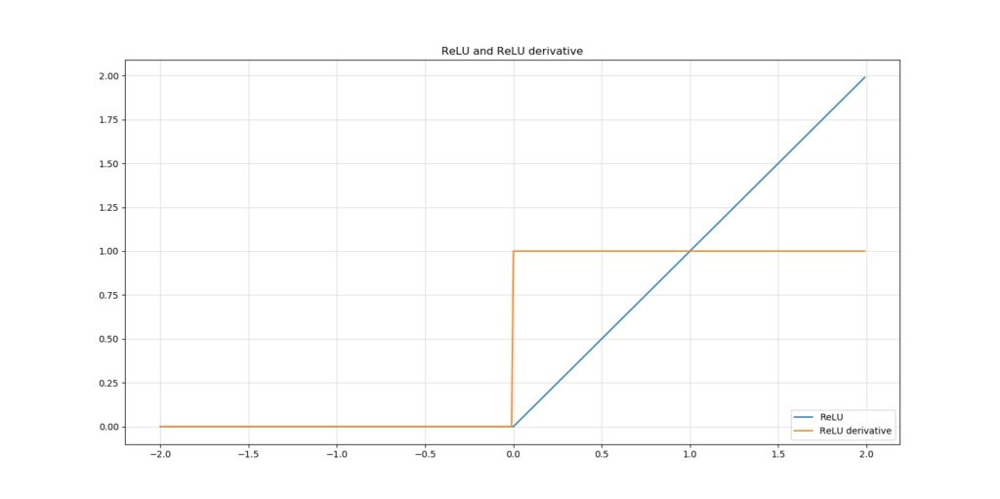

Deep learning models require to be initialized. Their layers have activation functions to make neuron outputs nonlinear. But how to initialize? And how to choose an activation function? We covered those questions in different blogs. Today, we'll cover a different topic:

**The intrinsic relationship between the Xavier and He initializers and certain activation functions.**

You're right, we focus on a niche within the overlap between weight initialization and activation functions - and cover how Xavier and He initializers require one to choose certain activation functions over others, and vice-versa.

However, if you're interested in the other topics, feel free to also read these blogs:

- [What is weight initialization?](https://machinecurve.com/index.php/2019/08/22/what-is-weight-initialization/)
- [Random initialization: vanishing and exploding gradients](https://machinecurve.com/index.php/2019/08/30/random-initialization-vanishing-and-exploding-gradients/)
- [ReLU, Sigmoid and Tanh: today's most used activation functions](https://machinecurve.com/index.php/2019/09/04/relu-sigmoid-and-tanh-todays-most-used-activation-functions/)

Let's go! :-) After reading this article, you will understand...

- The basics of weight initialization.
- Why choosing an initializer depends on your choice for activation functions.
- How He and Xavier initialization must be applied differently.

* * *

**Update 05/Feb/2021:** ensured that article is up to date.

**Update 07/Oct/2020:** clarified the meaning of \[latex\]N\[/latex\] in the initialization strategies.

* * *

\[toc\]

* * *

## Recap: the ingredients of this blog

Before I can make my point with respect to the He and Xavier initializers and their relationships to activation functions, we must take a look at the individual ingredients of this blog first. With those, I mean weight initialization and activation functions. We'll briefly cover these next and also provide links to blogs that cover them in more detail.

Subsequently, we move on to He and Xavier initialization and our final point. However, if you're well aware of initializers and activation functions, feel free to skip this section altogether. It must be all very familiar to you.

### What is initialization?

Neural networks are collections of neurons - that's nothing strange.

But how do neurons operate?

By producing an operation called a _dot product_ between a _weights vector_ and an _input vector_. A _bias value_ is added to this product and the whole is subsequently passed to an _activation function_.

Since all neurons do this, a system emerges that can adapt to highly complex data.

During optimization, which occurs every time data is fed to the network (either after each sample or after all of them, or somewhere in between), the _weights vectors_ are slightly adapted to simply better cover the patterns represented by the training set.

However, you'll need to start somewhere - the weights vectors cannot be empty once you start training. Hence, they must be initialized. _That's_ weight initialization.

_Read more about initialization here: [What is weight initialization?](https://machinecurve.com/index.php/2019/08/22/what-is-weight-initialization/)_

#### Initializers

Weight initialization is performed by means of an initializer. There are many ways of initializing your neural network, of which some are better - or, more nicely, less naïve - than others. For example, you may choose to initialize your weights as zeros, but then your model won't improve.

Additionally, you may also choose to initialize them randomly. We then get somewhere, but face the vanishing and exploding gradient problems.

_If you wish to understand more about initializers, click the link above_ 👆

#### Vanishing & exploding gradients

When you initialize your weights randomly, the values are probably close to zero given the probability distributions with which they are initialized. Since optimization essentially chains the optimizations in the 'downstream' layers (i.e., the ones closer to the output) when calculating the weights improvement in the 'upstream' ones (e.g., the one you're currently trying to optimize), you'll face either two things:

- When your weights and hence your gradients are close to zero, the gradients in your upstream layers **vanish** because you're multiplying small values and e.g. 0.1 x 0.1 x 0.1 x 0.1 = 0.0001. Hence, it's going to be difficult to find an optimum, since your upstream layers learn slowly.
- The opposite can also happen. When your weights and hence gradients are > 1, multiplications become really strong. 10 x 10 x 10 x 10 = 1000. The gradients may therefore also **explode**, causing number overflows in your upstream layers, rendering them untrainable (even dying off the neurons in those layers).

In both cases, your model will never reach its theoretical optimum. We'll see that He and Xavier initializers will substantially safeguard yourself from the vanishing and exploding gradients problems. However, let's briefly recap on activation functions first.

_Read more about vanishing and exploding gradients here:_  
_[Random initialization: vanishing and exploding gradients](https://machinecurve.com/index.php/2019/08/30/random-initialization-vanishing-and-exploding-gradients/)_

### What are activation functions?

As we saw in the recap on weight initialization, neural networks are essentially a system of individual neurons, which produce outputs given an input (being the _input vector_).

If we don't add activation functions, we find our network to behave poorly: it simply does not converge well to your real-world data.

Why is that the case?

The operation, without the activation function, is _linear_: you simply multiply values and add a bias value. That's some linear operations.

Hence, without the activation function, your model will behave as if it is linear. That, we don't want, because real world data is pretty much always nonlinear.

Therefore, activation functions enter the playing field.

An activation is a mathematical function that simply takes an input which may or may not be linear (it just takes any real valued number) and converts it into another real valued number. Since the function _itself_ behaves nonlinearly, the neural network will behave as such too. We can now handle much more complex data. Great!

#### ReLU, Sigmoid and Tanh

In today's world, there are three widely used activation functions: Rectified Linear Unit (ReLU), Sigmoid and Tanh. ReLU is most widely used because it is an improvement over Sigmoid and Tanh. Nevertheless, improvement is still possible, as we can see by clicking the link below 👇

_Read more about activation functions here: [ReLU, Sigmoid and Tanh: today’s most used activation functions](https://machinecurve.com/index.php/2019/09/04/relu-sigmoid-and-tanh-todays-most-used-activation-functions/)_

* * *

## He and Xavier initialization against gradient issues

In his paper _[On weight initialization in deep neural networks](https://arxiv.org/abs/1704.08863)_, Siddharth Krishna Kumar identifies mathematically what the problem is with vanishing and exploding gradients and why He and Xavier (or Glorot) initialization do work against this problem.

He argues as follows:

**Deep neural networks face the difficulty that variance of the layer outputs gets lower the more upstream the data you go.**

The problem with this is what we've seen in our post about _vanishing gradients_: slow model convergence.

The problem with this is what we've seen in our post about _vanishing gradients_: slow model convergence.

In _[Why are deep neural networks hard to train?](http://neuralnetworksanddeeplearning.com/chap5.html)_, the author of the Neural Networks and Deep Learning website helps us illustrate Kumar's point by means of the Sigmoid activation function.

Suppose that your neural networks are equipped with the Sigmoid activation function. The neuron outputs will flow through this function to become nonlinear, and the Sigmoid derivative will be used during optimization:

Sigmoid and its derivative

As you can see, there are two problems with the Sigmoid function and its behavior during optimization:

- When variance is really high, the _absolute value_ of the gradient will be low and the network will learn very slowly;
- When variance is really _low_, the gradient will move in a very small range, and hence the network will also learn very slowly.

This especially occurs when weights are drawn from a [standard normal distribution](https://machinecurve.com/index.php/2019/08/30/random-initialization-vanishing-and-exploding-gradients/), since weights will also be < 1 and > -1.

Kumar argued that it's best to have variances of ≈ 1 through all layers. This way, slow learning can be mitigated quite successfully. The fun thing is, He and Xavier initialization attempt to ensure such variance in layer outputs by default. But first, a brief look into the sensitivity of ReLU.

* * *

### Why is ReLU less sensitive to this problem?

In general, we therefore use [ReLU as our activation function of general choice](https://machinecurve.com/index.php/2019/09/04/relu-sigmoid-and-tanh-todays-most-used-activation-functions/).

This is ReLU and its derivative:

As you can see, the derivative of ReLU behaves differently. If the original input is < 0, the derivative is 0, else it is 1. This observation emerges from the way ReLU is designed.

Hence, it does no longer matter whether the variance is 1 or 100; in the both positive and negative numbers drawn from such a sample, the gradient will always be zero or one. Hence, it's not bothered much by vanishing and exploding gradients, contrary to Sigmoid and tanh.

Let's now take a look at He and Xavier initialization.

### Xavier initialization

In his work, Kumar argued that when variance of the layer outputs (and hence the downstream layer inputs) is not ≈ 1, depending on the activation function, models will converge more slowly, especially when these are < 1.

For "activation functions differentiable at 0", Kumar derives a generic weight initialization strategy. With this strategy, which essentially assumes random initialization from e.g. the standard normal distribution but then with a specific variance that yields output variances of 1, he derives the so-called "Xavier initialization" for the Tanh activation function:

\\begin{equation} v^{2} = 1/N \\end{equation}

### He initialization

When your neural network is ReLU activated, He initialization is one of the methods you can choose to bring the variance of those outputs to approximately one (He et al., 2015).

Although it attempts to do the same, He initialization is different than Xavier initialization (Kumar, 2017; He et al., 2015). This difference is related to the nonlinearities of the ReLU activation function, which make it non-differentiable at \[latex\]x = 0\[/latex\]. However, Kumar indeed proves mathematically that for the ReLU activation function, the best weight initialization strategy is to initialize the weights randomly but with this variance:

\\begin{equation} v^{2} = 2/N \\end{equation}

...which is He initialization.

* * *

## Summary: choose wisely

Weight initialization is very important, as "all you need is a good init" (Mishkin & Matas, 2015). It's however important to choose a proper weight initialization strategy in order to maximize model performance. We've seen that such strategies are dependent on the activation functions that are used in the model.

For Tanh based activating neural nets, the Xavier initialization seems to be a good strategy, which essentially performs random initialization from a distribution with a variance of \[latex\]1/N\[/latex\].

Here, \[latex\]N\[/latex\] is the number of input neurons to a particular layer.

For Sigmoid based activation functions, this is not the case, as was derived in the Kumar paper (Kumar, 2017).

ReLU activating networks, which are pretty much the standard ones today, benefit from the He initializer - which does the same thing, but with a different variance, namely \[latex\]2/N\[/latex\].

This way, your weight init strategy is pinpointed to your neural net's ideosyncrasies, which at least theoretically makes it better. I'm looking forward to hearing from your experience as to whether you also see these results in practice. Leave a comment below if you're feeling like sharing 👇

Thanks for reading and happy engineering! 😄

* * *

## References

Kumar, S. K. (2017). On weight initialization in deep neural networks. _CoRR_, _abs/1704.08863_. Retrieved from [http://arxiv.org/abs/1704.08863](http://arxiv.org/abs/1704.08863)

He, K., Zhang, X., Ren, S., & Sun, J. (2015). Delving Deep into Rectifiers: Surpassing Human-Level Performance on ImageNet Classification. _2015 IEEE International Conference on Computer Vision (ICCV)_. [doi:10.1109/iccv.2015.123](http://doi.org/10.1109/iccv.2015.123)

Mishkin, D., & Matas, J. (2015). All you need is a good init. _arXiv preprint arXiv:1511.06422_. Retrieved from [https://arxiv.org/abs/1511.06422](https://arxiv.org/abs/1511.06422)

Neural networks and deep learning. (n.d.). Why are deep neural networks hard to train? Retrieved from [http://neuralnetworksanddeeplearning.com/chap5.html](http://neuralnetworksanddeeplearning.com/chap5.html)
