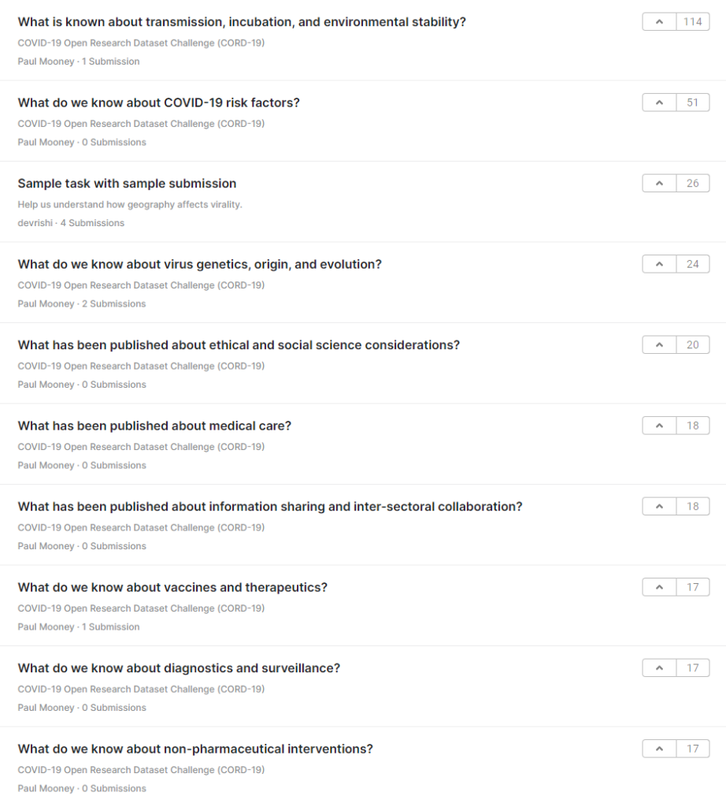

We all know it by now: the novel coronavirus, resulting in COVID-19, is spreading across the globe. In haste, governments are taking unprecedented measures such as total lockdown (France and Italy) and controlled spread (Netherlands). In doing so, they attempt to reduce the impact of the virus on the countries' health systems, awaiting a vaccine to be developed and considered safe.

However, we as data science, data engineering and machine learning communities might just be able to help fight the virus - especially in times where other work _might_ be getting less.

The CORD-19 challenge is a Kaggle challenge launched by the Allen Institute for AI in partnership with the Chan Zuckerberg Initiative, Georgetown University’s Center for Security and Emerging Technology, Microsoft Research, and the National Library of Medicine - National Institutes of Health, in coordination with The White House Office of Science and Technology Policy.

_COVID-19 picture: Miguel Á. Padriñán_, _Pexels.com_

## The challenge

It comes with a dataset of more than 29.000 scholarly articles:

> In response to the COVID-19 pandemic, the White House and a coalition of leading research groups have prepared the COVID-19 Open Research Dataset (CORD-19). CORD-19 is a resource of over 29,000 scholarly articles, including over 13,000 with full text, about COVID-19, SARS-CoV-2, and related coronaviruses. This freely available dataset is provided to the global research community to apply recent advances in natural language processing and other AI techniques to generate new insights in support of the ongoing fight against this infectious disease. There is a growing urgency for these approaches because of the rapid acceleration in new coronavirus literature, making it difficult for the medical research community to keep up.
>
> [COVID-19 Open Research Dataset Challenge (CORD-19)](https://www.kaggle.com/allen-institute-for-ai/CORD-19-research-challenge)

## Tasks

There is a wide range of tasks available, each with $1000 euro in prizes for the winner, sponsored by Kaggle:

If you have some spare time, it might definitely be worth a look - and perhaps, even a try. [Click here to go to the challenge.](https://www.kaggle.com/allen-institute-for-ai/CORD-19-research-challenge)
