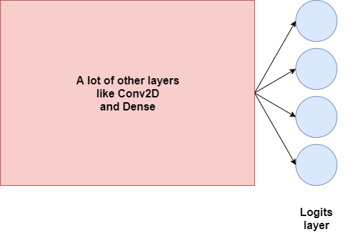
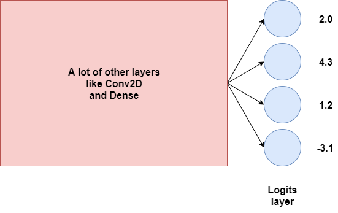
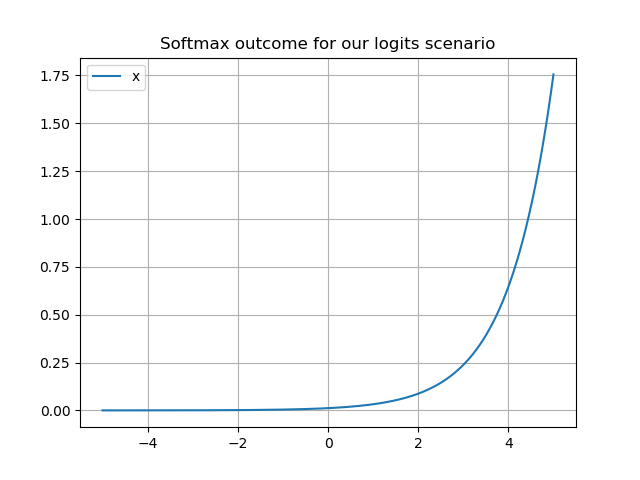
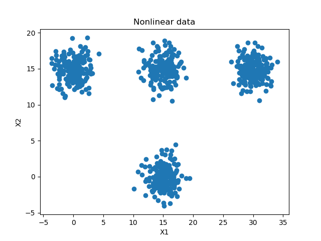

When you're creating a neural network for classification, you're likely trying to solve either a binary or a multiclass classification problem. In the latter case, it's very likely that the activation function for your final layer is the so-called **Softmax activation function**, which results in a multiclass probability distribution over your target classes.

However, what is this activation function? How does it work? And why does the way it work make it useful for use in neural networks? Let's find out.

In this blog, we'll cover all these questions. We first look at how Softmax works, in a primarily intuitive way. Then, we'll illustrate why it's useful for neural networks/machine learning when you're trying to solve a multiclass classification problem. Finally, we'll show you how to use the Softmax activation function with deep learning frameworks, by means of an example created with Keras.

This allows you to understand what Softmax is, what it does and how it can be used.

Ready? Let's go! 😎

* * *

\[toc\]

* * *

## How does Softmax work?

Okay: Softmax. It always "returns a probability distribution over the target classes in a multiclass classification problem" - these are often my words when I have to explain intuitively how Softmax works.

But let's now dive in a little bit deeper.

What does "returning a probability distribution" mean? And why is this useful when we wish to perform multiclass classification?

### Logits layer and logits

We'll have to take a look at the structure of a neural network in order to explain this. Suppose that we have a neural network, such as the - very high-level variant - one below:

[](https://www.machinecurve.com/wp-content/uploads/2020/01/logits.png)

The final layer of the neural network, _without the activation function_, is what we call the **"logits layer"** (Wikipedia, 2003). It simply provides the final outputs for the neural network. In the case of a four-class multiclass classification problem, that will be four neurons - and hence, four outputs, as we can see above.

Suppose that these are the outputs, or our **logits**:

[](https://www.machinecurve.com/wp-content/uploads/2020/01/logits_with_outputs.png)

These essentially tell us something about our target classes, but from the outputs above, we can't make sense of it yet.... are they likelihoods? No, because can we have a negative one? Uh...

### Multiclass classification = generating probabilities

In a way, however, _predicting_ which target class some input belongs to is related to a _probability distribution_. For the setting above, if you would know the probabilities of the value being any of the four possible outcomes, you could simply take the \[latex\]argmax\[/latex\] of these discrete probabilities and find the class outcome. Hence, if we could convert the logits above into a probability distribution, that would be awesome - we'd be there!

Let's explore this idea a little bit further :)

If we would actually want to convert our logits into a probability distribution, we'll need to first take a look at what a probability distribution is.

#### Kolmogorov's axioms

From probability theory class at university, I remember that probability theory as a whole can be described by its foundations, the so-called probability axioms or Kolmogorov's axioms. They are named after Andrey Kolmogorov, who introduced the axioms in 1933 (Wikipedia, 2001).

They are as follows (Wikipedia, 2001):

- The probability of something to happen, a.k.a. an event, is a non-negative real number.
- The probability that at least one of the events in the distribution occurs is 1, i.e. the sum of all the individual probabilities is 1.
- That the probability of a sequence of disjoint sets occurring equals the sum of the individual set probabilities.

For reasons of clarity: in percentual terms, 1 = 100%, and 0.25 would be 25%.

Now, the third axiom is not so much of interest for today's blog post, but the first two are.

From them, it follows that _the odds of something to occur_ must be a positive real number, e.g. \[latex\]0.238\[/latex\]. Since the sum of probabilities must be equal to \[latex\]1\[/latex\], no probability can be \[latex\]> 1\[/latex\]. Hence, any probability therefore lies somewhere in the range \[latex\]\[0, 1\]\[/latex\].

Okay, we can work with that. However, there's one more explanation left before we can explore possible approaches towards converting the logits into a multiclass probability distribution: the difference between a _continuous_ and a _discrete_ probability distribution.

#### Discrete vs continuous distributions

To deepen our understanding of the problem above, we'll have to take a look at the differences between discrete and continuous probability distribution.

According to Wikipedia (2001), this is a discrete probability distribution:

> A **discrete probability distribution** is a probability distribution that can take on a countable number of values.
>
> Wikipedia (2001): Discrete probability distribution

A continuous one, on the other hand:

> A **continuous probability distribution** is a probability distribution with a cumulative distribution function that is [absolutely continuous](https://en.wikipedia.org/wiki/Absolute_continuity).
>
> Wikipedia (2001): Continuous probability distribution

So, while a discrete distribution can take a certain amount of values - four, perhaps ;-) - and is therefore rather 'blocky' with one probability per value, a continuous distribution can take _any_ value, and probabilities are expressed as being in a range.

### Towards a discrete probability distribution

As you might have noticed, I already gave away the answer as to whether the neural network above benefits from converting the logits into a _discrete_ or _continuous_ distribution.

To play captain obvious: it's a discrete probability distribution.

For each outcome (each neuron represents the outcome for a target class), we'd love to know the individual probabilities, but of course they must be relative to the other target classes in the machine learning problem. Hence, probability distributions, and specifically discrete probability distributions, are the way to go! :)

But how do we convert the logits into a probability distribution? We use Softmax!

### The Softmax function

The Softmax function allows us to express our inputs as a discrete probability distribution. Mathematically, this is defined as follows:

\[latex\]Softmax(x \_i ) = \\frac{exp(x\_i)}{\\sum{\_j}^ {} {} exp(x\_j))}\[/latex\]

Intuitively, this can be defined as follows: for each value (i.e. input) in our input vector, the Softmax value is the _exponent of the individual input_ divided by a sum of _the exponents of all the inputs_.

This ensures that multiple things happen:

- Negative inputs will be converted into nonnegative values, thanks to the exponential function.
- Each input will be in the interval \[latex\](0, 1)\[/latex\].
- As the _denominator_ in each Softmax computation is the same, the values become proportional to each other, which makes sure that together they sum to 1.

This, in return, allows us to "interpret them as probabilities" (Wikipedia, 2006). Larger input values correspond to larger probabilities, at exponential scale, once more due to the exponential function.

Let's now go back to the initial scenario that we outlined above.

[](https://www.machinecurve.com/wp-content/uploads/2020/01/logits_with_outputs.png)

We can now convert our logits into a discrete probability distribution:

| **Logit value** | Softmax computation | Softmax outcome |
| --- | --- | --- |
| 2.0 | \[latex\] \\frac{exp(x\_i)}{\\sum{\_j}^ {} {} exp(x\_j))} = \\frac{exp(2.0)}{exp(2.0) + exp(4.3) + exp(1.2) + exp(-3.1)} \[/latex\] | 0.087492 |
| 4.3 | \[latex\] \\frac{exp(x\_i)}{\\sum{\_j}^ {} {} exp(x\_j))} = \\frac{exp(4.3)}{exp(2.0) + exp(4.3) + exp(1.2) + exp(-3.1)} \[/latex\] | 0.872661 |
| 1.2 | \[latex\] \\frac{exp(x\_i)}{\\sum{\_j}^ {} {} exp(x\_j))} = \\frac{exp(1.2)}{exp(2.0) + exp(4.3) + exp(1.2) + exp(-3.1)} \[/latex\] | 0.039312 |
| \-3.1 | \[latex\] \\frac{exp(x\_i)}{\\sum{\_j}^ {} {} exp(x\_j))} = \\frac{exp(-3.1)}{exp(2.0) + exp(4.3) + exp(1.2) + exp(-3.1)} \[/latex\] | 0.000292 |
| **Sum** |  | 0.999757 |
| **(rounded)** |  | 1 |

Let's see if the outcome adheres to Kolmogorov's probability axioms that we discussed above, to verify whether it really _is_ a valid probability distribution :)

1. **Each probability must be a nonzero real number**. This is true for our outcomes: each is real-valued, and nonzero.
2. **The sum of probablities must be 1**. This is also true for our outcomes: the sum of cutoff values is \[latex\]\\approx 1\[/latex\], due to the nature of real-valued numbers. The _true_ sum is 1.

In fact, for our logits scenario, any input would satisfy these values. First of all, the denominator for any of the inputs would be the same, so they are normalized into the \[latex\](0, 1)\[/latex\] range, summing together to 1. What's more, as we can see, due to the nature of the exponential function, any input indeed yields a nonzero real number when fed to the Softmax function:

[](https://www.machinecurve.com/wp-content/uploads/2020/01/softmax_logits.png)

This also explains why our \[latex\]logit = 4.3\[/latex\] produces such a large probability of \[latex\]p \\approx 0.872661\[/latex\] :)

This, in return, means: hooray, we can use Softmax for generating a probability distribution! 🎉

...but we still don't know _why_ Softmax and its distribution-generating characteristics make it so useful for training neural networks. Let's find out :)

* * *

## Why Softmax in neural networks?

If we're looking for an answer to why Softmax is so useful for neural networks, we'll have to look at three things.

Firstly, we'll have to explore why we cannot use argmax directly instead of approximating its outcome with Softmax.

Then, we'll have to look at the benefits of using exponents over traditional normalization and at the benefits of using Euler's constant as the base for the exponent.

Finally, we're going to find out what this means for the optimization process, and why this is exactly what we want from a neural net.

### Why no argmax directly?

Recall that we have a neural network with a logits layer that has these outputs:

[](https://www.machinecurve.com/wp-content/uploads/2020/01/logits_with_outputs.png)

If you're thinking very strictly today, you may wonder about this: why don't we simply take the `argmax` value as our activation function? Doesn't it provide you with the same result?

That is, with \[latex\]\\textbf{x} = \[2.0, 4.3, 1.2, -3.1\]\[/latex\] being the input to some `argmax` function, the output would be \[latex\]\[0, 1, 0, 0\]\[/latex\]. This is great, because we now have the output value!

But is it correct?

We don't know, as we don't know what our input is. If we did, we could check.

Now suppose that we input an image that should have been class 4. This is problematic, as our output is \[latex\]\[0, 1, 0, 0\]\[/latex\] - or class 2!

We'd need to improve!

By default, in neural networks, optimization techniques like [gradient descent](https://www.machinecurve.com/index.php/2019/10/24/gradient-descent-and-its-variants/) or [adaptive optimizers](https://www.machinecurve.com/index.php/2019/11/03/extensions-to-gradient-descent-from-momentum-to-adabound/) are used for this purpose. For each trainable parameter, backpropagation computes the gradient with respect to the [loss value](https://www.machinecurve.com/index.php/2019/10/04/about-loss-and-loss-functions/) and the intermediate layers, and the optimizer subsequently adapts the weights of the parameter.

But this requires that a function is differentiable. And `argmax` is not, or useless if it were (Shimis, n.d.). Either, the gradient is zero almost everywhere (because if you move a really small bit on the argmax function, the outputs will remain the same), or even undefined, as argmax is not continuous (Shimis, n.d.). By consequence, argmax cannot be used when training neural networks with gradient descent based optimization.

Softmax can: besides having nice properties with regards to normalization (as we saw before), it can be differentiated. Hence, it's very useful for optimizing your neural network.

Now, you may wonder: all right, I believe that I can't use argmax. But why do I have to use Softmax instead? Why can't I just normalize without any exponents (Vega, n.d.)?

### Benefits of the exponent

That is, instead of writing...

\[latex\] \\frac{exp(x\_i)}{\\sum{\_j}^ {} {} exp(x\_j))} = \\frac{exp(2.0)}{exp(2.0) + exp(4.3) + exp(1.2) + exp(-3.1)} \[/latex\]

...you would want to write...

\[latex\]\\frac{2.0}{2.0 + 4.3 + 1.2 + -3.1}\[/latex\]

It makes perfect sense, but let's now take a look at what we _want_ our output to be. Even though we don't use it, don't we want our output to be like argmax? That the actual class arrives on top?

Now take a look at our logits.

With argmax, they would convert to:

| **Logit value** | Argmax computation | Argmax outcome |
| --- | --- | --- |
| 2.0 | \[latex\]argmax(2.0, 4.3, 1.2, -3.1)\[/latex\] | \[latex\]\[0, 1, 0, 0\]\[/latex\] |
| 4.3 | \[latex\]argmax(2.0, 4.3, 1.2, -3.1)\[/latex\] | \[latex\]\[0, 1, 0, 0\]\[/latex\] |
| 1.2 | \[latex\]argmax(2.0, 4.3, 1.2, -3.1)\[/latex\] | \[latex\]\[0, 1, 0, 0\]\[/latex\] |
| \-3.1 | \[latex\]argmax(2.0, 4.3, 1.2, -3.1)\[/latex\] | \[latex\]\[0, 1, 0, 0\]\[/latex\] |

As we saw before, our Softmax converts to \[latex\]\[0.09, 0.87, 0.04, 0.00\]\[/latex\]. This is really close!

But what would happen with "normal", or exponent-free, division?

| **Logit value** | Regular division | Argmax outcome |
| --- | --- | --- |
| 2.0 | \[latex\]\\frac{2.0}{2.0 + 4.3 + 1.2 + -3.1}\[/latex\] | 0.454 |
| 4.3 | \[latex\]\\frac{4.3}{2.0 + 4.3 + 1.2 + -3.1}\[/latex\] | 0.978 |
| 1.2 | \[latex\]\\frac{1.2}{2.0 + 4.3 + 1.2 + -3.1}\[/latex\] | 0.273 |
| \-3.1 | \[latex\]\\frac{-3.1}{2.0 + 4.3 + 1.2 + -3.1}\[/latex\] | \-0.704 ??? 😕 |

As we can see, the values no longer make sense, and do even no longer adhere to Kolmogorov's axioms to represent a valid probability distribution!

Hence, we use Softmax.

Now, one final question: why do we use the base of the natural logarithm \[latex\]e\[/latex\] with Softmax? Why don't we use a constant, say, \[latex\]f(x) = 3^x\[/latex\] instead of \[latex\]f(x) = e^x\[/latex\]?

This has to do with the derivatives (Vega, n.d.; CliffsNotes, n.d.):

- For \[latex\]f(x) = e^x\[/latex\], the derivative is \[latex\]f'(x) = e^x\[/latex\].
- For \[latex\]f(x) = a^x\[/latex\], where \[latex\]a\[/latex\] is some constant, the derivative is \[latex\]f'(x) = (\\ln(a)) \* a^x\[/latex\].

The derivative for \[latex\]e^x\[/latex\] is thus much nicer, and hence preferred.

### Maximizing logit values for class outcomes

All right. We can use Softmax to generate a discrete probability distribution over the target classes, as represented by the neurons in the logits layer.

Now, before we'll work on an example model with Keras, it's time to briefly stop and think about what happens during optimization.

As you likely know, during the forward pass in the [high-level supervised machine learning process](https://www.machinecurve.com/index.php/2019/10/04/about-loss-and-loss-functions/#the-high-level-supervised-learning-process), your training data is fed to the model. The predictions are compared with the ground truth, i.e. the targets, and eventually summarized in a loss value. Based on this loss value, backpropagation computes the gradient for improvement, and the optimizer subsequently performs this improvement based on its ideosyncrasies. This iterative process stops when the model performs adequately enough.

So far so good, but what happens when you design a neural network with `num_classes` output neurons, as well as a Softmax layer?

It's important to understand for reasons of practicality that likely, your model will learn to map certain classes to certain logits, i.e. it learns to maximize certain logit values for certain class outcomes. Doing so, the training process effectively learns to "steer" inputs to outputs, generating a practically useful machine learning model.

This is good: for new inputs from some class, the odds increase that the class outcome equals the ground truth. This, with the other reasons from above, is why Softmax is so useful for neural networks.

Let's now take a look at an example :)

* * *

## Softmax example with Keras

Now, let's move from theory to practice - we're going to code!

In fact, we're going to code an example model with Keras that makes use of the Softmax function for classification. More specifically, it's going to be a densely-connected neural network that will learn to classify samples into one of four classes. Fortunately (...and as intended 🤡), the training data (which we'll generate as part of the process) is separable in 2D space, albeit not linearly:

[](https://www.machinecurve.com/wp-content/uploads/2020/01/example_nonlinear.png)

Time to open up your editor and start coding! 😎

### Imports

First, we'll define a few imports:

```python
'''
  Keras model to demonstrate Softmax activation function.
'''
import keras
from keras.models import Sequential
from keras.layers import Dense
from keras.utils import to_categorical
import matplotlib.pyplot as plt
import numpy as np
from sklearn.datasets import make_blobs
```

Most importantly, we use Keras and a few of its modules to build the model. Under the hood, it will run on Tensorflow. Additionally, we'll import Matplotlib's Pyplot library for visualizing the data, Numpy for number processing and Scikit-learn for generating the data.

Therefore, make sure that you have these dependencies installed before you run this model. In the simplest case, you can install them with `pip install`:

```shell
pip install keras tensorflow matplotlib numpy scikit-learn
```

(however, you might wish to install them with Anaconda instead!)

### Model config

Next up is the model configuration. We define here how many samples we'll generate, how much of them are used for _testing_ the trained model (250), where in 2D space our clusters are located, how many clusters we've got and which loss function is to be used (indeed, as we expect with Softmax activation at our final layer, [categorical crossentropy loss](https://www.machinecurve.com/index.php/2019/10/22/how-to-use-binary-categorical-crossentropy-with-keras/)).

```python
# Configuration options
num_samples_total = 1000
training_split = 250
cluster_centers = [(15,0), (15,15), (0,15), (30,15)]
num_classes = len(cluster_centers)
loss_function_used = 'categorical_crossentropy'
```

### Generating data

After configuring our model, it's time to generate some data. We use Scikit-Learn's `make_blobs` for this purpose, which allows us to generate clusters of samples as illustrated in the plot above. We generate them according to our config, i.e., based on the cluster centers, the number of samples to be generated in total and the number of classes we want.

```python
# Generate data
X, targets = make_blobs(n_samples = num_samples_total, centers = cluster_centers, n_features = num_classes, center_box=(0, 1), cluster_std = 1.5)
categorical_targets = to_categorical(targets)
X_training = X[training_split:, :]
X_testing = X[:training_split, :]
Targets_training = categorical_targets[training_split:]
Targets_testing = categorical_targets[:training_split].astype(np.integer)
```

Once data has been generated, we can convert the targets into one-hot encoded vectors, in order to make them compatible with [categorical crossentropy loss](https://www.machinecurve.com/index.php/2019/10/22/how-to-use-binary-categorical-crossentropy-with-keras/). Finally, we make the split between training and testing data.

Once this is done, we can set the shape of our input data, as we know this by now:

```python
# Set shape based on data
feature_vector_length = len(X_training[0])
input_shape = (feature_vector_length,)
print(f'Feature shape: {input_shape}')
```

We can also generate the visualization you saw earlier:

```python
plt.scatter(X_training[:,0], X_training[:,1])
plt.title('Nonlinear data')
plt.xlabel('X1')
plt.ylabel('X2')
plt.show()
```

### Model architecture

Now that we have imported the dependencies that we need and have configured the model, it's time to define its _architecture_.

It's going to be a very simple one; a densely-connected one, to be precise. It will have three layers, of which one is an output layer. The first layer takes in data of `input_shape` shape, activates by means of [ReLU](https://www.machinecurve.com/index.php/2019/09/04/relu-sigmoid-and-tanh-todays-most-used-activation-functions/) and hence requires [He weight init](https://www.machinecurve.com/index.php/2019/09/16/he-xavier-initialization-activation-functions-choose-wisely/). It has a (12, ) output shape.

The second layer works similarly, but learns has an (8, ) output shape instead.

The final layer, our output layer, learns `num_classes` outputs. As in our case, `num_classes = 4`, it aligns with the scenario we've been discussing throughout this blog post. What's more, rather than ReLU activation, it uses Softmax, so we'll end up with a multiclass probability distribution!

```python
# Create the model
model = Sequential()
model.add(Dense(12, input_shape=input_shape, activation='relu', kernel_initializer='he_uniform'))
model.add(Dense(8, activation='relu', kernel_initializer='he_uniform'))
model.add(Dense(num_classes, activation='softmax'))
```

### Compilation, data fitting and evaluation

We can subsequently compile (i.e. configure) the model based on the [loss function](https://www.machinecurve.com/index.php/2019/10/04/about-loss-and-loss-functions/) we configured as well as the [optimizer](https://www.machinecurve.com/index.php/2019/11/03/extensions-to-gradient-descent-from-momentum-to-adabound/) we want to use, and set additional metrics (accuracy due to the fact that it's intuitive for humans).

Then, we fit the training data to the model, train it for 30 iterations (epochs) and use a batch size of 5. 20% of the training data will be used for validation purposes and all output is shown on screen with verbosity mode set to True.

```python
# Configure the model and start training
model.compile(loss=loss_function_used, optimizer=keras.optimizers.adam(lr=0.001), metrics=['accuracy'])
history = model.fit(X_training, Targets_training, epochs=30, batch_size=5, verbose=1, validation_split=0.2)

# Test the model after training
test_results = model.evaluate(X_testing, Targets_testing, verbose=1)
print(f'Test results - Loss: {test_results[0]} - Accuracy: {test_results[1]*100}%')
```

Once data has been fit, it's time to test the model. We do so by means of `model.evaluate`, feeding it the testing data. The outcome is shown on screen.

If desired, the `history` object can be used to [visualize the training process](https://www.machinecurve.com/index.php/2019/10/08/how-to-visualize-the-training-process-in-keras/).

### Full model code

Here's the full model code, if you wish to start playing around right away:

```python
'''
  Keras model to demonstrate Softmax activation function.
'''
import keras
from keras.models import Sequential
from keras.layers import Dense
from keras.utils import to_categorical
import matplotlib.pyplot as plt
import numpy as np
from sklearn.datasets import make_blobs

# Configuration options
num_samples_total = 1000
training_split = 250
cluster_centers = [(15,0), (15,15), (0,15), (30,15)]
num_classes = len(cluster_centers)
loss_function_used = 'categorical_crossentropy'

# Generate data
X, targets = make_blobs(n_samples = num_samples_total, centers = cluster_centers, n_features = num_classes, center_box=(0, 1), cluster_std = 1.5)
categorical_targets = to_categorical(targets)
X_training = X[training_split:, :]
X_testing = X[:training_split, :]
Targets_training = categorical_targets[training_split:]
Targets_testing = categorical_targets[:training_split].astype(np.integer)

# Set shape based on data
feature_vector_length = len(X_training[0])
input_shape = (feature_vector_length,)
print(f'Feature shape: {input_shape}')

# Generate scatter plot for training data
plt.scatter(X_training[:,0], X_training[:,1])
plt.title('Nonlinear data')
plt.xlabel('X1')
plt.ylabel('X2')
plt.show()

# Create the model
model = Sequential()
model.add(Dense(12, input_shape=input_shape, activation='relu', kernel_initializer='he_uniform'))
model.add(Dense(8, activation='relu', kernel_initializer='he_uniform'))
model.add(Dense(num_classes, activation='softmax'))

# Configure the model and start training
model.compile(loss=loss_function_used, optimizer=keras.optimizers.adam(lr=0.001), metrics=['accuracy'])
history = model.fit(X_training, Targets_training, epochs=30, batch_size=5, verbose=1, validation_split=0.2)

# Test the model after training
test_results = model.evaluate(X_testing, Targets_testing, verbose=1)
print(f'Test results - Loss: {test_results[0]} - Accuracy: {test_results[1]*100}%')
```

## Results

Once run, you should find an extremely well-performing model (which makes sense, as the data is separable nonlinearly, which our model is capable of):

```
Test results - Loss: 0.002027431168593466 - Accuracy: 100.0%
```

Of course, in practice, your machine learning models will be more complex - and so will your data - but that wasn't the goal of this blog post. Rather, besides learning about Softmax in theory, you've now also seen how to apply it in practice ;)

* * *

## Summary

This blog post revolved around the Softmax activation function. What is it? How does it work? Why is it useful for neural networks? And how can we implement it in practice, using Keras? Those are the questions that we answered.

In doing so, we saw that Softmax is an activation function which converts its inputs - likely the logits, a.k.a. the outputs of the last layer of your neural network when no activation function is applied yet - into a discrete probability distribution over the target classes. Softmax ensures that the criteria of probability distributions - being that probabilities are nonnegative realvalued numbers and that the sum of probabilities equals 1 - are satisfied. This is great, as we can now create models that learn to maximize logit outputs for inputs that belong to a particular class, and by consequence also maximize the probability distribution. Simply taking \[latex\]argmax\[/latex\] then allows us to pick the class prediction, e.g. showing it on-screen in object detectors, image classifiers and text classifiers.

I hope you've learnt something today. If you did, I'd appreciate if you left a comment in the comments section below! 😊 Please do the same if you have any questions or when you have remarks, as I'll try to read everything and answer whenever possible.

For now, thank you for reading MachineCurve today and happy engineering! 😎

* * *

## References

Wikipedia. (2001, March 24). Probability distribution. Retrieved from [https://en.wikipedia.org/wiki/Probability\_distribution](https://en.wikipedia.org/wiki/Probability_distribution)

Wikipedia. (2001, September 13). Probability axioms. Retrieved from [https://en.wikipedia.org/wiki/Probability\_axioms](https://en.wikipedia.org/wiki/Probability_axioms)

Wikipedia. (2006, July 28). Softmax function. Retrieved from [https://en.wikipedia.org/wiki/Softmax\_function](https://en.wikipedia.org/wiki/Softmax_function)

Shimis. (n.d.). argmax differentiable? Retrieved from [https://www.reddit.com/r/MachineLearning/comments/4e2get/argmax\_differentiable](https://www.reddit.com/r/MachineLearning/comments/4e2get/argmax_differentiable)

Vega. (n.d.). In softmax classifier, why use exp function to do normalization? Retrieved from [https://datascience.stackexchange.com/a/24112](https://datascience.stackexchange.com/a/24112)

CliffsNotes. (n.d.). Differentiation of Exponential and Logarithmic Functions. Retrieved from [https://www.cliffsnotes.com/study-guides/calculus/calculus/the-derivative/differentiation-of-exponential-and-logarithmic-functions](https://www.cliffsnotes.com/study-guides/calculus/calculus/the-derivative/differentiation-of-exponential-and-logarithmic-functions)

Wikipedia. (2003, January 21). Logit. Retrieved from [https://en.wikipedia.org/wiki/Logit](https://en.wikipedia.org/wiki/Logit)
