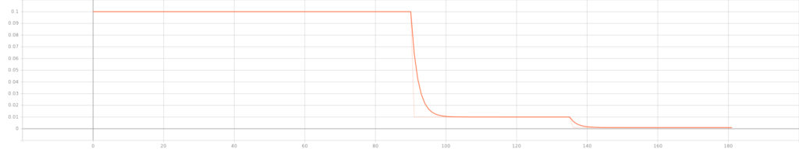
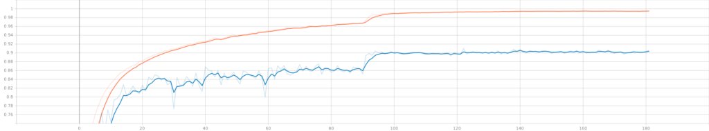

In computer vision, residual networks or ResNets are still one of the core choices when it comes to training neural networks. These networks, which implement building blocks that have skip connections _over_ the layers within the building block, perform much better than plain neural networks. In today's article, you're going to take a practical look at these neural network types, by building one yourself - from scratch!

After reading this tutorial, you will understand...

- **What residual networks (ResNets) are.**
- **How to build a configurable ResNet from scratch with TensorFlow and Keras.**
- **What performance can be achieved with a ResNet model on the CIFAR-10 dataset.**

In other words, by learning to build a ResNet from scratch, you will learn to understand what happens thoroughly.

Are you ready? Let's take a look! 😎

* * *

\[toc\]

* * *

## What are residual networks (ResNets)?

Training a neural network is really difficult. Especially in the early days of the _deep learning_ _revolution_, people often didn't know why their neural networks converged to an optimum... and neither why they did not.

If you're familiar with machine learning (and likely you are when reading this tutorial), you have heard about vanishing and exploding gradients. These two problems made training neural networks really difficult. However, interestingly and strangely, even when replacing classic activation functions with ReLU nonlinearities and adding Batch Normalization, a problem persisted. He et al. (2016) clearly described it in their paper _Deep residual learning for image recognition:_ a neural network that has more layers would possibly perform worse than one with fewer layers.

And this goes directly against what should be possible in theory. In fact, a neural network with more layers is increasingly able to learn the feature representations that are necessary for achieving good performance. But adding layers made performance worse. Strange, isn't it?

[Shattering gradients](https://www.machinecurve.com/index.php/2022/01/13/resnet-a-simple-introduction/#shattering-gradients-problem), where neural network gradients resemble white noise during optimization, may lie at the basis of this problem. And [residual networks](https://www.machinecurve.com/index.php/2022/01/13/resnet-a-simple-introduction/#introducing-residual-networks-resnets) or [ResNets](https://www.machinecurve.com/index.php/2022/01/13/resnet-a-simple-introduction/#introducing-residual-networks-resnets) for short help overcome this problem. A ResNet is a neural network that is composed of _residual building blocks_: weighted layers to which a _skip connection_ is added. This skip connection allows information to pass more freely, and gradients to be more realistic. The image below shows a residual building block:


Source: He, K., Zhang, X., Ren, S., & Sun, J. (2016). [Deep residual learning for image recognition.](https://openaccess.thecvf.com/content_cvpr_2016/papers/He_Deep_Residual_Learning_CVPR_2016_paper.pdf) In _Proceedings of the IEEE conference on computer vision and pattern recognition_ (pp. 770-778).

In practice, using today's deep learning libraries, building the skip connection is really easy. The skip connection \[latex\]\\textbf{x}\[/latex\] displayed in the image can simply be added to the output of the regular block. As you will see, however, this sometimes produces issues related to dimensionality and feature map size (i.e., width and height). He et al. describe two ways of resolving this, and you will explore both in the remainder of this tutorial:

- An **identity mapping**, which simply maps the input to the output, adding padding or reducing feature map size where necessary.
- A **projection mapping**, which uses convolutions to generate an output that 'clicks' onto the next residual building block.

If you're interested in the theory behind ResNets, you can [read this article](https://www.machinecurve.com/index.php/2022/01/13/resnet-a-simple-introduction/#introducing-residual-networks-resnets). Let's now take a closer look at building a simple ResNet. In today's tutorial, we're going to use TensorFlow 2 and Keras for doing so.

* * *

## Building a simple ResNet with TensorFlow

Now that you understand what residual networks are, it's time to build one! Today, you'll use TensorFlow and the Keras Sequential API for this purpose. But first, let's take a look at the dataset that you will be training your ResNet model on.

In creating the ResNet (more technically, the ResNet-20 model) we will follow the design choices made by He et al. (2016) as much as possible. That way, we hope to create a ResNet variant that is as proper as possible. Whenever we deviate from He et al.'s design decisions (and that happens only marginally), we will provide arguments for doing so.

### Today's dataset: CIFAR-10

The CIFAR-10 dataset is a widely known dataset in the world of computer vision.

> The CIFAR-10 dataset consists of 60000 32x32 colour images in 10 classes, with 6000 images per class. There are 50000 training images and 10000 test images.
>
> Krizhevsky (n.d.)

It is a slightly more complex dataset compared to MNIST and hence neural networks will have a bit more difficulty to achieve good performance on the dataset. As you can see in the image below, CIFAR-10 contains a broad range of common objects - like frog, truck, deer, automobile, and so forth.


### What you'll need to run this model

Now that you understand a few things about the dataset that you will be training the model with, it's time to get coding!

First, you'll need to ensure that you can actually _run_ the model. In other words, you'll need to make sure that you have all the dependencies installed onto your system.

For today's code, that will be relatively easy. You will need the following in order to run the model successfully:

- A recent version of Python.
- A recent version of the `numpy` package.
- Obviously, a recent version (2.x) of `tensorflow`, which comes with the Keras library for building a neural network.

### Let's start writing some code: TensorFlow imports

Enough theory for now - it's time to start writing some code!

Open up your code editor, create a file (e.g. `resnet.py`) or a Jupyter Notebook, and write down these imports:

```python
import os
import numpy as np
import tensorflow
from tensorflow.keras import Model
from tensorflow.keras.datasets import cifar10
from tensorflow.keras.layers import Add, GlobalAveragePooling2D,\
	Dense, Flatten, Conv2D, Lambda,	Input, BatchNormalization, Activation
from tensorflow.keras.optimizers import schedules, SGD
from tensorflow.keras.callbacks import TensorBoard, ModelCheckpoint
```

Let's take a brief look at why you will need them:

- With `os`, you will perform file IO operations - which makes sense given the fact that you're going to process some input data through a neural network.
- With `numpy`, abbreviated `np`, you will manipulate the input data per the paper's data augmentation choices - we will come back to that.
- Then, you'll import `tensorflow`. Besides the library itself, you will also need to import some sub dependencies:
    - You'll use the `Model` class for instantiating the ResNet that you will be creating.
    - Obviously, you'll need the `cifar10` dataset - it's nice that [Keras comes with datasets](https://www.machinecurve.com/index.php/2019/12/31/exploring-the-keras-datasets/) that can be used out of the box.
    - A variety of Keras layers are also necessary. These are all described in standard deep learning literature (e.g. [Conv2d](https://www.machinecurve.com/index.php/2020/03/30/how-to-use-conv2d-with-keras/) or [Dense](https://www.machinecurve.com/index.php/2019/07/27/how-to-create-a-basic-mlp-classifier-with-the-keras-sequential-api/)). Why they are necessary can be found in the He et al. (2016) paper.
    - You're going to implement the learning rate scheduler functionality as `schedules` and the Stochastic Gradient Descent optimizer for optimization purposes. If you're a TensorFlow expert, you'll recognize that weight decay as described in the He et al. paper is not a part of this optimizer. Once again, later in the tutorial, we'll come back to why we use regular SGD instead.
    - Finally, you'll also import some TensorFlow callbacks, being `TensorBoard` and `ModelCheckpoint` - for [visualizing your training results](https://www.machinecurve.com/index.php/2019/11/13/how-to-use-tensorboard-with-keras/) and [saving your model](https://www.machinecurve.com/index.php/2019/05/30/avoid-wasting-resources-with-earlystopping-and-modelcheckpoint-in-keras/), respectively.

### Model configuration

You will see that we rely heavily on Python definitions - atomic building blocks that can and will be reused throughout the code. The most widely used component from all the ones that you will create today is `model_configuration`, which serves to group and output tunable configuration options for your neural network.

Let's briefly walk through them.

First of all, you're going to load the input samples from the CIFAR-10 dataset, because you will need them for computing a few elements in this definition.

Then, you're writing the generic configuration:

- You specify the **width, height and the number of image channels** for a CIFAR-10 sample.
- You specify the **batch size**. We set it to 128, because it's one of the design decisions made by He et al.
- As CIFAR-10 has 10 classes, we set `**num_classes**` to 10.
- He et al. choose a **45/5 validation split**. As 5/(45+5) = 0.1, that's the value for our validation split. In other words, 90% of our `input_train` samples will be used for training, while 10% will be used for validation.
- Keras will run in **verbosity mode**. That is, it will write its outputs to the terminal, so that you have a better idea about training progress.
- In their paper, He et al. specify a value called **n**. Recall that it stands for the number of residual block groups and that it also relates to the number of layers present in your ResNet. In today's network, we set `n = 3`, yielding `6n + 2 = 20` layers. Indeed, we are building a ResNet-20 model. However, by simply tuning this value for `n`, you can easily change it into e.g. `6n + 2 = 6*9 + 2` or a ResNet-56 model.
- The **initial number of feature maps** is set by means of `init_fm_dim`. He et al. choose an initial value of 16 feature maps, which increases by a factor two when the feature map size halves.
- Recall that He et al. describe two **shortcut types** - the `identity` shortcut and the `projection` shortcut. In their work, they used the identity shortcut for their CIFAR-10 experiments. When training this network with identity shortcuts, you will find better performance compared to projection shortcuts, as described by the He et al. paper as well. However, by simply changing the variable, a different shortcut type will be used.
- Using the size of your training and validation (sub) datasets, the **number of steps per epoch** is computed. Here, we rely on another design decision made in the He et al. paper - namely that they trained their ResNet with **64000 iterations**. Using that maximum, we compute the number of steps per epoch for our training and validation data, as well as the number of epochs themselves.
- We then define some hyperparameter related options:
    - The **loss function** - which is [categorical crossentropy loss](https://www.machinecurve.com/index.php/2019/10/22/how-to-use-binary-categorical-crossentropy-with-keras/), a pretty standard loss function for [multiclass classification problems](https://www.machinecurve.com/index.php/2019/10/17/how-to-use-categorical-multiclass-hinge-with-keras/).
    - The **learning rate scheduler**. Initially, the optimizer will use a learning rate of `0.1`. This is a pretty intense learning rate. It will help you to achieve big leaps forward during your initial epochs, but you will subsequently overstep the optimum every time. This is why He et al. use learning rate scheduling in their ResNet - they divide the learning rate by 10 after 32000 and 48000 iterations (i.e., after 50% and 75% of training has completed). We can achieve this through TensorFlow's `PiecewiseConstantDecay`.
    - In the paper, He et al. discuss using **He initialization** and hence we set it as our initializer.
    - The final hyperparameter related option is choosing an **optimizer**. Here's where we differ slightly from the He et al. findings. In their work, they use Stochastic Gradient Descent (SGD) with the learning rate schedule discussed. They also use a momentum term of 0.9 and weight decay of 0.0001. When developing this ResNet, we found that the Adam optimizer did not work - but that was unexpected. However, we also found that the SGD with weight decay implementation in TensorFlow (more specifically, TensorFlow Addons' [SGDW optimizer](https://www.tensorflow.org/addons/api_docs/python/tfa/optimizers/SGDW)) did not work properly too! We could only reproduce results similar to those reported in the paper by using default _SGD_, with momentum, but without weight decay. That's why you'll use `SGD`.
- Finally, what remains is to initialize the two callbacks - the TensorBoard callback for visualizing your results and the ModelCheckpoint callback so that an instance of your model is saved after every epoch.
- Your configuration is returned as a Python dictionary.

Quite a bit of a discussion, I agree, but well - this allows you to keep configuration in one place! :D

```python
def model_configuration():
	"""
		Get configuration variables for the model.
	"""

	# Load dataset for computing dataset size
	(input_train, _), (_, _) = load_dataset()

	# Generic config
	width, height, channels = 32, 32, 3
	batch_size = 128
	num_classes = 10
	validation_split = 0.1 # 45/5 per the He et al. paper
	verbose = 1
	n = 3
	init_fm_dim = 16
	shortcut_type = "identity" # or: projection

	# Dataset size
	train_size = (1 - validation_split) * len(input_train) 
	val_size = (validation_split) * len(input_train) 

	# Number of steps per epoch is dependent on batch size
	maximum_number_iterations = 64000 # per the He et al. paper
	steps_per_epoch = tensorflow.math.floor(train_size / batch_size)
	val_steps_per_epoch = tensorflow.math.floor(val_size / batch_size)
	epochs = tensorflow.cast(tensorflow.math.floor(maximum_number_iterations / steps_per_epoch),\
		dtype=tensorflow.int64)

	# Define loss function
	loss = tensorflow.keras.losses.CategoricalCrossentropy(from_logits=True)

	# Learning rate config per the He et al. paper
	boundaries = [32000, 48000]
	values = [0.1, 0.01, 0.001]
	lr_schedule = schedules.PiecewiseConstantDecay(boundaries, values)

	# Set layer init
	initializer = tensorflow.keras.initializers.HeNormal()

	# Define optimizer
	optimizer_momentum = 0.9
	optimizer_additional_metrics = ["accuracy"]
	optimizer = SGD(learning_rate=lr_schedule, momentum=optimizer_momentum)

	# Load Tensorboard callback
	tensorboard = TensorBoard(
	  log_dir=os.path.join(os.getcwd(), "logs"),
	  histogram_freq=1,
	  write_images=True
	)

	# Save a model checkpoint after every epoch
	checkpoint = ModelCheckpoint(
		os.path.join(os.getcwd(), "model_checkpoint"),
		save_freq="epoch"
	)

	# Add callbacks to list
	callbacks = [
	  tensorboard,
	  checkpoint
	]

	# Create config dictionary
	config = {
		"width": width,
		"height": height,
		"dim": channels,
		"batch_size": batch_size,
		"num_classes": num_classes,
		"validation_split": validation_split,
		"verbose": verbose,
		"stack_n": n,
		"initial_num_feature_maps": init_fm_dim,
		"training_ds_size": train_size,
		"steps_per_epoch": steps_per_epoch,
		"val_steps_per_epoch": val_steps_per_epoch,
		"num_epochs": epochs,
		"loss": loss,
		"optim": optimizer,
		"optim_learning_rate_schedule": lr_schedule,
		"optim_momentum": optimizer_momentum,
		"optim_additional_metrics": optimizer_additional_metrics,
		"initializer": initializer,
		"callbacks": callbacks,
		"shortcut_type": shortcut_type
	}

	return config
```

### Loading the dataset

Because we just worked so hard, it's now time to create a very simple def - haha! :D

Using `load_dataset`, you will be able to load CIFAR-10 data. It returns four arrays with data:

- A combination of `(input_train, target_train)`, representing your training samples and their corresponding targets.
- Secondly, `(input_test, target_test)`, which covers your testing samples.

```python
def load_dataset():
	"""
		Load the CIFAR-10 dataset
	"""
	return cifar10.load_data()
```

### Preprocessing the dataset

Let's now take a look at what must be done for image preprocessing.

> The network inputs are 32×32 images, with the per-pixel mean subtracted.
>
> He et al. (2016)

Image _preprocessing wise_, there's only a small amount of preprocessing necessary - subtracting the per-pixel mean from each input image.

Then, He et al. also apply data augmentation to the input data:

- Adding 4 pixels on each side by means of padding.
- Randomly sampling a 32 x 32 pixel crop from the padded image or its horizontal flip.

> We follow the simple data augmentation in \[24\] for training: 4 pixels are padded on each side, and a 32×32 crop is randomly sampled from the padded image or its horizontal flip.
>
> He et al. (2016)

Let's now implement this in a definition called `preprocessed_dataset`. In the def, we'll be using `ImageDataGenerator`s for flowing the data, allowing us to specify a variety of data augmentation options.

...but unfortunately, performing padding and cropping is not part of TensorFlow's data augmentation options by default.

Fortunately, [on his website](https://jkjung-avt.github.io/keras-image-cropping/), Jung (2018) proposed a method for generating random crops of a specific size from an input image. Let's use these definitions and pay a lot of gratitude to the author:

```python
def random_crop(img, random_crop_size):
    # Note: image_data_format is 'channel_last'
    # SOURCE: https://jkjung-avt.github.io/keras-image-cropping/
    assert img.shape[2] == 3
    height, width = img.shape[0], img.shape[1]
    dy, dx = random_crop_size
    x = np.random.randint(0, width - dx + 1)
    y = np.random.randint(0, height - dy + 1)
    return img[y:(y+dy), x:(x+dx), :]


def crop_generator(batches, crop_length):
    """Take as input a Keras ImageGen (Iterator) and generate random
    crops from the image batches generated by the original iterator.
    SOURCE: https://jkjung-avt.github.io/keras-image-cropping/
    """
    while True:
        batch_x, batch_y = next(batches)
        batch_crops = np.zeros((batch_x.shape[0], crop_length, crop_length, 3))
        for i in range(batch_x.shape[0]):
            batch_crops[i] = random_crop(batch_x[i], (crop_length, crop_length))
        yield (batch_crops, batch_y)
```

We can implement them in our `preprocessed_dataset` def.

- First, you load the dataset arrays with `load_dataset()`.
- You'll then retrieve some necessary configuration options from the configuration dictionary.
- You now use `tensorflow.pad` to pad 4 pixels on each side in the 2nd and 3rd dimension of your input data. Recall that in TensorFlow, which follows a channels-last strategy, a batch of data can be described as being `(batch_size, rows, cols, channels)`. We don't need to manipulate the batch size or the channels, only the rows and columns. That's why we use these dimensions only.
- Then, you convert the scalar targets (i.e., integer values) into categorical format by means of [one-hot encoding](https://www.machinecurve.com/index.php/2020/11/24/one-hot-encoding-for-machine-learning-with-tensorflow-and-keras/). This way, you'll be able to use categorical crossentropy loss.
- Now, you define a data generator for your training data. A data generator will make available some inputs by means of the [generator principle](https://www.machinecurve.com/index.php/2020/04/06/using-simple-generators-to-flow-data-from-file-with-keras/). Today, you'll use the following options:
    - With `validation_split`, you'll indicate what part of the data must be used for validation purposes.
    - Horizontal flip implements the "or its horizontal flip" part from the data augmentation design in He et al. to our padded input image before random cropping.
    - Rescaling by 1/255 is performed to ensure that [gradients don't explode](https://www.machinecurve.com/index.php/2019/08/30/random-initialization-vanishing-and-exploding-gradients/).
    - Finally, you'll use TensorFlow's default ResNet preprocessing for doing the rest of your preprocessing work.

> The images are converted from RGB to BGR, then each color channel is zero-centered with respect to the ImageNet dataset, without scaling.
>
> TensorFlow (n.d.)

- From this `train_generator`, you'll generate the training and validation batches. Using `.flow`, you'll flow the training data to the data generator, taking only the training or validation part depending on the subset configuration. Then, you'll use `crop_generator` to convert the batches (which are 40x40 padded and possibly flipped images) to 32x32 format again, i.e., the "random crop".
- Then, you'll do the same for testing data, except for the flipping and padding/cropping - this is also per the He et al. paper.
- Finally, you return the training, validation and test batches.

> For testing, we only evaluate the single view of the original 32×32 image.
>
> He et al. (2016)

```python
def preprocessed_dataset():
	"""
		Load and preprocess the CIFAR-10 dataset.
	"""
	(input_train, target_train), (input_test, target_test) = load_dataset()

	# Retrieve shape from model configuration and unpack into components
	config = model_configuration()
	width, height, dim = config.get("width"), config.get("height"),\
		config.get("dim")
	num_classes = config.get("num_classes")

	# Data augmentation: perform zero padding on datasets
	paddings = tensorflow.constant([[0, 0,], [4, 4], [4, 4], [0, 0]])
	input_train = tensorflow.pad(input_train, paddings, mode="CONSTANT")

	# Convert scalar targets to categorical ones
	target_train = tensorflow.keras.utils.to_categorical(target_train, num_classes)
	target_test = tensorflow.keras.utils.to_categorical(target_test, num_classes)

	# Data generator for training data
	train_generator = tensorflow.keras.preprocessing.image.ImageDataGenerator(
		validation_split = config.get("validation_split"),
		horizontal_flip = True,
		rescale = 1./255,
		preprocessing_function = tensorflow.keras.applications.resnet50.preprocess_input
	)

	# Generate training and validation batches
	train_batches = train_generator.flow(input_train, target_train, batch_size=config.get("batch_size"), subset="training")
	validation_batches = train_generator.flow(input_train, target_train, batch_size=config.get("batch_size"), subset="validation")
	train_batches = crop_generator(train_batches, config.get("height"))
	validation_batches = crop_generator(validation_batches, config.get("height"))

	# Data generator for testing data
	test_generator = tensorflow.keras.preprocessing.image.ImageDataGenerator(
		preprocessing_function = tensorflow.keras.applications.resnet50.preprocess_input,
		rescale = 1./255)

	# Generate test batches
	test_batches = test_generator.flow(input_test, target_test, batch_size=config.get("batch_size"))

	return train_batches, validation_batches, test_batches
```

### Creating the Residual block

Now, it's time for creating the actual residual block. Recall from the section recapping ResNets above that a residual block is composed of two methods:

- The regular mapping.
- A skip connection.

Using the Functional API, we can effectively create these paths and finally merge them back together.

So, in the definition, you will first load the initializer from your model configuration. You will need it for initializing the `Conv2D` layers that you will specify next.

Then, you create the skip connection - `x_skip` - based on the input `x`. You will later re-add this variable to the output of your residual block, effectively creating the skip connection as described in the section above.

Next up is performing the original mapping. Per the He et al. paper, each residual block is composed of 2 convolutional layers with a 3x3 kernel size. Depending on whether you'll need to match the size of your first `Conv2D` layer with the output filter maps (which is a lower amount), you'll be using a different stride.

> Then we use a stack of 6n layers with 3×3 convolutions on the feature maps of sizes {32, 16, 8} respectively, with 2n layers for each feature map size.
>
> He et al. paper

Each layer is followed by Batch Normalization and a ReLU activation function.

Then it's time to add the skip connection. You will do this by means of `Add()`. However, sometimes, the number of filters in `x` no longer matches the number of filters in `x_skip`... which happens because the number of feature maps is increased with each group of residual blocks.

There are multiple ways of overcoming this issue:

> (A) zero-padding shortcuts are used for increasing dimensions, and all shortcuts are parameter free (the same as Table 2 and Fig. 4 right); (B) projection shortcuts are used for increasing dimensions, and other shortcuts are identity; and (C) all shortcuts are projections.
>
> He et al. paper

We can implement these so-called _identity_ shortcuts by padding zeros to the left and right side of your channel dimension, using the `Lambda` layer. This layer type essentially allows us to manipulate our Tensors in any way, returning the result. It works as follows:

- Of the input Tensor `x`, where the 2nd and 3rd dimensions (rows and columns) are reduced in size by a factor 2, we apply `number_of_filters//4` to each side of the feature map size dimension. In other words, we expand the number of filters by 2 (which is necessary for the next group of residual blocks) but using 50% on each side.

Another option is a _projection_ mapping. You then simply use a `Conv2D` layer with a 1x1 kernel size and 2 stride for generating the projection.

As He et al. found identity mappings to work best, the configuration is set to `identity` by default. You can change it to `projection` by adapting the model configuration.

Finally, the combined output/skip connection is nonlinearly activated with ReLU before being passed to the next residual block.

```python
def residual_block(x, number_of_filters, match_filter_size=False):
	"""
		Residual block with
	"""
	# Retrieve initializer
	config = model_configuration()
	initializer = config.get("initializer")

	# Create skip connection
	x_skip = x

	# Perform the original mapping
	if match_filter_size:
		x = Conv2D(number_of_filters, kernel_size=(3, 3), strides=(2,2),\
			kernel_initializer=initializer, padding="same")(x_skip)
	else:
		x = Conv2D(number_of_filters, kernel_size=(3, 3), strides=(1,1),\
			kernel_initializer=initializer, padding="same")(x_skip)
	x = BatchNormalization(axis=3)(x)
	x = Activation("relu")(x)
	x = Conv2D(number_of_filters, kernel_size=(3, 3),\
		kernel_initializer=initializer, padding="same")(x)
	x = BatchNormalization(axis=3)(x)

	# Perform matching of filter numbers if necessary
	if match_filter_size and config.get("shortcut_type") == "identity":
		x_skip = Lambda(lambda x: tensorflow.pad(x[:, ::2, ::2, :], tensorflow.constant([[0, 0,], [0, 0], [0, 0], [number_of_filters//4, number_of_filters//4]]), mode="CONSTANT"))(x_skip)
	elif match_filter_size and config.get("shortcut_type") == "projection":
		x_skip = Conv2D(number_of_filters, kernel_size=(1,1),\
			kernel_initializer=initializer, strides=(2,2))(x_skip)

	# Add the skip connection to the regular mapping
	x = Add()([x, x_skip])

	# Nonlinearly activate the result
	x = Activation("relu")(x)

	# Return the result
	return x
```

### Creating the ResidualBlocks structure

Now that we have the structure of a residual block, it's time to create the logic for specifying _all_ our residual blocks. You can do so as follows:

- First, like always, retrieving the model configuration, and from it the initial filter size.
- The paper suggests that a ResNet is built using a stack of `6n` layers with `2n` layers for each feature map size. `6n` layers divided by `2n` layers for each feature map size, means that there will be `6n/2n = 3` groups of residual blocks, with 3 filter map sizes.
    - Indeed, He et al. use filter map sizes of 16, 32 and 64, respectively.
- Using a `for` loop, we can simply iterate over this number of groups.
- Each block in our code has 2 weighted layers (see the 2 Conv layers above, excluding the one for the skip connection should a _projection_ mapping be used), and each group has `2n` layers (per the paper and defined above). This means that there will be `2n/2 = n` blocks per group. That's why you'll create another for loop, creating `n` blocks.
- The rest is simple: if it's the second layer group or higher and it's the first block within the group, you increase the filter size by a factor two (per the paper) and then specify the `residual_block`, instructing it to match filter sizes (by manipulating the input and the skip connection using the identity or projection mapping).
- If not, you simply specify the `residual_block`.

For example, with `n = 3`, this yields `6n = 6*3 = 18` layers in your residual blocks and `2n = 2*3 = 6` layers per group. Indeed, with 3 groups, this matches. Finally, with `n = 3`, you will have `6n+2 = 6 * 3 + 2 = 20` layers in your network. Indeed, that's a ResNet-20! :)

```python
def ResidualBlocks(x):
	"""
		Set up the residual blocks.
	"""
	# Retrieve values
	config = model_configuration()

	# Set initial filter size
	filter_size = config.get("initial_num_feature_maps")

	# Paper: "Then we use a stack of 6n layers (...)
	#	with 2n layers for each feature map size."
	# 6n/2n = 3, so there are always 3 groups.
	for layer_group in range(3):

		# Each block in our code has 2 weighted layers,
		# and each group has 2n such blocks,
		# so 2n/2 = n blocks per group.
		for block in range(config.get("stack_n")):

			# Perform filter size increase at every
			# first layer in the 2nd block onwards.
			# Apply Conv block for projecting the skip
			# connection.
			if layer_group > 0 and block == 0:
				filter_size *= 2
				x = residual_block(x, filter_size, match_filter_size=True)
			else:
				x = residual_block(x, filter_size)

	# Return final layer
	return x
```

### Model base: stacking your building blocks

Then, after creating the structure for the residual blocks, it's time to finalize the model by specifying its base structure. Recall that a ResNet is composed of `6n+2` weighted layers, and that you have created `6n` such layers so far. Two more to go!

From the paper:

> The first layer is 3×3 convolutions (...) The network ends with a global average pooling, a 10-way fully-connected layer, and softmax.
>
> He et al.

Let's add them:

- First of all, the inputs to your neural network are passed to the `Input` layer. This is a default Keras layer that is capable of picking up inputs served to the model.
- Then, you create the initial 3x3 kernel size `Conv2D` layer with the initial number of filter maps, a 1x1 stride, zeros padding if necessary and the kernel initializer specified in the model configuration (remember, that would be He initialization, in line with the paper).
- This is followed by Batch Normalization and ReLU activation - pretty standard in these networks.
- Then, you let the input pass through the `6n` `ResidualBlocks` that you created above.
- Subsequently, your data flows through a `GlobalAveragePooling2D` nonweighted layer, performing global average pooling.
- Finally, your data is flattened, so that it can be processed by a fully-connected layer (`Dense` layer), also initialized using He initialization. This outputs a `(num_classes, )` shaped logits Tensor, which in the case of CIFAR-10 is `(10, )` because of `num_classes = 10`.
- Finally, references to `inputs` and `outputs` are returned so that the model can be initialized.

```python
def model_base(shp):
	"""
		Base structure of the model, with residual blocks
		attached.
	"""
	# Get number of classes from model configuration
	config = model_configuration()
	initializer = model_configuration().get("initializer")

	# Define model structure
	# logits are returned because Softmax is pushed to loss function.
	inputs = Input(shape=shp)
	x = Conv2D(config.get("initial_num_feature_maps"), kernel_size=(3,3),\
		strides=(1,1), kernel_initializer=initializer, padding="same")(inputs)
	x = BatchNormalization()(x)
	x = Activation("relu")(x)
	x = ResidualBlocks(x)
	x = GlobalAveragePooling2D()(x)
	x = Flatten()(x)
	outputs = Dense(config.get("num_classes"), kernel_initializer=initializer)(x)

	return inputs, outputs
```

### Model initialization

Now on to the simple part: model initialization.

You have built your ResNet model, and it's time to initialize it. Doing so is easy but requires the layer structure: for this, you simply call the `model_base` definition using some input parameters representing input sample shape `shp`, and you assign its outputs to `inputs, outputs`.

Now that you have these layer references, you can actually initialize the model by means of the Keras `Model` class. You specify the inputs and outputs and give it a name, like `resnet` (per the model configuration).

Then, you compile the model with `model.compile` using the loss function, optimizer and additional metrics configured in your model configuration, print the model summary, and return the model.

Time to start training! :)

```python
def init_model():
	"""
		Initialize a compiled ResNet model.
	"""
	# Get shape from model configuration
	config = model_configuration()

	# Get model base
	inputs, outputs = model_base((config.get("width"), config.get("height"),\
		config.get("dim")))

	# Initialize and compile model
	model = Model(inputs, outputs, name=config.get("name"))
	model.compile(loss=config.get("loss"),\
				  optimizer=config.get("optim"),\
				  	metrics=config.get("optim_additional_metrics"))

	# Print model summary
	model.summary()

	return model
```

### Model training

Keras has a high-level API available for training your model. Recall that we have created our training and validation batches using the `ImageDataGenerator` before, and that we have an initialized `model` at this stage.

We simply pass these to the `model.fit` with a large variety of other configuration options specified in the model configuration.

This will start the training process and return the trained `model` for evaluation.

```python
def train_model(model, train_batches, validation_batches):
	"""
		Train an initialized model.
	"""

	# Get model configuration
	config = model_configuration()

	# Fit data to model
	model.fit(train_batches,
	          batch_size=config.get("batch_size"),
	          epochs=config.get("num_epochs"),
	          verbose=config.get("verbose"),
	          callbacks=config.get("callbacks"),
	          steps_per_epoch=config.get("steps_per_epoch"),
	          validation_data=validation_batches,
	          validation_steps=config.get("val_steps_per_epoch"))

	return model
```

### Model evaluation

Evaluation is even simpler: you simply pass the test batches to `model.evaluate` and output the test scores.

```python
def evaluate_model(model, test_batches):
	"""
		Evaluate a trained model.
	"""
	# Evaluate model
	score = model.evaluate(test_batches, verbose=0)
	print(f'Test loss: {score[0]} / Test accuracy: {score[1]}')
```

### Wrapping up things

So far, we have individual building blocks:

- Building blocks for loading the data.
- Building blocks for building the model layer structure.
- Building blocks for initializing the model.
- ...and for training and evaluating the model.

Let's combine things together now so that we will end up with working code!

In `training_process`, you will do this.

- First, you retrieve the training, validation and testing batches using `preprocessed_dataset()`.
- Then, you initialize a compiled ResNet model with `init_model()`.
- This is followed by training the model using the training and validation batches, by calling `train_model()`.
- Finally, you'll evaluate the trained model with `evaluate_model()`.

```python
def training_process():
	"""
		Run the training process for the ResNet model.
	"""

	# Get dataset
	train_batches, validation_batches, test_batches = preprocessed_dataset()

	# Initialize ResNet
	resnet = init_model()

	# Train ResNet model
	trained_resnet = train_model(resnet, train_batches, validation_batches)

	# Evalute trained ResNet model post training
	evaluate_model(trained_resnet, test_batches)
```

That's pretty much it!

The only thing that remains is starting the training process when your Python script starts:

```python
if __name__ == "__main__":
	training_process()
```

And voila! You have a working ResNet model :)

By tweaking with the `n` parameter in the configuration settings (like He et al. did by setting it to 3, 5, 7 and 9), you can simply spawn, train and evaluate a ResNet-20, ResNet-32, ResNet-44 or ResNet-56 model.

* * *

## Results for our ResNet-20 on the CIFAR-10 dataset

These are our results when training a ResNet-20 (`n = 3`) on the CIFAR-10 dataset. Training took approximately 45 minutes:

[](https://www.machinecurve.com/wp-content/uploads/2022/01/epoch_learning_rate.png)

[](https://www.machinecurve.com/wp-content/uploads/2022/01/epoch_accuracy.png)

Clearly, the results of the learning rate scheduler are visible around epoch 90 and 135, both in terms of the learning rate applied (above) and accuracy (validation accuracy is blue; training accuracy is orange).

Subsequently, during model evaluation using our testing data, we found the following scores:

```shell
Test loss: 0.6111826300621033 / Test accuracy: 0.8930000066757202
```

With a `1 - 0.893 = 0.107` test error, results are similar to those found in the ResNet paper (`0.0875`). Possibly, the omission of weight decay due to reasons of non-convergence played a role here. In that case, you may want to use TensorFlow Addons' `SGDW` optimizer a try.

* * *

## Full model code

If you want to get started immediately, here is the full model code for building a ResNet from scratch using TensorFlow 2 and Keras:

```python
import os
import numpy as np
import tensorflow
from tensorflow.keras import Model
from tensorflow.keras.datasets import cifar10
from tensorflow.keras.layers import Add, GlobalAveragePooling2D,\
	Dense, Flatten, Conv2D, Lambda,	Input, BatchNormalization, Activation
from tensorflow.keras.optimizers import schedules, SGD
from tensorflow.keras.callbacks import TensorBoard, ModelCheckpoint


def model_configuration():
	"""
		Get configuration variables for the model.
	"""

	# Load dataset for computing dataset size
	(input_train, _), (_, _) = load_dataset()

	# Generic config
	width, height, channels = 32, 32, 3
	batch_size = 128
	num_classes = 10
	validation_split = 0.1 # 45/5 per the He et al. paper
	verbose = 1
	n = 3
	init_fm_dim = 16
	shortcut_type = "identity" # or: projection

	# Dataset size
	train_size = (1 - validation_split) * len(input_train) 
	val_size = (validation_split) * len(input_train) 

	# Number of steps per epoch is dependent on batch size
	maximum_number_iterations = 64000 # per the He et al. paper
	steps_per_epoch = tensorflow.math.floor(train_size / batch_size)
	val_steps_per_epoch = tensorflow.math.floor(val_size / batch_size)
	epochs = tensorflow.cast(tensorflow.math.floor(maximum_number_iterations / steps_per_epoch),\
		dtype=tensorflow.int64)

	# Define loss function
	loss = tensorflow.keras.losses.CategoricalCrossentropy(from_logits=True)

	# Learning rate config per the He et al. paper
	boundaries = [32000, 48000]
	values = [0.1, 0.01, 0.001]
	lr_schedule = schedules.PiecewiseConstantDecay(boundaries, values)

	# Set layer init
	initializer = tensorflow.keras.initializers.HeNormal()

	# Define optimizer
	optimizer_momentum = 0.9
	optimizer_additional_metrics = ["accuracy"]
	optimizer = SGD(learning_rate=lr_schedule, momentum=optimizer_momentum)

	# Load Tensorboard callback
	tensorboard = TensorBoard(
	  log_dir=os.path.join(os.getcwd(), "logs"),
	  histogram_freq=1,
	  write_images=True
	)

	# Save a model checkpoint after every epoch
	checkpoint = ModelCheckpoint(
		os.path.join(os.getcwd(), "model_checkpoint"),
		save_freq="epoch"
	)

	# Add callbacks to list
	callbacks = [
	  tensorboard,
	  checkpoint
	]

	# Create config dictionary
	config = {
		"width": width,
		"height": height,
		"dim": channels,
		"batch_size": batch_size,
		"num_classes": num_classes,
		"validation_split": validation_split,
		"verbose": verbose,
		"stack_n": n,
		"initial_num_feature_maps": init_fm_dim,
		"training_ds_size": train_size,
		"steps_per_epoch": steps_per_epoch,
		"val_steps_per_epoch": val_steps_per_epoch,
		"num_epochs": epochs,
		"loss": loss,
		"optim": optimizer,
		"optim_learning_rate_schedule": lr_schedule,
		"optim_momentum": optimizer_momentum,
		"optim_additional_metrics": optimizer_additional_metrics,
		"initializer": initializer,
		"callbacks": callbacks,
		"shortcut_type": shortcut_type
	}

	return config


def load_dataset():
	"""
		Load the CIFAR-10 dataset
	"""
	return cifar10.load_data()


def random_crop(img, random_crop_size):
    # Note: image_data_format is 'channel_last'
    # SOURCE: https://jkjung-avt.github.io/keras-image-cropping/
    assert img.shape[2] == 3
    height, width = img.shape[0], img.shape[1]
    dy, dx = random_crop_size
    x = np.random.randint(0, width - dx + 1)
    y = np.random.randint(0, height - dy + 1)
    return img[y:(y+dy), x:(x+dx), :]


def crop_generator(batches, crop_length):
    """Take as input a Keras ImageGen (Iterator) and generate random
    crops from the image batches generated by the original iterator.
    SOURCE: https://jkjung-avt.github.io/keras-image-cropping/
    """
    while True:
        batch_x, batch_y = next(batches)
        batch_crops = np.zeros((batch_x.shape[0], crop_length, crop_length, 3))
        for i in range(batch_x.shape[0]):
            batch_crops[i] = random_crop(batch_x[i], (crop_length, crop_length))
        yield (batch_crops, batch_y)


def preprocessed_dataset():
	"""
		Load and preprocess the CIFAR-10 dataset.
	"""
	(input_train, target_train), (input_test, target_test) = load_dataset()

	# Retrieve shape from model configuration and unpack into components
	config = model_configuration()
	width, height, dim = config.get("width"), config.get("height"),\
		config.get("dim")
	num_classes = config.get("num_classes")

	# Data augmentation: perform zero padding on datasets
	paddings = tensorflow.constant([[0, 0,], [4, 4], [4, 4], [0, 0]])
	input_train = tensorflow.pad(input_train, paddings, mode="CONSTANT")

	# Convert scalar targets to categorical ones
	target_train = tensorflow.keras.utils.to_categorical(target_train, num_classes)
	target_test = tensorflow.keras.utils.to_categorical(target_test, num_classes)

	# Data generator for training data
	train_generator = tensorflow.keras.preprocessing.image.ImageDataGenerator(
		validation_split = config.get("validation_split"),
		horizontal_flip = True,
		rescale = 1./255,
		preprocessing_function = tensorflow.keras.applications.resnet50.preprocess_input
	)

	# Generate training and validation batches
	train_batches = train_generator.flow(input_train, target_train, batch_size=config.get("batch_size"), subset="training")
	validation_batches = train_generator.flow(input_train, target_train, batch_size=config.get("batch_size"), subset="validation")
	train_batches = crop_generator(train_batches, config.get("height"))
	validation_batches = crop_generator(validation_batches, config.get("height"))

	# Data generator for testing data
	test_generator = tensorflow.keras.preprocessing.image.ImageDataGenerator(
		preprocessing_function = tensorflow.keras.applications.resnet50.preprocess_input,
		rescale = 1./255)

	# Generate test batches
	test_batches = test_generator.flow(input_test, target_test, batch_size=config.get("batch_size"))

	return train_batches, validation_batches, test_batches


def residual_block(x, number_of_filters, match_filter_size=False):
	"""
		Residual block with
	"""
	# Retrieve initializer
	config = model_configuration()
	initializer = config.get("initializer")

	# Create skip connection
	x_skip = x

	# Perform the original mapping
	if match_filter_size:
		x = Conv2D(number_of_filters, kernel_size=(3, 3), strides=(2,2),\
			kernel_initializer=initializer, padding="same")(x_skip)
	else:
		x = Conv2D(number_of_filters, kernel_size=(3, 3), strides=(1,1),\
			kernel_initializer=initializer, padding="same")(x_skip)
	x = BatchNormalization(axis=3)(x)
	x = Activation("relu")(x)
	x = Conv2D(number_of_filters, kernel_size=(3, 3),\
		kernel_initializer=initializer, padding="same")(x)
	x = BatchNormalization(axis=3)(x)

	# Perform matching of filter numbers if necessary
	if match_filter_size and config.get("shortcut_type") == "identity":
		x_skip = Lambda(lambda x: tensorflow.pad(x[:, ::2, ::2, :], tensorflow.constant([[0, 0,], [0, 0], [0, 0], [number_of_filters//4, number_of_filters//4]]), mode="CONSTANT"))(x_skip)
	elif match_filter_size and config.get("shortcut_type") == "projection":
		x_skip = Conv2D(number_of_filters, kernel_size=(1,1),\
			kernel_initializer=initializer, strides=(2,2))(x_skip)

	# Add the skip connection to the regular mapping
	x = Add()([x, x_skip])

	# Nonlinearly activate the result
	x = Activation("relu")(x)

	# Return the result
	return x


def ResidualBlocks(x):
	"""
		Set up the residual blocks.
	"""
	# Retrieve values
	config = model_configuration()

	# Set initial filter size
	filter_size = config.get("initial_num_feature_maps")

	# Paper: "Then we use a stack of 6n layers (...)
	#	with 2n layers for each feature map size."
	# 6n/2n = 3, so there are always 3 groups.
	for layer_group in range(3):

		# Each block in our code has 2 weighted layers,
		# and each group has 2n such blocks,
		# so 2n/2 = n blocks per group.
		for block in range(config.get("stack_n")):

			# Perform filter size increase at every
			# first layer in the 2nd block onwards.
			# Apply Conv block for projecting the skip
			# connection.
			if layer_group > 0 and block == 0:
				filter_size *= 2
				x = residual_block(x, filter_size, match_filter_size=True)
			else:
				x = residual_block(x, filter_size)

	# Return final layer
	return x


def model_base(shp):
	"""
		Base structure of the model, with residual blocks
		attached.
	"""
	# Get number of classes from model configuration
	config = model_configuration()
	initializer = model_configuration().get("initializer")

	# Define model structure
	# logits are returned because Softmax is pushed to loss function.
	inputs = Input(shape=shp)
	x = Conv2D(config.get("initial_num_feature_maps"), kernel_size=(3,3),\
		strides=(1,1), kernel_initializer=initializer, padding="same")(inputs)
	x = BatchNormalization()(x)
	x = Activation("relu")(x)
	x = ResidualBlocks(x)
	x = GlobalAveragePooling2D()(x)
	x = Flatten()(x)
	outputs = Dense(config.get("num_classes"), kernel_initializer=initializer)(x)

	return inputs, outputs


def init_model():
	"""
		Initialize a compiled ResNet model.
	"""
	# Get shape from model configuration
	config = model_configuration()

	# Get model base
	inputs, outputs = model_base((config.get("width"), config.get("height"),\
		config.get("dim")))

	# Initialize and compile model
	model = Model(inputs, outputs, name=config.get("name"))
	model.compile(loss=config.get("loss"),\
				  optimizer=config.get("optim"),\
				  	metrics=config.get("optim_additional_metrics"))

	# Print model summary
	model.summary()

	return model


def train_model(model, train_batches, validation_batches):
	"""
		Train an initialized model.
	"""

	# Get model configuration
	config = model_configuration()

	# Fit data to model
	model.fit(train_batches,
	          batch_size=config.get("batch_size"),
	          epochs=config.get("num_epochs"),
	          verbose=config.get("verbose"),
	          callbacks=config.get("callbacks"),
	          steps_per_epoch=config.get("steps_per_epoch"),
	          validation_data=validation_batches,
	          validation_steps=config.get("val_steps_per_epoch"))

	return model


def evaluate_model(model, test_batches):
	"""
		Evaluate a trained model.
	"""
	# Evaluate model
	score = model.evaluate(test_batches, verbose=0)
	print(f'Test loss: {score[0]} / Test accuracy: {score[1]}')


def training_process():
	"""
		Run the training process for the ResNet model.
	"""

	# Get dataset
	train_batches, validation_batches, test_batches = preprocessed_dataset()

	# Initialize ResNet
	resnet = init_model()

	# Train ResNet model
	trained_resnet = train_model(resnet, train_batches, validation_batches)

	# Evalute trained ResNet model post training
	evaluate_model(trained_resnet, test_batches)


if __name__ == "__main__":
	training_process()
```

* * *

## References

MachineCurve. (2022, January 13). _ResNet, a simple introduction – MachineCurve_. [https://www.machinecurve.com/index.php/2022/01/13/resnet-a-simple-introduction/](https://www.machinecurve.com/index.php/2022/01/13/resnet-a-simple-introduction/)

He, K., Zhang, X., Ren, S., & Sun, J. (2016). [Deep residual learning for image recognition.](https://openaccess.thecvf.com/content_cvpr_2016/papers/He_Deep_Residual_Learning_CVPR_2016_paper.pdf) In _Proceedings of the IEEE conference on computer vision and pattern recognition_ (pp. 770-778).

Krizhevsky, A. (n.d.). _CIFAR-10 and CIFAR-100 datasets_. Department of Computer Science, University of Toronto. [https://www.cs.toronto.edu/~kriz/cifar.html](https://www.cs.toronto.edu/~kriz/cifar.html)

Jung, J. K. (2018, April 16). _Extending Keras' ImageDataGenerator to support random cropping_. JK Jung's blog. [https://jkjung-avt.github.io/keras-image-cropping/](https://jkjung-avt.github.io/keras-image-cropping/)

TensorFlow. (n.d.). _Tf.keras.applications.resnet50.preprocess\_input_. [https://www.tensorflow.org/api\_docs/python/tf/keras/applications/resnet50/preprocess\_input](https://www.tensorflow.org/api_docs/python/tf/keras/applications/resnet50/preprocess_input)
