Computer vision has a few sub disciplines - and image segmentation is one of them. If you're segmenting an image, you're deciding about what is visible in the image at pixel level (when performing classification) - or inferring relevant real-valued information from the image at pixel level (when performing regression).

One of the prominent architectures in the image segmentation community is **U-Net**. Having been named after its shape, the fully-convolutional architecture first contracts an image followed by its expansion into the outcome. While this contracting path builds up a hierarchy of learned features, skip connections help transform these features back into a relevant model output in the expansive path.

While you can learn more about the U-net architecture [by clicking this link](https://www.machinecurve.com/index.php/2022/01/28/u-net-a-step-by-step-introduction/), this article focuses on a practical implementation. Today, you will learn to build a U-Net architecture from scratch. You will use TensorFlow and Keras for doing so. Firstly, you're going to briefly cover the components of a U-Net at a high level. This is followed by a step-by-step tutorial for implementing U-Net yourself. Finally, we're going to train the network on the Oxford-IIIT Pet Dataset from scratch, show you what can be achieved _and_ how to improve even further!

So, after reading this tutorial, you will understand...

- **What the U-Net architecture is and what its components are.**
- **How to build a U-Net yourself using TensorFlow and Keras.**
- **What performance you can achieve with your implementation and how to improve even further.**

Are you ready? Let's take a look! 😎

* * *

\[toc\]

* * *

## What is a U-Net?

When you ask a computer vision engineer about _image segmentation_, it's likely that the term **U-Net** will be mentioned somewhere in their explanation!

The U-Net, which is named after its shape, is a convolutional architecture originally proposed by Ronneberger et al. (2015) for use in the biomedical sciences. More specifically, it is used for cell segmentation, and worked really well compared to approaches previously used in the field.

MachineCurve has an [in-depth article explaining U-Net](https://www.machinecurve.com/index.php/2022/01/28/u-net-a-step-by-step-introduction/), and here we will review the components at a high-level only. U-Nets are composed of three component groups:

1. **A contracting path**. Visible to the left in the image below, groups of convolutions and pooling layers are used to downsample the image, sometimes even halving it in size. The contracting path learns a hierarchy of features at varying levels of granularity.
2. **An expansive path**. To the right, you see groups of _upsampling layers_ (whether simple interpolation layers or transposed convolutions) that upsample the resolution of the input image. In other words, from the contracted input, the network tries to construct a higher-resolution output.
3. **Skip connections.** Besides having the lower-level feature maps as input to the upsampling process, U-Net also receives information from the contracting path's same-level layer. This is to mitigate the information bottleneck present at the lowest layer in the U, effectively 'dropping' the signal from higher-level features if not used through skip connections.

Note that in the original U-Net architecture, the width and height of the output are lower than the input width and height (572x572 pixels versus 388x388 pixels). This originates in the architecture and can be avoided by using another default architecture (such as ResNet) as your backbone architecture. This will be covered in another article.

With architectures like U-Net, it becomes possible to learn features important to specific images, while using this information to generate a higher-resolution output. Maps representing class indexes at pixel level can be such output. And by reading further, you will learn to build a U-Net for doing so!

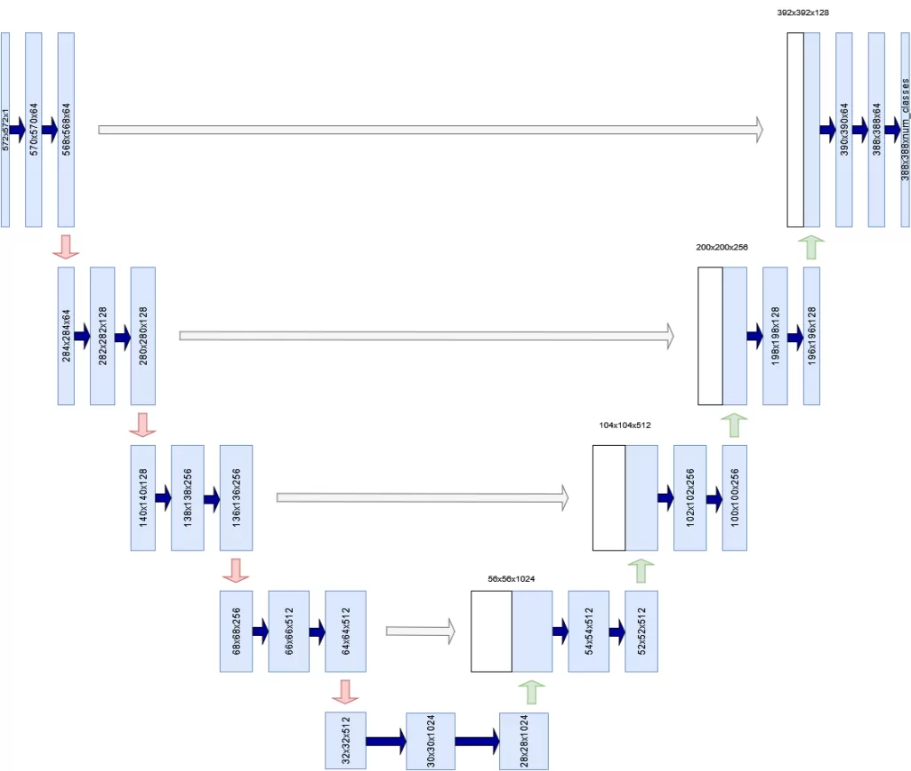

Inspired by Ronneberger et al. (2015)

* * *

## Building a U-Net with TensorFlow and Keras

Now that you understand how U-Net works at a high level, it's time to build one. Open up your IDE and create a Python file (such as `unet.py`) or open up a Jupyter Notebook. Also ensure that you have installed the prerequisites, which follow next. We can then start writing some code!

### Prerequisites

For running today's code, it's important that you have installed some dependencies into your environment.

First of all, you will need a recent version of Python - 3.x, preferably 3.9+.

In addition, you will need `tensorflow` and `matplotlib`. These can be installed through `pip` package manager. When installed, you're ready to go!

### Today's structure

Building a U-Net model can be grouped into three separate groups, besides specifying model imports:

1. Defining the configuration of your U-Net model, so that it can be reused throughout your code.
2. Defining the building blocks of your U-Net.
3. Defining the process definitions to train and evaluate your U-Net model.

Afterwards, you will merge everything together into a working whole.

Let's begin with model configuration! :)

### Imports

Your first lines of code will cover the imports that you will need in the rest of your code. Let's walk through them briefly:

- Python `os` represents operating system functions such as constructing file paths. You will need it when loading your dataset.
- TensorFlow speaks pretty much for itself, doesn't it? :)
- A variety of layers will be used in your model. As we are working with Keras for building your neural network, they must be imported from `tensorflow.keras.layers`. You will use two-dimensional convolutional layers (`Conv2D`), two-dimensional max pooling (`MaxPool2D`), transposed convolutions (`Conv2DTranspose`), and more general layers, such as the `Input` layer (representing the input batch), `Activation` (representing a nonlinear activation function), `Concatenate` for Tensor concatenation and `CenterCrop` for taking a crop of the skip connections to match shapes (this will be discussed later).
- In addition, you will need to import the `Model` class for constructing your U-Net, He normal initialization via `HeNormal`, `Adam` for optimization including learning rate scheduling functionality (`schedules`), and sparse categorical crossentropy (`SparseCategoricalCrossentropy`) as your loss function.
- Recall that TensorFlow has a variety of callbacks that make your modelling life easier. An example of these callbacks is the TensorBoard callback, which allows you to have your training progress exported to a great tool for visualization. Finally, you will import a Keras `util` called `plot_model` for plotting the structure of your model.
- What rests are other imports. Our dataset is represented in `tensorflow_datasets` and finally you will also need Matplotlib's `pyplot` librari for visualization purposes.

```python
import os
import tensorflow
from tensorflow.keras.layers import Conv2D,\
	MaxPool2D, Conv2DTranspose, Input, Activation,\
	Concatenate, CenterCrop
from tensorflow.keras import Model
from tensorflow.keras.initializers import HeNormal
from tensorflow.keras.optimizers import schedules, Adam
from tensorflow.keras.losses import SparseCategoricalCrossentropy
from tensorflow.keras.callbacks import TensorBoard
from tensorflow.keras.utils import plot_model
import tensorflow_datasets as tfds
import matplotlib.pyplot as plt
```

### U-Net configuration definition

In my view, it's bad practice to scatter a variety of configuration options throughout your model. Rather, I prefer to define them in one definition, allowing me to reuse them across the model (and should I ever need to deploy my model into a production setting, I can for example provide my configuration through a JSON environment variable which can be easily read into Python as a `dict`). Here's what the configuration definition looks like. Below, we'll discuss the components:

```python
'''
	U-NET CONFIGURATION
'''
def configuration():
	''' Get configuration. '''

	return dict(
		data_train_prc = 80,
		data_val_prc = 90,
		data_test_prc = 100,
		num_filters_start = 64,
		num_unet_blocks = 3,
		num_filters_end = 3,
		input_width = 100,
		input_height = 100,
		mask_width = 60,
		mask_height = 60,
		input_dim = 3,
		optimizer = Adam,
		loss = SparseCategoricalCrossentropy,
		initializer = HeNormal(),
		batch_size = 50,
		buffer_size = 50,
		num_epochs = 50,
		metrics = ['accuracy'],
		dataset_path = os.path.join(os.getcwd(), 'data'),
		class_weights = tensorflow.constant([1.0, 1.0, 2.0]),
		validation_sub_splits = 5,
		lr_schedule_percentages = [0.2, 0.5, 0.8],
		lr_schedule_values = [3e-4, 1e-4, 1e-5, 1e-6],
		lr_schedule_class = schedules.PiecewiseConstantDecay
	)
```

- Recall that a dataset must be split into a **training set, validation set and testing set**. The training set is the largest and primary set, allowing you to make forward & backward passes and optimization during your training process. However, because you have seen this dataset, a validation set is used during training to evaluate performance after every epoch. Finally, because the model may eventually overfit on this validation set too, there is a testing set, which is not used during training at all. Rather, it is used during model evaluation to find whether your model performs on data that it has not seen before. If it does so, it's more likely to work in the real world, too.
    - In your model configuration, `data_train_prc`, `data_val_prc` and `data_test_prc` are used to represent the percentage at which the specific split ends. In the configuration above, 80, 90 and 100 mean that 0-80% of your dataset will be used for training purposes, 80-90% (i.e. 10% in total) for validation and 90-100% (10%, too) for testing. You will see later that it's good to specify them in this way, because `tfds.load` allows us to recombine the two datasets (train/test) and split them into three!
- The number of feature maps generated at the first U-net convolutional block will be 64. In total, your network will consist of 3 U-Net blocks (the sketch above has 5, but we found 3 to work better on this dataset) and will have 3 feature maps in the _final 1x1 Conv layer_. It's set to 3 because our dataset has three possible classes to assign to each pixel - in other words, it should be equal to the number of classes in your dataset.
- The width and height of our input image will be 100 pixels. Dimensionality of the input will be 3 channels (it's an RGB image).
- The width and height of the output mask will be 60 pixels. Indeed, in the original U-Net architecture input and output size is not equal to each other!
- Model wise, the Adam optimizer, sparse categorical crossentropy and He normal initialization are used. For the Adam optimizer, we use a learning rate schedule called `PiecewiseConstantDecay`. This schedule ensures that the learning rate is set to a preconfigured value after a predefined amount of training time. We start with a learning rate of `3e-4` (i.e., 0.0003) and decrease to `1e-4`, `1e-5` and `1e-6` after 20%, 50% and 80% of training. Decreasing your learning rate will help you move towards an optimum in a better way. [Read here why.](https://www.machinecurve.com/index.php/2019/11/11/problems-with-fixed-and-decaying-learning-rates/)
- Training wise, we generate batches of 50 pixels and perform shuffling with a 50 buffer size, and train the model for 50 epochs.
- As an additional metric, we use `accuracy`.
- Our dataset will be located in the current working directory, `data` sub folder. 5 sub splits are used for validation purposes.
- When you are training with an imbalanced dataset, it can be a good idea to assign class weights to the target predictions. This will put more importance on the weights that are underrepresented.

Okay, this was the important but relatively boring part. Let's now build some U-Net blocks! :)

### U-Net building blocks

Recall that a U-Net is composed of a **contracting path**, which itself is built from **convolutional blocks**, and an **expansive path** built from **upsampling blocks**. At each individual level (except for the last level in the contractive path, which is connected to the head of the expansive path) the output of a convolutional block is connected to an upsampling block via a skip connection.

You will start with building a convolutional block and creating many of them in the contracting path. Then, you will do the same for the upsampling block and the expansive path.

#### The convolutional block

Here's the structure of your `conv_block`:

```python
'''
	U-NET BUILDING BLOCKS
'''

def conv_block(x, filters, last_block):
	'''
		U-Net convolutional block.
		Used for downsampling in the contracting path.
	'''
	config = configuration()

	# First Conv segment
	x = Conv2D(filters, (3, 3),\
		kernel_initializer=config.get("initializer"))(x)
	x = Activation("relu")(x)

	# Second Conv segment
	x = Conv2D(filters, (3, 3),\
		kernel_initializer=config.get("initializer"))(x)
	x = Activation("relu")(x)

	# Keep Conv output for skip input
	skip_input = x

	# Apply pooling if not last block
	if not last_block:
		x = MaxPool2D((2, 2), strides=(2,2))(x)

	return x, skip_input
```

Each convolutional block, per the Ronneberger et al. (2015) paper, is composed of two 3x3 convolutional blocks the output of which are each ReLU activated. Per the configuration, He initialization is used ([because we use ReLU activation](https://www.machinecurve.com/index.php/2019/09/16/he-xavier-initialization-activation-functions-choose-wisely/)).

> It consists of the repeated application of two 3x3 convolutions (unpadded convolutions), each followed by a rectified linear unit (ReLU) and a 2x2 max pooling operation with stride 2 for downsampling.
>
> Ronneberger et al. (2015)

Recall from the image above that at each level, the output of the convolutions in the convolutional block is passed as a skip connection to the first upsampling layer in the upsampling block at the corresponding level.

Max pooling is applied to the same output, so that the output can be used by the next convolutional block.

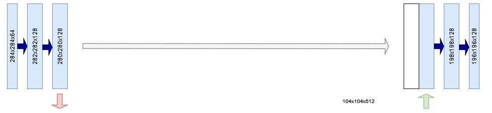

In the code above, you can see that the output of the convolutional layers is assigned to `skip_input`. Subsequently, if this is not the last convolutional block, you will see that `MaxPool2D` is applied with a 2x2 pool size and stride 2.

Both the processed Tensor `x` and the skip connection `skip_input` are returned. Note that this also happens in the last layer! It's only what whe do with the returned values that counts, and you will see that we don't use the skip connection when it's the last layer when creating the full contracting path.

#### Contracting path and skip connections

Which, as if it is meant to be, is right now! :)

Let's create another definition called `contracting_path`. In it, you will construct the convolutional block that belong to the contracting path. Per your code above, these convolutional blocks will perform feature learning at their level of hierarchy and subsequently perform max pooling to make the Tensors ready for the next convolutional block.

In the original U-Net, at each "downsampling step" (i.e., max pooling, although a regular convolution is a downsampling step too, strictly speaking), the number of feature channels is doubled.

> At each downsampling step we double the number of feature channels.
>
> Ronneberger et al. (2015)

And you will need to take this into account when creating your contracting path. This is why you will use the utility function `compute_number_of_filters` (you will define it next) to compute the number of filters used within each convolutional block. Given the starting number of 64, that will be 64, 128 and 256 for the 3-block U-Net that you are building today (per your model configuration). For the original 5-block U-Net in Ronneberger et al. (2014), that would be 64, 128, 256, 512 and 1024.

Next, you create a list where the Tensors provided by the convolutions can be stored. It serves as a container for the skip connections.

Now, it's time to create the actual blocks. By using `enumerate` you can create an enumerator that outputs `(index, value)`, and you are doing that to create a `for` loop that provides both the block number (`index`) and the number of filters in that particular block (`block_num_filters`). In the loop, you check if it's the last block, and let the input pass through the convolutional block setting the number of filters given the level of your convolutional block.

Then, if it's not the last block, you'll add the `skip_input` to the `skip_inputs` container.

Finally, you return both `x` (which now has passed through the entire contracting path) and the `skip_inputs` skip connection Tensors produced when doing so.

```python
def contracting_path(x):
	'''
		U-Net contracting path.
		Initializes multiple convolutional blocks for
		downsampling.
	'''
	config = configuration()

	# Compute the number of feature map filters per block
	num_filters = [compute_number_of_filters(index)\
			for index in range(config.get("num_unet_blocks"))]

	# Create container for the skip input Tensors
	skip_inputs = []

	# Pass input x through all convolutional blocks and
	# add skip input Tensor to skip_inputs if not last block
	for index, block_num_filters in enumerate(num_filters):

		last_block = index == len(num_filters)-1
		x, skip_input = conv_block(x, block_num_filters,\
			last_block)

		if not last_block:
			skip_inputs.append(skip_input)

	return x, skip_inputs
```

#### Utility function: computing number of feature maps

In the `contracting_path` definition, you were using `compute_number_of_filters` to compute the number of filters that must be used / feature maps that must be generated at a specific convolutional block.

This utility function is actually really simple: you take the number of filters in your first convolutional block (which, per your model configuration is 64) and multiply it with \[latex\]2^{\\text{level}}\[/latex\]. For example, at the third level (with index = 2) your convolutional block has \[latex\]64 \\times 2^2 = 256\[/latex\] filters.

```python
def compute_number_of_filters(block_number):
	'''
		Compute the number of filters for a specific
		U-Net block given its position in the contracting path.
	'''
	return configuration().get("num_filters_start") * (2 ** block_number)
```

#### The upsampling block

So far, you have created code for downsampling your input data. It's now time to shape the building blocks for the expansive path. Let's add another definition, which you'll call `upconv_block`. It takes some input, an expected number of filters, a skip input Tensor corresponding to the hierarchical level of your upsampling block, and information about whether it's the last block.

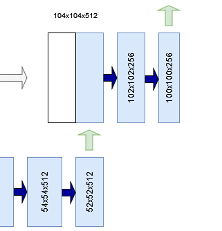

Per the design of U-Net, the first step is performing upsampling. In the image to the right, for example, a 52x52x512 Tensor is upsampled to a 104x104x512 Tensor.

In computer vision models, there are two primary ways of performing **upsampling**:

- **By means of interpolation.** This is the classic approach and is used by Ronneberger et al. (2015). An interpolation function, such as bicubic interpolation, is used to compute the missing pixels. In TensorFlow and Keras, this functionality is covered by the [Upsampling](https://www.machinecurve.com/index.php/2019/12/11/upsampling2d-how-to-use-upsampling-with-keras/) blocks.
- **By means of learned upsampling with [transposed convolutions](https://www.machinecurve.com/index.php/2019/09/29/understanding-transposed-convolutions/).** Another approach would be using transposed convolutions, which are convolutions that work the other way around. Instead of using learned kernels/filters to _down_sample a larger image, they _up_sample the image, but also by using learned kernels/filters! In TensorFlow, these are represented by meansa of `[ConvXDTranspose](https://www.machinecurve.com/index.php/2019/12/10/conv2dtranspose-using-2d-transposed-convolutions-with-keras/)`. You will be using this type of upsampling because it is (1) more common today and (2) makes the whole model use trainable parameters where possible.

So, the first processing that happens to your input Tensor `x` is upsampling by means of `Conv2DTranspose`.

Then it's time to discuss the following important detail - the **crop** that is applied to the skip connection.

Note that the shape of the first two dimensions of the output of your convolutional block at arbitrary level _L_ is larger than the shape of these dimensions at the corresponding upsampling block. For example, in the example below you see that a skip connection of shape 136x136 pixels must be concatenated with a 104x104 pixel Tensor.

> Every step in the expansive path consists of an upsampling of the feature map followed by a 2x2 convolution (“up-convolution”) that halves the number of feature channels, **a concatenation with the correspondingly cropped feature map from the contracting path**, and two 3x3 convolutions, each followed by a ReLU.
>
> Ronneberger et al. (2015)

This is not possible. Ronneberger et al. (2015), in their original implementation of U-Net, mitigate this problem by taking a _center crop_ from the feature maps generated by the convolutional block. This center crop has the same width and height of the upsampled Tensor; in our case, that is 104x104 pixels. Now, both Tensors can be concatenated.

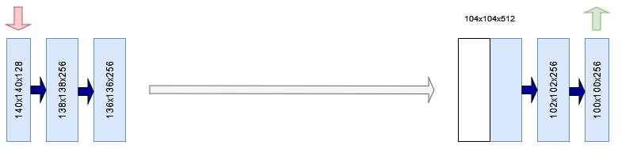

To make this crop, you use TensorFlow's `CenterCrop` layer to take a center crop from the skip input using the target width and height as specified by the upsampled Tensor.

Then, you use the `Concatenate` layer to concatenate the cropped skip input with the upsampled Tensor, after which you can proceed with processing the whole. This, per the Ronneberger et al. (2015) and the quote above, is performed using two 3x3 convolutions followed by ReLU activation each.

> At the final layer a 1x1 convolution is used to map each 64- component feature vector to the desired number of classes.
>
> Ronneberger et al. (2015)

Finally, at the last layer, you apply an 1x1 convolution (preserving the width and height dimensions) that outputs a Tensor with C for the third dimension. C, here, represents the desired number of classes - something we have in our model configuration as `num_filters_end`, and indeed, that is three classes for today's dataset! :)

Here's the code for creating your upsampling block:

```python
def upconv_block(x, filters, skip_input, last_block = False):
	'''
		U-Net upsampling block.
		Used for upsampling in the expansive path.
	'''
	config = configuration()

	# Perform upsampling
	x = Conv2DTranspose(filters//2, (2, 2), strides=(2, 2),\
		kernel_initializer=config.get("initializer"))(x)
	shp = x.shape

	# Crop the skip input, keep the center
	cropped_skip_input = CenterCrop(height = x.shape[1],\
		width = x.shape[2])(skip_input)

	# Concatenate skip input with x
	concat_input = Concatenate(axis=-1)([cropped_skip_input, x])

	# First Conv segment
	x = Conv2D(filters//2, (3, 3),
		kernel_initializer=config.get("initializer"))(concat_input)
	x = Activation("relu")(x)

	# Second Conv segment
	x = Conv2D(filters//2, (3, 3),
		kernel_initializer=config.get("initializer"))(x)
	x = Activation("relu")(x)

	# Prepare output if last block
	if last_block:
		x = Conv2D(config.get("num_filters_end"), (1, 1),
			kernel_initializer=config.get("initializer"))(x)

	return x
```

#### Expansive path using skip connections

As with the contracting path, you will also need to compose the upsampling layers in your expansive path.

Similar to the contracting path, you will also compute the number of filters for the blocks in your expansive path. This time, however, you start counting at the end - i.e., at the number of blocks minus one, because you are working from a high number of filters to a low number of filters.

Then, you iterate over the number of filters, compute whether it's the last block and compute the _level_ to take the skip input from, and pass the Tensor through your upsampling block.

Now, should you feed your Tensor to all the blocks if they were composed, they would make a complete pass through the contracting path and the expansive path. Time to stitch together your U-Net components!

```python
def expansive_path(x, skip_inputs):
	'''
		U-Net expansive path.
		Initializes multiple upsampling blocks for upsampling.
	'''
	num_filters = [compute_number_of_filters(index)\
			for index in range(configuration()\
				.get("num_unet_blocks")-1, 0, -1)]

	skip_max_index = len(skip_inputs) - 1

	for index, block_num_filters in enumerate(num_filters):
		skip_index = skip_max_index - index
		last_block = index == len(num_filters)-1
		x = upconv_block(x, block_num_filters,\
			skip_inputs[skip_index], last_block)

	return x
```

#### U-Net builder

...which is something that we can do with the `build_unet` definition that you will create now.

It is a relatively simple definition. It constructs the input shape by means of the configured height, width and dimensionality of your input data, and then passes this to an `Input` layer - which is TensorFlow's way of representing input data.

Your inputs are then passed through the `contracting_path`, which yields the contracted data _and_ the outputs of each convolutional block for the skip connections.

These are then fed to the `expansive_path` which produces the expanded data. Note that we choose to explicitly _not_ model a Softmax activation function, because we push it to the loss function, [as prescribed by TensorFlow](https://datascience.stackexchange.com/questions/73093/what-does-from-logits-true-do-in-sparsecategoricalcrossentropy-loss-function). Finally, we initialize the `Model` class with our input data as our starting point and the expanded data as our ending point. The model is named `U-Net`.

```python
def build_unet():
	''' Construct U-Net. '''
	config = configuration()
	input_shape = (config.get("input_height"),\
		config.get("input_width"), config.get("input_dim"))

	# Construct input layer
	input_data = Input(shape=input_shape)

	# Construct Contracting path
	contracted_data, skip_inputs = contracting_path(input_data)

	# Construct Expansive path
	expanded_data = expansive_path(contracted_data, skip_inputs)

	# Define model
	model = Model(input_data, expanded_data, name="U-Net")

	return model
```

### U-Net training process definitions

Now that you have created the model building blocks, it's time to start creating definitions for training your U-Net. These are the ones that you will create:

- Initializing the model.
- Loading the dataset.
- Data preprocessing.
- Training callbacks.
- Data visualization.

#### Initializing the model

You have a definition for creating a model. However, that's just a skeleton - because a model needs to be initialized with a loss function, an optimizer needs to be configured, and so forth.

Let's thus create a definition called `init_model` which allows you to do this. It accepts the steps per epoch, which come from your dataset configuration that will be added later.

The following happens within this definition:

- Configuration is loaded and the model skeleton is built.
- The loss function is initialized as well as additional metrics and the number of epochs. Note that with `from_logits=True`, you instruct TensorFlow that the output of your model are logits rather than a Softmaxed output. When configured, the loss function performs Softmax activation before computing loss.
- The learning rate schedule is constructed from the percentages by computing the boundaries - which are the number of iterations that must be passed. Note that an iteration here is a batch of data being fed through the network; the number of samples divided by your batch size yields the number of iterations in one epoch). So, to compute the boundaries, we take the number of epochs, the particular percentage, and the number of steps (batches) per epoch. You then initialize the learning rate schedule with the boundaries and corresponding learning rate values (which are discussed in the section about model configuration).
- Then, the optimizer is initialized with the learning rate schedule.
- Now, you can compile your model as is standard with TensorFlow models.
- Some utilities will now describe your model - both [visually](https://www.machinecurve.com/index.php/2019/10/07/how-to-visualize-a-model-with-keras/) and by means of a [summary](https://www.machinecurve.com/index.php/2020/04/01/how-to-generate-a-summary-of-your-keras-model/).
- Finally, you return the initialized `model`.

```python
'''
	U-NET TRAINING PROCESS BUILDING BLOCKS
'''

def init_model(steps_per_epoch):
	'''
		Initialize a U-Net model.
	'''
	config = configuration()
	model = build_unet()

	# Retrieve compilation input
	loss_init = config.get("loss")(from_logits=True)
	metrics = config.get("metrics")
	num_epochs = config.get("num_epochs")

	# Construct LR schedule
	boundaries = [int(num_epochs * percentage * steps_per_epoch)\
		for percentage in config.get("lr_schedule_percentages")]
	lr_schedule = config.get("lr_schedule_class")(boundaries, config.get("lr_schedule_values"))

	# Init optimizer
	optimizer_init = config.get("optimizer")(learning_rate = lr_schedule)

	# Compile the model
	model.compile(loss=loss_init, optimizer=optimizer_init, metrics=metrics)

	# Plot the model
	plot_model(model, to_file="unet.png")

	# Print model summary
	model.summary()

	return model
```

This is what your model looks like, visually. Indeed, that's a U shape! :)

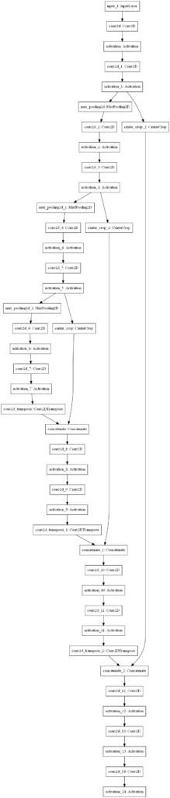

#### Loading the dataset

For training your model in today's tutorial, you will be using the Oxford-IIT Pets dataset that was published in Parkhi et al. (2012):

> We have created a 37 category pet dataset with roughly 200 images for each class. The images have a large variations in scale, pose and lighting. All images have an associated ground truth annotation of breed, head ROI, and pixel level trimap segmentation.
>
> Parkhi et al. (2012)

We're using it because it's available in [TensorFlow datasets](https://www.tensorflow.org/datasets/catalog/oxford_iiit_pet), making loading it more easy, and because it has a segmentation max available out of the box. For example, here is an input image with the corresponding segmentation mask:

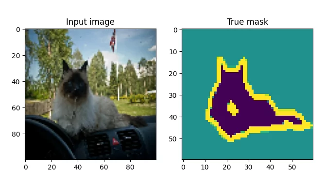

Source: Parkhi et al. (2012); TensorFlow Datasets.

Loading the dataset is quite simple. Because the TensorFlow dataset contains training and testing data _only_, and because you will need three splits (train, val and test), you will _redefine_ the split per your model configuration, and pass it to `tfds.load`. By returning info (`with_info=True`), you will be able to read some metadata interesting later.

```python
def load_dataset():
	'''	Return dataset with info. '''
	config = configuration()

	# Retrieve percentages
	train = config.get("data_train_prc")
	val = config.get("data_val_prc")
	test = config.get("data_test_prc")

	# Redefine splits over full dataset
	splits = [f'train[:{train}%]+test[:{train}%]',\
		f'train[{train}%:{val}%]+test[{train}%:{val}%]',\
		f'train[{val}%:{test}%]+test[{val}%:{test}%]']

	# Return data
	return tfds.load('oxford_iiit_pet:3.*.*', split=splits, data_dir=configuration()\
		.get("dataset_path"), with_info=True) 
```

#### Dataset preprocessing

Datasets require preprocessing before they can be used in deep learning models. That's why today's tutorial will also require you to write some preprocessing code. To be more precise, you will perform the following preprocessing:

- Preprocessing **at sample level**, including **image normalization**.
- **Data augmentation** to artificially increase the size of your dataset.
- Computing **sample weights** to balance between overrepresented and underrepresented classes in your segmentation masks.
- Preprocessing at **dataset level**, combining all previous bullet points.

Let's now write code for each of these bullet points.

Performing **image normalization** simply involves casting your Tensors to `float32` format and division by `255.0`. In addition to this, you subtract 1 from the mask's class, because they range from 1-3 and we want them to range from 0-2:

```python
def normalize_sample(input_image, input_mask):
	''' Normalize input image and mask class. '''
	# Cast image to float32 and divide by 255
	input_image = tensorflow.cast(input_image, tensorflow.float32) / 255.0

  	# Bring classes into range [0, 2]
	input_mask -= 1

	return input_image, input_mask
```

Next, you implement this in your definition for **sample-level preprocessing**. The input image is resized to the size specified in your model configuration, and the same is true for your mask. Finally, both the input image and mask are normalized, and returned.

```python
def preprocess_sample(data_sample):
	''' Resize and normalize dataset samples. '''
	config = configuration()

	# Resize image
	input_image = tensorflow.image.resize(data_sample['image'],\
  	(config.get("input_width"), config.get("input_height")))

  	# Resize mask
	input_mask = tensorflow.image.resize(data_sample['segmentation_mask'],\
  	(config.get("mask_width"), config.get("mask_height")))

  	# Normalize input image and mask
	input_image, input_mask = normalize_sample(input_image, input_mask)

	return input_image, input_mask
```

**Data augmentation** allows TensorFlow to perform arbitrary image manipulations on your input Tensors. In today's tutorial, you will implement data augmentation by having the sammples flipped horizontally and vertically at random. We use the same seed across the calls to ensure that your inputs and labels are manipulated in the same way.

```python
def data_augmentation(inputs, labels):
	''' Perform data augmentation. '''
	# Use the same seed for deterministic randomness over both inputs and labels.
	seed = 36

	# Feed data through layers
	inputs = tensorflow.image.random_flip_left_right(inputs, seed=seed)
	inputs = tensorflow.image.random_flip_up_down(inputs, seed=seed)
	labels = tensorflow.image.random_flip_left_right(labels, seed=seed)
	labels = tensorflow.image.random_flip_up_down(labels, seed=seed)

	return inputs, labels
```

Next up is computing **sample weights**. Given the weights for each class, you compute the relative power of these class weights by means of `reduce_sum`. Subsequently, you compute the sample weights for each class, and return this as an extra array to be used in `model.fit`.

```python
def compute_sample_weights(image, mask):
	''' Compute sample weights for the image given class. '''
	# Compute relative weight of class
	class_weights = configuration().get("class_weights")
	class_weights = class_weights/tensorflow.reduce_sum(class_weights)

  	# Compute same-shaped Tensor as mask with sample weights per
  	# mask element. 
	sample_weights = tensorflow.gather(class_weights,indices=\
  	tensorflow.cast(mask, tensorflow.int32))

	return image, mask, sample_weights
```

Finally, you can combine all the definitions above in **dataset-level preprocessing**. Depending on the dataset type, this is performed differently:

- When preprocessing your **training data** or **validation data**, preprocessing, data augmentation and class weighting is performed, including some utility processing to improve the training process.
- The utility functions and class weighting is left out when preprocessing your **testing data**, because they are not necessary as during testing the model is not trained.

```python
def preprocess_dataset(data, dataset_type, dataset_info):
	''' Fully preprocess dataset given dataset type. '''
	config = configuration()
	batch_size = config.get("batch_size")
	buffer_size = config.get("buffer_size")

	# Preprocess data given dataset type.
	if dataset_type == "train" or dataset_type == "val":
		# 1. Perform preprocessing
		# 2. Cache dataset for improved performance
		# 3. Shuffle dataset
		# 4. Generate batches
		# 5. Repeat
		# 6. Perform data augmentation
		# 7. Add sample weights
		# 8. Prefetch new data before it being necessary.
		return (data
				    .map(preprocess_sample)
				    .cache()
				    .shuffle(buffer_size)
				    .batch(batch_size)
				    .repeat()
				    .map(data_augmentation)
				    .map(compute_sample_weights)
				    .prefetch(buffer_size=tensorflow.data.AUTOTUNE))
	else:
		# 1. Perform preprocessing
		# 2. Generate batches
		return (data
						.map(preprocess_sample)
						.batch(batch_size))
```

#### Training callbacks

What's left is writing some utility functions. If you're familiar with TensorFlow, it's likely that you know about the [Keras callbacks](https://www.machinecurve.com/index.php/2020/11/10/an-introduction-to-tensorflow-keras-callbacks/). These can be used to allow certain actions to take place at specific steps in your training process.

Today, we're using these callbacks to integrate TensorBoard logging into your model. This way, you'll be able to evaluate progress and model training during and after your training process.

```python
def training_callbacks():
	''' Retrieve initialized callbacks for model.fit '''
	return [
		TensorBoard(
		  log_dir=os.path.join(os.getcwd(), "unet_logs"),
		  histogram_freq=1,
		  write_images=True
		)
	]
```

#### Data visualization

The last utility function is related to data visualization. We want to understand what the performance of our model will be, so we're going to construct a visualization util that displays the **source image**, the **actual mask**, the **predicted mask** and the **predicted mask overlayed on top of the source image**. For doing so, we'll need to create a function that generates a mask from the model prediction:

```python
def probs_to_mask(probs):
	''' Convert Softmax output into mask. '''
	pred_mask = tensorflow.argmax(probs, axis=2)
	return pred_mask
```

Across the third dimension, it simply takes the class index with the maximum value and returns it. Indeed, that's equal to picking a class.

You integrate this in `generate_plot`, which uses Matplotlib to generate four plots with the source image, actual mask, predicted mask and the overlay:

```python
def generate_plot(img_input, mask_truth, mask_probs):
	''' Generate a plot of input, truthy mask and probability mask. '''
	fig, axs = plt.subplots(1, 4)
	fig.set_size_inches(16, 6)

	# Plot the input image
	axs[0].imshow(img_input)
	axs[0].set_title("Input image")

	# Plot the truthy mask
	axs[1].imshow(mask_truth)
	axs[1].set_title("True mask")

	# Plot the predicted mask
	predicted_mask = probs_to_mask(mask_probs)
	axs[2].imshow(predicted_mask)
	axs[2].set_title("Predicted mask")

	# Plot the overlay
	config = configuration()
	img_input_resized = tensorflow.image.resize(img_input, (config.get("mask_width"), config.get("mask_height")))
	axs[3].imshow(img_input_resized)
	axs[3].imshow(predicted_mask, alpha=0.5)
	axs[3].set_title("Overlay")

	# Show the plot
	plt.show()
```

### Merging everything together into a working example

The final step is merging everything together into an example that works:

```python
def main():
	''' Run full training procedure. '''

	# Load config
	config = configuration()
	batch_size = config.get("batch_size")
	validation_sub_splits = config.get("validation_sub_splits")
	num_epochs = config.get("num_epochs")

	# Load data
	(training_data, validation_data, testing_data), info = load_dataset()

	# Make training data ready for model.fit and model.evaluate
	train_batches = preprocess_dataset(training_data, "train", info)
	val_batches = preprocess_dataset(validation_data, "val", info)
	test_batches = preprocess_dataset(testing_data, "test", info)
	
	# Compute data-dependent variables
	train_num_samples = tensorflow.data.experimental.cardinality(training_data).numpy()
	val_num_samples = tensorflow.data.experimental.cardinality(validation_data).numpy()
	steps_per_epoch = train_num_samples // batch_size
	val_steps_per_epoch = val_num_samples // batch_size // validation_sub_splits

	# Initialize model
	model = init_model(steps_per_epoch)

	# Train the model	
	model.fit(train_batches, epochs=num_epochs, batch_size=batch_size,\
		steps_per_epoch=steps_per_epoch, verbose=1,
		validation_steps=val_steps_per_epoch, callbacks=training_callbacks(),\
		validation_data=val_batches)

	# Test the model
	score = model.evaluate(test_batches, verbose=0)
	print(f'Test loss: {score[0]} / Test accuracy: {score[1]}')

	# Take first batch from the test images and plot them
	for images, masks in test_batches.take(1):

		# Generate prediction for each image
		predicted_masks = model.predict(images)

		# Plot each image and masks in batch
		for index, (image, mask) in enumerate(zip(images, masks)):
			generate_plot(image, mask, predicted_masks[index])
			if index > 4:
				break


if __name__ == '__main__':
	main()
```

### Full code example

If you want to get started immediately, that is possible too :) Here is the full model code:

```python
import os
import tensorflow
from tensorflow.keras.layers import Conv2D,\
	MaxPool2D, Conv2DTranspose, Input, Activation,\
	Concatenate, CenterCrop
from tensorflow.keras import Model
from tensorflow.keras.initializers import HeNormal
from tensorflow.keras.optimizers import schedules, Adam
from tensorflow.keras.losses import SparseCategoricalCrossentropy
from tensorflow.keras.callbacks import TensorBoard
from tensorflow.keras.utils import plot_model
import tensorflow_datasets as tfds
import matplotlib.pyplot as plt


'''
	U-NET CONFIGURATION
'''
def configuration():
	''' Get configuration. '''

	return dict(
		data_train_prc = 80,
		data_val_prc = 90,
		data_test_prc = 100,
		num_filters_start = 64,
		num_unet_blocks = 3,
		num_filters_end = 3,
		input_width = 100,
		input_height = 100,
		mask_width = 60,
		mask_height = 60,
		input_dim = 3,
		optimizer = Adam,
		loss = SparseCategoricalCrossentropy,
		initializer = HeNormal(),
		batch_size = 50,
		buffer_size = 50,
		num_epochs = 25,
		metrics = ['accuracy'],
		dataset_path = os.path.join(os.getcwd(), 'data'),
		class_weights = tensorflow.constant([1.0, 1.0, 2.0]),
		validation_sub_splits = 5,
		lr_schedule_percentages = [0.2, 0.5, 0.8],
		lr_schedule_values = [3e-4, 1e-4, 1e-5, 1e-6],
		lr_schedule_class = schedules.PiecewiseConstantDecay
	)


'''
	U-NET BUILDING BLOCKS
'''

def conv_block(x, filters, last_block):
	'''
		U-Net convolutional block.
		Used for downsampling in the contracting path.
	'''
	config = configuration()

	# First Conv segment
	x = Conv2D(filters, (3, 3),\
		kernel_initializer=config.get("initializer"))(x)
	x = Activation("relu")(x)

	# Second Conv segment
	x = Conv2D(filters, (3, 3),\
		kernel_initializer=config.get("initializer"))(x)
	x = Activation("relu")(x)

	# Keep Conv output for skip input
	skip_input = x

	# Apply pooling if not last block
	if not last_block:
		x = MaxPool2D((2, 2), strides=(2,2))(x)

	return x, skip_input


def contracting_path(x):
	'''
		U-Net contracting path.
		Initializes multiple convolutional blocks for
		downsampling.
	'''
	config = configuration()

	# Compute the number of feature map filters per block
	num_filters = [compute_number_of_filters(index)\
			for index in range(config.get("num_unet_blocks"))]

	# Create container for the skip input Tensors
	skip_inputs = []

	# Pass input x through all convolutional blocks and
	# add skip input Tensor to skip_inputs if not last block
	for index, block_num_filters in enumerate(num_filters):

		last_block = index == len(num_filters)-1
		x, skip_input = conv_block(x, block_num_filters,\
			last_block)

		if not last_block:
			skip_inputs.append(skip_input)

	return x, skip_inputs


def upconv_block(x, filters, skip_input, last_block = False):
	'''
		U-Net upsampling block.
		Used for upsampling in the expansive path.
	'''
	config = configuration()

	# Perform upsampling
	x = Conv2DTranspose(filters//2, (2, 2), strides=(2, 2),\
		kernel_initializer=config.get("initializer"))(x)
	shp = x.shape

	# Crop the skip input, keep the center
	cropped_skip_input = CenterCrop(height = x.shape[1],\
		width = x.shape[2])(skip_input)

	# Concatenate skip input with x
	concat_input = Concatenate(axis=-1)([cropped_skip_input, x])

	# First Conv segment
	x = Conv2D(filters//2, (3, 3),
		kernel_initializer=config.get("initializer"))(concat_input)
	x = Activation("relu")(x)

	# Second Conv segment
	x = Conv2D(filters//2, (3, 3),
		kernel_initializer=config.get("initializer"))(x)
	x = Activation("relu")(x)

	# Prepare output if last block
	if last_block:
		x = Conv2D(config.get("num_filters_end"), (1, 1),
			kernel_initializer=config.get("initializer"))(x)

	return x


def expansive_path(x, skip_inputs):
	'''
		U-Net expansive path.
		Initializes multiple upsampling blocks for upsampling.
	'''
	num_filters = [compute_number_of_filters(index)\
			for index in range(configuration()\
				.get("num_unet_blocks")-1, 0, -1)]

	skip_max_index = len(skip_inputs) - 1

	for index, block_num_filters in enumerate(num_filters):
		skip_index = skip_max_index - index
		last_block = index == len(num_filters)-1
		x = upconv_block(x, block_num_filters,\
			skip_inputs[skip_index], last_block)

	return x


def build_unet():
	''' Construct U-Net. '''
	config = configuration()
	input_shape = (config.get("input_height"),\
		config.get("input_width"), config.get("input_dim"))

	# Construct input layer
	input_data = Input(shape=input_shape)

	# Construct Contracting path
	contracted_data, skip_inputs = contracting_path(input_data)

	# Construct Expansive path
	expanded_data = expansive_path(contracted_data, skip_inputs)

	# Define model
	model = Model(input_data, expanded_data, name="U-Net")

	return model


def compute_number_of_filters(block_number):
	'''
		Compute the number of filters for a specific
		U-Net block given its position in the contracting path.
	'''
	return configuration().get("num_filters_start") * (2 ** block_number)


'''
	U-NET TRAINING PROCESS BUILDING BLOCKS
'''

def init_model(steps_per_epoch):
	'''
		Initialize a U-Net model.
	'''
	config = configuration()
	model = build_unet()

	# Retrieve compilation input
	loss_init = config.get("loss")(from_logits=True)
	metrics = config.get("metrics")
	num_epochs = config.get("num_epochs")

	# Construct LR schedule
	boundaries = [int(num_epochs * percentage * steps_per_epoch)\
		for percentage in config.get("lr_schedule_percentages")]
	lr_schedule = config.get("lr_schedule_class")(boundaries, config.get("lr_schedule_values"))

	# Init optimizer
	optimizer_init = config.get("optimizer")(learning_rate = lr_schedule)

	# Compile the model
	model.compile(loss=loss_init, optimizer=optimizer_init, metrics=metrics)

	# Plot the model
	plot_model(model, to_file="unet.png")

	# Print model summary
	model.summary()

	return model


def load_dataset():
	'''	Return dataset with info. '''
	config = configuration()

	# Retrieve percentages
	train = config.get("data_train_prc")
	val = config.get("data_val_prc")
	test = config.get("data_test_prc")

	# Redefine splits over full dataset
	splits = [f'train[:{train}%]+test[:{train}%]',\
		f'train[{train}%:{val}%]+test[{train}%:{val}%]',\
		f'train[{val}%:{test}%]+test[{val}%:{test}%]']

	# Return data
	return tfds.load('oxford_iiit_pet:3.*.*', split=splits, data_dir=configuration()\
		.get("dataset_path"), with_info=True) 


def normalize_sample(input_image, input_mask):
	''' Normalize input image and mask class. '''
	# Cast image to float32 and divide by 255
	input_image = tensorflow.cast(input_image, tensorflow.float32) / 255.0

  # Bring classes into range [0, 2]
	input_mask -= 1

	return input_image, input_mask


def preprocess_sample(data_sample):
	''' Resize and normalize dataset samples. '''
	config = configuration()

	# Resize image
	input_image = tensorflow.image.resize(data_sample['image'],\
  	(config.get("input_width"), config.get("input_height")))

  # Resize mask
	input_mask = tensorflow.image.resize(data_sample['segmentation_mask'],\
  	(config.get("mask_width"), config.get("mask_height")))

  # Normalize input image and mask
	input_image, input_mask = normalize_sample(input_image, input_mask)

	return input_image, input_mask


def data_augmentation(inputs, labels):
	''' Perform data augmentation. '''
	# Use the same seed for deterministic randomness over both inputs and labels.
	seed = 36

  # Feed data through layers
	inputs = tensorflow.image.random_flip_left_right(inputs, seed=seed)
	inputs = tensorflow.image.random_flip_up_down(inputs, seed=seed)
	labels = tensorflow.image.random_flip_left_right(labels, seed=seed)
	labels = tensorflow.image.random_flip_up_down(labels, seed=seed)

	return inputs, labels


def compute_sample_weights(image, mask):
	''' Compute sample weights for the image given class. '''
	# Compute relative weight of class
	class_weights = configuration().get("class_weights")
	class_weights = class_weights/tensorflow.reduce_sum(class_weights)

  # Compute same-shaped Tensor as mask with sample weights per
  # mask element. 
	sample_weights = tensorflow.gather(class_weights,indices=\
  	tensorflow.cast(mask, tensorflow.int32))

	return image, mask, sample_weights


def preprocess_dataset(data, dataset_type, dataset_info):
	''' Fully preprocess dataset given dataset type. '''
	config = configuration()
	batch_size = config.get("batch_size")
	buffer_size = config.get("buffer_size")

	# Preprocess data given dataset type.
	if dataset_type == "train" or dataset_type == "val":
		# 1. Perform preprocessing
		# 2. Cache dataset for improved performance
		# 3. Shuffle dataset
		# 4. Generate batches
		# 5. Repeat
		# 6. Perform data augmentation
		# 7. Add sample weights
		# 8. Prefetch new data before it being necessary.
		return (data
				    .map(preprocess_sample)
				    .cache()
				    .shuffle(buffer_size)
				    .batch(batch_size)
				    .repeat()
				    .map(data_augmentation)
				    .map(compute_sample_weights)
				    .prefetch(buffer_size=tensorflow.data.AUTOTUNE))
	else:
		# 1. Perform preprocessing
		# 2. Generate batches
		return (data
						.map(preprocess_sample)
						.batch(batch_size))


def training_callbacks():
	''' Retrieve initialized callbacks for model.fit '''
	return [
		TensorBoard(
		  log_dir=os.path.join(os.getcwd(), "unet_logs"),
		  histogram_freq=1,
		  write_images=True
		)
	]


def probs_to_mask(probs):
	''' Convert Softmax output into mask. '''
	pred_mask = tensorflow.argmax(probs, axis=2)
	return pred_mask


def generate_plot(img_input, mask_truth, mask_probs):
	''' Generate a plot of input, truthy mask and probability mask. '''
	fig, axs = plt.subplots(1, 4)
	fig.set_size_inches(16, 6)

	# Plot the input image
	axs[0].imshow(img_input)
	axs[0].set_title("Input image")

	# Plot the truthy mask
	axs[1].imshow(mask_truth)
	axs[1].set_title("True mask")

	# Plot the predicted mask
	predicted_mask = probs_to_mask(mask_probs)
	axs[2].imshow(predicted_mask)
	axs[2].set_title("Predicted mask")

	# Plot the overlay
	config = configuration()
	img_input_resized = tensorflow.image.resize(img_input, (config.get("mask_width"), config.get("mask_height")))
	axs[3].imshow(img_input_resized)
	axs[3].imshow(predicted_mask, alpha=0.5)
	axs[3].set_title("Overlay")

	# Show the plot
	plt.show()


def main():
	''' Run full training procedure. '''

	# Load config
	config = configuration()
	batch_size = config.get("batch_size")
	validation_sub_splits = config.get("validation_sub_splits")
	num_epochs = config.get("num_epochs")

	# Load data
	(training_data, validation_data, testing_data), info = load_dataset()

	# Make training data ready for model.fit and model.evaluate
	train_batches = preprocess_dataset(training_data, "train", info)
	val_batches = preprocess_dataset(validation_data, "val", info)
	test_batches = preprocess_dataset(testing_data, "test", info)
	
	# Compute data-dependent variables
	train_num_samples = tensorflow.data.experimental.cardinality(training_data).numpy()
	val_num_samples = tensorflow.data.experimental.cardinality(validation_data).numpy()
	steps_per_epoch = train_num_samples // batch_size
	val_steps_per_epoch = val_num_samples // batch_size // validation_sub_splits

	# Initialize model
	model = init_model(steps_per_epoch)

	# Train the model	
	model.fit(train_batches, epochs=num_epochs, batch_size=batch_size,\
		steps_per_epoch=steps_per_epoch, verbose=1,
		validation_steps=val_steps_per_epoch, callbacks=training_callbacks(),\
		validation_data=val_batches)

	# Test the model
	score = model.evaluate(test_batches, verbose=0)
	print(f'Test loss: {score[0]} / Test accuracy: {score[1]}')

	# Take first batch from the test images and plot them
	for images, masks in test_batches.take(1):

		# Generate prediction for each image
		predicted_masks = model.predict(images)

		# Plot each image and masks in batch
		for index, (image, mask) in enumerate(zip(images, masks)):
			generate_plot(image, mask, predicted_masks[index])
			if index > 4:
				break


if __name__ == '__main__':
	main()
```

* * *

## Training our U-Net

Now, let's train our model! Open up a terminal, navigate to the location where your Python script is located, and run it. You should see the training process start quickly :)

Training our U-Net yielded this performance for me when training it from scratch, i.e. with He initialized weights:

[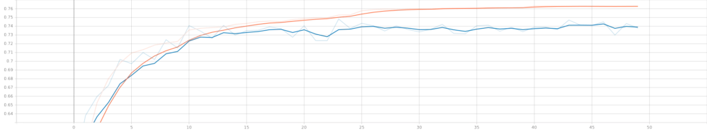](https://www.machinecurve.com/wp-content/uploads/2022/01/epoch_accuracy-1.png)

Training accuracy (orange) and validation accuracy (blue).

[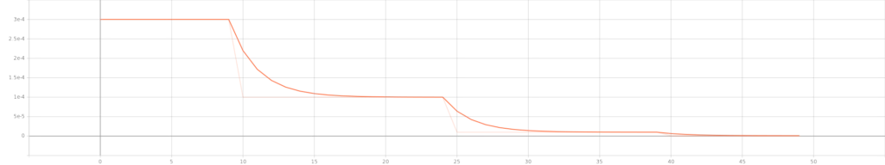](https://www.machinecurve.com/wp-content/uploads/2022/01/epoch_learning_rate-1.png)

The learning rate over the epochs. The learning rate schedule is clearly visible.

### Examples of image segmentations generated with our model

Recall that after training, the model takes some examples from the testing set and outputs the results. Here's what your U-Net will produce:

[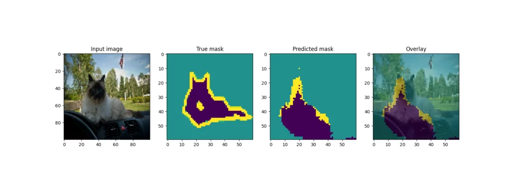](https://www.machinecurve.com/wp-content/uploads/2022/01/1.png)

[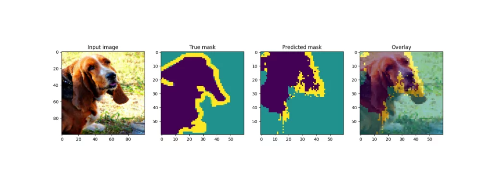](https://www.machinecurve.com/wp-content/uploads/2022/01/2.png)

[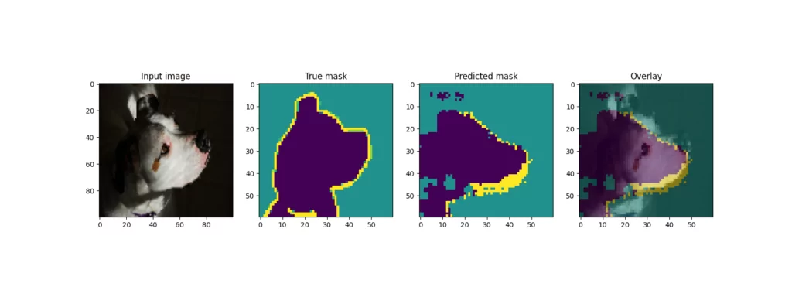](https://www.machinecurve.com/wp-content/uploads/2022/01/3.png)

[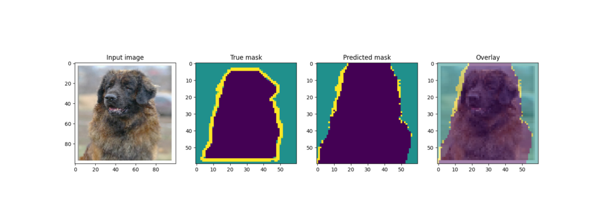](https://www.machinecurve.com/wp-content/uploads/2022/01/4.png)

[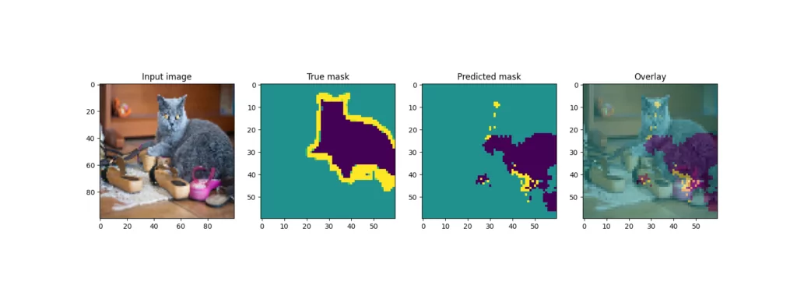](https://www.machinecurve.com/wp-content/uploads/2022/01/5.png)

[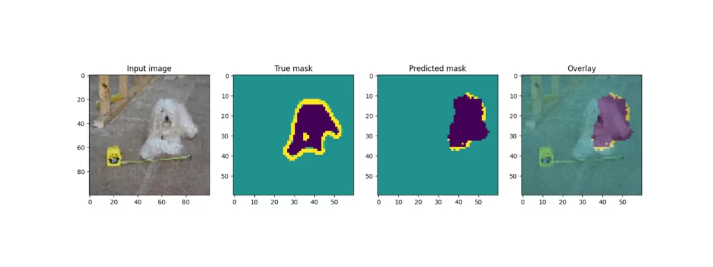](https://www.machinecurve.com/wp-content/uploads/2022/01/6.png)

### Improving model performance by model pretraining

Indeed, while some examples (the dog) produce pretty good overlays, with others (one of the cats) the prediction is a lot worse.

One of the key reasons for this is dataset size - despite being a relatively large dataset, the Pets dataset is _really small_ compared to other, more real-world datasets. While data augmentation has likely improved the results, it's not a magic method that can fix all your problems.

Besides increasing the size of your dataset, however, there is a method that will work too - **by not starting with weights initialized randomly**. Rather, it can be a good idea to **pretrain your model**, for example using the ImageNet dataset. That way, your model will already learn to detect specific patterns and will allow you to initialize your model with.

There are many packages available that allow you to construct U-Nets for TensorFlow and Keras by using contemporary ConvNets as backbones (ResNet, and so forth). Even better, they produce weights for these backbones, allowing you to take off from a much better starting point!

Creating a U-Net based image segmentation model by using a pretrained backbone will be covered other articles. Keep reading MachineCurve to learn more about this!

We can wrap up by saying that you've done it - you created a U-Net from scratch! 🎉 If you have any questions, comments or suggestions, feel free to leave a message in the comments section below 💬 I will then try to answer you as quickly as possible. For now, thank you for reading MachineCurve today and happy engineering!

* * *

## References

Ronneberger, O., Fischer, P., & Brox, T. (2015, October). [U-net: Convolutional networks for biomedical image segmentation.](https://arxiv.org/abs/1505.04597) In _International Conference on Medical image computing and computer-assisted intervention_ (pp. 234-241). Springer, Cham.

Parkhi, O. M., Vedaldi, A., Zisserman, A., & Jawahar, C. V. (2012, June). [Cats and dogs.](https://ieeexplore.ieee.org/abstract/document/6248092) In _2012 IEEE conference on computer vision and pattern recognition_ (pp. 3498-3505). IEEE.
