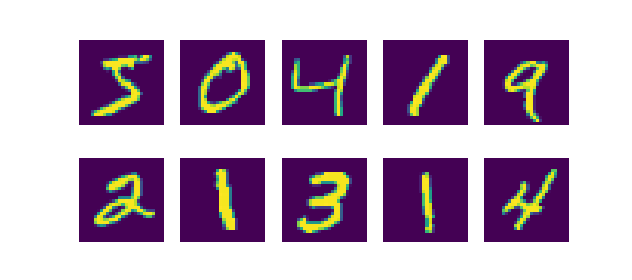
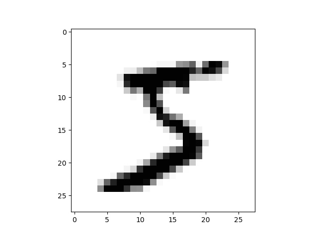
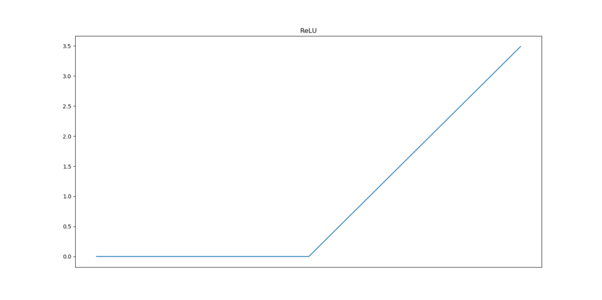

In one of my previous blogs, I showed why [you can't truly create a Rosenblatt's Perceptron](https://machinecurve.com/index.php/2019/07/24/why-you-cant-truly-create-rosenblatts-perceptron-with-keras/) with Keras. Fortunately for this lovely Python framework, Rosenblatt's was only the first in many developments with respect to neural networks. Since Rosenblatt published his work in 1957-1958, many years have passed since and, consequentially, many algorithms have been developed.

One class of algorithms that stands out relatively often is the class of so-called Multilayer Perceptrons. I often like to call them _basic neural network_, since they have the shape that people usually come up with when they talk about neural nets. They aren't complex, really, while they are much more powerful than the single-neuron ones.

In this blog, I'll show you how to create a basic MLP classifier with TensorFlow 2.0 using the `tf.keras` Sequential API. But before we can do that, we must do one thing. First, we shall cover a little bit of history about MLPs. I always think it's important to place learning in a historical context, and that's why I always include brief histories in my blogs.

And then, we'll code it in Keras and test it with a real dataset. If you're feeling lucky today, you might also be interested in finding the code on [GitHub](https://github.com/christianversloot/keras-multilayer-perceptron).

After reading this tutorial, you will...

- Have an idea about the history of Multilayer Perceptrons.
- Be able to code and test an MLP with TensorFlow 2.0 using TensorFlow 2.0 and Keras - with many code examples, including a full one.
- Understand why it's better to use Convolutional layers in addition to Dense ones when working with image data.

Let's go! 🚀

* * *

**Update 17/01/2021:** added code example to the top of the article. Updated article structure and header information. Made clear that the article is written for TensorFlow 2.0 and made sure that it is up to date for 2021.

**Update 29/09/2020:** ensured that model has been adapted to `tf.keras` to work with TensorFlow 2.x. Also added full model code and repaired minor textual errors.

**Update 29/09/2020:** repaired mistake related to `num_classes` variable. Credits to Alexandre L for reporting!

* * *

\[toc\]

* * *

## Code example: Multilayer Perceptron with TensorFlow 2.0 and Keras

Here is a full example code for creating a Multilayer Perceptron created with TensorFlow 2.0 and Keras. It is used to classify on the MNIST dataset. If you want to understand it in more detail, or why you better use Conv2D layers in addition to Dense layers when handling image data, make sure to read the rest of this tutorial too!

```python
# Imports
import tensorflow
from tensorflow.keras.datasets import mnist
from tensorflow.keras.models import Sequential
from tensorflow.keras.layers import Dense
from tensorflow.keras.utils import to_categorical

# Configuration options
feature_vector_length = 784
num_classes = 10

# Load the data
(X_train, Y_train), (X_test, Y_test) = mnist.load_data()

# Reshape the data - MLPs do not understand such things as '2D'.
# Reshape to 28 x 28 pixels = 784 features
X_train = X_train.reshape(X_train.shape[0], feature_vector_length)
X_test = X_test.reshape(X_test.shape[0], feature_vector_length)

# Convert into greyscale
X_train = X_train.astype('float32')
X_test = X_test.astype('float32')
X_train /= 255
X_test /= 255

# Convert target classes to categorical ones
Y_train = to_categorical(Y_train, num_classes)
Y_test = to_categorical(Y_test, num_classes)

# Set the input shape
input_shape = (feature_vector_length,)
print(f'Feature shape: {input_shape}')

# Create the model
model = Sequential()
model.add(Dense(350, input_shape=input_shape, activation='relu'))
model.add(Dense(50, activation='relu'))
model.add(Dense(num_classes, activation='softmax'))

# Configure the model and start training
model.compile(loss='categorical_crossentropy', optimizer='adam', metrics=['accuracy'])
model.fit(X_train, Y_train, epochs=10, batch_size=250, verbose=1, validation_split=0.2)

# Test the model after training
test_results = model.evaluate(X_test, Y_test, verbose=1)
print(f'Test results - Loss: {test_results[0]} - Accuracy: {test_results[1]}%')
```

* * *

## History: a Multilayer Perceptron

The Rosenblatt perceptron triggered a fairly big controversy in the field of AI. But before I can proceed with this, we must go back to the 1940s and the 1950s first. It was the age of cybernetics. In this field, although it is possibly better described as a movement than a scientific field, people attempted to study how human beings and machines could work together to advance the world.

As with any fairly new field of science or practice, the cybernetics movement was rather hype-saturated. Although prominent figures such as Alan Turing participated in cybernetic research, dreams often went beyond what was realistic at the time (Rid, 2016). However, that can be said about many things in retrospect... :-)

Two main streams of thought emerged in the 1950s for making the cybernetic dreams a reality (Olazaran, 1996). The first was the _neural net_ stream. This stream, in which [Frank Rosenblatt](https://machinecurve.com/index.php/2019/07/23/linking-maths-and-intuition-rosenblatts-perceptron-in-python/) played a prominent role, was about automated learning in a network-like fashion: by attempting to mimic the human brain through artificial neural networks, they argued, learning could be automated.

The other stream of thought had a radically different point of view. In this stream, the symbolic one, "symbolic expressions stand for words, propositions and other conceptual entities" (Olazaran, 1996). By manipulating these propositions, possibly linking them together, knowledge about the world could be captured and manipulated - and by consequence, intelligent machines could emerge. One of the most prominent thought leaders in the field of symbolic AI was [Marvin Minsky](https://en.wikipedia.org/wiki/Marvin_Minsky) (Olazaran, 1996).

### The perceptron controversy

When Rosenblatt demonstrated his perceptron in the late 1950s, he made it quite clear what he thought it would be capable of in many years:

> The Navy revealed the embryo of an electronic computer today that it expects will be able to walk, talk, see, write, reproduce itself and be conscious of its existence.
>
> A summary of Rosenblatt's remarks (The New York Times, 1958).

Minsky and other people who thought symbolic AI was the way forward got furious about these claims. With strong rhetoric, they argued that Rosenblatt only introduced a hype and did not stress upon the limitations of the Perceptron enough (Olazaran, 1996).

In fact, they essentially thought that "(...) Frank Rosenblatt's work was a waste of time" (Olazaran, 1996). And they set out to show it ... in the work _Perceptrons_, which was published in the late 1960s.

In this work, they showed that perceptrons had fundamental problems which made learning as envisioned by Rosenblatt impossible, and claimed that no further research should be undertaken in the neural net niche. The main problem was that a single-layer perceptron could not successfully [represent the XOR function](https://medium.com/@lucaspereira0612/solving-xor-with-a-single-perceptron-34539f395182). Mathematically, this was possible with perceptrons that were stacked into multiple layers, but optimization of those would be way too heavy in terms of computational costs.

### The first AI winter ... and the second

The consequences of this attack were large: much funding for neural net projects was withdrawn and no new funding was approved by many organizations. As a result, many people working on neural nets were transferred to other fields of study or entirely abandoned their field in favor of symbolic AI.

This is what is known as the first AI winter. The focus of AI research eventually shifted entirely towards symbolic AI.

However, when symbolic AI was _institutionalized_, as Olazaran calls it, many problems also came to light with the symbolic approach (Olazaran, 1996). That is, when much research attraction was drawn and many paths in which symbolic AI could be applied were explored, various problems were found with the symbolic approach. One of the primary ones was that the relatively fuzzy context in which humans often operate cannot be captured by machines that fully operate on the rules of logic.

The consequence? The same as for neural net research in the 1960s ... enter the second AI winter.

### New momentum for neural networks

Fortunately, the field of neural net research was not abandoned entirely. Particularly, certain scholars invented what is called the _backpropagation algorithm_. By slightly altering the way a perceptron operates, e.g. by having it use a [continuous rather than a discontinuous function](https://machinecurve.com/index.php/2019/07/24/why-you-cant-truly-create-rosenblatts-perceptron-with-keras/), much progress could be made. Particularly, researchers were since able to optimize it by using a descending-down-the-hill approach, computing the error backwards throughout the layers. They were now especially able to _train perceptrons that were stacked in multiple layers_, or **multilayer perceptrons**. Finally! One of the primary problems of the 1950s-1960s was overcome.

Minsky and folks were quick to respond with the notion that this revival did not mean that e.g. their remarks about computational costs were no longer accurate. Indeed, they were still right about this, but machine learning by means of neural nets remained here to stay. In the years since, we've seen many incremental improvements and a fair share of breakthroughs, of which the deep learning hype is the latest development.

* * *

## Coding an MLP with TensorFlow 2.0 and Keras

Now that we know a thing or two about how the AI field has moved from single-layer perceptrons to deep learning (albeit on a high level), we can focus on the multilayer perceptron (MLP) and actually code one.

We'll use Keras for that in this post. Keras is a very nice API for creating neural networks in Python. It runs as an abstraction layer on top of frameworks like TensorFlow, Theano and CNTK and makes creating neural networks very easy.

Under the condition that you know what you're doing, obviously.

Because now, everyone can mix together some neural network building blocks and create a neural network. Optimizing is however a different story.

All right. Let's first describe the dataset that we'll use for creating our MLP.

### The MNIST dataset

We use the MNIST database, which stands for Modified National Institute of Standards and Technology (LeCun et al., 1998). It is one of the standard datasets that is used throughout the machine learning community, often for educational purposes.

In simple English, it's just a database of handwritten numbers that are 28 by 28 pixels. They've been used in the early days of neural networks in one of the first practical applications of AI, being a digit recognizer for handwritten numbers. More information on MNIST is available [here](https://en.wikipedia.org/wiki/MNIST_database).

And this is what these numbers look like:



### Today's imports

Okay, let's start work on our MLP in Keras. We must first create a Python file in which we'll work. As your first step, create a file called `model.py` and open it in a text or code editor.

Also make sure that your machine is ready to run Keras and TensorFlow. Make sure that it has Python installed as well, preferably 3.6+. You'll need this to actually run your code.

If you wish to visualize your data, you also need Matplotlib. This is however not mandatory for your model.

Let's now import the essential Python packages:

```python
# Imports
import tensorflow
from tensorflow.keras.datasets import mnist
from tensorflow.keras.models import Sequential
from tensorflow.keras.layers import Dense
from tensorflow.keras.utils import to_categorical
```

Why we import the `keras` package should make sense by now. The same applies to the import of the `mnist` dataset. For the others, let's quickly look into why we import them.

First, the `Sequential` model. It's one of the two APIs that Keras supports (the other being the `Functional` API). The Sequential one is often used by beginning ML engineers. It offers less flexibility but makes creating neural networks easier. Especially for educational purposes, like this blog, the Sequential API is a very good choice.

Then, the `Dense` layer. Keras supports a wide number of layers, such as convolutional ones if one aims to build a [Convolutional Neural Network](https://machinecurve.com/index.php/2018/12/07/convolutional-neural-networks-and-their-components-for-computer-vision/). However, we don't: our goal is to build a Multilayer Perceptron. Those aren't built of spectacular layers; rather, it's simply a stack of so-called densely-connected ones. That means that an arbitrary neuron is connected to all neurons in the subsequent layer. It looks as follows:


Next is the `to_categorical` util. We don't need it immediately, but require it later. It has to do with the structure of the MNIST dataset, specifically the number of target classes. Contrary to the [single-layer perceptron](https://machinecurve.com/index.php/2019/07/24/why-you-cant-truly-create-rosenblatts-perceptron-with-keras/) that we created, which was a binary classification problem, we're dealing with a multiclass classification problem this time - simply because we have 10 classes, the numbers 0-9.

#### Small detour: categorical cross entropy

For those problems, we need a loss function that is called _categorical crossentropy._ In plain English, I always compare it with a purple elephant 🐘.

Suppose that the relationships in the real world (which are captured by your training date) together compose a purple elephant (a.k.a. distribution). We next train a machine learning model that attempts to be as accurate as the original data; hence attempting to classify data as that purple elephant. How well the model is capable of doing that is what is called a _loss_, and the loss function allows one to compare one distribution (elephant) with the other (hopefully the same elephant). Cross entropy allows one to compare those. We can't use the binary variant (it only compares two elephants), but need the _categorical_ one (which can compare multiple elephants). This however requires us to 'lock' the set of elephants first, to avoid that another one is added somehow. This is called _categorical data_: it belongs to a fixed set of categories (Chollet, 2017).

\[mathjax\]

However, the MNIST targets, which are just numbers (_and numbers can take any value!)_, are not categorical. With `to_categorical`, we can turn the numbers into categorical data. For example, if we have a trinary classification problem with the possible classes being \[latex\]\\{ 0, 1, 2 \\}\[/latex\], the numbers 0, 1 or 2 are encoded into categorical vectors. One categorical vector looks as follows:

\\begin{equation} \\textbf{y} = \\begin{bmatrix}0 \\\\ 1 \\\\ 0\\end{bmatrix} \\end{equation}

...or in plain English:

- Class 0: false.
- Class 1: true.
- Class 2: false.

_Categorical data is fixed with respect to the possible outcomes; categorical crossentropy therefore requires your data to be fixed (categorical)_.

And `to_categorical` serves this purpose.

### Loading your data

Next, we can assign some configuration variables:

```python
# Configuration options
feature_vector_length = 784
num_classes = 10
```

One MNIST sample is an image of 28 by 28 pixels. An interesting observation that I made a while ago is that MLPs don't support multidimensional data like images natively. What you'll have to do is to _flatten_ the image, in the sense that you'll just take all the rows and put them into a massive row. Since 28 times 28 is 784, our feature vector ([which with the Pima dataset SLP was only 8](https://machinecurve.com/index.php/2019/07/24/why-you-cant-truly-create-rosenblatts-perceptron-with-keras/#loading-dependencies-and-data)) will contain 784 features (pixels).

The MNIST dataset contains 60.000 images in its training set. Each image belongs to one of ten classes. Hence, the `num_classes` is 10.

Finally, we can load the data:

```python
# Load the data
(X_train, Y_train), (X_test, Y_test) = mnist.load_data()

# Reshape the data - MLPs do not understand such things as '2D'.
# Reshape to 28 x 28 pixels = 784 features
X_train = X_train.reshape(X_train.shape[0], feature_vector_length)
X_test = X_test.reshape(X_test.shape[0], feature_vector_length)

# Convert into greyscale
X_train = X_train.astype('float32')
X_test = X_test.astype('float32')
X_train /= 255
X_test /= 255

# Convert target classes to categorical ones
Y_train = to_categorical(Y_train, num_classes)
Y_test = to_categorical(Y_test, num_classes)
```

We'll use the Keras provided `mnist.load_data()` to load the MNIST dataset relatively easily. The function returns two tuples: one with training data; the other with testing data. The `X` elements represent the feature vectors (which at that point in time are still 28x28 pixels); the `Y` elements represent the targets (at that point still being numbers, i.e. 0-9).

The next step is to `reshape` the data: we argued that the 28x28 must be converted into 784 to be suitable for MLPs. That's what we do there - we reshape the features to `feature_vector_length` for both the training and testing features.

Next, we'll convert the data into greyscale. This way, when new colors are added to the dataset, the model does not get into trouble - it has simply been trained in a color-agnostic way.

Finally, we'll do what we discussed before - convert the data into categorical format by means of the `to_categorical` function. Rather than being _scalars_, such as \[latex\]0\[/latex\] of \[latex\]4\[/latex\], one target _vector_ will subsequently look as follows:

\\begin{equation} \\textbf{y} = \\begin{bmatrix}0 \\\\ 0 \\\\ 0 \\\\ 0 \\\\ 0 \\\\ 1 \\\\ 0 \\\\ 0 \\\\ 0 \\\\ 0\\end{bmatrix} \\end{equation}

Obviously, the target here is 5.

### Intermezzo: visualizing certain features

Perhaps you are willing to visualize your features first in order to get a better feeling for them. You can do that by means of `matplotlib`. If you execute `imshow` on either a testing or training sample _before_ you convert it into MLP-ready data, you can see the data you'll be working with.

Code:

```python
# Imports
import tensorflow
from tensorflow.keras.datasets import mnist
from tensorflow.keras.models import Sequential
from tensorflow.keras.layers import Dense
from tensorflow.keras.utils import to_categorical

# Configuration options
feature_vector_length = 784
num_classes = 10

# Load the data
(X_train, Y_train), (X_test, Y_test) = mnist.load_data()

# Visualize one sample
import matplotlib.pyplot as plt
plt.imshow(X_train[0], cmap='Greys')
plt.show()
```

Result:

[](https://machinecurve.com/wp-content/uploads/2019/07/mnist_visualized.jpeg)

### Creating the Multilayer Perceptron

All right, let's continue ... the next step is actually creating the MLP in your code:

```python
# Set the input shape
input_shape = (feature_vector_length,)
print(f'Feature shape: {input_shape}')

# Create the model
model = Sequential()
model.add(Dense(350, input_shape=input_shape, activation='relu'))
model.add(Dense(50, activation='relu'))
model.add(Dense(num_classes, activation='softmax'))
```

Question: have you got any idea about the shape of the data that we'll feed into the MLP once we fit the data?

\[latex\](784, )\[/latex\].

We'll feed it a one-dimensional feature vector that contains 784 features.

That's why we assign `feature_vector_length` converted into tuple format to `input_shape` and use it later in the `model`.

As discussed before, the Keras Sequential API is used for creating the model. We'll next add three hidden layers to our MLP:

- The first has 350 output neurons and takes the input of 784 input neurons, which are represented by an input layer specified by the `input_shape` argument. We activate using Rectified Linear Unit (ReLU), which is one of the [standard activation functions](https://machinecurve.com/index.php/2019/05/30/why-swish-could-perform-better-than-relu/#todays-activation-functions) used today. Below, you'll see how it activates.
- The second has 50 output neurons and activates by means of ReLU. You'll by now notice that we somehow funnel the information into a very dense format. This way, the model will be capable of learning the most important patterns, which helps generalizing to new data.
- Finally, there's an output layer, which has `num_classes` output neurons and activates by means of `Softmax`. The number of neurons equals the number of scalars in your output vector. Since that data must be categorical for categorical cross entropy, and thus the number of scalar values in your target vector equals the number of classes, it makes sense why `num_classes` is used. Softmax, the activation function, is capable of generating a so-called multiclass probability distribution. That is, it computes the probability that a certain feature vector belongs to one class.

[](https://machinecurve.com/wp-content/uploads/2019/05/relu.png)

How Rectified Linear Unit a.k.a. ReLU activates.

### MLP hyperparameters

Ok, we just configured the model _architecture_... but we didn't cover yet _how it learns_.

We can configure precisely that by means of the model's hyperparameters:

```python
# Configure the model and start training
model.compile(loss='categorical_crossentropy', optimizer='adam', metrics=['accuracy'])
model.fit(X_train, Y_train, epochs=10, batch_size=250, verbose=1, validation_split=0.2)
```

As discussed before, we use categorical crossentropy as our loss function (Chollet, 2017). We use the `Adam` optimizer for optimizing our model. It combines various improvements to traditional stochastic gradient descent (Kingma and Ba, 2014; Ruder, 2016). Adam is the standard optimizer used today (Chollet, 2017).

Accuracy is highly intuitive to humans so we'll use that alongside our categorical crossentropy loss.

Next, we fit the training data to our model. We choose 10 epochs, or the number of iterations before it stops training, a batch size of 250, verbosity mode 1 and a validation split of 20%. The latter splits the 60.000 training samples into 48.000 used for training and 12.000 for optimization.

All right, let's go.

* * *

## Testing your MLP implementation

Execute your code in Python, in an environment where TensorFlow and Keras are installed:

`python model.py`

It then starts training, which should be similar to this:

```shell
2019-07-27 20:35:33.356042: I T:\src\github\tensorflow\tensorflow\core\common_runtime\gpu\gpu_device.cc:1084] Created TensorFlow device (/job:localhost/replica:0/task:0/device:GPU:0 with 3026 MB memory) -> physical GPU (device: 0, name: GeForce GTX 1050 Ti with Max-Q Design, pci bus id: 0000:01:00.0, compute capability: 6.1)
48000/48000 [==============================] - 54s 1ms/step - loss: 1.8697 - acc: 0.5851 - val_loss: 0.4227 - val_acc: 0.8801
Epoch 2/10
48000/48000 [==============================] - 72s 1ms/step - loss: 0.3691 - acc: 0.8939 - val_loss: 0.3069 - val_acc: 0.9122
Epoch 3/10
48000/48000 [==============================] - 73s 2ms/step - loss: 0.2737 - acc: 0.9222 - val_loss: 0.2296 - val_acc: 0.9360
Epoch 4/10
48000/48000 [==============================] - 62s 1ms/step - loss: 0.2141 - acc: 0.9385 - val_loss: 0.1864 - val_acc: 0.9477
Epoch 5/10
48000/48000 [==============================] - 61s 1ms/step - loss: 0.1785 - acc: 0.9482 - val_loss: 0.1736 - val_acc: 0.9495
Epoch 6/10
48000/48000 [==============================] - 75s 2ms/step - loss: 0.1525 - acc: 0.9549 - val_loss: 0.1554 - val_acc: 0.9577
Epoch 7/10
48000/48000 [==============================] - 79s 2ms/step - loss: 0.1304 - acc: 0.9620 - val_loss: 0.1387 - val_acc: 0.9597
Epoch 8/10
48000/48000 [==============================] - 94s 2ms/step - loss: 0.1118 - acc: 0.9677 - val_loss: 0.1290 - val_acc: 0.9622
Epoch 9/10
48000/48000 [==============================] - 55s 1ms/step - loss: 0.0988 - acc: 0.9705 - val_loss: 0.1232 - val_acc: 0.9645
Epoch 10/10
48000/48000 [==============================] - 55s 1ms/step - loss: 0.0862 - acc: 0.9743 - val_loss: 0.1169 - val_acc: 0.9676
10000/10000 [==============================] - 21s 2ms/step
```

Or, visually:

[](https://machinecurve.com/wp-content/uploads/2019/07/image-2.png)

As you can see, training loss decreases rapidly. This is perfectly normal, as the model always learns most during the early stages of optimization. Accuracies converge after only one epoch, and still improve during the 10th, albeit slightly.

Validation loss is also still decreasing during the 10th epoch. This means that although the model already performs well (accuracies of 96.8%!), it can still improve further without losing its power to generalize to data it has never seen. In other words, our model is still underfit... perhaps, increasing the number of `epochs` until validation loss increases again might yield us an even better model.

However, this was all observed from validation data. What's best is to test it with the actual testing data that was generated earlier:

```python
# Test the model after training
test_results = model.evaluate(X_test, Y_test, verbose=1)
print(f'Test results - Loss: {test_results[0]} - Accuracy: {test_results[1]}%')
```

Testing against the testing data will ensure that you've got a reliable metric for testing the model's power for generalization. This is because every time, during optimization which is done based on validation data, information about the validation data leaks into the model. Since the validation data is a statistical sample which also deviates slightly from the actual population in terms of, say, mean and variance, you get into trouble when you rely on it too much.

However, for our attempt, the test results are positive:

```shell
Test results - Loss: 0.1073538348050788 - Accuracy: 0.9686%
```

Similar - almost 97%! That's great 😎

* * *

## Full model code

It's of course also possible to obtain the full code for this model:

```python
# Imports
import tensorflow
from tensorflow.keras.datasets import mnist
from tensorflow.keras.models import Sequential
from tensorflow.keras.layers import Dense
from tensorflow.keras.utils import to_categorical

# Configuration options
feature_vector_length = 784
num_classes = 10

# Load the data
(X_train, Y_train), (X_test, Y_test) = mnist.load_data()

# Reshape the data - MLPs do not understand such things as '2D'.
# Reshape to 28 x 28 pixels = 784 features
X_train = X_train.reshape(X_train.shape[0], feature_vector_length)
X_test = X_test.reshape(X_test.shape[0], feature_vector_length)

# Convert into greyscale
X_train = X_train.astype('float32')
X_test = X_test.astype('float32')
X_train /= 255
X_test /= 255

# Convert target classes to categorical ones
Y_train = to_categorical(Y_train, num_classes)
Y_test = to_categorical(Y_test, num_classes)

# Set the input shape
input_shape = (feature_vector_length,)
print(f'Feature shape: {input_shape}')

# Create the model
model = Sequential()
model.add(Dense(350, input_shape=input_shape, activation='relu'))
model.add(Dense(50, activation='relu'))
model.add(Dense(num_classes, activation='softmax'))

# Configure the model and start training
model.compile(loss='categorical_crossentropy', optimizer='adam', metrics=['accuracy'])
model.fit(X_train, Y_train, epochs=10, batch_size=250, verbose=1, validation_split=0.2)

# Test the model after training
test_results = model.evaluate(X_test, Y_test, verbose=1)
print(f'Test results - Loss: {test_results[0]} - Accuracy: {test_results[1]}%')
```

* * *

## Wrapping up: why you'd better use CNNs rather than MLPs for image data

All right. We were successful in creating a multilayer perceptron that classifies the MNIST dataset with an extremely high accuracy: we achieved a success rate of about 97% on 10.000 images. That's pretty cool, isn't it?

Yep.

But...

...we can do better.

MLPs were very popular years back (say, in the 2000s), but when it comes to image data, they have been overtaken in populary and effectiveness by [Convolutional Neural Networks](https://machinecurve.com/index.php/2018/12/07/convolutional-neural-networks-and-their-components-for-computer-vision/) (CNNs). If you wish to create an image classifier, I'd suggest looking at them, perhaps combining them with MLPs in some kind of ensemble classifier. Don't use MLPs only.

### More observations

- I trained CNNs before. In my experience, they train a lot faster on the MNIST dataset than the MLP we just built. It's rather easy to explain this: the more you navigate to the right in your CNN layers, the more abstract your data gets to be. This speeds up the training process. Compare this to MLPs, which learn the entire feature vector; the funneling approach may be effective, but isn't as effective as CNN sparsity. Another reason to look at CNNs!
- Another observation is that when you wish to use MLPs, image like data must be flattened into a onedimensional feature vector first. Otherwise, you simple cannot use them for image data. CNNs often come with multidimensional convolutional layers, like the `Conv2D` and `Conv3D` ones in Keras. CNNs therefore save you preprocessing time and _computational costs_ if you deal with a lot of data.
- As we noted before, when you use Softmax and - by consequence - categorical crossentropy, the number of neurons in your final layer must be equal to the number of target classes present in your dataset. This has to do with the fact that you're converting your data into categorical format first, which effectively converts your target scalar into a target vector with `num_classes` scalars (of the values 0 and 1).

I hope you enjoyed this post and have learnt more about MLPs, creating them in Keras, the history of moving from perceptrons to modern algorithms and, finally, why you better use CNNs for image like data. If you've got any remaining questions or if you have got remarks whatsoever, please feel free to leave a comment below 👇 I'm happy to receive your remarks so that we can together improve this post. Questions will be answered as soon as I can.

Thank you... and happy engineering! 😎

_The code for this work is also available on_ [_GitHub_](https://github.com/christianversloot/keras-multilayer-perceptron)_._

## References

Chollet, F. (2017). _Deep Learning with Python_. New York, NY: Manning Publications.

Kingma, D. P., & Ba, J. (2014). Adam: A Method for Stochastic Optimization. Retrieved from [https://arxiv.org/abs/1412.6980](https://arxiv.org/abs/1412.6980)

LeCun, Y., Bottou, L., Bengio, Y., & Haffner, P. (1998). Gradient-based learning applied to document recognition. _Proceedings of the IEEE_, _86_(11), 2278-2324. [doi:10.1109/5.726791](http://doi.org/10.1109/5.726791)

Olazaran, M. (1996). A Sociological Study of the Official History of the Perceptrons Controversy. _Social Studies of Science_, _26_(3), 611-659. [doi:10.1177/030631296026003005](http://doi.org/10.1177/030631296026003005)

Rid, T. (2016). _Rise of the Machines: the lost history of cybernetics_. Scribe Publications.

Ruder, S. (2016). An overview of gradient descent optimization algorithms. Retrieved from [https://arxiv.org/abs/1609.04747](https://arxiv.org/abs/1609.04747)

The New York Times. (1958, July 8). NEW NAVY DEVICE LEARNS BY DOING; Psychologist Shows Embryo of Computer Designed to Read and Grow Wiser. Retrieved from [https://www.nytimes.com/1958/07/08/archives/new-navy-device-learns-by-doing-psychologist-shows-embryo-of.html](https://www.nytimes.com/1958/07/08/archives/new-navy-device-learns-by-doing-psychologist-shows-embryo-of.html)
