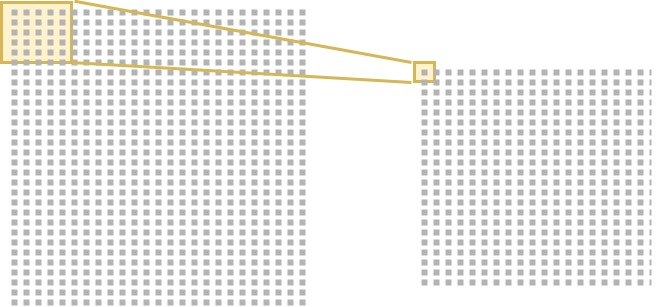
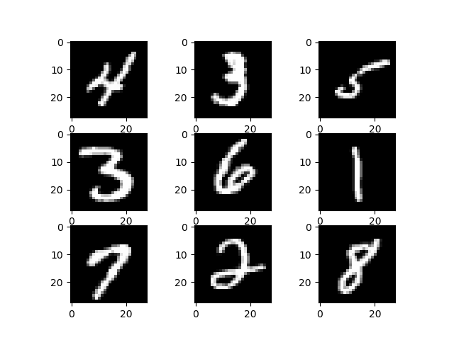

In the last couple of years, much buzz has emerged related to deep learning. Especially in the field of computer vision, much progress has been made with respect to replacing more traditional models with deep learning models that show very promising performance. For example, Tesla's autopilot relies on such models to a great extent.

But how do we create such _Convolutional Neural Networks_ (CNNs)? This blog explains it by means of the Keras deep learning framework for Python. We'll first look at the concept of a classifier, CNNs themselves and their components. We then continue with a real Keras / Python implementation for classifying numbers using the MNIST dataset.

The code used in this blog is also available freely at [GitHub](https://github.com/christianversloot/keras-cnn).

In this tutorial, you will...

- Understand the basic concepts behind Convolutional Neural Networks.
- Learn how to implement a ConvNet classifier with TensorFlow 2.0 and Keras.
- See how you can evaluate the CNN after it was trained.

Let's go! 😎

* * *

**Update 18/Jan/2021:** updated article title and tutorial information.

**Update 11/Jan/2021:** ensured timeliness of the article and updated header information. Added quick code example to the top of the article for people who want to immediately get started. Also updated article structure.

**Update 17/Nov/2020:** fixed error where Keras 1.x `backend` import after update remained in some of the code.

**Update 03/Nov/2020:** made the code compatible with TensorFlow 2.x. Also added links to newer blog articles that are valuable extensions to this article.

* * *

\[toc\]

* * *

## Code example: ConvNet with TensorFlow and Keras

Below, you'll find a full-fledged code example for a Convolutional Neural Network based classifier created with TensorFlow and Keras. Make sure to read the article below if you want to understand the code and the concepts in full detail.

```python
import tensorflow
from tensorflow.keras.datasets import mnist
from tensorflow.keras.models import Sequential
from tensorflow.keras.layers import Dense, Dropout, Flatten
from tensorflow.keras.layers import Conv2D, MaxPooling2D

# Model configuration
img_width, img_height = 28, 28
batch_size = 250
no_epochs = 25
no_classes = 10
validation_split = 0.2
verbosity = 1

# Load MNIST dataset
(input_train, target_train), (input_test, target_test) = mnist.load_data()

# Reshape data
input_train = input_train.reshape(input_train.shape[0], img_width, img_height, 1)
input_test = input_test.reshape(input_test.shape[0], img_width, img_height, 1)
input_shape = (img_width, img_height, 1) 

# Parse numbers as floats
input_train = input_train.astype('float32')
input_test = input_test.astype('float32')

# Convert into [0, 1] range.
input_train = input_train / 255
input_test = input_test / 255

# Convert target vectors to categorical targets
target_train = tensorflow.keras.utils.to_categorical(target_train, no_classes)
target_test = tensorflow.keras.utils.to_categorical(target_test, no_classes)

# Create the model
model = Sequential()
model.add(Conv2D(32, kernel_size=(3, 3), activation='relu', input_shape=input_shape))
model.add(MaxPooling2D(pool_size=(2, 2)))
model.add(Dropout(0.25))
model.add(Conv2D(64, kernel_size=(3, 3), activation='relu'))
model.add(MaxPooling2D(pool_size=(2, 2)))
model.add(Dropout(0.25))
model.add(Flatten())
model.add(Dense(256, activation='relu'))
model.add(Dense(no_classes, activation='softmax'))

# Compile the model
model.compile(loss=tensorflow.keras.losses.categorical_crossentropy,
              optimizer=tensorflow.keras.optimizers.Adam(),
              metrics=['accuracy'])

# Fit data to model
model.fit(input_train, target_train,
          batch_size=batch_size,
          epochs=no_epochs,
          verbose=verbosity,
          validation_split=validation_split)

# Generate generalization metrics
score = model.evaluate(input_test, target_test, verbose=0)
print(f'Test loss: {score[0]} / Test accuracy: {score[1]}')
```

* * *

## Basic ingredients

Before we can start off with creating our model in Keras, we must take a look at the basic ingredients of this post first. That means that this section will give you a brief introduction to the concept of a classifier. It will also tell you something about the nature of Convolutional Neural Networks.

We'll keep it brief, of course. We won't be looking into these topics deeply, since we've got other posts for that. However, it's necessary to understand them (or to recap them) if you wish to understand what happens in the actual Keras model.

If you're already very familiar with those basic concepts in machine learning / deep learning, feel free to continue to the next section. If not, let's go! :-)

### What is a classifier?

Suppose that you work in the field of separating non-ripe tomatoes from the ripe ones. It's an important job, one can argue, because we don't want to sell customers tomatoes they can't process into dinner. It's the perfect job to illustrate what a human [classifier](https://www.machinecurve.com/index.php/2020/10/19/3-variants-of-classification-problems-in-machine-learning/) would do.

Humans have a perfect eye to spot tomatoes that are not ripe or that have any other defect, such as being rotten. They derive certain characteristics for those tomatoes, e.g. based on color, smell and shape:

- If it's green, it's likely to be unripe (or: not sellable);
- If it smells, it is likely to be unsellable;
- The same goes for when it's white or when fungus is visible on top of it.

If none of those occur, it's likely that the tomato can be sold.

We now have _two classes_: sellable tomatoes and non-sellable tomatoes.

Human classifiers _decide about which class an object (a tomato) belongs to._

The same principle occurs again in machine learning and deep learning.

Only then, we replace the human with a machine learning model. We're then using machine learning for _classification_, or for deciding about some "model input" to "which class" it belongs.

Especially when we deal with image-like inputs, Convolutional Neural Networks can be very good at doing that.

### What is a Convolutional Neural Network?

I tend to compare the working of convolutional neural networks with magnifiers.

Suppose that you have an image. In the case of the humans classifying tomatoes above this would be the continuous stream of image-like data that is processed by our brain and is perceived with our eyes. In the case of artificial classification with machine learning models, it would likely be input generated from a camera such as a webcam.

You wish to detect certain characteristics from the object in order to classify them. This means that you'll have to make a _summary_ of those characteristics that gets more abstract over time. For example, with the tomatoes above, humans translate their continuous stream of observation into a fixed set of intuitive rules about when to classify a tomato as non-sellable; i.e., the three rules specified above.

Machine learning models and especially [convolutional neural networks (CNNs)](https://www.machinecurve.com/index.php/2018/12/07/convolutional-neural-networks-and-their-components-for-computer-vision/) do the same thing.



Summarizing with a convolutional layer, as if you're using a magnifier.

They essentially, like a magnifier, take a look at a very small part of the image and magnify the colors into a much denser bundle. By consequence, we're generating some kind of _summary_ of the initial image.

When we do that multiple times in a row, by adding multiple layers of such _convolutions_, we end up with a very abstract summary of the original image. This abstract summary can then be compared with some _average_ sellable tomato and non-sellable tomato learnt through training, and hence can be classified by a machine learning model.

And by consequence, especially with the large amounts of data that are used today, the machine learning community has been able to create very well-performing deep learning models that have accuracies of more than 99%!

_Please note_: due to reasons of simplicity, I left out the often-common layers like max pooling and batch normalization from the description above. It makes the story better to understand.

Hence, by creating an abstract summary with a Convolutional Neural Network, it's going to be possible to train a classifier that can _assign an object (the image) into a class_. Just like humans do. We'll show it next with a simple and clear example using the MNIST dataset in Keras.

* * *

## Today's dataset

For the model that we'll create today, we're going to use the MNIST [dataset](https://www.machinecurve.com/index.php/2019/12/31/exploring-the-keras-datasets/). The dataset, or the Modified National Institute of Standards and Technology database, contains many thousands of 28x28 pixel images of handwritten numbers, like this:



It's a very fine dataset for practicing with CNNs in Keras, since the dataset is already pretty normalized, there is not much noise and the numbers discriminate themselves relatively easily. Additionally, much data is available.

Hence, let's go and create our CNN! :-)

* * *

## Creating a CNN with TensorFlow 2.0 and Keras

### Software dependencies

We always start with listing certain dependencies that you'll need to install before you can run the model on your machine. Those are for today:

- **Python**: version 3.5-3.8.
- **TensorFlow**: `pip install tensorflow`.
- If you wish to generate plots, it's also wise to install **Numpy** (if it's not a peer dependency of the previous ones) and **Matplotlib**.

Preferably, you'll install these in an Anaconda environment. [Read here how to do that.](https://towardsdatascience.com/installing-keras-tensorflow-using-anaconda-for-machine-learning-44ab28ff39cb)

### Creating the model

The first step of creating the machine learning model is creating a folder, e.g. `keras-cnn`, with a file in it, e.g. `model.py`.

#### Model dependencies

In this file, we'll first import the dependencies that we require later on:

```python
import tensorflow
from tensorflow.keras.datasets import mnist
from tensorflow.keras.models import Sequential
from tensorflow.keras.layers import Dense, Dropout, Flatten
from tensorflow.keras.layers import Conv2D, MaxPooling2D
```

Obviously, we need **Keras** since it's the framework we're working with. We import the `mnist` dataset and benefit from the fact that it [comes with Keras by default](https://www.machinecurve.com/index.php/2019/12/31/exploring-the-keras-datasets/) - we don't have a lot of trouble using it.

With respect to the layers, we will primarily use the **Conv2D** and **Dense** layers - I would say that these constitute the _core_ of your deep learning model. The Conv2D layers will provide these _magnifier_ operations that I discussed before, at two dimensions (like on the image above). That means: it slides with a small 2D box over a larger 2D box, being the image. It goes without saying that one can also apply 3D convolutional layers (for analyzing videos, with boxes sliding over a larger box) and 1D convolutional layers (for analyzing e.g. timeseries, with 'pixels' / points on a line sliding over the line).

We use the Dense layers later on for generating predictions (_classifications_) as it's the structure used for that.

However, we'll also use **[Dropout](https://www.machinecurve.com/index.php/2019/12/18/how-to-use-dropout-with-keras/)**, **Flatten** and **[MaxPooling2D](https://www.machinecurve.com/index.php/2020/01/30/what-are-max-pooling-average-pooling-global-max-pooling-and-global-average-pooling/)**. A max pooling layer is often added after a Conv2D layer and it also provides a magnifier operation, although a different one. In the 2D case, it also slides with a box over the image (or in that case, the 'convolutional maps' generated by the first convolutional layer, i.e. the summarized image) and for every slide picks the maximum value for further propagation. In short, it generates an even stronger summary and can be used to induce sparsity when data is large.

Flatten connects the convolutional parts of the layer with the Dense parts. Those latter ones can only handle flat data, e.g. onedimensional data, but convolutional outputs are anything but onedimensional. Flatten simply takes all dimensions and concatenates them after each other.

With Dropout, we're essentially breaking tiny bits of the magnifier directly in front of it. This way, a little bit of noise is introduced into the summary during training. Since we're breaking the magnifiers randomly, the noise is somewhat random as well and hence cannot be predicted in advance. Perhaps counterintuitively, it tends to improve model performance and reduce overfitting: the variance between training images increases without becoming too large. This way, a 'weird' slice of e.g. a tomato can perhaps still be classified correctly.

#### Model configuration

We'll next configure the CNN itself:

```python
# Model configuration
img_width, img_height = 28, 28
batch_size = 250
no_epochs = 25
no_classes = 10
validation_split = 0.2
verbosity = 1
```

Since the MNIST images are 28x28 pixels, we define `img_width` and `img_height` to be 28. We use a batch size of 250 samples, which means that 250 samples are fed forward every time before a model improvement is calculated. We'll do 25 `epochs`, or passing _all_ data 25 times (in batches of 250 samples, many batches per epoch), and have 10 `classes`: the numbers 0-9. We also use 20% of the training data, or 0.2, for `validation` during optimization. Finally, we wish to see as much output as possible, thus configure the training process to be `verbose`.

#### Loading and preparing MNIST data

We next load and prepare the MNIST data. The code looks somewhat complex, but it is actually really simple:

```python
# Reshape data
input_train = input_train.reshape(input_train.shape[0], img_width, img_height, 1)
input_test = input_test.reshape(input_test.shape[0], img_width, img_height, 1)
input_shape = (img_width, img_height, 1)

# Parse numbers as floats
input_train = input_train.astype('float32')
input_test = input_test.astype('float32')

# Convert into [0, 1] range.
input_train = input_train / 255
input_test = input_test / 255
```

We first reshape our input data (the feature vectors). As you can see with the `input_shape`, it's the way your data must be built up to be handled correctly by the framework.

We then parse the numbers as floats, especially 32-bit floats. This [optimizes the trade-off between memory and number precision](https://www.machinecurve.com/index.php/2020/09/16/tensorflow-model-optimization-an-introduction-to-quantization/#float32-in-your-ml-model-why-its-great) over e.g. integers and 64-bit floats.

Finally, we convert the numbers to greyscale by dividing all (numeric!) image samples by 255. This allows them to be converted to the interval \[0, 1\] - or, greyscale. Why we do this? Because we don't care about the color of a number, only about the number itself.

#### Preparing target vectors with `to_categorical`

We next convert our target vectors, which are integers (`0-9`) into _categorical data_:

```python
# Convert target vectors to categorical targets
target_train = tensorflow.keras.utils.to_categorical(target_train, no_classes)
target_test = tensorflow.keras.utils.to_categorical(target_test, no_classes)
```

In a different post explaining [how to create MLPs with Keras](https://machinecurve.com/index.php/2019/07/27/how-to-create-a-basic-mlp-classifier-with-the-keras-sequential-api/), I explained the need for categorical data as being dependent on the loss function (the means of computing the difference between actual targets and generated predictions during passing the data forward):

>
> For those problems, we need a loss function that is called _categorical crossentropy._ In plain English, I always compare it with a purple elephant 🐘.  
>
> Suppose that the relationships in the real world (which are captured by your training date) together compose a purple elephant (a.k.a. distribution). We next train a machine learning model that attempts to be as accurate as the original data; hence attempting to classify data as that purple elephant. How well the model is capable of doing that is what is called a _loss_, and the loss function allows one to compare one distribution (elephant) with the other (hopefully the same elephant). Cross entropy allows one to compare those. We can't use the binary variant (it only compares two elephants), but need the _categorical_ one (which can compare multiple elephants). This however requires us to 'lock' the set of elephants first, to avoid that another one is added somehow. This is called _categorical data_: it belongs to a fixed set of categories (Chollet, 2017).
>
> [How to create a basic MLP classifier with the Keras Sequential API](https://machinecurve.com/index.php/2019/07/27/how-to-create-a-basic-mlp-classifier-with-the-keras-sequential-api/)

I suggest to click the link above if you wish to understand `to_categorical` at a deeper level. We'll need it again here, since we have 10 categories of data - the numbers 0 to 10, and don't ever include an 11th category in this scenario. Hence, we apply it in our model.

#### Creating your model architecture

We then create the architecture of the model:

```python
# Create the model
model = Sequential()
model.add(Conv2D(32, kernel_size=(3, 3), activation='relu', input_shape=input_shape))
model.add(MaxPooling2D(pool_size=(2, 2)))
model.add(Dropout(0.25))
model.add(Conv2D(64, kernel_size=(3, 3), activation='relu'))
model.add(MaxPooling2D(pool_size=(2, 2)))
model.add(Dropout(0.25))
model.add(Flatten())
model.add(Dense(256, activation='relu'))
model.add(Dense(no_classes, activation='softmax'))
```

We first define the `model` itself to be using the `Sequential` API, or, a stack of layers that together compose the Convolutional Neural Network.

We start off with a two-dimensional convolutional layer, or a Conv2D layer. It learns 32 [filters](https://machinecurve.com/index.php/2018/12/07/convolutional-neural-networks-and-their-components-for-computer-vision/#convolutional-layers), or feature maps, based on the data. The kernel, or the small image that slides over the larger one, is 3x3 pixels. As expected, we use the [ReLU](https://machinecurve.com/index.php/2019/09/04/relu-sigmoid-and-tanh-todays-most-used-activation-functions/) activation function for nonlinearity. In the first layer, we also specify the `input_shape` of our data, as determined by reshape.

The Conv2D layer is followed by a [MaxPooling2D](https://www.machinecurve.com/index.php/2020/01/30/what-are-max-pooling-average-pooling-global-max-pooling-and-global-average-pooling/) layer with a pool size of 2 x 2. That is, we further summarize the derivation of the Conv2D layer by applying max pooling with another image sliding over the filters that is 2x2 pixels. For every _slide_, it takes the maximum value (hence max pooling) within the 2x2 box and passes it on. Hence, each 2x2 = 4 pixel wide slide is turned into a one-pixel output. This greatly reduces memory requirements while keeping mostly intact your model performance.

Finally, before repeating the convolutional layers, we add [Dropout](https://www.machinecurve.com/index.php/2019/12/16/what-is-dropout-reduce-overfitting-in-your-neural-networks/). Dropout, as said, essentially breaks the magnifiers we discussed at the start of this blog. Hence, a little bit of random noise is introduced during training. This greatly reduces the odds of overfitting. It does so by converting certain inputs to 0, and does so randomly. The parameter `0.25` is the dropout rate, or the number of input neurons to drop (in this case, 25% of the inputs is converted to 0).

Since we wish to summarize further, we repeat the Conv2D process (although learning _more_ filters this time), the MaxPooling2D process and the Dropout process.

It's then likely that the summary is _general_ enough to compare new images and assign them one of the classes 0-9. We must however convert the many filters learnt and processed to a _flat_ structure before it can be processed by the part that can actually generate the predictions. Hence, we use the Flatten layer. Subsequently, we let the data pass through two Dense layers, of which the first is `ReLU`\-activated and the second one is `Softmax`\-activated. [Softmax activation](https://www.machinecurve.com/index.php/2020/01/08/how-does-the-softmax-activation-function-work/) essentially generates a _multiclass probability distribution_, or computes the probability that the item belongs to one of the classes 0-9, summed to 1 (the maximum probability). _This is also why we must have categorical data: it's going to be difficult to add an 11th class on the fly._

Note that the number of output neurons is `num_classes` for the final layer for the same reason: since `num_classes` probabilities must be computed, we must have `num_classes` different outputs so that for every class a unique output exists.

#### Model compilation & starting training

We then compile the model and start the training by _fitting the data_:

```python
# Compile the model
model.compile(loss=tensorflow.keras.losses.categorical_crossentropy,
              optimizer=tensorflow.keras.optimizers.Adam(),
              metrics=['accuracy'])

# Fit data to model
model.fit(input_train, target_train,
          batch_size=batch_size,
          epochs=no_epochs,
          verbose=verbosity,
          validation_split=validation_split)
```

Model compilation essentially _configures_ the model architecture that was created in the previous section. We decide about the _loss value_, about the _optimizer_, and the additional _metrics_ that will be used during the training process. We'll briefly cover them next:

- The **[loss function](https://www.machinecurve.com/index.php/2019/10/04/about-loss-and-loss-functions/)** can be used to compute the difference between the actual targets (as indicated by the training and/or testing data) and the targets generated by the model during an arbitrary epoch. The higher the difference, or the higher the loss, the worse the model performs. The goal of the machine learning training process is therefore to _minimize loss_.
- Each machine learning scenario needs a different loss function. Since we deal with _classification_, we must use a function called cross entropy. It essentially compares the actual outcomes with the generated outcomes by computing the _entropy_, or the difficulty of successfully comparing between the classes. Since our data is categorical in nature, we use **[categorical crossentropy](https://www.machinecurve.com/index.php/2019/10/17/how-to-use-categorical-multiclass-hinge-with-keras/)**.
- We use **Adaptive Moment Estimation** or **[Adam](https://www.machinecurve.com/index.php/2019/11/03/extensions-to-gradient-descent-from-momentum-to-adabound/)** for optimization. It's one of the de facto standard optimizers that are used today.
- For reasons of being more intuitive to humans, we also use **accuracy** as a metric.

We next _fit the data to the model_, or in plain English start the training process. We do so by feeding the training data (both inputs and targets), specifying the batch size, number of epochs, verbosity and validation split configured before.

And then let's see what happens!

#### Adding test metrics for testing generalization

...except that you'll need to add metrics for _testing_ as well. After training with the training and validation data, which essentially tells you something about the model's _predictive performance_, you also wish to test it for _generalization_ - or, whether it works well when data is used that the model has [never seen before](https://www.machinecurve.com/index.php/2020/11/03/how-to-evaluate-a-keras-model-with-model-evaluate/). That's why you created the train / test split in the first place. Now is the time to add a test, or an evaluation step, to the model - which executes just after the training process ends:

```python
# Generate generalization metrics
score = model.evaluate(input_test, target_test, verbose=0)
print(f'Test loss: {score[0]} / Test accuracy: {score[1]}')
```

### Final model

In the process, altogether you've created this:

```python
import tensorflow
from tensorflow.keras.datasets import mnist
from tensorflow.keras.models import Sequential
from tensorflow.keras.layers import Dense, Dropout, Flatten
from tensorflow.keras.layers import Conv2D, MaxPooling2D

# Model configuration
img_width, img_height = 28, 28
batch_size = 250
no_epochs = 25
no_classes = 10
validation_split = 0.2
verbosity = 1

# Load MNIST dataset
(input_train, target_train), (input_test, target_test) = mnist.load_data()

# Reshape data
input_train = input_train.reshape(input_train.shape[0], img_width, img_height, 1)
input_test = input_test.reshape(input_test.shape[0], img_width, img_height, 1)
input_shape = (img_width, img_height, 1) 

# Parse numbers as floats
input_train = input_train.astype('float32')
input_test = input_test.astype('float32')

# Convert into [0, 1] range.
input_train = input_train / 255
input_test = input_test / 255

# Convert target vectors to categorical targets
target_train = tensorflow.keras.utils.to_categorical(target_train, no_classes)
target_test = tensorflow.keras.utils.to_categorical(target_test, no_classes)

# Create the model
model = Sequential()
model.add(Conv2D(32, kernel_size=(3, 3), activation='relu', input_shape=input_shape))
model.add(MaxPooling2D(pool_size=(2, 2)))
model.add(Dropout(0.25))
model.add(Conv2D(64, kernel_size=(3, 3), activation='relu'))
model.add(MaxPooling2D(pool_size=(2, 2)))
model.add(Dropout(0.25))
model.add(Flatten())
model.add(Dense(256, activation='relu'))
model.add(Dense(no_classes, activation='softmax'))

# Compile the model
model.compile(loss=tensorflow.keras.losses.categorical_crossentropy,
              optimizer=tensorflow.keras.optimizers.Adam(),
              metrics=['accuracy'])

# Fit data to model
model.fit(input_train, target_train,
          batch_size=batch_size,
          epochs=no_epochs,
          verbose=verbosity,
          validation_split=validation_split)

# Generate generalization metrics
score = model.evaluate(input_test, target_test, verbose=0)
print(f'Test loss: {score[0]} / Test accuracy: {score[1]}')
```

It's a complete Keras model that can now be run in order to find its performance and to see whether it works. Let's go!

Open your terminal, preferably an Anaconda environment, and ensure that all the necessary dependencies are installed and are in working order.

Then, navigate to the folder with e.g. `cd /path/to/folder` and execute your model with Python: e.g. `python model.py`. You should see Keras starting up, running the training process in TensorFlow, and displaying the results of the epochs.

* * *

## Model performance

With the training process configured above, this is what you'll likely see:

```shell
Epoch 1/25
48000/48000 [==============================] - 7s 145us/step - loss: 0.3609 - acc: 0.8909 - val_loss: 0.1040 - val_acc: 0.9711
Epoch 2/25
48000/48000 [==============================] - 3s 71us/step - loss: 0.0981 - acc: 0.9694 - val_loss: 0.0625 - val_acc: 0.9820
Epoch 3/25
48000/48000 [==============================] - 3s 70us/step - loss: 0.0674 - acc: 0.9785 - val_loss: 0.0599 - val_acc: 0.9827
Epoch 4/25
48000/48000 [==============================] - 3s 70us/step - loss: 0.0549 - acc: 0.9824 - val_loss: 0.0454 - val_acc: 0.9863
Epoch 5/25
48000/48000 [==============================] - 3s 71us/step - loss: 0.0451 - acc: 0.9858 - val_loss: 0.0364 - val_acc: 0.9896
Epoch 6/25
48000/48000 [==============================] - 4s 74us/step - loss: 0.0370 - acc: 0.9888 - val_loss: 0.0333 - val_acc: 0.9908
Epoch 7/25
48000/48000 [==============================] - 4s 73us/step - loss: 0.0317 - acc: 0.9896 - val_loss: 0.0367 - val_acc: 0.9892
Epoch 8/25
48000/48000 [==============================] - 4s 74us/step - loss: 0.0283 - acc: 0.9911 - val_loss: 0.0327 - val_acc: 0.9904
Epoch 9/25
48000/48000 [==============================] - 4s 76us/step - loss: 0.0255 - acc: 0.9912 - val_loss: 0.0345 - val_acc: 0.9902
Epoch 10/25
48000/48000 [==============================] - 4s 76us/step - loss: 0.0215 - acc: 0.9930 - val_loss: 0.0290 - val_acc: 0.9929
Epoch 11/25
48000/48000 [==============================] - 4s 76us/step - loss: 0.0202 - acc: 0.9934 - val_loss: 0.0324 - val_acc: 0.9913
Epoch 12/25
48000/48000 [==============================] - 4s 77us/step - loss: 0.0198 - acc: 0.9935 - val_loss: 0.0298 - val_acc: 0.9919
Epoch 13/25
48000/48000 [==============================] - 5s 107us/step - loss: 0.0173 - acc: 0.9942 - val_loss: 0.0326 - val_acc: 0.9916
Epoch 14/25
48000/48000 [==============================] - 4s 79us/step - loss: 0.0148 - acc: 0.9947 - val_loss: 0.0319 - val_acc: 0.9910
Epoch 15/25
48000/48000 [==============================] - 4s 79us/step - loss: 0.0127 - acc: 0.9955 - val_loss: 0.0316 - val_acc: 0.9917
Epoch 16/25
48000/48000 [==============================] - 4s 85us/step - loss: 0.0135 - acc: 0.9954 - val_loss: 0.0347 - val_acc: 0.9907
Epoch 17/25
48000/48000 [==============================] - 4s 85us/step - loss: 0.0124 - acc: 0.9959 - val_loss: 0.0297 - val_acc: 0.9919
Epoch 18/25
48000/48000 [==============================] - 4s 85us/step - loss: 0.0118 - acc: 0.9957 - val_loss: 0.0306 - val_acc: 0.9917
Epoch 19/25
48000/48000 [==============================] - 4s 84us/step - loss: 0.0112 - acc: 0.9960 - val_loss: 0.0303 - val_acc: 0.9924
Epoch 20/25
48000/48000 [==============================] - 4s 84us/step - loss: 0.0094 - acc: 0.9968 - val_loss: 0.0281 - val_acc: 0.9924
Epoch 21/25
48000/48000 [==============================] - 4s 85us/step - loss: 0.0098 - acc: 0.9966 - val_loss: 0.0306 - val_acc: 0.9923
Epoch 22/25
48000/48000 [==============================] - 4s 84us/step - loss: 0.0094 - acc: 0.9967 - val_loss: 0.0320 - val_acc: 0.9921
Epoch 23/25
48000/48000 [==============================] - 4s 85us/step - loss: 0.0068 - acc: 0.9979 - val_loss: 0.0347 - val_acc: 0.9917
Epoch 24/25
48000/48000 [==============================] - 5s 100us/step - loss: 0.0074 - acc: 0.9974 - val_loss: 0.0347 - val_acc: 0.9916
Epoch 25/25
48000/48000 [==============================] - 4s 85us/step - loss: 0.0072 - acc: 0.9975 - val_loss: 0.0319 - val_acc: 0.9925

Test loss: 0.02579820747410522 / Test accuracy: 0.9926
```

In 25 epochs, the model has achieved a _validation accuracy_ of approximately 99.3%. That's great: in most of the cases, the model was successful in predicting the number that was input to the network. What's even better is that it shows similar performance for the _generalization test_ executed near the end, with the test data: similarly, test accuracy is 99.3%. Model loss is even better than _during_ training!

* * *

## Summary

In this blog, we've seen how to create a Convolutional Neural Network classifier for image-like data. We introduced the concepts of classifiers and CNNs and built one in Keras, harnessing the MNIST numbers dataset for reasons of simplicity. We explained the design considerations that we made as well.

If you're interested in the code, you might also take a look at [GitHub](https://github.com/christianversloot/keras-cnn).

I really hope that this blog post has helped you in understanding the concepts of CNNs and CNNs in Keras. If you have any questions, remarks, comments whatsoever, please feel free to leave a comment below.

Happy engineering! 😊

* * *

## References

Chollet, F. (2017). _Deep Learning with Python_. New York, NY: Manning Publications.

MNIST handwritten digit database, Yann LeCun, Corinna Cortes and Chris Burges. (n.d.). Retrieved from [http://yann.lecun.com/exdb/mnist/](http://yann.lecun.com/exdb/mnist/)

Keras. (n.d.). Core Layers. Retrieved from [https://keras.io/layers/core/](https://keras.io/layers/core/)

When should I use tf.float32 vs tf.float64 in TensorFlow? (n.d.). Retrieved from [https://www.quora.com/When-should-I-use-tf-float32-vs-tf-float64-in-TensorFlow](https://www.quora.com/When-should-I-use-tf-float32-vs-tf-float64-in-TensorFlow)

MachineCurve. (2019, July 27). How to create a basic MLP classifier with the Keras Sequential API – MachineCurve. Retrieved from [https://machinecurve.com/index.php/2019/07/27/how-to-create-a-basic-mlp-classifier-with-the-keras-sequential-api/](https://machinecurve.com/index.php/2019/07/27/how-to-create-a-basic-mlp-classifier-with-the-keras-sequential-api/)
