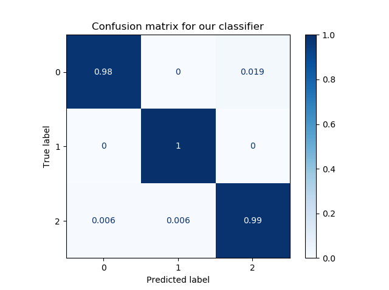
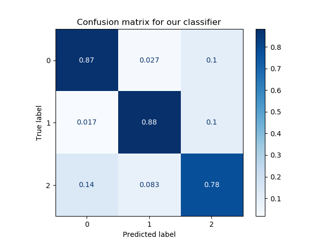
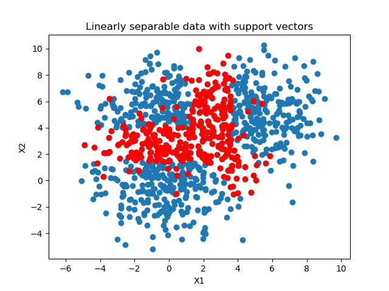
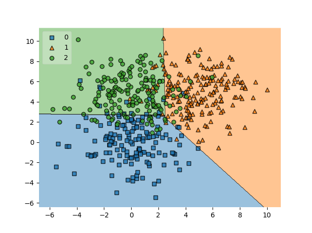
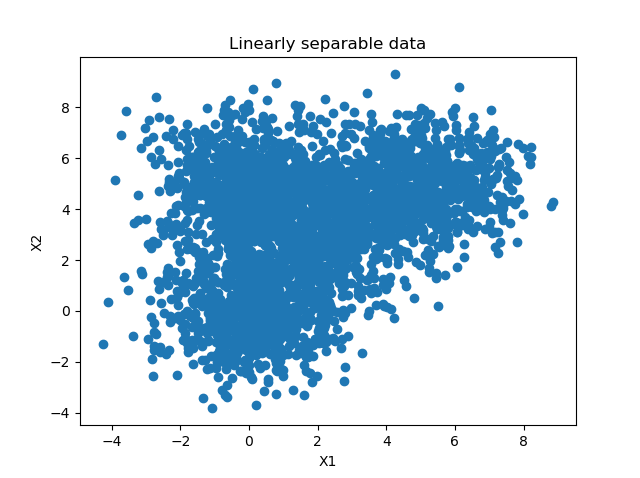
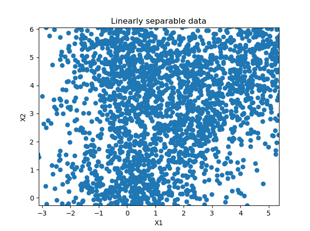
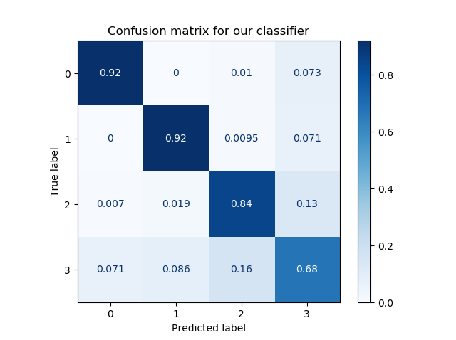
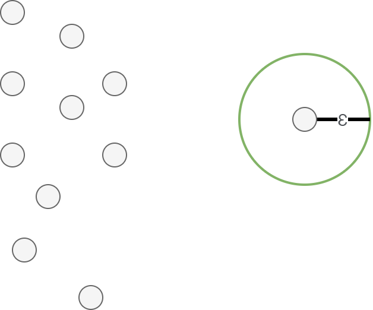
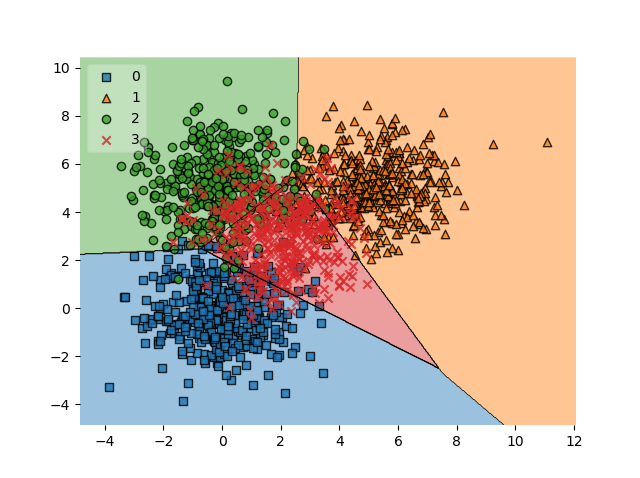
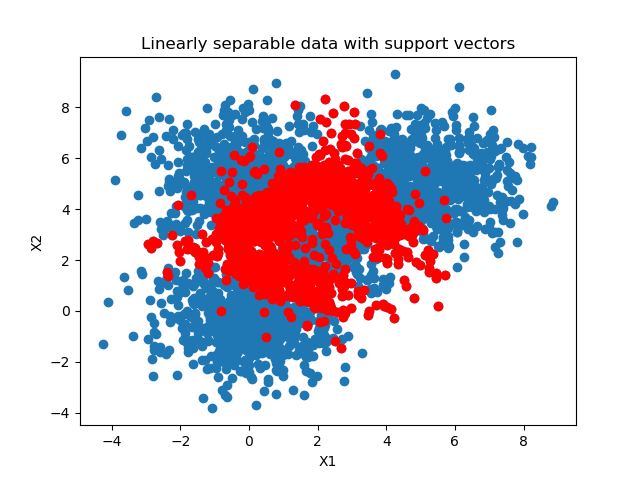

After training a supervised machine learning model such as a classifier, you would like to know how well it works.

This is often done by setting apart a small piece of your data called the **test set**, which is used as data that the model has never seen before.

If it performs well on this dataset, it is likely that the model performs well on other data too - if it is sampled from the same distribution as your test set, of course.

Now, when you test your model, you feed it the data - and compare the predictions with the ground truth, measuring the number of true positives, true negatives, false positives and false negatives. These can subsequently be visualized in a visually appealing **confusion matrix**.

In today's blog post, we'll show you how to create such a confusion matrix with Scikit-learn, one of the most widely used frameworks for machine learning in today's ML community. By means of an example created with Python, we'll show you step-by-step how to generate a matrix with which you can visually determine the performance of your model easily.

All right, let's go! :)

* * *

\[toc\]

* * *

## A confusion matrix in more detail

Training your machine learning model involves its evaluation. In many cases, you have set apart a test set for this.

The test set is a dataset that the trained model has never seen before. Using it allows you to test whether the model has overfit, or adapted to the training data too well, or whether it still generalizes to new data.

This allows you to ensure that your model does not perform very poorly on new data while it still performs really good on the training set. That wouldn't really work in practice, would it :)

Evaluation with a test set often happens by feeding all the samples to the model, generating a prediction. Subsequently, the predictions are compared with the _ground truth_ - or the true targets corresponding to the test set. These can subsequently be used for computing various metrics.

But they can also be used to demonstrate model performance in a visual way.

Here is an example of a confusion matrix:

[](https://www.machinecurve.com/wp-content/uploads/2020/05/cf_matrix.png)

To be more precise, it is a _normalized_ confusion matrix. Its axes describe two measures:

- The **true labels**, which are the ground truth represented by your test set.
- The **predicted labels**, which are the predictions generated by the machine learning model for the features corresponding to the true labels.

It allows you to easily compare how well your model performs. For example, in the model above, for all true labels 1, the predicted label is 1. This means that all samples from class 1 were classified correctly. Great!

For the other classes, performance is also good, but a little bit worse. As you can see, for class 2, some samples were predicted as being part of classes 0 and 1.

In short, it answers the question "For my true labels / ground truth, how well does the model predict?".

It's also possible to start from a prediction point of view. In this case, the question would change to "For my predicted label, how many predictions are actually part of the predicted class?". It's the opposite point of view, but could be a valid question in many machine learning cases.

Most preferably, the entire set of true labels is equal to the set of predicted labels. In those cases, you would see zeros everywhere except for the line from the top left to the bottom right. In practice, however, this does not happen often. Likely, the plot is much more scattered, like this SVM classifier where many supporrt vectors are necessary to draw [a decision boundary](https://www.machinecurve.com/index.php/2019/10/11/how-to-visualize-the-decision-boundary-for-your-keras-model/) that _does not work perfectly, but adequately enough:_

- [](https://www.machinecurve.com/wp-content/uploads/2020/05/likethis.png)
    
- [](https://www.machinecurve.com/wp-content/uploads/2020/05/likethis2.png)
    
- [](https://www.machinecurve.com/wp-content/uploads/2020/05/likekthis3.png)
    

* * *

## Creating a confusion matrix with Python and Scikit-learn

Let's now see if we can create a confusion matrix ourselves. Today, we will be using Python and Scikit-learn, one of the most widely used frameworks for machine learning today.

Creating a confusion matrix involves various steps:

1. **Generating an example dataset.** This one makes sense: we need data to train our model on. We'll therefore be generating data first, so that we can make an adequate choice for a ML model class next.
2. **Picking a machine learning model class.** Obviously, if we want to evaluate a model, we need to train a model. We'll choose a particular type of model first that fits the characteristics of our data.
3. **Constructing and training the ML model.** The consequence of the first two steps is that we end up with a trained model.
4. **Generating the confusion matrix.** Finally, based on the trained model, we can create our confusion matrix.

### Software dependencies you need to install

Very briefly, but importantly: if you wish to run this code, you must make sure that you have certain software dependencies installed. Here they are:

- You need to install **Python**, which is the platform that our code runs on, version 3.6+.
- You need to install **Scikit-learn**, the machine learning framework that we will be using today: `pip install -U scikit-learn`.
- You need to install **Numpy** for numbers processing: `pip install numpy`.
- You need to install **Matplotlib** for visualizing the plots: `pip install matplotlib`.
- Finally, if you wish to generate a plot of decision boundaries (not required), you also need to install **Mlxtend:** `pip install mlxtend`.

\[affiliatebox\]

### Generating an example dataset

The first step is generating an example dataset. We will be using Scikit-learn for this purpose too. First, create a file called `confusion-matrix.py`, and open it in a code editor. The first thing we do is add the imports:

```python
# Imports
from sklearn.datasets import make_blobs
from sklearn.model_selection import train_test_split
import numpy as np
import matplotlib.pyplot as plt
```

The `make_blobs` function from Scikit-learn allows us to generate 'blobs', or clusters, of samples. Those blobs are centered around some point and are the samples are scattered around this point based on some standard deviation. This gives you flexibility about both the position and the structure of your generated dataset, in turn allowing you to experiment with a variety of ML models without having to worry about the data.

As we will evaluate the model, we need to ensure that the dataset is split between training and testing data. Scikit-learn also allows us to do this, with `train_test_split`. We therefore import that one too.

#### Configuration options

Next, we can define a number of configuration options:

```python
# Configuration options
blobs_random_seed = 42
centers = [(0,0), (5,5), (0,5), (2,3)]
cluster_std = 1.3
frac_test_split = 0.33
num_features_for_samples = 4
num_samples_total = 5000
```

The **random seed** describes the initialization of the pseudo-random number generator used for generating the blobs of data. As you may know, no random number generator is truly random. What's more, they are also initialized differently. Configuring a fixed seed ensures that every time you run the script, the random number generator initializes in the same way. If weird behavior occurs, you know that it's likely not the random number generator.

The **centers** describe the centers in two-dimensional space of our blobs of data. As you can see, we have 4 blobs today.

The **cluster standard deviation** describes the standard deviation with which a sample is drawn from the sampling distribution used by the random point generator. We set it to 1.3; a lower number produces clusters that are better separable, and vice-versa.

The **fraction of the train/test split** determines how much data is split off for testing purposes. In our case, that's 33% of the data.

The **number of features for our samples** is 4, and indeed describes how many targets we have: 4, as we have 4 blobs of data.

Finally, the **number of samples generated** is pretty self-explanatory. We set it to 5000 samples. That's not too much data, but more than sufficient for the educational purposes of today's blog post.

#### Generating the data

Next up is the call to `make_blobs` and to `train_test_split` for actually generating and splitting the data:

```python
# Generate data
inputs, targets = make_blobs(n_samples = num_samples_total, centers = centers, n_features = num_features_for_samples, cluster_std = cluster_std)
X_train, X_test, y_train, y_test = train_test_split(inputs, targets, test_size=frac_test_split, random_state=blobs_random_seed)
```

#### Saving the data (optional)

Once the data is generated, you may choose to save it to file. This is an optional step - and I include it because I want to re-use the same dataset every time I run the script (e.g. because I am tweaking a visualization). If you use the code below, you can run it once - then, it's saved in the `.npy` file. When you subsequently uncomment the `np.save` call, and possibly also the generate data calls, you'll always have the same data load from file.

Then, you can tweak away your visualization easily without having to deal with new data all the time :)

```python
# Save and load temporarily
np.save('./data_cf.npy', (X_train, X_test, y_train, y_test))
X_train, X_test, y_train, y_test = np.load('./data_cf.npy', allow_pickle=True)
```

Should you wish to visualize the data, this is of course possible:

```python
# Generate scatter plot for training data
plt.scatter(X_train[:,0], X_train[:,1])
plt.title('Linearly separable data')
plt.xlabel('X1')
plt.ylabel('X2')
plt.show()
```

### Picking a machine learning model class

Now that we have our code for generating the dataset, we can take a look at the output to determine what kind of model we could use:



I can derive a few characteristics from this dataset (which, obviously, I also built-in up front ;-) ).

First of all, the number of features is low: only two - as our data is two-dimensional. This is good, because then we likely don't face the curse of dimensionality, and a wider range of ML models is applicable.

Next, when inspecting the data from a closer point of view, I can see a gap between what seem to be blobs of data (it is also slightly visible in the diagram above):

[](https://www.machinecurve.com/wp-content/uploads/2020/05/possibly_separable.png)

This suggests that the data may be separable, and possibly even linearly so (yes, of course, I know this is the case ;-) ).

Third, and finally, the number of samples is relatively low: only 5.000 samples are present. Neural networks with their relatively large amount of trainable parameters would likely start overfitting relatively quickly, so they wouldn't be my preferable choice.

However, traditional machine learning techniques to the rescue. A [Support Vector Machine](https://www.machinecurve.com/index.php/2020/05/03/creating-a-simple-binary-svm-classifier-with-python-and-scikit-learn/), which attempts to construct a decision boundary between separable blobs of data, can be a good candidate here. Let's give it a try: we're going to construct and train an SVM and see how well it performs through its confusion matrix.

### Constructing and training the ML model

As we have seen in the post linked above, we can also use Scikit-learn to construct and train a SVM classifier. Let's do so next.

#### Model imports

First, we'll have to add a few extra imports to the top of our script:

```python
from sklearn import svm
from sklearn.metrics import plot_confusion_matrix
from mlxtend.plotting import plot_decision_regions
```

(The Mlxtend one is optional, as we discussed at 'what you need to install', but could be useful if you wish to [visualize the decision boundary](https://www.machinecurve.com/index.php/2019/10/11/how-to-visualize-the-decision-boundary-for-your-keras-model/) later.)

#### Training the classifier

First, we initialize the SVM classifier. I'm using a `linear` kernel because I suspect (actually, I'm confident, as we constructed the data ourselves) that the data is linearly separable:

```python
# Initialize SVM classifier
clf = svm.SVC(kernel='linear')
```

Then, we fit the training data - starting the training process:

```python
# Fit data
clf = clf.fit(X_train, y_train)
```

That's it for training the machine learning model! The classifier variable, or `clf`, now contains a reference to the trained classifier. By calling `clf.predict`, you can now generate predictions for new data.

### Generating the confusion matrix

But let's take a look at generating that confusion matrix now. As we discussed, it's part of the evaluation step, and we use it to visualize its predictive and generalization power on the _test set_.

Recall that we compare the predictions generated during evaluation with the ground truth available for those inputs.

The `plot_confusion_matrix` call takes care of this for us, and we simply have to provide it the classifier (`clf`), the test set (`X_test` and `y_test`), a color map and whether to normalize the data.

```python
# Generate confusion matrix
matrix = plot_confusion_matrix(clf, X_test, y_test,
                                 cmap=plt.cm.Blues,
                                 normalize='true')
plt.title('Confusion matrix for our classifier')
plt.show(matrix)
plt.show()
```



Normalization, here, involves converting back the data into the \[0, 1\] format above. If you leave out normalization, you get the number of samples that are part of that prediction:

[](https://www.machinecurve.com/wp-content/uploads/2020/05/samples-1.png)

Here are some other visualizations that help us explain the confusion matrix (for the [boundary plot](https://www.machinecurve.com/index.php/2019/10/11/how-to-visualize-the-decision-boundary-for-your-keras-model/), you need to install Mlxtend with `pip install mlxtend`):

- 
    
- 
    

```python
# Get support vectors
support_vectors = clf.support_vectors_

# Visualize support vectors
plt.scatter(X_train[:,0], X_train[:,1])
plt.scatter(support_vectors[:,0], support_vectors[:,1], color='red')
plt.title('Linearly separable data with support vectors')
plt.xlabel('X1')
plt.ylabel('X2')
plt.show()

# Plot decision boundary
plot_decision_regions(X_test, y_test, clf=clf, legend=2)
plt.show()
```

It's clear that we need many support vectors (the red samples) to generate the decision boundary. Given the relative _unclarity_ of the separability between the data points, this is not unexpected. I'm actually quite satisfied with the performance of the model, as demonstrated by the confusion matrix (relatively blue diagonal line).

The only class that underperforms is class 3, with a score of 0.68. It's still acceptable, but is lower than preferred. This can be explained by looking at the class in the [decision boundary plot](https://www.machinecurve.com/index.php/2019/10/11/how-to-visualize-the-decision-boundary-for-your-keras-model/). Here, it's clear that it's the middle class - the reds. As those samples are surrounded by the other ones, it's clear that the model has had significant difficulty generating the decision boundary. We might for example counter this by using a different kernel function which takes this into account, ensuring better separability. However, that's not the core of today's post.

### Full model code

Should you wish to obtain the full model code, that's of course possible. Here you go :)

```python
# Imports
from sklearn.datasets import make_blobs
from sklearn.model_selection import train_test_split
import numpy as np
import matplotlib.pyplot as plt
from sklearn import svm
from sklearn.metrics import plot_confusion_matrix
from mlxtend.plotting import plot_decision_regions

# Configuration options
blobs_random_seed = 42
centers = [(0,0), (5,5), (0,5), (2,3)]
cluster_std = 1.3
frac_test_split = 0.33
num_features_for_samples = 4
num_samples_total = 5000

# Generate data
inputs, targets = make_blobs(n_samples = num_samples_total, centers = centers, n_features = num_features_for_samples, cluster_std = cluster_std)
X_train, X_test, y_train, y_test = train_test_split(inputs, targets, test_size=frac_test_split, random_state=blobs_random_seed)

# Save and load temporarily
np.save('./data_cf.npy', (X_train, X_test, y_train, y_test))
X_train, X_test, y_train, y_test = np.load('./data_cf.npy', allow_pickle=True)

# Generate scatter plot for training data
plt.scatter(X_train[:,0], X_train[:,1])
plt.title('Linearly separable data')
plt.xlabel('X1')
plt.ylabel('X2')
plt.show()

# Initialize SVM classifier
clf = svm.SVC(kernel='linear')

# Fit data
clf = clf.fit(X_train, y_train)

# Generate confusion matrix
matrix = plot_confusion_matrix(clf, X_test, y_test,
                                 cmap=plt.cm.Blues)
plt.title('Confusion matrix for our classifier')
plt.show(matrix)
plt.show()

# Get support vectors
support_vectors = clf.support_vectors_

# Visualize support vectors
plt.scatter(X_train[:,0], X_train[:,1])
plt.scatter(support_vectors[:,0], support_vectors[:,1], color='red')
plt.title('Linearly separable data with support vectors')
plt.xlabel('X1')
plt.ylabel('X2')
plt.show()

# Plot decision boundary
plot_decision_regions(X_test, y_test, clf=clf, legend=2)
plt.show()
```

\[affiliatebox\]

## Summary

That's it for today! In this blog post, we created a confusion matrix with Python and Scikit-learn. After studying what a confusion matrix is, and how it displays true positives, true negatives, false positives and false negatives, we gave a step-by-step example for creating one yourself.

The example included generating a dataset, picking a suitable machine learning model for the dataset, constructing, configuring and training it, and finally interpreting the results i.e. the confusion matrix. This way, you should be able to understand what is happening and why I made certain choices.

I hope you've learnt something from today's blog post! :) If you did, I would really appreciate it if you left a comment in the comments section 💬 Please do the same if you have questions or remarks. I'll happily answer and improve my blog post where necessary.

Thank you for reading MachineCurve today and happy engineering! 😎

\[scikitbox\]

* * *

## References

Raschka, S. (n.d.). _Home - mlxtend_. Site not found · GitHub Pages. [https://rasbt.github.io/mlxtend/](https://rasbt.github.io/mlxtend/)

_Scikit-learn_. (n.d.). scikit-learn: machine learning in Python — scikit-learn 0.16.1 documentation. Retrieved May 3, 2020, from [https://scikit-learn.org/stable/index.html](https://scikit-learn.org/stable/index.html)

Scikit-learn. (n.d.). _1.4. Support vector machines — scikit-learn 0.22.2 documentation_. scikit-learn: machine learning in Python — scikit-learn 0.16.1 documentation. Retrieved May 3, 2020, from [https://scikit-learn.org/stable/modules/svm.html#classification](https://scikit-learn.org/stable/modules/svm.html#classification)

Scikit-learn. (n.d.). _Confusion matrix — scikit-learn 0.22.2 documentation_. scikit-learn: machine learning in Python — scikit-learn 0.16.1 documentation. Retrieved May 5, 2020, from [https://scikit-learn.org/stable/auto\_examples/model\_selection/plot\_confusion\_matrix.html](https://scikit-learn.org/stable/auto_examples/model_selection/plot_confusion_matrix.html)

Scikit-learn. (n.d.). _Sklearn.metrics.plot\_confusion\_matrix — scikit-learn 0.22.2 documentation_. scikit-learn: machine learning in Python — scikit-learn 0.16.1 documentation. Retrieved May 5, 2020, from [https://scikit-learn.org/stable/modules/generated/sklearn.metrics.plot\_confusion\_matrix.html#sklearn.metrics.plot\_confusion\_matrix](https://scikit-learn.org/stable/modules/generated/sklearn.metrics.plot_confusion_matrix.html#sklearn.metrics.plot_confusion_matrix)
