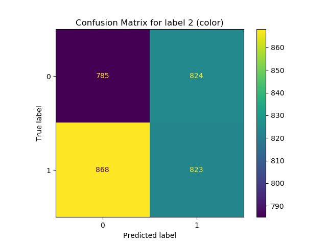
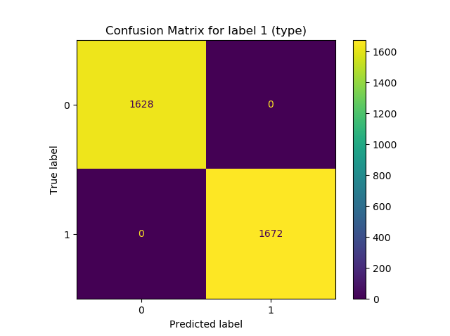

Classification comes in many flavors. For example, if you need to categorize your input samples into one out of two classes, you are dealing with a binary classification problem. Is the number of classes > 2, the problem is a multiclass one. But now, what if you won't classify your input sample into _one_ out of many classes, but rather into _some_ of the many classes?

That would be a multilabel classification problem and we're going to cover it from a Support Vector Machine perspective in this article.

Support Vector Machines can be used for building classifiers. They are natively equipped to perform binary classification tasks. However, they cannot perform multiclass and multilabel classification natively. Fortunately, there are techniques out there with which this becomes possible. How the latter - multilabel classification - can work with an SVM is what you will see in this article. It is structured as follows.

Firstly, we'll take a look at multilabel classification in general. What is it? What can it be used for? And how is it different from multi_class_ classification? This is followed by looking at multilabel classification with Support Vector Machines. In particular, we will look at why multilabel classification is not possible natively. Fortunately, the Scikit-learn library for machine learning provides a `MultiOutputClassifier` module, with which it _is_ possible to create a multilabel SVM! We cover implementing one with Scikit-learn and Python step by step in the final part of this article.

Let's take a look! 😎

* * *

\[toc\]

* * *

## What is multilabel classification?

Imagine that you're an employee working in a factory. Your task is to monitor a conveyor belt which is forwarding two types of objects: a yellow rotated-and-square-shaped block and a blue, circular one. When an object is near the end of the conveyor belt, you must label it with two types of labels: its _color_ and its _shape_.

In other words, the labels yellow and square are attached to the yellow squares, while blue and circular end up with the blue circles.

This is a human-powered **multilabel classifier**. Human beings inspect objects, attach \[latex\]N\[/latex\] labels to them (here \[latex\]N = 2\[/latex\]), and pass them on - possibly into a bucket or onto another conveyor belt for packaging. So far, so good.


Human beings can however be quite a bottleneck in such a process. Because it is so repetitive, it can become boring, and if humans don't like something, it's to be bored at work. In addition, the work is very continuous and hence tiring, increasing the odds of human error. In other words, wouldn't it be a good idea to replace the human being with a machine here? The result would be a reduction in error rates while humans might be happier, doing more creative work.

That's where Machine Learning comes into play. If we can learn to distinguish the yellow objects from the blue ones, we can build an automated system that attaches the labels for us. Since machines never get tired and work with what they have learnt from observations, they could potentially be a good replacement in our conveyor belt scenario.

There are many algorithms with which multilabel classification can be implemented. Neural Networks also belong to that category and are very popular these days. However, another class of algorithms with which a multilabel classifier can be created is that of Support Vector Machines. Let's now take a look at what SVMs are, how they work, and how we can create a multilabel classifier with them.

* * *

## Multilabel classification with Support Vector Machines

If we want to build a multilabel classifier with Support Vector Machines, we must first know how they work. For this reason, we will now take a brief look at what SVMs are conceptually and how they work. In addition, we'll provide some brief insight into why a SVM cannot be used for multilabel classification _natively_. This provides the necessary context for understanding how we _can make it work_ regardless, and you will understand the technique and the need for it better.

Let's now cut to the chase.

A [Support Vector Machine](https://www.machinecurve.com/index.php/2019/09/20/intuitively-understanding-svm-and-svr/) is a class of Machine Learning algorithms which uses _kernel functions_ to learn a decision boundary between two classes (or learn a function for regression, should you be doing that). This decision boundary is of _maximum margin_ between the two classes, meaning that it is _equidistant_ from classes one and two. In the figure below, that would be the class of black items and the class of white ones. In addition, determining the boundary (which is called a _hyperplane_) is performed by means of _support vectors_.

All right, that's quite a lot of complexity, so let's break it apart into plainer English.

In the figure below, you can see three decision boundaries \[latex\]H\_1\[/latex\], \[latex\]H\_2\[/latex\] and \[latex\]H\_3\[/latex\]. These decision boundaries are also called hyperplanes because they are `N-1` dimensional compared to the feature space itself. In other words, in the figure below, we have a two-dimensional feature space (axes \[latex\]X\_1\[/latex\] and \[latex\]X\_2\[/latex\]) and have three one-dimensional lines (i.e. hyperplane) that serve as candidate decision boundaries: indeed, \[latex\]H\_1\[/latex\], \[latex\]H\_2\[/latex\] and \[latex\]H\_3\[/latex\].

\[latex\]H\_1\[/latex\] is actually no decision boundary at all, because it cannot distinguish between the classes. The other two _are_ decision boundaries, because they can successfully be used to separate the classes from each other. But which is best? Obviously, that's \[latex\]H\_3\[/latex\], even intuitively. But why is that the case? Let's look at the decision boundary in more detail.

If you look at the line more closely, you can see that it is precisely in the middle of the area between the samples from each class _that are closest to each other_. These samples are called the _support vectors_, and hence the name _Support Vector_ Machine. They effectively support the algorithm in learning the decision boundary. Now, recall that the line is precisely in the middle of the area in between those support vectors. This means that the line is _equidistant_ to the two classes, meaning that on both ends the distance is the same. This in return means that our decision boundary is of _maximum margin_ - it has the highest margin between the classes and is hence (one of the two) best decision boundaries that can be found.


Hyperplanes and data points. The [image](https://en.wikipedia.org/wiki/Support-vector_machine#/media/File:Svm_separating_hyperplanes_(SVG).svg)is not edited. Author: [Zack Weinberg](https://commons.wikimedia.org/w/index.php?title=User:ZackWeinberg&action=edit&redlink=1), derived from [Cyc’s](https://commons.wikimedia.org/w/index.php?title=User:Cyc&action=edit&redlink=1) work. License: [CC BY-SA 3.0](https://creativecommons.org/licenses/by-sa/3.0/legalcode)

### Why SVMs can't perform multiclass and multilabel classification natively

An unfortunate consequence of the way that SVMs learn their decision boundary is that they cannot be used for [multilabel or multiclass classification](https://www.machinecurve.com/index.php/2020/10/19/3-variants-of-classification-problems-in-machine-learning/). The reason why is simple: for a decision boundary to be a decision boundary in a SVM, the hyperplane (in our two-dimensional feature space that's a line) must be _equidistant_ from the classes in order to ensure _maximum margin_.

We can see that if we would add another class, generating a multiclass classification scenario, this would no longer be the case: at maximum, we can only guarantee equidistance between two of the classes - discarding this property with all other classes. The way an SVM works thus means that it cannot be used for multiclass classification, but fortunately there are many approaches (such as [One-vs-One/One-vs-Rest](https://www.machinecurve.com/index.php/2020/11/11/creating-one-vs-rest-and-one-vs-one-svm-classifiers-with-scikit-learn/)) which can be used. [Error-Correcting Output Codes](https://www.machinecurve.com/index.php/2020/11/12/using-error-correcting-output-codes-for-multiclass-svm-classification/) are another means for generating a multiclass SVM classifier.

The other case would be multilabel classification. Here, we don't assign one out of multiple classes to the input sample, but rather, we assign _multiple_ classes to the input sample. Here, the number of classes assigned can in theory be equal to the absolute number of classes available, but often this is not the case. Now let's take a look at assigning multiple labels to a SVM. The SVM is really rigid, [a.k.a. relatively high bias](https://www.machinecurve.com/index.php/2020/11/02/machine-learning-error-bias-variance-and-irreducible-error-with-python/), in terms of the function that is learned: one line separating two classes from each other. There is simply no way that multiple classes can be learned. This is why, next to multiclass classification, multilabel classification cannot be performed natively with SVMs.

### Using a trick for creating a multilabel SVM classifier

As usual, people have found workarounds for creating a multilabel classifier with SVMs. The answer lies in the fact that the classification problem, which effectively involves assigning multiple labels to an instance, can be converted into many classification problems. While this increases the computational complexity of your Machine Learning problem, it _is_ thus possible to create a multilabel SVM based classifier.

Since manually splitting the problem into many classification problems would be a bit cumbersome, we will now take a look at how we can implement multilabel classification with Scikit-learn.

* * *

## Implementing a MultiOutputClassifier SVM with Scikit-learn

Scikit-learn provides the `MultiOutputClassifier` functionality, which implements a multilabel classifier for any regular classifier. For this reason, it will also work with an SVM. Let's first generate two blobs of data which represent the `classes`, or the 'type' from the assembly line scenario above:

```python
from sklearn.datasets import make_blobs

# Configuration options
num_samples_total = 10000
cluster_centers = [(5,5), (3,3)]
num_classes = len(cluster_centers)

# Generate data
X, classes = make_blobs(n_samples = num_samples_total, centers = cluster_centers, n_features = num_classes, center_box=(0, 1), cluster_std = 0.30)
colors = np.random.randint(0, 2, size=len(classes))
```

This looks as follows - with two blobs of data belonging to one class. Do note that we also create `colors` which is an array of the same shape as the `classes` array. It is filled randomly for the sake of simplicity. This array contains the second label (color) that we will be using in this multilabel classification setting.


We can now use Scikit-learn to generate a multilabel SVM classifier. Here, we assume that our data is linearly separable. For the `classes` array, we will see that this is the case. For the `colors` array, this is not necessarily true since we generate it randomly. For this reason, you might wish to look for a particular _[kernel function](https://www.machinecurve.com/index.php/2019/09/20/intuitively-understanding-svm-and-svr/#what-if-data-is-not-linearly-separable-kernels)_ that provides the linear decision boundary if you would use this code in a production setting. Always ensure that your data is or can become linearly separable before using SVMs!

- First of all, we ensure that all our dependencies are imported. We import the `pyplot` API from Matplotlib for visualizing our results. Numpy is used for some numbers processing, and we import some `sklearn` dependencies as well. More specifically, we use `make_blobs` for data generation, `MultiOutputClassifier` for the multilabel classifier, `LinearSVC` for the (linear!) SVM, `train_test_split` for splitting the data into a training and testing set, and finally `multilabel_confusion_matrix` and `ConfusionMatrixDisplay` for generating and visualizing [a confusion matrix](https://www.machinecurve.com/index.php/2020/05/05/how-to-create-a-confusion-matrix-with-scikit-learn/).
- We then specify some configuration options, such as the number of samples to generate, the cluster centers, and the number of classes. We can see here that we define two centers, and hence have two classes for the first label.
- We then generate the data with the spec we provided in the previous bullet point. In addition, we create an array of the same shape for the second label - `colors`. We initialize it randomly for the sake of simplicity. While linearity is guaranteed for the first label, we might not find it for the second due to this reason!
- We then combine the training labels into one array so that we can generate a split between training and testing data. This is what we do directly afterwards.
- Then, we initialize the SVM classifier and turn it into a multilabel one. The `n_jobs=-1` attribute indicates that all available processor functionality can be used for learning the classifiers.
- We then `.fit` the data to the classifier, meaning that we start the training process. After fitting is complete, the trained classifier is available in `multilabel_classifier`. We can then call `.predict` to generate predictions for our testing data.
- Comparing the `y_test` (actual ground truth labels) and `y_test_pred` (predicted labels) can be done by means of a confusion matrix (follows directly after the code segment). We can create a confusion matrix for each label with `multilabel_confusion_matrix`, and then plot it with `ConfusionMatrixDisplay` using Matplotlib.

That's it - we have now created a multilabel Support Vector Machine! Now, ensure that `sklearn`, `matplotlib` and `numpy` are installed onto your system / into your environment, and run the code.

```python
import matplotlib.pyplot as plt
import numpy as np
from sklearn.datasets import make_blobs
from sklearn.multioutput import MultiOutputClassifier
from sklearn.svm import LinearSVC
from sklearn.model_selection import train_test_split
from sklearn.metrics import multilabel_confusion_matrix, ConfusionMatrixDisplay

# Configuration options
num_samples_total = 10000
cluster_centers = [(5,5), (3,3)]
num_classes = len(cluster_centers)

# Generate data
X, classes = make_blobs(n_samples = num_samples_total, centers = cluster_centers, n_features = num_classes, center_box=(0, 1), cluster_std = 0.30)
colors = np.random.randint(0, 2, size=len(classes))

# Combine training labels
y = np.vstack((classes, colors)).T

# Split into training and testing data
X_train, X_test, y_train, y_test = train_test_split(X, y, test_size=0.33, random_state=42)

# Create the SVM
svm = LinearSVC(random_state=42)

# Make it an Multilabel classifier
multilabel_classifier = MultiOutputClassifier(svm, n_jobs=-1)

# Fit the data to the Multilabel classifier
multilabel_classifier = multilabel_classifier.fit(X_train, y_train)

# Get predictions for test data
y_test_pred = multilabel_classifier.predict(X_test)

# Generate multiclass confusion matrices
matrices = multilabel_confusion_matrix(y_test, y_test_pred)

# Plotting matrices: code
cmd = ConfusionMatrixDisplay(matrices[0], display_labels=np.unique(y_test)).plot()
plt.title('Confusion Matrix for label 1 (type)')
plt.show()
cmd = ConfusionMatrixDisplay(matrices[1], display_labels=np.unique(y_test)).plot()
plt.title('Confusion Matrix for label 2 (color)')
plt.show()
```

You'll then get two popups with confusion matrices:

- 
    
- 
    

We can clearly see that our initial estimations with regards to the dataset were true. For the linearly separable label (i.e. the `classes` label), our Confusion Matrix illustrates perfect behavior - with no wrong predictions. For the `colors` label (which was randomly generated based on the `classes` label) we see worse performance: this label is predicted right in only 50% of the cases. Now, this is of course due to the fact that this label was generated randomly. If, say, we added colors based on the class, we would also see good performance here.

A next step a ML engineer would undertake now is finding out how to make the data for the second label linearly separable by means of a kernel function. That's however outside the scope of this article. We did manage to create a multilabel SVM though! :)

* * *

## Summary

In this article, we looked at creating a multilabel Support Vector Machine with Scikit-learn. Firstly, we looked at what multilabel classification is and how it is different than multiclass and binary classification. More specifically, a multilabel classifier assigns multiple labels to an input sample, e.g. the labels color and type if we are looking at an assembly line scenario. This is contrary to the multiclass and binary classifiers which assign just one class to an input sample.

Then, we looked at Support Vector Machines work in particular and why their internals are at odds with how multilabel classification works. Fortunately, people have sought to fix this, and we thus continued with making it work. More specifically, we used Scikit-learn's `MultiOutputClassifier` for wrapping the SVM into a situation where multiple classifiers are generated that together predict the labels. By means of a confusion matrix, we then inspected the performance of our model, and provided insight in what to do when a confusion matrix does not show adequate performance.

I hope that you have learned something from this article! If you did, I would be happy to hear from you, so please feel free to leave a comment in the comments section below 💬 If you have other remarks or suggestions, please leave a message as well. I'd love to hear from you! Anyway, thank you for reading MachineCurve today and happy engineering! 😎

* * *

## References

Wikipedia. (2005, February 21). _Equidistant_. Wikipedia, the free encyclopedia. Retrieved November 11, 2020, from [https://en.wikipedia.org/wiki/Equidistant](https://en.wikipedia.org/wiki/Equidistant)

Scikit-learn. (n.d.). _1.12. Multiclass and multilabel algorithms — scikit-learn 0.23.2 documentation_. scikit-learn: machine learning in Python — scikit-learn 0.16.1 documentation. Retrieved November 12, 2020, from [https://scikit-learn.org/stable/modules/multiclass.html#multioutput-classification](https://scikit-learn.org/stable/modules/multiclass.html#multioutput-classification)

Scikit-learn. (n.d.). _Sklearn.multioutput.MultiOutputClassifier — scikit-learn 0.23.2 documentation_. scikit-learn: machine learning in Python — scikit-learn 0.16.1 documentation. Retrieved November 12, 2020, from [https://scikit-learn.org/stable/modules/generated/sklearn.multioutput.MultiOutputClassifier.html](https://scikit-learn.org/stable/modules/generated/sklearn.multioutput.MultiOutputClassifier.html)
