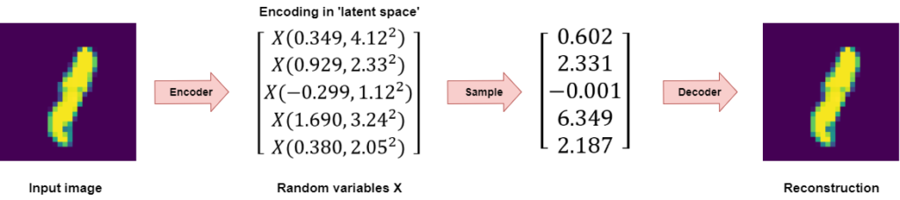
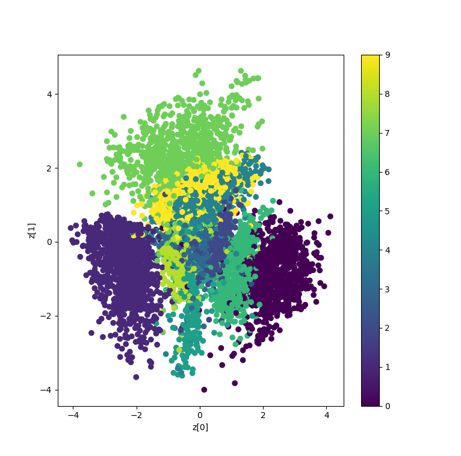
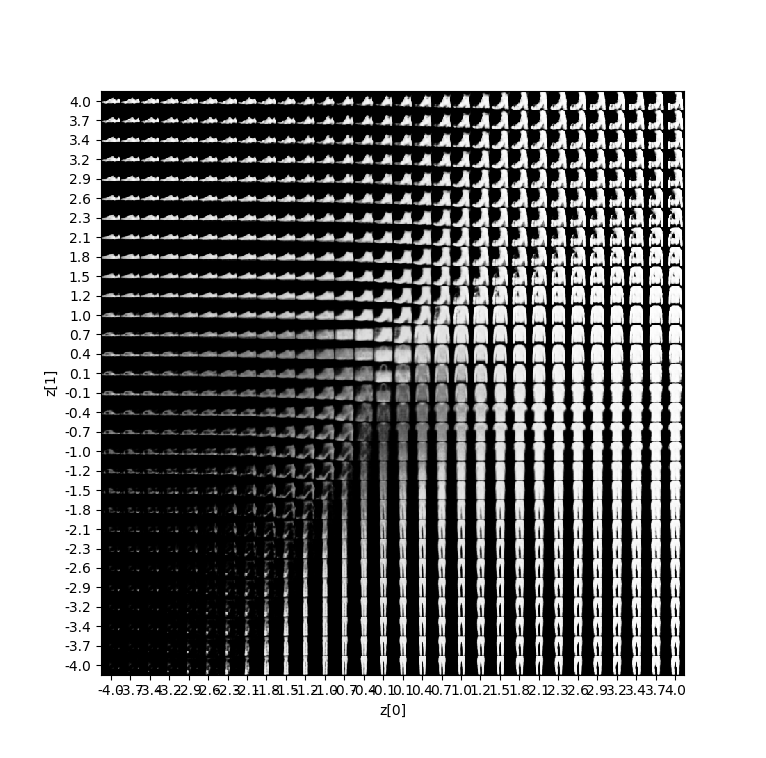
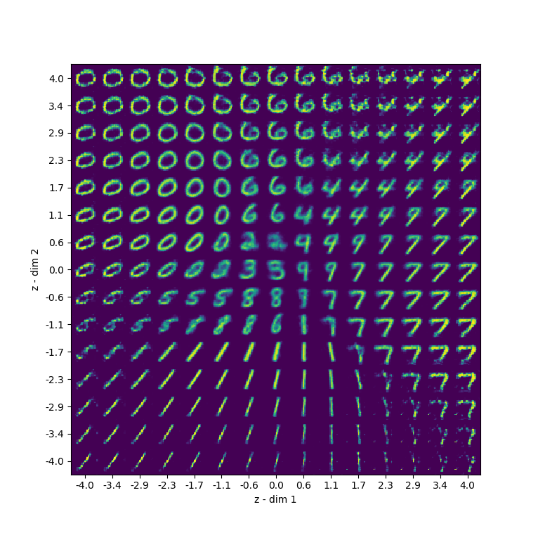
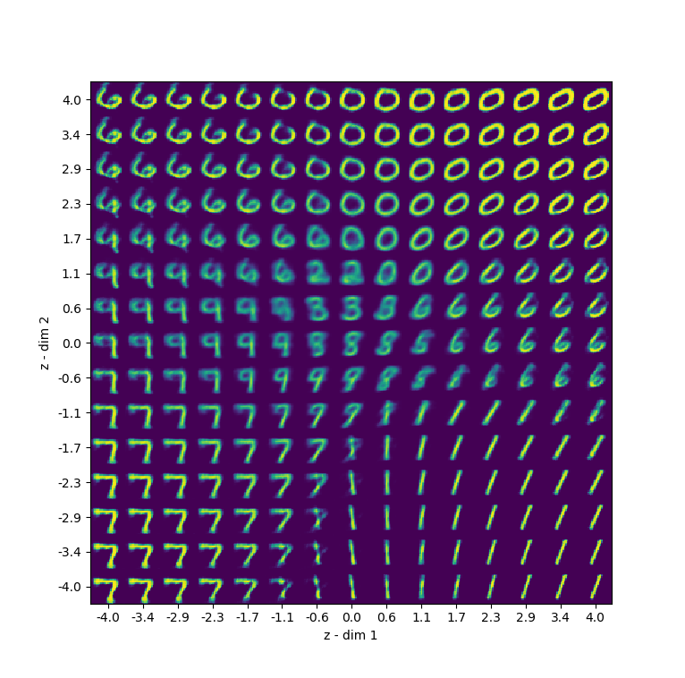
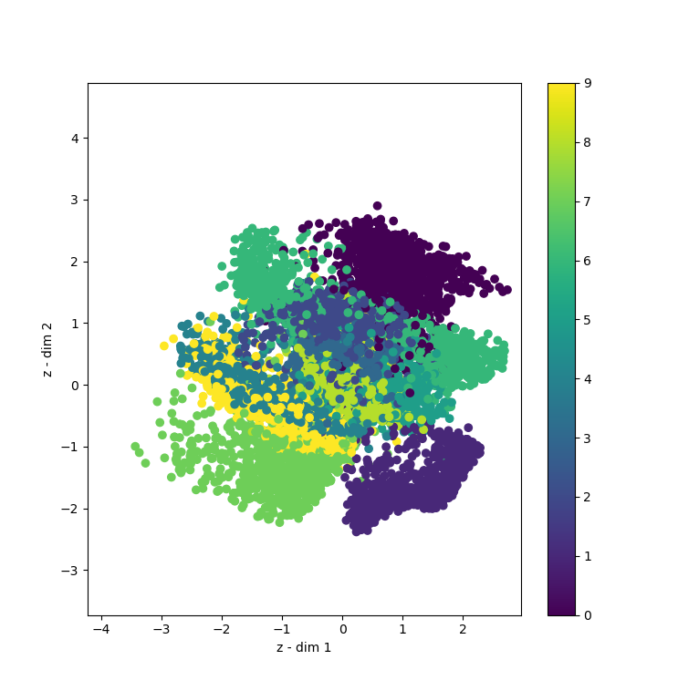
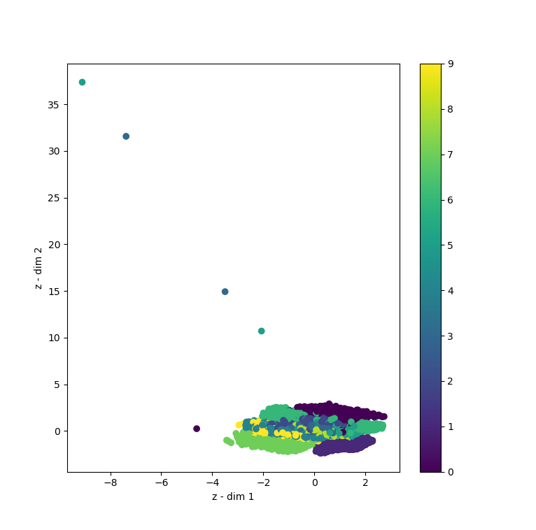

In a [different blog post](https://www.machinecurve.com/index.php/2019/12/24/what-is-a-variational-autoencoder-vae/), we studied the concept of a _Variational Autoencoder_ (or VAE) in detail. The models, which are generative, can be used to manipulate datasets by learning the distribution of this input data.

But there's a difference between theory and practice. While it's always nice to understand neural networks in theory, it's always even more fun to actually create them with a particular framework. It makes them really _usable_.

Today, we'll use the Keras deep learning framework to create a convolutional variational autoencoder. We subsequently train it on the MNIST dataset, and also show you what our latent space looks like as well as new samples generated from the latent space.

But first, let's take a look at what VAEs are.

Are you ready?

Let's go! 😎

**Update 17/08/2020:** added a fix for an issue with vae.fit().

\[toc\]

* * *

## Recap: what are variational autoencoders?

If you are already familiar with variational autoencoders or wish to find the implementation straight away, I'd suggest to skip this section. In any other case, it may be worth the read.

### How do VAEs work?

Contrary to a [normal autoencoder](https://www.machinecurve.com/index.php/2019/12/24/what-is-a-variational-autoencoder-vae/#about-normal-autoencoders), which learns to encode some input into a point in _latent space_, Variational Autoencoders (VAEs) learn to encode multivariate probability distributions into latent space, given their configuration usually Gaussian ones:

[](https://www.machinecurve.com/wp-content/uploads/2019/12/vae-encoder-decoder.png)

Sampling from the distribution gives a point in latent space that, given the distribution, is oriented around some mean value \[latex\]\\mu\[/latex\] and standard deviation \[latex\]\\sigma\[/latex\], like the points in this two-dimensional distribution:

[](https://www.machinecurve.com/wp-content/uploads/2019/12/MultivariateNormal.png)

Combining this with a [Kullback-Leibler divergence segment](https://www.machinecurve.com/index.php/2019/12/21/how-to-use-kullback-leibler-divergence-kl-divergence-with-keras/) in the loss function leads to a latent space that is both _continuous_ and _complete_: for every point sampled close to the distribution's mean and standard deviation (which is in our case the standard normal distribution) the output should be both _similar to samples around that sample_ and _should make sense_.

[](https://www.machinecurve.com/wp-content/uploads/2019/12/vae_space.png)

_Continuity and completeness in the latent space._

### What can you do with VAEs?

Besides the regular stuff one can do with an autoencoder (like denoising and dimensionality reduction), the principles of a VAE outlined above allow us to use variational autoencoders for generative purposes.

[](https://www.machinecurve.com/wp-content/uploads/2019/12/fmnist_dmax_plot.png)

_Samples generated with a VAE trained on the Fashion MNIST dataset._

I would really recommend my blog ["What is a Variational Autoencoder (VAE)?"](https://www.machinecurve.com/index.php/2019/12/24/what-is-a-variational-autoencoder-vae/) if you are interested in understanding VAEs in more detail. However, based on the high-level recap above, I hope that you now both understand (1) how VAEs work at a high level and (2) what this allows you to do with them: using them for generative purposes.

Let's now take a look at how we will use VAEs today 😊

* * *

## Creating a VAE with Keras

### What we'll create today

Today, we'll use the [Keras](https://keras.io) deep learning framework for creating a VAE. It consists of three individual parts: the encoder, the decoder and the VAE as a whole. We do so using the Keras Functional API, which allows us to combine layers very easily.

The MNIST dataset will be used for training the autoencoder. This dataset contains thousands of 28 x 28 pixel images of handwritten digits, as we can see below. As such, our autoencoder will learn the distribution of handwritten digits across (two)dimensional latent space, which we can then use to manipulate samples into a format we like.

[](https://www.machinecurve.com/wp-content/uploads/2019/07/mnist.png)

_Samples from the MNIST dataset_

This is the structure of the encoder:

```shell
Model: "encoder"
__________________________________________________________________________________________________
Layer (type)                    Output Shape         Param #     Connected to
==================================================================================================
encoder_input (InputLayer)      (None, 28, 28, 1)    0
__________________________________________________________________________________________________
conv2d_1 (Conv2D)               (None, 14, 14, 8)    80          encoder_input[0][0]
__________________________________________________________________________________________________
batch_normalization_1 (BatchNor (None, 14, 14, 8)    32          conv2d_1[0][0]
__________________________________________________________________________________________________
conv2d_2 (Conv2D)               (None, 7, 7, 16)     1168        batch_normalization_1[0][0]
__________________________________________________________________________________________________
batch_normalization_2 (BatchNor (None, 7, 7, 16)     64          conv2d_2[0][0]
__________________________________________________________________________________________________
flatten_1 (Flatten)             (None, 784)          0           batch_normalization_2[0][0]
__________________________________________________________________________________________________
dense_1 (Dense)                 (None, 20)           15700       flatten_1[0][0]
__________________________________________________________________________________________________
batch_normalization_3 (BatchNor (None, 20)           80          dense_1[0][0]
__________________________________________________________________________________________________
latent_mu (Dense)               (None, 2)            42          batch_normalization_3[0][0]
__________________________________________________________________________________________________
latent_sigma (Dense)            (None, 2)            42          batch_normalization_3[0][0]
__________________________________________________________________________________________________
z (Lambda)                      (None, 2)            0           latent_mu[0][0]
                                                                 latent_sigma[0][0]
==================================================================================================
Total params: 17,208
Trainable params: 17,120
Non-trainable params: 88
```

And the decoder:

```shell
__________________________________________________________________________________________________
Model: "decoder"
_________________________________________________________________
Layer (type)                 Output Shape              Param #
=================================================================
decoder_input (InputLayer)   (None, 2)                 0
_________________________________________________________________
dense_2 (Dense)              (None, 784)               2352
_________________________________________________________________
batch_normalization_4 (Batch (None, 784)               3136
_________________________________________________________________
reshape_1 (Reshape)          (None, 7, 7, 16)          0
_________________________________________________________________
conv2d_transpose_1 (Conv2DTr (None, 14, 14, 16)        2320
_________________________________________________________________
batch_normalization_5 (Batch (None, 14, 14, 16)        64
_________________________________________________________________
conv2d_transpose_2 (Conv2DTr (None, 28, 28, 8)         1160
_________________________________________________________________
batch_normalization_6 (Batch (None, 28, 28, 8)         32
_________________________________________________________________
decoder_output (Conv2DTransp (None, 28, 28, 1)         73
=================================================================
Total params: 9,137
Trainable params: 7,521
Non-trainable params: 1,616
```

And, finally, the VAE as a whole:

```shell
_________________________________________________________________
Model: "vae"
_________________________________________________________________
Layer (type)                 Output Shape              Param #
=================================================================
encoder_input (InputLayer)   (None, 28, 28, 1)         0
_________________________________________________________________
encoder (Model)              [(None, 2), (None, 2), (N 17208
_________________________________________________________________
decoder (Model)              (None, 28, 28, 1)         9137
=================================================================
Total params: 26,345
Trainable params: 24,641
Non-trainable params: 1,704
```

From the final summary, we can see that indeed, the VAE takes in samples of shape \[latex\](28, 28, 1)\[/latex\] and returns samples in the same format. Great! 😊

Let's now start working on our model. Open up your Explorer / Finder, navigate to some folder, and create a new Python file, e.g. `variational_autoencoder.py`. Now, open this file in your code editor, and let's start coding! 😎

### What you'll need to run the model

Before we begin, it's important that you ensure that you have all the required dependencies installed on your system:

- First of all, you'll need the **Keras deep learning framework**, with which we are creating the VAE.
- It's best if you used the **Tensorflow** backend (on top of which Keras can run). However, Theano and CNTK work as well (for Python).
- By consequence, it's preferred if you run Keras with **Python**, version 3.6+.
- You'll also need **Numpy**, for number processing, and **Matplotlib**, for visualization purposes.

### Model imports

Let's now declare everything that we will import:

- Keras, obviously.
- From Keras Layers, we'll need convolutional layers and [transposed convolutions](https://www.machinecurve.com/index.php/2019/09/29/understanding-transposed-convolutions/), which we'll use for the autoencoder. Given our usage of the Functional API, we also need Input, Lambda and Reshape, as well as Dense and Flatten.
- We'll import BatchNormalization as well to ensure that the mean and variance of our layer's inputs remains close to (0, 1) during training. This benefits the training process.
- We'll import the `Model` container from `keras.models`. This allows us to instantiate the models eventually.
- The `mnist` dataset is the dataset we'll be training our VAE on.
- With `binary_crossentropy`, we can compute reconstruction loss.
- Our backend (`K`) contains calls for tensor manipulations, which we'll use.
- Numpy is used for number processing and Matplotlib for plotting the visualizations on screen.

This is the code that includes our imports:

```python
'''
  Variational Autoencoder (VAE) with the Keras Functional API.
'''

import keras
from keras.layers import Conv2D, Conv2DTranspose, Input, Flatten, Dense, Lambda, Reshape
from keras.layers import BatchNormalization
from keras.models import Model
from keras.datasets import mnist
from keras.losses import binary_crossentropy
from keras import backend as K
import numpy as np
import matplotlib.pyplot as plt
```

### Loading data

Next thing: importing the MNIST dataset. Since MNIST is part of the Keras Datasets, we can import it easily - by calling `mnist.load_data()`. Love the Keras simplicity!

```python
# Load MNIST dataset
(input_train, target_train), (input_test, target_test) = mnist.load_data()
```

### Model configuration

Importing the data is followed by setting config parameters for data and model.

```python
# Data & model configuration
img_width, img_height = input_train.shape[1], input_train.shape[2]
batch_size = 128
no_epochs = 100
validation_split = 0.2
verbosity = 1
latent_dim = 2
num_channels = 1
```

The width and height of our configuration settings is determined by the training data. In our case, they will be `img_width = img_height = 28`, as the MNIST dataset contains samples that are 28 x 28 pixels.

Batch size is set to 128 samples per (mini)batch, which is quite normal. The same is true for the number of epochs, which was set to 100. 20% of the training data is used for validation purposes. This is also quite normal. Nothing special here.

Verbosity mode is set to True (by means of `1`), which means that all the output is shown on screen.

The final two configuration settings are of relatively more interest. First, the latent space will be two-dimensional - which means that a significant information bottleneck will be created which should yield good results with autoencoders on relatively simple datasets. Finally, the `num_channels` parameter can be configured to equal the number of _image channels_: for RGB data, it's 3 (red - green - blue), and for grayscale data (such as MNIST), it's 1.

### Data preprocessing

The next thing is data preprocessing:

```python
# Reshape data
input_train = input_train.reshape(input_train.shape[0], img_height, img_width, num_channels)
input_test = input_test.reshape(input_test.shape[0], img_height, img_width, num_channels)
input_shape = (img_height, img_width, num_channels)

# Parse numbers as floats
input_train = input_train.astype('float32')
input_test = input_test.astype('float32')

# Normalize data
input_train = input_train / 255
input_test = input_test / 255
```

First, we reshape the data so that it takes the shape (X, 28, 28, 1), where X is the number of samples in either the training or testing dataset. We also set (28, 28, 1) as `input_shape`.

Next, we parse the numbers as floats, which presumably speeds up the training process, and normalize it, which the neural network appreciates. And that's it already for data preprocessing :-)

### Creating the encoder

Now, it's time to create the encoder. This is a three-step process: firstly, we define it. Secondly, we perform something that is known as the _reparameterization trick_ in order to allow us to link the encoder to the decoder later, to instantiate the VAE as a whole. But before that, we instantiate the encoder first, as our third and final step.

#### Encoder definition

The first step in the three-step process is the definition of our encoder. Following the connection process of the Keras Functional API, we link the layers together:

```python
# # =================
# # Encoder
# # =================

# Definition
i       = Input(shape=input_shape, name='encoder_input')
cx      = Conv2D(filters=8, kernel_size=3, strides=2, padding='same', activation='relu')(i)
cx      = BatchNormalization()(cx)
cx      = Conv2D(filters=16, kernel_size=3, strides=2, padding='same', activation='relu')(cx)
cx      = BatchNormalization()(cx)
x       = Flatten()(cx)
x       = Dense(20, activation='relu')(x)
x       = BatchNormalization()(x)
mu      = Dense(latent_dim, name='latent_mu')(x)
sigma   = Dense(latent_dim, name='latent_sigma')(x)
```

Let's now take a look at the individual lines of code in more detail.

- The first layer is the `Input` layer. It accepts data with `input_shape = (28, 28, 1)` and is named _encoder\_input_. It's actually a pretty dumb layer, haha 😂
- Next up is a [two-dimensional convolutional layer](https://www.machinecurve.com/index.php/2018/12/07/convolutional-neural-networks-and-their-components-for-computer-vision/), or Conv2D in Keras terms. It learns 8 filters by deploying a 3 x 3 kernel which it convolves over the input. It has a stride of two which means that it skips over the input during the convolution as well, speeding up the learning process. It employs 'same' padding and [ReLU activation](https://www.machinecurve.com/index.php/2019/09/04/relu-sigmoid-and-tanh-todays-most-used-activation-functions/). Do note that officially, it's best to use [He init](https://www.machinecurve.com/index.php/2019/09/16/he-xavier-initialization-activation-functions-choose-wisely/) with ReLU activating layers. However, since the dataset is relatively small, it shouldn't be too much of a problem if you don't.
- Subsequently, we use Batch Normalization. This layer ensures that the outputs of the Conv2D layer that are input to the next Conv2D layer have a steady mean and variance, likely \[latex\]\\mu = 0.0, \\sigma = 1.0\[/latex\] (plus some \[latex\]\\epsilon\[/latex\], an error term to ensure numerical stability). This benefits the learning process.
- Once again, a Conv2D layer. It learns 16 filters and for the rest is equal to the first Conv2D layer.
- BatchNormalization once more.
- Next up, a `Flatten` layer. It's a relatively dumb layer too, and only serves to flatten the multidimensional data from the convolutional layers into one-dimensional shape. This has to be done because the densely-connected layers that we use next require data to have this shape.
- The next layer is a Dense layer with 20 output neurons. It's the autoencoder bottleneck we've been talking about.
- BatchNormalization once more.
- The next two layers, `mu` and `sigma`, are actually not separate from each other - look at the previous layer they are linked to (both `x`, i.e. the Dense(20) layer). The first outputs the mean values \[latex\]\\mu\[/latex\] of the encoded input and the second one outputs the stddevs \[latex\]\\sigma\[/latex\]. With these, we can sample the random variables that constitute the point in latent space onto which some input is mapped.

That's for the layers of our encoder 😄 The next step is to retrieve the shape of the _final Conv2D output_:

```python
# Get Conv2D shape for Conv2DTranspose operation in decoder
conv_shape = K.int_shape(cx)
```

We'll need it when defining the layers of our decoder. I won't bother you with the details yet, as they are best explained when we're a bit further down the road. However, just remember to come back here if you wonder why we need some `conv_shape` value in the decoder, okay? 😉

Let's now take a look at the second part of our encoder segment: the _reparameterization trick_.

#### Reparameterization trick

While for a mathematically sound explanation of the so-called "reparameterization trick" introduced to VAEs by Kingma & Welling (2013) I must refer you to Gregory Gunderson's ["The Reparameterization Trick"](http://gregorygundersen.com/blog/2018/04/29/reparameterization/), I'll try to explain the need for reparameritization briefly.

If you use neural networks (or, to be more precise, gradient descent) for optimizing the variational autoencoder, you effectively minimize some expected loss value, which can be estimated with Monte-Carlo techniques (Huang, n.d.). However, this requires that the loss function is differentiable, which is not necessarily the case, because it is dependent on the parameter of some probability distribution that we don't know about. In this case, it's possible to rewrite the equation, but then it _no longer has the form of an expectation_, making it impossible to use the Monte-Carlo techniques usable before.

However, if we can _reparameterize_ the sample fed to the function into the shape \[latex\]\\mu + \\sigma^2 \\times \\epsilon\[/latex\], it now becomes possible to use gradient descent for estimating the gradients accurately (Gunderson, n.d.; Huang, n.d.).

And that's precisely what we'll do in our code. We "sample" the value for \[latex\]z\[/latex\] from the computed \[latex\]\\mu\[/latex\] and \[latex\]\\sigma\[/latex\] values by resampling into `mu + K.exp(sigma / 2) * eps`.

```python
# Define sampling with reparameterization trick
def sample_z(args):
  mu, sigma = args
  batch     = K.shape(mu)[0]
  dim       = K.int_shape(mu)[1]
  eps       = K.random_normal(shape=(batch, dim))
  return mu + K.exp(sigma / 2) * eps
```

We then use this with a `Lambda` to ensure that correct gradients are computed during the backwards pass based on our values for `mu` and `sigma`:

```python
# Use reparameterization trick to ensure correct gradient
z       = Lambda(sample_z, output_shape=(latent_dim, ), name='z')([mu, sigma])
```

#### Encoder instantiation

Now, it's time to instantiate the encoder - taking inputs through input layer `i`, and outputting the values generated by the `mu`, `sigma` and `z` layers (i.e., the individual means and standard deviations, and the point sampled from the random variable represented by them):

```python
# Instantiate encoder
encoder = Model(i, [mu, sigma, z], name='encoder')
encoder.summary()
```

Now that we've got the encoder, it's time to start working on the decoder :)

### Creating the decoder

Creating the decoder is a bit simpler and boils down to a two-step process: defining it, and instantiating it.

#### Decoder definition

Firstly, we'll define the layers of our decoder - just as we've done when defining the structure of our encoder.

```python
# =================
# Decoder
# =================

# Definition
d_i   = Input(shape=(latent_dim, ), name='decoder_input')
x     = Dense(conv_shape[1] * conv_shape[2] * conv_shape[3], activation='relu')(d_i)
x     = BatchNormalization()(x)
x     = Reshape((conv_shape[1], conv_shape[2], conv_shape[3]))(x)
cx    = Conv2DTranspose(filters=16, kernel_size=3, strides=2, padding='same', activation='relu')(x)
cx    = BatchNormalization()(cx)
cx    = Conv2DTranspose(filters=8, kernel_size=3, strides=2, padding='same',  activation='relu')(cx)
cx    = BatchNormalization()(cx)
o     = Conv2DTranspose(filters=num_channels, kernel_size=3, activation='sigmoid', padding='same', name='decoder_output')(cx)
```

- Our decoder also starts with an `Input` layer, the `decoder_input` layer. It takes input with the shape `(latent_dim, )`, which as we will see is the vector we sampled for `z` with our encoder.
- If we'd like to upsample the point in latent space with [Conv2DTranspose](https://www.machinecurve.com/index.php/2019/12/10/conv2dtranspose-using-2d-transposed-convolutions-with-keras/) layers, in exactly the opposite symmetrical order as with we downsampled with our encoder, we must first bring back the data from shape `(latent_dim, )` into some shape that can be reshaped into the _output shape_ of the last convolutional layer of our encoder.
- **This is why you needed the `conv_shape` variable**. We'll thus now add a `Dense` layer which has `conv_shape[1] * conv_shape[2] * conv_shape[3]` output, and converts the latent space into many outputs.
- We next use a `Reshape` layer to convert the output of the Dense layer into the output shape of the last convolutional layer: `(conv_shape[1], conv_shape[2], conv_shape[3] = (7, 7, 16)`. Sixteen filters learnt with 7 x 7 pixels per filter.
- We then use `Conv2DTranspose` and `BatchNormalization` in the exact opposite order as with our encoder to upsample our data into 28 x 28 pixels (which is equal to the width and height of our inputs). However, we still have 8 filters, so the shape so far is `(28, 28, 8)`.
- We therefore add a final `Conv2DTranspose` layer which does nothing to the width and height of the data, but ensures that the number of filters learns equals `num_channels`. For MNIST data, where `num_channels = 1`, this means that the shape of our output will be `(28, 28, 1`), just as it has to be :) This last layer also uses Sigmoid activation, which allows us to use binary crossentropy loss when computing the reconstruction loss part of our loss function.

#### Decoder instantiation

The next thing we do is instantiate the decoder:

```python
# Instantiate decoder
decoder = Model(d_i, o, name='decoder')
decoder.summary()
```

It takes the inputs from the decoder input layer `d_i` and outputs whatever is output by the output layer `o`. Simple :)

### Creating the whole VAE

Now that the encoder and decoder are complete, we can create the VAE as a whole:

```python
# =================
# VAE as a whole
# =================

# Instantiate VAE
vae_outputs = decoder(encoder(i)[2])
vae         = Model(i, vae_outputs, name='vae')
vae.summary()
```

If you think about it, the _outputs_ of the entire VAE are the _original inputs_, encoded by the _encoder_, and decoded by the _decoder_.

That's how we arrive at `vae_outputs = decoder(encoder(i)[2])`: inputs `i` are encoded by the `encoder` into `[mu, sigma, z]` (the individual means and standard deviations with the sampled `z` as well). We then take the sampled `z` values (hence the `[2]`) and feed it to the `decoder`, which ensures that we arrive at correct VAE output.

We the instantiate the model: `i` are our inputs indeed, and `vae_outputs` are the outputs. We call the model `vae`, because it simply is.

### Defining custom VAE loss function

Now that we have defined our model, we can proceed with model configuration. Usually, with neural networks, this is done with `model.compile`, where a loss function is specified such as [binary crossentropy](https://www.machinecurve.com/index.php/2019/10/22/how-to-use-binary-categorical-crossentropy-with-keras/). However, when we look [at how VAEs are optimized](https://www.machinecurve.com/index.php/2019/12/24/what-is-a-variational-autoencoder-vae/#second-difference-kl-divergence-reconstruction-error-for-optimization), we see that it's not a simple loss function that is used: we use reconstruction loss (in our case, binary crossentropy loss) _together with_ [KL divergence loss](https://www.machinecurve.com/index.php/2019/12/21/how-to-use-kullback-leibler-divergence-kl-divergence-with-keras/) to ensure that our latent space is both **[continuous and complete](https://www.machinecurve.com/index.php/2019/12/24/what-is-a-variational-autoencoder-vae/#continuity-and-completeness)**.

We define it as follows:

```python
# Define loss
def kl_reconstruction_loss(true, pred):
  # Reconstruction loss
  reconstruction_loss = binary_crossentropy(K.flatten(true), K.flatten(pred)) * img_width * img_height
  # KL divergence loss
  kl_loss = 1 + sigma - K.square(mu) - K.exp(sigma)
  kl_loss = K.sum(kl_loss, axis=-1)
  kl_loss *= -0.5
  # Total loss = 50% rec + 50% KL divergence loss
  return K.mean(reconstruction_loss + kl_loss)
```

- Our `reconstruction_loss` is the binary crossentropy value computed for the flattened `true` values (representing our targets, i.e. our ground truth) and the `pred` prediction values generated by our VAE. It's multiplied with `img_width` and `img_height` to reduce the impact of flattening.
- Our KL divergence loss can be rewritten in the formula defined above (Wiseodd, 2016).
- We use 50% reconstruction loss and 50% KL divergence loss, and do so by returning the mean value between the two.

### Compilation & training

Now that we have defined our custom loss function, we can compile our model. We do so using the [Adam optimizer](https://www.machinecurve.com/index.php/2019/11/03/extensions-to-gradient-descent-from-momentum-to-adabound/) and our `kl_reconstruction_loss` custom loss function.

```python
# Compile VAE
vae.compile(optimizer='adam', loss=kl_reconstruction_loss)

# Train autoencoder
vae.fit(input_train, input_train, epochs = no_epochs, batch_size = batch_size, validation_split = validation_split)
```

Once compiled, we can call `vae.fit` to start the training process. Note that we set `input_train` both as our features and targets, as is usual with autoencoders. For the rest, we configure the training process as defined previously, in the model configuration step.

* * *

## Visualizing VAE results

Even though you can now actually train your VAE, it's best to wait _just a bit more_ - because we'll add some code for visualization purposes:

- We will visualize our test set inputs mapped onto the latent space. This allows us to check the continuity and completeness of our latent space.
- We will also visualize an uniform walk across latent space to see how sampling from it will result in output that actually makes sense. This is actually the end result we'd love to see :)

Some credits first, though: the code for the two visualizers was originally created (and found by me) in the Keras Docs, at the link [here](https://keras.io/examples/variational_autoencoder_deconv/), as well as in François Chollet's blog post, [here](https://blog.keras.io/building-autoencoders-in-keras.html). All credits for the original ideas go to the authors of these articles. I made some adaptations to the code to accomodate for this blog post:

- First of all, I split the visualizers into two separate definitions. Originally, there was one definition, that generated both visualizations. However, I think that having them separated gives you more flexibility.
- Additionally, I ensured that multi-channeled data can be visualized as well. The original code was created _specifically_ for MNIST, which is only one-channel. RGB datasets, such as CIFAR10, are three-dimensional. This required some extra code to make it work based on the autoencoder we created before.

### Visualizing inputs mapped onto latent space

Visualizing inputs mapped onto the latent space is simply taking some input data, feeding it to the encoder, taking the mean values \[latex\]\\mu\[/latex\] for the predictions, and plotting them in a scatter plot:

```python
# =================
# Results visualization
# Credits for original visualization code: https://keras.io/examples/variational_autoencoder_deconv/
# (François Chollet).
# Adapted to accomodate this VAE.
# =================
def viz_latent_space(encoder, data):
  input_data, target_data = data
  mu, _, _ = encoder.predict(input_data)
  plt.figure(figsize=(8, 10))
  plt.scatter(mu[:, 0], mu[:, 1], c=target_data)
  plt.xlabel('z - dim 1')
  plt.ylabel('z - dim 2')
  plt.colorbar()
  plt.show()
```

### Visualizing samples from the latent space

Visualizing samples from the latent space entails a bit more work. First, we'll have to create a figure filled with zeros, as well as a linear space around \[latex\](\\mu = 0, \\sigma = 1)\[/latex\] we can iterate over (from \[latex\]domain = range = \[-4, +4\]\[/latex\]). We take a sample from the grid (determined by our current \[latex\]x\[/latex\] and \[latex\]y\[/latex\] positions) and feed it to the decoder. We then replace the zeros in our `figure` with the output, and finally plot the entire figure on screen. This includes reshaping one-dimensional (i.e., grayscale) input if necessary.

```python

def viz_decoded(encoder, decoder, data):
  num_samples = 15
  figure = np.zeros((img_width * num_samples, img_height * num_samples, num_channels))
  grid_x = np.linspace(-4, 4, num_samples)
  grid_y = np.linspace(-4, 4, num_samples)[::-1]
  for i, yi in enumerate(grid_y):
      for j, xi in enumerate(grid_x):
          z_sample = np.array([[xi, yi]])
          x_decoded = decoder.predict(z_sample)
          digit = x_decoded[0].reshape(img_width, img_height, num_channels)
          figure[i * img_width: (i + 1) * img_width,
                  j * img_height: (j + 1) * img_height] = digit
  plt.figure(figsize=(10, 10))
  start_range = img_width // 2
  end_range = num_samples * img_width + start_range + 1
  pixel_range = np.arange(start_range, end_range, img_width)
  sample_range_x = np.round(grid_x, 1)
  sample_range_y = np.round(grid_y, 1)
  plt.xticks(pixel_range, sample_range_x)
  plt.yticks(pixel_range, sample_range_y)
  plt.xlabel('z - dim 1')
  plt.ylabel('z - dim 2')
  # matplotlib.pyplot.imshow() needs a 2D array, or a 3D array with the third dimension being of shape 3 or 4!
  # So reshape if necessary
  fig_shape = np.shape(figure)
  if fig_shape[2] == 1:
    figure = figure.reshape((fig_shape[0], fig_shape[1]))
  # Show image
  plt.imshow(figure)
  plt.show()
```

### Calling the visualizers

Using the visualizers is however much easier:

```python
# Plot results
data = (input_test, target_test)
viz_latent_space(encoder, data)
viz_decoded(encoder, decoder, data)
```

## Time to run it!

Let's now run our model. Open up a terminal which has access to all the required dependencies, `cd` to the folder where your Python file is located, and run it, e.g. `python variational_autoencoder.py`.

The training process should now begin with some visualizations being output after it finishes! :)

### If you get an error with vae.fit()

Marc, one of our readers, reported an issue with the model when running the VAE with TensorFlow 2.3.0 (and possibly also newer versions): https://github.com/tensorflow/probability/issues/519

By adding the following line of code, this issue can be resolved:

```python
tf.config.experimental_run_functions_eagerly(True)
```

## Full VAE code

Even though I would recommend to read the entire post first before you start playing with the code (because the structures are intrinsically linked), it may be that you wish to take the full code and start fiddling right away. In this case, having the full code at once may be worthwhile to you, so here you go 😊

```python
'''
  Variational Autoencoder (VAE) with the Keras Functional API.
'''

import keras
from keras.layers import Conv2D, Conv2DTranspose, Input, Flatten, Dense, Lambda, Reshape
from keras.layers import BatchNormalization
from keras.models import Model
from keras.datasets import mnist
from keras.losses import binary_crossentropy
from keras import backend as K
import numpy as np
import matplotlib.pyplot as plt

# Load MNIST dataset
(input_train, target_train), (input_test, target_test) = mnist.load_data()

# Data & model configuration
img_width, img_height = input_train.shape[1], input_train.shape[2]
batch_size = 128
no_epochs = 100
validation_split = 0.2
verbosity = 1
latent_dim = 2
num_channels = 1

# Reshape data
input_train = input_train.reshape(input_train.shape[0], img_height, img_width, num_channels)
input_test = input_test.reshape(input_test.shape[0], img_height, img_width, num_channels)
input_shape = (img_height, img_width, num_channels)

# Parse numbers as floats
input_train = input_train.astype('float32')
input_test = input_test.astype('float32')

# Normalize data
input_train = input_train / 255
input_test = input_test / 255

# # =================
# # Encoder
# # =================

# Definition
i       = Input(shape=input_shape, name='encoder_input')
cx      = Conv2D(filters=8, kernel_size=3, strides=2, padding='same', activation='relu')(i)
cx      = BatchNormalization()(cx)
cx      = Conv2D(filters=16, kernel_size=3, strides=2, padding='same', activation='relu')(cx)
cx      = BatchNormalization()(cx)
x       = Flatten()(cx)
x       = Dense(20, activation='relu')(x)
x       = BatchNormalization()(x)
mu      = Dense(latent_dim, name='latent_mu')(x)
sigma   = Dense(latent_dim, name='latent_sigma')(x)

# Get Conv2D shape for Conv2DTranspose operation in decoder
conv_shape = K.int_shape(cx)

# Define sampling with reparameterization trick
def sample_z(args):
  mu, sigma = args
  batch     = K.shape(mu)[0]
  dim       = K.int_shape(mu)[1]
  eps       = K.random_normal(shape=(batch, dim))
  return mu + K.exp(sigma / 2) * eps

# Use reparameterization trick to ....??
z       = Lambda(sample_z, output_shape=(latent_dim, ), name='z')([mu, sigma])

# Instantiate encoder
encoder = Model(i, [mu, sigma, z], name='encoder')
encoder.summary()

# =================
# Decoder
# =================

# Definition
d_i   = Input(shape=(latent_dim, ), name='decoder_input')
x     = Dense(conv_shape[1] * conv_shape[2] * conv_shape[3], activation='relu')(d_i)
x     = BatchNormalization()(x)
x     = Reshape((conv_shape[1], conv_shape[2], conv_shape[3]))(x)
cx    = Conv2DTranspose(filters=16, kernel_size=3, strides=2, padding='same', activation='relu')(x)
cx    = BatchNormalization()(cx)
cx    = Conv2DTranspose(filters=8, kernel_size=3, strides=2, padding='same',  activation='relu')(cx)
cx    = BatchNormalization()(cx)
o     = Conv2DTranspose(filters=num_channels, kernel_size=3, activation='sigmoid', padding='same', name='decoder_output')(cx)

# Instantiate decoder
decoder = Model(d_i, o, name='decoder')
decoder.summary()

# =================
# VAE as a whole
# =================

# Instantiate VAE
vae_outputs = decoder(encoder(i)[2])
vae         = Model(i, vae_outputs, name='vae')
vae.summary()

# Define loss
def kl_reconstruction_loss(true, pred):
  # Reconstruction loss
  reconstruction_loss = binary_crossentropy(K.flatten(true), K.flatten(pred)) * img_width * img_height
  # KL divergence loss
  kl_loss = 1 + sigma - K.square(mu) - K.exp(sigma)
  kl_loss = K.sum(kl_loss, axis=-1)
  kl_loss *= -0.5
  # Total loss = 50% rec + 50% KL divergence loss
  return K.mean(reconstruction_loss + kl_loss)

# Compile VAE
vae.compile(optimizer='adam', loss=kl_reconstruction_loss)

# Train autoencoder
vae.fit(input_train, input_train, epochs = no_epochs, batch_size = batch_size, validation_split = validation_split)

# =================
# Results visualization
# Credits for original visualization code: https://keras.io/examples/variational_autoencoder_deconv/
# (François Chollet).
# Adapted to accomodate this VAE.
# =================
def viz_latent_space(encoder, data):
  input_data, target_data = data
  mu, _, _ = encoder.predict(input_data)
  plt.figure(figsize=(8, 10))
  plt.scatter(mu[:, 0], mu[:, 1], c=target_data)
  plt.xlabel('z - dim 1')
  plt.ylabel('z - dim 2')
  plt.colorbar()
  plt.show()

def viz_decoded(encoder, decoder, data):
  num_samples = 15
  figure = np.zeros((img_width * num_samples, img_height * num_samples, num_channels))
  grid_x = np.linspace(-4, 4, num_samples)
  grid_y = np.linspace(-4, 4, num_samples)[::-1]
  for i, yi in enumerate(grid_y):
      for j, xi in enumerate(grid_x):
          z_sample = np.array([[xi, yi]])
          x_decoded = decoder.predict(z_sample)
          digit = x_decoded[0].reshape(img_width, img_height, num_channels)
          figure[i * img_width: (i + 1) * img_width,
                  j * img_height: (j + 1) * img_height] = digit
  plt.figure(figsize=(10, 10))
  start_range = img_width // 2
  end_range = num_samples * img_width + start_range + 1
  pixel_range = np.arange(start_range, end_range, img_width)
  sample_range_x = np.round(grid_x, 1)
  sample_range_y = np.round(grid_y, 1)
  plt.xticks(pixel_range, sample_range_x)
  plt.yticks(pixel_range, sample_range_y)
  plt.xlabel('z - dim 1')
  plt.ylabel('z - dim 2')
  # matplotlib.pyplot.imshow() needs a 2D array, or a 3D array with the third dimension being of shape 3 or 4!
  # So reshape if necessary
  fig_shape = np.shape(figure)
  if fig_shape[2] == 1:
    figure = figure.reshape((fig_shape[0], fig_shape[1]))
  # Show image
  plt.imshow(figure)
  plt.show()

# Plot results
data = (input_test, target_test)
viz_latent_space(encoder, data)
viz_decoded(encoder, decoder, data)
```

* * *

## Results

Now, time for the results :)

Training the model for 100 epochs yields this visualization of the latent space:

[](https://www.machinecurve.com/wp-content/uploads/2019/12/mnist_100_latentspace.png)

As we can see, around \[latex\](0, 0)\[/latex\] our latent space is pretty continuous as well as complete. Somewhere around \[latex\](0, -1.5)\[/latex\] we see some holes, as well as near the edges (e.g. \[latex\](3, -3)\[/latex\]). We can see these issues in the actual sampling too:

[](https://www.machinecurve.com/wp-content/uploads/2019/12/mnist_digits.png)

Especially in the right corners, we see the issue with completeness, which yield outputs that do not make sense. Some issues with continuity are visible wherever the samples are _blurred_. However, generally speaking, I'm quite happy with the results! 😎

However, let's see if we can make them even better :)

* * *

## DCGAN-like architecture

In their paper "[Unsupervised representation learning with deep convolutional generative adversarial networks](https://arxiv.org/abs/1511.06434)", Radford et al. (2015) introduce the concept of a _deep convolutional generative adversarial network_, or DCGAN. While a GAN represents the other branch of generative models, results have suggested that deep convolutional architectures for generative models may produce better results with VAEs as well.

So, as an extension of our original post, we've changed the architecture of our model into deeper and wider convolutional layers, in line with Radford et al. (2015). I changed the `encoder` into:

```python
i       = Input(shape=input_shape, name='encoder_input')
cx      = Conv2D(filters=128, kernel_size=5, strides=2, padding='same', activation='relu')(i)
cx      = BatchNormalization()(cx)
cx      = Conv2D(filters=256, kernel_size=5, strides=2, padding='same', activation='relu')(cx)
cx      = BatchNormalization()(cx)
cx      = Conv2D(filters=512, kernel_size=5, strides=2, padding='same', activation='relu')(cx)
cx      = BatchNormalization()(cx)
cx      = Conv2D(filters=1024, kernel_size=5, strides=2, padding='same', activation='relu')(cx)
cx      = BatchNormalization()(cx)
x       = Flatten()(cx)
x       = Dense(20, activation='relu')(x)
x       = BatchNormalization()(x)
mu      = Dense(latent_dim, name='latent_mu')(x)
sigma   = Dense(latent_dim, name='latent_sigma')(x)
```

And the `decoder` into:

```python
# Definition
d_i   = Input(shape=(latent_dim, ), name='decoder_input')
x     = Dense(conv_shape[1] * conv_shape[2] * conv_shape[3], activation='relu')(d_i)
x     = BatchNormalization()(x)
x     = Reshape((conv_shape[1], conv_shape[2], conv_shape[3]))(x)
cx    = Conv2DTranspose(filters=1024, kernel_size=5, strides=2, padding='same', activation='relu')(x)
cx    = BatchNormalization()(cx)
cx    = Conv2DTranspose(filters=512, kernel_size=5, strides=2, padding='same', activation='relu')(cx)
cx    = BatchNormalization()(cx)
cx    = Conv2DTranspose(filters=256, kernel_size=5, strides=2, padding='same', activation='relu')(cx)
cx    = BatchNormalization()(cx)
cx    = Conv2DTranspose(filters=128, kernel_size=5, strides=2, padding='same', activation='relu')(cx)
cx    = BatchNormalization()(cx)
o     = Conv2DTranspose(filters=num_channels, kernel_size=3, activation='sigmoid', padding='same', name='decoder_output')(cx)
```

While our original VAE had approximately 26.000 trainable parameters, this one has approximately 9M:

```shell
_________________________________________________________________
Model: "vae"
_________________________________________________________________
Layer (type)                 Output Shape              Param #
=================================================================
encoder_input (InputLayer)   (None, 28, 28, 1)         0
_________________________________________________________________
encoder (Model)              [(None, 2), (None, 2), (N 4044984
_________________________________________________________________
decoder (Model)              (None, 28, 28, 1)         4683521
=================================================================
Total params: 8,728,505
Trainable params: 8,324,753
Non-trainable params: 403,752
```

However, even after training it for only 5 epochs, results have become considerably better:

[](https://www.machinecurve.com/wp-content/uploads/2019/12/latent-space-visualized.png)

Latent space (left) also looks better compared to our initial VAE (right):

- [](https://www.machinecurve.com/wp-content/uploads/2019/12/latent-space-without-outliers.png)
    
- [](https://www.machinecurve.com/wp-content/uploads/2019/12/mnist_100_latentspace.png)
    

However, what is interesting, is that the left one is a _zoom_, actually, as we also have some outliers now:

[](https://www.machinecurve.com/wp-content/uploads/2019/12/latent-space-with-outliers.png)

Interesting result :)

## Summary

In this blog post, we've seen how to create a variational autoencoder with Keras. We first looked at what VAEs are, and why they are different from regular autoencoders. We then created a neural network implementation with Keras and explained it step by step, so that you can easily reproduce it yourself while _understanding_ what happens.

In order to compare our initial 26K-parameter VAE, we expanded the architecture to resemble a DCGAN-like architecture of approx. 9M parameters, for both the encoder and the decoder. This yielded better results, but also increased the number of outliers.

I hope you've learnt something from this article :) If you did, please let me know by leaving a comment in the comments section below! 👇 If you have questions or remarks, please do the same!

Thank you for reading MachineCurve today and happy engineering 😎

* * *

## References

Keras. (n.d.). Variational autoencoder deconv. Retrieved from [https://keras.io/examples/variational\_autoencoder\_deconv/](https://keras.io/examples/variational_autoencoder_deconv/)

Gundersen, G. (2018, April 29). The Reparameterization Trick. Retrieved from [http://gregorygundersen.com/blog/2018/04/29/reparameterization/](http://gregorygundersen.com/blog/2018/04/29/reparameterization/)

Kingma, D. P., & Welling, M. (2013). [Auto-encoding variational bayes](https://arxiv.org/abs/1312.6114). _arXiv preprint arXiv:1312.6114_.

Huang, G. (n.d.). Reparametrization Trick · Machine Learning. Retrieved from [https://gabrielhuang.gitbooks.io/machine-learning/content/reparametrization-trick.html](https://gabrielhuang.gitbooks.io/machine-learning/content/reparametrization-trick.html)

Wiseodd. (2016, December 10). Variational Autoencoder: Intuition and Implementation. Retrieved from [http://wiseodd.github.io/techblog/2016/12/10/variational-autoencoder/](http://wiseodd.github.io/techblog/2016/12/10/variational-autoencoder/)

Keras Blog. (n.d.). Building Autoencoders in Keras. Retrieved from [https://blog.keras.io/building-autoencoders-in-keras.html](https://blog.keras.io/building-autoencoders-in-keras.html)

Radford, A., Metz, L., & Chintala, S. (2015). [Unsupervised representation learning with deep convolutional generative adversarial networks](https://arxiv.org/abs/1511.06434). _arXiv preprint arXiv:1511.06434_.
