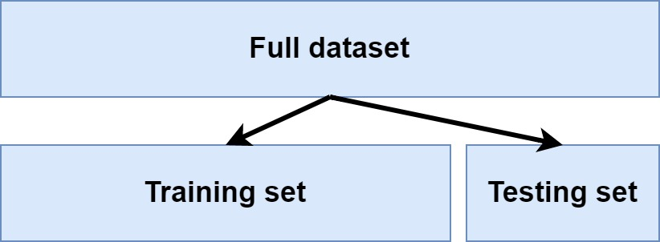
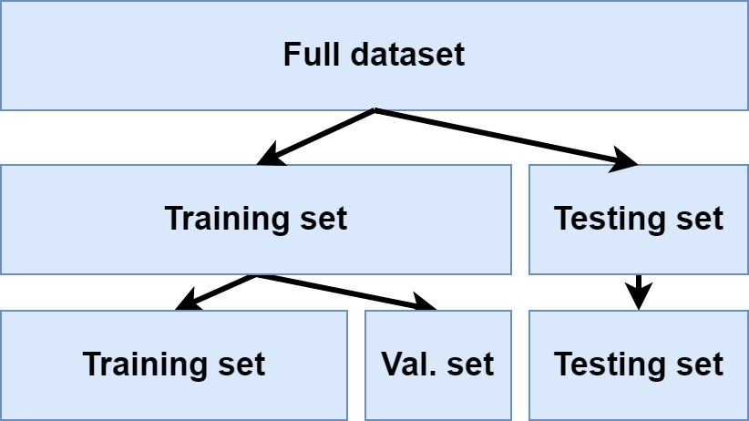
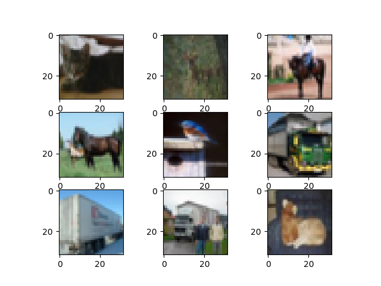

When you are training a Supervised Machine Learning model, such as a Support Vector Machine or Neural Network, it is important that you split your dataset into at least a training dataset and a testing dataset. This can be done in many ways, and I often see a variety of manual approaches for doing this. Scikit-learn however can easily be leveraged for this purpose, allowing you to create a train/test split for your Machine Learning model. In this article, we'll find out how.

First of all, we'll take a look at _why_ it's wise to generate a training and testing dataset. We will see that this involves the difference between the model's capability for _prediction_ and _generalization_. This includes looking at validation data for Neural networks.

Secondly, we'll show you how to create a train/test split with Scikit-learn for a variety of use cases. First of all, we'll show you the most general scenario - creating such a split for pretty much any dataset that can be loaded into memory. Subsequently, we'll show you how this can be done for a multilabel classification/multilabel regression dataset. Then, we look at HDF5 data, and show you how we can generate such a split if we load data from file. Finally, as the `tf.keras.datasets` module is used very frequently to practice with ML, we'll show you how to create one there.

Enough introduction for now - let's take a look! :)

* * *

\[toc\]

* * *

## Why split your dataset into training and testing data?

Before we look at _how_ we can split your dataset into a training and a testing dataset, first let's take a look at _why_ we should do this in the first place.

Training a Supervised Machine Learning model is conceptually really simple and involves the following three-step process:

1. **Feed samples to (an initialized) model**: samples from your dataset are fed forward through the model, generating predictions.
2. **Compare predictions and ground truth:** the predictions are compared with the _true_ labels corresponding to the samples, allowing us to identify how bad the model performs.
3. **Improve:** based on the optimization metric, we can change the model's internals here and there, so that it (hopefully) performs better during the next iteration.

Obviously, the entire process starts at (1) as well, and the process will halt until the _error score_ (the metric which identifies how bad the model performs) exceeds some threshold, after a certain (fixed) amount of iterations have passed, or when the model [no longer improves](https://www.machinecurve.com/index.php/2019/05/30/avoid-wasting-resources-with-earlystopping-and-modelcheckpoint-in-keras/).


When you keep performing these iterations, the model will continue to improve - because it can perfectly exploit all the spurious patterns in your dataset.

But what if those spurious patterns are not present in the real-world data you will generate predictions for after training? What if the model is hence trained on patterns that are _unique_ to the training dataset, and are not or scantily present in the dataset for inference?

Then, put briefly, you have a problem.

And it is also why you will split your dataset into a **training dataset** and a **testing dataset**. By doing so, you can still perform the iterations displayed above, continuously improving the model. But, on the other hand, you will now also have a dataset available that your trained model has never seen before and can hence be used to identify whether, besides _predicting adequately_, the model is also capable of **generalizing**. You don't want a model that performs well to your training data but performs poorly during inference.

Having a testing dataset partially helps you get rid of this problem!

Common splits are 80% training data and 20% testing data, called **simple hold-out splits**, but [more advanced approaches](https://www.machinecurve.com/index.php/2020/02/18/how-to-use-k-fold-cross-validation-with-keras/) can also be used.



### Another split: training/validation data

Traditional Machine Learning algorithms, such as Support Vector Machines, attempt to maximize an error function in order to find the best model performance. The _change_ that is applied here does not depend on the model itself, but only on the error function that is maximized.

If you are training Neural networks, this is different. Here, the error function _is dependent on the neurons_, and hence, the data you fed forward can thus be used to trace back error to neurons that have significantly contributed to the error.

By consequence, improvement in a Neural network is achieved by computing the improvement (gradient) and then applying it in a form of [gradient descent](https://www.machinecurve.com/index.php/2019/10/24/gradient-descent-and-its-variants/).

If you use the training set for both feeding data forward and improving the model, you're getting yourself into trouble again. Here's why: improvement will then be a butcher who checks their own meat. Just like with the training data and testing data, optimizing using training data will mean that you will _always_ tend to move towards capturing patterns present in the training set only. You don't want to touch the testing data until you have finished training, so you must figure out a different solution.

This solution is simple: we'll apply another split when training a Neural network - a **training/validation split**. Here, we use the training data available after the split (in our case 80%) and split it again following (usually) a 80/20 split as well.



* * *

## Creating a train/test split with Scikit-learn

Now that we know what the importance is of train/test splits and possibly train/validation splits, we can take a look at how we can create such splits ourselves. We're going to use Scikit-learn for this purpose, which is an extensive Machine Learning library for Python. More specifically, we're going to leverage `sklearn.model_selection.train_test_split` to create train/test splits for our Machine Learning models. Note that the call is model agnostic and involves data only: it can be used with Scikit-learn models, but also with TensorFlow/Keras, PyTorch, and other libraries.

We look at four different settings:

- Creating a train/test split for any dataset.
- Creating a train/test split for a multilabel dataset.
- Creating a train/test split for HDF5 data.
- Creating a train/test split for a `tf.keras.datasets` dataset.

### Train/test split for any dataset

If you have an arbitrary dataset, e.g. one generated with Scikit's `make_blobs` function, you likely have feature vectors (a.k.a. input samples) and corresponding targets. Often, those are assigned to variables called `X` and `y`, or `inputs` and `targets`, et cetera. For example, this is how we can create blobs of data:

```python
from sklearn.datasets import make_blobs

# Configuration options
num_samples_total = 10000
cluster_centers = [(5,5), (3,3), (1,5)]
num_classes = len(cluster_centers)

# Generate data
X, y = make_blobs(n_samples = num_samples_total, centers = cluster_centers, n_features = num_classes, center_box=(0, 1), cluster_std = 0.30)
```

We can then easily create a train/test split:

```python
from sklearn.model_selection import train_test_split
X_train, X_test, y_train, y_test = train_test_split(X, y, test_size=0.20, random_state=33)
```

Here, we split the input data (`X/y`) into training data (`X_train; y_train`) and testing data (`X_test; y_test`) using a `test_size=0.20`, meaning that 20% of our data will be used for testing. In other words, we're creating a 80/20 split. Shuffling (i.e. randomly drawing) samples is applied as part of the fit. Using a `random_state`, we can seed the random numbers generator to make its behavior replicable.

### Train/test split for a multilabel dataset

Suppose that we have a [multilabel dataset](https://www.machinecurve.com/index.php/2020/11/12/how-to-create-a-multilabel-svm-classifier-with-scikit-learn/):

```python
from sklearn.datasets import make_multilabel_classification

# Configuration options
n_samples = 10000
n_features = 6
n_classes = 3
n_labels = 2
n_epochs = 50
random_state = 42

# Generate data
X, y = make_multilabel_classification(n_samples=n_samples, n_features=n_features, n_classes=n_classes, n_labels=n_labels, random_state=random_state)
```

It's then also really easy to split it into a train/test dataset:

```python

from sklearn.model_selection import train_test_split
# Split into training and testing data
X_train, X_test, y_train, y_test = train_test_split(X, y, test_size=0.20, random_state=random_state)
```

Here, too, we apply a 80/20 train/test split.

### Train/test split for HDF5 data

In many cases, training data is available in HDF5 files - and [we can then load it using H5Py](https://www.machinecurve.com/index.php/2020/04/13/how-to-use-h5py-and-keras-to-train-with-data-from-hdf5-files/), with an example here:

```python
import h5py

# Load data
f = h5py.File('./data.hdf5', 'r')
X = f['image'][...]
y = f['label'][...]
f.close()
```

We can also then generate a train/test split as follows:

```python

from sklearn.model_selection import train_test_split
# Split into training and testing data
X_train, X_test, y_train, y_test = train_test_split(X, y, test_size=0.20, random_state=random_state)
```

### Train/test splits for a tf.keras.datasets dataset

Did you know that TensorFlow 2.x provides a variety of datasets by default, the so-called `tf.keras.datasets` [module](https://www.machinecurve.com/index.php/2019/12/31/exploring-the-keras-datasets/)?

Loading a dataset is really easy:

```python
from tensorflow.keras.datasets import cifar10

# CIFAR-10
(X_train, y_train), (X_test, y_test) = cifar10.load_data()
```

This loads the CIFAR10 dataset, which can be used with Computer Vision models and contains a variety of images, which look as follows.

> The CIFAR-10 dataset consists of 60000 32x32 colour images in 10 classes, with 6000 images per class.
>
> University of Toronto (n.d.)



While Keras already loads data in a train/test split fashion, you could generate an additional split - e.g. a 50/50 one - in the following way:

```python
from sklearn.model_selection import train_test_split
# Split into training and testing data
X_one, X_two, y_one, y_two = train_test_split(X_train, y_train, test_size=0.50, random_state=random_state)
```

* * *

## Summary

In this article, we looked at generating a train/test split for your Machine Learning models. First of all, we looked at why this is necessary. We saw that training a Supervised Machine Learning model effectively means that you iteratively optimize it, and that you can over-involve spurious patterns in your training set if you continue improving based on the training set only. That's why you need a testing dataset, which is something that can be achieved with a train/test split. In the case of Neural networks, a validation set split off from the remaining training data can be useful too.

After the theoretical part, we moved forward by looking at how to implement train/test splits with Scikit-learn and Python. We saw that with Scikit's `train_test_split`, generating such a split is a no-brainer. We gave examples for four settings: using any basic dataset, using a multilabel dataset, using a HDF5-loaded dataset, and using a `tensorflow.keras.datasets` driven dataset (for further splits).

I hope that you have learned something by reading today's article. If you did, I'd love to hear from you, so please feel free to leave a message in the comments section 💬 Please do the same if you have any questions or suggestions for improvement. Thank you for reading MachineCurve today and happy engineering! 😎

* * *

## References

University of Toronto. (n.d.). _CIFAR-10 and CIFAR-100 datasets_. Department of Computer Science, University of Toronto. [https://www.cs.toronto.edu/~kriz/cifar.html](https://www.cs.toronto.edu/~kriz/cifar.html)

Scikit-learn. (n.d.). _Sklearn.model\_selection.train\_test\_split — scikit-learn 0.23.2 documentation_. scikit-learn: machine learning in Python — scikit-learn 0.16.1 documentation. Retrieved November 16, 2020, from [https://scikit-learn.org/stable/modules/generated/sklearn.model\_selection.train\_test\_split.html](https://scikit-learn.org/stable/modules/generated/sklearn.model_selection.train_test_split.html)
