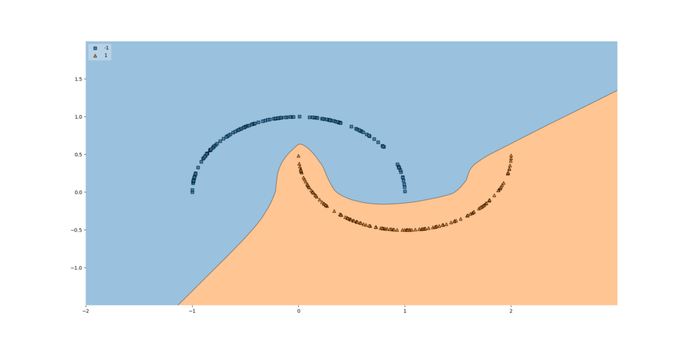

Training a supervised machine learning model means that you want to achieve two things: firstly, a model that performs - in other words, that it can successfully predict what class a sample should belong to, or what value should be output for some input. Secondly, while predictive power is important, your model should also be able to generalize well. In other words, it should also be able to predict relatively correctly for input samples that it hasn't seen before.

This often comes at a trade-off: the trade-off between underfitting and overfitting. You don't want your model to lose too much of its predictive power, i.e. being overfit. However, you neither want it to be _too good_ for the data it is trained on - causing it to be overfit, and losing its ability to generalize to data that it hasn't seen before.

And although it may sound strange, this _can_ actually cause problems, because the training dataset and inference samples should not necessarily come from a sample with an approximately equal distribution!

Measuring the balance between underfitting and overfitting can be done by [splitting](https://www.machinecurve.com/index.php/2020/02/18/how-to-use-k-fold-cross-validation-with-keras/) the dataset into three subsets: training data, validation data and testing data. The first two ensure that the model is trained (training data) and steered away from overfitting (validation data), while the latter can be used to test the model after it has been trained. In this article, we'll focus on the latter.

First, we will look at the balance between underfitting and overfitting in more detail. Subsequently, we will use the `tensorflow.keras` functionality for evaluating your machine learning model, called `model.evaluate`. This includes a full Keras example, where we train a model and subsequently evaluate it.

Let's take a look! 😎

* * *

\[toc\]

* * *

## Why evaluate Keras models?

Great question - why do we need to evaluate TensorFlow/Keras models in the first place?

To answer it, we must take a look at how a supervised machine learning model [is trained](https://www.machinecurve.com/index.php/2019/10/04/about-loss-and-loss-functions/#the-high-level-supervised-learning-process). Following the supervised learning process linked before, we note that samples from a _training set_ are fed forward, after which an average error value is computed and subsequently used for model [optimization](https://www.machinecurve.com/index.php/2019/10/24/gradient-descent-and-its-variants/).

The samples in a training set are often derived from some kind of population. For example, if we want to measure voting behavior in a population, we often take a representative sample. We therefore don't measure the behavior of the entire population - which would be really inefficient - but instead assume that if our sample is large enough, its distribution approaches the distribution of the entire population.

In other words, we generalize the smaller sample to the population.

While this often leads to good results, it can also be really problematic.

This emerges from the fact that we don't know whether our sample distribution is equal to the population distribution. While exact equality is hard to achieve, we should do our best to make them as equal as possible. And we know that neither without thorough analysis, and even then, because we can only compare to bigger samples.

Now, if you would train a supervised machine learning model with the training set, you would train until it is no longer **underfit**. This means that the model is capable of correctly generating predictions for the samples in your generalized population. However, we must also ensure that it is not **overfit** - meaning that it was trained _too closely_ for the distribution of your training set. If the distributions don't match, the model will show worse performance when it is used in practice.

Model evaluation helps us to avoid falling into the underfitting/overfitting trap. Before training the model, we split off and set apart some data from the training set, called a **testing dataset**, Preferably, we split off randomly - in order to ensure that the distributions of the testing set and remaining training set samples are relatively equal. After training the model, we then feed the test samples to the model. When it performs well for those samples, we can be more confident that our model can work in practice.



Especially models with [high variance](https://www.machinecurve.com/index.php/2020/11/02/machine-learning-error-bias-variance-and-irreducible-error-with-python/) are sensitive to overfitting.

* * *

## Working with model.evaluate

If you look at the TensorFlow API, the `model.evaluate` functionality for model evaluation is part of the `tf.keras.Model` functionality class, which "groups layers into an object with training and inference features" (Tf.kerasa.Model, n.d.).

It looks like this:

```python
evaluate(
    x=None, y=None, batch_size=None, verbose=1, sample_weight=None, steps=None,
    callbacks=None, max_queue_size=10, workers=1, use_multiprocessing=False,
    return_dict=False
)
```

With these attributes:

- `x` and `y` representing the samples and targets of your testing data, respectively.
- The `batch_size` representing the number of samples fed through `evaluate` at once. Default, it's `None`, and then equals to 32.
- With `verbose`, it is possible to show a progress bar (`1`) or nothing (`0`).
- If you wish to increase the importance of some test scores of some samples (e.g. the first half), you can use `sample_weight` to specify an 1D or 2D array with weights in order to weigh individual samples (the 1D case) or timesteps (the 2D case).
- The `steps` represents the total number of batches before evaluating is declared finished. If the number of batches available based on the batch size (i.e. `int(len(test_data) / batch_size)`) is higher than `steps`, only `steps` batches will be fed forward. If set to `None`, it will continue until exhausted (i.e. until all batches have been fed forward).
- With `callbacks`, it is possible to attach callbacks to the evaluation process.
- If you use a generator, you can specify generator specific functionality with `max_queue_size`, `workers` and `use_multiprocessing`.
- If you want a Python dictionary instead of a Python list, you can set `return_dict` to `True` in order to let the `evaluate` function return a dictionary.

* * *

## A full Keras example

Let's now take a look at creating a TensorFlow/Keras model that uses `model.evaluate` for model evaluation.

We first create the following TensorFlow model.

- We import the TensorFlow imports that we need. We also use the [extra\_keras\_datasets](https://github.com/christianversloot/extra_keras_datasets) module as we are training the model on the [EMNIST](https://www.machinecurve.com/index.php/2020/01/10/making-more-datasets-available-for-keras/) dataset.
- We specify some configuration options for the model.
- We load the EMNIST dataset, reshape the data (to make it compatible with TensorFlow), convert the data into `float32` format ([read here why](https://www.machinecurve.com/index.php/2020/09/16/tensorflow-model-optimization-an-introduction-to-quantization/#float32-in-your-ml-model-why-its-great)), and then scale the data to the \[latex\]\[0, 1\]\[/latex\] range.
- We then create and compile the model, and fit the data, i.e. construct and complete the training process.

Click [here](https://www.machinecurve.com/index.php/2019/09/17/how-to-create-a-cnn-classifier-with-keras/) if you wish to understand creating a Convolutional Neural Network in more detail.

```python
from tensorflow.keras.datasets import mnist
from tensorflow.keras.models import Sequential
from tensorflow.keras.layers import Dense, Dropout, Flatten
from tensorflow.keras.layers import Conv2D, MaxPooling2D
from tensorflow.keras.losses import sparse_categorical_crossentropy
from tensorflow.keras.optimizers import Adam
from extra_keras_datasets import emnist

# Model configuration
img_width, img_height = 28, 28
batch_size = 250
no_epochs = 25
no_classes = 10
validation_split = 0.2
verbosity = 1

# Load EMNIST dataset
(input_train, target_train), (input_test, target_test) = emnist.load_data(type='digits')

# Reshape data
input_train = input_train.reshape(input_train.shape[0], img_width, img_height, 1)
input_test = input_test.reshape(input_test.shape[0], img_width, img_height, 1)
input_shape = (img_width, img_height, 1)

# Cast numbers to float32
input_train = input_train.astype('float32')
input_test = input_test.astype('float32')

# Scale data
input_train = input_train / 255
input_test = input_test / 255

# Create the model
model = Sequential()
model.add(Conv2D(32, kernel_size=(3, 3), activation='relu', input_shape=input_shape))
model.add(MaxPooling2D(pool_size=(2, 2)))
model.add(Dropout(0.25))
model.add(Conv2D(64, kernel_size=(3, 3), activation='relu'))
model.add(MaxPooling2D(pool_size=(2, 2)))
model.add(Dropout(0.25))
model.add(Flatten())
model.add(Dense(256, activation='relu'))
model.add(Dense(no_classes, activation='softmax'))

# Compile the model
model.compile(loss=sparse_categorical_crossentropy,
              optimizer=Adam(),
              metrics=['accuracy'])

# Fit data to model
model.fit(input_train, target_train,
          batch_size=batch_size,
          epochs=no_epochs,
          verbose=verbosity,
          validation_split=validation_split)
```

As we saw, training a model is only one step - your other task as a ML engineer is to see whether your model generalizes well.

For this, during the loading operation, we loaded both training data and testing data.

You can now use `model.evaluate` in order to generate evaluation scores and print them in your console.

- We call `evaluate` on the `model` with the testing data - verbosity off, so we don't see output on the screen.
- As our main loss function is [sparse categorical crossentropy](https://www.machinecurve.com/index.php/2019/10/06/how-to-use-sparse-categorical-crossentropy-in-keras/) (see above) and our additional metric is accuracy, the `score` variable contains the scores in that particular other. Hence, `score[0]` represents crossentropy, and `score[1]` represents accuracy. We finally call `print()` to output the scores on screen.

```python
# Generate generalization metrics
score = model.evaluate(input_test, target_test, verbose=0)
print(f'Test loss: {score[0]} / Test accuracy: {score[1]}')
```

Running the model will first train our model and subsequently print the evaluation metrics:

```shell
Test loss: 0.0175113923806377 / Test accuracy: 0.9951000213623047
```

* * *

## Keras model.evaluate if you're using a generator

In the example above, we used `load_data()` to load the dataset into variables. This is easy, and that's precisely the goal of my Keras extensions library. However, many times, practice is a bit less ideal. In those cases, many approaches to importing your training dataset are out there. Three of them are, for example:

- [Creating a Keras model with HDF5 files and H5Py](https://www.machinecurve.com/index.php/2020/04/13/how-to-use-h5py-and-keras-to-train-with-data-from-hdf5-files/)
- [Creating a Keras model with HDF5 files and HDF5Matrix](https://www.machinecurve.com/index.php/2020/04/26/how-to-use-hdf5matrix-with-keras/)
- [Creating a Keras model with data flowing from files using a generator](https://www.machinecurve.com/index.php/2020/04/06/using-simple-generators-to-flow-data-from-file-with-keras/)

With the former two, you likely still end up with lists of training samples - i.e., having to load them into variables and thus in memory. For these cases, the example above can be used. But did you know that it is also possible to flow data from your system into the model. In other words, did you know that you can use a [generator](https://www.machinecurve.com/index.php/2020/04/06/using-simple-generators-to-flow-data-from-file-with-keras/) to train your machine learning model?

And it is also possible to evaluate a model using `model.evaluate` if you are using a generator. Say, for example, that you are using the following generator:

```python
# Load data
def generate_arrays_from_file(path, batchsize):
    inputs = []
    targets = []
    batchcount = 0
    while True:
        with open(path) as f:
            for line in f:
                x,y = line.split(',')
                inputs.append(x)
                targets.append(y)
                batchcount += 1
                if batchcount > batchsize:
                  X = np.array(inputs, dtype='float32')
                  y = np.array(targets, dtype='float32')
                  yield (X, y)
                  inputs = []
                  targets = []
                  batchcount = 0
```

Then you can evaluate the model by passing the generator to the evaluation function. Make sure to use a different `path` compared to your training dataset, since these need to be strictly separated.

```python
# Generate generalization metrics
score = model.evaluate(generate_arrays_from_file('./five_hundred_evaluation_samples.csv', batch_size), verbose=0)
print(f'Test loss: {score[0]} / Test accuracy: {score[1]}')
```

Here, we would have a CSV file with five hundred evaluation samples - and we feed them forward with `batch_size` sized sample batches. In our cases, that would be 2 steps for each evaluation round, as we configured `batch_size` to be 250.

Note that you don't have to pass targets here, as they are obtained from the generator (Tf.keras.Model, n.d.).

* * *

## Summary

In this article, we looked at model evaluation, and most specifically the usage of `model.evaluate` in TensorFlow and Keras. Firstly, we looked at the need for evaluating your machine learning model. We saw that it is necessary to do that because of the fact that models must work in practice, and that it is easy to overfit them in some cases.

We then moved forward to practice, and demonstrated how `model.evaluate` can be used to evaluate TensorFlow/Keras models based on the loss function and other metrics specified in the training process. This included an example. Another example was also provided for people who train their Keras models by means of a generator and want to evaluate them.

I hope that you have learnt something from today's article! If you did, please feel free to leave a comment in the comments section 💬 I'd love to hear from you. Please do the same if you have questions or other comments. Where possible, I'd love to help you out. Thank you for reading MachineCurve today and happy engineering! 😎

* * *

## References

_Tf.keras.Model_. (n.d.). TensorFlow. [https://www.tensorflow.org/api\_docs/python/tf/keras/Model#evaluate](https://www.tensorflow.org/api_docs/python/tf/keras/Model#evaluate)
