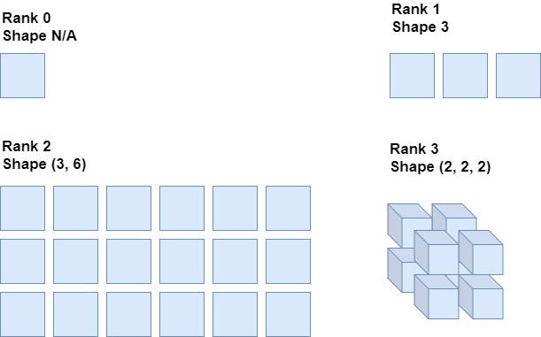

Developing a machine learning model with today's tools is much easier than it was years ago. Keras is one of the deep learning frameworks that can be used for developing deep learning models - and it's actually my lingua franca for doing so.

One of the aspects of building a deep learning model is specifying the shape of your input data, so that the model knows how to process it. In today's blog, we'll look at precisely this tiny part of building a machine learning model with Keras. We'll answer these questions in particular:

- What is the "shape" of any data?
- What are the `input_shape` and `input_dim` properties in Keras?
- Given an arbitrary dataset, how can we find the shape of the dataset as a whole?
- How can we convert the shape we identified into sample size, so that Keras understands it?
- How does all this come together - i.e., can we build an example of a Keras model that shows how it's done?

Are you ready?

Let's go! :)

* * *

\[toc\]

* * *

## The first layer in your Keras model: specifying input shape or input dim

Here's a very simple neural network:


It has three layers. In yellow, you see the input layer. This layer is like the entry point to the layers which process the information - it often simply takes the data that you serve the network, feeding it to the hidden layers, in blue. These layers are primarily responsible for processing towards the expected end result (which could be a correct classification, for example). Then, there is the output layer, which - depending on the problem such as regression or classification - is simply one parameter or a few of them. Depending on how you configure this layer, the output can be e.g. a probability distribution over the classes that are present in your classification problem.

Now, let's go back and take a look at the input layer. Understand that we have a neural network - which is eager to process data - and a dataset. The dataset contains samples, and often thousands or even hundreds of thousands of them. Each sample is fed to the network in sequential order. When all of them are fed, we say that _one epoch_ was completed - or, in plainer English, one iteration.

There is an obvious connection between the input layer and each individual sample. They must be of the same shape. If you imagine a scenario where a kid has to put a square block into one of three possible holes: a square hole, a circular hole or a rectangular hole. Now, you'll immediately see what action the kid has to take: match the shape of the hole with the shape of the object.

The same is true for input datasets. Each sample must match the shape of the input layer for the connection to be established. If both shapes aren't equal, the network cannot process the data that you're trying to feed it.

With this understanding, let's now take a look at the _rank_ and the _shape_ of Tensors (or arrays) in more detail, before we continue with how Keras input layers expect to receive information about such shapes by means of the `input_shape` and `input_dim` properties.

### The rank and shape of a Tensor (or Array, if you wish)

Say that we have this Array:

```python
[[1, 2, 3], [4, 5, 6]]
```

Which, if fed to a framework that runs on top of TensorFlow, is converted into Tensor format - which is TensorFlow's representation for numeric data (TensorFlow, n.d.)

Now, we can distinguish between _rank_ and _shape_ (TensorFlow, n.d.). The distinction is simple:

- The **rank** of a Tensor represents the _number of dimensions_ for your Tensor.
- The **shape** of a Tensor represents the _number of samples within each dimension_.

Tensors can be multidimensional. That is, they are representations in "some" mathematical space. Just like we can position ourselves at some (x, y, z) position in 3D space and compare our position with someone else's, Tensors are representations in some space. From this, and TensorFlow (n.d.), it follows that:

- A **rank-0** **Tensor** is a scalar value; a number, that has magnitude, but no direction.
- A **rank-1 Tensor** is a vector; it has magnitude _and_ direction;
- A **rank-2 Tensor** is a matrix; it is a table of numbers;
- A **rank-3 Tensor** is a cube of numbers.

[](https://www.machinecurve.com/wp-content/uploads/2020/04/rankshape.png)

From the image above, what follows with respect to shape:

- There's no shape for the rank-0 Tensor, because it has no dimensions. The shape would hence be an empty array, or `[]`.
- The rank-1 Tensor has a shape of `[3]`.
- The rank-2 Tensor has a shape of `[3, 6]`: three rows, six columns.
- The rank-3 Tensor has a shape of `[2, 2, 2]`: each axis has so many elements.

### Keras input layers: the `input_shape` and `input_dim` properties

Now that we know about the rank and shape of Tensors, and how they are related to neural networks, we can go back to Keras. More specifically, let's take a look at how we can connect the _shape of your dataset_ to the input layer through the `input_shape` and `input_dim` properties.

Let's begin with `input_shape`:

```python
model = Sequential()
model.add(Dense(4, input_shape=(10,))
```

Here, the input layer would expect a one-dimensional array with 10 elements for input. It would produce 4 outputs in return.

#### Input shape

It's actually really simple. The input shape parameter simply tells the input layer **what the shape of one sample looks like** (Keras, n.d.). Adding it to your input layer, will ensure that a match is made.

#### Input dim

Sometimes, though, you just have one dimension - which is the case with one-dimensional / flattened arrays, for example. In this case, you can also simply use `input_dim`: specifying the number of elements within that first dimension only. For example:

```python
model = Sequential()
model.add(Dense(32, input_dim=784))
```

This would make the input layer expect a one-dimensional array of 784 elements as each individual sample. It would produce 32 outputs. This is the kind of information bottleneck that we often want to see!

* * *

## Using Numpy to find the shape of your dataset

Now, suppose that I'm loading an example dataset - such as the MNIST dataset from the [Keras Datasets](https://www.machinecurve.com/index.php/2019/12/31/exploring-the-keras-datasets/).

That would be something like this:

```python
from tensorflow.keras.datasets import mnist
(x_train, y_train), (x_test, y_test) = mnist.load_data()
```

Now, how can we find the _shape_ of the dataset?

Very simple - we can use the [Numpy](https://numpy.org/) package used for numbers processing!

Let's add this import to the top:

```python
import numpy as np
```

And then we add this to the bottom:

```python
training_set_shape = x_train.shape
print(training_set_shape)
```

Yielding this as a whole:

```python
import numpy as np
from tensorflow.keras.datasets import mnist
(x_train, y_train), (x_test, y_test) = mnist.load_data()
training_set_shape = x_train.shape
print(training_set_shape)
```

Let's now run it and see what happens.

```console
$ python datasettest.py
2020-04-05 19:22:27.146991: I tensorflow/stream_executor/platform/default/dso_loader.cc:44] Successfully opened dynamic library cudart64_100.dll
(60000, 28, 28)
```

Et voila: a shape of `(60000, 28, 28)`. From this, we can derive that we have 60.000 samples - of 28 x 28 pixels. As the number of image channels is not present, we can assume that it's 1 - and that the images thus must be grayscale. There we go!

* * *

## Altering the shape to sample level

Unfortunately, we're not there yet. We cannot use this shape as our `input_shape`. This latter has to be the input shape of _one sample_, remember? Not the shape of the dataset as a whole.

Now, from the `(60000, 28, 28)`, which elements contribute to our knowledge about the shape at sample level?

Indeed, the 28 and 28 - while the 60.000 is not of interest (after all, at sample level, this would be 1).

Now, with images, we would often use Convolutional Neural Networks. In those models, we use [Conv](https://www.machinecurve.com/index.php/2020/03/30/how-to-use-conv2d-with-keras/) layers, which expect the `input_shape` in a very specific way. Specifically, they expect it as follows: `(x_shape, y_shape, channels)`. We already have `x_shape` and `y_shape`, which are both 28. We don't have `channels` yet, but do know about its value: 1. By consequence, our value for `input_shape` will be `(28, 28, 1)`!

However, we can also automate this, for the case when we want to use a different image dataset. We simply add the following:

```python
number_of_channels = 1
sample_shape = (training_set_shape[1], training_set_shape[2], number_of_channels)
```

We could even expand on our prints:

```python
print(f'Dataset shape: {training_set_shape}')
print(f'Sample shape: {sample_shape}')
```

Indeed, it would yield the same output:

```console
$ python datasettest.py
2020-04-05 19:28:28.235295: I tensorflow/stream_executor/platform/default/dso_loader.cc:44] Successfully opened dynamic library cudart64_100.dll
Dataset shape: (60000, 28, 28)
Sample shape: (28, 28, 1)
```

* * *

## A Keras example

Now that we know about Tensor shapes, their importance for neural network input layers, and how to derive the sample shape for a dataset, let's now see if we can expand this to a real Keras model.

For this, we'll be analyzing the [simple two-dimensional ConvNet](https://www.machinecurve.com/index.php/2020/03/30/how-to-use-conv2d-with-keras/) that we created in a different blog post.

Here is the code - you can find the analysis below it:

```python
from tensorflow.keras.datasets import cifar10
from tensorflow.keras.models import Sequential
from tensorflow.keras.layers import Dense, Flatten, Conv2D
from tensorflow.keras.losses import sparse_categorical_crossentropy
from tensorflow.keras.optimizers import Adam

# Model configuration
batch_size = 50
img_width, img_height, img_num_channels = 32, 32, 3
loss_function = sparse_categorical_crossentropy
no_classes = 10
no_epochs = 25
optimizer = Adam()
validation_split = 0.2
verbosity = 1

# Load CIFAR-10 data
(input_train, target_train), (input_test, target_test) = cifar10.load_data()

# Determine shape of the data
input_shape = (img_width, img_height, img_num_channels)

# Parse numbers as floats
input_train = input_train.astype('float32')
input_test = input_test.astype('float32')

# Scale data
input_train = input_train / 255
input_test = input_test / 255

# Create the model
model = Sequential()
model.add(Conv2D(32, kernel_size=(3, 3), activation='relu', input_shape=input_shape))
model.add(Conv2D(64, kernel_size=(3, 3), activation='relu'))
model.add(Conv2D(128, kernel_size=(3, 3), activation='relu'))
model.add(Flatten())
model.add(Dense(128, activation='relu'))
model.add(Dense(no_classes, activation='softmax'))

# Display a model summary
model.summary()

# Compile the model
model.compile(loss=loss_function,
              optimizer=optimizer,
              metrics=['accuracy'])

# Fit data to model
history = model.fit(input_train, target_train,
            batch_size=batch_size,
            epochs=no_epochs,
            verbose=verbosity,
            validation_split=validation_split)

# Generate generalization metrics
score = model.evaluate(input_test, target_test, verbose=0)
print(f'Test loss: {score[0]} / Test accuracy: {score[1]}')
```

Specifically, we can observe:

- That the `img_width` and `img_height` are 32. This is correct, as we're now using a different dataset - see `cifar10.load_data()` - where the images are 32 x 32 pixels.
- The value for `img_num_channels` was set to 3. This is also correct, because the CIFAR10 dataset contains RGB images - which have three image channels. So no 1 anymore - and our final sample shape will be `(32, 32, 3)`.
- We subsequently set the comuted `input_shape` as the `input_shape` of our first Conv2D layer - specifying the input layer implicitly (which is just how it's done with Keras).

There we go - we can now actually determine the input shape for our data and use it to create Keras models! 😎

* * *

## Summary

In this blog post, we've looked at the Keras `input_shape` and `input_dim` properties. We did so in quite a chained way, by first looking at the link between neural network input layers and the shape of your dataset - and specifically, the shape at sample level.

Additionally, we looked at the concepts of rank and shape in order to understand the foundations of a layer's input shape / dim in the first place.

Then, we looked at how the Keras framework for deep learning implements specifying the input shape / dimension by means of the beforementioned properties. This included looking at how to determine the input shape for your dataset at dataset level, converting it into sample level shape, and subsequently using it in an actual Keras model. We provided a simple example by means of a ConvNet implementation. I really hope that it helps you build your Keras models - as I know that it's often these simple steps that get you stuck!

If you have any questions, remarks, or other comments - feel free to drop a message in the comments section below! 😎 I'll happily answer and help you build your Keras model. Thank you for reading MachineCurve today and happy engineering!

\[kerasbox\]

* * *

## References

_TensorFlow tensors_. (n.d.). TensorFlow. [https://www.tensorflow.org/guide/tensor#top\_of\_page](https://www.tensorflow.org/guide/tensor#top_of_page)

Keras. (n.d.). _Guide to the sequential model_. [https://keras.io/getting-started/sequential-model-guide/](https://keras.io/getting-started/sequential-model-guide/)
