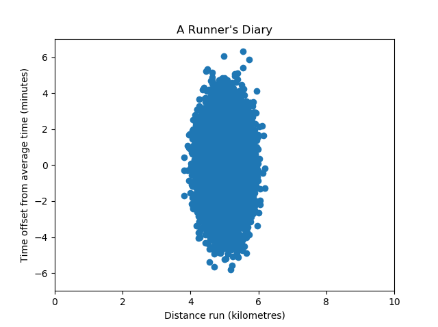

Training a Supervised Machine Learning model involves feeding forward data from a training dataset, through the model, generating predictions. These predictions are then compared with what is known as the _ground truth_, or the corresponding targets for the training data. Subsequently, the model is improved, by minimizing a cost, error or [loss function](https://www.machinecurve.com/index.php/2019/10/04/about-loss-and-loss-functions/).

It is important to prepare your dataset before feeding it to your model. When you pass through data without doing so, the model may show some very interesting behavior - and training can become really difficult, if not impossible. In those cases, when inspecting your model code, it could very well be the case that you forgot to apply **normalization** or **standardization**. What are they? Why are they necessary? And how do they work? Precisely that is what we will look at in this article.

Firstly, we will take a look at why you need a normalized or standardized dataset. Subsequently, we'll move forward and see how those techniques actually work. Finally, we give a lot of step-by-step examples by using Scikit-learn and Python for making your dataset ready for Machine Learning models.

Let's take a look! :)

**Update 08/Dec/2020:** added references to PCA article.

* * *

\[toc\]

* * *

## Normalization and Standardization for Feature Scaling

Before studying the _what_ of something, I always think that it helps studying the _why_ first. At least, it makes you understand why you have to apply certain techniques or methods. The same is true for Normalization and Standardization. Why are they necessary? Let's take a look at this in more detail.

### They are required by Machine Learning algorithms

When you are training a Supervised Machine Learning model, you are feeding forward data through the model, generating predictions, and subsequently improving the model. As you read in the introduction, this is achieved by minimizing a cost/error/loss function, and it allows us to optimize models in their unique ways.

For example, a [Support Vector Machine](https://www.machinecurve.com/index.php/2019/09/20/intuitively-understanding-svm-and-svr/) is optimized by finding support vectors that support the decision boundary with the greatest margin between two classes, effectively computing a distance metric. Neural networks use [gradient descent](https://www.machinecurve.com/index.php/2019/10/24/gradient-descent-and-its-variants/) for optimization, which involves walking down the loss landscape into the direction where loss improves most. And there are many other ways. Now, here are some insights about why datasets must be scaled for Machine Learning algorithms (Wikipedia, 2011):

- Gradient descent converges much faster when the dataset is scaled.
- If the model depends on measuring distance (think SVM), the distances are comparable after the dataset was scaled. In fact, if it is _not_ scaled, computation of the loss can be "governed by this particular feature" if the feature has a really big scale compared to other features (Wikipedia, 2011).
- If you apply [regularization](https://www.machinecurve.com/index.php/2020/01/26/which-regularizer-do-i-need-for-training-my-neural-network/), you must also apply scaling, because otherwise some features may be penalized more than strictly necessary.

### They help Feature Selection too

Suppose that we given a dataset of a **runner's diary** and that our goal is to learn a predictive model between some of the variables and runner performance. What we would normally do in those cases is perform a feature selection procedure, because we cannot simply feed all samples due to two reasons:

1. **The curse of dimensionality:** if we look at our dataset as a _feature space_ with each feature (i.e., column) representing one dimension, our space would be multidimensional if we use many features. The more dimensions we add, the more training data we need; this need increases exponentially. By consequence, although we should use sufficient features, we don't want to use every one of them.
2. **We don't want to use features that contribute insignificantly.** Some features (columns) contribute to the output less significantly than others. It could be that when removed, the model will still be able to perform, but at a significantly lower computational cost. We therefore want to be able to select the features that contribute most significantly.

> In machine learning problems that involve learning a "state-of-nature" from a finite number of data samples in a high-dimensional feature space with each feature having a range of possible values, typically an enormous amount of training data is required to ensure that there are several samples with each combination of values.
>
> Wikipedia (n.d.) about the curse of dimensionality

We would e.g. apply algorithms such as [_Principal Component Analysis_ (PCA)](https://www.machinecurve.com/index.php/2020/12/07/introducing-pca-with-python-and-scikit-learn-for-machine-learning/) to help us determine which features are most important. If we look at how these algorithms work, we see that e.g. PCA extracts new features based on the _principal directions_ in the dataset, i.e. the directions in your data where variance is largest (Scikit-learn, n.d.).

> Variance is the expectation of the squared deviation of a random variable from its mean. Informally, it measures how far a set of numbers is spread out from their average value.
>
> Wikipedia (2001)

Let's keep this in mind when looking at the following dataset:



Here, the variance of the variable _Time offset_ is larger than that of the variable _Distance run_.

PCA will therefore naturally select the Time offset variable over the Distance run variable, because the [eigenpairs](https://www.machinecurve.com/index.php/2020/12/07/introducing-pca-with-python-and-scikit-learn-for-machine-learning/) are more significant there.

However, this does not necessarily mean that it _is_ in fact more important - because we cannot compare variance. Only if variance is comparable, and hence the scales are equal in the _unit they represent_, we can confidently use algorithms like PCA for feature selection. That's why we must find a way to make our variables comparable.

### Introducing Feature Scaling

And, to be speaking most generally, that method is called **feature scaling** - and it is applied during the data preprocessing step.

> Feature scaling is a method used to normalize the range of independent variables or features of data. In data processing, it is also known as data normalization and is generally performed during the data preprocessing step.
>
> Wikipedia (2011)

There are two primary ways for feature scaling which we will cover in the remainder of this article:

- **Rescaling**, or _min-max normalization:_ we scale the data into one of two ranges: \[latex\]\[0, 1\]\[/latex\] or \[latex\]\[a, b\]\[/latex\], often \[latex\]\[-1, 1\]\[/latex\].
- **Standardization**, or _Z-score normalization_: we scale the data so that the mean is zero and variance is 1.

Let's now cover each of the three methods in more detail, find out how they work, and identify when they are used best.

* * *

## Rescaling (min-max normalization)

Rescaling, or **min-max normalization**, is a simple method for bringing your data into one out of two ranges: \[latex\]\[0, 1\]\[/latex\] or \[latex\]\[a, b\]\[/latex\]. It highly involves the minimum and maximum values from the dataset in normalizing the data.

### How it works - the \[0, 1\] way

Suppose that we have the following array:

```python
dataset = np.array([1.0, 12.4, 3.9, 10.4])
```

Min-max normalization for the range \[latex\]\[0, 1\]\[/latex\] can be defined as follows:

```python
normalized_dataset = (dataset - min(dataset)) / (max(dataset) - min(dataset))
```

In a naïve way, using Numpy, we can therefore normalize our data into the \[latex\]\[0, 1\]\[/latex\] range in the following way:

```python
import numpy as np
dataset = np.array([1.0, 12.4, 3.9, 10.4])
normalized_dataset = (dataset - np.min(dataset)) / (np.max(dataset) - np.min(dataset))
print(normalized_dataset)
```

This indeed yields an array where the lowest value is now `0.0` and the biggest is `1.0`:

```python
[0. 1. 0.25438596 0.8245614 ]
```

### How it works - the \[a, b\] way

If instead we wanted to scale it to some other arbitrary range - say \[latex\]\[0, 1.5\]\[/latex\], we can apply min-max normalization but then for the \[latex\]\[a, b\]\[/latex\] range, where \[latex\]a\[/latex\] and \[latex\]b\[/latex\] can be chosen yourself.

We can use the following formula for normalization:

```python
normalized_dataset = a + ((dataset - min(dataset)) * (b - a) / (max(dataset) - min(dataset)))
```

Or, for the dataset from the previous section, using a naïve Python implementation:

```python
import numpy as np
a = 0
b = 1.5
dataset = np.array([1.0, 12.4, 3.9, 10.4])
normalized_dataset = a + ((dataset - np.min(dataset)) * (b - a) / (np.max(dataset) - np.min(dataset)))
print(normalized_dataset)
```

Which yields:

```python
[0. 1.5        0.38157895 1.23684211]
```

### Applying the MinMaxScaler from Scikit-learn

Scikit-learn, the popular machine learning library used frequently for training many _traditional_ Machine Learning algorithms provides a module called `MinMaxScaler`, and it is part of the `sklearn.preprocessing` API.

It allows us to fit a scaler with a predefined range to our dataset, and subsequently perform a transformation for the data. The code below gives an example of how to use it.

- We import `numpy` as a whole and the `MinMaxScaler` from `sklearn.preprocessing`.
- We define the NumPy array that we just defined before, but now, we have to reshape it: `.reshape(-1, 1)`. This is a Scikit-learn requirement for arrays with just one feature per array item (which in our case is true, because we are using scalar values).
- We then initialize the `MinMaxScaler` and here we also specify our \[latex\]\[a, b\]\[/latex\] range: `feature_range=(0, 1.5)`. Of course, as \[latex\]\[0, 1\]\[/latex\] is also an \[latex\]\[a, b\]\[/latex\] range, we can implement that one as well using `MinMaxScaler`.
- We then fit the data to our scaler, using `scaler.fit(dataset)`. This way, it becomes capable of transforming datasets.
- We finally transform the `dataset` using `scaler.transform(dataset)` and print the result.

```python
import numpy as np
from sklearn.preprocessing import MinMaxScaler
dataset = np.array([1.0, 12.4, 3.9, 10.4]).reshape(-1, 1)
scaler = MinMaxScaler(feature_range=(0, 1.5))
scaler.fit(dataset)
normalized_dataset = scaler.transform(dataset)
print(normalized_dataset)
```

And indeed, after printing, we can see that the outcome is the same as obtained with our naïve approach:

```python
[[0. ]
 [1.5       ]
 [0.38157895]
 [1.23684211]]
```

* * *

## Standardization (Z-scale normalization)

In the previous example, we normalized our dataset based on the minimum and maximum values. Mean and standard deviation are however not _standard,_ meaning that the mean is zero and that the standard deviation is one.

```python
print(normalized_dataset)
print(np.mean(normalized_dataset))
print(np.std(normalized_dataset))
```

```python
[[0. ]
 [1.5       ]
 [0.38157895]
 [1.23684211]]
0.7796052631578947
0.611196249385709
```

Because the bounds of our normalizations would not be equal, it would still be (slightly) unfair to compare the outcomes e.g. with [PCA](https://www.machinecurve.com/index.php/2020/12/07/introducing-pca-with-python-and-scikit-learn-for-machine-learning/).

For example, if we used a different dataset, our results would be different:

```python
import numpy as np
from sklearn.preprocessing import MinMaxScaler
dataset = np.array([2.4, 6.2, 1.8, 9.0]).reshape(-1, 1)
scaler = MinMaxScaler(feature_range=(0, 1.5))
scaler.fit(dataset)
normalized_dataset = scaler.transform(dataset)
print(normalized_dataset)
print(np.mean(normalized_dataset))
print(np.std(normalized_dataset))

[[0.125     ]
 [0.91666667]
 [0. ]
 [1.5       ]]
0.6354166666666665
0.6105090942538584
```

This is where **standardization** or _Z-score normalization_ comes into the picture. Rather than using the minimum and maximum values, we use the mean and standard deviation from the data. By consequence, all our features will now have zero mean and unit variance, meaning that we can now compare the variances between the features.

### How it works

The formula for standardization is as follows:

```python
standardized_dataset = (dataset - mean(dataset)) / standard_deviation(dataset))
```

In other words, for each sample from the dataset, we subtract the mean and divide by the standard deviation. By removing the mean from each sample, we effectively move the samples towards a mean of 0 (after all, we removed it from all samples). In addition, by dividing by the standard deviation, we yield a dataset where the values describe _by how much of the standard deviation_ they are offset from the mean.

### Python example

This can also be implemented with Python:

```python
import numpy as np
dataset = np.array([1.0, 2.0, 3.0, 3.0, 3.0, 2.0, 1.0])
standardized_dataset = (dataset - np.average(dataset)) / (np.std(dataset))
print(standardized_dataset)
```

Which yields:

```python
[-1.37198868 -0.17149859  1.02899151  1.02899151  1.02899151 -0.17149859
 -1.37198868]
```

In Scikit-learn, the `sklearn.preprocessing` module provides the `StandardScaler` which helps us perform the same action in an efficient way.

```python
import numpy as np
from sklearn.preprocessing import StandardScaler
dataset = np.array([1.0, 2.0, 3.0, 3.0, 3.0, 2.0, 1.0]).reshape(-1, 1)
scaler = StandardScaler()
scaler.fit(dataset)
standardized_dataset = scaler.transform(dataset)
print(standardized_dataset)
print(np.mean(standardized_dataset))
print(np.std(standardized_dataset))
```

With as outcome:

```python
[[-1.37198868]
 [-0.17149859]
 [ 1.02899151]
 [ 1.02899151]
 [ 1.02899151]
 [-0.17149859]
 [-1.37198868]]
3.172065784643304e-17
1.0
```

We see that the mean is _really_ close to 0 (\[latex\]3.17 \\times 10^{-17}\[/latex\]) and that standard deviation is one.

* * *

## Normalization vs Standardization: when to use which one?

Many people have the question **when to use normalization, and when to use standardization?** This is a valid question - and I had it as well.

Most generally, the rule of thumb would be to **use min-max normalization if you want to normalize the data while keeping some differences in scales (because units remain different), and use standardization if you want to make scales comparable (through standard deviations)**.

The example below illustrates the effects of standardization. In it, we create Gaussian data, stretch one of the axes with some value to make them relatively incomparable, and plot the data. This clearly indicates the stretched blobs in an absolute sense. Then, we use standardization and plot the data again. We now see that both the mean has moved to \[latex\](0, 0)\[/latex\] _and_ that when the data is standardized, the variance of the axes is pretty similar!

If we hadn't applied feature scaling here, algorithms like [PCA](https://www.machinecurve.com/index.php/2020/12/07/introducing-pca-with-python-and-scikit-learn-for-machine-learning/) would have pretty much fooled us. ;-)

```python
# Imports
import matplotlib.pyplot as plt
from sklearn.datasets import make_gaussian_quantiles
from sklearn.preprocessing import StandardScaler

# Make Gaussian data
plt.title("Gaussian data, two classes, mean at (2,3)")
X1, Y1 = make_gaussian_quantiles(n_features=2, n_classes=2, n_samples=1000, mean=(2,3))

# Stretch one of the axes
X1[:, 1] = 2.63 * X1[:, 1]

# Plot data
plt.scatter(X1[:, 0], X1[:, 1], marker='o', c=Y1,
            s=25, edgecolor='k')
axes = plt.gca()
axes.set_xlim([-5, 20])
axes.set_ylim([-5, 20])
plt.show()

# Standardize Gaussian data
scaler = StandardScaler()
scaler.fit(X1)
X1 = scaler.transform(X1)

# Plot standardized data
plt.title("Gaussian data after standardization, two classes, mean at (0,0)")
plt.scatter(X1[:, 0], X1[:, 1], marker='o', c=Y1,
            s=25, edgecolor='k')
axes = plt.gca()
axes.set_xlim([-5, 20])
axes.set_ylim([-5, 20])
plt.show()
```

- [](https://www.machinecurve.com/wp-content/uploads/2020/11/gauss0.png)
    
- [](https://www.machinecurve.com/wp-content/uploads/2020/11/gauss1.png)
    

* * *

## Summary

In this article, we looked at Feature Scaling for Machine Learning. More specifically, we looked at Normalization (min-max normalization) which brings the dataset into the \[latex\]\[a, b\]\[/latex\] range. In addition to Normalization, we also looked at Standardization, which allows us to convert the scales into _amounts of standard deviation_, making the axes comparable for e.g. algorithms like PCA.

We illustrated our reasoning with step-by-step Python examples, including some with standard Scikit-learn functionality.

I hope that you have learned something from this article! If you did, feel free to leave a message in the comments section 💬 Please do the same if you have questions or other comments. I'd love to hear from you! Thank you for reading MachineCurve today and happy engineering 😎

* * *

## References

Wikipedia. (2011, December 15). _Feature scaling_. Wikipedia, the free encyclopedia. Retrieved November 18, 2020, from [https://en.wikipedia.org/wiki/Feature\_scaling](https://en.wikipedia.org/wiki/Feature_scaling)

Scikit-learn. (n.d.). _Importance of feature scaling — scikit-learn 0.23.2 documentation_. scikit-learn: machine learning in Python — scikit-learn 0.16.1 documentation. Retrieved November 18, 2020, from [https://scikit-learn.org/stable/auto\_examples/preprocessing/plot\_scaling\_importance.html](https://scikit-learn.org/stable/auto_examples/preprocessing/plot_scaling_importance.html)

Wikipedia. (n.d.). _Curse of dimensionality_. Wikipedia, the free encyclopedia. Retrieved November 18, 2020, from [https://en.wikipedia.org/wiki/Curse\_of\_dimensionality](https://en.wikipedia.org/wiki/Curse_of_dimensionality)

Wikipedia. (2001, June 30). _Variance_. Wikipedia, the free encyclopedia. Retrieved November 18, 2020, from [https://en.wikipedia.org/wiki/Variance](https://en.wikipedia.org/wiki/Variance)
