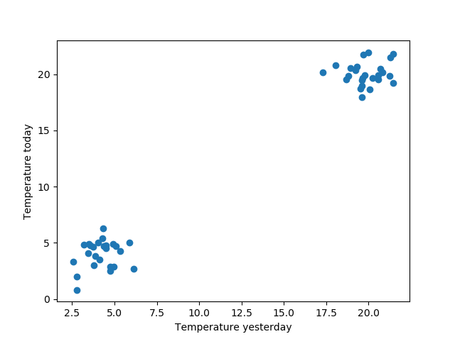
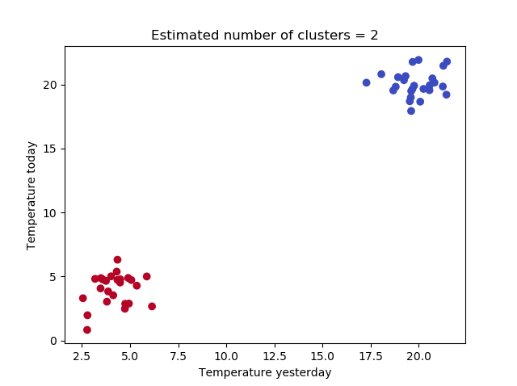

Say you've got a dataset where there exist relationships between individual samples, and your goal is to identify groups of related samples within the dataset. Clustering, which is part of the class of unsupervised machine learning algorithms, is then the way to go. But what clustering algorithm to apply when you do not really know the number of clusters?

Enter **Affinity Propagation**, a gossip-style algorithm which derives the number of clusters by mimicing social group formation by passing messages about the popularity of individual samples as to whether they're part of a certain group, or even if they are the leader of one. This algorithm, which can estimate the number of clusters/groups in your dataset itself, is the topic of today's blog post.

Firstly, we'll take a theoretical look at Affinity Propagation. **What is it** - and how does the group formation analogy work? **How does it work** in more detail, i.e. mathematically? And what kind of messages are sent, and how are those popularity metrics determined? How does the algorithm converge? We'll look at them first.

Next, we provide an example implementation of Affinity Propagation using Scikit-learn and Python. We explain our model code step by step, so that you can understand what is happening piece by piece. For those who already have some experience and wish to play right away, the full model code is also available. Hence, today's blog post is both theoretical and practical - my favorite type of blog!

In this tutorial, you will learn...

- **How to perform Affinity Propagation clustering with Scikit-learn.**
- **What Affinity Propagation is.**
- **How Affinity propagation works.**

* * *

\[toc\]

* * *

## Example code: How to perform Affinity Propagation with Scikit-learn?

With this **quick example** you will be able to start using **Affinity Propagation with Scikit-learn** immediately. Copy and paste the code into your project and you are ready to go. If you want to understand how Affinity Propagation works in more detail, or learn how to write the code step-by-step, make sure to read the rest of this tutorial.

```python
from sklearn.datasets import make_blobs
from sklearn.cluster import AffinityPropagation

# Generate data
X, targets = make_blobs(n_samples = 50, centers = [(20,20), (4,4)], n_features = 2, center_box=(0, 1), cluster_std = 1)

# Fit Affinity Propagation with Scikit
afprop = AffinityPropagation(max_iter=250)
afprop.fit(X)
cluster_centers_indices = afprop.cluster_centers_indices_
n_clusters_ = len(cluster_centers_indices)

# Predict the cluster for all the samples
P = afprop.predict(X)
```

* * *

## What is Affinity Propagation?

Do you remember high school, where groups of people formed - and you could only become a member of a particular group _if the group's leaders_ thought you were cool?

Although the analogy might be a bit far-fetched, I think this is how Affinity Propagation for clustering can be explained in plain English. For a **set of data points**, a "group formation" process begins, where each **sample** competes with other ones in order to gain group membership. The ones with most group capital, the group leaders are called **exemplars** (Scikit-learn, n.d.).

The interesting thing about this machine learning techniques is that you don't have to configure the number of clusters in advance, unlike [K-means clustering](https://www.machinecurve.com/index.php/2020/04/16/how-to-perform-k-means-clustering-with-python-in-scikit/) (Scikit-learn, n.d.). The main drawback is the complexity: it's not one of the cheapest machine learning algorithms in terms of the computational resources that are required (Scikit-learn, n.d.). Hence, it's a suitable technique for "small to medium sized datasets" only (Scikit-learn, n.d.).

### A little bit more detail

Now that we understand Affinity Propagation at a high level, it's time to take a more detailed look. We'll look at a couple of things:

- How the algorithm works, at a high level;
- What kind of messages are propagated;
- How the scores in those messages are computed.
- How the message scores are updated after each iteration, and thus how the true clusters are formed.

First of all, as with any clustering algorithm, Affinity Propagation is iterative. This means that it will complete a number of iterations until completion. Contrary to K-means clustering, where convergence is determined with some threshold value, with Affinity Propagation you configure a _number of iterations_ to complete. After then, the algorithm assumes convergence and will return the resulting clusters (Scikit-learn, n.d.).

### Two types of messages are propagated

During each iteration, each sample broadcasts two types of messages to the other samples (Scikit-learn, n.d.). The first is called the **responsibility** \[latex\]r(i,k)\[/latex\] - which is the "evidence that sample \[latex\]k\[/latex\] should be the exemplar for sample \[latex\]i\[/latex\]" (Scikit-learn, n.d.). I always remember it as follows: the greater the _expected group leadership_ of \[latex\]k\[/latex\], the greater the _responsibility_ for the group. That's how you know that the responsibility from the point of \[latex\]i\[/latex\] always tells you something about the importance of \[latex\]k\[/latex\] for the group.

The other type of message that is sent is the **availability**. This is the opposite of the responsibility: how certain \[latex\]i\[/latex\] is that it should choose \[latex\]k\[/latex\] as the exemplar, i.e. _how available it is to join a particular group_ (Scikit-learn, n.d.). In the high school case, say that you want to join a semi-cool group (some availability), while you're more willing to join the really cool group, your availability is much higher for the really cool one. The responsibility tells you something about whose acceptance you need to join the group, i.e. the most likely group leader i.e. exemplar.

### Computing the scores for responsibility and availability

Let's now take an even closer look at the concepts of responsibility and availability. Now that we know what they represent at a high level, it's time that we look at them in detail - which means mathematically.

#### Responsibility

Here's the formula for responsibility (Scikit-learn, n.d.):

\[latex\]r(i, k) \\leftarrow s(i, k) - max \[ a(i, k') + s(i, k') \\forall k' \\neq k \]\[/latex\]

Let's now decompose this formula into plain English. We start at the left. Here, \[latex\]r(i,k)\[/latex\] is once again the _responsibility_ that sample \[latex\]k\[/latex\] is the exemplar for sample \[latex\]i\[/latex\]. But what determines it? Two components: \[latex\]s(i, k)\[/latex\] and \[latex\]max \[ a(i, k') + s(i, k') \\forall k' \\neq k \]\[/latex\].

The first is the _similarity_ between samples \[latex\]i\[/latex\] and \[latex\]k\[/latex\]. If they are highly similar, the odds are very big that \[latex\]k\[/latex\] should be \[latex\]i\[/latex\]'s exemplar. However, this is not the full story, as we cannot look at similarity _only_ - as the other samples will also try to convince that they are the more suitable exemplars for \[latex\]i\[/latex\]. Hence, the similarity is _relative_, and that's why we need to subtract that big \[latex\]max\[/latex\] value. It looks complex, but it simply boils down to "the maximum availability and similarity of all the other samples \[latex\]k'\[/latex\], where \[latex\]k'\[/latex\] is never \[latex\]k\[/latex\]". We simply subtract the similarity _and_ the willingness of \[latex\]k\[/latex\]'s "biggest competitor" in order to show its relative strength as an exemplar.

#### Availability

Looks complex, but is actually relatively easy. And so is the formula for the availability (Scikit-learn, n.d.):

\[latex\]a(i, k) \\leftarrow min \[0, r(k, k) + \\sum\_{i'~s.t.~i' \\notin {i, k}}{r(i', k)}\]\[/latex\]

As we can see, the availability is determined as the minimum value between 0 and the responsibility of \[latex\]k\[/latex\] to \[latex\]k\[/latex\] (i.e. how important it considers itself to be an exemplar or a group leader) and the sum of the responsibilities for all other samples \[latex\]i'\[/latex\] to \[latex\]k\[/latex\], where \[latex\]i'\[/latex\] is neither \[latex\]i\[/latex\] or \[latex\]k\[/latex\]. Thus, in terms of group formation, a sample will become more available to a potential exemplar if itself thinks it's highly important and so do the other samples around.

### Updating the scores: how clusters are formed

Now that we know about the formulae for responsibility and availability, let's take a look at how scores are updated after every iteration (Scikit-learn, n.d.):

\[latex\]r\_{t+1}(i, k) = \\lambda\\cdot r\_{t}(i, k) + (1-\\lambda)\\cdot r\_{t+1}(i, k)\[/latex\]

\[latex\]a\_{t+1}(i, k) = \\lambda\\cdot a\_{t}(i, k) + (1-\\lambda)\\cdot a\_{t+1}(i, k)\[/latex\]

Very simple: every update, we take \[latex\]\\lambda\[/latex\] of the old value and merge it with \[latex\](1-\\lambda)\[/latex\] of the new value. This lambda, which is also called "damping value", is a smoothing factor to ensure a smooth transition; it avoids large oscillations during the optimization process.

Altogether, Affinity Propagation is therefore an algorithm which:

- Estimates the number of clusters itself.
- Is useful for small to medium sized datasets given the computational expensiveness.
- Works by "gossiping" around as if it is attempting to form high school groups of students.
- Updates itself through small and smooth updates to the "attractiveness" of individual samples across time, i.e. after every iteration.
- Where the attractiveness is determined _for a sample_, answering the question "can this be the leader of the group I want to belong to?" and _for the sample itself_ ("what's the evidence that I'm a group leader?").

Let's now take a look how to implement it with Python and Scikit-learn! :)

* * *

## Implementing Affinity Propagation with Python and Scikit-learn

Here they are again, the clusters that we also saw in our blog about [K-means clustering](https://www.machinecurve.com/index.php/2020/04/16/how-to-perform-k-means-clustering-with-python-in-scikit/), although we have fewer samples today:



Remember how we generated them? Open up a Python file and name it \`affinity.py\`, add the imports (which are Scikit-learn, Numpy and Matplotlib)...

```python
import matplotlib.pyplot as plt
import numpy as np
from sklearn.datasets import make_blobs
from sklearn.cluster import AffinityPropagation
```

We then add a few configuration options: the number of samples in total we generate, the centers of the clusters, as well as the number of classes that we will generate samples for. Those are all to be used in `make_blobs`, which generates the clusters and assigns them to \[latex\]X\[/latex\] and \[latex\]targets\[/latex\], respectively.

We save them with Numpy and subsequently load them and assign them to \[latex\]X\[/latex\] again. Those two lines of code aren't necessary for your model to run, but if you want to compare across settings, you likely don't want to generate samples at random every time. By saving them once, and subsequently commenting out `save` and `make_blobs`, you'll load them from file again and again :)

```python
# Configuration options
num_samples_total = 50
cluster_centers = [(20,20), (4,4)]
num_classes = len(cluster_centers)

# Generate data
X, targets = make_blobs(n_samples = num_samples_total, centers = cluster_centers, n_features = num_classes, center_box=(0, 1), cluster_std = 1)

np.save('./clusters.npy', X)
X = np.load('./clusters.npy')
```

We then fit the data to the Affinity Propagation algorithm, after we loaded it, which just takes two lines of code. In another two lines, we derive characteristics such as the exemplars and by consequence the number of clusters:

```python
# Fit AFfinity Propagation with Scikit
afprop = AffinityPropagation(max_iter=250)
afprop.fit(X)
cluster_centers_indices = afprop.cluster_centers_indices_
n_clusters_ = len(cluster_centers_indices)
```

Finally, by using the algorithm we fit, we predict for all our samples to which cluster they belong:

```python
# Predict the cluster for all the samples
P = afprop.predict(X)
```

And finally visualize the outcome:

```python
# Generate scatter plot for training data
colors = list(map(lambda x: '#3b4cc0' if x == 1 else '#b40426', P))
plt.scatter(X[:,0], X[:,1], c=colors, marker="o", picker=True)
plt.title(f'Estimated number of clusters = {n_clusters_}')
plt.xlabel('Temperature yesterday')
plt.ylabel('Temperature today')
plt.show()
```

Here it is! 😊👇



### Full model code

Should you wish to obtain the full model code at once, so that you can start working with it straight away - here you go! 😎

```python
import matplotlib.pyplot as plt
import numpy as np
from sklearn.datasets import make_blobs
from sklearn.cluster import AffinityPropagation

# Configuration options
num_samples_total = 50
cluster_centers = [(20,20), (4,4)]
num_classes = len(cluster_centers)

# Generate data
X, targets = make_blobs(n_samples = num_samples_total, centers = cluster_centers, n_features = num_classes, center_box=(0, 1), cluster_std = 1)

np.save('./clusters.npy', X)
X = np.load('./clusters.npy')

# Fit AFfinity Propagation with Scikit
afprop = AffinityPropagation(max_iter=250)
afprop.fit(X)
cluster_centers_indices = afprop.cluster_centers_indices_
n_clusters_ = len(cluster_centers_indices)

# Predict the cluster for all the samples
P = afprop.predict(X)

# Generate scatter plot for training data
colors = list(map(lambda x: '#3b4cc0' if x == 1 else '#b40426', P))
plt.scatter(X[:,0], X[:,1], c=colors, marker="o", picker=True)
plt.title(f'Estimated number of clusters = {n_clusters_}')
plt.xlabel('Temperature yesterday')
plt.ylabel('Temperature today')
plt.show()
```

* * *

## Summary

In today's blog post, we looked at the Affinity Propagation algorithm. This clustering algorithm allows machine learning engineers to cluster their datasets by means of "messaging". Resembling how groups are formed at high school, where the group leaders decide who gets in and who has to choose another, the pull game is played by the algorithm as well.

By looking at the messages that are propagated, the responsibility and availability metrics that are sent with these messages, and how it converges iteratively, we first understood the theoretical part of the Affinity Propagation algorithm. This was followed by a practical example using Python and Scikit-learn, where we explained implementing Affinity Propagation step by step. For those interested, the model as a whole is also available above.

I hope you've learnt something today! I certainly did - I never worked with this algorithm before. If you have any questions, please feel free to leave a message in the comments section below - I'd appreciate it 💬👇. Thank you for reading MachineCurve today and happy engineering! 😎

* * *

## References

Scikit-learn. (n.d.). _2.3. Clustering — scikit-learn 0.22.2 documentation_. scikit-learn: machine learning in Python — scikit-learn 0.16.1 documentation. Retrieved April 18, 2020, from [https://scikit-learn.org/stable/modules/clustering.html#affinity-propagation](https://scikit-learn.org/stable/modules/clustering.html#affinity-propagation)
