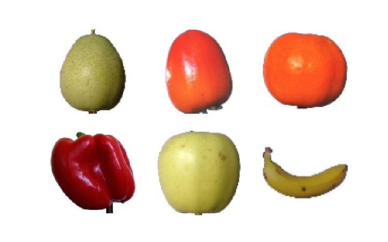
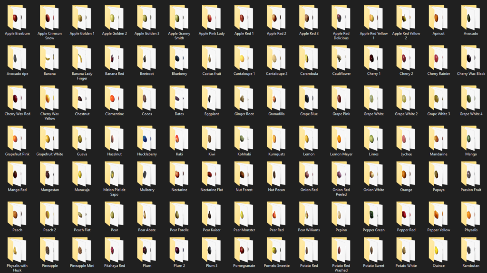
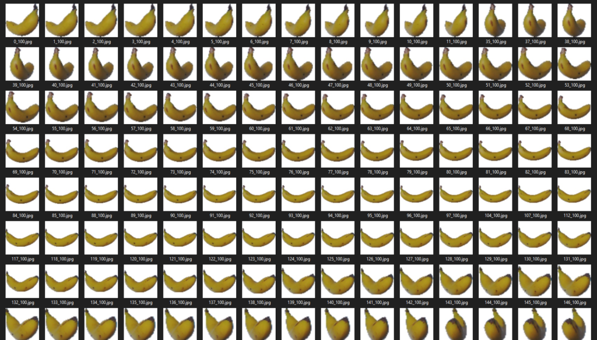
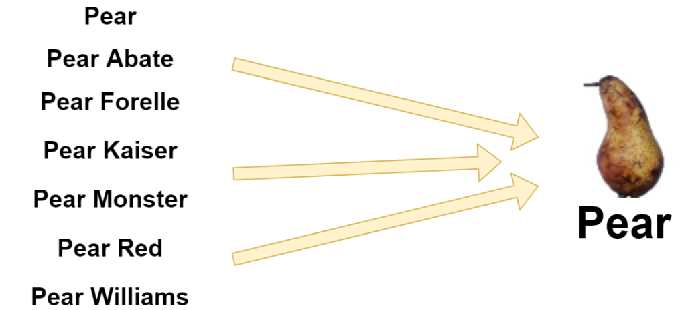
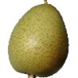
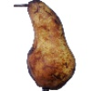
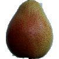
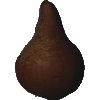
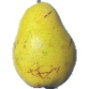
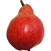

Fruits are very common in today's world - despite the abundance of fast food and refined sugars, fruits remain widely consumed foods. During production of fruits, it might be that they need to be sorted, to give just one example. Traditionally being performed mechanically, today, deep learning based techniques _could_ augment or even take over this process.

In today's blog post, we're going to work towards an example model with which fruits can be classified. Using the Fruits 360 dataset, we'll build a model with Keras that can classify between 10 different types of fruit. Relatively quickly, and with example code, we'll show you how to build such a model - step by step. For this to work, we'll first take a look at deep learning and ConvNet-based classification and fruit classification use cases. Then, we start our work.

Are you ready? Let's go! 😎

* * *

\[toc\]

* * *

## Deep learning: about classification and ConvNets

Before diving into creating some model code, I think that it's nice to take a look at some theory first.

In this case, theory about Convolutional Neural Networks, which are the type of deep learning model that we will be using today.

When humans take a look at images, they automatically slice the images into tiny fractions of recognizable objects - for example, a door is built out of a piece of wood, with often some paint, and a door handle.


* * *

## Fruit classification use cases

Now, besides the educational aspects, why would classifying fruits be a good idea?

Can we think of some use cases as to why we could use Deep Learning for fruit classification?

Here's one, for starters:

https://www.youtube.com/watch?v=h0-NS3z-EXo

I really like what they built! 😀

Now, this immediately suggests a proper use case for fruit classification: separating ripe fruits from the others. Another one: checking whether certain fruits are spoiled, e.g. because fungus is present on the skin. Whereas this process was performed primarily mechanically until now, Deep Learning can also be used.

Let's see if we can create such a model ourselves! :)

* * *

## Today's dataset: Fruits 360

For today's blogpost, we will be using the **Fruits 360 dataset**. The dataset is marketed as follows: "Fruits 360 dataset: A dataset of images containing fruits and vegetables". At least you know what you're getting 😉

It can be [downloaded at Kaggle](https://www.kaggle.com/moltean/fruits) and be used under the - this is somewhat unclear - MIT License or CC-BY-SA 4.0 license. In any case, the original work that generated this dataset can be found back in the references of this blog - check out Muresan & Oltean (2018) if you wish to know more.



Some characteristics of the data:

- **Total number of images:** 82.213 images
- **Training set size:** 61.488 images
- **Test set size:** 20.622 images
- **Train/test split:** approximately 75/25
- **Number of classes:** 120 fruits and vegetables
- **Image size:** 100 x 100 pixels, RGB.

We must also note that different varieties of the same fruit are stored as belonging to different classes. As we'll see later, for today's blog post, there is some merging to do :)

### Visualization code

Should you wish to generate the visualization yourself, here's the code that I used. Some pointers:

- Make sure to have Matplotlib and PIL installed.
- Create a directory, say `imagecopies`, and copy some of the dataset files there.
- Configure the number of `files_per_row` based on the number of files that you've copied (e.g., you cannot set `files_per_row = 3` if you have copied 5 files) - or copy more files.
- Run the code!

```python
# Imports
import os
import matplotlib.pyplot as plt
from PIL import Image
import math

# Configuration
dir_with_examples = './imagecopies'
files_per_row = 3

# List the directory and perform computations
files_in_dir = os.listdir(dir_with_examples)
number_of_cols = files_per_row
number_of_rows = int(len(files_in_dir) / number_of_cols)

# Generate the subplots
fig, axs = plt.subplots(number_of_rows, number_of_cols)
fig.set_size_inches(8, 5, forward=True)

# Map each file to subplot
for i in range(0, len(files_in_dir)):
  file_name = files_in_dir[i]
  image = Image.open(f'{dir_with_examples}/{file_name}')
  row = math.floor(i / files_per_row)
  col = i % files_per_row
  axs[row, col].imshow(image)
  axs[row, col].axis('off')

# Show the plot
plt.show()
```

### Dataset structure

After downloading and unpacking the dataset, we can see two folders that are of interest for today's blog post: the **Train** folder, with all the training data, and the **Test** data, with all the testing data (once again, split in an approximate 75/25 fashion).

Going one level deeper, here's (a part of) the contents of the Train folder:

[](https://www.machinecurve.com/wp-content/uploads/2020/04/image-1.png)

As you can see, the fruits are indeed stored nicely together - on a variety basis. That means that we can see, for instance, 'pear', 'pear abate', 'pear forelle', and so on. Opening up the folder for 'Banana' yields the following:

[](https://www.machinecurve.com/wp-content/uploads/2020/04/image.png)

Many bananas! 🍌

### Preparing our dataset for Deep Learning

Before we continue, there is a trade-off to make: will we **create a model that highly specializes in variety**, or will we create **a generic model that can be capable of recognizing some fruits?**

This is a relatively common question: do we keep at a more general level, or not? In the case where we want to specialize, we likely have to create a deeper model, which is hence more complex, and also more prone to [overfitting](https://www.machinecurve.com/index.php/2019/12/16/what-is-dropout-reduce-overfitting-in-your-neural-networks/). The other scenario might sound great, but it comes with a drawback too: the varieties of different fruit don't always match well. For example, when we want to generalize all pear varieties into one class:



...we would generalize a lot of varieties that look a lot like each other...right? Nope:

- 
    
- 
    
- 
    
- 
    
- 
    
- 
    

Those are all pears!

In today's blog, for the sake of simplicity, we'll skip this question altogether. Instead, we'll do this:

- Besides the _Training_ and _Test_ folders, we create two additional ones: _Training\_smaller_ and _Test\_smaller_.
- From the original _Training_ and _Test_ folders, we copy the fruits we wish to classify for. Hence, we avoid the question by manually selecting a few fruit classes that we wish to distinguish. In my case, I chose a random set of classes - but make sure that they're identical in both folders. In my case, I chose Apricot, Avocado, Banana, Blueberry, Cauliflower, Cocos, Eggplant, Hazelnut, Kiwi and Limes.
- Now, copy those folders into the _Training\_smaller_ and _Test\_smaller_ folders, respectively.

This should be the contents of that particular folder:


* * *

## Building a Keras model for fruit classification

Time to create an actual machine learning model! In today's blog, we're using the **Keras framework** ([keras.io](http://keras.io)) for deep learning. Created by François Chollet, the framework works on top of TensorFlow (2.x as of recently) and provides a much simpler interface to the TF components. In my opinion, it makes creating machine learning models really easy code-wise... but you still need to know what you're doing ML-wise! ;-)

### Model imports

As always, the first thing we do is import our dependencies. As you can see, we'll use the Sequential API, which allows us to stack each neural network layer on top of each other easily. We also import Dense, Flatten and Conv2D - [the default layers in such a network](https://www.machinecurve.com/index.php/2020/03/30/how-to-use-conv2d-with-keras/). Then, we import [sparse categorical crossentropy](https://www.machinecurve.com/index.php/2019/10/06/how-to-use-sparse-categorical-crossentropy-in-keras/) for computing [loss](https://www.machinecurve.com/index.php/2019/10/04/about-loss-and-loss-functions/), [Adam](https://www.machinecurve.com/index.php/2019/11/03/extensions-to-gradient-descent-from-momentum-to-adabound/#adam) for optimization, and an ImageDataGenerator for loading our images from folder.

```python
# Imports
from tensorflow.keras.models import Sequential
from tensorflow.keras.layers import Dense, Flatten, Conv2D
from tensorflow.keras.losses import sparse_categorical_crossentropy
from tensorflow.keras.optimizers import Adam
from tensorflow.keras.preprocessing.image import ImageDataGenerator
```

### Data & model configuration

The next step - not unsurprisingly given what we normally do - is specifying some configuration options. Today, we'll split them between _data related configuration_ and _model configuration_.

The data configuration is simple: we simply set the paths to the training data and the testing data.

The model configuration is a little bit more complex, but not too difficult.

We specify the batch size to be 25 - which means that 25 samples are fed to the model for training [during every forward pass](https://www.machinecurve.com/index.php/2019/10/04/about-loss-and-loss-functions/#the-high-level-supervised-learning-process). The image width is 25x25 pixels, and as we are using RGB images, the number of channels is 3.

25 by 25 pixels? Strange! Didn't you write that our input data is 100 by 100 pixels?

Indeed - and you're a very diligent reader :) However, as you will see later, we're going to resize our samples to 25 by 25 pixels to speed up the training process. Good catch though!

For loss, as said, we'll be using [sparse categorical crossentropy](https://www.machinecurve.com/index.php/2019/10/04/about-loss-and-loss-functions/#sparse-categorical-crossentropy), which can work with integer targets. As the number of classes we're using is 10, we set `no_classes` to 10. The number of epochs (or iterations) is set to 25, which is low - very low - but is okay for education purposes. As we shall see, with 10 classes, we get some very good performance regardless. In normal settings, you would usually have thousands of epochs, though. For optimization, we use the [Adam optimizer](https://www.machinecurve.com/index.php/2019/11/03/extensions-to-gradient-descent-from-momentum-to-adabound/#adam) - which is a good default choice, and extends traditional gradient descent with local parameter updates and momentum-like optimization ([click here for more information](https://www.machinecurve.com/index.php/2019/11/03/extensions-to-gradient-descent-from-momentum-to-adabound/#adam)). Verbosity is set to 1, which means `True`, which means that all the output is displayed on screen. Normally, we set this to False, as prints slightly slow down the training process, but that's not the purpose of today's post - so we keep it on.

```python
# Data configuration
training_set_folder = './fruits-360/Training_smaller'
test_set_folder     = './fruits-360/Test_smaller'

# Model configuration
batch_size = 25
img_width, img_height, img_num_channels = 25, 25, 3
loss_function = sparse_categorical_crossentropy
no_classes = 10
no_epochs = 25
optimizer = Adam()
verbosity = 1
```

### Loading & preparing the data

Next, we load and prepare the data. First, we set the `input_shape` - which is [required for the input layer](https://www.machinecurve.com/index.php/2020/04/05/how-to-find-the-value-for-keras-input_shape-input_dim/). Then, we create a _generator_ - an `ImageDataGenerator`, to be precise.

What is such a generator? For a simple one, [click here](https://www.machinecurve.com/index.php/2020/04/06/using-simple-generators-to-flow-data-from-file-with-keras/), but let's try to explain things in layman's terms here as well.

A generator looks like an iterative function, i.e. some kind of loop, which you can use to 'generate' new samples. Although this might sound weird, it's not - because you can also use such generators to _read existing ones_ \- but for the model, they're like new.

Now, in Keras, `ImageDataGenerators` can be configured substantially - allowing you to specify things like image augmentation, and so on. We don't do this today. The only thing we do is _rescale_ the data, so that the values are closer to a mean of 0 and a variance of 1. This is often recommended, as it helps the training process, with fewer weight swings during optimization.

Next, we _feed data to the data generator_. We do so with `flow_from_directory`, which allows us to load all the data from folder. We specify the folder where our training data is located, specify `save_to_dir` - which saves the intermediate samples to some directory, in `jpeg` format - as well as batch size and `class_mode` (_sparse_ because of our loss funciton). Then, `target_size` is set to `(25, 25)` - that's the resizing I just discussed!

```python
# Determine shape of the data
input_shape = (img_width, img_height, img_num_channels)

# Create a generator
train_datagen = ImageDataGenerator(
  rescale=1./255
)
train_datagen = train_datagen.flow_from_directory(
        training_set_folder,
        save_to_dir='./adapted-images',
        save_format='jpeg',
        batch_size=batch_size,
        target_size=(25, 25),
        class_mode='sparse')
```

### Specifying the model architecture

Now, back to the defaults - a model architecture that is very similar to the one we created in [our blog about Conv2D](https://www.machinecurve.com/index.php/2020/03/30/how-to-use-conv2d-with-keras/).

It's very simple: using the Sequential API, we stack four convolutional layers for feature extraction, subsequently flatten the feature maps into a one-dimensional input for the densely-connected layers, which generate a [multiclass probability distribution with Softmax](https://www.machinecurve.com/index.php/2020/01/08/how-does-the-softmax-activation-function-work/). This distribution, adhering to the laws of probability theory, give us the ultimate class prediction - precisely what we want.

Additionally, we display a [model summary](https://www.machinecurve.com/index.php/2020/04/01/how-to-generate-a-summary-of-your-keras-model/) for visualization purposes.

```python
# Create the model
model = Sequential()
model.add(Conv2D(16, kernel_size=(5, 5), activation='relu', input_shape=input_shape))
model.add(Conv2D(32, kernel_size=(5, 5), activation='relu'))
model.add(Conv2D(64, kernel_size=(5, 5), activation='relu'))
model.add(Conv2D(128, kernel_size=(5, 5), activation='relu'))
model.add(Flatten())
model.add(Dense(16, activation='relu'))
model.add(Dense(no_classes, activation='softmax'))

# Display a model summary
model.summary()
```

### Model compilation & starting the training process

As our final step, we _compile the model_ - which means instantiating it, as we had previously created the skeleton / the framework only - and _fit_ the data (by means of the generator), so that the training process is started. Note that we use the configuration options that we defined previously to configure both the instantiation and the training process.

```python
# Compile the model
model.compile(loss=loss_function,
              optimizer=optimizer,
              metrics=['accuracy'])

# Start training
model.fit(
        train_datagen,
        epochs=no_epochs,
        shuffle=False)
```

### Full model code

It's also possible to obtain the model code as a whole, if you wish to start playing around immediately. Here you go:

```python
# Imports
from tensorflow.keras.models import Sequential
from tensorflow.keras.layers import Dense, Flatten, Conv2D
from tensorflow.keras.losses import sparse_categorical_crossentropy
from tensorflow.keras.optimizers import Adam
from tensorflow.keras.preprocessing.image import ImageDataGenerator

# Data configuration
training_set_folder = './fruits-360/Training_smaller'
test_set_folder     = './fruits-360/Test_smaller'

# Model configuration
batch_size = 25
img_width, img_height, img_num_channels = 25, 25, 3
loss_function = sparse_categorical_crossentropy
no_classes = 10
no_epochs = 25
optimizer = Adam()
validation_split = 0.2
verbosity = 1

# Determine shape of the data
input_shape = (img_width, img_height, img_num_channels)

# Create a generator
train_datagen = ImageDataGenerator(
  rescale=1./255
)
train_datagen = train_datagen.flow_from_directory(
        training_set_folder,
        save_to_dir='./adapted-images',
        save_format='jpeg',
        batch_size=batch_size,
        target_size=(25, 25),
        class_mode='sparse')

# Create the model
model = Sequential()
model.add(Conv2D(16, kernel_size=(5, 5), activation='relu', input_shape=input_shape))
model.add(Conv2D(32, kernel_size=(5, 5), activation='relu'))
model.add(Conv2D(64, kernel_size=(5, 5), activation='relu'))
model.add(Conv2D(128, kernel_size=(5, 5), activation='relu'))
model.add(Flatten())
model.add(Dense(16, activation='relu'))
model.add(Dense(no_classes, activation='softmax'))

# Display a model summary
model.summary()

# Compile the model
model.compile(loss=loss_function,
              optimizer=optimizer,
              metrics=['accuracy'])

# Start training
model.fit(
        train_datagen,
        epochs=no_epochs,
        shuffle=False)
```

* * *

## Running the model: our results

Time to run the model. Save your code somewhere, e.g. as `cnn.py`, and make sure that the _folder references_ in the data configuration are pointed correctly. Also make sure that you have the dependencies installed: at least TensorFlow with version 2.0+. Then, open up a terminal, `cd` to the folder where you stored your file, and run e.g. `python cnn.py`.

The training process should begin:

```
Model: "sequential"
_________________________________________________________________
Layer (type)                 Output Shape              Param #
=================================================================
conv2d (Conv2D)              (None, 21, 21, 16)        1216
_________________________________________________________________
conv2d_1 (Conv2D)            (None, 17, 17, 32)        12832
_________________________________________________________________
conv2d_2 (Conv2D)            (None, 13, 13, 64)        51264
_________________________________________________________________
conv2d_3 (Conv2D)            (None, 9, 9, 128)         204928
_________________________________________________________________
flatten (Flatten)            (None, 10368)             0
_________________________________________________________________
dense (Dense)                (None, 16)                165904
_________________________________________________________________
dense_1 (Dense)              (None, 10)                170
=================================================================
Total params: 436,314
Trainable params: 436,314
Non-trainable params: 0
_________________________________________________________________
Train for 199 steps
Epoch 1/25
2020-04-08 19:25:01.858098: I tensorflow/stream_executor/platform/default/dso_loader.cc:44] Successfully opened dynamic library cublas64_100.dll
2020-04-08 19:25:02.539857: I tensorflow/stream_executor/platform/default/dso_loader.cc:44] Successfully opened dynamic library cudnn64_7.dll
2020-04-08 19:25:04.305871: W tensorflow/stream_executor/cuda/redzone_allocator.cc:312] Internal: Invoking ptxas not supported on Windows
Relying on driver to perform ptx compilation. This message will be only logged once.
199/199 [=======================>
```

...and eventually end with quite some _training_ performance:

```
Epoch 25/25
199/199 [==============================] - 13s 64ms/step - loss: 1.7623e-06 - accuracy: 1.0000
```

The next step you could now take is [check for overfitting](https://www.machinecurve.com/index.php/2019/12/16/what-is-dropout-reduce-overfitting-in-your-neural-networks/), and if it occurs, apply techniques like [Dropout](https://www.machinecurve.com/index.php/2019/12/16/what-is-dropout-reduce-overfitting-in-your-neural-networks/) - or [L2 regularization](https://www.machinecurve.com/index.php/2020/01/23/how-to-use-l1-l2-and-elastic-net-regularization-with-keras/). Perhaps, also ensure that your data set gets bigger, possibly more varied or augmented through the Image Data Generator. But that's for another time! ;-)

* * *

## Summary

In today's blog post, we looked at convolutional neural networks - and how they can be used for Fruit Classification with Deep Learning. We took a look at the Fruits 360 dataset, which is created by the authors of the article referenced below, and is a nice dataset containing a large variety of fruits.

Subsequently, we created an actual example, with the Keras Deep Learning framework. With the example, we trained a model that could attain adequate training performance quickly. Left to do: checking for overfitting, adapting, and making things even better.

Thank you for reading MachineCurve today! 😎 If you have any questions, remarks or comments, please feel free to drop a message in the comments section below 👇. I'll happily answer the questions and help where I can. Happy engineering! 👩‍💻

\[kerasbox\]

* * *

## References

Horea Muresan, [Mihai Oltean](https://mihaioltean.github.io/), [Fruit recognition from images using deep learning](https://www.researchgate.net/publication/321475443_Fruit_recognition_from_images_using_deep_learning), Acta Univ. Sapientiae, Informatica Vol. 10, Issue 1, pp. 26-42, 2018.
