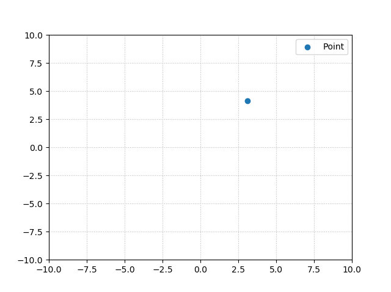
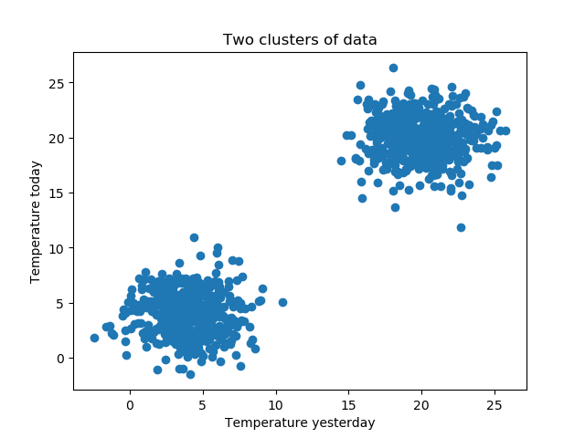
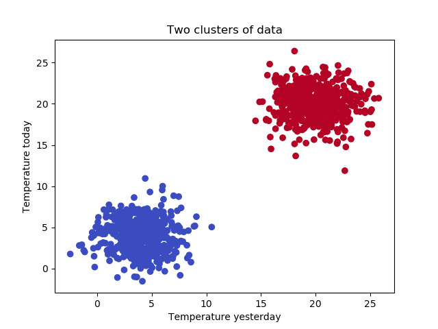

While deep learning algorithms belong to today's fashionable class of machine learning algorithms, there exists more out there. Clustering is one type of machine learning where you do not feed the model a training set, but rather try to derive characteristics from the dataset at run-time in order to structure the dataset in a different way. It's part of the class of unsupervised machine learning algorithms.

**K-means clustering** is such an algorithm, and we will scrutinize it in today's blog post. We'll first take a look at what it is, by studying the steps it takes for generating clusters. We then take a look at the inertia metric, which is used to compute whether the algorithm needs to continue or whether it's done, i.e. whether there is convergence. This is followed by taking a look at convergence itself and in what cases K-means clustering may not be useful.

The theoretical part is followed by a practical implementation by means of a Python script. It provides an example implementation of K-means clustering with [**Scikit-learn**](https://www.machinecurve.com/index.php/how-to-use-scikit-learn-for-machine-learning-with-python-mastering-scikit/), one of the most popular Python libraries for machine learning used today. Altogether, you'll thus learn about the theoretical components of K-means clustering, while having an example explained at the same time.

In this tutorial, you will learn...

- **What K-means clustering is.**
- **How K-means clustering works, including the random and `kmeans++` initialization strategies.**
- **Implementing K-means clustering with Scikit-learn and Python.**

Let's take a look! 🚀

**Update 11/Jan/2021:** added [quick example](https://www.machinecurve.com/index.php/2020/04/16/how-to-perform-k-means-clustering-with-python-in-scikit/#quick-answer-how-to-perform-k-means-clustering-with-python-in-scikit-learn) to performing K-means clustering with Python in Scikit-learn.

**Update 08/Dec/2020:** added references to PCA article.

* * *

\[toc\]

* * *

## Example code: How to perform K-means clustering with Python in Scikit-learn?

Here's a [quick answer](https://www.machinecurve.com/index.php/2020/04/16/how-to-perform-k-means-clustering-with-python-in-scikit/#full-model-code) to performing K-means clustering with Python and Scikit-learn. Make sure to read the full article if you wish to understand what happens in full detail!

```python
import matplotlib.pyplot as plt
import numpy as np
from sklearn.datasets import make_blobs
from sklearn.cluster import KMeans

# Configuration options
num_samples_total = 1000
cluster_centers = [(20,20), (4,4)]
num_classes = len(cluster_centers)

# Generate data
X, targets = make_blobs(n_samples = num_samples_total, centers = cluster_centers, n_features = num_classes, center_box=(0, 1), cluster_std = 2)

np.save('./clusters.npy', X)
X = np.load('./clusters.npy')

# Fit K-means with Scikit
kmeans = KMeans(init='k-means++', n_clusters=num_classes, n_init=10)
kmeans.fit(X)

# Predict the cluster for all the samples
P = kmeans.predict(X)

# Generate scatter plot for training data
colors = list(map(lambda x: '#3b4cc0' if x == 1 else '#b40426', P))
plt.scatter(X[:,0], X[:,1], c=colors, marker="o", picker=True)
plt.title('Two clusters of data')
plt.xlabel('Temperature yesterday')
plt.ylabel('Temperature today')
plt.show()
```

* * *

## What is K-means clustering?

Suppose that we have a dataset \[latex\]X\[/latex\], which contains many n-dimensional vectors \[latex\]\\mathbf{x\_1} \\mathbf{x\_2}, ..., \\mathbf{x\_n}\[/latex\]. Say, \[latex\]n = 2\[/latex\], then \[latex\]\\mathbf{x\_1}\[/latex\] could be \[latex\]\[3.12, 4.14\]\[/latex\]. Mapping this one onto a two-dimensional space, i.e. a plane, gives this:

[](https://www.machinecurve.com/wp-content/uploads/2020/04/point.png)

Say that the vectors that we described abstractly above are structured in a way that they form "blobs", like we merged two datasets of temperature measurements - one with measurements from our thermostat, measuring indoor temperatures of ~20 degrees Celcius, the other with measurements from our fridge, of say ~4 degrees Celcius. The vertical axis shows the temperature of today, whereas the horizontal one displays the temperature at the same time yesterday.

That would likely make the point above a fridge measured temperature. The whole set of measurements would be this:

[](https://www.machinecurve.com/wp-content/uploads/2020/04/clusters_2-1.png)

Now, suppose that we want to understand whether a sample belongs to the "fridge" cluster or the "room temperature" cluster. Visually, we can easily decide whether it's one or the other: there's enough space between the two blobs of data points to accurately assess whether it's been the fridge or the living room.

But what if we want to do this algorithmically?

**K-means clustering** is what can be useful in this scenario. It allows us to reach this result:



For every sample clear whether it's a room temperature one (red) or a fridge temperature one (blue), determined algorithmically!

### Introducing K-means clustering

Now, while this is a very simple example, K-means clustering can be applied to problems that are way more difficult, i.e. problems where you have multiple clusters, and even where you have multidimensional data (more about that later). Let's first take a look at what K-means clustering is.

For this, we turn to our good old friend Wikipedia - and cherry pick the most important aspects of a relatively abstract definition:

> k-means clustering is a method (...) that aims to partition n observations into k clusters in which each observation belongs to the cluster with the nearest mean (cluster centers or cluster centroid), serving as a prototype of the cluster.
>
> Wikipedia (2020)

Let's break that one apart into pieces that we can understand atomically:

- You have a dataset with some length \[latex\]n\[/latex\].
- The goal is clustering, which means that you want to create "groups" of data, like in the scenario above.
- You have control over the number of groups (clusters) that is created: it'll be \[latex\]k\[/latex\] clusters, configured upfront. As you can imagine, \[latex\] k \\leq n\[/latex\].
- Now the abstract part: each sample in your dataset is assigned to the cluster where the distance to the "mean" of that cluster is lowest. With mean, we literally mean the "center point" of the particular cluster. This way, the sample is assigned to the most likely "group" of data points.

Let's take a look at how the algorithm works.

### The K-means clustering algorithm

For this, we turn to the Scikit-learn website, which explains [it nicely in plain English](https://scikit-learn.org/stable/modules/clustering.html#k-means):

1. **Initialization**: directly after starting it, the initial centroids (cluster centers) are chosen. Scikit-learn supports two ways for doing this: firstly, `random`, which selects \[latex\]k\[/latex\] samples from the dataset at random. Secondly, `k-means++`, which [optimizes this process](https://en.wikipedia.org/wiki/K-means%2B%2B).
2. **Centroid assignment:** each sample in the dataset is assigned to the nearest centroid.
3. **Centroid correction:** new centroids are created by computing new means for the assignments created in step 2.
4. **Difference comparison:** for each centroid, the difference between old and new is compared, and the algorithm stops when the difference is lower than a threshold called `inertia`, or `tolerance`. Otherwise, it moves back to step 2.

A very simple and elegant but powerful algorithm indeed!

https://www.youtube.com/watch?v=IJt62uaZR-M

### Inertia / Within-cluster sum-of-squares criterion

While we expressed the algorithm above in very plain ways, we can also express things a bit more mathematically. For example, we can take a look at K-means clustering as an algorithm which attempts to minimize the **inertia** or the **within-cluster sum-of-squares criterion** (Scikit-learn, n.d.). It does so by picking centroids - thus, centroids that minimize this value.

How's this value determined? Well, as follows (Scikit-learn, n.d.):

\[latex\]\\sum\_{i=0}^{n}\\min\_{\\mu\_j \\in C}(||x\_i - \\mu\_j||^2)\[/latex\]

Let's break down the formula.

The first part, the **sigma sign**, essentially tells you that the value is a _sum_ of something for all \[latex\]n\[/latex\] samples in your dataset. Nothing special for now. But what is this something?

A minimum. To be more precise, a minimum of the **squares** of the difference between **each sample** and the **mean** of a particular cluster.

When this value is minimized, the clusters are said to be internally coherent (Scikit-learn, n.d.) and movement in the "centroid correction" step will be low. If it's zero, it has converged to an optimum. In Scikit, we specify a certain threshold value which, if the inertia is lower, considers the algorithm to have converged. This speeds up the fitting process.

### On convergence of K-means clustering

Given enough time, K-means clustering will always converge to an optimum (Scikit-learn, n.d.). However, this does not necessarily have to be the global optimum - it can be a local one as well. According to Scikit-learn (n.d.), this is entirely dependent on the initialization of the centroids; that is, whether we're using a `random` initialization strategy or `k-means++`.

In the random case, it's obvious that the initialization may produce _very good_ results sometimes, _mediocre_ to _good_ results often and _very poor_ results sometimes. That's the thing with flipping a coin as to whether to include a sample, well, figuratively then ;-)

The `k-means++` strategy works a bit differently. Let's take a look at the random strategy again in order to explain why it often works better. In the random strategy, nobody can ensure that the selected samples are _far away from each other_. Although the odds are small, they might be _all very close to each other_. In that case, convergence will become a very difficult and time-consuming job (Scikit-learn, n.d.). We obviously don't want that.

K-means++ ensures that the centroids to be "\[generally\] distant from each other" (Scikit-learn, n.d.). As you can imagine, this proves to be a substantial improvement with respect to convergence and especially the speed of it (Scikit-learn, n.d.).

### The drawbacks of K-means clustering - when is it a bad choice?

If you look at [this page](https://scikit-learn.org/stable/auto_examples/cluster/plot_kmeans_assumptions.html), you'll see that K-means clustering does not always work. Specifically, things won't work out well in those cases (Scikit-learn, n.d.):

- **When your dataset has more blobs of data than the number of blobs you configure**. For obvious reasons, K-means clustering will then fail. The fact that the user must configure the number of clusters is one possible point of failure as well. Always look closely at your dataset before you apply K-means, is the advice!
- **When you don't have isotropic blobs**. Fancy words, I know, but isotropic means something like "nicely shaped" - i.e., equally wide and equally high. If they're not (and you will see this when you click the link above), K-means will detect halves of clusters, merging them together.
- **If clusters aren't convex**, or truly separable. In those cases, the algorithm might get confused, as you can see with the link above as well.
- Finally, **if your dimensionality is too high**. In the scenario above, we have a dimensionality of 2, but the more dimensions you add, the more time it will take for clustering to complete. This is due to the nature of the [euclidian distance](https://www.machinecurve.com/index.php/2019/11/03/extensions-to-gradient-descent-from-momentum-to-adabound/#adamax) that is computed for inertia. Hence, you'll have to apply dimensionality reduction first - with techniques like [Principal Components Analysis (PCA)](https://www.machinecurve.com/index.php/2020/12/07/introducing-pca-with-python-and-scikit-learn-for-machine-learning/), for example.

Think about applying K-means well before naïvely making the choice to "just" make it work. It might simply not work!

* * *

## Implementing K-means clustering with Python and Scikit-learn

Now that we have covered much theory with regards to K-means clustering, I think it's time to give some example code written in Python. For this purpose, we're using the `scikit-learn` library, which is one of the most widely known libraries for applying machine learning models. Specifically, it's widely used for applying the relatively _traditional_ types of machine learning, i.e. the non-deep learning models.

Let's open up your Finder / Explorer. Create a file called `scikit-blobs.py`. Open this file in your code editor and ensure that the following dependencies are installed on your system:

- Scikit-learn
- Matplotlib
- Numpy

If they are, great! Let's continue :D

### Generating convex and isotropic clusters

The first thing we do before we can apply K-means clustering with Scikit-learn is generating those **convex and isotropic clusters**. In plainer English, those are clusters which are separable and equally wide and high. Without English and with a visualization, I mean this:


Ah, so that's what you meant is what you'll likely think now 😂 Oops :)

For this to work, we'll first have to state our imports:

```python
import matplotlib.pyplot as plt
import numpy as np
from sklearn.datasets import make_blobs
from sklearn.cluster import KMeans
```

Those are _all_ the imports for today, not just those for generating the blobs (which would be the `make_blobs` import). What's more, we also import `KMeans` from Scikit-learn, `numpy` for number processing and the `PyPlot` library from `matplotlib` for visualizing the clusters (i.e. generating that visualization above).

Now that we have specified our imports, it's time to set a few configuration options:

```python
# Configuration options
num_samples_total = 1000
cluster_centers = [(20,20), (4,4)]
num_classes = len(cluster_centers)
```

Those are really simple:

- We'll be generating 1000 samples in total.
- They will be spread over 2 clusters, the first of which is located at approximately \[latex\](x, y) = (20, 20)\[/latex\], the other at \[latex\](4, 4)\[/latex\].
- The `num_classes` i.e. the number of clusters is, pretty obviously, the `len(cluster_centers)` - i.e. 2.

We then generate the data:

```python
# Generate data
X, targets = make_blobs(n_samples = num_samples_total, centers = cluster_centers, n_features = num_classes, center_box=(0, 1), cluster_std = 2)
```

Generating the data simply equates calling the `make_blobs` definition from Scikit-learn, which does all the hard work. We specify the centers and number of samples that we configured before, as well as the number of features. We set a standard deviation of 2 - which means that the samples we generate at those two locations are distributed around the centers with a high likelihood of a deviation of \[latex\]\\pm 2\[/latex\].

Should you wish to save the data so that you can reuse the _exact_ positions later (e.g. in the cases where you want to generate different visualizations), you might add this code - which simply saves the data and reloads it immediately, for you to apply accordingly. It's not necessary though.

```python
np.save('./clusters.npy', X)
X = np.load('./clusters.npy')
```

### Applying the K-means clustering algorithm

Time for applying K-means clustering!

First, we instantiate the algorithm:

```python
# Fit K-means with Scikit
kmeans = KMeans(init='k-means++', n_clusters=num_classes, n_init=10)
kmeans.fit(X)
```

Here, we choose an initialization strategy (which is either `random` or `k-means++`, of which the latter will likely save us computation time so we choose it), the number of clusters, and `n_init`, which does this:

> Number of time the k-means algorithm will be run with different centroid seeds. The final results will be the best output of n\_init consecutive runs in terms of inertia.
>
> [Sklearn.cluster.KMeans (n.d.)](https://scikit-learn.org/stable/modules/generated/sklearn.cluster.KMeans.html)

Once we did this, it's time to actually _fit the data_ and generate the cluster predictions:

```python
# Predict the cluster for all the samples
P = kmeans.predict(X)
```

That's it already - K-means clustering is complete! If you wish to generate that visualization with the two classes colored differently, you might also want to add this:

```python
# Generate scatter plot for training data
colors = list(map(lambda x: '#3b4cc0' if x == 1 else '#b40426', P))
plt.scatter(X[:,0], X[:,1], c=colors, marker="o", picker=True)
plt.title('Two clusters of data')
plt.xlabel('Temperature yesterday')
plt.ylabel('Temperature today')
plt.show()
```

### Full model code

Should you wish to obtain the full model code at once immediately - that's possible too, of course. Here you go:

```python
import matplotlib.pyplot as plt
import numpy as np
from sklearn.datasets import make_blobs
from sklearn.cluster import KMeans

# Configuration options
num_samples_total = 1000
cluster_centers = [(20,20), (4,4)]
num_classes = len(cluster_centers)

# Generate data
X, targets = make_blobs(n_samples = num_samples_total, centers = cluster_centers, n_features = num_classes, center_box=(0, 1), cluster_std = 2)

np.save('./clusters.npy', X)
X = np.load('./clusters.npy')

# Fit K-means with Scikit
kmeans = KMeans(init='k-means++', n_clusters=num_classes, n_init=10)
kmeans.fit(X)

# Predict the cluster for all the samples
P = kmeans.predict(X)

# Generate scatter plot for training data
colors = list(map(lambda x: '#3b4cc0' if x == 1 else '#b40426', P))
plt.scatter(X[:,0], X[:,1], c=colors, marker="o", picker=True)
plt.title('Two clusters of data')
plt.xlabel('Temperature yesterday')
plt.ylabel('Temperature today')
plt.show()
```

### Results

The results are pretty clear, aren't they:

[](https://www.machinecurve.com/wp-content/uploads/2020/04/clustered.png)

Pretty much immediately (given the small number of samples and the fact that the blobs are highly separable), we have performed K-means clustering for the first time!

* * *

## Summary

In this blog post, we looked at K-means clustering with Python and Scikit-learn. More specifically, we looked at a couple of questions:

- What precisely is K-means clustering?
- How does K-means clustering work?
- What is inertia with K-means clustering?
- What are the drawbacks of using K-means clustering; i.e., when is it not smart to use it?
- How to implement K-means clustering with Python and Scikit-learn? Can you give an example?

I hope you've learnt something today! :D If you did, feel free to leave a comment in the comments section below 👇 Thank you for reading MachineCurve today and happy engineering! 😊

* * *

## References

Wikipedia. (2020, April 13). _K-means clustering_. Wikipedia, the free encyclopedia. Retrieved April 14, 2020, from [https://en.wikipedia.org/wiki/K-means\_clustering](https://en.wikipedia.org/wiki/K-means_clustering)

Scikit-learn. (n.d.). _2.3. Clustering — scikit-learn 0.22.2 documentation_. scikit-learn: machine learning in Python — scikit-learn 0.16.1 documentation. Retrieved April 14, 2020, from [https://scikit-learn.org/stable/modules/](https://scikit-learn.org/stable/modules/clustering.html#k-means)[c](https://scikit-learn.org/stable/modules/clustering.html#k-means)[lustering.html#k-means](https://scikit-learn.org/stable/modules/clustering.html#k-means)

Wikipedia. (2020, April 12). _K-means++_. Wikipedia, the free encyclopedia. Retrieved April 14, 2020, from [https://en.wikipedia.org/wiki/K-means%2B%2B](https://en.wikipedia.org/wiki/K-means%2B%2B)

_Sklearn.cluster.KMeans — scikit-learn 0.22.2 documentation_. (n.d.). scikit-learn: machine learning in Python — scikit-learn 0.16.1 documentation. Retrieved April 16, 2020, from [https://scikit-learn.org/stable/modules/generated/sklearn.cluster.KMeans.html](https://scikit-learn.org/stable/modules/generated/sklearn.cluster.KMeans.html)
