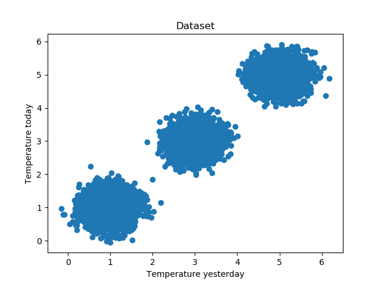
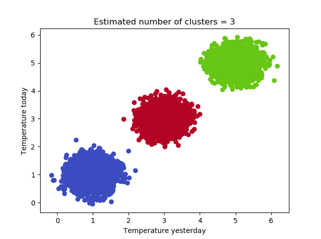

Suppose that you have a dataset in which you want to discover groups, or clusters, that share certain characteristics. There are various unsupervised machine learning techniques that can be used to do this. As we've seen in other blogs, [K-means clustering](https://www.machinecurve.com/index.php/2020/04/16/how-to-perform-k-means-clustering-with-python-in-scikit/) and [Affinity Propagation](https://www.machinecurve.com/index.php/2020/04/18/how-to-perform-affinity-propagation-with-python-in-scikit/) can be used if you have good data or small data, respectively.

But in both cases, _the clusters need to be separated_. Or you may need to configure the number of clusters in advance. Now, your machine learning problem may be such that none of those two criteria are met. What to do?

Enter **Mean Shift** clustering, a clustering approach for discovering "blobs in a smooth density of samples" (Scikit-learn, n.d.). That is, precisely what you want - discovering clusters if your data is not separated without configuring the number of clusters.

In today's blog post, we will explore Mean Shift in more detail. First, we'll take a look at Mean Shift clustering. What is it? How does it work intuitively? And when does it work well, and when shouldn't you use Mean Shift? Those are the theoretical questions that we will be looking at.

Then, we will move towards practice - and provide an implementation of Mean Shift clustering with Python and the Scikit-learn framework for machine learning. We explain our code step by step, which ensures that you can implement the model at your own pace.

Are you ready? Let's go! :)

* * *

\[toc\]

* * *

## What is Mean Shift clustering?

Here we are again - a scenario where we have blobs of data. In this case, we have three clusters:

[](https://www.machinecurve.com/wp-content/uploads/2020/04/clusters.png)

If you look closely at those clusters, you'll see for every cluster that the number of points is highest around the centers of the cluster.

We can also rephrase this into the observation that the **density** of points of a cluster is highest near its center, or centroid.

Generalizing this statement, for any cluster, we can thus find the likely center by looking at the density of points at a particular spot in the diagram above. Hence, we can also find the _number_ of clusters, and estimate the approximate centers of those clusters that we identified.

This is what the Mean Shift algorithm for clustering does. It looks at the "mode" of the density, and where it is highest, and will iteratively shift points in the plot towards the closest mode - resulting in a number of clusters, and the ability to assign a sample to a cluster, after fitting is complete (ML | mean-shift clustering, 2019).

This way, even when your clusters aren't perfectly separated, Mean Shift will likely be able to detect them anyway (Scikit-learn, n.d.).

When your dataset is relatively small, Mean Shift works quite well (Scikit-learn, n.d.). This changes when you have a large one - because the algorithm is quite expensive, to say the least. It would be wise to use Mean Shift for small to medium-sized datasets only.

* * *

## Implementing Mean Shift clustering with Python and Scikit-learn

Let's now take a look at how to implement Mean Shift clustering with Python. We'll be using the Scikit-learn framework, which is one of the popular machine learning frameworks used today. We'll be trying to successfully cluster those three clusters:


Yep, those are the clusters that we just showed you, indeed :)

Now, open up a code editor, create a Python file (e.g. `meanshift.py`), so that we can start. The first thing we do is add the imports for today's code:

```python
import matplotlib.pyplot as plt
import numpy as np
from sklearn.datasets import make_blobs
from sklearn.cluster import MeanShift, estimate_bandwidth
```

We'll use Matplotlib for generating visualizations, Numpy for some number processing and Scikit-learn functionality for generating the dataset (i.e., the unclustered blobs of data) and the actual clustering operation.

Once we defined the imports, we can set the configuration options:

```python
# Configuration options
num_samples_total = 10000
cluster_centers = [(5,5), (3,3), (1,1)]
num_classes = len(cluster_centers)
```

We'll be generating 10000 samples in total, across 3 clusters.

Then, it's time to generate the data:

```python
# Generate data
X, targets = make_blobs(n_samples = num_samples_total, centers = cluster_centers, n_features = num_classes, center_box=(0, 1), cluster_std = 0.30)
```

With `make_blobs`, we can let Scikit-learn make the blobs we want. We set the configuration that we just defined, and set a cluster standard deviation of 0.30. This can be pretty much anything, and I'd recommend that you play around a bit before you start the actual clustering.

For reproducibility, though, you might wish to save the dataset you generated. That's why we use Numpy in today's code, for saving the data - and reloading it back into run-time immediately:

```python
np.save('./clusters.npy', X)
X = np.load('./clusters.npy'
```

This code is not strictly necessary, but by simply running it once - you can uncomment the `save` and `make_blobs` operations and load the same dataset again.

Next, we'll come to Mean Shift specific functionality. First, we define what is known as the "bandwidth" of the algorithm - as you can see here:

```python
# Estimate bandwith
bandwidth = estimate_bandwidth(X, quantile=0.2, n_samples=500)
```

As discussed, Mean Shift "looks around" and determines the direction where a sample must move to - i.e. where the cluster centroid likely is. However, it would be too expensive computationally to do so for _all_ the samples - because then the algorithm would get stuck, put simply.

That's why the "bandwidth" helps - it simply defines an area around the samples where Mean Shift should look in order to determine the most probable path given density estimation. But what should this bandwidth value be? That's where `estimate_bandwidth` comes in, and it estimates the most suitable bandwidth based on your dataset.

We immediately use the bandwidth in the instantiation of the Mean Shift algorithm, after which we fit the data and generate some consequential data, such as the number of labels:

```python
# Fit Mean Shift with Scikit
meanshift = MeanShift(bandwidth=bandwidth)
meanshift.fit(X)
labels = meanshift.labels_
labels_unique = np.unique(labels)
n_clusters_ = len(labels_unique)
```

Then, we generate predictions for all the samples in our dataset:

```python
# Predict the cluster for all the samples
P = meanshift.predict(X)
```

And finally, we generate a visualization to see whether our clustering operation is successful:

```python
# Generate scatter plot for training data
colors = list(map(lambda x: '#3b4cc0' if x == 1 else '#b40426' if x == 2 else '#67c614', P))
plt.scatter(X[:,0], X[:,1], c=colors, marker="o", picker=True)
plt.title(f'Estimated number of clusters = {n_clusters_}')
plt.xlabel('Temperature yesterday')
plt.ylabel('Temperature today')
plt.show()
```

Now, let's run it! Open up a terminal where Scikit-learn, Numpy and Matplotlib are accessible, and execute the Python file - i.e. `python meanshift.py`. After some time, you should find a result that looks like this:



Mission complete! 🚀

### Full model code

Should you wish to obtain the full model code at once, that is also possible. Here you go:

```python
import matplotlib.pyplot as plt
import numpy as np
from sklearn.datasets import make_blobs
from sklearn.cluster import MeanShift, estimate_bandwidth

# Configuration options
num_samples_total = 10000
cluster_centers = [(5,5), (3,3), (1,1)]
num_classes = len(cluster_centers)

# Generate data
X, targets = make_blobs(n_samples = num_samples_total, centers = cluster_centers, n_features = num_classes, center_box=(0, 1), cluster_std = 0.30)

np.save('./clusters.npy', X)
X = np.load('./clusters.npy')

# Estimate bandwith
bandwidth = estimate_bandwidth(X, quantile=0.2, n_samples=500)

# Fit Mean Shift with Scikit
meanshift = MeanShift(bandwidth=bandwidth)
meanshift.fit(X)
labels = meanshift.labels_
labels_unique = np.unique(labels)
n_clusters_ = len(labels_unique)

# Predict the cluster for all the samples
P = meanshift.predict(X)

# Generate scatter plot for training data
colors = list(map(lambda x: '#3b4cc0' if x == 1 else '#b40426' if x == 2 else '#67c614', P))
plt.scatter(X[:,0], X[:,1], c=colors, marker="o", picker=True)
plt.title(f'Estimated number of clusters = {n_clusters_}')
plt.xlabel('Temperature yesterday')
plt.ylabel('Temperature today')
plt.show()
```

* * *

## Summary

In today's blog post, we looked at the Mean Shift algorithm for clustering. Based on an example, we looked at how it works intuitively - and subsequently presented a step-by-step explanation of how to implement Mean Shift with Python and Scikit-learn.

I hope you've learnt something from today's post! If you did, feel free to leave a comment in the comments section below 👇 Please feel free to do the same if you have any questions or remarks - I'll happily answer them. Thank you for reading MachineCurve today and happy engineering! 😎

* * *

## References

Scikit-learn. (n.d.). _2.3. Clustering — scikit-learn 0.22.2 documentation_. scikit-learn: machine learning in Python — scikit-learn 0.16.1 documentation. Retrieved April 18, 2020, from [https://scikit-learn.org/stable/modules/clustering.html#affinity-propagation](https://scikit-learn.org/stable/modules/clustering.html#affinity-propagation)

_ML | mean-shift clustering_. (2019, May 16). GeeksforGeeks. [https://www.geeksforgeeks.org/ml-mean-shift-clustering/](https://www.geeksforgeeks.org/ml-mean-shift-clustering/)
