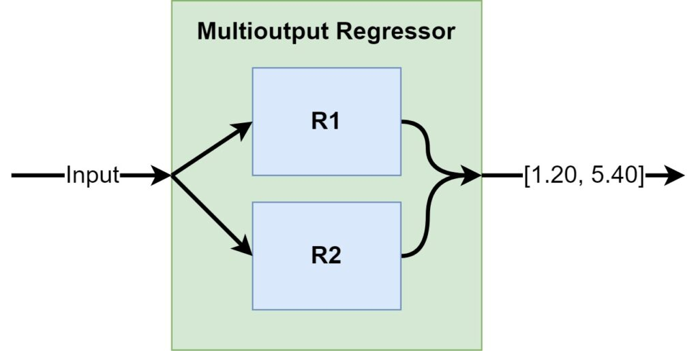

Support Vector Machines can be used for performing regression tasks - we know that [from another article](https://www.machinecurve.com/index.php/2019/09/20/intuitively-understanding-svm-and-svr/). But did you know that it is also possible to use them for creating _multioutput_ regression models - that is, training it for regressing two values at the same time? Precisely that is what we will cover in today's article: we're going to build a **multioutput regression** model using Support Vector Machines with Python and Scikit-learn.

The article is structured as follows. Firstly, we'll take a look at _regression_ with Support Vector Machines. I can understand that this sounds a bit counterintuitive, as SVMs are traditionally used for [classification tasks](https://www.machinecurve.com/index.php/2020/10/19/3-variants-of-classification-problems-in-machine-learning/). But indeed, they can be used for regression as well! Secondly, we'll cover Multioutput Regression - and how it works conceptually. This is followed by building an actual multioutput regression SVM ourselves. For this, we'll be using Scikit-learn, a Python-based machine learning library.

Let's go!

* * *

\[toc\]

* * *

## Regression with Support Vector Machines: how it works

If you have some experience with building Machine Learning models, you know that [Support Vector Machines](https://www.machinecurve.com/index.php/2019/09/20/intuitively-understanding-svm-and-svr/) can be used for a wide range of classification tasks. Indeed, it is possible to use them in many ways for creating an automated system which assigns inputs to two or more classes, or even multiple classes to an input sample.

- [Creating One-vs-Rest and One-vs-One SVM Classifiers with Scikit-learn](https://www.machinecurve.com/index.php/2020/11/11/creating-one-vs-rest-and-one-vs-one-svm-classifiers-with-scikit-learn/)
- [Using Error-Correcting Output Codes with Scikit-learn for multiclass SVM classification](https://www.machinecurve.com/index.php/2020/11/12/using-error-correcting-output-codes-for-multiclass-svm-classification/)
- [How to create a Multilabel SVM classifier with Scikit-learn](https://www.machinecurve.com/index.php/2020/11/12/how-to-create-a-multilabel-svm-classifier-with-scikit-learn/)

It is perhaps less known that Support Vector Machines can be used for regression tasks as well. In this section, we will discuss why this is possible.

### SVMs are maximum-margin models

Before we can understand why SVMs are usable for regression, it's best if we take a look at how they can be used for classification tasks. From the articles linked above, we know that Support Vector Machines are **maximum-margin models** when they are applied to classification problems: when learning a decision boundary, they attempt to generate a boundary such that it maximizes its distance to class 0, but also its distance to class 1. This property is called _equidistance_ and ensures that we have the best possible decision boundary for our dataset.

If you look closely at the decision boundaries plotted in the figure below, we can see that \[latex\]H\_1\[/latex\] is no decision boundary it all (it is not capable of separating class 0 and class 1), \[latex\]H\_2\[/latex\] works but is a bit short in relation to class 0, while \[latex\]H\_3\[/latex\] maximizes the distance between the two classes.


Hyperplanes and data points. The [image](https://en.wikipedia.org/wiki/Support-vector_machine#/media/File:Svm_separating_hyperplanes_(SVG).svg)is not edited. Author: [Zack Weinberg](https://commons.wikimedia.org/w/index.php?title=User:ZackWeinberg&action=edit&redlink=1), derived from [Cyc’s](https://commons.wikimedia.org/w/index.php?title=User:Cyc&action=edit&redlink=1) work. License: [CC BY-SA 3.0](https://creativecommons.org/licenses/by-sa/3.0/legalcode)

We also see some lines between samples and the decision boundaries, which are also called _hyperplanes_ (because they are `N-1` dimensional, i.e., in our two-dimensional plane plotted above, the boundary is a one-dimensional line). Those lines indicate that those samples were used to construct a particular boundary. As they essentially _support_ the construction of the boundary, they are called _support vectors_ - and hence we can guess why SVMs are called that way.

The goal of finding a maximum-margin boundary is to find a set of support vectors for each class where the distance between support vectors for each class to the decision boundary is equal - while also ensuring that a minimum amount of samples is classified incorrectly.

And by consequence, we can use them to build [a classifier](https://www.machinecurve.com/index.php/2020/10/19/3-variants-of-classification-problems-in-machine-learning/). If you want to move from the linear case towards nonlinear data, I suggest you take a look at [this article](https://www.machinecurve.com/index.php/2019/09/20/intuitively-understanding-svm-and-svr/) which covers kernel functions, but for now, we'll move forward to using SVMs for regression.

### Using Support Vectors to perform regression

Because indeed, SVMs can also be used to perform regression tasks. We know that the decision boundary that was learned in the figure above can be used to separate between the two classes. We call this a _discrete_ problem - there are two possible outcomes: class 0 for everything above the line, and class 1 for everything below the line. Classification problems are good exampls of discrete Machine Learning problems.

Regression, however, is a continuous problem: one input value is mapped to a real numbered output, a number, and hence there is no such thing as "above the line" or "below the line" for an outcome. Rather, we must use the boundary _itself_ in order to generate the outcome. If we wanted to find a perfect boundary for our continuous data, however, the problem would exponentially grow because a _precise, maximum-margin fit_ is really difficult in those cases.

This puts extra emphasis on the correctness _and_ time-complexity of the boundary, but it is possible to use Support Vector Machines to perform what is known as **Support Vector Regression** (SVR). A penalty-free area is captured around the maximum-margin decision boundary, called the _error tube_, where errors are accepted; this is a consequence of the fact that it must learn to compute continuous outputs. The goal of SVR is to find a tube that is as small as possible, without compromising much in model complexity and training time.

Imagine that all the samples in the figure above don't belong to a particular class - but they just are what they are, samples, and they represent some \[latex\]x \\rightarrow y\[/latex\] mapping from one continuous input to a continuous output value. Obviously, when performing a regression task, you want the regressed function to be somewhere in the middle of the samples. This makes Support Vector Machines a good fit for (linear, and if not linear using some kernel function with the kernel trick) regression problems: using support vectors near the middle of your dataset, it will regress a function that maps those inputs to outputs.

### Epsilon-SVR and nu-SVR

There are in fact two types of Support Vector Regression: epsilon-based SVR (\[latex\]\\epsilon\[/latex\]-SVR) and nu-SVR (\[latex\]\\nu\[/latex\]-SVR). They differ by means of the control that they offer you over the regression problem (StackExchange, n.d.):

- When using **nu-SVR**, you have control over the _total number of support vectors used_ but not necessarily over the error that is acceptable (often yielding smaller but possibly worse models).
- When using **epsilon-SVR**, you have control over the _error_ _that is acceptable_ but not necessarily over the number of support vectors used (often yielding better but large models).

> Depending of what I want, I choose between the two. If I am really desperate for a small solution (fewer support vectors) I choose \[latex\]\\nu\[/latex\]-SVR and **hope** to obtain a decent model. But if I really want to control the amount of error in my model and go for the best performance, I choose \[latex\]\\epsilon\[/latex\]-SVR and **hope** that the model is not too complex (lots of support vectors).
>
> StackExchange, n.d.

* * *

## How does Multioutput Regression work?

We can even generalize our single-output SVR model into a **multioutput regression** model. Constructing one is actually pretty simple:

- Multiple regressors are trained for the problem, covered in a _multioutput regressor_ wrapper.
- This wrapper takes input and distributes it to the single-output regressors that are embedded in it.
- Predictions generated by the single-output regressors are combined and served as a multi-output regression.

Pretty simple, isn't it?



* * *

## Building a Multioutput Regression SVM with Scikit-learn

Now that we understand how SVMs can be used for regression tasks, and how we can generalize a single-output SVR into a multi-output one, we can take a look at how to create one with Scikit-learn.

Open up your code editor, create a file (e.g. `mor.py`), and let's code! :)

### Imports

The first thing we always do (simply because it's necessary) is import all the dependencies into our Python script. Today, we will be using Scikit-learn, so the assumption is that you have it installed onto your system (and into your specific Python environment, if you use them).

If you don't have it, you can easily install it, e.g. with `pip install scikit-learn`.

We next import the dependencies - note that they are available as `sklearn` rather than `scikit-learn`.

- We import `make_regression` from `sklearn.datasets` because it will help us create the dataset for today's regression problem (recall that up to now, we have no dataset :) )
- From `sklearn.multioutput` we import `MultiOutputRegressor` - it's the wrapper we discussed in the previous section.
- As we will convert an SVR model into a multioutput regressor, we must import `SVR` from `sklearn.svm`.
- After generating the dataset with `make_regression`, we must split it into [train/test sets](https://www.machinecurve.com/index.php/2020/11/16/how-to-easily-create-a-train-test-split-for-your-machine-learning-model/). We can do so using `sklearn.model_selection`'s `train_test_split`.
- Finally, we import `mean_squared_error` and `mean_absolute_error` from `sklearn.metrics` for evaluating our model. Those are default [error functions for regression problems](https://www.machinecurve.com/index.php/2019/10/04/about-loss-and-loss-functions/#loss-functions-for-regression).

```python
from sklearn.datasets import make_regression
from sklearn.multioutput import MultiOutputRegressor
from sklearn.svm import SVR
from sklearn.model_selection import train_test_split
from sklearn.metrics import mean_squared_error, mean_absolute_error
```

### Generating and processing the dataset

After the imports, it's time to make a dataset:

- We will use `make_regression`, which generates a regression problem for us.
- We create 25.000 samples (i.e. input-target pairs) by setting `n_samples` to 25000.
- Each input part of the input-target-pairs has 3 features, or columns; we therefore set `n_features` to 3.
- The output part of the input-target-pairs has 2 targets, or values to be regressed; we therefore set `n_targets` to 2. Note that our multioutput regressor will therefore be a two-output regressor.
- Using `random_state`, we seed our regression problem by using the same random number initialization.

```python

# Generate dataset
X, y = make_regression(n_samples=25000, n_features=3, n_targets=2, random_state=33)
```

After generating the dataset, we must process it by [splitting it into a training and testing dataset](https://www.machinecurve.com/index.php/2020/11/16/how-to-easily-create-a-train-test-split-for-your-machine-learning-model/):

```python

# Train/test split
X_train, X_test, y_train, y_test = train_test_split(X, y, test_size=0.20, random_state=33)
```

### Building the SVR single-output regressor

We can then move forward and construct the SVR regressor:

- Here, we set the value for \[latex\]\\epsilon\[/latex\] (epsilon) to `0.2`. It specifies the width of the 'error tube' where no penalty is assigned to mispredictions, effectively allowing us to take values close to the edges of the error tube as support vectors.
- If we want to apply regularization, we can also apply values for `C` - more information [here](https://scikit-learn.org/stable/modules/generated/sklearn.svm.SVR.html).

```python
# Create the SVR regressor
svr = SVR(epsilon=0.2)
```

### Wrapping the SVR into a MultiOutputRegressor

We can then easily wrap the SVR into our imported `MultiOutputRegressor`:

```python
# Create the Multioutput Regressor
mor = MultiOutputRegressor(svr)
```

### Fitting and evaluating the regressor

Finally, we can fit the training data (`X_train`) and `y_train`) to our `MultiOutputRegressor`. This starts the training process. Once fitting the data is complete, we can generate `y_pred` prediction values for our testing inputs `X_test`. Using the [mean squared error and mean absolute error](https://www.machinecurve.com/index.php/2019/10/04/about-loss-and-loss-functions/#loss-functions-for-regression), we can then evaluate model performance:

```python
# Train the regressor
mor = mor.fit(X_train, y_train)

# Generate predictions for testing data
y_pred = mor.predict(X_test)

# Evaluate the regressor
mse_one = mean_squared_error(y_test[:,0], y_pred[:,0])
mse_two = mean_squared_error(y_test[:,1], y_pred[:,1])
print(f'MSE for first regressor: {mse_one} - second regressor: {mse_two}')
mae_one = mean_absolute_error(y_test[:,0], y_pred[:,0])
mae_two = mean_absolute_error(y_test[:,1], y_pred[:,1])
print(f'MAE for first regressor: {mae_one} - second regressor: {mae_two}')
```

### Full model code

Should you wish to obtain the full code just at once, that's of course also possible. In that case, here you go :)

```python
from sklearn.datasets import make_regression
from sklearn.multioutput import MultiOutputRegressor
from sklearn.svm import SVR
from sklearn.model_selection import train_test_split
from sklearn.metrics import mean_squared_error, mean_absolute_error

# Generate dataset
X, y = make_regression(n_samples=25000, n_features=3, n_targets=2, random_state=33)

# Train/test split
X_train, X_test, y_train, y_test = train_test_split(X, y, test_size=0.20, random_state=33)

# Create the SVR regressor
svr = SVR(epsilon=0.2)

# Create the Multioutput Regressor
mor = MultiOutputRegressor(svr)

# Train the regressor
mor = mor.fit(X_train, y_train)

# Generate predictions for testing data
y_pred = mor.predict(X_test)

# Evaluate the regressor
mse_one = mean_squared_error(y_test[:,0], y_pred[:,0])
mse_two = mean_squared_error(y_test[:,1], y_pred[:,1])
print(f'MSE for first regressor: {mse_one} - second regressor: {mse_two}')
mae_one = mean_absolute_error(y_test[:,0], y_pred[:,0])
mae_two = mean_absolute_error(y_test[:,1], y_pred[:,1])
print(f'MAE for first regressor: {mae_one} - second regressor: {mae_two}')
```

Running it gives the following performance:

```
MSE for first regressor: 141.01769634969892 - second regressor: 455.162512288481
MAE for first regressor: 2.522852872893534 - second regressor: 5.167553576426942
```

Not _too_ bad, but not really great either. Enough room for further optimization! :)

* * *

## Summary

In today's article, we looked at how to create a multioutput regression scenario for Support Vector Machine based regressors - or Support Vector Regression for short. For doing so, we started by looking at how Support Vector Machines work in general. In other words, we looked at how they generate maximum-margin hyperplanes as decision boundaries, when they are used for classification.

We then moved forward to regression problems by looking at how those hyperplanes can be used for regression problems, i.e. by constructing an error tube around the regressed function where errors are not penalized. This speeds up the training process and it makes Support Vector Regression actually possible. We also saw that there are two types of SVR, epsilon-SVR and nu-SVR, which allow you to configure the acceptable amount of error or the expected amount of support vectors used, respectively.

When we understood SVR, we moved forward by creating a multioutput regressor for them. We saw that it is as simple as wrapping the problem with functionality that generates one single-output regression function for each problem, then combining the results into one multi-output output. This was demonstrated by a Scikit-learn based example, where we implemented a multi-output SVR model in a step-by-step fashion, explaining the details as well.

I hope that you have learned something from today's article! If you did, please feel free to leave a message in the comments section 💬 Please do the same if you have questions or other remarks. I'd love to hear from you and will respond whenever I can. Thank you for reading MachineCurve today and happy engineering! 😎

* * *

## References

MachineCurve. (2019, October 22). _Intuitively understanding SVM and SVR_. [https://www.machinecurve.com/index.php/2019/09/20/intuitively-understanding-svm-and-svr/](https://www.machinecurve.com/index.php/2019/09/20/intuitively-understanding-svm-and-svr/)

MachineCurve. (2020, October 22). _3 variants of classification problems in machine learning_. [https://www.machinecurve.com/index.php/2020/10/19/3-variants-of-classification-problems-in-machine-learning/](https://www.machinecurve.com/index.php/2020/10/19/3-variants-of-classification-problems-in-machine-learning/)

Sayad, S. (n.d.). _Support vector regression_. Data Mining Map. [https://www.saedsayad.com/support\_vector\_machine\_reg.htm](https://www.saedsayad.com/support_vector_machine_reg.htm)

StackExchange. (n.d.). _Difference between ep-SVR and nu-SVR (and least squares SVR)_. Cross Validated. [https://stats.stackexchange.com/questions/94118/difference-between-ep-svr-and-nu-svr-and-least-squares-svr](https://stats.stackexchange.com/questions/94118/difference-between-ep-svr-and-nu-svr-and-least-squares-svr)

Scikit-learn. (n.d.). _Sklearn.svm.SVR — scikit-learn 0.23.2 documentation_. scikit-learn: machine learning in Python — scikit-learn 0.16.1 documentation. Retrieved November 17, 2020, from [https://scikit-learn.org/stable/modules/generated/sklearn.svm.SVR.html](https://scikit-learn.org/stable/modules/generated/sklearn.svm.SVR.html)

Scikit-learn. (n.d.). _1.12. Multiclass and multilabel algorithms — scikit-learn 0.23.2 documentation_. scikit-learn: machine learning in Python — scikit-learn 0.16.1 documentation. Retrieved November 17, 2020, from [https://scikit-learn.org/stable/modules/multiclass.html#multioutput-regression](https://scikit-learn.org/stable/modules/multiclass.html#multioutput-regression)
