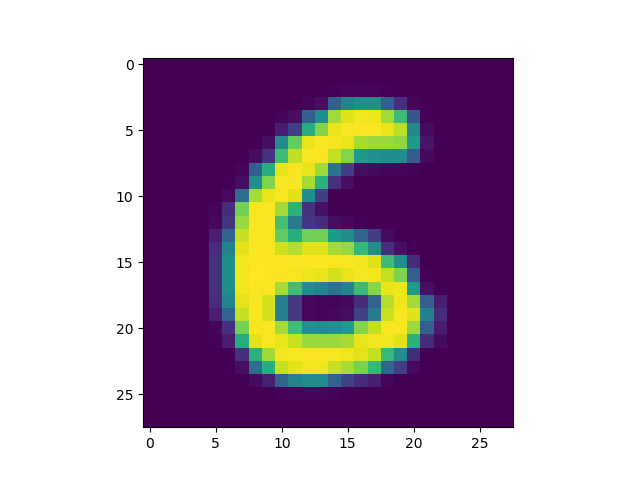
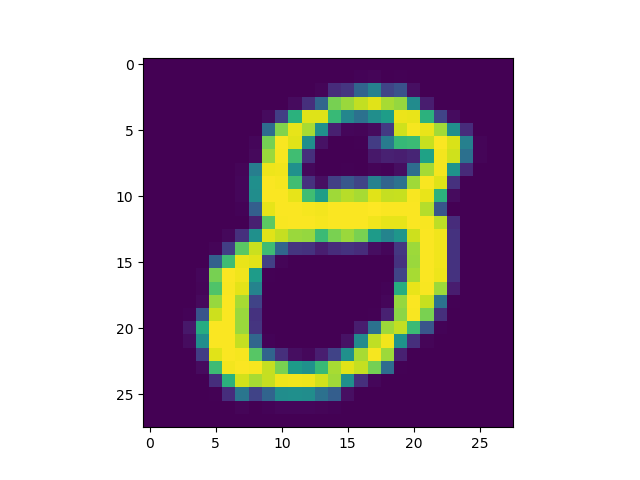
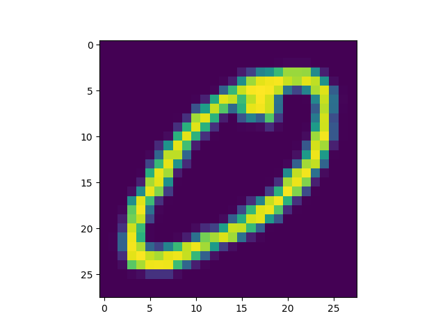
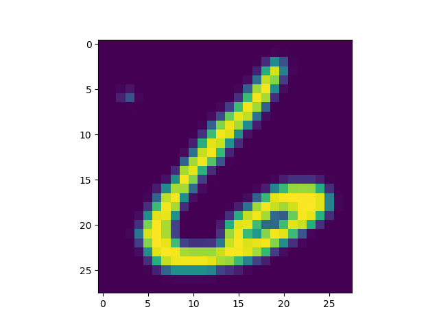

Training machine learning models can be awesome if they are accurate. However, you then also want to use them in production.

But how to do so?

The first step is often to allow the models to _generate new predictions_, for data that you - instead of Keras - feeds it.

This blog zooms in on that particular topic. By providing a Keras based example using TensorFlow 2.0+, it will show you how to create a Keras model, train it, save it, load it and subsequently use it to generate new predictions. It's the first step of deploying your model into a production setting :)

Are you ready? Let's go! 😎

**Update 11/Jan/2021:** added quick example to the article.

**Update 03/Nov/2020:** fixed textual error.

* * *

\[toc\]

* * *

## Example code: using model.predict() for predicting new samples

With this example code, you can start using `model.predict()` straight away.

```python
# File path
filepath = './path_to_model'

# Load the model
model = load_model(filepath, compile = True)

# A few random samples
use_samples = [5, 38, 3939, 27389]
samples_to_predict = []

# Convert into Numpy array
samples_to_predict = np.array(samples_to_predict)

# Generate predictions for samples
predictions = model.predict(samples_to_predict)
print(predictions)
```

* * *

## Today's Keras model

Let's first take a look at the Keras model that we will be using today for showing you how to generate predictions for new data.

It's an adaptation of the Convolutional Neural Network that we trained to demonstrate [how sparse categorical crossentropy loss works](https://www.machinecurve.com/index.php/2019/10/06/how-to-use-sparse-categorical-crossentropy-in-keras/). Today's one works for TensorFlow 2.0 and the integrated version of Keras; hence, I'd advise to use this variant instead of the traditional `keras` package.

[](https://www.machinecurve.com/wp-content/uploads/2020/02/dig_4.png)

Now, I won't cover all the steps describing _how_ this model is built - take a look at the link above if you wish to understand this in more detail. However, very briefly:

- The model loads data from the EMNIST Digits dataset, which contains many samples of digits 0 to 9. To do this, we use our [Extra Keras Datasets](https://www.machinecurve.com/index.php/2020/01/10/making-more-datasets-available-for-keras/) package.
- It prepares the data by reshaping it (adding the number of channels, which Keras requires), casting the data into the `float32` type, and scaling.
- It creates the ConvNet architecture: three convolutional blocks with [Max Pooling](https://www.machinecurve.com/index.php/2020/01/30/what-are-max-pooling-average-pooling-global-max-pooling-and-global-average-pooling/) for spatial hierarchy and [Dropout](https://www.machinecurve.com/index.php/2019/12/18/how-to-use-dropout-with-keras/) against overfitting. Using Flatten, and Dense layers that end with a [Softmax activation](https://www.machinecurve.com/index.php/2020/01/08/how-does-the-softmax-activation-function-work/), we get a multiclass probability distribution.
- It compiles the model and fits the data.
- Finally, it evaluates the model based on the test set.

Here's the code - add it to a file called e.g. `keras-predictions.py`:

```python
from tensorflow.keras.models import Sequential
from tensorflow.keras.layers import Dense, Dropout, Flatten
from tensorflow.keras.layers import Conv2D, MaxPooling2D
from tensorflow.keras.losses import sparse_categorical_crossentropy
from tensorflow.keras.optimizers import Adam
from extra_keras_datasets import emnist

# Model configuration
img_width, img_height = 28, 28
batch_size = 250
no_epochs = 25
no_classes = 10
validation_split = 0.2
verbosity = 1

# Load EMNIST dataset
(input_train, target_train), (input_test, target_test) = emnist.load_data(type='digits')

# Reshape data
input_train = input_train.reshape(input_train.shape[0], img_width, img_height, 1)
input_test = input_test.reshape(input_test.shape[0], img_width, img_height, 1)
input_shape = (img_width, img_height, 1)

# Cast numbers to float32
input_train = input_train.astype('float32')
input_test = input_test.astype('float32')

# Scale data
input_train = input_train / 255
input_test = input_test / 255

# Create the model
model = Sequential()
model.add(Conv2D(32, kernel_size=(3, 3), activation='relu', input_shape=input_shape))
model.add(MaxPooling2D(pool_size=(2, 2)))
model.add(Dropout(0.25))
model.add(Conv2D(64, kernel_size=(3, 3), activation='relu'))
model.add(MaxPooling2D(pool_size=(2, 2)))
model.add(Dropout(0.25))
model.add(Flatten())
model.add(Dense(256, activation='relu'))
model.add(Dense(no_classes, activation='softmax'))

# Compile the model
model.compile(loss=sparse_categorical_crossentropy,
              optimizer=Adam(),
              metrics=['accuracy'])

# Fit data to model
model.fit(input_train, target_train,
          batch_size=batch_size,
          epochs=no_epochs,
          verbose=verbosity,
          validation_split=validation_split)

# Generate generalization metrics
score = model.evaluate(input_test, target_test, verbose=0)
print(f'Test loss: {score[0]} / Test accuracy: {score[1]}')
```

* * *

## Saving and loading the model

If we want to generate new predictions for future data, it's important that we save the model. It really is: if you don't, you'd have to retrain the model every time you want to use it. This is bad for two reasons: if you have data at scale, this is a terrible process, and your models may no longer be comparable.

Let's thus find a way to save our model!

Fortunately, Keras offers a built-in facility for saving your models. Today, we do so using the new TensorFlow `SavedModel` approach. However, the former way of working is also still available. [Check out this post if you wish to check out saving models using both approaches in more detail](https://www.machinecurve.com/index.php/2020/02/14/how-to-save-and-load-a-model-with-keras/).

### Saving

Now, let's add some extra code to your model so that we can save and load the model :)

First, add the `save_model` and `load_model` definitions to our imports - replace the line where you import `Sequential` with:

```python
from tensorflow.keras.models import Sequential, save_model, load_model
```

Then, create a folder in the folder where your `keras-predictions.py` file is stored. Make sure to name this folder `saved_model` or, if you name it differently, change the code accordingly - because you next add this at the end of your model file:

```python
# Save the model
filepath = './saved_model'
save_model(model, filepath)
```

In line with how saving Keras models works, it saves the `model` instance at the `filepath` (i.e. that folder) that you specified.

Hooray! We now saved our trained model 🎉

### Loading

Loading the model for future usage is really easy - it's a two-line addition:

```python
# Load the model
model = load_model(filepath, compile = True)
```

Your model is now re-loaded from `filepath` and compiled automatically (i.e., the `model.compile` step is performed; you can also do this manually if you like).

_Note that saving and loading your model during run-time of one Python file makes no sense at all: why would you write a model to your file system and load it in the same run? Yeah, you're right :)_ _The goal is however to make your model re-usable across many Python files. Hence, in any practical setting, you'd use `save_model` during the training run, while you'd use `load_model` in e.g. another script._

* * *

## Generating predictions

With a loaded model, it's time to show you how to generate predictions with your Keras model! :)

Firstly, let's add Matplotlib to our imports - which allows us to generate visualizations. Then, also add Numpy, for number processing:

```python
import matplotlib.pyplot as plt
import numpy as np
```

Then, we'll add some code for visualizing the samples that we'll be using in today's post:

```python
# A few random samples
use_samples = [5, 38, 3939, 27389]

# Generate plots for samples
for sample in use_samples:
  # Generate a plot
  reshaped_image = input_train[sample].reshape((img_width, img_height))
  plt.imshow(reshaped_image)
  plt.show()
```

Here they are:

- [](https://www.machinecurve.com/wp-content/uploads/2020/02/dig_4.png)
    
- [](https://www.machinecurve.com/wp-content/uploads/2020/02/dig_2.png)
    
- [](https://www.machinecurve.com/wp-content/uploads/2020/02/dig_3.png)
    
- [](https://www.machinecurve.com/wp-content/uploads/2020/02/dig_1.png)
    

We then extend this code so that we can actually store the samples temporarily for prediction later:

```python
# A few random samples
use_samples = [5, 38, 3939, 27389]
samples_to_predict = []

# Generate plots for samples
for sample in use_samples:
  # Generate a plot
  reshaped_image = input_train[sample].reshape((img_width, img_height))
  plt.imshow(reshaped_image)
  plt.show()
  # Add sample to array for prediction
  samples_to_predict.append(input_train[sample])
```

Then, before feeding them to the model, we convert our list into a Numpy array. This allows us to compute shape and allows Keras to handle the data more smoothly:

```python
# Convert into Numpy array
samples_to_predict = np.array(samples_to_predict)
print(samples_to_predict.shape)
```

The output of the `print` statement: `(4, 28, 28, 1)`.

Correct ✅ We indeed added 4 images of 28x28 pixels with one channel per image.

The next step is to generate the predictions:

```python
# Generate predictions for samples
predictions = model.predict(samples_to_predict)
print(predictions)
```

The output here seems to be a bit jibberish at first:

```python
[[8.66183618e-05 1.06925681e-05 1.40683464e-04 4.31487868e-09
  7.31811961e-05 6.07917445e-06 9.99673367e-01 7.10965661e-11
  9.43153464e-06 1.98050812e-10]
 [6.35617238e-04 9.08200348e-10 3.23482091e-05 4.98994159e-05
  7.29685112e-08 4.77315152e-05 4.25152575e-06 4.23201502e-10
  9.98981178e-01 2.48882337e-04]
 [9.99738038e-01 3.85520025e-07 1.05982785e-04 1.47284098e-07
  5.99268958e-07 2.26216093e-06 1.17733900e-04 2.74483864e-05
  3.30203284e-06 4.03360673e-06]
 [3.42538192e-06 2.30619257e-09 1.29460409e-06 7.04832928e-06
  2.71432992e-08 1.95419183e-03 9.96945918e-01 1.80040043e-12
  1.08795590e-03 1.78136176e-07]]
```

Confused? 😕 Don't be!

Remember that we used the [Softmax activation function](https://www.machinecurve.com/index.php/2020/01/08/how-does-the-softmax-activation-function-work/) when creating our model. This activation function doesn't compute _the prediction_, but rather a _discrete probability distribution over the target classes_. In simple English, this means that Softmax computes the probability that the input belongs to a particular class, for each class. The values in each row summate to 1 - or 100%, which is a characteristic of a valid probability distribution.

Now, we can finalize our work by _actually_ finding out what our predicted classes are - by taking the `argmax` values (or "maximum argument", index of the maximum value) for each element in the list with predictions:

```python
# Generate arg maxes for predictions
classes = np.argmax(predictions, axis = 1)
print(classes)
```

This outputs `[6 8 0 6]`. Yeah! ✅ 🎉

- [](https://www.machinecurve.com/wp-content/uploads/2020/02/dig_4.png)
    
- [](https://www.machinecurve.com/wp-content/uploads/2020/02/dig_2.png)
    
- [](https://www.machinecurve.com/wp-content/uploads/2020/02/dig_3.png)
    
- [](https://www.machinecurve.com/wp-content/uploads/2020/02/dig_1.png)
    

_Note that the code above trains with and predicts with both the training data. While this is bad practice when evaluating a model, it is acceptable when you're confident that your model generalizes to new data. I indeed am that it will generalize to new MNIST-like data, and hence I didn't make the split here._

## Full code

If you're interested, you can find the code as a whole here:

```python
from tensorflow.keras.datasets import mnist
from tensorflow.keras.models import Sequential, save_model, load_model
from tensorflow.keras.layers import Dense, Dropout, Flatten
from tensorflow.keras.layers import Conv2D, MaxPooling2D
from tensorflow.keras.losses import sparse_categorical_crossentropy
from tensorflow.keras.optimizers import Adam
from extra_keras_datasets import emnist
import matplotlib.pyplot as plt
import numpy as np

# Model configuration
img_width, img_height = 28, 28
batch_size = 250
no_epochs = 25
no_classes = 10
validation_split = 0.2
verbosity = 1

# Load EMNIST dataset
(input_train, target_train), (input_test, target_test) = emnist.load_data(type='digits')

# Reshape data
input_train = input_train.reshape(input_train.shape[0], img_width, img_height, 1)
input_test = input_test.reshape(input_test.shape[0], img_width, img_height, 1)
input_shape = (img_width, img_height, 1)

# Cast numbers to float32
input_train = input_train.astype('float32')
input_test = input_test.astype('float32')

# Scale data
input_train = input_train / 255
input_test = input_test / 255

# Create the model
model = Sequential()
model.add(Conv2D(32, kernel_size=(3, 3), activation='relu', input_shape=input_shape))
model.add(MaxPooling2D(pool_size=(2, 2)))
model.add(Dropout(0.25))
model.add(Conv2D(64, kernel_size=(3, 3), activation='relu'))
model.add(MaxPooling2D(pool_size=(2, 2)))
model.add(Dropout(0.25))
model.add(Flatten())
model.add(Dense(256, activation='relu'))
model.add(Dense(no_classes, activation='softmax'))

# Compile the model
model.compile(loss=sparse_categorical_crossentropy,
              optimizer=Adam(),
              metrics=['accuracy'])

# Fit data to model
model.fit(input_train, target_train,
          batch_size=batch_size,
          epochs=no_epochs,
          verbose=verbosity,
          validation_split=validation_split)

# Generate generalization metrics
score = model.evaluate(input_test, target_test, verbose=0)
print(f'Test loss: {score[0]} / Test accuracy: {score[1]}')

# # Save the model
filepath = './saved_model'
save_model(model, filepath)

# Load the model
model = load_model(filepath, compile = True)

# A few random samples
use_samples = [5, 38, 3939, 27389]
samples_to_predict = []

# Generate plots for samples
for sample in use_samples:
  # Generate a plot
  reshaped_image = input_train[sample].reshape((img_width, img_height))
  plt.imshow(reshaped_image)
  plt.show()
  # Add sample to array for prediction
  samples_to_predict.append(input_train[sample])

# Convert into Numpy array
samples_to_predict = np.array(samples_to_predict)
print(samples_to_predict.shape)

# Generate predictions for samples
predictions = model.predict(samples_to_predict)
print(predictions)

# Generate arg maxes for predictions
classes = np.argmax(predictions, axis = 1)
print(classes)
```

* * *

## Summary

In today's blog post, we looked at how to _generate predictions with a Keras model_. We did so by coding an example, which did a few things:

- Load EMNIST digits from the [Extra Keras Datasets](https://www.machinecurve.com/index.php/2020/01/10/making-more-datasets-available-for-keras/) module.
- Prepare the data.
- Define and train a Convolutional Neural Network for classification.
- Save the model.
- Load the model.
- Generate new predictions with the loaded model and validate that they are correct.

I hope you've learnt something from today's post, even though it was a bit smaller than usual :) Please let me know in the comments section what you think 💬

Thank you for reading MachineCurve today and happy engineering! 😎

\[kerasbox\]

* * *

## References

MachineCurve. (2020, January 10). Making more datasets available for Keras. Retrieved from [https://www.machinecurve.com/index.php/2020/01/10/making-more-datasets-available-for-keras/](https://www.machinecurve.com/index.php/2020/01/10/making-more-datasets-available-for-keras/)

MachineCurve. (2020, February 11). How to use sparse categorical crossentropy in Keras? Retrieved from [https://www.machinecurve.com/index.php/2019/10/06/how-to-use-sparse-categorical-crossentropy-in-keras/](https://www.machinecurve.com/index.php/2019/10/06/how-to-use-sparse-categorical-crossentropy-in-keras/)

Cohen, G., Afshar, S., Tapson, J., & van Schaik, A. (2017). EMNIST: an extension of MNIST to handwritten letters. Retrieved from [http://arxiv.org/abs/1702.05373](http://arxiv.org/abs/1702.05373)
