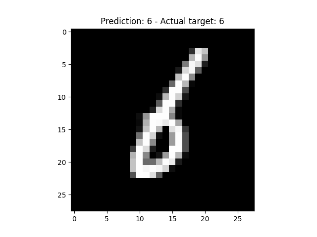
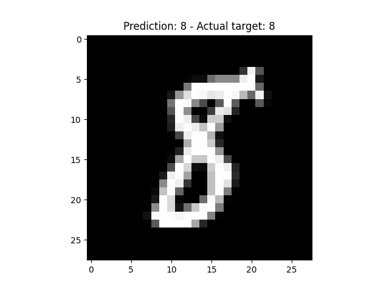
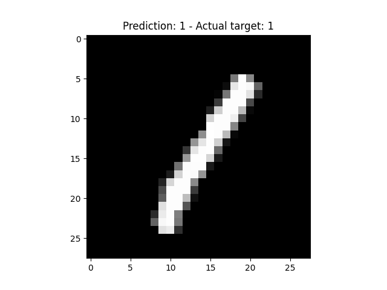
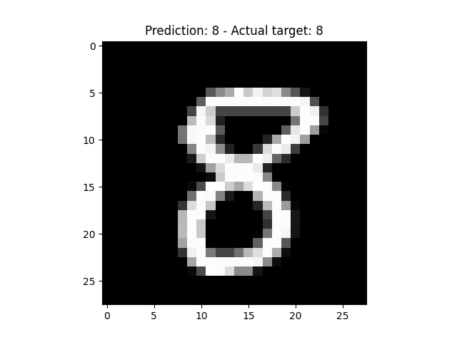

Training a neural network with PyTorch also means that you'll have to deploy it one day - and this requires that you'll add code for predicting new samples with your model. In this tutorial, we're going to take a look at doing that, and show you how to

It is structured as follows. Firstly, we will be taking a look at actually creating a neural network with PyTorch. We'll briefly walk you through the creation of a Multilayer Perceptron with the framework, which serves as the basis for predicting new samples. This is followed by actually predicting new samples after training the model. Altogether, after reading this tutorial, you will understand...

- **How to create a PyTorch model from a high-level perspective.**
- **How you can generate predictions for new samples with your PyTorch model after training.**

Let's take a look! 🚀

* * *

\[toc\]

* * *

## Today's PyTorch model

In another tutorial, we showed you [how to create a Multilayer Perceptron with PyTorch](https://www.machinecurve.com/index.php/2021/01/26/creating-a-multilayer-perceptron-with-pytorch-and-lightning/). What follows is the code for doing so. If you want to understand all the details, I recommend clicking the link to follow that particular tutorial.

However, here, we will cover it briefly, so that you understand what is happening when you are running the code.

- First, the dependencies. You will need a fresh installation of Python, e.g. 3.6+, but preferably newer. In addition, you'll need PyTorch (`torch`) and the `torchvision` module because you'll train your model on the MNIST dataset.
- Second, the `nn.Module` class. This class represents the neural network, in this case the Multilayer Perceptron. In the `__init__` definition, you specify the layers of your model - here, using the `nn.Sequential` wrapper which stacks all the layers on top of each other. Using `forward`, you specify the forward pass, or what happens when you let a sample pass through the model. As you can see, you feed it through the layers, and return the results.
- Third, the runtime code. Here, you actually prepare the MNIST data, initialize the MLP, define loss function and optimizer, and define a custom training loop - for 5 iterations, or epochs. In the training loop, for every epoch, you feed forward all samples in a minibatch, compute loss, compute the error in the backwards pass, and optimize the model.
- Finally, once all 5 epochs have passed, you print about model completion.

```python
import os
import torch
from torch import nn
from torchvision.datasets import MNIST
from torch.utils.data import DataLoader
from torchvision import transforms

class MLP(nn.Module):
  '''
    Multilayer Perceptron.
  '''
  def __init__(self):
    super().__init__()
    self.layers = nn.Sequential(
      nn.Flatten(),
      nn.Linear(32 * 32 * 3, 64),
      nn.ReLU(),
      nn.Linear(64, 32),
      nn.ReLU(),
      nn.Linear(32, 10)
    )


  def forward(self, x):
    '''Forward pass'''
    return self.layers(x)
  
  
if __name__ == '__main__':
  
  # Set fixed random number seed
  torch.manual_seed(42)
  
  # Prepare MNIST dataset
  dataset = MNIST(os.getcwd(), download=True, transform=transforms.ToTensor())
  trainloader = torch.utils.data.DataLoader(dataset, batch_size=10, shuffle=True, num_workers=1)
  
  # Initialize the MLP
  mlp = MLP()
  
  # Define the loss function and optimizer
  loss_function = nn.CrossEntropyLoss()
  optimizer = torch.optim.Adam(mlp.parameters(), lr=1e-4)
  
  # Run the training loop
  for epoch in range(0, 5): # 5 epochs at maximum
    
    # Print epoch
    print(f'Starting epoch {epoch+1}')
    
    # Set current loss value
    current_loss = 0.0
    
    # Iterate over the DataLoader for training data
    for i, data in enumerate(trainloader, 0):
      
      # Get inputs
      inputs, targets = data
      
      # Zero the gradients
      optimizer.zero_grad()
      
      # Perform forward pass
      outputs = mlp(inputs)
      
      # Compute loss
      loss = loss_function(outputs, targets)
      
      # Perform backward pass
      loss.backward()
      
      # Perform optimization
      optimizer.step()
      
      # Print statistics
      current_loss += loss.item()
      if i % 500 == 499:
          print('Loss after mini-batch %5d: %.3f' %
                (i + 1, current_loss / 500))
          current_loss = 0.0

  # Process is complete.
  print('Training process has finished.')
```

* * *

## After training: predicting new samples with your PyTorch model

The first thing to do when you want to generate new predictions is add `matplotlib` and `numpy`

```python
import matplotlib.pyplot as plt
import numpy as np
```

You can then add the following code to predict new samples with your PyTorch model:

- You first have to disable grad with `torch.no_grad()` or NumPy will not work properly.
- This is followed by specifying information about the item from the MNIST dataset that you want to generate predictions for. You specify an `index`, load the item, and split it into an `image` and a `true_target`. Obviously, this can also be one of the images from your own dataset.
- Generating a prediction is simple - you simply feed it to your `mlp` instance (here, `mlp` is the name of the instantiated `nn.Model` module, and can be anything depending on how you named the variable where you initialized your neural network).
- The `prediction` is a Softmax generated list of probabilities across the possible classes - and you therefore have to turn it into a `predicted_class` variable with `np.argmax`. This takes the argument with the highest value, i.e. the highest probability.
- This is followed by reshaping the `image` into a shape that can be used by Matplotlib for visualization. The default MNIST dataset represents images as `(1, 28, 28)` whereas Matplotlib requires `(28, 28, 1)`.
- Finally, you visualize the image, and set the prediction compared to the actual target as the `title`.

```python
  # Disable grad
  with torch.no_grad():
    
    # Retrieve item
    index = 256
    item = dataset[index]
    image = item[0]
    true_target = item[1]
    
    # Generate prediction
    prediction = mlp(image)
    
    # Predicted class value using argmax
    predicted_class = np.argmax(prediction)
    
    # Reshape image
    image = image.reshape(28, 28, 1)
    
    # Show result
    plt.imshow(image, cmap='gray')
    plt.title(f'Prediction: {predicted_class} - Actual target: {true_target}')
    plt.show()
```

These are some of the results:

- 
    
- 
    
- 
    

* * *

## Predicting new samples with a loaded PyTorch mdoel

You can also use a [saved model](https://www.machinecurve.com/index.php/2021/02/03/how-to-save-and-load-a-pytorch-model/) for inference:

```python
  # Disable grad
  with torch.no_grad():
    
    # Retrieve item
    index = 333
    item = dataset[index]
    image = item[0]
    true_target = item[1]
    
    # Loading the saved model
    save_path = './mlp.pth'
    mlp = MLP()
    mlp.load_state_dict(torch.load(save_path))
    mlp.eval()
    
    # Generate prediction
    prediction = mlp(image)
    
    # Predicted class value using argmax
    predicted_class = np.argmax(prediction)
    
    # Reshape image
    image = image.reshape(28, 28, 1)
    
    # Show result
    plt.imshow(image, cmap='gray')
    plt.title(f'Prediction: {predicted_class} - Actual target: {true_target}')
    plt.show()
```

It also works:



* * *

## Recap

In this tutorial, we looked at how you can generate new predictions with your trained PyTorch model. Using a Multilayer Perceptron trained on the MNIST dataset, you have seen that it is very easy to perform inference - as easy as simply feeding the samples to your model instance.

Using code examples, you have seen how to perform this, as well as for the case when you load your saved PyTorch model in order to generate predictions.

I hope that you have learned something from this article! If you did, please feel free to leave a message in the comments section below 💬 Please do the same if you have any questions or remarks whatsoever. I'd love to hear from you :)

Thank you for reading MachineCurve today and happy engineering! 😎

* * *

## References

StackExchange. (n.d.). _What is the use of torch.no\_grad in pytorch?_ Data Science Stack Exchange. [https://datascience.stackexchange.com/questions/32651/what-is-the-use-of-torch-no-grad-in-pytorch](https://datascience.stackexchange.com/questions/32651/what-is-the-use-of-torch-no-grad-in-pytorch)
