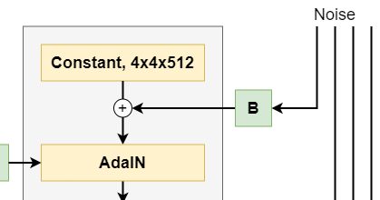
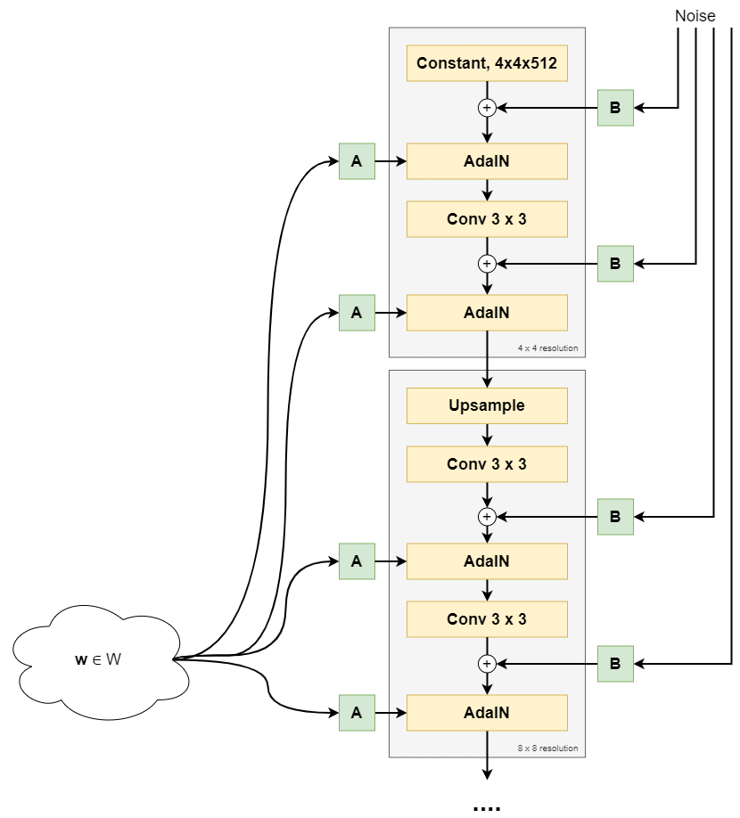

So far, at MachineCurve, we have primarily focused on how to train models with Keras. This is nice, but a bit useless if we cannot save the models that we've trained. Training is expensive and we shouldn't want to retrain a model every time we want to use it.

Now, fortunately, the Keras deep learning framework supports _saving trained models and loading them for later use_. This is exactly what we want!

In this blog post, we will therefore find out how it works. Firstly, we'll train a model, which serves as our case for today's blog. Secondly, we'll find out how we can save this model, either as an HDF5 file ("old style saving") or a SavedModel file ("new style saving"). Finally, we'll load this model again, and show you how to generate new predictions with it.

Are you ready? Let's go! 😎

* * *

\[toc\]

* * *

## Our training scenario

Before we can show you how to save and load your Keras model, we should define an example training scenario - because if we don't, there is nothing to save :D

So, for this purpose, we'll be using this model today:

```python
from tensorflow.keras.datasets import mnist
from tensorflow.keras.layers import Dense, Flatten, Conv2D
from tensorflow.keras.losses import sparse_categorical_crossentropy
from tensorflow.keras.models import Sequential
from tensorflow.keras.optimizers import Adam

# Model configuration
batch_size = 150
img_width, img_height = 28, 28
loss_function = sparse_categorical_crossentropy
no_classes = 10
no_epochs = 25
optimizer = Adam()
validation_split = 0.2
verbosity = 1

# Load MNIST dataset
(input_train, target_train), (input_test, target_test) = mnist.load_data()

# Reshape data
input_train = input_train.reshape((input_train.shape[0], img_width, img_height, 1))
input_test = input_test.reshape((input_test.shape[0], img_width, img_height, 1))
input_shape = (img_width, img_height, 1)

# Cast input to float32
input_train = input_train.astype('float32')
input_test = input_test.astype('float32')

# Normalize data
input_train = input_train / 255
input_test = input_test / 255

# Create the model
model = Sequential()
model.add(Conv2D(32, kernel_size=(3, 3), activation='relu', input_shape=input_shape))
model.add(Conv2D(64, kernel_size=(3, 3), activation='relu'))
model.add(Conv2D(128, kernel_size=(3, 3), activation='relu'))
model.add(Flatten())
model.add(Dense(256, activation='relu'))
model.add(Dense(no_classes, activation='softmax'))

# Compile the model
model.compile(loss=loss_function,
              optimizer=optimizer,
              metrics=['accuracy'])

# Train the model
model.fit(input_train, target_train,
            batch_size=batch_size,
            epochs=no_epochs,
            verbose=verbosity,
            validation_split=validation_split)
```

It's an adaptation of our [Keras model for valid padding](https://www.machinecurve.com/index.php/2020/02/08/how-to-use-padding-with-keras/#how-to-use-valid-padding-with-keras), where the architecture is optimized to the structure of our dataset (for example, we're using [sparse categorical crossentropy loss](https://www.machinecurve.com/index.php/2019/10/06/how-to-use-sparse-categorical-crossentropy-in-keras/) because our targets are integers rather than one-hot encoded vectors).

Now, at a high level, this is what the code above does:

1. We import the elements of Keras that we need, from the TensorFlow 2.0 installation.
2. We specify some configuration options for our model, such as model hyperparameters (loss function, optimizer), options for training (batch size, number of epochs, verbosity mode) and so on.
3. We load and prepare MNIST data, by reshaping it, casting it into `float32` format which presumably speeds up training, and normalizing the data.
4. We create the simple yet possibly useful architecture for the model.
5. We compile the model (i.e. instantiate the skeleton we created in the fourth step) and fit the data (i.e. start the training process).

With this model, we can now take a look at how to save your model, the architecture only, the weights only, and so on. This includes a look at how to _load_ that stuff again too, haha! :)

* * *

## Saving your whole model

But first, saving the model.

In order to save whole models, Keras provides the `save_model` definition:

```python
tf.keras.models.save_model(
    model,
    filepath,
    overwrite=True,
    include_optimizer=True,
    save_format=None,
    signatures=None,
    options=None
)
```

You can provide these attributes (TensorFlow, n.d.):

- `model` (required): the _model instance_ that we want to save. In the case of the model above, that's the `model` object.
- `filepath` (required): the path where we wish to write our model to. This can either be a `String` or a `h5py.File` object. In the first case, i.e. the String, the Python file system will write the model to the path specified by the String. In the latter case, a HDF object was opened or created with `h5py`, to which one can write data. Specifying this object will let you write data there, without having to use the Python file system redundantly.
- `overwrite` (defaults to `True`): if the user must be asked to overwrite existing files at the `filepath`, or whether we can simply write away.
- `include_optimizer` (defaults to True): whether we wish to save the state of the optimizer too. This may seem odd at first, but indeed, optimizers also have their state! For example, the Adam optimizer works so well because it applies [momentum-like optimization with local optimization](https://www.machinecurve.com/index.php/2019/11/03/extensions-to-gradient-descent-from-momentum-to-adabound/#adam). I can imagine that _this state_, and then especially with respect to local optimization, could be saved. The `include_optimizer` attribute allows you to do so.
- `save_format`: whether you wish to save the file in `tf` or `h5` format. The latter represents a HDF5 file and was the standard option in TensorFlow 1.0. However, in version 2.0+, this was changed into the [SavedModel](https://www.tensorflow.org/guide/saved_model) format. Given this change, it defaults to `tf` in 2.0+ and `h5` in earlier versions. It's up to you to decide what fits best :)
- `signatures`: it's possible to add custom methods to TensorFlow (and hence Keras) models. These are called "signatures". If you wish to save them together with your model, you can do so - by specifying them here.
- `options`: if you wish to save model options too, you could use `options`, which should be a `SaveOptions` [instance](https://www.tensorflow.org/api_docs/python/tf/saved_model/SaveOptions).

### Saving our model in SavedModel format

Now, let's take a look at what this means for our model.

Fortunately, it's a simple one, so we can simply specify the model and the filepath and we're done. Add this to your code and run it to train the model:

```python
# Save the model
filepath = './saved_model'
save_model(model, filepath)
```

Don't forget to add `save_model` to your imports and to create a directory called `save_model` at the `filepath` you specify.

```python
from tensorflow.keras.models import Sequential, save_model
```

After running the model, indeed, our `save_model` folder is now full of model files:

[](https://www.machinecurve.com/wp-content/uploads/2020/02/image.png)

### Saving our model in HDF5 format

Now, if we wanted to save our model into HDF (`.h5`) format, we would change the `save_model` call into:

```python
# Save the model
filepath = './saved_model'
save_model(model, filepath, save_format='h5')
```

(You might wish to add `.h5` as a suffix to the filepath, but this is up to you.)

If you created a folder `saved_model` as before, you would get this error:

```
OSError: Unable to create file (unable to open file: name = './saved_model', errno = 13, error message = 'Permission denied', flags = 13, o_flags = 302)
```

The reason why this error occurs is that the HDF5 file format ensures that data is contained, i.e. that it is hierarchically structured in just _one_ file. You thus have to remove the directory and run the code again, and voila:



* * *

## Loading the whole model

Now that we have a saved model, we can demonstrate how to _load_ it again - in order to generate predictions.

The first thing that we'll have to do if we wish to load our Keras model is adding a few extra imports. Firstly, add `load_model` to your `tensorflow.keras.models` import:

```python
from tensorflow.keras.models import Sequential, save_model, load_model
```

Also make sure to import `numpy`, as we'll need to compute an `argmax` value for our Softmax activated model prediction later:

```python
import numpy as np
```

We can then load the model:

```python
# Load the model
loaded_model = load_model(
    filepath,
    custom_objects=None,
    compile=True
)
```

Et voila, you've loaded your model :)

Now, while `filepath` is pretty clear, what do `custom_objects` and `compile` mean?

> If the model you want to load includes custom layers or other custom classes or functions, you can pass them to the loading mechanism via the `custom_objects` argument.
>
> Keras (n.d.; FAQ)

Indeed - by default, custom objects are not saved with the model. You can however specify them with the `custom_objects` attribute upon loading it, like this (Keras, n.d.):

```python
model = load_model('my_model.h5', custom_objects={'AttentionLayer': AttentionLayer})
```

Now, the `compile` indicates whether the model must be compiled or not. It's `True` by default. If you set it to `False`, you'll have to compile it manually again using `model.compile`, but in return you'll get the freedom to tweak the configuration options a bit.

### Predictions for new data

With the model we loaded, we can generate predictions for new data:

```python
# Generate a prediction with loaded model
sample_index = 788
sample_input, sample_target = input_test[sample_index], target_test[sample_index]
sample_input_array = np.array([sample_input])
predictions = loaded_model.predict(sample_input_array)
prediction = np.argmax(predictions[0])
print(f'Ground truth: {sample_target} - Prediction: {prediction}')
```

Here, for sample `788`, we take the true input and true target, feed the input to the model, and store the prediction. Subsequently, we print it, to check whether it's correct when we run the `py` file:

```
Ground truth: 9 - Prediction: 9
```

Hooray! 🎉

* * *

## Summary

In this blog post, we saw how we can utilize Keras facilities for saving and loading models: i.e., the `save_model` and `load_model` calls. Through them, we've been able to train a Keras model, save it to disk in either HDF5 or SavedModel format, and load it again.

I hope this blog was useful for you! If it was, feel free to leave a comment in the comments section below 💬 Please do the same if you have questions, when you think I've made a mistake or when you have other remarks.

Thank you for reading MachineCurve today and happy engineering! 😎

\[kerasbox\]

* * *

## References

TensorFlow. (n.d.). tf.keras.models.save\_model. Retrieved from [https://www.tensorflow.org/api\_docs/python/tf/keras/models/save\_model](https://www.tensorflow.org/api_docs/python/tf/keras/models/save_model)

TensorFlow. (n.d.). tf.keras.models.load\_model. Retrieved from [https://www.tensorflow.org/api\_docs/python/tf/keras/models/load\_model](https://www.tensorflow.org/api_docs/python/tf/keras/models/load_model)

Keras. (n.d.). FAQ: Handling custom layers (or other custom objects) in saved models. Retrieved from [https://keras.io/getting-started/faq/#handling-custom-layers-or-other-custom-objects-in-saved-models](https://keras.io/getting-started/faq/#handling-custom-layers-or-other-custom-objects-in-saved-models)
