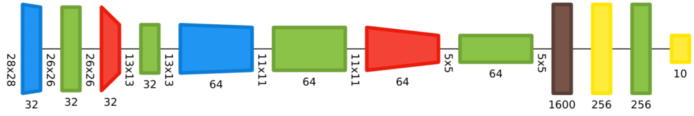
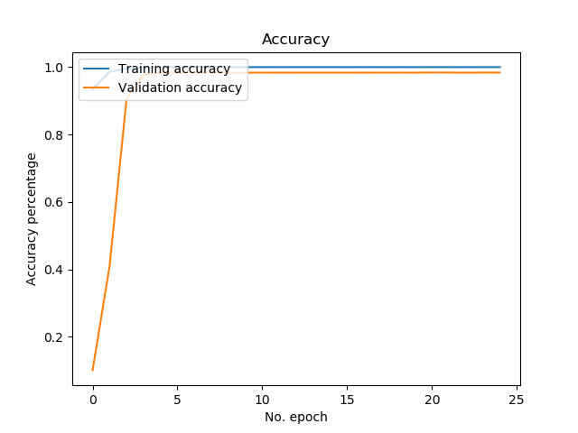
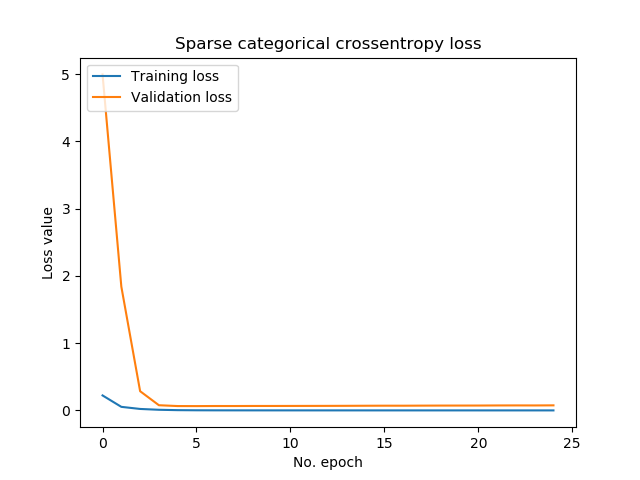

The inputs to individual layers in a neural network can be normalized to speed up training. This process, called Batch Normalization, attempts to resolve an issue in neural networks called internal covariate shift.

But how does it work? And how does it work in terms of code - with the Keras deep learning framework? We'll take a look at these questions in this blog.

Firstly, we'll provide a recap on Batch Normalization to ensure that you've gained some _conceptual_ understanding, or that it has been revived. This includes a discussion on the problem, why it occurs during training, and how Batch Normalization may resolve it.

Then, we move on to the actual Keras part - by providing you with an example neural network using Batch Normalization to learn classification on the KMNIST dataset. Each step of the code which creates the neural network is explained so that you understand how it works.

Are you ready? Let's go! :)

* * *

\[toc\]

* * *

## Recap: about Batch Normalization

Before we start coding, let's take a brief look at [Batch Normalization](https://www.machinecurve.com/index.php/2020/01/14/what-is-batch-normalization-for-training-neural-networks/) again. We start off with a discussion about _internal covariate shift_ and how this affects the learning process. Subsequently, as the need for Batch Normalization will then be clear, we'll provide a recap on Batch Normalization itself to understand what it does.

### Training a supervised ML model

Suppose that you have this neural network, which is composed of Dropout neurons:

[](https://www.machinecurve.com/wp-content/uploads/2019/12/dropout.png)

Following the [high-level supervised machine learning process](https://www.machinecurve.com/index.php/2019/10/04/about-loss-and-loss-functions/#the-high-level-supervised-learning-process), training such a neural network is a multi-step process:

- Feeding your training data to the network in a _feedforward_ fashion, in which each layer processes your data further.
- This leads to a prediction for every sample.
- This prediction can be compared to the actual target value (the "ground truth"), to see how well the model performs.
- How well, or strictly speaking how _bad_ the model performs is reflected in the _[loss value](https://www.machinecurve.com/index.php/2019/10/04/about-loss-and-loss-functions/)_.
- Improving the neural network means firstly, identifying the necessary change in the weights of each neuron with respect to the loss value, and possibly with respect to the intermediate layers as well.
- Secondly, by means of an optimizer like [gradient descent](https://www.machinecurve.com/index.php/2019/10/24/gradient-descent-and-its-variants/) or an [adaptive optimizer](https://www.machinecurve.com/index.php/2019/11/03/extensions-to-gradient-descent-from-momentum-to-adabound/), the weights get updated based on these necessary changes (also called gradients).

### Internal covariate shift

Now take a look at the neural network from a per-layer point of view. Each layer takes some input, performs a linear operation using the input vector and the weights vector, feeds the data into a nonlinear activation function, and passes the data to the next layer or the output.

Neural networks train fast if the distribution of the data remains the same, and especially if it is normalized to the range of \[latex\](\\mu = 0, \\sigma = 1)\[/latex\]. This is not the case when no Batch Normalization is applied: by training the network (i.e. changing the weights of the individual neurons), the outputs for every layer change, which means that the distribution of input data for every layer will change during every iteration.

We call this _internal covariate shift_ (Ioffe & Szegedy, 2015). It is bad, because it can slow down learning. Fortunately, it can be avoided - and Batch Normalization is a way of doing so.

### Batch Normalization normalizes layer inputs on a per-feature basis

As we saw before, neural networks train fast if the distribution of the input data remains similar over time. Batch Normalization helps you do this by doing two things: _normalizing the input value_ and _scaling and shifting it_.

**Normalizing the value:** \[latex\]\\hat{x}\_B^{(k)} \\leftarrow \\frac{x\_B{ ^{(k)} } - \\mu\_B^{(k)}}{\\sqrt{ \\sigma^2{ \_B^{(k)} } + \\epsilon}}\[/latex\]

Every input \[latex\]x\_B{ ^{(k)}}\[/latex\] is normalized by first subtracting input sample mean \[latex\] \\mu\_B^{(k)} \[/latex\] and then dividing by \[latex\] \\sqrt{ \\sigma^2{ \_B^{(k)} } + \\epsilon} \[/latex\], which is the square root of the variance of the input sample, plus some \[latex\] \\epsilon \[/latex\]. Do note:

- Whenever we mention "sample" we mean just _one dimension_ of the feature vectors in our minibatch, as normalization is done _per dimension_. This means, for e.g. the feature vector \[latex\]\[2.31, 5.12, 0.12\]\[/latex\], Batch Normalization is applied _three times_, so once per dimension.
- Contrary to _true_ \[latex\](0, 1)\[/latex\] normalization, a small value represented by \[latex\]\\epsilon\[/latex\] is added to the square root, to ensure that the denominator is nonzero - avoiding division by zero errors.

**Scaling and shifting:** \[latex\]y\_i \\leftarrow \\gamma\\hat{x} \_B ^{(k)} + \\beta\[/latex\].

With some activation functions (such as the Sigmoid activation function), normalizing inputs to have the \[latex\](0, 1)\[/latex\] distribution may result in a different issue: they'll activate almost linearly as they primarily activate in the linear segment of the activation function.

[Here](https://www.machinecurve.com/index.php/2020/01/14/what-is-batch-normalization-for-training-neural-networks/#scaling-and-shifting), I explain this in more detail, and why this needs to be avoided.

By _scaling_ the value with some \[latex\]\\gamma\[/latex\] and _shifting_ the value with some \[latex\]\\beta\[/latex\], this problem can be avoided. The values for these are learnt during training.

### Batch Normalization in the Keras API

In the Keras API (TensorFlow, n.d.), Batch Normalization is defined as follows:

```
keras.layers.BatchNormalization(axis=-1, momentum=0.99, epsilon=0.001, center=True, scale=True, beta_initializer='zeros', gamma_initializer='ones', moving_mean_initializer='zeros', moving_variance_initializer='ones', beta_regularizer=None, gamma_regularizer=None, beta_constraint=None, gamma_constraint=None)
```

Put simply, Batch Normalization can be added as easily as adding a `BatchNormalization()` layer to your model, e.g. with `model.add`. However, if you wish, local parameters can be tuned to steer the way in which Batch Normalization works. These parameters are as follows:

- **Axis**: the axis of your data which you like Batch Normalization to be applied on. Usually, this is not of importance, but if you have a channels-first Conv layer, it must be set to 1.
- **Momentum**: the momentum that is to be used on the moving mean and the moving variance.
- **Epsilon**: the value for \[latex\]\\epsilon\[/latex\] that is to be used in the normalization step, to avoid division by zero (also see the Batch Normalization formula above).
- **Center**: if `True`, the value for \[latex\]\\beta\[/latex\] is used; if `False`, it's ignored.
- **Scale**: if `True`, the value for \[latex\]\\gamma\[/latex\] is used; if `False`, it's ignored.
- **Beta initializer, regularizer and constraint:** these define the Keras initializer, regularizer and constraints for the _beta_ i.e. the center factor. They give you more control over how the network learns the values during training.
- **Gamma initializer, regularizer and constraint:** these define the Keras initializer, regularizer and constraints for the _gamma_ i.e. the scaling factor. They give you more control over how the network learns the values during training.
- **Moving mean initializer, moving variance initializer:** these define the Keras initializers for the moving mean and moving variance.

Why the moving mean and variance, you say?

This has to do with how Batch Normalization works _during training time_ versus _inference time_.

During training time, there's a larger minibatch available which you can use to compute sample mean and sample variance.

However, during inference, the sample size is _one_. There's no possibility to compute an average mean and an average variance - because you have _one_ value only, which may be an outlier. Having the moving _mean_ and moving _variance_ from the training process available during inference, you can use these values to normalize during inference. Smart and simple, but a great fix for this issue :)

* * *

## Today's model

Let's take a look at the model we're going to create today :) First, we'll see what dataset we're going to use - being the KMNIST datset. This is followed by a discussion about the model we'll be creating in this tutorial.

### The dataset

For the dataset, we're using the KMNIST dataset today:

[](https://www.machinecurve.com/wp-content/uploads/2020/01/kmnist-kmnist.png)

It is a drop-in replacement for the MNIST dataset:

- The training set has 60.000 samples;
- The testing set has 10.000 samples;
- Each sample is a 28x28 pixels image;
- Each sample belongs to one of 10 target classes.

#### Using the `extra-keras-datasets` module

We use the `extra-keras-datasets` module to load our dataset. This module, which we created and discussed [in a different blog post](https://www.machinecurve.com/index.php/2020/01/10/making-more-datasets-available-for-keras/), attempts to replicate the `keras.datasets` way of loading data into your machine learning projects, albeit with different datasets. As we believe that making more datasets easily available boosts adoption of a framework, especially by people who are just starting out, we've been making available additional datasets for Keras through this module. It may be worthwhile to check it out separately!

Installing this module is required if you wish to run the model (if you don't, you may also replace it with `keras.datasets.mnist`), and can be done very easily:

```
pip install extra-keras-datasets
```

With one line, a dataset can be imported into your model:

```
from extra_keras_datasets import kmnist
```

And subsequently loading the data into the particular variables is also easy:

```
(input_train, target_train), (input_test, target_test) = kmnist.load_data(type='kmnist')
```

### The model architecture

This is the architecture of today's model, which we generated with [Net2Vis](https://www.machinecurve.com/index.php/2020/01/07/visualizing-keras-neural-networks-with-net2vis-and-docker/) (Bäuerle & Ropinski, 2019):

- [](https://www.machinecurve.com/wp-content/uploads/2020/01/graph-1-1.png)
    
- [](https://www.machinecurve.com/wp-content/uploads/2020/01/legend-1.png)
    

Our model has two _convolutional_ blocks followed by two _dense_ layers:

- Each convolutional block contains a Conv2D layer and a MaxPooling2D layer, whose outputs are normalized with BatchNormalization layers.
- The convolutional blocks will learn the feature maps, and will thus learn to generate activations for certain _parts_ within the images, such as edges.
- With a Flatten layer, the contents of the feature maps are converted into a one-dimensional Tensor that can be used in the Dense layers.
- The Dense layers together produce the classification. The input to the final Dense layer from the first one is also BatchNormalized.

* * *

## Keras implementation

Let's now see how we can implement this model with Keras :) We'll be using the TensorFlow 2.0 approach to Keras, which is the currently preferred way of using the library. This unfortunately means that it's no longer possible to use Keras with Theano or CNTK. However, if you wish to still use it, it may still work to replace `tensorflow.keras` with `keras`, i.e. the original library.

Creating the model is a multi-step process:

- First, we import everything that we need.
- Then, we set the model configuration.
- This is followed by loading and preparing the dataset.
- Subsequently, we define the architecture of our model in line with what we defined above.
- Then, we compile the model and fit the data, i.e. start the training process.
- Once this finishes, we generate evaluation metrics based on our testing set.

Let's go! Open your Explorer or Finder, navigate to some folder, and create a Python file, e.g. `model_batchnorm.py`. Next, open this file in your code editor - so that we can start coding :)

### Model imports

These are our model imports:

```
from extra_keras_datasets import kmnist
import tensorflow
from tensorflow.keras.models import Sequential
from tensorflow.keras.layers import Dense, Flatten
from tensorflow.keras.layers import Conv2D, MaxPooling2D
from tensorflow.keras.layers import BatchNormalization
```

We can describe them as follows:

- We'll import the main `tensorflow` library so that we can import Keras stuff next.
- Then, from `models`, we import the `Sequential` API - which allows us to stack individual layers nicely and easily.
- Then, from `layers`, we import `Dense`, `Flatten`, `Conv2D`, `MaxPooling2D` and `BatchNormalization` - i.e., the layers from the architecture that we specified.
- Finally, we import the `kmnist` dataset from the `extra_keras_datasets` library.

### Model configuration

We can then set the configuration for our model:

```
# Model configuration
batch_size = 250
no_epochs = 25
no_classes = 10
validation_split = 0.2
verbosity = 1
```

The batch size of our minibatches is set to 250, which balances well between gradient preciseness and memory requirements. We'll train for 25 epochs (which could be higher if you wish, just configure it to a different number :)) and tell the model that we have 10 classes that it can classify into - i.e., the 10 KMNIST classes. 20% of the training data will be used for validation purposes and with verbosity mode set to True, all output will be displayed on screen.

### Loading & preparing data

The next step is loading the data. Given the simplicity with which `extra-keras-datasets` can be used, thanks to the original `keras.datasets` module, this is definitely easy:

```
# Load KMNIST dataset
(input_train, target_train), (input_test, target_test) = kmnist.load_data(type='kmnist')
```

Subsequent processing of the data so that it is prepared for training is a bit more complex, but it is neither very difficult:

```
# Shape of the input sets
input_train_shape = input_train.shape
input_test_shape = input_test.shape 
```

With this step, we obtain the shape of our `input_train` and `input_test` datasets, i.e. our _features_. We'll use the first to set the shape of our Keras input data next - which are image height (shape dim 1), image width (shape dim 2) and the number of channels (just one):

```
# Keras layer input shape
input_shape = (input_train_shape[1], input_train_shape[2], 1)
```

Channels have to be included because Keras expects them during training.

Next, because the data does not have yet the channels property, we'll have to reshape our data to include it there as well:

```
# Reshape the training data to include channels
input_train = input_train.reshape(input_train_shape[0], input_train_shape[1], input_train_shape[2], 1)
input_test = input_test.reshape(input_test_shape[0], input_test_shape[1], input_test_shape[2], 1)
```

Now, the bulk of the work is done. We next convert the data to `float32` format which presumably speeds up training:

```
# Parse numbers as floats
input_train = input_train.astype('float32')
input_test = input_test.astype('float32')
```

And finally normalize the data:

```
# Normalize input data
input_train = input_train / 255
input_test = input_test / 255
```

We're now ready to define the architecture.

### Defining the model architecture

Since we already discussed the architecture of our model above, its components won't be too surprising. However, what is still lacking is the actual _code_ for our architecture - so let's write it now and explain it afterwards:

```
# Create the model
model = Sequential()
model.add(Conv2D(32, kernel_size=(3, 3), activation='relu', input_shape=input_shape))
model.add(BatchNormalization())
model.add(MaxPooling2D(pool_size=(2, 2)))
model.add(BatchNormalization())
model.add(Conv2D(64, kernel_size=(3, 3), activation='relu'))
model.add(BatchNormalization())
model.add(MaxPooling2D(pool_size=(2, 2)))
model.add(BatchNormalization())
model.add(Flatten())
model.add(Dense(256, activation='relu'))
model.add(BatchNormalization())
model.add(Dense(no_classes, activation='softmax'))
```

What this code does is create an instance of a `model` based on the `Sequential` API. Subsequently, the convolutional, pooling, batch normalization and Dense layers are stacked with `model.add`.

Some things we haven't included in the architectural discussion before:

- **Activation functions: for the intermediate layers**: we use the [ReLU activation function](https://www.machinecurve.com/index.php/2019/09/04/relu-sigmoid-and-tanh-todays-most-used-activation-functions/) in our convolutional and Dense layers, except for the last one. ReLU is the de facto standard activation function used today and we hence use it in our model. Given the small size of our dataset, we omit applying [He init](https://www.machinecurve.com/index.php/2019/09/16/he-xavier-initialization-activation-functions-choose-wisely/), which is preferred over Xavier/Glorot init when using ReLU.
- **Activation function for the final layer:** in this layer, we're using the [Softmax activation function](https://www.machinecurve.com/index.php/2020/01/08/how-does-the-softmax-activation-function-work/), which generates a probability distribution over the target classes, from which we can select the most likely class.

### Model compilation & fitting data

The next step is model compilation:

```
# Compile the model
model.compile(loss=tensorflow.keras.losses.sparse_categorical_crossentropy,
              optimizer=tensorflow.keras.optimizers.Adam(),
              metrics=['accuracy'])
```

As you can see, model compilation is essentially _instantiating_ the model architecture we defined before with the model configuration we set before. We use [sparse categorical crossentropy loss](https://www.machinecurve.com/index.php/2019/10/06/how-to-use-sparse-categorical-crossentropy-in-keras/), which combines nicely with our integer target values - so that we don't have to convert these into categorical format before we start training. To optimize the model, we use the [Adam optimizer](https://www.machinecurve.com/index.php/2019/11/03/extensions-to-gradient-descent-from-momentum-to-adabound/#adam), and add accuracy as an additional metric.

Then, we fit the data to our model, a.k.a. starting the training process:

```
# Fit data to model
history = model.fit(input_train, target_train,
            batch_size=batch_size,
            epochs=no_epochs,
            verbose=verbosity,
            validation_split=validation_split)
```

We fit the input training set with its corresponding targets, and train according to the preconfigured `batch_size` and `no_epochs`, with verbosity mode set to on and the `validation_split` set as before (i.e., to 20%).

Note that the `history` object can be used for [visualizing the training process / the improvements over epochs](https://www.machinecurve.com/index.php/2019/10/08/how-to-visualize-the-training-process-in-keras/) later.

### Generating evaluation metrics

The final step is generating evaluation metrics with our test set, to see whether our model generalizes to unseen data:

```
# Generate generalization metrics
score = model.evaluate(input_test, target_test, verbose=0)
print(f'Test loss: {score[0]} / Test accuracy: {score[1]}')
```

Now, we can start training! :)

### Full model code

Should you wish instead to obtain the full code for the model at once, here you go :)

```
from extra_keras_datasets import kmnist
import tensorflow
from tensorflow.keras.models import Sequential
from tensorflow.keras.layers import Dense, Flatten
from tensorflow.keras.layers import Conv2D, MaxPooling2D
from tensorflow.keras.layers import BatchNormalization

# Model configuration
batch_size = 250
no_epochs = 25
no_classes = 10
validation_split = 0.2
verbosity = 1

# Load KMNIST dataset
(input_train, target_train), (input_test, target_test) = kmnist.load_data(type='kmnist')

# Shape of the input sets
input_train_shape = input_train.shape
input_test_shape = input_test.shape 

# Keras layer input shape
input_shape = (input_train_shape[1], input_train_shape[2], 1)

# Reshape the training data to include channels
input_train = input_train.reshape(input_train_shape[0], input_train_shape[1], input_train_shape[2], 1)
input_test = input_test.reshape(input_test_shape[0], input_test_shape[1], input_test_shape[2], 1)

# Parse numbers as floats
input_train = input_train.astype('float32')
input_test = input_test.astype('float32')

# Normalize input data
input_train = input_train / 255
input_test = input_test / 255

# Create the model
model = Sequential()
model.add(Conv2D(32, kernel_size=(3, 3), activation='relu', input_shape=input_shape))
model.add(BatchNormalization())
model.add(MaxPooling2D(pool_size=(2, 2)))
model.add(BatchNormalization())
model.add(Conv2D(64, kernel_size=(3, 3), activation='relu'))
model.add(BatchNormalization())
model.add(MaxPooling2D(pool_size=(2, 2)))
model.add(BatchNormalization())
model.add(Flatten())
model.add(Dense(256, activation='relu'))
model.add(BatchNormalization())
model.add(Dense(no_classes, activation='softmax'))

# Compile the model
model.compile(loss=tensorflow.keras.losses.sparse_categorical_crossentropy,
              optimizer=tensorflow.keras.optimizers.Adam(),
              metrics=['accuracy'])

# Fit data to model
history = model.fit(input_train, target_train,
            batch_size=batch_size,
            epochs=no_epochs,
            verbose=verbosity,
            validation_split=validation_split)

# Generate generalization metric  s
score = model.evaluate(input_test, target_test, verbose=0)
print(f'Test loss: {score[0]} / Test accuracy: {score[1]}')
```

* * *

## Results

To start training, open up a terminal which has the required software dependencies installed (i.e. `tensorflow` 2.0+ and the `extra-keras-datasets` module), `cd` to the folder where your Python file is located, and run it with e.g. `python model_batchnorm.py`.

Most likely, the training process will then begin, and you should see the test results once it finishes. Here are the results over the epochs shown visually. They were generated by means of the `history` object (note that you must add [extra code](https://www.machinecurve.com/index.php/2019/10/08/how-to-visualize-the-training-process-in-keras/) to make this work):

- [](https://www.machinecurve.com/wp-content/uploads/2020/01/accuracy.png)
    
- [](https://www.machinecurve.com/wp-content/uploads/2020/01/loss-3.png)
    

As you can see, the model performs well. Obviously, for practical settings, this will be different as your data set is likely much more complex, but I'm curious whether Batch Normalization will help ensure faster convergence in your models! Please let me know in the comments section below :)

* * *

## Summary

In this blog post, we've looked at how to apply Batch Normalization in your Keras models. This included a discussion about the concept of internal covariate shift and why this may slow down the learning process. Additionally, we provided a recap on the concept of Batch Normalization and how it works, and why it may reduce these issues.

This was followed by a Keras implementation using the TensorFlow 2.0 way of working. The full code was split into small blocks which contained an explanation. This way, I hope that you understood well why I coded what I coded.

A long story short: I hope you've learnt something today! If you did, I'd love to know what, and you can leave a comment below. Please do the same if you have questions left or remarks that you wish to express. Thank you for reading MachineCurve today and happy engineering! 😊

\[kerasbox\]

* * *

## References

Ioffe, S., & Szegedy, C. (2015). [Batch normalization: Accelerating deep network training by reducing internal covariate shift](https://arxiv.org/abs/1502.03167). _arXiv preprint arXiv:1502.03167_.

Bäuerle, A., & Ropinski, T. (2019). [Net2Vis: Transforming Deep Convolutional Networks into Publication-Ready Visualizations](https://arxiv.org/abs/1902.04394). arXiv preprint arXiv:1902.04394.

MachineCurve. (2020, January 14). What is Batch Normalization for training neural networks? Retrieved from [https://www.machinecurve.com/index.php/2020/01/14/what-is-batch-normalization-for-training-neural-networks/](https://www.machinecurve.com/index.php/2020/01/14/what-is-batch-normalization-for-training-neural-networks/)

Clanuwat, T., Bober-Irizar, M., Kitamoto, A., Lamb, A., Yamamoto, K., & Ha, D. (2018). Deep learning for classical Japanese literature. arXiv preprint arXiv:1812.01718. Retrieved from [https://arxiv.org/abs/1812.01718](https://arxiv.org/abs/1812.01718)

TensorFlow. (n.d.). tf.keras.layers.BatchNormalization. Retrieved from [https://www.tensorflow.org/api\_docs/python/tf/keras/layers/BatchNormalization](https://www.tensorflow.org/api_docs/python/tf/keras/layers/BatchNormalization)
