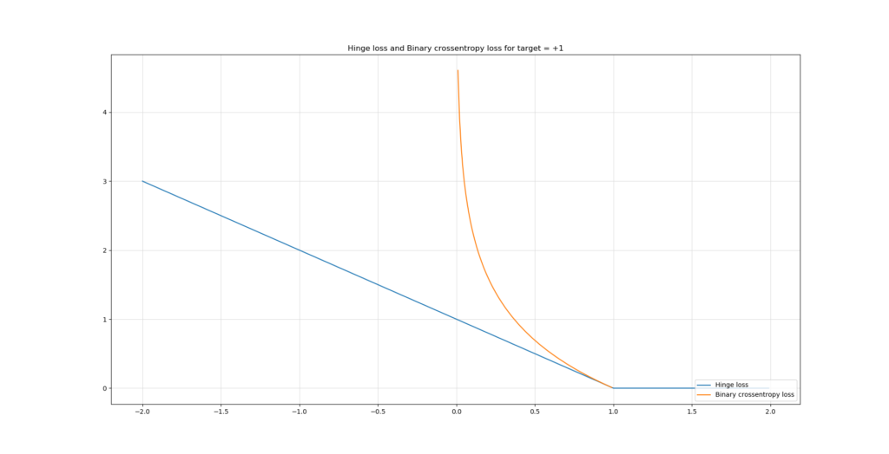
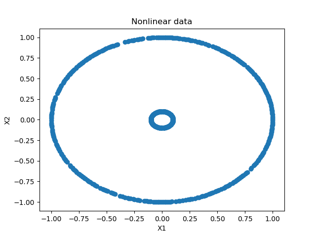
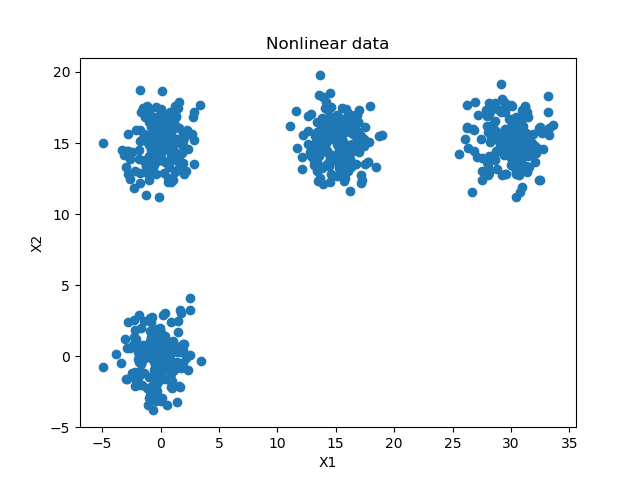
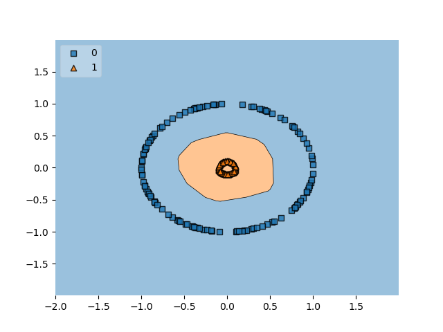
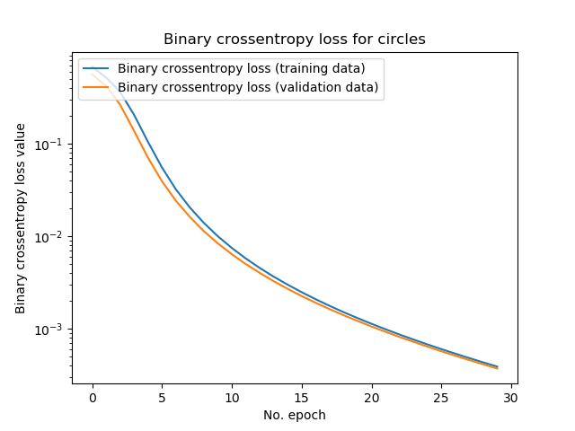
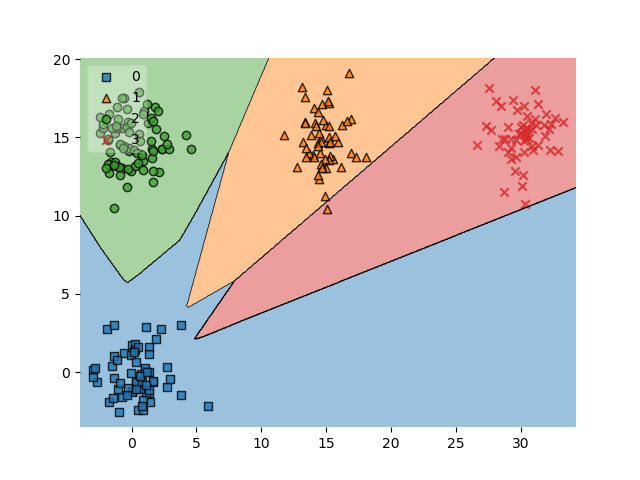
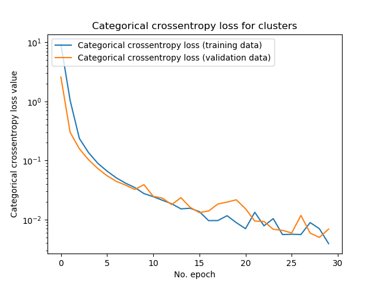

Recently, I've been covering many of the deep learning [loss functions](https://www.machinecurve.com/index.php/2019/10/04/about-loss-and-loss-functions/) that can be used - by converting them into actual Python code with the Keras deep learning framework.

Today, in this post, we'll be covering _binary crossentropy_ and _categorical crossentropy_ - which are common loss functions for binary (two-class) classification problems and categorical (multi-class) classification problems.

Note that another post on [sparse categorical crossentropy](https://www.machinecurve.com/index.php/2019/10/06/how-to-use-sparse-categorical-crossentropy-in-keras/) extends this post, and particularly the categorical crossentropy one.

What we'll do today: first, we recap the maths and _intuition_ behind the two crossentropies, since it's imperative to understand them before we implement them. This includes a comparison between the cross-entropies and another type of loss function that can be used, being hinge loss.

We then continue, explaining what we need to run the models and introducing the datasets we'll use today (we generate them ourselves).

Subsequently, we cover the implementation for both the binary crossentropy Keras model and the categorical one - in detail. We discuss each individual block to ensure that you understand what happens in the code.

After reading this tutorial, you will understand...

- **What the binary and categorical crossentropy loss functions do.**
- **How to use binary crossentropy loss with TensorFlow 2 based Keras.**
- **How to use categorical crossentropy loss with TensorFlow 2 based Keras.**

Let's go! 😎

_Note that the full code for the models we create in this blog post is also available through my [Keras Loss Functions repository](https://github.com/christianversloot/keras-loss-functions) on GitHub._

* * *

**Update 09/Mar/2021:** updated the tutorial to use `CategoricalCrossentropy` loss without explicitly setting `Softmax` in the final layer, by using `from_logits = True`. This pushes computing the probability distribution into the categorical crossentropy loss function and is more stable numerically.

**Update 10/Feb/2021:** updated the tutorial to ensure that all code examples reflect TensorFlow 2 based Keras, so that they can be used with recent versions of the library.

* * *

\[toc\]

* * *

## Example code: binary & categorical crossentropy with TF2 and Keras

This example code shows quickly how to use **binary and categorical crossentropy loss with TensorFlow 2 and Keras**. You can easily copy it to your model code and use it within your neural network. However, if you want to understand the loss functions in more detail and why they should be applied to certain classification problems, make sure to read the rest of this tutorial as well 🚀

```
loss_function_used = 'binary_crossentropy' # or use categorical_crossentropy
model.compile(loss=loss_function_used, optimizer=tensorflow.keras.optimizers.Adam(lr=0.001), metrics=['accuracy'])
```

* * *

## Recap on the cross-entropies

As promised, we'll first provide some recap on the intuition (and a little bit of the maths) behind the cross-entropies. We start with the binary one, subsequently proceed with categorical crossentropy and finally discuss how both are different from e.g. hinge loss.

### Binary crossentropy for binary classification

Binary crossentropy in maths:


Don't let the maths scare you away... just read on! 😉

It can be visualized as follows:

- 
    
    Binary crossentropy, target = 1
    
- 
    
    Binary crossentropy, target = 0
    

Well, what you need to know first is this: **binary crossentropy** works with **binary classification problems**, which is a difficult term for the _simple observation_ that your sample either belongs to class one (e.g. "diabetes") or class zero ("no diabetes"). Binary classification in most cases boils down to a true/false problem, where you want to classify new samples into one class or another.

This also means that in your training set, each feature vector out of the many that your set contain (a feature vector contains the descriptive variables that together represent some relationship about the pattern you wish to discover) belongs to one of two targets: zero or one, or \[latex\]{ 0, 1 }\[/latex\].

Now, if we take a look at the [high-level machine learning process](https://www.machinecurve.com/index.php/2019/10/04/about-loss-and-loss-functions/#the-high-level-supervised-learning-process) for supervised learning problems (which classification belongs to), we see that training encompasses many _forward passes_ - you essentially feed your training set to the current model, generate predictions, compare them to the actual targets, compute a loss value (hey, that's what we cover today!) and subsequently optimize by slightly adapting the model's internals. That way, you hope that your model improves when you repeat the process, eventually finding a model that performs really well.

With this context, the equation above becomes a lot less scaring. First, let's introduce some additional information:

- The binary cross entropy is computed _for each sample_ once the prediction is made. That means that upon feeding many samples, you compute the binary crossentropy many times, subsequently e.g. adding all results together to find the final crossentropy value.
- The formula above therefore covers the binary crossentropy _per sample_.
- For an arbitrary forward pass, this means that the binary crossentropy requires two input values - `t`, which is the actual target value for the sample (thus either zero or one) and `p`, which is the prediction generated by the model (likely anything between zero and one if you used the correct [activation function](https://www.machinecurve.com/index.php/2019/09/04/relu-sigmoid-and-tanh-todays-most-used-activation-functions/) in your final layer).
- Now, feeding `t` and `p` to the logarithmic function above generates the curves visualized above - which, intuitively interpreted, simply tell you that loss increases the further your `p` moves away from the actual `t`. The loss increases increasingly the further you're away, which means that false predictions are not only penalized, but that _confident false predictions_ (e.g. ones that are really off) are penalized more significantly than less confident mistakes.

Hope you now understand the binary crossentropy intuitively 😄

### Categorical crossentropy for multiclass classification

Next up: categorical crossentropy.

While _binary crossentropy_ can be used for _binary_ classification problems, not many classification problems are binary. Take for example the problems where the answer is not a true/false question implicitly, such as "diabetes" or "no diabetes". The MNIST dataset is a clear example: there are [10 possible classes](https://www.machinecurve.com/index.php/2019/09/17/how-to-create-a-cnn-classifier-with-keras/).

In that case, binary crossentropy cannot be used.

Enter categorical crossentropy!


Again, don't let the maths scare you away 😊

The equation looks slightly more complex, and it is, but we can once again explain it extremely intuitively.

What you'll first have to understand that with _categorical_ crossentropy the targets must be _categorical_: that is, they cannot be integer-like (in the MNIST dataset the targets are integers ranging from 0-9) but must say for all possible classes whether the target belongs to the class or not.

We do so by converting the integer targets into _categorical format_, or vectorized format, like \[latex\]\[0, 0, 0, 1, 0, 0, 0, 0, 0, 0\]\[/latex\] for the MNIST dataset - this target represents class 3, by the way.

Similar to binary crossentropy, categorical crossentropy is computed for each sample and eventually merged together - hence, the formula above takes once again two inputs: prediction `p` and target `t`, where _both_ are categorical.

How can predictions be categorical? They cannot be converted into categorical format from numeric format, can they?

Well, you're right - but it's not exactly what happens. Instead of converting the data into categorical format, with categorical crossentropy we apply a categorical [activation function](https://www.machinecurve.com/index.php/2019/09/04/relu-sigmoid-and-tanh-todays-most-used-activation-functions/) (such as Softmax) which generates a _multiclass probability distribution_.

That's a difficult term which simply tells us that it outputs a vector (hence categorical format!) containing for each class the probability that the sample belongs to the class, all probabilities together being 1 (for 100%).

If for example we have a target \[latex\]\[0, 0, 1\]\[/latex\], a confident and well-trianed ML model would in that case output e.g. \[latex\]\[0, 0.05, 0.95\]\[/latex\], to give just one example.

Now that we understand that both inputs to categorical crossentropy are of categorical format, we can proceed with a scrutiny of the actual function.

For the sake of simplicity, here it is again:


The maths tell us that we iterate over all classes \[latex\]C\[/latex\] that our machine learning problem describes.

The maths tell us too that some _observation_ is used in the computation -- hence the \[latex\]o,c\[/latex\] with the `t` and `p`.

But what is an observation? We can look at this from the lens of the Sigma, or the loop / iteration, which simply iterates over all the possible classes.

On each iteration, the particular element in both the _target vector_ and the _prediction vector_ is inspected and used in the computation - that is what is meant with an _observation_: inspecting a particular value that is part of a bigger whole, in this case both categorical vectors.

For each observation, the logarithmic computation is made, which resembles the binary crossentropy one.

However, there is one interesting detail: for all \[latex\]t\[/latex\] unequal to the actual target value, the result of this computation is 0, since \[latex\]t\_{o,c}\[/latex\] is 0 in that case.

This way, categorical crossentropy allows us to compute the loss value for multiclass classification problems - while remaining flexible _with respect to the actual target class_.

### Crossentropy vs hinge loss

As we've seen theoretically and will see practically, crossentropy loss can be successfully used in classification problems.

We'll now briefly look at a different question: **why use crossentropy loss and not hinge loss?** That is, [binary hinge](https://www.machinecurve.com/index.php/2019/10/15/how-to-use-hinge-squared-hinge-loss-with-keras/) and [multiclass hinge](https://www.machinecurve.com/index.php/2019/10/17/how-to-use-categorical-multiclass-hinge-with-keras/) loss can both be used as well instead of binary and multiclass crossentropy.

Here, we see hinge loss and binary crossentropy loss plotted together:

[](https://www.machinecurve.com/wp-content/uploads/2019/10/hinge_binary.png)

Although you'll have to find out which one works best for your ML problem by means of experimentation, these are some points as to the differences of hinge loss and crossentropy loss:

- Hinge loss will attempt to maximize the margin between your classes, whereas crossentropy loss will attempt to maximize the likelihood of the prediction being the target class (Varma, n.d.). This is a fundamentally different approach: cross entropy requires a probability distribution while hinge loss does not (Why Isn't Cross Entropy Used in SVM?, n.d.).
- However, both are reported to perform as well as each other( What loss function should I use for binary detection in face/non-face detection in CNN?, n.d.).
- In terms of interpreting the outputs, you'll likely prefer the crossentropy outputs since they tell you something about how likely the sample belongs to one class. In the binary case, the real number between 0 and 1 tells you something about the binary case, whereas the categorical prediction tells you something about the multiclass case. Hinge loss just generates a number, but does not compare the classes (softmax+cross entropy v.s. square regularized hinge loss for CNNs, n.d.).
- However, hinge loss - which is simply a \[latex\]max()\[/latex\] function, is easier to compute than crossentropy loss computationally, which requires computing logarithms (Tay, n.d.). The same applies to its derivative: the derivative of a logarithm is more complex than the derivative of a maximum function, which can be rewritten as a [piecewise function](https://ell.stackexchange.com/questions/14700/what-is-the-name-of-the-branched-function-maths-in-correct-english). Hence, you'll get results faster when using hinge loss: "If you need real time decisions with a lesser \[sic\] accuracy depend on it" (Caliskan, n.d.). For crossentropy: "If you have any sexy idea like deep learning try to understand it."
- Hinge loss also introduces sparsity into your machine learning problem, while crossentropy loss does not (Tay, n.d.).

So in short: if you'll favor sparsity and are not interested in maximum likelihood estimation (in plainer English: if you have a true/false problem, or a one-of-easily-separable-classes problem), it's likely that you'll gain faster and adequate results with hinge loss. Give it a try. If it doesn't work well, switch to crossentropy loss, as "just using this loss function to train your ML model will make it work relatively well" (Pham, n.d.).

**If you wish to dive deeper into these losses, take a look at those articles:**

- [About loss and loss functions](https://machinecurve.com/index.php/2019/10/04/about-loss-and-loss-functions/)
- [How to use sparse categorical crossentropy in Keras?](https://www.machinecurve.com/index.php/2019/10/06/how-to-use-sparse-categorical-crossentropy-in-keras/)
- [How to use hinge & squared hinge loss with Keras?](https://www.machinecurve.com/index.php/2019/10/15/how-to-use-hinge-squared-hinge-loss-with-keras/)
- [How to use categorical / multiclass hinge with Keras?](https://www.machinecurve.com/index.php/2019/10/17/how-to-use-categorical-multiclass-hinge-with-keras/)

* * *

## Let's build some Keras models!

Enough theory for now - let's create something! 😎

### What you'll need to run them

If you want to run the model, you'll need to install these dependencies first:

- **Python**, since we'll run everything in this language. You need Python 3.8+ to make it work.
- **TensorFlow 2.x**, which is the deep learning framework of our choice today. It includes `tensorflow.keras`, which are the tightly coupled APIs for Keras.
- **Matplotlib**, for visualizing the dataset.
- **Numpy**, for processing numbers and data.
- **Scikit-learn**, for generating the simple dataset that we will use today.
- **Mlxtend**, which you can use to visualize the [decision boundary](https://www.machinecurve.com/index.php/2019/10/11/how-to-visualize-the-decision-boundary-for-your-keras-model/) of your model.

### Today's datasets

We use two simple datasets today - a **circles** dataset for the binary classification problem and a **clusters** dataset for the multiclass one.

We generate them with Scikit-learn and use these simple ones on purpose, because we don't want to distract you from the goal of today's blog post - which is to create Keras models _with particular loss functions_. The goal is not to clean data whatsoever, so we use simple datasets that are easily separable.

Before we proceed to dissecting the code, we'll show you the datasets first.

This is the _circles_ dataset from our _binary_ classification scenario:

[](https://www.machinecurve.com/wp-content/uploads/2019/10/22_bce_circles.png)

And this is the _clusters_ one from our _multiclass_ scenario:



* * *

## Binary crossentropy Keras model

Let's now create the Keras model using binary crossentropy. Open up some folder in your File Explorer (whether Apple, Windows or Linux 😉 - I just don't know all the names of the explorers in the different OSes) and create a file called `binary-cross-entropy.py`. Open up the file in some code editor and yep, we can write some code 😄

### Imports

First, we'll have to import everything we need to run the model:

```
'''
  TensorFlow 2 based Keras model discussing Binary Cross Entropy loss.
'''
import tensorflow
from tensorflow.keras.models import Sequential
from tensorflow.keras.layers import Dense
from tensorflow.keras.losses import BinaryCrossentropy
import matplotlib.pyplot as plt
import numpy as np
from sklearn.datasets import make_circles
from mlxtend.plotting import plot_decision_regions
```

As discussed, we're using Keras, Matplotlib, Numpy, Scikit-learn and Mlxtend. We use the Keras Sequential API for stacking our model's layers and use densely-connected layers, or Dense layers, only. We use the PyPlot library from Matplotlib, `make_circles` from Scikit-learn and `plot_decision_regions` from Mlxtend, which we use to visualize the decision boundary of our model later.

### Model configuration

Next, we specify some model configuration options:

```
# Configuration options
num_samples_total = 1000
training_split = 250
loss_function_used = BinaryCrossentropy()
```

Our `make_circles` call will generate 1000 samples in total, of which 250 will be set apart for training data. We will use `BinaryCrossentropy` as our loss function, which is not surprising.

### Dataset generation, preparation & visualization

Next, we generate the dataset:s

```
# Generate data
X, targets = make_circles(n_samples = num_samples_total, factor=0.1)
X_training = X[training_split:, :]
X_testing = X[:training_split, :]
Targets_training = targets[training_split:]
Targets_testing = targets[:training_split]
```

First, we call `make_circles` and generate the 1000 samples. Our `factor`, or the distance between the two circles, is 0.1 - which means that the circles are relatively far apart. This benefits separability and hence makes the learning problem easier (which benefits this blog post for the sake of simplicity).

Next, we split data into training and testing data, before we move on to data visualization:

```
# Generate scatter plot for training data
plt.scatter(X_training[:,0], X_training[:,1])
plt.title('Nonlinear data')
plt.xlabel('X1')
plt.ylabel('X2')
plt.show()
```

These Matplotlib calls produce the visualization that we saw before:

[](https://www.machinecurve.com/wp-content/uploads/2019/10/22_bce_circles.png)

The only thing left before we can create the model architecture is the specification of the _shape_ of our input feature vector. Shape is meant literally here: what does the vector look like? How many dimensions does the vector have and how many elements will be covered by each dimension? Images, for example, are two-dimensional, videos three-dimensional and sound waves one-dimensional.

In our case, we'll use a one-dimensional feature vector with a shape of (2, ) - one dimension, two elements in that dimension (the X and Y values represented in the visualization above).

This looks as follows when coded:

```
# Set the input shape
feature_vector_shape = len(X_training[0])
input_shape = (feature_vector_shape,)
```

### Model architecture & configuration

Next, we can actually create the architecture of our model:

```
# Create the model
model = Sequential()
model.add(Dense(12, input_shape=input_shape, activation='relu', kernel_initializer='he_uniform'))
model.add(Dense(8, activation='relu', kernel_initializer='he_uniform'))
model.add(Dense(1, activation='sigmoid'))
```

It's a really simple one. We use the Keras Sequential API which allows us to stack the layers nicely. We use four layers, of which two are hidden. The first hidden layer has twelve neurons, the ReLU [activation function](https://www.machinecurve.com/index.php/2019/09/04/relu-sigmoid-and-tanh-todays-most-used-activation-functions/) and hence the He uniform [initialization](https://www.machinecurve.com/index.php/2019/09/16/he-xavier-initialization-activation-functions-choose-wisely/). The `input_shape` represents the input to this layer, and hence the structure of the first layer (being the input layer) of your neural network.

A similar design is used for the second layer, although our data will be slightly more abstract now and I feel like 8 neurons are enough. This is often a process of trial and error: you don't want to create information bottlenecks by squeezing all information into very few neurons, but you also don't want to use way too many, since the model may not be able to summarize enough and hence might produce degraded performance.

The final layer has just one output neuron, which produces one value - indeed, that prediction between zero and one. The Sigmoid function is capable of producing this output: with a range of (0, 1), it converts any input to a value in that interval. We now have an architecture that allows us to separate two classes. Let's move on to model configuration.

[](https://www.machinecurve.com/wp-content/uploads/2019/05/sigmoid.png)

The Sigmoid activation function produces outputs between zero and one.

Configuring the model means applying the _hyperparameters_, or the configuration settings. We do this next:

```
# Configure the model and start training
model.compile(loss=loss_function_used, optimizer=tensorflow.keras.optimizers.Adam(lr=0.001), metrics=['accuracy'])
history = model.fit(X_training, Targets_training, epochs=30, batch_size=5, verbose=1, validation_split=0.2)
```

Particularly, we specify the loss function used, as well as the optimizer (Adam, since it's the default optimizer with relatively good performance across many ML problems) and possibly some additional metrics - such as accuracy in our case, since humans can interpret accuracy more intuitively than e.g. Crossentropy loss.

Next, we fit the data to the model architecture. This actually starts the training process. We train for 30 iterations, or epochs, with a batch size of 5 - which benefits the memory used. Verbosity is set to `true` so that we can see full model output and 20% of the training data is used for validation purposes. Since all data is randomly shuffled upon creation, we do not need to worry about certain biases here, nor with the training/test split.

### Model testing & visualization

The training process will evaluate model performance continuously during training. However, this is the model's _predictive power_, i.e. how well it performs against data it has seen before (or based on which it has optimized, i.e. the validation dataset).

However, in order to make the model useful to the real world, it must also work well against data it has _never seen before_. You cannot include all possible data in your training set and you don't want your model to be very off when you use it in the real world, simply because it was trained against the training set data too much.

That's why you generate a _testing set_, which you can use to evaluate the model's _generalization performance_ afterwards. We can do that in Keras by calling the `evaluate` call on the `model` instance:

```
# Test the model after training
test_results = model.evaluate(X_testing, Targets_testing, verbose=1)
print(f'Test results - Loss: {test_results[0]} - Accuracy: {test_results[1]*100}%')
```

Next, we [plot the decision boundary](https://www.machinecurve.com/index.php/2019/10/11/how-to-visualize-the-decision-boundary-for-your-keras-model/) for our model with the _testing data_ to see how well it performs, once again with data it has never seen before:

```
# Plot decision boundary
plot_decision_regions(X_testing, Targets_testing, clf=model, legend=2)
plt.show()
```

And we [plot the model's training process history](https://www.machinecurve.com/index.php/2019/10/08/how-to-visualize-the-training-process-in-keras/), to find out whether it has improved, whether it can still improve any further and whether it is not overfitting:

```
# Visualize training process
plt.plot(history.history['loss'], label='Binary crossentropy loss (training data)')
plt.plot(history.history['val_loss'], label='Binary crossentropy loss (validation data)')
plt.title('Binary crossentropy loss for circles')
plt.ylabel('Binary crossentropy loss value')
plt.yscale('log')
plt.xlabel('No. epoch')
plt.legend(loc="upper left")
plt.show()
```

Click one or both of the two links above if you wish to understand the visualization code in more detail.

### The results

Now that we have the full code, we can actually run it to find out how well it performs. Let's open up a Python terminal, e.g. an Anaconda prompt or your regular terminal, `cd` to the folder and execute `python binary-cross-entropy.py`.

The training process will then start and eventually finish, while you'll see a visualization of the data you generated first. The outputs will be something like this:

[](https://www.machinecurve.com/wp-content/uploads/2019/10/22_bce_db.png)

As you can see, with binary crossentropy, the Keras model has learnt to generate a decision boundary that allows us to distinguish between both classes accurately. This is unsurprising, since we allowed the circles to be very well separable, and this is represented in model history:

[](https://www.machinecurve.com/wp-content/uploads/2019/10/22_bce_history.png)

... when 30 epochs passed, the model was still improving, also when tested with validation data. Hence, it was not overfitting yet - unsurprising again given the separability of our circles. This was once again confirmed by the _test set evaluation_ which produced an accuracy of 100% - as illustrated in the plot with the decision boundary.

### Whole model code

If you wish to copy the whole model at once, here you go:

```
'''
  TensorFlow 2 based Keras model discussing Binary Cross Entropy loss.
'''
import tensorflow
from tensorflow.keras.models import Sequential
from tensorflow.keras.layers import Dense
from tensorflow.keras.losses import BinaryCrossentropy
import matplotlib.pyplot as plt
import numpy as np
from sklearn.datasets import make_circles
from mlxtend.plotting import plot_decision_regions

# Configuration options
num_samples_total = 1000
training_split = 250
loss_function_used = BinaryCrossentropy()

# Generate data
X, targets = make_circles(n_samples = num_samples_total, factor=0.1)
X_training = X[training_split:, :]
X_testing = X[:training_split, :]
Targets_training = targets[training_split:]
Targets_testing = targets[:training_split]

# Generate scatter plot for training data
plt.scatter(X_training[:,0], X_training[:,1])
plt.title('Nonlinear data')
plt.xlabel('X1')
plt.ylabel('X2')
plt.show()

# Set the input shape
feature_vector_shape = len(X_training[0])
input_shape = (feature_vector_shape,)

# Create the model
model = Sequential()
model.add(Dense(12, input_shape=input_shape, activation='relu', kernel_initializer='he_uniform'))
model.add(Dense(8, activation='relu', kernel_initializer='he_uniform'))
model.add(Dense(1, activation='sigmoid'))

# Configure the model and start training
model.compile(loss=loss_function_used, optimizer=tensorflow.keras.optimizers.Adam(lr=0.001), metrics=['accuracy'])
history = model.fit(X_training, Targets_training, epochs=30, batch_size=5, verbose=1, validation_split=0.2)

# Test the model after training
test_results = model.evaluate(X_testing, Targets_testing, verbose=1)
print(f'Test results - Loss: {test_results[0]} - Accuracy: {test_results[1]*100}%')

# Plot decision boundary
plot_decision_regions(X_testing, Targets_testing, clf=model, legend=2)
plt.show()

# Visualize training process
plt.plot(history.history['loss'], label='Binary crossentropy loss (training data)')
plt.plot(history.history['val_loss'], label='Binary crossentropy loss (validation data)')
plt.title('Binary crossentropy loss for circles')
plt.ylabel('Binary crossentropy loss value')
plt.yscale('log')
plt.xlabel('No. epoch')
plt.legend(loc="upper left")
plt.show()
```

* * *

## Categorical crossentropy Keras model

Let's now move on with the categorical crossentropy case. I won't cover repetitive details here, such as why we need certain imports. If you wish to understand the whys here in more detail, please refer to the previous part about binary crossentropy. Where new details arise, I will obviously cover them.

We implement the categorical crossentropy variant by creating a file called `categorical-cross-entropy.py` in a code editor. Let's start! 😎

### Imports

We first put in place the imports:

```
'''
  TensorFlow 2 based Keras model discussing Categorical Cross Entropy loss.
'''
import tensorflow
from tensorflow.keras.models import Sequential
from tensorflow.keras.layers import Dense
from tensorflow.keras.losses import CategoricalCrossentropy
from tensorflow.keras.utils import to_categorical
import matplotlib.pyplot as plt
import numpy as np
from sklearn.datasets import make_blobs
from mlxtend.plotting import plot_decision_regions
```

Instead of `make_circles` as with the binary crossentropy model, we'll use `make_blobs` here - it allows us to make clusters of data instead of to draw two circles. Additionally, we import `to_categorical` from `keras.utils`, which ensures that we can convert our integer targets into categorical format.

### Model configuration

Next, we specify the configuration of our model:

```
# Configuration options
num_samples_total = 1000
training_split = 250
cluster_centers = [(15,0), (15,15), (0,15), (30,15)]
num_classes = len(cluster_centers)
loss_function_used = CategoricalCrossentropy(from_logits=True)
```

In particular, `cluster_centers` and `num_classes` are new while the loss function used has changed into `CategoricalCrossentropy`. We set `from_logits = True` because of Softmax constraints - we'll come back to that later. `cluster_centers` describes the centers of the, in this case, four clusters across the two dimensions of the space in which we visualize the clusters.

If you wish, you can increase the number of clusters, reduce the number of clusters, relocate the clusters - keeping them easily separable or reducing or even removing separability, to see how the model performs. I really suggest you do this to get additional intuition for how generation of decision boundaries performs!

`num_classes` is simply the length of the `cluster_centers` list, since the clusters must actually be created 😉

### Dataset generation, preparation & visualization

Dataset generation is similar to the binary case but different at two essential points:

```
# Generate data
X, targets = make_blobs(n_samples = num_samples_total, centers = cluster_centers, n_features = num_classes, center_box=(0, 1), cluster_std = 1.5)
categorical_targets = to_categorical(targets)
X_training = X[training_split:, :]
X_testing = X[:training_split, :]
Targets_training = categorical_targets[training_split:]
Targets_testing = categorical_targets[:training_split].astype(np.int32)
```

First, as introduced earlier, we use `make_blobs` instead of `make_circles`. This requires us to use additional variables such as `n_samples` (`num_classes`), `centers` (`cluster_centers`) and other configuration options such as `cluster_std`, which determines how big the clusters are (by setting their standard deviation from the cluster's center).

Additionally, we convert targets into categorical format by applying `to_categorical` before we split them into training and testing targets.

Setting the shape remains identical, but is still required:

```
# Set shape based on data
feature_vector_length = len(X_training[0])
input_shape = (feature_vector_length,)
print(f'Feature shape: {input_shape}')
```

The same applies to the visualization code for the dataset:

```
# Generate scatter plot for training data
plt.scatter(X_training[:,0], X_training[:,1])
plt.title('Nonlinear data')
plt.xlabel('X1')
plt.ylabel('X2')
plt.show()
```

### Model architecture & configuration

We use the same architecture, except for the output layer:

```
# Create the model
model = Sequential()
model.add(Dense(12, input_shape=input_shape, activation='relu', kernel_initializer='he_uniform'))
model.add(Dense(8, activation='relu', kernel_initializer='he_uniform'))
model.add(Dense(num_classes, activation='linear'))
```

We remember from the intuitive introduction to binary and categorical crossentropy that, contrary to the binary case, categorical crossentropy produces a _multiclass probability distribution_, or the relative likelihood that the sample belongs to any of the classes within your ML problem.

Hence, we must:

1. Find an activation function that supports this. The Sigmoid function generates an integer value between zero and one, which is no multiclass probability distribution. Fortunately, the **Softmax** activation function is capable of this. However, it's built into `CategoricalCrossentropy` loss if `from_logits = True`, and in fact, this is expected to be more numerically stable. That's why we activate _linearly_ here and set `from_logits` to `True` into our loss definition above.
2. Change the number of output neurons. Remember, we don't generate an _integer_ target anymore, but instead a _list_ of probabilities, one per class in the ML problem. Hence, you'll need `num_classes` neurons to generate the predictions by means of Softmax; in our case, that's 4 neurons.

We kept model compilation & data fitting the same:

```
# Configure the model and start training
model.compile(loss=loss_function_used, optimizer=tensorflow.keras.optimizers.Adam(lr=0.001), metrics=['accuracy'])
history = model.fit(X_training, Targets_training, epochs=30, batch_size=5, verbose=1, validation_split=0.2)
```

### Model testing & visualization

The same for model performance testing:

```
# Test the model after training
test_results = model.evaluate(X_testing, Targets_testing, verbose=1)
print(f'Test results - Loss: {test_results[0]} - Accuracy: {test_results[1]*100}%')
```

However, visualizing model performance is done a bit differently when it comes to [visualizing the decision boundaries](https://www.machinecurve.com/index.php/2019/10/11/how-to-visualize-the-decision-boundary-for-your-keras-model/). As we have seen in the [hinge loss case](https://www.machinecurve.com/index.php/2019/10/17/how-to-use-categorical-multiclass-hinge-with-keras/), Mlxtend does not support categorical data natively when plotting the model's decision boundaries. This was fixed with help of dr. Sebastian Raschka (see [https://github.com/rasbt/mlxtend/issues/607](https://github.com/rasbt/mlxtend/issues/607)), Mlxtend's creator, who provided additional code which converts the model into a model generating a non-categorical (i.e., integer) target data, even though it was trained to produce categorical data.

We therefore need to add this code next:

```
'''
  The Onehot2Int class is used to adapt the model so that it generates non-categorical data.
  This is required by the `plot_decision_regions` function.
  The code is courtesy of dr. Sebastian Raschka at https://github.com/rasbt/mlxtend/issues/607.
  Copyright (c) 2014-2016, Sebastian Raschka. All rights reserved. Mlxtend is licensed as https://github.com/rasbt/mlxtend/blob/master/LICENSE-BSD3.txt.
  Thanks!
'''
# No hot encoding version
class Onehot2Int(object):

    def __init__(self, model):
        self.model = model

    def predict(self, X):
        y_pred = self.model.predict(X)
        return np.argmax(y_pred, axis=1)

# fit keras_model
keras_model_no_ohe = Onehot2Int(model)

# Plot decision boundary
plot_decision_regions(X_testing, np.argmax(Targets_testing, axis=1), clf=keras_model_no_ohe, legend=3)
plt.show()
'''
  Finish plotting the decision boundary.
'''
```

It will allow us to generate the decision boundary plot 😄

Finally, we visualize the training process as we have done with the binary case:

```
# Visualize training process
plt.plot(history.history['loss'], label='Categorical crossentropy loss (training data)')
plt.plot(history.history['val_loss'], label='Categorical crossentropy loss (validation data)')
plt.title('Categorical crossentropy loss for clusters')
plt.ylabel('Categorical crossentropy loss value')
plt.yscale('log')
plt.xlabel('No. epoch')
plt.legend(loc="upper left")
plt.show()
```

### The results

As you can see in the decision plot visualization, the categorical crossentropy based model has been able to distinguish between the four classes quite accurately:

[](https://www.machinecurve.com/wp-content/uploads/2019/10/22_cce_db.png)

Only in the orange and read areas, there were some misclassifications. But well, that happens!

Loss is also going down, although less smoothly:

[](https://www.machinecurve.com/wp-content/uploads/2019/10/22_cce_history.png)

All in all, I'm happy with the performance of this model too 😄

### Whole model code

If you wish to obtain the whole model at once, you can find it here:

```
import tensorflow
from tensorflow.keras.models import Sequential
from tensorflow.keras.layers import Dense
from tensorflow.keras.losses import CategoricalCrossentropy
from tensorflow.keras.utils import to_categorical
import matplotlib.pyplot as plt
import numpy as np
from sklearn.datasets import make_blobs
from mlxtend.plotting import plot_decision_regions

# Configuration options
num_samples_total = 1000
training_split = 250
cluster_centers = [(15,0), (15,15), (0,15), (30,15)]
num_classes = len(cluster_centers)
loss_function_used = CategoricalCrossentropy(from_logits=True)

# Generate data
X, targets = make_blobs(n_samples = num_samples_total, centers = cluster_centers, n_features = num_classes, center_box=(0, 1), cluster_std = 1.5)
categorical_targets = to_categorical(targets)
X_training = X[training_split:, :]
X_testing = X[:training_split, :]
Targets_training = categorical_targets[training_split:]
Targets_testing = categorical_targets[:training_split].astype(np.int32)

# Set shape based on data
feature_vector_length = len(X_training[0])
input_shape = (feature_vector_length,)
print(f'Feature shape: {input_shape}')

# Generate scatter plot for training data
plt.scatter(X_training[:,0], X_training[:,1])
plt.title('Nonlinear data')
plt.xlabel('X1')
plt.ylabel('X2')
plt.show()

# Create the model
model = Sequential()
model.add(Dense(12, input_shape=input_shape, activation='relu', kernel_initializer='he_uniform'))
model.add(Dense(8, activation='relu', kernel_initializer='he_uniform'))
model.add(Dense(num_classes, activation='linear'))

# Configure the model and start training
model.compile(loss=loss_function_used, optimizer=tensorflow.keras.optimizers.Adam(lr=0.001), metrics=['accuracy'])
history = model.fit(X_training, Targets_training, epochs=30, batch_size=5, verbose=1, validation_split=0.2)

# Test the model after training
test_results = model.evaluate(X_testing, Targets_testing, verbose=1)
print(f'Test results - Loss: {test_results[0]} - Accuracy: {test_results[1]*100}%')

'''
  The Onehot2Int class is used to adapt the model so that it generates non-categorical data.
  This is required by the `plot_decision_regions` function.
  The code is courtesy of dr. Sebastian Raschka at https://github.com/rasbt/mlxtend/issues/607.
  Copyright (c) 2014-2016, Sebastian Raschka. All rights reserved. Mlxtend is licensed as https://github.com/rasbt/mlxtend/blob/master/LICENSE-BSD3.txt.
  Thanks!
'''
# No hot encoding version
class Onehot2Int(object):

    def __init__(self, model):
        self.model = model

    def predict(self, X):
        y_pred = self.model.predict(X)
        return np.argmax(y_pred, axis=1)

# fit keras_model
keras_model_no_ohe = Onehot2Int(model)

# Plot decision boundary
plot_decision_regions(X_testing, np.argmax(Targets_testing, axis=1), clf=keras_model_no_ohe, legend=3)
plt.show()
'''
  Finish plotting the decision boundary.
'''

# Visualize training process
plt.plot(history.history['loss'], label='Categorical crossentropy loss (training data)')
plt.plot(history.history['val_loss'], label='Categorical crossentropy loss (validation data)')
plt.title('Categorical crossentropy loss for clusters')
plt.ylabel('Categorical crossentropy loss value')
plt.yscale('log')
plt.xlabel('No. epoch')
plt.legend(loc="upper left")
plt.show()
```

* * *

## Summary

In this blog post, we did quite some things. We first covered the binary crossentropy and categorical crossentropy loss functions intuitively, explaning them - with some maths - in plain English. Subsequently, we provided two example implementations with the Keras deep learning framework.

I hope you've learnt something from this blog post! If you did, let me know - I would really appreciate your comments in the comment area below 👇 If you have questions, or if you feel like I made some mistakes, let me know! I'll happily answer you, to try and help you move forward, or improve the post. Thanks! 😊

_Note that the full code for the models we created in this blog post is also available through my [Keras Loss Functions repository](https://github.com/christianversloot/keras-loss-functions) on GitHub._

* * *

## References

About loss and loss functions – MachineCurve. (2019, October 15). Retrieved from [https://www.machinecurve.com/index.php/2019/10/04/about-loss-and-loss-functions/](https://www.machinecurve.com/index.php/2019/10/04/about-loss-and-loss-functions/)

Keras. (n.d.). Losses. Retrieved from [https://keras.io/losses/](https://keras.io/losses/)

Varma, R. (n.d.). Picking Loss Functions - A comparison between MSE, Cross Entropy, and Hinge Loss. Retrieved from [https://rohanvarma.me/Loss-Functions/](https://rohanvarma.me/Loss-Functions/)

Why Isn't Cross Entropy Used in SVM? (n.d.). Retrieved from [https://stats.stackexchange.com/a/284413](https://stats.stackexchange.com/a/284413)

What loss function should I use for binary detection in face/non-face detection in CNN? (n.d.). Retrieved from [https://stats.stackexchange.com/a/228668](https://stats.stackexchange.com/a/228668)

softmax+cross entropy v.s. square regularized hinge loss for CNNs. (n.d.). Retrieved from [https://stats.stackexchange.com/questions/299876/softmaxcross-entropy-v-s-square-regularized-hinge-loss-for-cnns#comment570017\_299876](https://stats.stackexchange.com/questions/299876/softmaxcross-entropy-v-s-square-regularized-hinge-loss-for-cnns#comment570017_299876)

Tay, J. (n.d.). Jonathan Tay's answer to What are the advantages of hinge loss over log loss? Retrieved from [https://www.quora.com/What-are-the-advantages-of-hinge-loss-over-log-loss/answer/Jonathan-Tay](https://www.quora.com/What-are-the-advantages-of-hinge-loss-over-log-loss/answer/Jonathan-Tay)

Caliskan, K. (n.d.). Kerem Caliskan's answer to What is the advantage/disadvantage of Hinge-loss compared to cross-entropy? Retrieved from [https://www.quora.com/What-is-the-advantage-disadvantage-of-Hinge-loss-compared-to-cross-entropy/answer/Kerem-Caliskan](https://www.quora.com/What-is-the-advantage-disadvantage-of-Hinge-loss-compared-to-cross-entropy/answer/Kerem-Caliskan)

Pham, H. (n.d.). Hieu Pham's answer to When should you use cross entropy loss and why? Retrieved from [https://www.quora.com/When-should-you-use-cross-entropy-loss-and-why/answer/Hieu-Pham-20](https://www.quora.com/When-should-you-use-cross-entropy-loss-and-why/answer/Hieu-Pham-20)

Raschka, S. (n.d.). Home - mlxtend. Retrieved from [http://rasbt.github.io/mlxtend/](http://rasbt.github.io/mlxtend/)

Raschka, S. (2018). MLxtend: Providing machine learning and data science utilities and extensions to Python’s scientific computing stack. _Journal of Open Source Software_, _3_(24), 638. [doi:10.21105/joss.00638](https://joss.theoj.org/papers/10.21105/joss.00638)

StackOverflow. (n.d.). _From\_logits=True and from\_logits=False get different training result for tf.losses.CategoricalCrossentropy for UNet_. Stack Overflow. [https://stackoverflow.com/questions/57253841/from-logits-true-and-from-logits-false-get-different-training-result-for-tf-loss](https://stackoverflow.com/questions/57253841/from-logits-true-and-from-logits-false-get-different-training-result-for-tf-loss)

TensorFlow. (n.d.). _Tf.keras.losses.CategoricalCrossentropy_. [https://www.tensorflow.org/api\_docs/python/tf/keras/losses/CategoricalCrossentropy](https://www.tensorflow.org/api_docs/python/tf/keras/losses/CategoricalCrossentropy)
