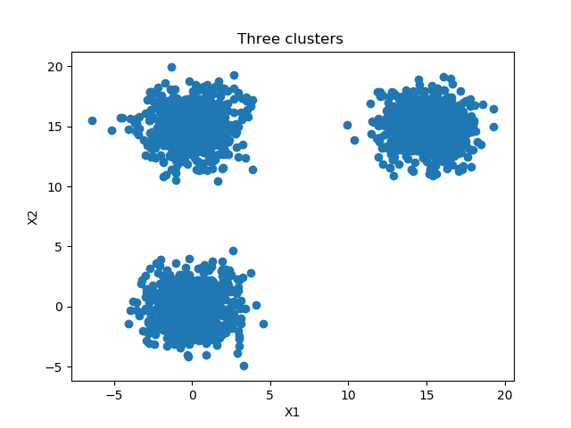
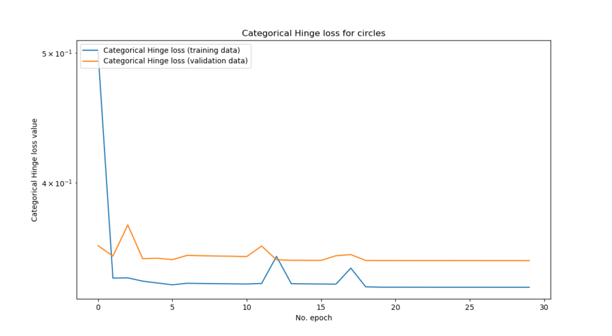

Recently, I've been looking into [loss functions](https://www.machinecurve.com/index.php/2019/10/04/about-loss-and-loss-functions/) - and specifically these questions: What is their purpose? How does the concept of loss work? And more practically, how can loss functions be implemented with the TensorFlow 2 based Keras framework for deep learning?

This resulted in blog posts that e.g. covered [huber loss](https://www.machinecurve.com/index.php/2019/10/12/using-huber-loss-in-keras/) and [hinge & squared hinge loss](https://www.machinecurve.com/index.php/2019/10/15/how-to-use-hinge-squared-hinge-loss-with-keras/). Today, in this tutorial, we'll extend the latter to multiclass classification: we cover **categorical hinge loss**, or multiclass hinge loss. How can categorical hinge / multiclass hinge be implemented with TF2 based Keras? That's what well find out today.

After reading this tutorial, you will understand...

- What it means to go from binary hinge loss to multiclass hinge loss.
- How categorical (multiclass) hinge loss works.
- How `tensorflow.keras.losses.CategoricalHinge` can be used in your TensorFlow 2 based Keras model.

Let's go! 😎

* * *

**Update 10/Feb/2021:** ensure that article is up to date. Code examples now reflect TensorFlow 2 ecosystem and have been upgraded from TensorFlow/Keras 1.x.

* * *

\[toc\]

* * *

## Code example: multiclass hinge loss with TensorFlow 2 based Keras

This code example demonstrates quickly **how to use categorical (multiclass) hinge loss with TensorFlow 2 based Keras**. You can use this in your model straight away. If you want to understand the background details for multiclass hinge, make sure to read the rest of this tutorial as well 🚀

```
loss_function_used = 'categorical_hinge'
model.compile(loss=loss_function_used, optimizer=optimizer_used, metrics=additional_metrics)
```

* * *

## From binary hinge to multiclass hinge

In that previous blog, we looked at _hinge loss_ and _squared hinge loss_ - which actually helped us to generate a decision boundary between two classes and hence a classifier, but yep - two classes only.

Hinge loss and squared hinge loss can be used for [binary classification problems](https://www.machinecurve.com/index.php/2020/10/19/3-variants-of-classification-problems-in-machine-learning/).

Unfortunately, many of today's problems aren't binary, but rather, multiclass: the number of possible target classes is \[latex\]> 2\[/latex\].

And hinge and squared hinge do not accommodate for this.

But **categorical hinge loss**, or multiclass hinge loss, does - and it is available in Keras!

* * *

## How does multiclass hinge work?

_Multiclass hinge_ was introduced by researchers Weston and Watkins (Wikipedia, 2011):


What this means in plain English is this:

**For a prediction \[latex\]y\[/latex\], take all \[latex\]y\[/latex\] values unequal to \[latex\]t\[/latex\], and compute the individual losses. Eventually, sum them together to find the multiclass hinge loss.**

The name _categorical hinge loss_, which is also used in place of multiclass hinge loss, already implies what's happening here:

We first convert our regular targets into categorical data. That is, if we have three possible target classes {0, 1, 2}, an arbitrary target (e.g. 2) would be converted into categorical format (in that case, \[latex\]\[0, 0, 1\]\[/latex\]).

Next, _for any sample_, our DL model generates a multiclass probability distribution over all possible target classes. That is, for the total probability of 100% (or, statistically, \[latex\]1\[/latex\]) it generates the probability that any of the possible categorical classes is the actual target class (in the scenario above, e.g. \[latex\]\[0.25, 0.25, 0.50\]\[/latex\] - which would mean _class two_, but with some uncertainty.

Computing the loss - the difference between _actual target and predicted targets_ - is then equal to computing the hinge loss for _taking the prediction for all the computed classes, except for the target class, since loss is always 0 there_. The hinge loss computation itself is similar to the [traditional hinge loss](https://www.machinecurve.com/index.php/2019/10/15/how-to-use-hinge-squared-hinge-loss-with-keras/).

Categorical hinge loss can be optimized as well and hence used for generating decision boundaries in multiclass machine learning problems. Let's now see how we can implement it with TensorFlow 2 based Keras.

* * *

## Today's dataset: extending the binary case

...which requires defining a dataset first :-)

In our post covering [traditional hinge loss](https://www.machinecurve.com/index.php/2019/10/15/how-to-use-hinge-squared-hinge-loss-with-keras/), we generated data ourselves because this increases simplicity.

We'll do so as well in today's blog. Specifically, we create a dataset with three separable clusters that looks as follows:

[](https://www.machinecurve.com/wp-content/uploads/2019/10/mh_3.png)

How? Let's find out.

First, open some folder and create a Python file where you'll write your code - e.g. `multiclass-hinge.py`.

Next, open a development environment as well as the file, and you can start coding 😊

### Importing software dependencies

First, we add the imports:

```
'''
  Keras model discussing Categorical (multiclass) Hinge loss.
'''
import tensorflow
from tensorflow.keras.models import Sequential
from tensorflow.keras.layers import Dense
from tensorflow.keras.utils import to_categorical
import matplotlib.pyplot as plt
import numpy as np
from sklearn.datasets import make_blobs
from mlxtend.plotting import plot_decision_regions
```

We need **TensorFlow 2** (`pip install tensorflow`) since we build the model by means of its APIs and functionalities. From its `tensorflow.keras` representation of [Keras](https://keras.io), we need:

- The **Sequential API**, which allows us to stack neural network layers;
- The **densely-connected layer type**, since we'll build our network by means of such layers.

We also need **Matplotlib** for generating visualizations of our dataset, **Numpy** for basic number processing, **Scikit-learn** for generating the dataset and **Mlxtend** for [visualizing the decision boundary](https://www.machinecurve.com/index.php/2019/10/11/how-to-visualize-the-decision-boundary-for-your-keras-model/) of our model.

### Model & data configuration

We next add some configuration options:

```
# Configuration options
num_samples_total = 3000
training_split = 1000
num_classes = 3
loss_function_used = 'categorical_hinge'
learning_rate_used = 0.03
optimizer_used = tensorflow.keras.optimizers.Adam(lr=learning_rate_used)
additional_metrics = ['accuracy']
num_epochs = 30
batch_size = 5
validation_split = 0.2 # 20%
```

The three clusters contain 3000 samples in total divided over three classes or clusters, as we saw in the image above. The `training_split` value is 1000, which means that 1000 samples are split off the training set to serve as testing data.

Next, we specify the hyper parameters. Obviously, we'll use categorical hinge loss. We set the learning rate to 0.03 since traditional hinge required a [more aggressive value](https://www.machinecurve.com/index.php/2019/10/15/how-to-use-hinge-squared-hinge-loss-with-keras/) contrary to 0.001, which is default in Keras. We use the Adam optimizer and configure it to use this learning rate, which is very common today since Adam is the de facto standard optimizer used in DL projects.

As an additional metric, we specify accuracy, as we have done before in many of our blog posts. Accuracy is more intuitively understandable to humans.

The model will train for 30 epochs with a batch size of 5 samples per forward pass, and 20% of the training data (2000 samples, hence 400 samples) will be used for validating each epoch as validation data.

### Generating a dataset

Next, we can generate the data:

```
# Generate data
X, targets = make_blobs(n_samples = num_samples_total, centers = [(0,0), (15,15), (0,15)], n_features = num_classes, center_box=(0, 1), cluster_std = 1.5)
categorical_targets = to_categorical(targets)
X_training = X[training_split:, :]
X_testing = X[:training_split, :]
Targets_training = categorical_targets[training_split:]
Targets_testing = categorical_targets[:training_split].astype(np.integer)

# Set shape based on data
feature_vector_length = len(X_training[0])
input_shape = (feature_vector_length,)
```

We use Scikit-learns `make_blobs` function to generate data. It simply does as it suggests: it generates blobs of data, or clusters of data, where you specify them to be. Specifically, it generates `num_samples_total` (3000, see model configuration section) in our case, splits them across three clusters centered at \[latex\]{ (0, 0), (15, 15), (0,15) }\[/latex\]. The standard deviation in a cluster is approximately 1.5 to ensure that they are actually separable.

Next, we must convert our target values (which are one of \[latex\]{ 0, 1, 2 }\[/latex\]) into [categorical format](https://www.machinecurve.com/index.php/2019/09/17/how-to-create-a-cnn-classifier-with-keras/#preparing-target-vectors-with-to_categorical) since our _categorical hinge loss_ requires categorical format (and hence no integer targets such as \[latex\]2\[/latex\], but categorical vectors like \[latex\]\[0, 0, 1\]\[/latex\].

Subsequently, we can split our feature vectors and target vectors according to the `training_split` we configured in our model configuration. Note that we add `.astype(np.integer`) to the testing targets. We do this because when visualizing categorical data, the Mlxtend library requires the vector contents to be _integers_ (instead of floating point numbers).

Finally, we set the `input_shape` based on the length of our feature vector, which originates from the training data.

### Visualizing our dataset

We can finally visualize the data we generated:

```
# Generate scatter plot for training data
plt.scatter(X_training[:,0], X_training[:,1])
plt.title('Three clusters ')
plt.xlabel('X1')
plt.ylabel('X2')
plt.show()
```

...which, as illustrated before, looks like this:

[](https://www.machinecurve.com/wp-content/uploads/2019/10/mh_3.png)

As illustrated before, this is what is generated 😎

We can work with this!

* * *

## Creating the multiclass hinge Keras model

### What you'll need to run this model

If you wish to run this model on your machine, you'll need to install some dependencies to make the code work. First of all, you need **Keras**, the deep learning framework with which this model is built. It's the most essential dependency and can be installed by installing **TensorFlow 2.x** today, e.g. [2.4.0](https://www.machinecurve.com/index.php/2020/11/05/saying-hello-to-tensorflow-2-4-0/). It is then available as `tensorflow.keras`.

Additionally, you'll need the de facto standard Python libraries Matplotlib, Numpy and Scikit-learn - they can be installed with `pip` quite easily.

Another package, which can also be installed with `pip`, is Sebastian Raschka's [](https://github.com/rasbt/mlxtend)[Mlxtend. We use it to visualize the decision boundary of our model.](https://github.com/rasbt/mlxtend)Creating the model architecture

We will create a very simple model today, a four-layered (two hidden layers, one input layer and one output layer) MLP:

```
# Create the model
model = Sequential()
model.add(Dense(4, input_shape=input_shape, activation='relu', kernel_initializer='he_uniform'))
model.add(Dense(2, activation='relu', kernel_initializer='he_uniform'))
model.add(Dense(num_classes, activation='tanh'))
```

More specifically, we use the Keras Sequential API which allows us to stack multiple layers on top of each other. We subsequently `add` the Dense or densely-connected layers; the first having four neurons, the second two, and the last `num_classes`, or three in our case. The hidden layers activate by means of the ReLU [activation function](https://www.machinecurve.com/index.php/2019/09/04/relu-sigmoid-and-tanh-todays-most-used-activation-functions/) and hence are initialized with [He uniform init](https://www.machinecurve.com/index.php/2019/09/16/he-xavier-initialization-activation-functions-choose-wisely/). The last layer activates with tanh.

### Model configuration & training

Next, we configure the model and start the training process:

```
# Configure the model and start training
model.compile(loss=loss_function_used, optimizer=optimizer_used, metrics=additional_metrics)
history = model.fit(X_training, Targets_training, epochs=num_epochs, batch_size=batch_size, verbose=1, validation_split=validation_split)
```

It's as simple as calling `model.compile` with the settings that we configured under model configuration, followed by `model.fit` which fits the training data to the model architecture specified above. The training history is saved in the `history` object which we can use for [visualization purposes](https://www.machinecurve.com/index.php/2019/10/08/how-to-visualize-the-training-process-in-keras/).

Next, we must add some more code for testing the model's ability to generalize to data it hasn't seen before.

* * *

## Model performance

### Generalization power with testing set

In order to test model performance, we add some code that evaluates the model with the testing set:

```
# Test the model after training
test_results = model.evaluate(X_testing, Targets_testing, verbose=1)
print(f'Test results - Loss: {test_results[0]} - Accuracy: {test_results[1]*100}%')
```

What it will do is this: it takes the testing data (both features and targets) and feeds them through the model, comparing predicted target with the actual prediction. Since the model has never seen the data before, it tells us something about the degree of overfitting that occurred during training. When the model performs well during validation _but also during testing_, it's useful to practice.

### Visualizing the decision boundary

[Visualizing the decision boundaries](https://www.machinecurve.com/index.php/2019/10/11/how-to-visualize-the-decision-boundary-for-your-keras-model/) of the model (remember, we have a three-class classification problem!) is the next step.

I must admit, I had a little help from dr. Sebastian Raschka here, the creator of Mlxtend (also see [https://github.com/rasbt/mlxtend/issues/607](https://github.com/rasbt/mlxtend/issues/607)). As noted before, we had to convert our targets into categorical format, or e.g. \[latex\]target = 2\[/latex\] into \[latex\]target = \[0, 0, 1\]\[/latex\]. Mlxtend does not natively support this, but fortunately, Raschka helped out by creating a helper class that embeds the model yet converts the way it makes predictions (back into non-categorical format). This looks as follows:

```
'''
  The Onehot2Int class is used to adapt the model so that it generates non-categorical data.
  This is required by the `plot_decision_regions` function.
  The code is courtesy of dr. Sebastian Raschka at https://github.com/rasbt/mlxtend/issues/607.
  Copyright (c) 2014-2016, Sebastian Raschka. All rights reserved. Mlxtend is licensed as https://github.com/rasbt/mlxtend/blob/master/LICENSE-BSD3.txt.
  Thanks!
'''
# No hot encoding version
class Onehot2Int(object):

    def __init__(self, model):
        self.model = model

    def predict(self, X):
        y_pred = self.model.predict(X)
        return np.argmax(y_pred, axis=1)

# fit keras_model
keras_model_no_ohe = Onehot2Int(model)

# Plot decision boundary
plot_decision_regions(X_testing, np.argmax(Targets_testing, axis=1), clf=keras_model_no_ohe, legend=3)
plt.show()
'''
  Finish plotting the decision boundary.
'''
```

### Visualizing the training process

Finally, we can [visualize the training process](https://www.machinecurve.com/index.php/2019/10/08/how-to-visualize-the-training-process-in-keras/) itself by adding some extra code - which essentially plots the Keras `history` object with Matplotlib:

```
# Visualize training process
plt.plot(history.history['loss'], label='Categorical Hinge loss (training data)')
plt.plot(history.history['val_loss'], label='Categorical Hinge loss (validation data)')
plt.title('Categorical Hinge loss for circles')
plt.ylabel('Categorical Hinge loss value')
plt.yscale('log')
plt.xlabel('No. epoch')
plt.legend(loc="upper left")
plt.show()
```

### How does the model perform?

Now that we've completed our code, we can actually run the model!

Open up a terminal where you have access to the software dependencies required to run the code, `cd` to the directory where your file is located, and execute e.g. `python multiclass-hinge.py`.

After the visualization of your dataset (with the three clusters), you'll see the training process run and complete - as well as model evaluation with the testing set:

```
Epoch 1/30
2019-10-16 19:39:12.492536: I tensorflow/stream_executor/platform/default/dso_loader.cc:44] Successfully opened dynamic library cublas64_100.dll
1600/1600 [==============================] - 1s 906us/step - loss: 0.5006 - accuracy: 0.6950 - val_loss: 0.3591 - val_accuracy: 0.6600
Epoch 2/30
1600/1600 [==============================] - 1s 603us/step - loss: 0.3397 - accuracy: 0.6681 - val_loss: 0.3528 - val_accuracy: 0.6500
Epoch 3/30
1600/1600 [==============================] - 1s 615us/step - loss: 0.3398 - accuracy: 0.6681 - val_loss: 0.3721 - val_accuracy: 0.7425
Epoch 4/30
1600/1600 [==============================] - 1s 617us/step - loss: 0.3379 - accuracy: 0.8119 - val_loss: 0.3512 - val_accuracy: 0.8500
Epoch 5/30
1600/1600 [==============================] - 1s 625us/step - loss: 0.3368 - accuracy: 0.8869 - val_loss: 0.3515 - val_accuracy: 0.8600
Epoch 6/30
1600/1600 [==============================] - 1s 608us/step - loss: 0.3358 - accuracy: 0.8906 - val_loss: 0.3506 - val_accuracy: 0.9325
Epoch 7/30
1600/1600 [==============================] - 1s 606us/step - loss: 0.3367 - accuracy: 0.9344 - val_loss: 0.3532 - val_accuracy: 0.9375
Epoch 8/30
1600/1600 [==============================] - 1s 606us/step - loss: 0.3365 - accuracy: 0.9375 - val_loss: 0.3530 - val_accuracy: 0.9425
Epoch 9/30
1600/1600 [==============================] - 1s 625us/step - loss: 0.3364 - accuracy: 0.9419 - val_loss: 0.3528 - val_accuracy: 0.9475
Epoch 10/30
1600/1600 [==============================] - 1s 627us/step - loss: 0.3364 - accuracy: 0.9450 - val_loss: 0.3527 - val_accuracy: 0.9500
Epoch 11/30
1600/1600 [==============================] - 1s 606us/step - loss: 0.3363 - accuracy: 0.9506 - val_loss: 0.3525 - val_accuracy: 0.9525
Epoch 12/30
1600/1600 [==============================] - 1s 642us/step - loss: 0.3366 - accuracy: 0.9425 - val_loss: 0.3589 - val_accuracy: 0.6475
Epoch 13/30
1600/1600 [==============================] - 1s 704us/step - loss: 0.3526 - accuracy: 0.8606 - val_loss: 0.3506 - val_accuracy: 0.9850
Epoch 14/30
1600/1600 [==============================] - 1s 699us/step - loss: 0.3364 - accuracy: 0.9925 - val_loss: 0.3502 - val_accuracy: 0.9875
Epoch 15/30
1600/1600 [==============================] - 1s 627us/step - loss: 0.3363 - accuracy: 0.9944 - val_loss: 0.3502 - val_accuracy: 0.9875
Epoch 16/30
1600/1600 [==============================] - 1s 670us/step - loss: 0.3363 - accuracy: 0.9937 - val_loss: 0.3502 - val_accuracy: 0.9875
Epoch 17/30
1600/1600 [==============================] - 1s 637us/step - loss: 0.3362 - accuracy: 0.9694 - val_loss: 0.3530 - val_accuracy: 0.9400
Epoch 18/30
1600/1600 [==============================] - 1s 637us/step - loss: 0.3456 - accuracy: 0.9744 - val_loss: 0.3537 - val_accuracy: 0.9825
Epoch 19/30
1600/1600 [==============================] - 1s 635us/step - loss: 0.3347 - accuracy: 0.9975 - val_loss: 0.3501 - val_accuracy: 0.9950
Epoch 20/30
1600/1600 [==============================] - 1s 644us/step - loss: 0.3344 - accuracy: 0.9994 - val_loss: 0.3501 - val_accuracy: 0.9950
Epoch 21/30
1600/1600 [==============================] - 1s 655us/step - loss: 0.3344 - accuracy: 0.9994 - val_loss: 0.3501 - val_accuracy: 0.9950
Epoch 22/30
1600/1600 [==============================] - 1s 636us/step - loss: 0.3344 - accuracy: 0.9994 - val_loss: 0.3501 - val_accuracy: 0.9950
Epoch 23/30
1600/1600 [==============================] - 1s 648us/step - loss: 0.3344 - accuracy: 0.9994 - val_loss: 0.3501 - val_accuracy: 0.9950
Epoch 24/30
1600/1600 [==============================] - 1s 655us/step - loss: 0.3344 - accuracy: 0.9994 - val_loss: 0.3501 - val_accuracy: 0.9950
Epoch 25/30
1600/1600 [==============================] - 1s 656us/step - loss: 0.3344 - accuracy: 0.9994 - val_loss: 0.3501 - val_accuracy: 0.9950
Epoch 26/30
1600/1600 [==============================] - 1s 641us/step - loss: 0.3344 - accuracy: 0.9994 - val_loss: 0.3501 - val_accuracy: 0.9950
Epoch 27/30
1600/1600 [==============================] - 1s 644us/step - loss: 0.3344 - accuracy: 0.9994 - val_loss: 0.3500 - val_accuracy: 0.9950
Epoch 28/30
1600/1600 [==============================] - 1s 666us/step - loss: 0.3344 - accuracy: 0.9994 - val_loss: 0.3500 - val_accuracy: 0.9950
Epoch 29/30
1600/1600 [==============================] - 1s 645us/step - loss: 0.3344 - accuracy: 0.9994 - val_loss: 0.3500 - val_accuracy: 0.9950
Epoch 30/30
1600/1600 [==============================] - 1s 669us/step - loss: 0.3344 - accuracy: 0.9994 - val_loss: 0.3500 - val_accuracy: 0.9950
1000/1000 [==============================] - 0s 46us/step
Test results - Loss: 0.3260095896720886 - Accuracy: 99.80000257492065%
```

In my case, it was able to achieve very high accuracy - 99.5% on the testing set and 99.8% on the training set! Indeed, the decision boundaries allow us to classify the majority of samples correctly:

[](blob:https://www.machinecurve.com/195f7d77-e155-47f9-bbfc-057dff681520)

...and the training process looks like this:

[](blob:https://www.machinecurve.com/2cce0143-1950-47a5-abc4-5bff87ccb897)

Just after the first epoch, model performance pretty much maxed out.

...which is not unsurprising given the fact that our datasets are quite separable by nature, or perhaps, _by design_ 😉 The relative ease with which the datasets are separable allows us to focus on the topic of this blog post, which was the categorical hinge loss.

All in all, we've got a working model using categorical hinge in Keras!

* * *

## All code merged together

When merging all code together, we get this:

```
'''
  Keras model discussing Categorical (multiclass) Hinge loss.
'''
import tensorflow
from tensorflow.keras.models import Sequential
from tensorflow.keras.layers import Dense
from tensorflow.keras.utils import to_categorical
import matplotlib.pyplot as plt
import numpy as np
from sklearn.datasets import make_blobs
from mlxtend.plotting import plot_decision_regions

# Configuration options
num_samples_total = 3000
training_split = 1000
num_classes = 3
feature_vector_length = len(X_training[0])
input_shape = (feature_vector_length,)
loss_function_used = 'categorical_hinge'
learning_rate_used = 0.03
optimizer_used = tensorflow.keras.optimizers.Adam(lr=learning_rate_used)
additional_metrics = ['accuracy']
num_epochs = 30
batch_size = 5
validation_split = 0.2 # 20%

# Generate data
X, targets = make_blobs(n_samples = num_samples_total, centers = [(0,0), (15,15), (0,15)], n_features = num_classes, center_box=(0, 1), cluster_std = 1.5)
categorical_targets = to_categorical(targets)
X_training = X[training_split:, :]
X_testing = X[:training_split, :]
Targets_training = categorical_targets[training_split:]
Targets_testing = categorical_targets[:training_split].astype(np.integer)

# Generate scatter plot for training data
plt.scatter(X_training[:,0], X_training[:,1])
plt.title('Three clusters ')
plt.xlabel('X1')
plt.ylabel('X2')
plt.show()

# Create the model
model = Sequential()
model.add(Dense(4, input_shape=input_shape, activation='relu', kernel_initializer='he_uniform'))
model.add(Dense(2, activation='relu', kernel_initializer='he_uniform'))
model.add(Dense(num_classes, activation='tanh'))

# Configure the model and start training
model.compile(loss=loss_function_used, optimizer=optimizer_used, metrics=additional_metrics)
history = model.fit(X_training, Targets_training, epochs=num_epochs, batch_size=batch_size, verbose=1, validation_split=validation_split)

# Test the model after training
test_results = model.evaluate(X_testing, Targets_testing, verbose=1)
print(f'Test results - Loss: {test_results[0]} - Accuracy: {test_results[1]*100}%')

'''
  The Onehot2Int class is used to adapt the model so that it generates non-categorical data.
  This is required by the `plot_decision_regions` function.
  The code is courtesy of dr. Sebastian Raschka at https://github.com/rasbt/mlxtend/issues/607.
  Copyright (c) 2014-2016, Sebastian Raschka. All rights reserved. Mlxtend is licensed as https://github.com/rasbt/mlxtend/blob/master/LICENSE-BSD3.txt.
  Thanks!
'''
# No hot encoding version
class Onehot2Int(object):

    def __init__(self, model):
        self.model = model

    def predict(self, X):
        y_pred = self.model.predict(X)
        return np.argmax(y_pred, axis=1)

# fit keras_model
keras_model_no_ohe = Onehot2Int(model)

# Plot decision boundary
plot_decision_regions(X_testing, np.argmax(Targets_testing, axis=1), clf=keras_model_no_ohe, legend=3)
plt.show()
'''
  Finish plotting the decision boundary.
'''

# Visualize training process
plt.plot(history.history['loss'], label='Categorical Hinge loss (training data)')
plt.plot(history.history['val_loss'], label='Categorical Hinge loss (validation data)')
plt.title('Categorical Hinge loss for circles')
plt.ylabel('Categorical Hinge loss value')
plt.yscale('log')
plt.xlabel('No. epoch')
plt.legend(loc="upper left")
plt.show()
```

* * *

## Summary

In this blog post, we've seen how categorical hinge extends binary (normal) hinge loss and squared hinge loss to multiclass classification problems. We considered the loss mathematically, but also built up an example with Keras that allows us to use categorical hinge with a real dataset, generating visualizations of the training process and decision boundaries as well. This concludes today's post.

I hope you've learnt something here. If you did, I'd appreciate it if you let me know! 😊 You can do so by leaving a comment below 👇 Thanks a lot - and happy engineering! 😎

* * *

## References

Wikipedia. (2011, September 16). Hinge loss. Retrieved from [https://en.wikipedia.org/wiki/Hinge\_loss](https://en.wikipedia.org/wiki/Hinge_loss)

Raschka, S. (n.d.). Home - mlxtend. Retrieved from [http://rasbt.github.io/mlxtend/](http://rasbt.github.io/mlxtend/)

Raschka, S. (2018). MLxtend: Providing machine learning and data science utilities and extensions to Python’s scientific computing stack. _Journal of Open Source Software_, _3_(24), 638. [doi:10.21105/joss.00638](https://joss.theoj.org/papers/10.21105/joss.00638)

About loss and loss functions – MachineCurve. (2019, October 15). Retrieved from [https://www.machinecurve.com/index.php/2019/10/04/about-loss-and-loss-functions/](https://www.machinecurve.com/index.php/2019/10/04/about-loss-and-loss-functions/)

Keras. (n.d.). Losses. Retrieved from [http://keras.io/losses](http://keras.io/losses)
