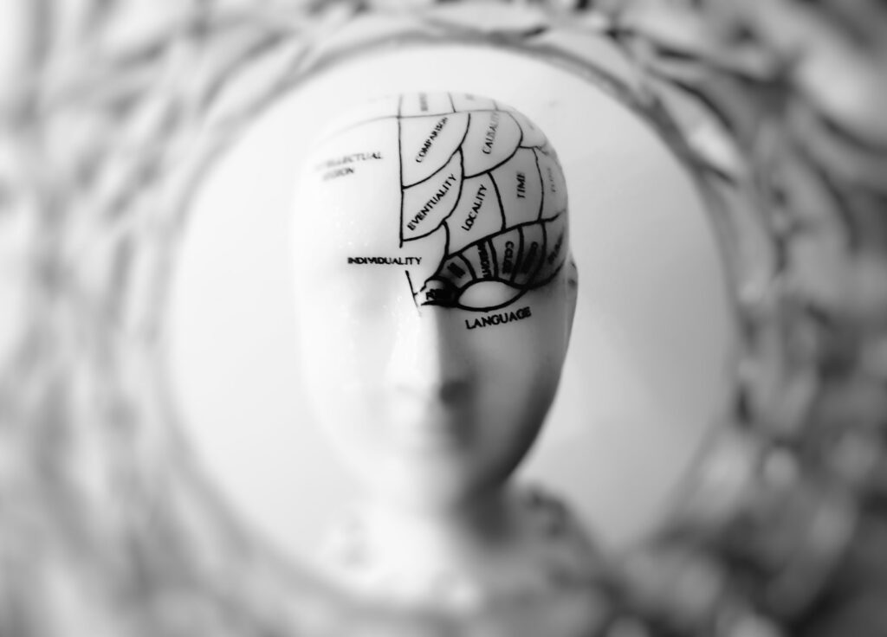

One of the most widely used layers within the Keras framework for deep learning is the **Conv2D layer**. However, especially for beginners, it can be difficult to understand what the layer is and what it does.

For this reason, we'll explore this layer in today's blog post. What is the Conv2D layer? How is it related to Convolutional Neural Networks? What does the "2D" mean - two dimensions? And how to actually implement it?

Those are questions that we'll answer today. Firstly, we'll take a look at ConvNets in general - discussing what they are and how they play an important role in today's deep learning world. Secondly, we move on to the Keras framework, and study how they are represented by means of Conv2D layers. Thirdly, we'll implement an actual model, guiding you through the code step by step. Finally, we'll run the model, and discuss our results.

Are you ready? Let's go!

* * *

\[toc\]

* * *

## Some theory about Conv2D: about convolutional neural networks

In my opinion, it's important to dive a bit into concepts first before we discuss code, as there's no point in giving you code examples if you don't understand _why_ things are as they are.

Now, let's take a look at some theory related to the Keras Conv2D layer. here, we'll discuss three things:

- **What is a neural network?** Very briefly, we'll take a look at what neural networks are - and why today's ones are different than the ones from the past, and other machine learning models.
- **What are convolutional neural networks?** There are many such models. Convolutional ones, have really thrived over the past few years. What are they? And how are they related to Conv2D layers? We'll take a look.
- **What is the impact of ConvNets / how are they used in practice?** ConvNets have especially boosted the popularity of deep learning because of their interesting applications, especially in computer vision. We'll explore a few of these.

Okay, let's begin.

### What is a neural network?

Since hundreds of years, philosophers and scientists have been interested in the human brain. The brain, you must know, is extremely efficient in what it does - allowing humans to think with unprecedented complexity and sheer flexibility.

Some of those philosophers and scientists have also been interested in finding out how to _make an artificial brain_ - that is, use a machine to mimic the functionality of the brain.

Obviously, this was not possible until the era of computing. That is, only since the 1950s, when computers emerged as a direct consequence of the Second World War, scientists could actually _build_ artificially intelligent systems.



Initially, researchers like [Frank Rosenblatt](https://www.machinecurve.com/index.php/2019/07/23/linking-maths-and-intuition-rosenblatts-perceptron-in-python/) attempted to mimic the neural structure of the brain. As you likely know since you likely have some background in neural networks, or at least know what they are, our brains consist of individual neurons and "highways" - synapses - in between them.

Neurons fire based on inputs, and by consequence trigger synapses to become stronger over time - allowing entire patterns of information processing to be shaped within the brain, giving humans the ability to think and act in very complex ways.

Whereas the so-called "Rosenblatt Perceptron" (click the link above if you want to know more) was just _one_ artificial neuron, today's neural networks are complex networks of many neurons, like this:

[](https://www.machinecurve.com/wp-content/uploads/2017/09/ComplexNeuralNetwork.png)

A complex neural network. These and even more complex neural nets provide different layers of possibly non-linear functionality, and may thus be used in deep learning.

What you see above is what is known as "fully connected neurons". Each neuron is connected to a neuron in the next layer, except for the input and output layer. Growing complexity means that the number of connections grows. This isn't good news, as this means that (1) the time required to train the network increases significantly and (2) the network is more prone to ["overfitting"](https://www.machinecurve.com/index.php/2019/12/16/what-is-dropout-reduce-overfitting-in-your-neural-networks/). Are there more efficient ways, perhaps?

### What are convolutional neural networks?

There are!

And convolutional neural networks, or ConvNets for short, are one of them. They are primarily used for computer vision tasks - although they have emerged in the areas of text processing as well. Not spoiling too much - we'll show some examples in the next section - let's now take a look at what makes ConvNets different.

The answer to this quest is relatively simple: ConvNets also contain layers that _are not fully connected_, and are built in a different way - convolutional layers.

Let's schematically draw two such layers.


On the left, you see the first layer - and the pixels of, say, your input image. The yellow part is the "convolutional layer", and more precisely, one of the filters (convolutional layers often contain many such filters which are learnt based on the data). It slides over the input image, and averages a box of pixels into _just one_ value. Repeating this process in many layer, we generate a small, very abstract image that we can use for classification.

### How are ConvNets used in practice?

As a result of this, we see many interesting applications of convolutional layers these days - especially in the field of computer vision. For example, object detectors use ConvNets to "detect" known objects within images or even videos, allowing you to draw bounding boxes and act based on the observation:

https://www.youtube.com/watch?v=yQwfDxBMtXg

* * *

## The Keras framework: Conv2D layers

Such layers are also represented within the Keras deep learning framework. For two-dimensional inputs, such as images, they are represented by `keras.layers.Conv2D`: the Conv2D layer!

In more detail, this is its exact representation (Keras, n.d.):

```
keras.layers.Conv2D(filters, kernel_size, strides=(1, 1), padding='valid', data_format=None, dilation_rate=(1, 1), activation=None, use_bias=True, kernel_initializer='glorot_uniform', bias_initializer='zeros', kernel_regularizer=None, bias_regularizer=None, activity_regularizer=None, kernel_constraint=None, bias_constraint=None)
```

Now, what does each attribute mean?

- **Filters** represents the number of filters that should be learnt by the convolutional layer. From the schematic drawing above, you should understand that each filter slides over the input image, generating a "feature map" as output.
- The **kernel size** represents the number of pixels in height and width that should be summarized, i.e. the two-dimensional width and height of the filter.
- The **stride** tells us how the kernel jumps over the input image. If the stride is 1, it slides pixel by pixel. If it's two, it jumps one pixel. It jumps two with a stride of 3, and so on.
- The **[padding](https://www.machinecurve.com/index.php/2020/02/07/what-is-padding-in-a-neural-network/)** tells us what happens when the kernels/filters don't fit, for example because the input image has a width and height that do not match with the combination of kernel size and stride.
- Depending on the backend you're using Keras with, the _channels_ (each image has image channels, e.g. 3 channels with Red-Green-Blue or RGB) are in the _first_ dimension or the _last_. Hence, the **data format** represents whether it's a channels first or channels last approach. With recent versions of Keras, which support TensorFlow only, this is no longer a concern.
- If you're using dilated convolutions, the **dilation rate** can be specified as well.
- The **[activation function](https://www.machinecurve.com/index.php/2019/06/11/why-you-shouldnt-use-a-linear-activation-function/)** to which the linear output of the Conv2D layer is fed to make it nonlinear can be specified too.
- A **bias value** can be added to each layer in order to scale the learnt function vertically. This possibly improves training results. It can be configured here, especially if you _don't_ want to use biases. By default, it's enabled.
- The **[initializer](https://www.machinecurve.com/index.php/2019/08/22/what-is-weight-initialization/)** for the kernels, the biases can be configured too, as well as **[regularizers](https://www.machinecurve.com/index.php/2020/01/23/how-to-use-l1-l2-and-elastic-net-regularization-with-keras/)** and **constraints**.

* * *

## Implementing a Keras model with Conv2D

Let's now see how we can implement a Keras model using Conv2D layers. It's important to remember that we need **Keras** for this to work, and more specifically we need the newest version. That means that we best install **TensorFlow** version 2.0+, which supports Keras out of the box. I cannot explain here how to install Tensorflow, but if you Google for "installing TensorFlow", you'll most likely find a perfect example.

Obviously, you'll also need a recent version of Python - possibly, using Anaconda.

### Full model code

This is the model that we'll be coding today. Don't worry - I will walk you through every step, but here's the code as a whole for those who just wish to copy and play:

```
from tensorflow.keras.datasets import cifar10
from tensorflow.keras.models import Sequential
from tensorflow.keras.layers import Dense, Flatten, Conv2D
from tensorflow.keras.losses import sparse_categorical_crossentropy
from tensorflow.keras.optimizers import Adam

# Model configuration
batch_size = 50
img_width, img_height, img_num_channels = 32, 32, 3
loss_function = sparse_categorical_crossentropy
no_classes = 10
no_epochs = 100
optimizer = Adam()
validation_split = 0.2
verbosity = 1

# Load CIFAR-10 data
(input_train, target_train), (input_test, target_test) = cifar10.load_data()

# Determine shape of the data
input_shape = (img_width, img_height, img_num_channels)

# Parse numbers as floats
input_train = input_train.astype('float32')
input_test = input_test.astype('float32')

# Scale data
input_train = input_train / 255
input_test = input_test / 255

# Create the model
model = Sequential()
model.add(Conv2D(32, kernel_size=(3, 3), activation='relu', input_shape=input_shape))
model.add(Conv2D(64, kernel_size=(3, 3), activation='relu'))
model.add(Conv2D(128, kernel_size=(3, 3), activation='relu'))
model.add(Flatten())
model.add(Dense(128, activation='relu'))
model.add(Dense(no_classes, activation='softmax'))

# Compile the model
model.compile(loss=loss_function,
              optimizer=optimizer,
              metrics=['accuracy'])

# Fit data to model
history = model.fit(input_train, target_train,
            batch_size=batch_size,
            epochs=no_epochs,
            verbose=verbosity,
            validation_split=validation_split)

# Generate generalization metrics
score = model.evaluate(input_test, target_test, verbose=0)
print(f'Test loss: {score[0]} / Test accuracy: {score[1]}')
```

Let's now study the model in more detail.

### The imports

The first thing we'll need to do is import some things:

```
from tensorflow.keras.datasets import cifar10
from tensorflow.keras.models import Sequential
from tensorflow.keras.layers import Dense, Flatten, Conv2D
from tensorflow.keras.losses import sparse_categorical_crossentropy
from tensorflow.keras.optimizers import Adam
```

We'll be using the CIFAR10 dataset today. Later, we'll see what it looks like. We also use the Sequential API. This allows us to stack the layers nicely. Subsequently, we import the Dense (from densely-connected), Flatten and Conv2D layers.

The principle here is as follows:

- The **Conv2D layers** will transform the input image into a very abstract representation.
- This representation can be used by **densely-connected layers** to generate a classification.
- However, as Dense layers can only handle one-dimensional data, we have to convert the multidimensional feature map output by the final Conv2D layer into one-dimensional format first. We can do so with the **Flatten** layer.

Next, we import the optimizer and the [loss function](https://www.machinecurve.com/index.php/2019/10/04/about-loss-and-loss-functions/). These will help us with improving the model: the [optimizer](https://www.machinecurve.com/index.php/2019/10/24/gradient-descent-and-its-variants/) adapts the weights, while the loss function computes the difference between the predictions and the ground truth of your training dataset. Loss functions are tailored to the problem you're trying to solve. For multiclass classification scenarios, which is what we're doing today, [categorical crossentropy loss](https://www.machinecurve.com/index.php/2019/10/17/how-to-use-categorical-multiclass-hinge-with-keras/) is a good choice. However, as our dataset targets are integers rather than vectors, we use the [sparse equivalent](https://www.machinecurve.com/index.php/2019/10/06/how-to-use-sparse-categorical-crossentropy-in-keras/).

### The model configuration

Next up, the model configuration.

- We set the **batch size** to 50. This means that 50 samples are fed to the model in each step.
- We also define the **image width, height and the number of channels**. As our dataset contains 32x32 pixel RGB images, we set them to `32, 32, 3`, respectively.
- For the **loss function** and **optimizer**, we set the values that we just discussed.
- As our dataset has 10 classes, we set **no\_classes** to 10.
- We will train our model for 25 iterations, or **epochs**. Usually, the number of epochs is a very large number, but as this is an educational scenario, we keep it low. Experiment with a few settings to see how it works!
- We use 20% of the training data for **validation purposes** - i.e., to see how well your model performs after each iteration. This helps spot whether our model is [overfitting](https://www.machinecurve.com/index.php/2019/12/16/what-is-dropout-reduce-overfitting-in-your-neural-networks/).
- Finally, we set **verbosity** mode to 1 - or True, showing all the output on screen.

```
# Model configuration
batch_size = 50
img_width, img_height, img_num_channels = 32, 32, 3
loss_function = sparse_categorical_crossentropy
no_classes = 10
no_epochs = 25
optimizer = Adam()
validation_split = 0.2
verbosity = 1
```

### Loading and preparing our dataset

The third step is to load and prepare our dataset.

But wait, what dataset will we be using?

Let's take a look at the CIFAR10 dataset:

[](https://www.machinecurve.com/wp-content/uploads/2019/11/cifar10_images.png)

These are just a few samples from this dataset - as you can see, it contains many common day classes such as truck, deer, and automobile. We'll load and prepare it as follows:

```
# Load CIFAR-10 data
(input_train, target_train), (input_test, target_test) = cifar10.load_data()

# Determine shape of the data
input_shape = (img_width, img_height, img_num_channels)

# Parse numbers as floats
input_train = input_train.astype('float32')
input_test = input_test.astype('float32')

# Scale data
input_train = input_train / 255
input_test = input_test / 255
```

The first step, loading the data from the [Keras datasets wrapper](https://www.machinecurve.com/index.php/2019/12/31/exploring-the-keras-datasets/), should be clear. The same goes for _determining the shape of our data_ - which is done based on the configuration settings that we discussed earlier.

Now, for the other two steps, these are just technicalities. By casting our data into `float32`, the training process will presumably be faster if you run it on a GPU. Scaling the data ensures that we have smaller weight updates, benefiting the final outcome.

### Specifying model architecture

Now that all the "work upfront" is complete, we can actually specify the model:

```
# Create the model
model = Sequential()
model.add(Conv2D(32, kernel_size=(3, 3), activation='relu', input_shape=input_shape))
model.add(Conv2D(64, kernel_size=(3, 3), activation='relu'))
model.add(Conv2D(128, kernel_size=(3, 3), activation='relu'))
model.add(Flatten())
model.add(Dense(128, activation='relu'))
model.add(Dense(no_classes, activation='softmax'))
```

First, we instantiate the `Sequential` API - literally laying the foundation on top of which we can stack layers.

As you can see, we specify three `Conv2D` layers in sequential order, with 3x3 kernel sizes, [ReLU activation](https://www.machinecurve.com/index.php/2019/09/09/implementing-relu-sigmoid-and-tanh-in-keras/) and 32, 64 and 128 filters, respectively.

Next, we use Flatten, and have two Dense layers to generate the classification. The last layer doesn't activate with ReLU, but with Softmax instead. This allows us to generate [a true multiclass probability distribution](https://www.machinecurve.com/index.php/2020/01/08/how-does-the-softmax-activation-function-work/), which is what we need if we want to answer the question "which class is most likely?".

Now that we have specified the architecture, or the framework, we can _compile_ (or initialize) the model and _fit the data_ (i.e., start training).

### Model compilation and fitting the data

Keras allows you to do so quite easily: with `model.compile` and `model.fit`. The `compile` call allows you to specify the loss function, the optimizer and additional metrics, of which we use accuracy, as it's intuitive to humans.

Then, with `fit`, we can fit the `input_train` and `target_train` (i.e. the inputs and targets of our training set) to the model, actually starting the training process. We do so based on the options that we configured earlier, i.e. batch size, number of epochs, verbosity mode and validation split.

```
# Compile the model
model.compile(loss=loss_function,
              optimizer=optimizer,
              metrics=['accuracy'])

# Fit data to model
history = model.fit(input_train, target_train,
            batch_size=batch_size,
            epochs=no_epochs,
            verbose=verbosity,
            validation_split=validation_split)
```

### Model evaluation

The final step is to evaluate our model after we performed training. Keras allows you to do so with `model.evaluate`. As you can see, instead of the training dataset, we're using testing data here: `input_test` and `target_test`. This way, we can be sure that we test the model with data that it hasn't seen before during training, evaluating its power to generalize to new data (which happens in real-world settings all the time!). Evaluation is done in a non-verbose way, and the results are printed on screen.

```
# Generate generalization metrics
score = model.evaluate(input_test, target_test, verbose=0)
print(f'Test loss: {score[0]} / Test accuracy: {score[1]}')
```

* * *

## Running our model

Now, let's run the model. Say that you save your model as `model.py`. Open a terminal, `cd` to the folder where your file is located, and run `python model.py`. You should see the training process begin on screen.

```
2020-03-30 20:25:58.336324: W tensorflow/stream_executor/cuda/redzone_allocator.cc:312] Internal: Invoking ptxas not supported on Windows
Relying on driver to perform ptx compilation. This message will be only logged once.
40000/40000 [==============================] - 35s 887us/sample - loss: 1.4811 - accuracy: 0.4676 - val_loss: 1.1419 - val_accuracy: 0.5906
Epoch 2/25
40000/40000 [===================>
```

Once it finishes, you should get an evaluation that is close to this:

```
Test loss: 4.3477772548675535 / Test accuracy: 0.6200000047683716
```

62% is not _extremely_ good, but it's not very bad either. For sure that we can improve a lot, but that wasn't the point of this blog post! 😉

* * *

## Summary

In this blog post, we looked at how two-dimensional convolutional layers can be used with the Keras deep learning framework. Having studied a little bit of neural network theory up front, and diving into the concepts of convolutional layers, we quickly moved on to Keras and its Conv2D representation. With an example model, which we looked at step by step, we showed you how you can create a Keras ConvNet yourself.

I hope you've learnt something from today's blog post. If you did, please feel free to leave a comment in the comments section below! Please do the same if you have questions or when you have remarks - I'll happily answer and improve my blog post if necessary.

For now, thank you for reading MachineCurve today and happy engineering! 😎

\[kerasbox\]

* * *

## References

Keras. (n.d.). _Convolutional layers: Conv2D_. Home - Keras Documentation. [https://keras.io/layers/convolutional/#conv2d](https://keras.io/layers/convolutional/#conv2d)
