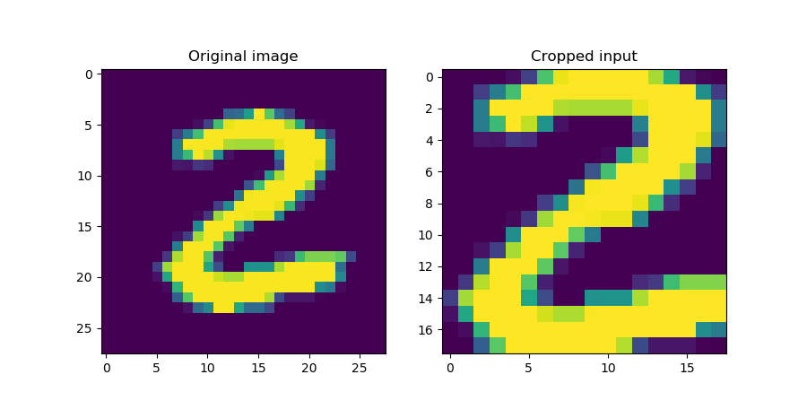
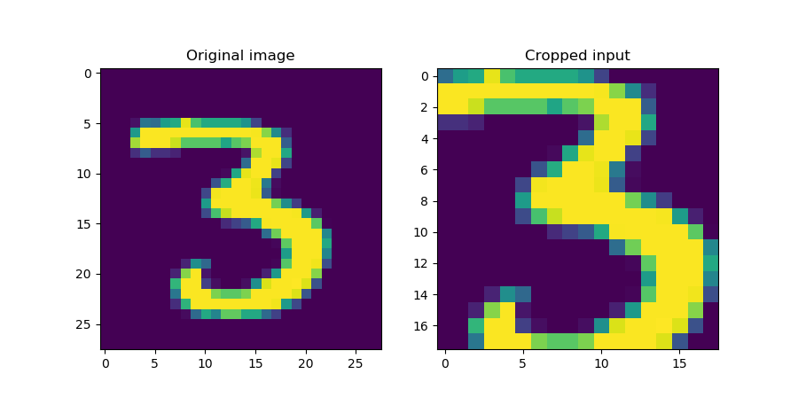
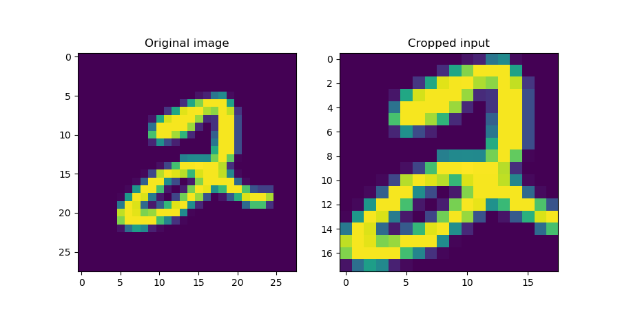
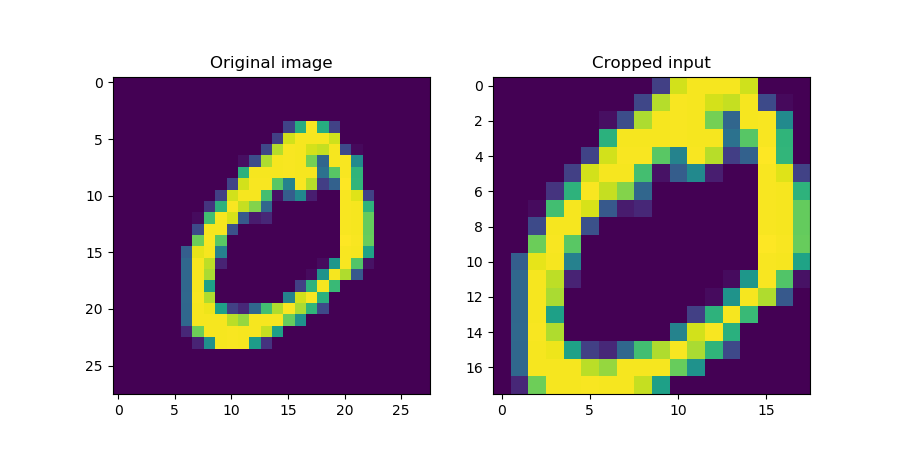
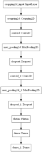
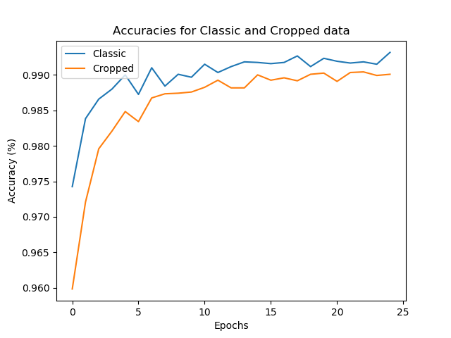
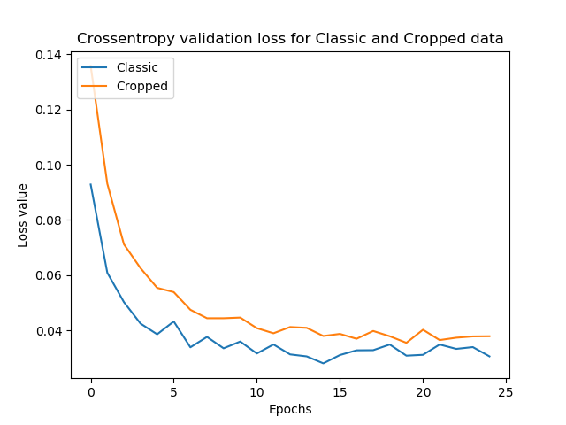

Sometimes, your data set may consist of e.g. images from which you only need to use a tiny bit in your neural network. Cropping the images manually prior to training would then be a possible option. However, this can be done smarter, with the Keras Cropping layers, which perform all the work for you.

This blog covers these layers. Firstly, we'll take a look at why cropping may be necessary in the first place. Secondly, we introduce the Cropping layers from the Keras API, and then proceed with a simple Cropping example. We then extend this simple example to a CNN based classifier using Cropped data, and finally take a look at how Cropping may also be used at the level of feature maps rather than input data.

Are you ready? Let's go! 😎

**Update 05/Nov/2020:** made code compatible with TensorFlow 2.x and fixed some other issues.

* * *

\[toc\]

* * *

## Why cropping?

Say that you have an experient in which you photograph a variety of books. The size of the books is similar, and you're using a tripod in order to keep the camera stable and at a fixed position with respect to the table. You lay down each book and make a picture, and will have a set of pictures of books in the end, assigned to a category (e.g., "thriller").

Now imagine that your goal is to classify the book into a category based on the cover. What's more, you have another dataset available - a set of pictures with labels - where you did precisely the same thing. However, rather than the table of your first dataset - which is a wooden one - here, the table you used is made of white plastic.

This is problematic, as we don't want the prediction to be determined by the _material of the table_, or the table at all!

Intuitively, the fix for this problem would be to "cut off" the table from each book. That is, we simply remove the edges, so that the cover of the book remains. It's a simple and elegant fix which is called "cropping". And indeed, it's the way forward - suppose that in this case, the "2" is the book and the surrounding blue is the table:

- [](https://www.machinecurve.com/wp-content/uploads/2020/02/crop_4.png)
    

Cropping allows us to focus on the book alone rather than its unique combination with the table.

Now, a naïve way would be to crop all your images manually - that is, use a software tool like Paint to remove the edge from each image. This is an extremely time-intensive process, which is not what we want. What's more, the precision of our cropping may be off by a few pixels every time. This introduces instability into the dataset.

Instead, we'll perform _cropping_ in our neural network! Keras, the deep learning framework with which we will work today, has such layers available natively. Let's explore them! 😎

* * *

## Cropping in the Keras API

Cropping often goes hand in hand with [Convolutional layers](https://www.machinecurve.com/index.php/2018/12/07/convolutional-neural-networks-and-their-components-for-computer-vision/), which themselves are used for feature extracting from one-dimensional (i.e. time), two-dimensional (i.e. spatial) or three-dimensional (i.e. 3D spatial or spatiotemporal a.k.a. spatial over time) data.

Hence, it shouldn't surprise you that Keras offers three types of Cropping layers: `Cropping1D`, `Cropping2D` and `Cropping3D`, to be used with the dimensionality of your dataset and often the corresponding `Conv` layer(s) (Keras, n.d.).

Firstly, there is the one-dimensional variant:

```
tensorflow.keras.layers.Cropping1D(cropping=(1, 1))
```

It has one simple attribute: `cropping`, which specifies "how many units should be trimmed off at the beginning and end of the cropping dimension" (Keras, n.d.). That is, if your input is an array of shape \[latex\](20, )\[/latex\] and you apply a `cropping` of \[latex\](2, 5)\[/latex\], then it will be \[latex\](13, )\[/latex\] with 2 values cut off the front and 5 off the back. You could also provide `cropping` as an integer `i`, which then equates to `(i, i)`.

Secondly, there is two-dimensional variant:

```
tensorflow.keras.layers.Cropping2D(cropping=((0, 0), (0, 0)), data_format=None)
```

It is pretty similar to the one-dimensional case, but there are minor differences:

- The `cropping` attribute now specifies a _box_ for cropping, with the structure being `((top_crop, bottom_crop), (left_crop, right_crop))` (Keras, n.d.). However, if you wish to perform a symmetric crop (i.e. remove as much in terms of height from top and bottom and width from left and right), you could also specify the two-element tuple `(symmetric_height_crop, symmetric_width_crop)` (Keras, n.d.). If you only apply an int value, Keras will perform a symmetric crop with `width = height`, like the 1D case.
- New is the `data_format`, which is nothing different than `channels_last` or `channels_first` dependent on how the backend you use Keras with processes images (i.e., whether channels are present in the first or last dimensions of your tensor). Tensorflow, by default, utilizes a channels-last approach, and given the deep integration between Keras and Tensorflow, `channels_last` is the default option (StackOverflow, n.d.; Keras, n.d.).

Thirdly, and finally, there is the 3D Cropping layer:

```
tensorflow.keras.layers.Cropping3D(cropping=((1, 1), (1, 1), (1, 1)), data_format=None)
```

- Here, you can also specify the `cropping` attribute as a dimension-based crop i.e. `((left_dim1_crop, right_dim1_crop), (left_dim2_crop, right_dim2_crop), (left_dim3_crop, right_dim3_crop))`, but with `(symmetric_dim1_crop, symmetric_dim2_crop, symmetric_dim3_crop)` it's also possible to create a symmetric crop again (Keras, n.d.).
- Similarly, `data_format` can here be set to `channels_first` or `channels_last`, with the latter being the default (StackOverflow, n.d.; Keras, n.d.).

Now that we know how the Cropping layers are represented in the Keras API, it's time for some coding work! 😄

* * *

## A simple Cropping2D example

Let's start with a simple example that demonstrates what the `Cropping` layers do. More precisely, we'll be using the `Cropping2D` layer from Keras, using the TensorFlow 2.0+ variant so we're future proof.

### The imports

Open up a code editor and create a file, e.g. `cropping2d.py`. Then, the first step is adding the imports:

- The `Sequential` API from `tensorflow.keras.models`, so we can stack everything together nicely.
- The `Cropping2D` layer from `tensorflow.keras.layers`;
- The `mnist` dataset from `tensorflow.keras.datasets`, i.e. the [Keras datasets module](https://www.machinecurve.com/index.php/2019/12/31/exploring-the-keras-datasets/).
- The `PyPlot` API from Matplotlib, for generating some plots.
- Finally, `Numpy`, for number processing.

```
from tensorflow.keras.models import Sequential
from tensorflow.keras.layers import Cropping2D
from tensorflow.keras.datasets import mnist
import matplotlib.pyplot as plt
import numpy as np
```

### The dataset

Next, it's time to load the MNIST dataset and select a sample:

```
# Load MNIST data
(x_train, y_train), (x_test, y_test) = mnist.load_data()
input_image_shape = (28, 28, 1)
input_image = x_train[25].reshape(input_image_shape)
```

Here, we use `load_data()` to load the full dataset. However, we only use one sample at once, in this case the 26th (with `i = 25`) from the training dataset (i.e. `x_train[25]`). On the fly, we also reshape it so that channels are supported: the 28x28 pixel image with shape `(28, 28)` is reshaped into `(28, 28, 1)`.

### The architecture

Subsequently, we can specify the model architecture... _which is pretty simple:_

```
# Create the model
model = Sequential()
model.add(Cropping2D(cropping=((5, 5), (5, 5)), input_shape=input_image_shape))
model.summary()
```

It's simply an instantiation of the `Sequential` API, to which we add the `Cropping2D` layer, and generate a summary using `model.summary`. In the Cropping layer, we specify the `cropping` attribute that specifies the box that _must be kept_: in this case the box 5 pixels from the left; from the right; from the top, and from the bottom.

In the _Results_ section, you'll see that this indeed cuts off the blank edges 😉 But first, add some code which actually generates the cropped output... through a _prediction_.

### The cropping action

By specifying the `input_shape` in the `model.add` section, the model automatically builds/compiles, and - as we shall see in the _Results_ section as well - since our model doesn't have any trainable parameters, we don't need to call `model.fit`.

Hence, we can continue straight away with generating a 'prediction' - i.e. feeding the `input_image` to the `model` through `model.predict`. Do note that our model expects an array of inputs, and thus we must wrap it with a list:

```
# Perform actual cropping
model_inputs = np.array([input_image])
outputs_cropped = model.predict(model_inputs)
```

As the model predicts for a list, the outputs are also a list, and we need to take the first element:

```
# Get output
outputs_cropped = outputs_cropped[0]
```

Finally, we can visualize the input and output together with Matplotlib:

```
# Visualize input and output
fig, axes = plt.subplots(1, 2)
axes[0].imshow(input_image[:, :, 0]) 
axes[0].set_title('Original image')
axes[1].imshow(outputs_cropped[:, :, 0])
axes[1].set_title('Cropped input')
fig.suptitle(f'Original and cropped input')
fig.set_size_inches(9, 5, forward=True)
plt.show()
```

### Results

First, the summary generated with `model.summary()`:

```
Model: "sequential"
_________________________________________________________________
Layer (type)                 Output Shape              Param #
=================================================================
cropping2d (Cropping2D)      (None, 18, 18, 1)         0
=================================================================
Total params: 0
Trainable params: 0
Non-trainable params: 0
_________________________________________________________________
```

As you can see, there are no trainable parameters whatsoever - the `Cropping2D` layer only crops the inputs based on the `cropping` attribute that was specified!

Then, three examples of the cropped inputs:

- [](https://www.machinecurve.com/wp-content/uploads/2020/02/crop_3.png)
    
- [](https://www.machinecurve.com/wp-content/uploads/2020/02/crop_2.png)
    
- [](https://www.machinecurve.com/wp-content/uploads/2020/02/crop_1.png)
    

Indeed, the blank box around the digits has been removed! 😎

### Full code

Should you wish to obtain the full code for this simple application of Keras `Cropping2D` layers, here you go:

```
from tensorflow.keras.models import Sequential
from tensorflow.keras.layers import Cropping2D
from tensorflow.keras.datasets import mnist
import matplotlib.pyplot as plt
import numpy as np

# Load MNIST data
(x_train, y_train), (x_test, y_test) = mnist.load_data()
input_image_shape = (28, 28, 1)
input_image = x_train[25].reshape(input_image_shape)

# Create the model
model = Sequential()
model.add(Cropping2D(cropping=((5, 5), (5, 5)), input_shape=input_image_shape))
model.summary()

# Perform actual cropping
model_inputs = np.array([input_image])
outputs_cropped = model.predict(model_inputs)

# Get output
outputs_cropped = outputs_cropped[0]

# Visualize input and output
fig, axes = plt.subplots(1, 2)
axes[0].imshow(input_image[:, :, 0]) 
axes[0].set_title('Original image')
axes[1].imshow(outputs_cropped[:, :, 0])
axes[1].set_title('Cropped input')
fig.suptitle(f'Original and cropped input')
fig.set_size_inches(9, 5, forward=True)
plt.show()
```

* * *

## Training a ConvNet with Cropping2D inputs

[](https://www.machinecurve.com/wp-content/uploads/2020/02/model_cropping2d.png)

Let's now make the example a little bit more complex. Rather than creating a model which allows an input image to be cropped, we'll apply Cropping layers to a [Convolutional Neural Network based classifier](https://www.machinecurve.com/index.php/2019/09/17/how-to-create-a-cnn-classifier-with-keras/) - in order to find out what it does in terms of performance when it is trained on the MNIST dataset.

On the right, you'll see the architecture that we will create today: a convolutional neural network that eventually leads to densely-connected layer based classification.

Let's take a look at some code! 😎 Open up a code editor, create a new file (e.g. `model_cropping2d.py`) and start coding :)

### Model imports

Firstly, we'll define the imports for our model:

```
import tensorflow
from tensorflow.keras.datasets import mnist
from tensorflow.keras.models import Sequential
from tensorflow.keras.layers import Dense, Dropout, Flatten
from tensorflow.keras.layers import Conv2D, MaxPooling2D, Cropping2D
```

We import `tensorflow`, as we'll need it later to specify e.g. the [loss function](https://www.machinecurve.com/index.php/2019/10/04/about-loss-and-loss-functions/). Then, from `tensorflow.keras`, we import a couple of things:

- Firstly, from `.datasets`, we import the `mnist` dataset.
- From `.models`, we import the `Sequential` API which will allow us to stack the layers quite nicely.
- Then, from `.layers`, we import `Dense`, `Dropout` and `Flatten` - all necessary for the latter part (i.e. the classifier) of the model or for reducing overfitting (i.e. [Dropout](https://www.machinecurve.com/index.php/2019/12/18/how-to-use-dropout-with-keras/)).
- Then, from `.layers`, we import the layers used for feature extracting: the `Conv2D` layer for the actual extraction, the `MaxPooling2D` layer for [downsampling and introducing translation invariance](https://www.machinecurve.com/index.php/2020/01/30/what-are-max-pooling-average-pooling-global-max-pooling-and-global-average-pooling/) and `Cropping2D` for cropping, obviously :)

### Model configuration

Now that our imports are defined, we can set the configuration options for the model:

```
# Model configuration
img_width, img_height = 28, 28
batch_size = 250
no_epochs = 25
no_classes = 10
validation_split = 0.2
verbosity = 1
```

As the MNIST digits have a width and height of 28 pixels, we set both `img_width` and `img_height` to 28. Then, the batch size is set to 250 - which is a fair balance between memory requirements and [gradient preciseness](https://www.machinecurve.com/index.php/2019/10/24/gradient-descent-and-its-variants/). The number of epochs is set to 25 - which is low, but which should be more than enough for a simple dataset like MNIST. The number of classes is set to 10, which equals the distinct number of digits present within the dataset - i.e. the digits 0 to 9.

Finally, 20% of the training data is used for validation purposes (i.e. validating model performance for every epoch) and verbosity mode is set to True (through `1`), outputting everything in your terminal (and in my experience slightly slowing down the training process due to the speed of these operations - turn it off when you use it for real!).

### Loading and preparing data

When the model configuration options are set, we can load the MNIST dataset. We do so by calling the `load_data()` definition that is present within the [Keras datasets module](https://www.machinecurve.com/index.php/2019/12/31/exploring-the-keras-datasets/):

```
# Load MNIST dataset
(input_train, target_train), (input_test, target_test) = mnist.load_data()
```

The first subsequent activity is reshaping the data into the correct format, so that it can be consumed by the neural network.

```
# Reshape data
input_train = input_train.reshape(input_train.shape[0], img_width, img_height, 1)
input_test = input_test.reshape(input_test.shape[0], img_width, img_height, 1)
input_shape = (img_width, img_height, 1)
```

We subsequently cast the numbers into `float32` type. This makes learning more [precise](https://www.machinecurve.com/index.php/2020/09/16/tensorflow-model-optimization-an-introduction-to-quantization/#float32-in-your-ml-model-why-its-great):

```
# Parse numbers as floats
input_train = input_train.astype('float32')
input_test = input_test.astype('float32')
```

The next step is to divide the data points by 255 in order to normalize the data into the \[latex\]\[0, 1\]\[/latex\] range:

```
# Normalize data
input_train = input_train / 255
input_test = input_test / 255
```

The final step that is left is to convert the targets into categorical format through one-hot encoding, so that [categorical crossentropy](https://www.machinecurve.com/index.php/2019/10/22/how-to-use-binary-categorical-crossentropy-with-keras/) can be used:

```
# Convert target vectors to categorical targets
target_train = tensorflow.keras.utils.to_categorical(target_train, no_classes)
target_test = tensorflow.keras.utils.to_categorical(target_test, no_classes)
```

### Model architecture

The next step now that we have prepared the data for use in our neural network is to specify the actual _architecture_... i.e., the skeleton of your model:

```
# Create the model
model = Sequential()
model.add(Cropping2D(cropping=((5, 5), (5, 5)), input_shape=input_shape))
model.add(Conv2D(32, kernel_size=(3, 3), activation='relu'))
model.add(MaxPooling2D(pool_size=(2, 2)))
model.add(Dropout(0.25))
model.add(Conv2D(64, kernel_size=(3, 3), activation='relu'))
model.add(MaxPooling2D(pool_size=(2, 2)))
model.add(Dropout(0.25))
model.add(Flatten())
model.add(Dense(256, activation='relu'))
model.add(Dense(no_classes, activation='softmax'))
```

It works as follows:

- We instantiate the `Sequential` API so that we can stack our layers nicely.
- We first add the `Cropping2D` layer we used in the simple example - so that our MNIST data will be cropped and that the "blank" box around it will be cut off.
- Then, we feed the data into two convolutional blocks that are composed of `Conv2D`, `MaxPooling2D` and `Dropout` layers. Here, feature extraction, downsampling, ensuring translation invariance and reducing overfitting takes place - twice.
- Subsequently, we flatten the highly dimensional outputs of the last convolutional block so that we can feed them to the `Dense` layers, for classification.
- Each layer utilizes a [ReLU activation function](https://www.machinecurve.com/index.php/2019/09/04/relu-sigmoid-and-tanh-todays-most-used-activation-functions/) except for the last - which ensures that a multiclass probability distribution is generated by means of [Softmax](https://www.machinecurve.com/index.php/2020/01/08/how-does-the-softmax-activation-function-work/).
- The Dropout rate is set to 0.25, which is relatively low - even better results may be achieved with a rate of 0.5; however, we set it to 0.25 in order to keep the model comparable to the classic CNN we created [in another blog post](https://www.machinecurve.com/index.php/2019/09/17/how-to-create-a-cnn-classifier-with-keras/).
- The convolutional layers extract 32 and 64 [feature maps](https://www.machinecurve.com/index.php/2019/12/03/what-do-convnets-see-visualizing-filters-with-activation-maximization/), respectively - 32 relatively "generic" ones and 64 more "specific" ones to the data. We use 3x3 pixel kernels and 2x2 pools, reducing the size of the feature maps by 50% each time.
- The first Dense layer has 256 neurons - and is already a "bottleneck" for the highly dimensional flattened data (this is a good thing). The second Dense layer is an even greater bottleneck and generates _ten_ outputs only, one "importance" score per class. Letting those flow through the Softmax activation function mentioned earlier ensures that you can talk about the final output in a probabalistic way, and pick the most likely class.

### Model compilation & data fitting

The next step is model compilation, or "configuring" the model skeleton. For this, we use [categorical crossentropy loss](https://www.machinecurve.com/index.php/2019/10/22/how-to-use-binary-categorical-crossentropy-with-keras/) and the [Adam optimizer](https://www.machinecurve.com/index.php/2019/11/03/extensions-to-gradient-descent-from-momentum-to-adabound/#adam). Accuracy is added as a more intuitive metric.

```
# Compile the model
model.compile(loss=tensorflow.keras.losses.categorical_crossentropy,
              optimizer=tensorflow.keras.optimizers.Adam(),
              metrics=['accuracy'])
```

Next, we `fit` the data to the model - and assign the output to the `history` object. With this object, it will be possible to [visualize e.g. the history of the training process](https://www.machinecurve.com/index.php/2019/10/08/how-to-visualize-the-training-process-in-keras/). Here, we also _actually_ set the configuration options that we set before.

```
# Fit data to model
history = model.fit(input_train, target_train,
            batch_size=batch_size,
            epochs=no_epochs,
            verbose=verbosity,
            validation_split=validation_split)
```

### Model evaluation

Finally, we can generate some evaluation metrics based on the test set:

```
# Generate generalization metrics
score = model.evaluate(input_test, target_test, verbose=0)
print(f'Test loss: {score[0]} / Test accuracy: {score[1]}')
```

...possibly, you can also add the code here if you wish to visualize [the history of your training process](https://www.machinecurve.com/index.php/2019/10/08/how-to-visualize-the-training-process-in-keras/).

### Comparing Cropped CNN to Uncropped CNN

To evaluate, we trained the CNN defined above with the 'classic' one - i.e., the one without cropped data - as a baseline model. Here are the results in terms of accuracies and loss values:

- [](https://www.machinecurve.com/wp-content/uploads/2020/02/classic_cropped_accuracy.png)
    
- [](https://www.machinecurve.com/wp-content/uploads/2020/02/classic_cropped_loss.png)
    

As you can see, the cropped CNN performs worse on the validation dataset - although the difference is not _enormous_. The same is visible within the testing data:

```
Cropped CNN - Test loss: 0.030419354529614792 / Test accuracy: 0.9904999732971191
Classic CNN - Test loss: 0.028982607408999137 / Test accuracy: 0.9926999807357788
```

Even though the model does not show better results, we at least found out about how to apply Cropping layers with Keras :)

### Full model code

Should you wish to obtain the full model code instead? That's possible :) Here you go:

```
import tensorflow
from tensorflow.keras.datasets import mnist
from tensorflow.keras.models import Sequential
from tensorflow.keras.layers import Dense, Dropout, Flatten
from tensorflow.keras.layers import Conv2D, MaxPooling2D, Cropping2D

# Model configuration
img_width, img_height = 28, 28
batch_size = 250
no_epochs = 25
no_classes = 10
validation_split = 0.2
verbosity = 1

# Load MNIST dataset
(input_train, target_train), (input_test, target_test) = mnist.load_data()

# Reshape data
input_train = input_train.reshape(input_train.shape[0], img_width, img_height, 1)
input_test = input_test.reshape(input_test.shape[0], img_width, img_height, 1)
input_shape = (img_width, img_height, 1)

# Parse numbers as floats
input_train = input_train.astype('float32')
input_test = input_test.astype('float32')

# Normalize data
input_train = input_train / 255
input_test = input_test / 255

# Convert target vectors to categorical targets
target_train = tensorflow.keras.utils.to_categorical(target_train, no_classes)
target_test = tensorflow.keras.utils.to_categorical(target_test, no_classes)

# Create the model
model = Sequential()
model.add(Cropping2D(cropping=((5, 5), (5, 5)), input_shape=input_shape))
model.add(Conv2D(32, kernel_size=(3, 3), activation='relu'))
model.add(MaxPooling2D(pool_size=(2, 2)))
model.add(Dropout(0.25))
model.add(Conv2D(64, kernel_size=(3, 3), activation='relu'))
model.add(MaxPooling2D(pool_size=(2, 2)))
model.add(Dropout(0.25))
model.add(Flatten())
model.add(Dense(256, activation='relu'))
model.add(Dense(no_classes, activation='softmax'))

# Compile the model
model.compile(loss=tensorflow.keras.losses.categorical_crossentropy,
              optimizer=tensorflow.keras.optimizers.Adam(),
              metrics=['accuracy'])

# Fit data to model
history = model.fit(input_train, target_train,
            batch_size=batch_size,
            epochs=no_epochs,
            verbose=verbosity,
            validation_split=validation_split)

# Generate generalization metrics
score = model.evaluate(input_test, target_test, verbose=0)
print(f'Test loss: {score[0]} / Test accuracy: {score[1]}')
```

* * *

## Applying Cropping layers to ConvNet feature maps

Cropping does not necessarily have to take place at the level of input data only. Rather, you can also apply it at the level of the _feature maps_, i.e. the features extracted by the convolutional layers. This is demonstrated here:

```
# Create the model
model = Sequential()
model.add(Cropping2D(cropping=((5, 5), (5, 5)), input_shape=input_shape))
model.add(Conv2D(32, kernel_size=(3, 3), activation='relu'))
model.add(Cropping2D(cropping=((2, 2), (2, 2))))
```

As you can see, after the second `Cropping2D` layer, there are still 32 feature maps, but they're four pixels less wide and less high - which is in line with the `(2, 2), (2, 2)` crop we defined! 😊

```
Model: "sequential"
_________________________________________________________________
Layer (type)                 Output Shape              Param #
=================================================================
cropping2d (Cropping2D)      (None, 18, 18, 1)         0
_________________________________________________________________
conv2d (Conv2D)              (None, 16, 16, 32)        320
_________________________________________________________________
cropping2d_1 (Cropping2D)    (None, 12, 12, 32)        0
_________________________________________________________________
```

* * *

## Summary

In this blog post, we looked at a couple of things related to Cropping layers. Firstly, we identified the need for cropping - by a fictional scenario using books. Discarding the naïve way of using tools like Microsoft Paint for this purpose, we introduced the concept of a Cropping layer.

This was followed by an introduction to how these layers are represented within the Keras API. Finally, we saw three examples - a simple Cropping example, a Cropping layer with a CNN classifier, and an example displaying how Cropping can be used on the feature maps rather than the input data.

I hope you've learnt something today. If you did, I'd really appreciate it if you left a comment in the comments box below! 💬😊 Please do the same if you have questions, remarks or if you find mistakes.

Thank you for reading MachineCurve today and happy engineering! 😎

\[kerasbox\]

* * *

## References

Keras. (n.d.). Convolutional Layers. Retrieved from [https://keras.io/layers/convolutional/](https://keras.io/layers/convolutional/)

StackOverflow. (n.d.). Channels first vs Channels last - what doe these mean? Retrieved from [https://stackoverflow.com/questions/56754574/channels-first-vs-channels-last-what-doe-these-mean](https://stackoverflow.com/questions/56754574/channels-first-vs-channels-last-what-doe-these-mean)
