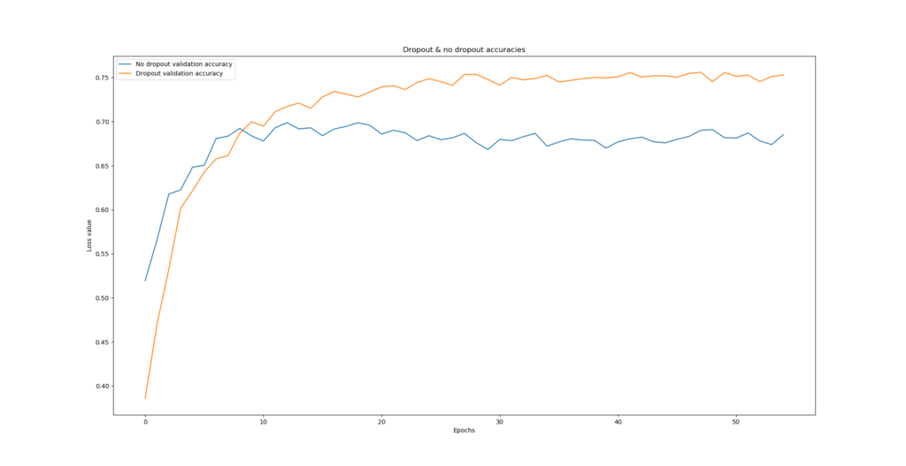
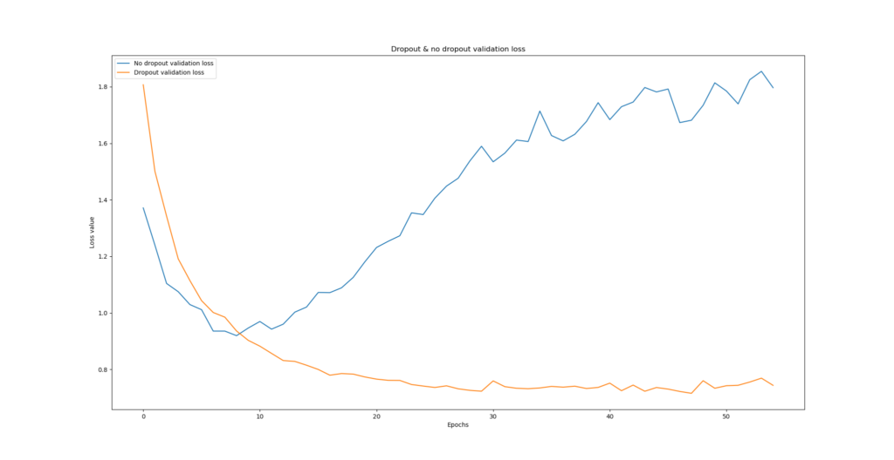
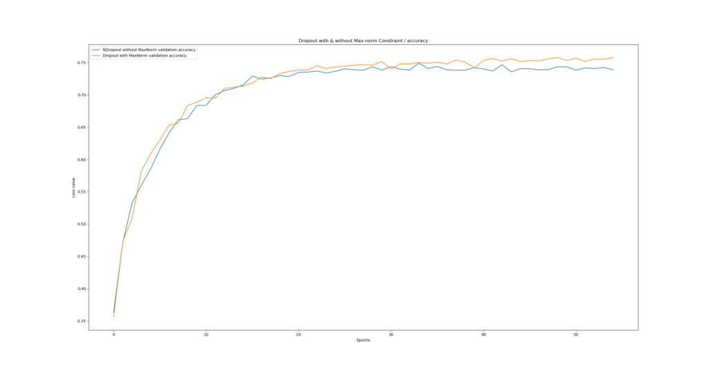
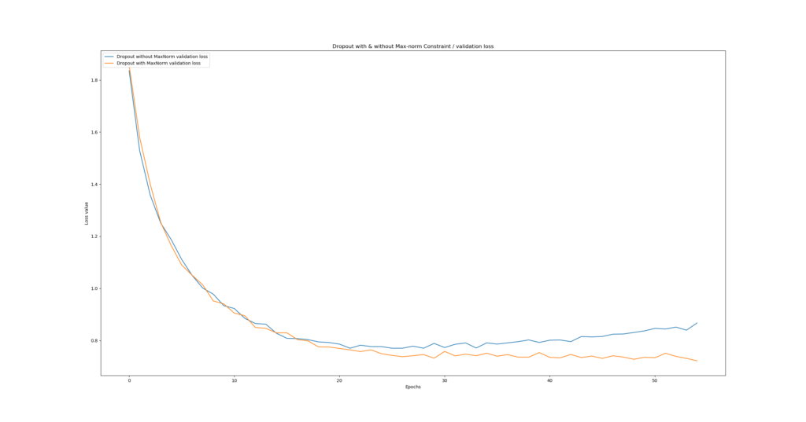
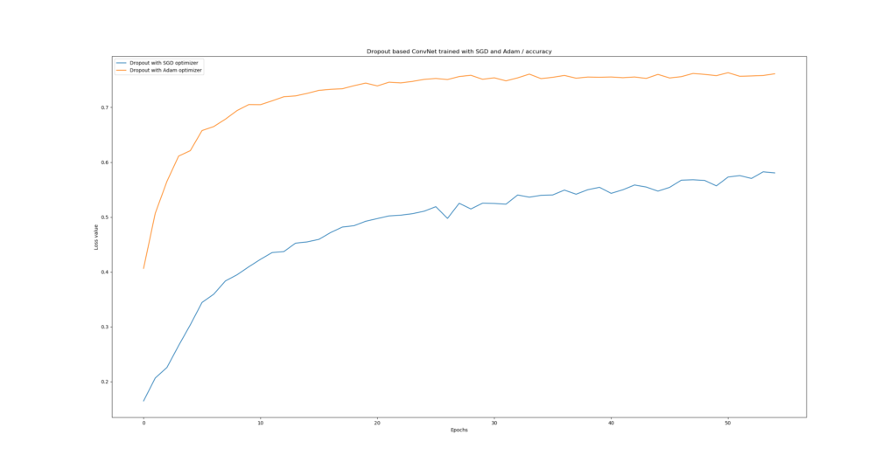
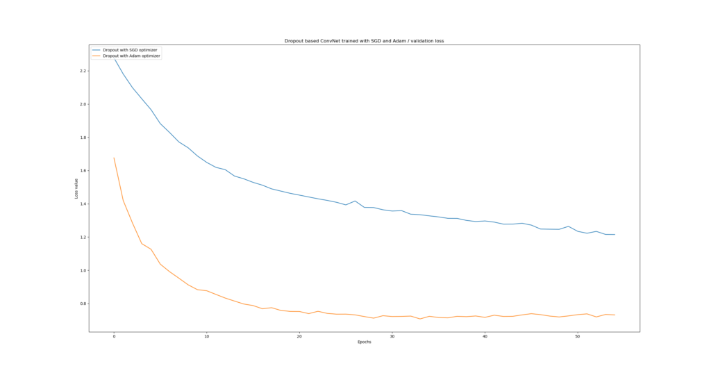

When you have a dataset of limited size, overfitting is quite a problem. That is, while your training results might be good, it's likely that they don't generalize to data that has not been seen during training.

This severely impacts the production usability of your machine learning module.

Fortunately, with regularization techniques, it's possible to reduce overfitting. Dropout is such a technique. In this blog post, we cover how to implement Keras based neural networks with Dropout. We do so by firstly recalling the basics of Dropout, to understand at a high level what we're working with. Secondly, we take a look at how Dropout is represented in the Keras API, followed by the design of a ConvNet classifier of the CIFAR-10 dataset. We subsequently provide the implementation with explained example code, and share the results of our training process.

Ready? Let's go! 😊

\[toc\]

## Recap: what is Dropout?

Before discussing the implementation of Dropout in the Keras API, the design of our model and its implementation, let's first recall what Dropout is and how it works.

In our blog post ["What is Dropout? Reduce overfitting in your neural networks"](https://www.machinecurve.com/index.php/2019/12/16/what-is-dropout-reduce-overfitting-in-your-neural-networks/), we looked at what Dropout is theoretically. In short, it's a regularizer technique that reduces the odds of overfitting by dropping out neurons at random, during every epoch (or, when using a minibatch approach, during every minibatch).


Dropping out neurons happens by attaching Bernoulli variables to the neural outputs (Srivastava et al., 2014). These variables, which take the value of \[latex\]1\[/latex\] with probability \[latex\]p\[/latex\] and 0 with \[latex\]1-p\[/latex\], help reduce overfitting by "making the presence of other (..) units unreliable". This way, neural networks cannot generate what Srivastava et al. call complex co-adaptations that do not generalize to unseen data.

By consequence, the occurrence of overfitting is reduced.

Let's now continue with some Dropout best practices. If you wish to understand the concepts behind Dropout in more detail, I'd like to point you to [this blog](https://www.machinecurve.com/index.php/2019/12/16/what-is-dropout-reduce-overfitting-in-your-neural-networks/).

### Dropout best practices

When working on software projects, and hence when working on machine learning development, it's always best to take a look at some best practices. Srivastava et al. (2014), who discussed Dropout in their work ["Dropout: A Simple Way to Prevent Neural Networks from Overfitting"](http://jmlr.org/papers/v15/srivastava14a.html), empirically found some best practices which we'll take into account in today's model:

- While it's best to determine the value for parameter \[latex\]p\[/latex\] with a validation set, it's perfectly fine to set it to \[latex\]p \\approx 0.5\[/latex\]. This value has shown the best empirical results when being tested with the MNIST dataset.
- To avoid holes in your input data, the authors argued that you best set \[latex\]p\[/latex\] for the input layer to \[latex\]1.0\[/latex\] - effectively the same as not applying Dropout there.
- Dropout seems to work best when a combination of max-norm regularization (in Keras, with the [MaxNorm constraint](https://keras.io/constraints/#maxnorm)), high learning rates that [decay](https://www.machinecurve.com/index.php/2019/11/11/problems-with-fixed-and-decaying-learning-rates/#what-is-learning-rate-decay) to smaller values, and high momentum is used as well.

Any optimizer can be used. Given the benefits of the [Adam optimizer](https://www.machinecurve.com/index.php/2019/11/03/extensions-to-gradient-descent-from-momentum-to-adabound/#adam) (momentum-like optimization with locally adapted weights), we're using that one today, as well as the best practices mentioned above.

## Dropout in the Keras API

Within Keras, Dropout is represented as one of the _Core layers_ (Keras, n.d.):

```
keras.layers.Dropout(rate, noise_shape=None, seed=None)
```

It can be added to a Keras deep learning model with `model.add` and contains the following attributes:

- **Rate**: the parameter \[latex\]p\[/latex\] which determines the odds of dropping out neurons. When you did not validate which \[latex\]p\[/latex\] works best for you with a validation set, recall that it's best to set it to \[latex\]rate \\approx 0.5\[/latex\] for hidden layers and \[latex\]rate \\approx 0.1\[/latex\] for the input layer (note that \[latex\]rate \\approx 0.1\[/latex\] equals \[latex\]p \\approx 0.9\[/latex\] - Keras turns the logic upside down, making _rate_ the odds of _dropping out_ rather than _keeping_ neurons!)
- **Noise shape:** if you wish to share noise across one of (batch, timesteps, features), you can set the noise shape for this purpose. [Read more about noise shape here.](https://stackoverflow.com/questions/46585069/keras-dropout-with-noise-shape)
- **Seed**: if you wish to fixate the pseudo-random generator that determines whether the Bernoulli variables are 1 or 0 (e.g., to rule out issues with the number generator), then you can set some seed by specifying an integer value here.

**Important:** once more, the drop rate (or 'rate') in Keras determines the odds of dropping out neurons - instead of keeping them. In effect, with respect to the parameter \[latex\]p\[/latex\] defined by Srivastava et al. (2014) when discussing Dropout, `rate` thus effectively means \[latex\]1-p\[/latex\]. If 75% of the neurons are kept with \[latex\]p = 0.75\[/latex\], `rate` must be \[latex\]0.25\[/latex\].

## Designing a ConvNet classifier with Dropout

Let's now take a look how to create a neural network with Keras that makes use of Dropout for reducing overfitting. For this purpose, we're creating a [convolutional neural network](https://www.machinecurve.com/index.php/2018/12/07/convolutional-neural-networks-and-their-components-for-computer-vision/) for image classification. Next, we discuss the dataset we're using today and the design of our model.

### Today's dataset

These are a few samples from the CIFAR-10 dataset, which we will use today:

[](https://www.machinecurve.com/wp-content/uploads/2019/11/cifar10_images.png)

The CIFAR-10 dataset is one of the standard machine learning datasets and contains thousands of small natural images, divided in 10 classes. For example, it contains pictures of cats, trucks, and ships. It's one of the default choices when you want to show how certain models work.

### Model architecture

Next, the architecture of our model. Today, it looks like this:


This architecture, which contains two Conv2D layers followed by Max Pooling, as well as two Densely-connected layers, worked best in some empirical testing up front - so I chose it to use in the real training process.

Note that Dropout is applied with \[latex\]rate = 0.50\[/latex\], and that - which is not visible in this diagram - max-norm regularization is applied as well, in each layer (also the Dense ones). The Conv2D layers learn 64 filters each and convolve with a 3x3 kernel over the input. The max pooling pool size will be 2 x 2 pixels.

The activation functions in the hidden layer are [ReLU](https://www.machinecurve.com/index.php/2019/09/04/relu-sigmoid-and-tanh-todays-most-used-activation-functions/), and by consequence, we use [He uniform init](https://www.machinecurve.com/index.php/2019/09/16/he-xavier-initialization-activation-functions-choose-wisely/) as our weight initialization strategy.

### What you'll need to run the model

If you wish to run today's model, you'll need **Keras** - one of the popular deep learning frameworks these days. For this to run, you'll need one of the backends (preferably **Tensorflow**) as well as **Python** (or, although not preferably, R).

## Implementing the classifier with Dropout

Okay, let's create the Keras ConvNet :)

Open up your Explorer, navigate to some folder, and create a file called `model_dropout.py`. Now open this file in your code editor of choice. There we go, we can start coding :)

### Model imports

The first thing we need to do is to list our imports:

```
import keras
from keras.datasets import cifar10
from keras.models import Sequential
from keras.layers import Dense, Dropout, Flatten
from keras.layers import Conv2D, MaxPooling2D
from keras import backend as K
from keras.constraints import max_norm
```

We'll use the `keras` deep learning framework, from which we'll use a variety of functionalities. From `keras.datasets`, we import the CIFAR-10 dataset. It's a nice shortcut: Keras contains API pointers to datasets like MNIST and CIFAR-10, which means that you can load them with only a few lines of code. This way, we don't get buried with a lot of data loading work, so that we can fully focus on creating the model.

From `keras.layers`, we import `Dense` (the densely-connected layer type), `Dropout` (which [serves to regularize](https://www.machinecurve.com/index.php/2019/12/16/what-is-dropout-reduce-overfitting-in-your-neural-networks/)), `Flatten` (to link the convolutional layers with the Dense ones), and finally `Conv2D` and `MaxPooling2D` - the conv & related layers.

We also import the `Sequential` model, which allows us to stack the layers nicely on top of each other, from `keras.models`.

Next, we import the Keras `backend` for some data preparation functionalities.

Finally, we import the `max_norm` Constraints, which is a Dropout best practice and should improve the model significantly.

### Model configuration

Next, we can specify some configuration parameters for the model:

```
# Model configuration
img_width, img_height         = 32, 32
batch_size                    = 250
no_epochs                     = 55
no_classes                    = 10
validation_split              = 0.2
verbosity                     = 1
max_norm_value                = 2.0
```

CIFAR-10 samples are 32 pixels wide and 32 pixels high, and therefore we set `img_width = img_height = 32`. Batch size is set to 250, which empirically worked best for CIFAR-10 with my model. I set the number of epochs to 55, because - as we shall see - the differences between _dropout_ and _no dropout_ will be pretty clear by then.

The number of classes our model will be able to handle - `no_classes` - is 10, which is the number of classes supported by the CIFAR-10 dataset. Verbosity mode is set to 1 (or `True`), sending all output to screen. 20% of the training data will be used for validation purposes.

Finally, `max_norm_value` is set to 2.0. This value specifies the maximum norm that is acceptable for the max-norm regularization with the MaxNorm Keras constraint. Empirically, I found that 2.0 is a good value for today's model. However, if you use it with some other model and/or another dataset, you must experiment a bit to find a suitable value yourself.

### Loading & preparing data

The next steps to add are related to loading and preparing the CIFAR-10 dataset:

```
# Load CIFAR10 dataset
(input_train, target_train), (input_test, target_test) = cifar10.load_data()

# Reshape data based on channels first / channels last strategy.
# This is dependent on whether you use TF, Theano or CNTK as backend.
# Source: https://github.com/keras-team/keras/blob/master/examples/mnist_cnn.py
if K.image_data_format() == 'channels_first':
    input_train = input_train.reshape(input_train.shape[0],3, img_width, img_height)
    input_test = input_test.reshape(input_test.shape[0], 3, img_width, img_height)
    input_shape = (3, img_width, img_height)
else:
    input_train = input_train.reshape(input_train.shape[0], img_width, img_height, 3)
    input_test = input_test.reshape(input_test.shape[0], img_width, img_height, 3)
    input_shape = (img_width  , img_height, 3)

# Parse numbers as floats
input_train = input_train.astype('float32')
input_test = input_test.astype('float32')

# Normalize data
input_train = input_train / 255
input_test = input_test / 255

# Convert target vectors to categorical targets
target_train = keras.utils.to_categorical(target_train, no_classes)
target_test = keras.utils.to_categorical(target_test, no_classes)
```

With the Keras `load_data` call, it's possible to load CIFAR-10 very easily into variables for features and targets, for the training and testing datasets.

Once the data has been loaded, we reshape it based on the backend we're using - i.e., Tensorflow, Theano and CNTK - so that no matter the backend, the data has a uniform shape.

Next, we parse numbers as floats, which presumably speeds up the training process. Subsequently, we normalize the data, which neural networks appreciate. Finally, we apply `to_categorical`, to ensure that [categorical crossentropy loss](https://www.machinecurve.com/index.php/2019/10/22/how-to-use-binary-categorical-crossentropy-with-keras/) can be used for this multiclass classification problem.

### Defining the architecture

Once the data has been loaded, we can define the architecture:

```
# Create the model
model = Sequential()
model.add(Conv2D(64, kernel_size=(3, 3), kernel_constraint=max_norm(max_norm_value), activation='relu', input_shape=input_shape, kernel_initializer='he_uniform'))
model.add(MaxPooling2D(pool_size=(2, 2)))
model.add(Dropout(0.50))
model.add(Conv2D(64, kernel_size=(3, 3), kernel_constraint=max_norm(max_norm_value), activation='relu', kernel_initializer='he_uniform'))
model.add(MaxPooling2D(pool_size=(2, 2)))
model.add(Dropout(0.50))
model.add(Flatten())
model.add(Dense(256, activation='relu', kernel_constraint=max_norm(max_norm_value), kernel_initializer='he_uniform'))
model.add(Dense(no_classes, activation='softmax'))
```

It's in line with the architectural diagram [we discussed earlier](#model-architecture). It has two Conv2D and related layers, two Dense layers, and outputs a multiclass probability distribution for a sample, with the Softmax activation function.

### Compilation & training

The next step is to compile the model. Compiling, or configuring the model, allows you to specify a [loss function](https://www.machinecurve.com/index.php/2019/10/04/about-loss-and-loss-functions/), an [optimizer](https://www.machinecurve.com/index.php/2019/11/03/extensions-to-gradient-descent-from-momentum-to-adabound/) and additional metrics, such as accuracy. As said, we use categorical crossentropy loss to determine the difference between prediction and actual target. Additionally, we use the Adam optimizer - pretty much one of the standard optimizers today.

```
# Compile the model
model.compile(loss=keras.losses.categorical_crossentropy,
              optimizer=keras.optimizers.Adam(),
              metrics=['accuracy'])

# Fit data to model
model.fit(input_train, target_train,
          batch_size=batch_size,
          epochs=no_epochs,
          verbose=verbosity,
          validation_split=validation_split
)
```

Once our model has been configured, we can `fit` the training data to the model! We do so by specifying the `input_train` and `target_train` variables, as well as batch size, number of epochs, verbosity mode and the validation split. We set their values [earlier](#model-configuration).

### Model evaluation

The final step is adding a metric for evaluation with the test set - to identify how well it generalizes to data it has not seen before. This allows us to compare various models, which we will do next.

```
# Generate generalization metrics
score = model.evaluate(input_test, target_test, verbose=0)
print(f'Test loss: {score[0]} / Test accuracy: {score[1]}')
```

### Full model code

If you wish to copy the entire model at once, here you go:

```
import keras
from keras.datasets import cifar10
from keras.models import Sequential
from keras.layers import Dense, Dropout, Flatten
from keras.layers import Conv2D, MaxPooling2D
from keras import backend as K
from keras.constraints import max_norm

# Model configuration
img_width, img_height         = 32, 32
batch_size                    = 250
no_epochs                     = 55
no_classes                    = 10
validation_split              = 0.2
verbosity                     = 1
max_norm_value                = 2.0

# Load CIFAR10 dataset
(input_train, target_train), (input_test, target_test) = cifar10.load_data()

# Reshape data based on channels first / channels last strategy.
# This is dependent on whether you use TF, Theano or CNTK as backend.
# Source: https://github.com/keras-team/keras/blob/master/examples/mnist_cnn.py
if K.image_data_format() == 'channels_first':
    input_train = input_train.reshape(input_train.shape[0],3, img_width, img_height)
    input_test = input_test.reshape(input_test.shape[0], 3, img_width, img_height)
    input_shape = (3, img_width, img_height)
else:
    input_train = input_train.reshape(input_train.shape[0], img_width, img_height, 3)
    input_test = input_test.reshape(input_test.shape[0], img_width, img_height, 3)
    input_shape = (img_width  , img_height, 3)

# Parse numbers as floats
input_train = input_train.astype('float32')
input_test = input_test.astype('float32')

# Normalize data
input_train = input_train / 255
input_test = input_test / 255

# Convert target vectors to categorical targets
target_train = keras.utils.to_categorical(target_train, no_classes)
target_test = keras.utils.to_categorical(target_test, no_classes)

# Create the model
model = Sequential()
model.add(Conv2D(64, kernel_size=(3, 3), kernel_constraint=max_norm(max_norm_value), activation='relu', input_shape=input_shape, kernel_initializer='he_uniform'))
model.add(MaxPooling2D(pool_size=(2, 2)))
model.add(Dropout(0.50))
model.add(Conv2D(64, kernel_size=(3, 3), kernel_constraint=max_norm(max_norm_value), activation='relu', kernel_initializer='he_uniform'))
model.add(MaxPooling2D(pool_size=(2, 2)))
model.add(Dropout(0.50))
model.add(Flatten())
model.add(Dense(256, activation='relu', kernel_constraint=max_norm(max_norm_value), kernel_initializer='he_uniform'))
model.add(Dense(no_classes, activation='softmax'))

# Compile the model
model.compile(loss=keras.losses.categorical_crossentropy,
              optimizer=keras.optimizers.Adam(),
              metrics=['accuracy'])

# Fit data to model
model.fit(input_train, target_train,
          batch_size=batch_size,
          epochs=no_epochs,
          verbose=verbosity,
          validation_split=validation_split
)

# Generate generalization metrics
score = model.evaluate(input_test, target_test, verbose=0)
print(f'Test loss: {score[0]} / Test accuracy: {score[1]}')
```

### Running the model

It's now time to run the model. Open up a terminal, `cd` to the folder where you put your file, and execute `python model_dropout.py`. Training then starts!

## Training results

Generally speaking, the models converge at accuracies of approximately 65-75%, not uncommon for the CIFAR-10 dataset. However, what's important is to see whether the model is actually _overfitting_ - and we can do so by inspecting the loss value.

Because what worth has a model with 75% accuracy, when it is overconfident in terms of deteriorating loss? You'd still not benefit from it in practice.

I ran the model multiple times, each time comparing two situations:

- Dropout vs No Dropout;
- Dropout _with_ vs Dropout _without_ max-norm regularization.
- Dropout with Adam optimizer vs Dropout with SGD optimizer.

### Dropout vs No dropout

The difference is enormous for the Dropout vs No dropout case, clearly demonstrating the benefits of Dropout for reducing overfitting. As you can see, and primarily by taking a look at the loss value, the model without Dropout starts overfitting pretty soon - and does so significantly.

The model with Dropout, however, shows no signs of overfitting, and loss keeps decreasing. You even end up with a model that significantly outperforms the no-Dropout case, even in terms of accuracy. That's great news - we didn't do all our work for nothing!

- [](https://www.machinecurve.com/wp-content/uploads/2019/12/acc-2.png)
    
- [](https://www.machinecurve.com/wp-content/uploads/2019/12/loss-2.png)
    

### Dropout with vs without Max-norm regularization

Let's now take a look what happens when we apply max-norm regularization versus when we leave it out.

As you can see, the difference is less significant than with the Dropout/No-dropout case, but it still matters. Our \[latex\]norm = 2.0\[/latex\] max-norm regularization (i.e., our MaxNorm Keras constraint) ensures that overfitting does not happen, whereas the no-max-norm case starts overfitting slightly. Indeed, Srivastava et al.'s (2014) results can be confirmed: adding max-norm regularization to Dropout leads to even better performance.

- [](https://www.machinecurve.com/wp-content/uploads/2019/12/acc-3.png)
    
- [](https://www.machinecurve.com/wp-content/uploads/2019/12/loss-3.png)
    

### Dropout with Adam vs Dropout with SGD

Well, the results for this one clearly indicate that Adam performs much better when Dropout is applied, compared to traditional SGD. Likely, this is the case because Adam [combines momentum and local parameter updates](https://www.machinecurve.com/index.php/2019/11/03/extensions-to-gradient-descent-from-momentum-to-adabound/#adam) - benefiting the training process irrespective of Dropout.

- 
    
- 
    

## Summary

In today's blog post, we've seen how to implement Dropout with Keras. Based on some theory, we implemented a ConvNet with Python that makes use of Dropout to reduce the odds of overfitting.

That Dropout really works was confirmed by our experiments. Having trained on the CIFAR-10 dataset, the ConvNet we created experiences substantial overfitting when Dropout is omitted, while no overfitting is reported with Dropout added.

Max-norm regularization indeed benefits Dropout, reducing the odds of overfitting even further. Finally, it's also become clear that when using Dropout, it might be a good idea to use Adam and not traditional SGD.

Thank you for reading MachineCurve today and I hope you've learnt something from this article! 😀 If you did, I'd be happy to hear from you - feel free to leave a comment in the comments box below. Thanks again, and happy engineering! 😎

## References

Srivastava, N., Hinton, G., Krizhevsky, A., Sutskever, I., & Salakhutdinov, R. (2014, June 15). Dropout: A Simple Way to Prevent Neural Networks from Overfitting. Retrieved from [http://jmlr.org/papers/v15/srivastava14a.html](http://jmlr.org/papers/v15/srivastava14a.html)

MachineCurve. (2019, December 16). What is Dropout? Reduce overfitting in your neural networks. Retrieved from [https://www.machinecurve.com/index.php/2019/12/16/what-is-dropout-reduce-overfitting-in-your-neural-networks](https://www.machinecurve.com/index.php/2019/12/16/what-is-dropout-reduce-overfitting-in-your-neural-networks)

Keras. (n.d.). Core Layers: Dropout. Retrieved from [https://keras.io/layers/core/#dropout](https://keras.io/layers/core/#dropout)
