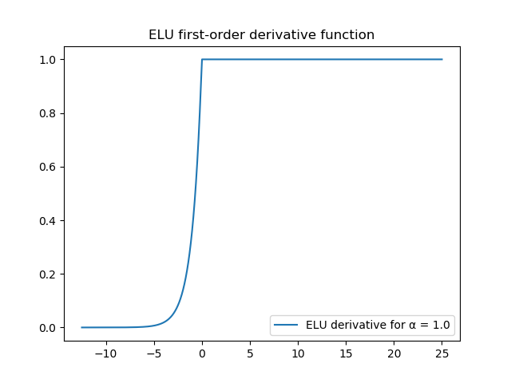
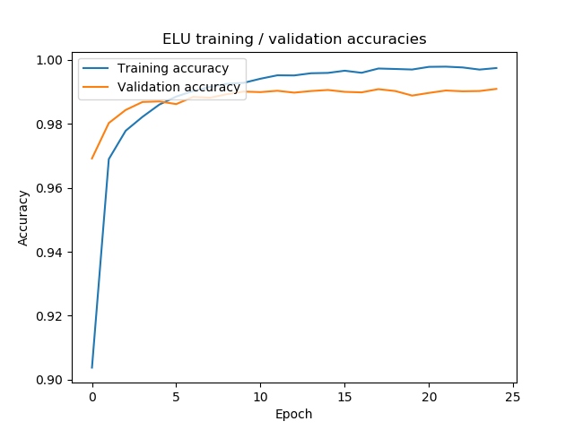
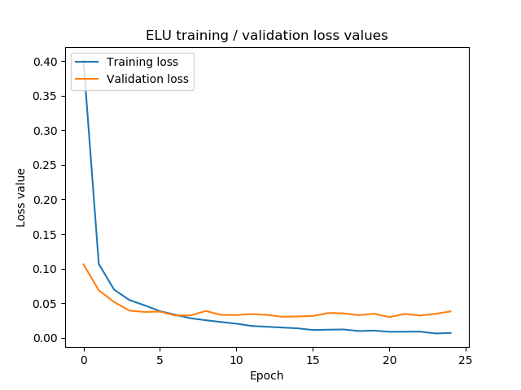
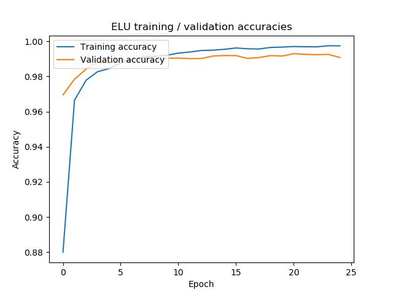
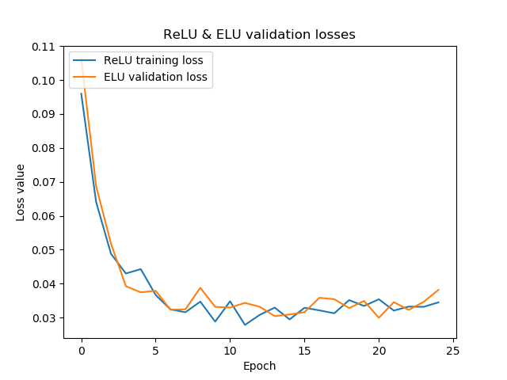
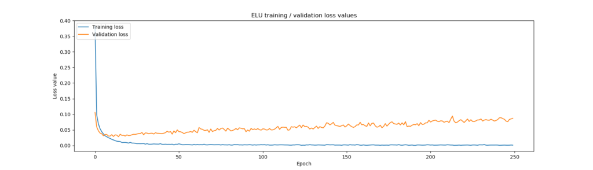
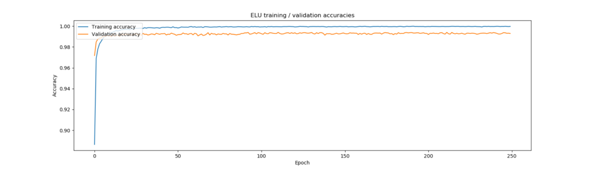
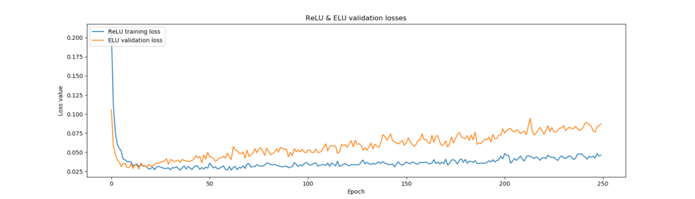

Exponential Linear Unit is a new type of activation function that attempts to resolve both the defects of traditional ReLU activation and the ones that have already attempted to resolve its problems, being Leaky ReLU and PReLU.

But what is wrong with ReLU in the first place? And why was ELU suggested in place of Leaky ReLU and PReLU? We'll find out in this blog. We start with ReLU, why it's better than classic activation functions but also why it introduces new ones. We then cover PReLU and Leaky ReLU and see while how they resolve ReLU's problems, they also introduce a new one, being noise sensitivity.

ELU, which we cover subsequently, attempts to resolve this problem by introducing a saturation value at the negative part of the input spectrum. We show how to implement this with Python by providing a Keras example, using a ConvNet that is trained on the MNIST dataset. The results suggest that ELU might benefit you, but only if you train for many epochs, possibly with deeper networks.

\[toc\]

## Recap: what was the point with ReLU, again?

Rectified Linear Unit, or [ReLU](https://www.machinecurve.com/index.php/2019/09/04/relu-sigmoid-and-tanh-todays-most-used-activation-functions/) for short, is one of the most widely used activation functions these days. It works really well and due to the fact that it can be used across various machine learning problems it has grown into what it is today. It is also a really simple activation function, outputting zero for all \[latex\]x < 0\[/latex\] and outputting \[latex\]x\[/latex\] (i.e., the input) in all the other cases.

[](https://www.machinecurve.com/wp-content/uploads/2019/09/relu_and_deriv.jpeg)

Among others, this makes your model _sparse_, since many of the inputs result in neurons that are deactivated: only the important neurons will keep firing and playing a role in the training process.

Another benefit is related to the gradients produced by the ReLU activation function.

### No vanishing gradients

As you might recall from the [high-level supervised machine learning process](https://www.machinecurve.com/index.php/2019/10/04/about-loss-and-loss-functions/#the-high-level-supervised-learning-process), during training, your trainingset is _fed forward_, generating predictions based on the current state of the model. These predictions are subsequently converted into a loss value, which can be used to optimize the model's weights - repeating this process over and over again, until you stop training.

But how to improve? From the article about [gradient descent based optimization](https://www.machinecurve.com/index.php/2019/10/24/gradient-descent-and-its-variants/) or [adaptive optimization](https://www.machinecurve.com/index.php/2019/11/03/extensions-to-gradient-descent-from-momentum-to-adabound/), we recall that two elements play a role here: first, the optimizer, and second, backpropagation.

The optimizer will _actually change the weights in order to improve the model_. But if you want to change the weights, you must know how by much they should change - in theory. This is what the _gradient_ is for, or the change that should be applied to a neuron with respect to the current loss value.

However, neural networks are layered, and their neurons - present in these layers - are linked to each other through artificial synapses. This means that if we wish to compute the gradient for a particular layer, we always have to take into account the gradients of the layers in between that particular layer and the loss value. We essentially have to compute the gradient while taking into account some layer, some other layer, (....and so on...) and finally the prediction error (a.k.a. loss value).

[](https://www.machinecurve.com/wp-content/uploads/2019/09/sigmoid_and_deriv.jpeg)

As can be seen from the plot, activation functions like the Sigmoid function produce gradients that cannot be more than 0.25 given any input. In most cases, the value is even smaller, converging to zero for large positive and large negative numbers.

This is bad, especially for really large networks - i.e., the ones that we see today, with many (i.e., dozens) of layers.

Because when chaining the gradients together in these cases, you would for four layers in between find a gradient of (0.25^4) = 0.00390625 at max for the particular upstream layer. Welcome to what is called the **[vanishing gradients problem.](https://www.machinecurve.com/index.php/2019/08/30/random-initialization-vanishing-and-exploding-gradients/)** In those cases, upstream layers learn very slowly or do not converge at all, essentially wasting all your resources as you will never get the results you want.

[](https://www.machinecurve.com/wp-content/uploads/2019/09/relu_and_deriv.jpeg)

Fortunately, ReLU is not sensitive to the vanishing gradients problem - as can be seen from the plot above. The gradient is either zero or one. No more vanishing gradients 👯‍♂️

Besides simplicity (computing the output is performing the computationally inexpensive operation `max(x, 0)`), this is actually one of the reasons why ReLU is so popular today.

### Dying ReLUs instead

Unfortunately, the party ends now 😑

The fact that gradients are **one or zero** introduces an entirely new problem, being the **dying ReLU problem**.

What is the dying ReLU problem? Let's take a look at the ReLU gradient again:

[](https://www.machinecurve.com/wp-content/uploads/2019/09/relu_and_deriv.jpeg)

The gradient is _either zero or one_.

While small gradients silence the chained gradients for upstream layers, having _one_ zero ReLU gradient somewhere within the chain of gradients will silence your layer entirely.

Which means that your neuron cannot improve, and that it is actually dead.

Given enough such dead neurons, your network will once again learn very slowly or fail to converge at all.

You're back in trouble again.

What's more, since the outputs are zero for all negative inputs and equal to the input when they are positive, the mean activation of any ReLU neuron is nonzero. This impacts the next layers, most presumably slowing down the learning process compared to activation functions that _do_ activate close to zero (Clevert et al., 2015).

Fortunately, new activation functions are to the rescue.

## Recap: what's wrong with Leaky ReLU and PReLU?

These functions all _change the ReLU formula_ slightly in order to overcome some of the problems:

- **[Leaky ReLU](https://www.machinecurve.com/index.php/2019/11/12/using-leaky-relu-with-keras/)** sets the negative part of the formula to really small but nonzero outputs (the inputs are being multiplied by some parameter \[latex\]\\alpha\[/latex\]), which means that dying neurons are no longer present.
- **[PReLU](https://www.machinecurve.com/index.php/2019/12/05/how-to-use-prelu-with-keras/)** recognizes that setting \[latex\]\\alpha\[/latex\] manually in advance of training means that certain assumptions about the data and the model have to be made. Such assumptions may not hold or may not be fully perfect for the particular ML problem, which means that performance may deteriorate. PReLU generalizes Leaky ReLU to a situation where \[latex\]\\alpha\[/latex\] is made input-specific and becomes trainable. As with Leaky ReLU, this avoids the dying ReLU problem.

Unfortunately, while they do contribute towards a better activation function, the functions do still not solve all the well-known issues.

In their paper "Fast and accurate deep network learning by exponential linear units", Clevert et al. (2015) argue that they introduce new issues. While they are not too sensitive to the vanishing gradients problem and remove the dying ReLU problem from the equation, they have no such thing as a "noise-rebust deactivation state" (Clevert et al, 2015).

[](https://www.machinecurve.com/wp-content/uploads/2019/10/leaky_relu.png)

What this means can be derived from the visualization above. For positive inputs, the Leaky ReLU activation function displayed behaves like traditional ReLU. For negative inputs, the outputs are small but nonzero. So far, so good.

But what happens if, for example, we input -5.000.000? While this does not happen quite often - we hope - the input would still be very negative.

The risk of this happening increases when the Leaky ReLU \[latex\]\\alpha\[/latex\] is increased (steepening the curve) or when the same happens with the learned PReLU \[latex\]\\alpha\[/latex\]s.

_Any noise will this interfere with training, and this is a new problem introduced by Leaky ReLU and PReLU, according to Clevert et al._

## What are ELUs?

This is why they propose a new activation function, called the **Exponential Linear Unit** (or ELU), which shares PReLU/Leaky ReLU benefits yet improves them as well (Clevert et al., 2015):

- ELU is not too sensitive to vanishing gradients and removes the dying ReLU problem.
- Mean ELU activations are closer to zero, which is estimated to make the learning process faster - a fact shared by PReLU and Leaky ReLU.
- ELU saturates to a fixed negative value with decreasing input, making it relatively robust to noise.

ELU can be written down mathematically as:

\\begin{equation} f(x) = \\begin{cases} x, & \\text{if}\\ x >= 0 \\\\ \\alpha(exp(x) -1), & \\text{otherwise} \\\\ \\end{cases} \\end{equation}

Do note that according to the paper, \[latex\]\\alpha > 0\[/latex\] must hold for ELU to work. This must be the case since \[latex\]\\alpha\[/latex\] represents the absolute value of the negative saturation level; by definition of the formula above this must be larger than zero.

This looks as follows:

[](https://www.machinecurve.com/wp-content/uploads/2019/12/elu_avf.png)

And this is the gradient function:

[](https://www.machinecurve.com/wp-content/uploads/2019/12/elu_deriv.png)

As you can see, the _vanishing gradients_ and the _dying neurons_ are gone (gradient plot) - and the function saturates to \[latex\]f(x) = -1.0\[/latex\], as configured with \[latex\]\\alpha = 1.0\[/latex\]. According to Clevert et al. (2015), this makes ELU "well suited for deep neural networks with many layers (...) \[enabling\] faster learning \[as well through mean activations close to zero\]".

### Empirical tests with ELU

Clevert et al. (2015) validated the effectiveness of the ELU activation function with multiple standard datasets:

- With the **MNIST dataset**, which contains 70k grayscale images of digits and hence 10 classes, median activation was closer to zero and faster decrease in error rate was reported.
- With the **CIFAR10 dataset**, which contains 60k color images in 10 categories and thus classes, ELU based networks showed significantly lower test error rates compared to other architectures.
- With the **CIFAR100 dataset**, which contains 60k color images in 100 categories and thus classes, the same results were reported.
- With the **ImageNet dataset**, which contains 1.4M color images in 1000 categories, a faster decrease in error rate was reported as well as lower error rates.

Note that [He initialization](https://www.machinecurve.com/index.php/2019/09/16/he-xavier-initialization-activation-functions-choose-wisely/) (He et al., 2015) was used throughout all cases since we're working with ReLU-like activation functions here, which are traditionally incompatible with standard Xavier (or Glorot) [weight initialization](https://www.machinecurve.com/index.php/2019/08/22/what-is-weight-initialization/).

I would like to refer you to the [original paper](#references) if you wish to look at the results in more detail.

## Implementing ELUs with Keras

Let's now see if we can achieve similar results when implementing ELUs with Keras. I'm especially curious to see whether we can replicate them with the MNIST dataset, as this has been difficult with Leaky ReLU and PReLU.

Why this occurs? Presumably due to the relative ease of training given the discriminative power of the dataset, as well as the relative shallowness of the network, making it less sensitive to e.g. vanishing gradients.

We'll therefore code a Keras model today 😀

I won't explain the model here except its few ideosyncrasies, since it's the Keras CNN [we coded in another blog](https://www.machinecurve.com/index.php/2019/09/17/how-to-create-a-cnn-classifier-with-keras/). Hence, if you wish to understand the architectural components of this model in more detail, I'd recommend you take a look at the other blog post 😄

```
import keras
from keras.datasets import mnist
from keras.models import Sequential
from keras.layers import Dense, Dropout, Flatten
from keras.layers import Conv2D, MaxPooling2D
from keras.initializers import Constant
from keras import backend as K
from keras.layers import ELU
import matplotlib.pyplot as plt

# Model configuration
img_width, img_height = 28, 28
batch_size = 250
no_epochs = 25
no_classes = 10
validation_split = 0.2
verbosity = 1
elu_alpha = 0.1

# Load MNIST dataset
(input_train, target_train), (input_test, target_test) = mnist.load_data()

# Reshape data based on channels first / channels last strategy.
# This is dependent on whether you use TF, Theano or CNTK as backend.
# Source: https://github.com/keras-team/keras/blob/master/examples/mnist_cnn.py
if K.image_data_format() == 'channels_first':
    input_train = input_train.reshape(input_train.shape[0], 1, img_width, img_height)
    input_test = input_test.reshape(input_test.shape[0], 1, img_width, img_height)
    input_shape = (1, img_width, img_height)
else:
    input_train = input_train.reshape(input_train.shape[0], img_width, img_height, 1)
    input_test = input_test.reshape(input_test.shape[0], img_width, img_height, 1)
    input_shape = (img_width, img_height, 1)

# Parse numbers as floats
input_train = input_train.astype('float32')
input_test = input_test.astype('float32')

# Normalize data [0, 1].
input_train = input_train / 255
input_test = input_test / 255

# Convert target vectors to categorical targets
target_train = keras.utils.to_categorical(target_train, no_classes)
target_test = keras.utils.to_categorical(target_test, no_classes)

# Create the model
model = Sequential()
model.add(Conv2D(32, kernel_size=(3, 3), input_shape=input_shape, kernel_initializer='he_normal'))
model.add(ELU(alpha=elu_alpha))
model.add(MaxPooling2D(pool_size=(2, 2)))
model.add(Dropout(0.25))
model.add(Conv2D(64, kernel_size=(3, 3), kernel_initializer='he_normal'))
model.add(ELU(alpha=elu_alpha))
model.add(MaxPooling2D(pool_size=(2, 2)))
model.add(Dropout(0.25))
model.add(Flatten())
model.add(Dense(256, kernel_initializer='he_normal'))
model.add(ELU(alpha=elu_alpha))
model.add(Dense(no_classes, activation='softmax', kernel_initializer='he_normal'))

# Compile the model
model.compile(loss=keras.losses.categorical_crossentropy,
              optimizer=keras.optimizers.Adam(),
              metrics=['accuracy'])

# Fit data to model
history = model.fit(input_train, target_train,
          batch_size=batch_size,
          epochs=no_epochs,
          verbose=verbosity,
          validation_split=validation_split)


# Generate generalization metrics
score = model.evaluate(input_test, target_test, verbose=0)
print(f'Test loss for Keras ELU CNN: {score[0]} / Test accuracy: {score[1]}')

# Visualize model history
plt.plot(history.history['accuracy'], label='Training accuracy')
plt.plot(history.history['val_accuracy'], label='Validation accuracy')
plt.title('ELU training / validation accuracies')
plt.ylabel('Accuracy')
plt.xlabel('Epoch')
plt.legend(loc="upper left")
plt.show()

plt.plot(history.history['loss'], label='Training loss')
plt.plot(history.history['val_loss'], label='Validation loss')
plt.title('ELU training / validation loss values')
plt.ylabel('Loss value')
plt.xlabel('Epoch')
plt.legend(loc="upper left")
plt.show()
```

These are the differences:

- We configure an `elu_alpha` value in the model configuration section, which simply specifies the \[latex\]\\alpha\[/latex\] value for the ELU activation layers.
- We apply [He initialization](https://www.machinecurve.com/index.php/2019/09/16/he-xavier-initialization-activation-functions-choose-wisely/) to the Conv2D and Dense layers, in line with Clevert et al. (2015) given the findings of He et al. (2015).

Generating the evaluation metrics & visualizations is also in line with what we've seen in the blog about [visualizing the training process](https://www.machinecurve.com/index.php/2019/10/08/how-to-visualize-the-training-process-in-keras/):

```
# Generate generalization metrics
score = model.evaluate(input_test, target_test, verbose=0)
print(f'Test loss for Keras ELU CNN: {score[0]} / Test accuracy: {score[1]}')

# Visualize model history
plt.plot(history.history['accuracy'], label='Training accuracy')
plt.plot(history.history['val_accuracy'], label='Validation accuracy')
plt.title('ELU training / validation accuracies')
plt.ylabel('Accuracy')
plt.xlabel('Epoch')
plt.legend(loc="upper left")
plt.show()

plt.plot(history.history['loss'], label='Training loss')
plt.plot(history.history['val_loss'], label='Validation loss')
plt.title('ELU training / validation loss values')
plt.ylabel('Loss value')
plt.xlabel('Epoch')
plt.legend(loc="upper left")
plt.show()
```

## Results

I've trained this architecture both with ELU (\[latex\]\\alpha = 1.0\[/latex\]) and with traditional ReLU, for both Xavier/Glorot (standard) weight initialization and He initialization (as recommended for ReLUs).

### ReLU/ELU with Xavier/Glorot init

With Xavier/Glorot init, ELU performs slightly worse than traditional ReLU: loss is higher, and ELU activation seems to have started overfitting.

```
Test loss for Keras ReLU CNN: 0.03084432035842483 / Test accuracy: 0.9915000200271606
Test loss for Keras ELU CNN: 0.04917487791230358 / Test accuracy: 0.9905999898910522
```

- [](https://www.machinecurve.com/wp-content/uploads/2019/12/elu_acc.png)
    
- [](https://www.machinecurve.com/wp-content/uploads/2019/12/elu_loss.png)
    
- [](https://www.machinecurve.com/wp-content/uploads/2019/12/elu_relu.png)
    

### ReLU/ELU with He init

With He init, however, ELU performs slightly _better_ (albeit really slightly!) than ReLU in terms of loss. What's more, the steep increase towards the 25th epoch is gone, possibly showing the benefit of He init when using ELU.

```
Test loss for Keras ReLU CNN: 0.03047580350333262 / Test accuracy: 0.9918000102043152
Test loss for Keras ELU CNN: 0.029303575038436554 / Test accuracy: 0.9922000169754028
```

- [](https://www.machinecurve.com/wp-content/uploads/2019/12/elu_he_loss.png)
    
- [](https://www.machinecurve.com/wp-content/uploads/2019/12/elu_he_acc.png)
    
- [](https://www.machinecurve.com/wp-content/uploads/2019/12/elu_he_relu.png)
    

### ReLU & ELU, He init, 250 epochs

These are the results when training the model with ReLU and ELU activations, with He init, for 250 epochs, with Dropout increased to 0.5 (from 0.25) to avoid overfitting:

```
Test loss for Keras ReLU CNN: 0.042991068468006335 / Test accuracy: 0.9923999905586243
Test loss for Keras ELU CNN: 0.08624260328077216 / Test accuracy: 0.9908999800682068
```

- [](https://www.machinecurve.com/wp-content/uploads/2019/12/long_elu_loss.png)
    
- [](https://www.machinecurve.com/wp-content/uploads/2019/12/long_elu_acc.png)
    
- [](https://www.machinecurve.com/wp-content/uploads/2019/12/long_elu_relu.png)
    

The results are both positive and negative. Yes, we do observe in line with the authors that ELU results in faster convergence and hence a sped-up training process, but we _also_ observe that overfitting occurs faster when ConvNets are trained with ELU. Hence, when considering ELU, you may wish to use [EarlyStopping with ModelCheckpointing](https://www.machinecurve.com/index.php/2019/05/30/avoid-wasting-resources-with-earlystopping-and-modelcheckpoint-in-keras/) in parallel to stop at precisely the correct point.

### Interpretation

He init is necessary when using ELU, that's clear. Even then, for smaller models, it converges to values that are close to ReLU.

This made me think: **the fact that ELU performs less powerful here, does not mean that ELU is useless.** On the contrary:

- It may still benefit you when training deeper networks.
- When training for 250 epochs, the suggested speedier convergence is indeed observed, but we also note that ELU results in stronger overfitting.
- It may be the case that a particular setting is hampering learning. Perhaps, it's the Dropout from the architecture, which was not present in Clevert et al. (2015)? Who knows. Additional research is required into this.
- Perhaps, we find improvements if we let it train for ten times as long (i.e., 250 epochs).

Hence: consider ELU when you face dying ReLUs and wish to avoid vanishing gradients, but consider it carefully, taking [proper mitigation measures](https://www.machinecurve.com/index.php/2019/05/30/avoid-wasting-resources-with-earlystopping-and-modelcheckpoint-in-keras/).

## Summary

In this blog post, we've seen how Exponential Linear Units attempt to resolve both the problems of traditional activation functions (being vanishing gradients) and the problems of the newer ones trying to resolve additional problems (being dying ReLUs). Recognizing that these newer functions have nonzero mean activations, which slow down the training process, Clevert et al. (2015) have added a nonzero negative part that saturates to a particular value when activating. This, they argue, makes the activation more robust to noise.

We provided a Keras implementation of this so-called ELU activation function. How it works, can be found above. Empirically, with a small neural network with only few epochs, ELU showed similar results to traditional ReLU. When the number of epochs was increased, the speedier convergence was found, at the risk of increased overfitting. As we noted, this does not necessarily mean that ELU is not useful. You'll just need to apply it carefully - while additional R&D is required to validate these findings further.

Thanks for reading MachineCurve today and happy engineering! 😎

## References

Clevert, D. A., Unterthiner, T., & Hochreiter, S. (2015). Fast and accurate deep network learning by exponential linear units (elus). _[arXiv preprint arXiv:1511.07289](https://arxiv.org/abs/1511.07289)_.

He, K., Zhang, X., Ren, S., & Sun, J. (2015). Delving Deep into Rectifiers: Surpassing Human-Level Performance on ImageNet Classification. _2015 IEEE International Conference on Computer Vision (ICCV)_. [doi:10.1109/iccv.2015.123](https://arxiv.org/abs/1502.01852)

Keras. (n.d.). Advanced Activations Layers: Exponential Linear Unit. Retrieved from [https://keras.io/layers/advanced-activations/#elu](https://keras.io/layers/advanced-activations/#elu)
