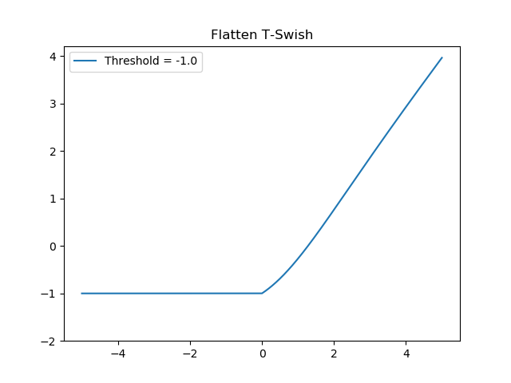
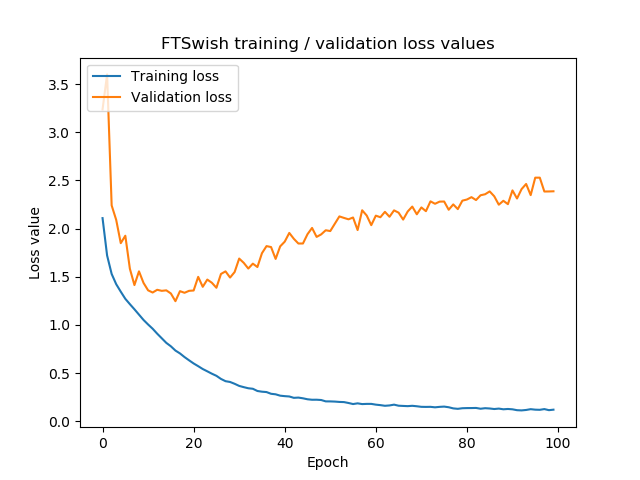

Flatten-T Swish is a new (2018) activation function that attempts to find the best of both worlds between traditional ReLU and traditional Sigmoid.

However, it's not readily available within the Keras deep learning framework, which only covers the standard activation functions like ReLU and Sigmoid.

Therefore, in today's blog, we'll implement it ourselves. First, we'll take a look at FTSwish - by providing a recap - and then implement it using Keras. This blog also includes an example model which uses FTSwish, and evaluates the model after training.

Are you ready?

Let's go! 😊

* * *

\[toc\]

* * *

## Recap: what is FTSwish?

In our blog post "[What is the FTSwish activation function?](https://www.machinecurve.com/index.php/2020/01/03/what-is-the-ftswish-activation-function/)" we looked at what the Flatten-T Swish or FTSwish activation function is like. Here, we'll recap the essentials, so that you can understand with ease what we're going to build next.

We can define FTSwish as follows:

\\begin{equation} FTSwish: f(x) = \\begin{cases} T, & \\text{if}\\ x < 0 \\\\ \\frac{x}{1 + e^{-x}} + T, & \\text{otherwise} \\\\ \\end{cases} \\end{equation}

It's essentially a combination of the **ReLU** and **Sigmoid** activation functions, with some threshold `T` which ensures that negative inputs always yield nonzero outputs.

It looks as follows:

[](https://www.machinecurve.com/wp-content/uploads/2020/01/ftswish-1.png)

And indeed, it does resemble Swish in a way:

[](https://www.machinecurve.com/wp-content/uploads/2019/11/relu_swish.png)

* * *

## Defining FTSwish as a Keras activation function

Keras has a range of activation functions available, but FTSwish is not one of them. Fortunately, it's possible to define your own activations, so yes: we can still use FTSwish with Keras :) Let's now find out how.

In any Keras model, you'll first have to import the backend you're working with, in order to provide tensor-specific operations such as `maximum`:

```
from keras import backend as K
```

We can then define the FTSwish activation function as follows:

```
# Define
t = -1.0
def ftswish(x):
  return K.maximum(t, K.relu(x)*K.sigmoid(x) + t)
```

Let's break the definition down into understandable steps:

- The value for `t` is the threshold value \[latex\]T\[/latex\], which in our case is -1.0. It ensures that negative inputs saturate to this value. Its value can be different, but take a look at the derivative plot to ensure that you'll have a smooth one.
- Next, the `def` (definition) ensures that we can use `ftswish` as some kind of function - mapping some input to an output. It also means that we can simply feed it to Keras later, to be used in processing.
- Note that FTSwish _combines_ ReLU and Sigmoid with a threshold value for _positive_ inputs, in a way that it can be broken apart in a multiplication:
    - `K.relu` is the ReLU part.
    - `K.sigmoid` is the Sigmoid part.
    - Multiplying them yields the ReLU/Sigmoid part of the FTSwish activation function.
    - Adding the threshold is simply adding `t` to the outcome of the multiplication.
- Note that `ReLU`, which is \[latex\]0\[/latex\] for negative inputs and \[latex\]x\[/latex\] for others, can be rewritten to \[latex\]max(0, x)\[/latex\] (indeed: \[latex\]x = 4\[/latex\] yields outputs of 4, while \[latex\]x = -2\[/latex\] yields 0. This is in line with the ReLU definition). Hence, given the formula for FTSwish above, we can rewrite it to a `max` between `t` (the negative output) and the ReLU/Sigmoid combination (the positive output).
- We're using `K` instead of `np` because we're performing these operations on multidimensional tensors.

* * *

## Example model using FTSwish

Let's now create an example with Keras :) Open up your Explorer or Finder, navigate to some folder, and create a Python file, e.g. `model_ftswish.py`.

### What you'll need to run this model

- **Python**, which we'll write our code in. Preferably, use Python 3.6+.
- **Keras**, which is the deep learning framework we're using.
- **Tensorflow**, which is now the preferred backend for Keras.
- **Matplotlib** and **Numpy**, to support our model in terms of visualization and number processing.

### Model imports

Now, open up `model_ftswish.py` in a code editor and start coding :) First, we'll add the imports:

```
'''
  Keras model using Flatten-T Swish (FTSwish) activation function
  Source for FTSwish activation function:
    Chieng, H. H., Wahid, N., Ong, P., & Perla, S. R. K. (2018). Flatten-T Swish: a thresholded ReLU-Swish-like activation function for deep learning. arXiv preprint arXiv:1812.06247.
    https://arxiv.org/abs/1812.06247
'''
import keras
from keras.datasets import cifar10
from keras.models import Sequential
from keras.layers import Dense, Dropout, Flatten
from keras.layers import Conv2D, MaxPooling2D
from keras import backend as K
import matplotlib.pyplot as plt
import numpy as np
```

As expected, we'll imporrt `keras` and a lot of sub parts of it: the `cifar10` dataset (which we'll use today), the `Sequential` API for easy stacking of our layers, all the layers that are common in a ConvNet, and the Keras backend (which, in our case, maps to Tensorflow). Finally, we also import `pyplot` from Matplotlib and `numpy`.

### Model configuration

Next, it's time to set some configuration values:

```
# Model configuration
img_width, img_height = 32, 32
batch_size = 250
no_epochs = 100
no_classes = 10
validation_split = 0.2
verbosity = 1
```

The [CIFAR-10 dataset](https://www.machinecurve.com/index.php/2019/12/31/exploring-the-keras-datasets/#cifar-10-small-image-classification) which we're using today contains 32 x 32 pixels images across 10 different classes. Hence, `img_width = img_height = 32`, and `no_classes = 10`. The `batch_size` is 250 which is a fairly OK setting based on experience ([click here to find out why to balance between high batch sizes and memory requirements](https://www.machinecurve.com/index.php/2019/10/24/gradient-descent-and-its-variants/)). We train for 100 `epochs`, and use 20% of our training data for validation purposes. We output everything on screen by setting `verbosity` to True.

### Loading & preparing the data

We next load the CIFAR-10 data:

```
# Load CIFAR-10 dataset
(input_train, target_train), (input_test, target_test) = cifar10.load_data()
```

Which easily loads the CIFAR-10 samples into our training and testing variables:

- [](https://www.machinecurve.com/wp-content/uploads/2019/12/45028.jpg)
    
- [](https://www.machinecurve.com/wp-content/uploads/2019/12/42180.jpg)
    
- [](https://www.machinecurve.com/wp-content/uploads/2019/12/41192.jpg)
    
- [](https://www.machinecurve.com/wp-content/uploads/2019/12/40969.jpg)
    
- [](https://www.machinecurve.com/wp-content/uploads/2019/12/38811.jpg)
    
- [](https://www.machinecurve.com/wp-content/uploads/2019/12/38333.jpg)
    
- [](https://www.machinecurve.com/wp-content/uploads/2019/12/38151.jpg)
    
- [](https://www.machinecurve.com/wp-content/uploads/2019/12/37932.jpg)
    
- [](https://www.machinecurve.com/wp-content/uploads/2019/12/37591.jpg)
    
- [](https://www.machinecurve.com/wp-content/uploads/2019/12/36450.jpg)
    
- [](https://www.machinecurve.com/wp-content/uploads/2019/12/36144.jpg)
    
- [](https://www.machinecurve.com/wp-content/uploads/2019/12/28291.jpg)
    
- [](https://www.machinecurve.com/wp-content/uploads/2019/12/28222.jpg)
    
- [](https://www.machinecurve.com/wp-content/uploads/2019/12/27569.jpg)
    
- [](https://www.machinecurve.com/wp-content/uploads/2019/12/27447.jpg)
    

_A few CIFAR-10 samples._

After loading, we reshape the data based on the channels first/channels last approach used by our backend (to ensure that we can use a fixed `input_shape`):

```
# Reshape data based on channels first / channels last strategy.
# This is dependent on whether you use TF, Theano or CNTK as backend.
# Source: https://github.com/keras-team/keras/blob/master/examples/mnist_cnn.py
if K.image_data_format() == 'channels_first':
    input_train = input_train.reshape(input_train.shape[0], 3, img_width, img_height)
    input_test = input_test.reshape(input_test.shape[0], 3, img_width, img_height)
    input_shape = (3, img_width, img_height)
else:
    input_train = input_train.reshape(input_train.shape[0], img_width, img_height, 3)
    input_test = input_test.reshape(input_test.shape[0], img_width, img_height, 3)
    input_shape = (img_width, img_height, 3)
```

Then, we parse our numbers into `float32` format, which presumably speeds up our training process:

```
# Parse numbers as floats
input_train = input_train.astype('float32')
input_test = input_test.astype('float32')
```

This is followed by normalizing our data to be in the \[latex\]\[-1, 1\]\[/latex\] range, which is appreciated by the neural network during optimization:

```
# Normalize data
input_train = input_train / 255
input_test = input_test / 255
```

Finally, we convert our targets into _categorical format_, which allows us to use [categorical crossentropy loss](https://www.machinecurve.com/index.php/2019/10/22/how-to-use-binary-categorical-crossentropy-with-keras/) later:

```
# Convert target vectors to categorical targets
target_train = keras.utils.to_categorical(target_train, no_classes)
target_test = keras.utils.to_categorical(target_test, no_classes)
```

### Adding the defined FTSwish activation function

We can next add the definition of the FTSwish activation function we created earlier:

```
# Define
t = -1.0
def ftswish(x):
  return K.maximum(t, K.relu(x)*K.sigmoid(x) + t)
```

### Creating the model architecture

Then, we can create the architecture of our model.

```
# Create the model
model = Sequential()
model.add(Conv2D(64, kernel_size=(3, 3), activation=ftswish, input_shape=input_shape, kernel_initializer='he_normal'))
model.add(MaxPooling2D(pool_size=(2, 2)))
model.add(Dropout(0.5))
model.add(Conv2D(128, kernel_size=(3, 3), activation=ftswish, kernel_initializer='he_normal'))
model.add(MaxPooling2D(pool_size=(2, 2)))
model.add(Dropout(0.5))
model.add(Flatten())
model.add(Dense(512, kernel_initializer='he_normal', activation=ftswish))
model.add(Dense(256, kernel_initializer='he_normal', activation=ftswish))
model.add(Dense(no_classes, activation='softmax', kernel_initializer='he_normal'))
```

It's a relatively simple ConvNet, with two Conv2D layers, max pooling, [Dropout](https://www.machinecurve.com/index.php/2019/12/16/what-is-dropout-reduce-overfitting-in-your-neural-networks/) and finally Dense layers for classification. We use [He init](https://www.machinecurve.com/index.php/2019/09/16/he-xavier-initialization-activation-functions-choose-wisely/) because our activation function resembles ReLU.

### Compiling the model

Next, we can compile the model:

```
# Compile the model
model.compile(loss=keras.losses.categorical_crossentropy,
              optimizer=keras.optimizers.Adam(),
              metrics=['accuracy'])
```

Because we are facing a multiclass classification problem with one-hot encoded vectors (by virtue of calling `to_categorical`), we'll be using [categorical crossentropy](https://www.machinecurve.com/index.php/2019/10/22/how-to-use-binary-categorical-crossentropy-with-keras/). If you wish to skip the conversion to categorical targets, you might want to replace this with [sparse categorical crossentropy](https://www.machinecurve.com/index.php/2019/10/06/how-to-use-sparse-categorical-crossentropy-in-keras/), which supports integer targets.

For optimization, we use the [Adam optimizer](https://www.machinecurve.com/index.php/2019/11/03/extensions-to-gradient-descent-from-momentum-to-adabound/#adam) - the default choice for today's neural networks. Finally, we specify `accuracy` as an additional metric, which is more intuitive than crossentropy loss.

### Fitting the data

Then, we fit the training data, configuring the model in line with how we specified our model configuration before:

```
# Fit data to model
history_FTSwish = model.fit(input_train, target_train,
          batch_size=batch_size,
          epochs=no_epochs,
          verbose=verbosity,
          validation_split=validation_split)
```

### Evaluation metrics & model history

The final thing we do is adding code for evaluation (using our _testing data_) and [visualizing the training process](https://www.machinecurve.com/index.php/2019/10/08/how-to-visualize-the-training-process-in-keras/):

```
# Generate evaluation metrics
score = model.evaluate(input_test, target_test, verbose=0)
print(f'Test loss for Keras FTSwish CNN: {score[0]} / Test accuracy: {score[1]}')

# Visualize model history
plt.plot(history_FTSwish.history['accuracy'], label='Training accuracy')
plt.plot(history_FTSwish.history['val_accuracy'], label='Validation accuracy')
plt.title('FTSwish training / validation accuracies')
plt.ylabel('Accuracy')
plt.xlabel('Epoch')
plt.legend(loc="upper left")
plt.show()

plt.plot(history_FTSwish.history['loss'], label='Training loss')
plt.plot(history_FTSwish.history['val_loss'], label='Validation loss')
plt.title('FTSwish training / validation loss values')
plt.ylabel('Loss value')
plt.xlabel('Epoch')
plt.legend(loc="upper left")
plt.show()
```

### Full model code

It's also possible to get the full model code at once, should you wish to start playing around with it. In that case, here you go:

```
'''
  Keras model using Flatten-T Swish (FTSwish) activation function
  Source for FTSwish activation function:
    Chieng, H. H., Wahid, N., Ong, P., & Perla, S. R. K. (2018). Flatten-T Swish: a thresholded ReLU-Swish-like activation function for deep learning. arXiv preprint arXiv:1812.06247.
    https://arxiv.org/abs/1812.06247
'''
import keras
from keras.datasets import cifar10
from keras.models import Sequential
from keras.layers import Dense, Dropout, Flatten
from keras.layers import Conv2D, MaxPooling2D
from keras import backend as K
import matplotlib.pyplot as plt
import numpy as np

# Model configuration
img_width, img_height = 32, 32
batch_size = 250
no_epochs = 100
no_classes = 10
validation_split = 0.2
verbosity = 1

# Load CIFAR-10 dataset
(input_train, target_train), (input_test, target_test) = cifar10.load_data()

# Reshape data based on channels first / channels last strategy.
# This is dependent on whether you use TF, Theano or CNTK as backend.
# Source: https://github.com/keras-team/keras/blob/master/examples/mnist_cnn.py
if K.image_data_format() == 'channels_first':
    input_train = input_train.reshape(input_train.shape[0], 3, img_width, img_height)
    input_test = input_test.reshape(input_test.shape[0], 3, img_width, img_height)
    input_shape = (3, img_width, img_height)
else:
    input_train = input_train.reshape(input_train.shape[0], img_width, img_height, 3)
    input_test = input_test.reshape(input_test.shape[0], img_width, img_height, 3)
    input_shape = (img_width, img_height, 3)

# Parse numbers as floats
input_train = input_train.astype('float32')
input_test = input_test.astype('float32')

# Normalize data
input_train = input_train / 255
input_test = input_test / 255

# Convert target vectors to categorical targets
target_train = keras.utils.to_categorical(target_train, no_classes)
target_test = keras.utils.to_categorical(target_test, no_classes)

# Define
t = -1.0
def ftswish(x):
  return K.maximum(t, K.relu(x)*K.sigmoid(x) + t)

# Create the model
model = Sequential()
model.add(Conv2D(64, kernel_size=(3, 3), activation=ftswish, input_shape=input_shape, kernel_initializer='he_normal'))
model.add(MaxPooling2D(pool_size=(2, 2)))
model.add(Dropout(0.5))
model.add(Conv2D(128, kernel_size=(3, 3), activation=ftswish, kernel_initializer='he_normal'))
model.add(MaxPooling2D(pool_size=(2, 2)))
model.add(Dropout(0.5))
model.add(Flatten())
model.add(Dense(256, kernel_initializer='he_normal', activation=ftswish))
model.add(Dense(no_classes, activation='softmax', kernel_initializer='he_normal'))

# Compile the model
model.compile(loss=keras.losses.categorical_crossentropy,
              optimizer=keras.optimizers.Adam(),
              metrics=['accuracy'])

# Fit data to model
history_FTSwish = model.fit(input_train, target_train,
          batch_size=batch_size,
          epochs=no_epochs,
          verbose=verbosity,
          validation_split=validation_split)


# Generate evaluation metrics
score = model.evaluate(input_test, target_test, verbose=0)
print(f'Test loss for Keras FTSwish CNN: {score[0]} / Test accuracy: {score[1]}')

# Visualize model history
plt.plot(history_FTSwish.history['accuracy'], label='Training accuracy')
plt.plot(history_FTSwish.history['val_accuracy'], label='Validation accuracy')
plt.title('FTSwish training / validation accuracies')
plt.ylabel('Accuracy')
plt.xlabel('Epoch')
plt.legend(loc="upper left")
plt.show()

plt.plot(history_FTSwish.history['loss'], label='Training loss')
plt.plot(history_FTSwish.history['val_loss'], label='Validation loss')
plt.title('FTSwish training / validation loss values')
plt.ylabel('Loss value')
plt.xlabel('Epoch')
plt.legend(loc="upper left")
plt.show()
```

* * *

## Results

Now that you have finished creating the model, it's time to train it - and to see the results :)

Open up a terminal that supports the dependencies listed above, `cd` into the folder where your Python file is located, and run `python model_ftswish.py`. The training process should begin.

Once it finishes, you should also be able to see the results of the evaluation & visualization steps:

```
Test loss for Keras FTSwish CNN: 2.3128050004959104 / Test accuracy: 0.6650999784469604
```

As you can see, loss is still quite high, and accuracy relatively low - it's only correct in 2/3 of cases. This likely occurs because the CIFAR-10 dataset is relatively complex (with various objects in various shapes), which means that it's likely overfitting. Additional techniques such as data augmentation may help here.

But is it overfitting? Let's take a look at the visualizations.

Visually, the training process looks as follows.

- [](https://www.machinecurve.com/wp-content/uploads/2020/01/f_loss.png)
    
- [](https://www.machinecurve.com/wp-content/uploads/2020/01/f_acc.png)
    

Indeed: overfitting starts once the model seems to hit the 66% accuracy mark. Ever since, performance in terms of loss gets worse and worse. To fix this is not within the scope of this post, which was about FTSwish. However, what may be worthwhile is adding extra Conv2D layers, using Batch Normalization, or using data augmentation.

* * *

## Summary

In this blog post, we've seen how to create and use the Flatten-T Swish (FTSwish) activation function with Keras. It included a recap of the FTSwish activation function, which was followed by an example implementation of the activation function.

I hope you've learnt something from today's blog post! Thanks for reading MachineCurve and happy engineering 😎

* * *

## References

Chieng, H. H., Wahid, N., Ong, P., & Perla, S. R. K. (2018). [Flatten-T Swish: a thresholded ReLU-Swish-like activation function for deep learning](https://arxiv.org/abs/1812.06247). _arXiv preprint arXiv:1812.06247_.
