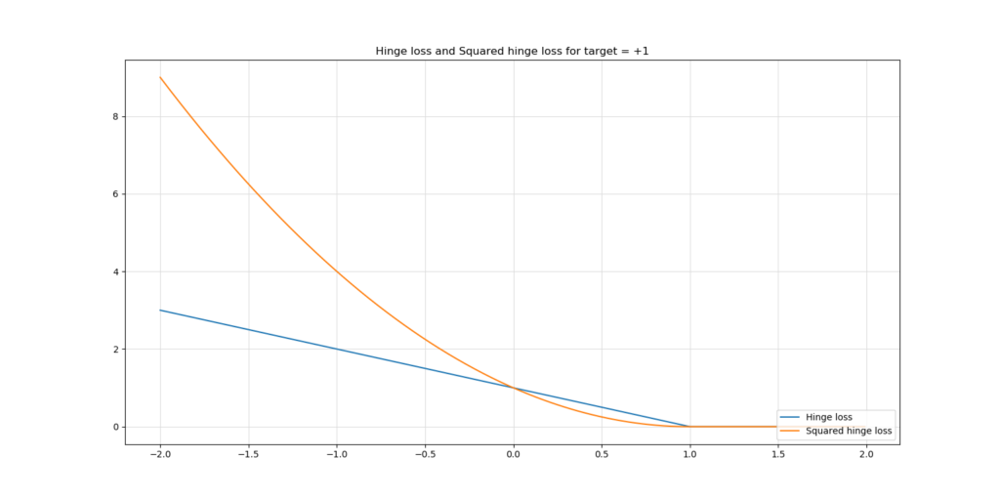
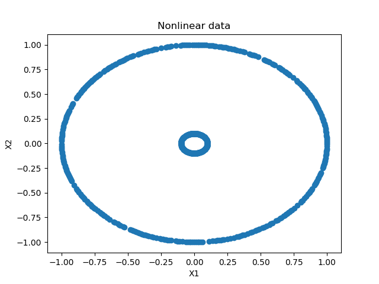
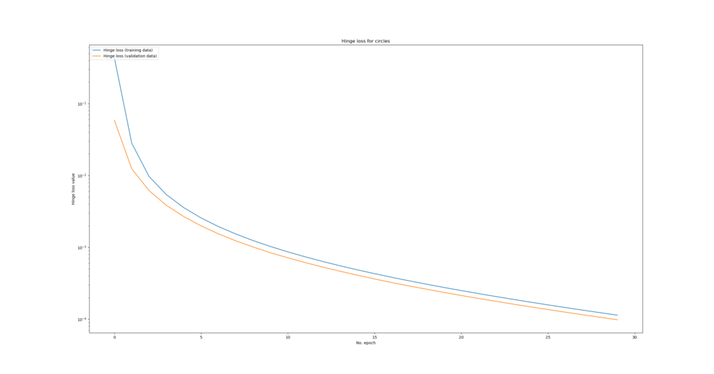
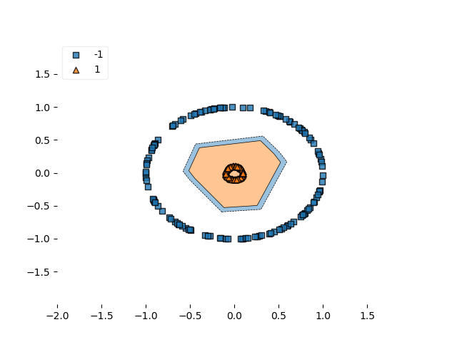
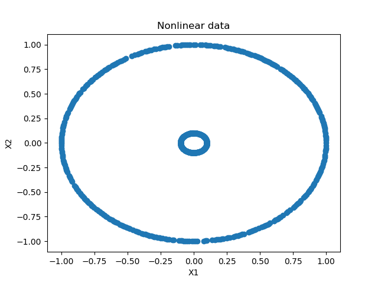
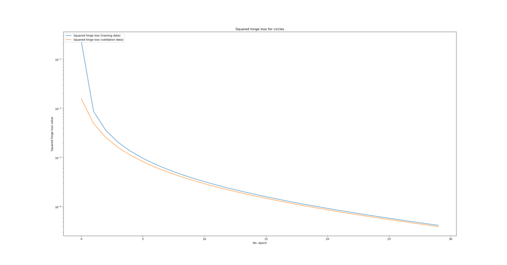

In order to discover the ins and outs of the Keras deep learning framework, I'm writing blog posts about [commonly used loss functions](https://www.machinecurve.com/index.php/2019/10/04/about-loss-and-loss-functions/), subsequently implementing them with Keras to practice and to see how they behave.

Today, we'll cover two closely related loss functions that can be used in neural networks - and hence in TensorFlow 2 based Keras - that behave similar to how a [Support Vector Machine](https://www.machinecurve.com/index.php/2019/09/20/intuitively-understanding-svm-and-svr/) generates a decision boundary for classification: the **hinge loss** and **squared hinge loss**.

In this blog, you'll first find a brief introduction to the two loss functions, in order to ensure that you intuitively understand the maths before we move on to implementing one.

Next, we introduce today's dataset, which we ourselves generate. Subsequently, we implement both hinge loss functions with TensorFlow 2 based Keras, and discuss the implementation so that you understand what happens. Before wrapping up, we'll also show model performance.

After reading this tutorial, you will understand...

- **How hinge loss and squared hinge loss work.**
- **What the differences are between the two.**
- **How to implement hinge loss and squared hinge loss with TensorFlow 2 based Keras.**

Let's go! 😎

_Note that the full code for the models we create in this blog post is also available through my [Keras Loss Functions repository](https://github.com/christianversloot/keras-loss-functions) on GitHub._

* * *

**Update 08/Feb/2021:** ensure that article is up to date. Utilizes TensorFlow 2 APIs now to make it compatible with current versions of TensorFlow.

* * *

\[toc\]

* * *

## Example code: (squared) hinge loss with TF 2 / Keras

This example code shows you how to use hinge loss and squared hinge loss easily. If you want to understand how it works, what the differences are and how to apply it to a full Keras model more deeply, make sure to read the rest of this tutorial as well!

```
loss_function_used = 'hinge' # or use 'squared_hinge' 
model.compile(loss=loss_function_used, optimizer=tensorflow.keras.optimizers.Adam(lr=0.03), metrics=['accuracy'])
```

* * *

## Brief recap

### What is hinge loss?

In our blog post on loss functions, we defined the **hinge loss** as follows (Wikipedia, 2011):


Maths can look very frightning, but the explanation of the above formula is actually really easy.

When you're training a machine learning model, you effectively feed forward your data, generating predictions, which you then compare with the actual targets to generate some cost value - that's the loss value. In the case of using the hinge loss formula for generating this value, you compare the prediction (\[latex\]y\[/latex\]) with the actual target for the prediction (\[latex\]t\[/latex\]), substract this value from 1 and subsequently compute the maximum value between 0 and the result of the earlier computation.

For every sample, our target variable \[latex\]t\[/latex\] is either +1 or -1.

This means that:

- When \[latex\]t = y\[/latex\], e.g. \[latex\]t = y = 1\[/latex\], loss is \[latex\]max(0, 1 - 1) = max(0, 0) = 0\[/latex\] - or perfect.
- When \[latex\]t\[/latex\] is very different than \[latex\]y\[/latex\], say \[latex\]t = 1\[/latex\] while \[latex\]y = -1\[/latex\], loss is \[latex\]max(0, 2) = 2\[/latex\].
- When \[latex\]t\[/latex\] is not exactly correct, but only slightly off (e.g. \[latex\]t = 1\[/latex\] while \[latex\]y = 0.9\[/latex\], loss would be \[latex\]max(0, 0.1) = 0.1).

This looks as follows if the target is \[latex\]+1\[/latex\] - for all targets >= 1, loss is zero (the prediction is correct or even overly correct), whereas loss increases when the predictions are incorrect.

[](https://www.machinecurve.com/wp-content/uploads/2019/10/hinge_loss.jpeg)

What effectively happens is that hinge loss will attempt to maximize the decision boundary between the two groups that must be discriminated in your machine learning problem. In that way, it looks somewhat like how [Support Vector Machines](https://www.machinecurve.com/index.php/2019/09/20/intuitively-understanding-svm-and-svr/) work, but it's also kind of different (e.g., with hinge loss in Keras there is no such thing as support vectors).

### What is squared hinge loss?

Suppose that you need to draw a very fine decision boundary. In that case, you wish to punish larger errors more significantly than smaller errors. **Squared hinge loss** may then be what you are looking for, especially when you already considered the hinge loss function for your machine learning problem.

[](blob:https://www.machinecurve.com/df9d5f50-e0bb-4acd-9dbb-042de634b54d)

Squared hinge loss is nothing else but a square of the output of the hinge's \[latex\]max(...)\[/latex\] function. It generates a loss function as illustrated above, compared to regular hinge loss.

As you can see, larger errors are punished more significantly than with traditional hinge, whereas smaller errors are punished slightly lightlier.

Additionally, especially around \[latex\]target = +1.0\[/latex\] in the situation above (if your target were \[latex\]-1.0\[/latex\], it would apply there too) the loss function of traditional hinge loss behaves relatively non-smooth, like the ReLU activation function does so around \[latex\]x = 0\[/latex\]. Although it is very unlikely, it might impact how your model optimizes since the loss landscape is not smooth. With squared hinge, the function is smooth - but it is more sensitive to larger errors (outliers).

Therefore, choose carefully! 😉

* * *

## Start implementing: today's dataset

Now that we know about what hinge loss and squared hinge loss are, we can start our actual implementation. We'll have to first implement & discuss our dataset in order to be able to create a model.

Before you start, it's a good idea to create a file (e.g. `hinge-loss.py`) in some folder on your machine. Then, you can start off by adding the necessary software dependencies:

```
'''
  Keras model discussing Hinge loss.
'''
import tensorflow.keras
from tensorflow.keras.models import Sequential
from tensorflow.keras.layers import Dense
import matplotlib.pyplot as plt
import numpy as np
from sklearn.datasets import make_circles
from mlxtend.plotting import plot_decision_regions
```

First, and foremost, you need the [Keras deep learning framework](https://www.machinecurve.com/index.php/mastering-keras/), which allows you to create neural network architectures relatively easily. From Keras, you'll import the Sequential API and the Dense layer (representing densely-connected layers, or the [MLP-like layers](https://www.machinecurve.com/index.php/2019/07/27/how-to-create-a-basic-mlp-classifier-with-the-keras-sequential-api/) you always see when people use neural networks in their presentations).

You'll subsequently import the PyPlot API from Matplotlib for visualization, Numpy for number processing, `make_circles` from Scikit-learn to generate today's dataset and Mlxtend for [visualizing the decision boundary](https://www.machinecurve.com/index.php/2019/10/11/how-to-visualize-the-decision-boundary-for-your-keras-model/) of your model.

### What you'll need to run it

Hence, this is what you need to run today's code:

- Python, preferably 3.8+
- TensorFlow 2, preferably [2.4.0+](https://www.machinecurve.com/index.php/2020/11/05/saying-hello-to-tensorflow-2-4-0/)
- Matplotlib
- Numpy
- Scikit-learn
- Mlxtend

...preferably in an Anaconda environment so that your packages run isolated from other Python ones.

### Generate the data

As indicated, we can now generate the data that we use to demonstrate how hinge loss and squared hinge loss works. We generate data today because it allows us to entirely focus on the loss functions rather than cleaning the data. Of course, you can also apply the insights from this blog posts to other, real datasets.

We first specify some configuration options:

```
# Configuration options
num_samples_total = 1000
training_split = 250
```

Put very simply, these specify _how many samples are generated in total_ and how many are _split off the training set_ to form the testing set. With this configuration, we generate 1000 samples, of which 750 are training data and 250 are testing data. You'll later see that the 750 training samples are subsequently split into true training data and validation data.

Next, we actually generate the data:

```
# Generate data
X, targets = make_circles(n_samples = num_samples_total, factor=0.1)
targets[np.where(targets == 0)] = -1
X_training = X[training_split:, :]
X_testing = X[:training_split, :]
Targets_training = targets[training_split:]
Targets_testing = targets[:training_split]
```

We first call `make_circles` to generate `num_samples_total` (1000 as configured) for our machine learning problem. `make_circles` does what it suggests: it generates two circles, a larger one and a smaller one, which are separable - and hence perfect for machine learning blog posts 😄 The `factor` parameter, which should be \[latex\]0 < factor < 1\[/latex\], determines how close the circles are to each other. The lower the value, the farther the circles are positioned from each other.

We next convert all zero targets into -1. Why? Very simple: `make_circles` generates targets that are either 0 or 1, which is very common in those scenarios. Zero or one would in plain English be 'the larger circle' or 'the smaller circle', but since targets are numeric in Keras they are 0 and 1.

Hinge loss doesn't work with zeroes and ones. Instead, targets must be either +1 or -1. Hence, we'll have to convert all zero targets into -1 in order to support Hinge loss.

Finally, we split the data into training and testing data, for both the feature vectors (the \[latex\]X\[/latex\] variables) and the targets.

### Visualizing the data

We can now also visualize the data, to get a feel for what we just did:

```
# Generate scatter plot for training data
plt.scatter(X_training[:,0], X_training[:,1])
plt.title('Nonlinear data')
plt.xlabel('X1')
plt.ylabel('X2')
plt.show()
```

This looks as follows:

[](https://www.machinecurve.com/wp-content/uploads/2019/10/hinge_nonlienar.png)

As you can see, we have generated two circles that are composed of individual data points: a large one and a smaller one. These are perfectly separable, although not linearly.

(With traditional SVMs one would have to perform the [kernel trick](https://www.machinecurve.com/index.php/2019/09/20/intuitively-understanding-svm-and-svr/#what-if-data-is-not-linearly-separable-kernels) in order to make data linearly separable in kernel space. With neural networks, this is less of a problem, since the layers [activate nonlinearly](https://www.machinecurve.com/index.php/2019/09/04/relu-sigmoid-and-tanh-todays-most-used-activation-functions/#what-is-an-activation-function).)

* * *

## Implementing hinge & squared hinge in TensorFlow 2 / Keras

Now that we have a feel for the dataset, we can actually implement a `tensorflow.keras` model that makes use of hinge loss and, in another run, squared hinge loss, in order to show you how it works.

### Model configuration

As usual, we first define some variables for model configuration by adding this to our code:

```
# Set the input shape
feature_vector_shape = len(X_training[0])
input_shape = (feature_vector_shape,)
loss_function_used = 'hinge'
print(f'Feature shape: {input_shape}')
```

We set the shape of our feature vector to the _length_ of the _first sample from our training set_. If this sample is of length 3, this means that there are three features in the feature vector. Since the array is only one-dimensional, the shape would be a one-dimensional vector of length 3. Since our training set contains X and Y values for the data points, our `input_shape` is (2,).

Obviously, we use `hinge` as our loss function. Using squared hinge loss is possible too by simply changing `hinge` into `squared_hinge`. That's up to you!

### Model architecture

Next, we define the architecture for our model:

```
# Create the model
model = Sequential()
model.add(Dense(4, input_shape=input_shape, activation='relu', kernel_initializer='he_uniform'))
model.add(Dense(2, activation='relu', kernel_initializer='he_uniform'))
model.add(Dense(1, activation='tanh'))
```

We use the Keras Sequential API, which allows us to stack multiple layers easily. Contrary to other blog posts, e.g. ones where we created a [MLP for classification](https://www.machinecurve.com/index.php/2019/07/27/how-to-create-a-basic-mlp-classifier-with-the-keras-sequential-api/) or [regression](https://www.machinecurve.com/index.php/2019/07/30/creating-an-mlp-for-regression-with-keras/), I decided to add three layers instead of two. This was done for the reason that the dataset is slightly more complex: the decision boundary cannot be represented as a line, but must be a circle separating the smaller one from the larger one. Hence, I thought, a little bit more capacity for processing data would be useful.

The layers activate with [Rectified Linear Unit](https://www.machinecurve.com/index.php/2019/09/04/relu-sigmoid-and-tanh-todays-most-used-activation-functions/#rectified-linear-unit-relu) or ReLU, except for the last one, which activates by means of [Tanh](https://www.machinecurve.com/index.php/2019/09/04/relu-sigmoid-and-tanh-todays-most-used-activation-functions/#tangens-hyperbolicus-tanh). I chose ReLU because it is the de facto standard activation function and requires fewest computational resources without compromising in predictive performance. I chose Tanh because of the way the predictions must be generated: they should end up in the range \[-1, +1\], given the way Hinge loss works (remember why we had to convert our generated targets from zero to minus one?).

Tanh indeed precisely does this -- converting a linear value to a range close to \[-1, +1\], namely (-1, +1) - the actual ones are not included here, but this doesn't matter much. It looks like this:

[](https://www.machinecurve.com/wp-content/uploads/2019/05/tanh.png)

The kernels of the ReLU activating layers are initialized with He uniform init instead of Glorot init for the reason that this approach [works better](https://www.machinecurve.com/index.php/2019/09/16/he-xavier-initialization-activation-functions-choose-wisely/) mathematically.

Information is eventually converted into one prediction: the target. Hence, the final layer has _one_ neuron. The intermediate ones have fewer neurons, in order to stimulate the model to generate more abstract representations of the information during the feedforward procedure.

### Hyperparameter configuration & starting model training

Now that we know what architecture we'll use, we can perform hyperparameter configuration. We can also actually start training our model.

However, first, the hyperparameters:

```
# Configure the model and start training
model.compile(loss=loss_function_used, optimizer=tensorflow.keras.optimizers.Adam(lr=0.03), metrics=['accuracy'])
```

The loss function used is, indeed, `hinge` loss. We use Adam for optimization and manually configure the learning rate to 0.03 since initial experiments showed that the default learning rate is insufficient to learn the decision boundary many times. In your case, it may be that you have to shuffle with the learning rate as well; you can configure it there. As an additional metric, we included accuracy, since it can be interpreted by humans slightly better.

Now the actual training process:

```
history = model.fit(X_training, Targets_training, epochs=30, batch_size=5, verbose=1, validation_split=0.2)
```

We _fit_ the training data (`X_training` and `Targets_training`) to the model architecture and allow it to optimize for 30 epochs, or iterations. Each batch that is fed forward through the network during an epoch contains five samples, which allows to benefit from accurate gradients without losing too much time and / or resources which increase with decreasing batch size. Verbosity mode is set to 1 ('True') in order to output everything during the training process, which helps your understanding. As highlighted before, we split the training data into _true training data_ and _validation data_: 20% of the training data is used for validation.

Hence, from the 1000 samples that were generated, 250 are used for testing, 600 are used for training and 150 are used for validation (600 + 150 + 250 = 1000).

### Testing & visualizing model performance

We store the results of the fitting (training) procedure into a `history` object, which allows us the actually [visualize model performance across epochs](https://www.machinecurve.com/index.php/2019/10/08/how-to-visualize-the-training-process-in-keras/). But first, we add code for testing the model for its generalization power:

```
# Test the model after training
test_results = model.evaluate(X_testing, Targets_testing, verbose=1)
print(f'Test results - Loss: {test_results[0]} - Accuracy: {test_results[1]*100}%')
```

Then a [plot of the decision boundary](https://www.machinecurve.com/index.php/2019/10/11/how-to-visualize-the-decision-boundary-for-your-keras-model/) based on the testing data:

```
# Plot decision boundary
plot_decision_regions(X_testing, Targets_testing, clf=model, legend=2)
plt.show()
```

And eventually, the [visualization for the training process](https://www.machinecurve.com/index.php/2019/10/08/how-to-visualize-the-training-process-in-keras/):

```
# Visualize training process
plt.plot(history.history['loss'], label='Hinge loss (testing data)')
plt.plot(history.history['val_loss'], label='Hinge loss (validation data)')
plt.title('Hinge loss for circles')
plt.ylabel('Hinge loss value')
plt.yscale('log')
plt.xlabel('No. epoch')
plt.legend(loc="upper left")
plt.show()
```

(A logarithmic scale is used because loss drops significantly during the first epoch, distorting the image if scaled linearly.)

* * *

## The results: model performance

Now, if you followed the process until now, you have a file called `hinge-loss.py`. Open up the terminal which can access your setup (e.g. Anaconda Prompt or a regular terminal), `cd`to the folder where your `.py` is stored and execute `python hinge-loss.py`. The training process should then start.

These are the results.

### Hinge loss

For hinge loss, we quite unsurprisingly found that validation accuracy went to 100% immediately. This is indeed unsurprising because the dataset is quite well separable (the distance between circles is large), the model was made quite capable of interpreting relatively complex data, and a relatively aggressive learning rate was set. This is the visualization of the training process using a **logarithmic scale**:

[](https://www.machinecurve.com/wp-content/uploads/2019/10/logarithmic_performance.png)

The decision boundary:

[](https://www.machinecurve.com/wp-content/uploads/2019/10/hinge_db.png)

Or in plain text:

```
Epoch 1/30
600/600 [==============================] - 1s 1ms/step - loss: 0.4317 - accuracy: 0.6083 - val_loss: 0.0584 - val_accuracy: 1.0000
Epoch 2/30
600/600 [==============================] - 0s 682us/step - loss: 0.0281 - accuracy: 1.0000 - val_loss: 0.0124 - val_accuracy: 1.0000
Epoch 3/30
600/600 [==============================] - 0s 688us/step - loss: 0.0097 - accuracy: 1.0000 - val_loss: 0.0062 - val_accuracy: 1.0000
Epoch 4/30
600/600 [==============================] - 0s 693us/step - loss: 0.0054 - accuracy: 1.0000 - val_loss: 0.0038 - val_accuracy: 1.0000
Epoch 5/30
600/600 [==============================] - 0s 707us/step - loss: 0.0036 - accuracy: 1.0000 - val_loss: 0.0027 - val_accuracy: 1.0000
Epoch 6/30
600/600 [==============================] - 0s 692us/step - loss: 0.0026 - accuracy: 1.0000 - val_loss: 0.0020 - val_accuracy: 1.0000
Epoch 7/30
600/600 [==============================] - 0s 747us/step - loss: 0.0019 - accuracy: 1.0000 - val_loss: 0.0015 - val_accuracy: 1.0000
Epoch 8/30
600/600 [==============================] - 0s 717us/step - loss: 0.0015 - accuracy: 1.0000 - val_loss: 0.0012 - val_accuracy: 1.0000
Epoch 9/30
600/600 [==============================] - 0s 735us/step - loss: 0.0012 - accuracy: 1.0000 - val_loss: 0.0010 - val_accuracy: 1.0000
Epoch 10/30
600/600 [==============================] - 0s 737us/step - loss: 0.0010 - accuracy: 1.0000 - val_loss: 8.4231e-04 - val_accuracy: 1.0000
Epoch 11/30
600/600 [==============================] - 0s 720us/step - loss: 8.6515e-04 - accuracy: 1.0000 - val_loss: 7.1493e-04 - val_accuracy: 1.0000
Epoch 12/30
600/600 [==============================] - 0s 786us/step - loss: 7.3818e-04 - accuracy: 1.0000 - val_loss: 6.1438e-04 - val_accuracy: 1.0000
Epoch 13/30
600/600 [==============================] - 0s 732us/step - loss: 6.3710e-04 - accuracy: 1.0000 - val_loss: 5.3248e-04 - val_accuracy: 1.0000
Epoch 14/30
600/600 [==============================] - 0s 703us/step - loss: 5.5483e-04 - accuracy: 1.0000 - val_loss: 4.6540e-04 - val_accuracy: 1.0000
Epoch 15/30
600/600 [==============================] - 0s 728us/step - loss: 4.8701e-04 - accuracy: 1.0000 - val_loss: 4.1065e-04 - val_accuracy: 1.0000
Epoch 16/30
600/600 [==============================] - 0s 732us/step - loss: 4.3043e-04 - accuracy: 1.0000 - val_loss: 3.6310e-04 - val_accuracy: 1.0000
Epoch 17/30
600/600 [==============================] - 0s 733us/step - loss: 3.8266e-04 - accuracy: 1.0000 - val_loss: 3.2392e-04 - val_accuracy: 1.0000
Epoch 18/30
600/600 [==============================] - 0s 782us/step - loss: 3.4199e-04 - accuracy: 1.0000 - val_loss: 2.9011e-04 - val_accuracy: 1.0000
Epoch 19/30
600/600 [==============================] - 0s 755us/step - loss: 3.0694e-04 - accuracy: 1.0000 - val_loss: 2.6136e-04 - val_accuracy: 1.0000
Epoch 20/30
600/600 [==============================] - 0s 768us/step - loss: 2.7671e-04 - accuracy: 1.0000 - val_loss: 2.3608e-04 - val_accuracy: 1.0000
Epoch 21/30
600/600 [==============================] - 0s 778us/step - loss: 2.5032e-04 - accuracy: 1.0000 - val_loss: 2.1384e-04 - val_accuracy: 1.0000
Epoch 22/30
600/600 [==============================] - 0s 725us/step - loss: 2.2715e-04 - accuracy: 1.0000 - val_loss: 1.9442e-04 - val_accuracy: 1.0000
Epoch 23/30
600/600 [==============================] - 0s 728us/step - loss: 2.0676e-04 - accuracy: 1.0000 - val_loss: 1.7737e-04 - val_accuracy: 1.0000
Epoch 24/30
600/600 [==============================] - 0s 680us/step - loss: 1.8870e-04 - accuracy: 1.0000 - val_loss: 1.6208e-04 - val_accuracy: 1.0000
Epoch 25/30
600/600 [==============================] - 0s 738us/step - loss: 1.7264e-04 - accuracy: 1.0000 - val_loss: 1.4832e-04 - val_accuracy: 1.0000
Epoch 26/30
600/600 [==============================] - 0s 702us/step - loss: 1.5826e-04 - accuracy: 1.0000 - val_loss: 1.3628e-04 - val_accuracy: 1.0000
Epoch 27/30
600/600 [==============================] - 0s 802us/step - loss: 1.4534e-04 - accuracy: 1.0000 - val_loss: 1.2523e-04 - val_accuracy: 1.0000
Epoch 28/30
600/600 [==============================] - 0s 738us/step - loss: 1.3374e-04 - accuracy: 1.0000 - val_loss: 1.1538e-04 - val_accuracy: 1.0000
Epoch 29/30
600/600 [==============================] - 0s 762us/step - loss: 1.2326e-04 - accuracy: 1.0000 - val_loss: 1.0645e-04 - val_accuracy: 1.0000
Epoch 30/30
600/600 [==============================] - 0s 742us/step - loss: 1.1379e-04 - accuracy: 1.0000 - val_loss: 9.8244e-05 - val_accuracy: 1.0000
250/250 [==============================] - 0s 52us/step
Test results - Loss: 0.0001128034592838958 - Accuracy: 100.0%
```

We can see that validation loss is still decreasing together with training loss, so the model is not overfitting yet.

Reason why? Simple. My thesis is that this occurs because the data, both in the training and validation set, is perfectly separable. The decision boundary is crystal clear.

### Squared hinge loss

By changing `loss_function_used` into `squared_hinge` we can now show you results for squared hinge:

```
loss_function_used = 'squared_hinge'
```

Visually, it looks as follows:

- 
    
- 
    
- 
    

And once again plain text:

```
Epoch 1/30
600/600 [==============================] - 1s 1ms/step - loss: 0.2361 - accuracy: 0.7117 - val_loss: 0.0158 - val_accuracy: 1.0000
Epoch 2/30
600/600 [==============================] - 0s 718us/step - loss: 0.0087 - accuracy: 1.0000 - val_loss: 0.0050 - val_accuracy: 1.0000
Epoch 3/30
600/600 [==============================] - 0s 727us/step - loss: 0.0036 - accuracy: 1.0000 - val_loss: 0.0026 - val_accuracy: 1.0000
Epoch 4/30
600/600 [==============================] - 0s 723us/step - loss: 0.0020 - accuracy: 1.0000 - val_loss: 0.0016 - val_accuracy: 1.0000
Epoch 5/30
600/600 [==============================] - 0s 723us/step - loss: 0.0014 - accuracy: 1.0000 - val_loss: 0.0011 - val_accuracy: 1.0000
Epoch 6/30
600/600 [==============================] - 0s 713us/step - loss: 9.7200e-04 - accuracy: 1.0000 - val_loss: 8.3221e-04 - val_accuracy: 1.0000
Epoch 7/30
600/600 [==============================] - 0s 697us/step - loss: 7.3653e-04 - accuracy: 1.0000 - val_loss: 6.4083e-04 - val_accuracy: 1.0000
Epoch 8/30
600/600 [==============================] - 0s 688us/step - loss: 5.7907e-04 - accuracy: 1.0000 - val_loss: 5.1182e-04 - val_accuracy: 1.0000
Epoch 9/30
600/600 [==============================] - 0s 712us/step - loss: 4.6838e-04 - accuracy: 1.0000 - val_loss: 4.1928e-04 - val_accuracy: 1.0000
Epoch 10/30
600/600 [==============================] - 0s 698us/step - loss: 3.8692e-04 - accuracy: 1.0000 - val_loss: 3.4947e-04 - val_accuracy: 1.0000
Epoch 11/30
600/600 [==============================] - 0s 723us/step - loss: 3.2525e-04 - accuracy: 1.0000 - val_loss: 2.9533e-04 - val_accuracy: 1.0000
Epoch 12/30
600/600 [==============================] - 0s 735us/step - loss: 2.7692e-04 - accuracy: 1.0000 - val_loss: 2.5270e-04 - val_accuracy: 1.0000
Epoch 13/30
600/600 [==============================] - 0s 710us/step - loss: 2.3846e-04 - accuracy: 1.0000 - val_loss: 2.1917e-04 - val_accuracy: 1.0000
Epoch 14/30
600/600 [==============================] - 0s 773us/step - loss: 2.0745e-04 - accuracy: 1.0000 - val_loss: 1.9093e-04 - val_accuracy: 1.0000
Epoch 15/30
600/600 [==============================] - 0s 718us/step - loss: 1.8180e-04 - accuracy: 1.0000 - val_loss: 1.6780e-04 - val_accuracy: 1.0000
Epoch 16/30
600/600 [==============================] - 0s 730us/step - loss: 1.6039e-04 - accuracy: 1.0000 - val_loss: 1.4876e-04 - val_accuracy: 1.0000
Epoch 17/30
600/600 [==============================] - 0s 698us/step - loss: 1.4249e-04 - accuracy: 1.0000 - val_loss: 1.3220e-04 - val_accuracy: 1.0000
Epoch 18/30
600/600 [==============================] - 0s 807us/step - loss: 1.2717e-04 - accuracy: 1.0000 - val_loss: 1.1842e-04 - val_accuracy: 1.0000
Epoch 19/30
600/600 [==============================] - 0s 722us/step - loss: 1.1404e-04 - accuracy: 1.0000 - val_loss: 1.0641e-04 - val_accuracy: 1.0000
Epoch 20/30
600/600 [==============================] - 1s 860us/step - loss: 1.0269e-04 - accuracy: 1.0000 - val_loss: 9.5853e-05 - val_accuracy: 1.0000
Epoch 21/30
600/600 [==============================] - 0s 768us/step - loss: 9.2805e-05 - accuracy: 1.0000 - val_loss: 8.6761e-05 - val_accuracy: 1.0000
Epoch 22/30
600/600 [==============================] - 0s 753us/step - loss: 8.4169e-05 - accuracy: 1.0000 - val_loss: 7.8690e-05 - val_accuracy: 1.0000
Epoch 23/30
600/600 [==============================] - 0s 727us/step - loss: 7.6554e-05 - accuracy: 1.0000 - val_loss: 7.1713e-05 - val_accuracy: 1.0000
Epoch 24/30
600/600 [==============================] - 0s 720us/step - loss: 6.9799e-05 - accuracy: 1.0000 - val_loss: 6.5581e-05 - val_accuracy: 1.0000
Epoch 25/30
600/600 [==============================] - 0s 715us/step - loss: 6.3808e-05 - accuracy: 1.0000 - val_loss: 5.9929e-05 - val_accuracy: 1.0000
Epoch 26/30
600/600 [==============================] - 0s 695us/step - loss: 5.8448e-05 - accuracy: 1.0000 - val_loss: 5.4957e-05 - val_accuracy: 1.0000
Epoch 27/30
600/600 [==============================] - 0s 730us/step - loss: 5.3656e-05 - accuracy: 1.0000 - val_loss: 5.0587e-05 - val_accuracy: 1.0000
Epoch 28/30
600/600 [==============================] - 0s 760us/step - loss: 4.9353e-05 - accuracy: 1.0000 - val_loss: 4.6493e-05 - val_accuracy: 1.0000
Epoch 29/30
600/600 [==============================] - 0s 750us/step - loss: 4.5461e-05 - accuracy: 1.0000 - val_loss: 4.2852e-05 - val_accuracy: 1.0000
Epoch 30/30
600/600 [==============================] - 0s 753us/step - loss: 4.1936e-05 - accuracy: 1.0000 - val_loss: 3.9584e-05 - val_accuracy: 1.0000
250/250 [==============================] - 0s 56us/step
Test results - Loss: 4.163062170846388e-05 - Accuracy: 100.0%
```

As you can see, squared hinge works as well. Comparing the two decision boundaries -

- 
    
    Decision boundary hinge
    
- 
    
    Decision boundary squared hinge
    

...it seems to be the case that the decision boundary for squared hinge is _closer_, or _tighter_. Perhaps due to the _smoothness_ of the loss landscape? However, this cannot be said for sure.

* * *

## Summary

In this blog post, we've seen how to create a machine learning model with Keras by means of the **hinge loss** and the **squared hinge loss** cost functions. We introduced hinge loss and squared hinge intuitively from a mathematical point of view, then swiftly moved on to an actual implementation. Results demonstrate that hinge loss and squared hinge loss can be successfully used in nonlinear classification scenarios, but they are relatively sensitive to the separability of your dataset (whether it's linear or nonlinear does not matter). Perhaps, binary crossentropy is less sensitive - and we'll take a look at this in a next blog post.

For now, it remains to thank you for reading this post - I hope you've been able to derive some new insights from it! Please let me know what you think by writing a comment below 👇, I'd really appreciate it! 😊 Thanks and happy engineering!

_Note that the full code for the models we created in this blog post is also available through my [Keras Loss Functions repository](https://github.com/christianversloot/keras-loss-functions) on GitHub._

* * *

## References

Wikipedia. (2011, September 16). Hinge loss. Retrieved from [https://en.wikipedia.org/wiki/Hinge\_loss](https://en.wikipedia.org/wiki/Hinge_loss)

About loss and loss functions – MachineCurve. (2019, October 15). Retrieved from [https://www.machinecurve.com/index.php/2019/10/04/about-loss-and-loss-functions/](https://www.machinecurve.com/index.php/2019/10/04/about-loss-and-loss-functions/)

Intuitively understanding SVM and SVR – MachineCurve. (2019, September 20). Retrieved from [https://www.machinecurve.com/index.php/2019/09/20/intuitively-understanding-svm-and-svr/](https://www.machinecurve.com/index.php/2019/09/20/intuitively-understanding-svm-and-svr/)

Mastering Keras – MachineCurve. (2019, July 21). Retrieved from [https://www.machinecurve.com/index.php/mastering-keras/](https://www.machinecurve.com/index.php/mastering-keras/)

How to create a basic MLP classifier with the Keras Sequential API – MachineCurve. (2019, July 27). Retrieved from [https://www.machinecurve.com/index.php/2019/07/27/how-to-create-a-basic-mlp-classifier-with-the-keras-sequential-api/](https://www.machinecurve.com/index.php/2019/07/27/how-to-create-a-basic-mlp-classifier-with-the-keras-sequential-api/)

How to visualize the decision boundary for your Keras model? – MachineCurve. (2019, October 11). Retrieved from [https://www.machinecurve.com/index.php/2019/10/11/how-to-visualize-the-decision-boundary-for-your-keras-model/](https://www.machinecurve.com/index.php/2019/10/11/how-to-visualize-the-decision-boundary-for-your-keras-model/)
