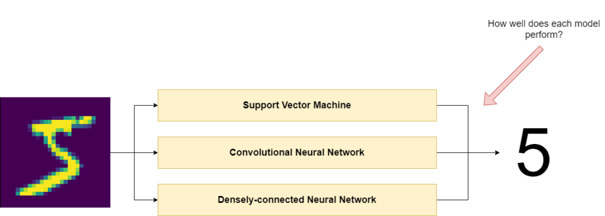
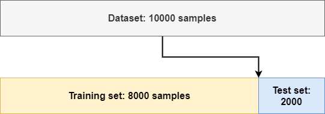
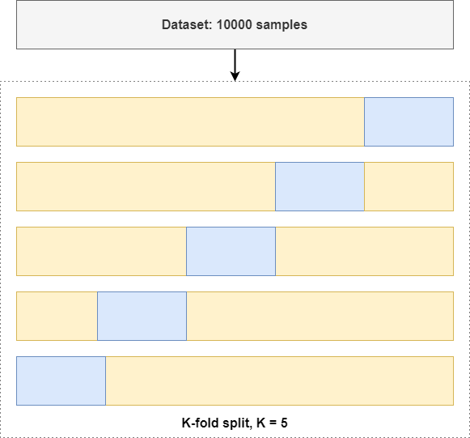

Machine learning models must be evaluated with a test set after they have been trained. We do this to ensure that models have not overfit and to ensure that they work with real-life datasets, which may have slightly deviating distributions compared to the training set.

But in order to make your model really robust, simply evaluating with a train/test split may not be enough.

For example, take the situation where you have a dataset composed of samples from two classes. Most of the samples in the first 80% of your dataset belong to class A, whereas most of the samples in the other 20% belong to class B. If you would take a simple 80/20 hold-out split, then your datasets would have vastly different distributions - and evaluation might result in wrong conclusions.

That's something what you want to avoid. In this article, you'll therefore learn about another technique that can be applied - K-fold Cross Validation. By generating train/test splits across multiple folds, you can perform multiple training and testing sessions, with different splits. You'll also see how you can use K-fold Cross Validation with PyTorch, one of the leading libraries for neural networks these days.

After reading this tutorial, you will...

- **Understand why K-fold Cross Validation can improve your confidence in model evaluation results.**
- **Have an idea about how K-fold Cross Validation works.**
- **Know how to implement K-fold Cross Validation with PyTorch.**

* * *

**Update 29/Mar/2021:** fixed possible issue with weight leaks.

**Update 15/Feb/2021:** fixed small textual error.

* * *

\[toc\]

* * *

## Summary and code example: K-fold Cross Validation with PyTorch

Model evaluation is often performed with a hold-out split, where an often 80/20 split is made and where 80% of your dataset is used for training the model. and 20% for evaluating the model. While this is a simple approach, it is also very naïve, since it assumes that data is representative across the splits, that it's not a time series dataset and that there are no redundant samples within the datasets.

K-fold Cross Validation is a more robust evaluation technique. It splits the dataset in \[latex\]k-1\[/latex\] training batches and 1 testing batch across \[latex\]k\[/latex\] folds, or situations. Using the training batches, you can then train your model, and subsequently evaluate it with the testing batch. This allows you to train the model for multiple times with different dataset configurations. Even better, it allows you to be more confident in your model evaluation results.

Below, you will see a **full example of using K-fold Cross Validation with PyTorch**, using Scikit-learn's `KFold` functionality. It can be used on the go. If you want to understand things in more detail, however, it's best to continue reading the rest of the tutorial as well! 🚀

```python
import os
import torch
from torch import nn
from torchvision.datasets import MNIST
from torch.utils.data import DataLoader, ConcatDataset
from torchvision import transforms
from sklearn.model_selection import KFold

def reset_weights(m):
  '''
    Try resetting model weights to avoid
    weight leakage.
  '''
  for layer in m.children():
   if hasattr(layer, 'reset_parameters'):
    print(f'Reset trainable parameters of layer = {layer}')
    layer.reset_parameters()

class SimpleConvNet(nn.Module):
  '''
    Simple Convolutional Neural Network
  '''
  def __init__(self):
    super().__init__()
    self.layers = nn.Sequential(
      nn.Conv2d(1, 10, kernel_size=3),
      nn.ReLU(),
      nn.Flatten(),
      nn.Linear(26 * 26 * 10, 50),
      nn.ReLU(),
      nn.Linear(50, 20),
      nn.ReLU(),
      nn.Linear(20, 10)
    )


  def forward(self, x):
    '''Forward pass'''
    return self.layers(x)
  
  
if __name__ == '__main__':
  
  # Configuration options
  k_folds = 5
  num_epochs = 1
  loss_function = nn.CrossEntropyLoss()
  
  # For fold results
  results = {}
  
  # Set fixed random number seed
  torch.manual_seed(42)
  
  # Prepare MNIST dataset by concatenating Train/Test part; we split later.
  dataset_train_part = MNIST(os.getcwd(), download=True, transform=transforms.ToTensor(), train=True)
  dataset_test_part = MNIST(os.getcwd(), download=True, transform=transforms.ToTensor(), train=False)
  dataset = ConcatDataset([dataset_train_part, dataset_test_part])
  
  # Define the K-fold Cross Validator
  kfold = KFold(n_splits=k_folds, shuffle=True)
    
  # Start print
  print('--------------------------------')

  # K-fold Cross Validation model evaluation
  for fold, (train_ids, test_ids) in enumerate(kfold.split(dataset)):
    
    # Print
    print(f'FOLD {fold}')
    print('--------------------------------')
    
    # Sample elements randomly from a given list of ids, no replacement.
    train_subsampler = torch.utils.data.SubsetRandomSampler(train_ids)
    test_subsampler = torch.utils.data.SubsetRandomSampler(test_ids)
    
    # Define data loaders for training and testing data in this fold
    trainloader = torch.utils.data.DataLoader(
                      dataset, 
                      batch_size=10, sampler=train_subsampler)
    testloader = torch.utils.data.DataLoader(
                      dataset,
                      batch_size=10, sampler=test_subsampler)
    
    # Init the neural network
    network = SimpleConvNet()
    network.apply(reset_weights)
    
    # Initialize optimizer
    optimizer = torch.optim.Adam(network.parameters(), lr=1e-4)
    
    # Run the training loop for defined number of epochs
    for epoch in range(0, num_epochs):

      # Print epoch
      print(f'Starting epoch {epoch+1}')

      # Set current loss value
      current_loss = 0.0

      # Iterate over the DataLoader for training data
      for i, data in enumerate(trainloader, 0):
        
        # Get inputs
        inputs, targets = data
        
        # Zero the gradients
        optimizer.zero_grad()
        
        # Perform forward pass
        outputs = network(inputs)
        
        # Compute loss
        loss = loss_function(outputs, targets)
        
        # Perform backward pass
        loss.backward()
        
        # Perform optimization
        optimizer.step()
        
        # Print statistics
        current_loss += loss.item()
        if i % 500 == 499:
            print('Loss after mini-batch %5d: %.3f' %
                  (i + 1, current_loss / 500))
            current_loss = 0.0
            
    # Process is complete.
    print('Training process has finished. Saving trained model.')

    # Print about testing
    print('Starting testing')
    
    # Saving the model
    save_path = f'./model-fold-{fold}.pth'
    torch.save(network.state_dict(), save_path)

    # Evaluationfor this fold
    correct, total = 0, 0
    with torch.no_grad():

      # Iterate over the test data and generate predictions
      for i, data in enumerate(testloader, 0):

        # Get inputs
        inputs, targets = data

        # Generate outputs
        outputs = network(inputs)

        # Set total and correct
        _, predicted = torch.max(outputs.data, 1)
        total += targets.size(0)
        correct += (predicted == targets).sum().item()

      # Print accuracy
      print('Accuracy for fold %d: %d %%' % (fold, 100.0 * correct / total))
      print('--------------------------------')
      results[fold] = 100.0 * (correct / total)
    
  # Print fold results
  print(f'K-FOLD CROSS VALIDATION RESULTS FOR {k_folds} FOLDS')
  print('--------------------------------')
  sum = 0.0
  for key, value in results.items():
    print(f'Fold {key}: {value} %')
    sum += value
  print(f'Average: {sum/len(results.items())} %')
```

* * *

## What is K-fold Cross Validation?

Suppose that your goal is to build a classifier that correctly classifies input images - like in the example below. You input an image that represents a handwritten digit, and the output is expected to be 5.

There are myriad ways for building such a classifier in terms of the model type that can be chosen. But which is best? You have to evaluate each model in order to find how well it works.



### Why using train/test splits for model evaluation?

Model evaluation happens after a machine learning model has been trained. It ensures that the model works with real-world data too by feeding samples from an dataset called the _test set_, which contains samples that the model has not seen before.

By comparing the subsequent predictions with the ground truth labels that are also available for these samples, we can see how well the model performs on this dataset. And we can thus also see how well it performs on data from the real world, if we used that during model evaluation.

However, we have to be cautious when evaluating our model. We cannot simply use the data that we trained the model with, to avoid becoming a student who grades their own homework.

Because that is what would happen when you evaluated with your training data: as the model has learned to capture patterns related to that particular dataset, the model might perform poorly if these patterns were spurious and therefore not present within real-world data. Especially with [high-variance](https://www.machinecurve.com/index.php/2020/11/02/machine-learning-error-bias-variance-and-irreducible-error-with-python/) models, this can become a problem.

Instead, we evaluate models with that _test set_, which has been selected and contains samples not present within the training set. But how to construct this test set is another question. There are multiple methods for doing so. Let's take a look at a naïve strategy first. We then understand why we might apply K-fold Cross Validation instead.

### Simple hold-out splits: a naïve strategy

Here's that naïve way, which is also called a **simple hold-out split:**



With this technique, you simply take a part of your original dataset, set it apart, and consider that to be testing data.

Traditionally, such splits are taken in an 80/20 fashion, where 80% of the data is used for training the model, and 20% is used for evaluating it.

There are a few reasons why this is a naïve approach: you’ll have to keep these edge cases in mind all the time (Chollet, 2017):

1. **Data representativeness**: all datasets, which are essentially samples, must represent the patterns in the population as much as possible. This becomes especially important when you generate samples from a sample (i.e., from your full dataset). For example, if the first part of your dataset has pictures of ice cream, while the latter one only represents espressos, trouble is guaranteed when you generate the split as displayed above. Random shuffling may help you solve these issues.
2. **The arrow of time**: if you have a time series dataset, your dataset is likely ordered chronologically. If you’d shuffle randomly, and then perform simple hold-out validation, you’d effectively “\[predict\] the future given the past” (Chollet, 2017). Such temporal leaks don’t benefit model performance.
3. **Data redundancy**: if some samples appear more than once, a simple hold-out split with random shuffling may introduce redundancy between training and testing datasets. That is, identical samples belong to both datasets. This is problematic too, as data used for training thus leaks into the dataset for testing implicitly.

That's why it's often a better idea to validate your model more robustly. Let's take a look at K-fold Cross Validation for doing so.

### Introducing K-fold Cross Validation

What if we could try multiple variations of this train/test split?

We would then have a model that is evaluated much more robustly.

And precisely that is what **K-fold Cross Validation** is all about.



In K-fold Cross Validation, you set a number \[latex\]k\[/latex\] to any integer value \[latex\]> 1\[/latex\], and \[latex\]k\[/latex\] splits will be generated. Each split has \[latex\]1/k\[/latex\] samples that belong to a test dataset, while the rest of your data can be used for training purposes.

As in each split a different part of the training data will be used for validation purposes, you effectively train and evaluate your model multiple times, allowing you to tell whether it works with more confidence than with a simple hold-out split.

Let's now take a look at how we can implement K-fold Cross Validation with PyTorch!

* * *

## Implementing K-fold Cross Validation with PyTorch

Now that you understand how K-fold Cross Validation works, let's take a look at how you can apply it with PyTorch. Using K-fold CV with PyTorch involves the following steps:

1. Ensuring that your dependencies are up to date.
2. Stating your model imports.
3. Defining the `nn.Module` class of your neural network, as well as a weights reset function.
4. Adding the preparatory steps in your runtime code.
5. Loading your dataset.
6. Defining the K-fold Cross Validator, and generating folds.
7. Iterating over each fold, training and evaluating another model instance.
8. Averaging across all folds to get final performance.

### What you'll need to run the code

Running this example requires that you have installed the following dependencies:

- **Python**, to run everything. Make sure to install 3.8+, although it'll also run with slightly older versions.
- **PyTorch**, which is the deep learning library that you are training the models with.
- **Scikit-learn**, for generating the folds.

Let's open up a code editor and create a file, e.g. called `kfold.py`. Obviously, you might also want to run everything inside a Jupyter Notebook. That's up to you :)

### Model imports

The first thing we do is specifying the model imports. We import these Python modules:

- For file input/output, we use `os`.
- All PyTorch functionality is imported as `torch`. We also have some sub imports:
    
    - Neural network functionality is imported as `nn`.
    
    - The `DataLoader` that we import from `torch.utils.data` is used for passing data to the neural network.
    - The `ConcatDataset` will be used for concatenating the train and test parts of the MNIST dataset, which we'll use for training the model. K-fold CV means that you generate the splits yourself, so you don't want PyTorch to do this for you - as you'd effectively lose data.
- We also import specific functionality related to Computer Vision - using `torchvision`. First, we import the `MNIST` dataset from `torchvision.datasets`. We also import `transforms` from Torch Vision, which allows us to convert the data into Tensor format later.
- Finally, we import `KFold` from `sklearn.model_selection` to allow us to perform K-fold Cross Validation.

```python
import os
import torch
from torch import nn
from torchvision.datasets import MNIST
from torch.utils.data import DataLoader, ConcatDataset
from torchvision import transforms
from sklearn.model_selection import KFold
```

### Model class

Time to start with some real work!

Let's define a simple convolutional neural network, i.e. a `SimpleConvNet`, that utilizes the `nn.Module` base class - and thus effectively implements a PyTorch neural network.

We can implement it as follows, by specifying the `__init__` constructor definition and the forward pass. In the `__init__` definition, we specify the neural network as a Sequential stack of PyTorch layers. You can see that we use one convolutional layer (`Conv2d`) with ReLU activations and some `Linear` layers responsible for generating the predictions. Due to the simplicity of the MNIST dataset, this should suffice. We store the stack in `self.layers`, which we use in the forward pass, as defined in the `forward` definition. Here, we simply pass the data - available in `x` - to the layers.

```python
class SimpleConvNet(nn.Module):
  '''
    Simple Convolutional Neural Network
  '''
  def __init__(self):
    super().__init__()
    self.layers = nn.Sequential(
      nn.Conv2d(1, 10, kernel_size=3),
      nn.ReLU(),
      nn.Flatten(),
      nn.Linear(26 * 26 * 10, 50),
      nn.ReLU(),
      nn.Linear(50, 20),
      nn.ReLU(),
      nn.Linear(20, 10)
    )


  def forward(self, x):
    '''Forward pass'''
    return self.layers(x)
```

Before the `class`, we will also add a `def` called `reset_weights`. During the folds, it will be used to reset the parameters of the model. This way, we ensure that the model is trained with weights that are initialized (pseudo)randomly, avoiding weight leakage.

```python
def reset_weights(m):
  '''
    Try resetting model weights to avoid
    weight leakage.
  '''
  for layer in m.children():
   if hasattr(layer, 'reset_parameters'):
    print(f'Reset trainable parameters of layer = {layer}')
    layer.reset_parameters()
```

### Runtime code

Now that we have defined the model class, it's time to write some runtime code. By runtime code, we mean that you'll write code that actually runs when you run the Python file or the Jupyter Notebook. The class you defined before namely specifies a skeleton, and you'll have to initialize it first in order to have it run. We'll do that next. More specifically, our runtime code covers the following aspects:

1. The **preparatory steps**, where we perform some (no surprise) preparation steps for running the model.
2. **Loading the dataset**; the MNIST one, to be precise.
3. **Defining the K-fold Cross Validator** to generate the folds.
4. Then, **generating the splits** that we can actually use for training the model, which we also do - once for every fold.
5. After training for every fold, we **evaluate the performance for that fold**.
6. Finally, we perform **performance evaluation for the model - across the folds**.

Actually, it's that easy! :)

#### Preparatory steps

Below, we define some preparation steps that are executed prior to starting the training process across the set of folds. You can see that we run everything within the `__main__` name, meaning that this code only runs when we execute the Python file. In this part, we do the following things:

1. We set the configuration options. We'll generate 5 folds (by setting \[latex\]k = 5\[/latex\]), we train for 1 epoch (normally, this value is much higher, but here we only want to illustrate K-fold CV to work), and we set `nn.CrossEntropyLoss` as our loss function.
2. We define a dictionary that will store the results for every fold.
3. We set a fixed random number seed, meaning that all our pseudo random number initializers will be initialized using the same initialization token.

```python
if __name__ == '__main__':
  
  # Configuration options
  k_folds = 5
  num_epochs = 1
  loss_function = nn.CrossEntropyLoss()
  
  # For fold results
  results = {}
  
  # Set fixed random number seed
  torch.manual_seed(42)
```

#### Loading the MNIST dataset

We then load the MNIST dataset. If you're used to working with the PyTorch datasets, you may be familiar with this code already. However, the third line may still be a bit unclear - but it's actually really simple to understand what is happening here.

We simply merge together the `train=True` and `train=False` parts of the MNIST dataset, which is already split in a simple hold-out split by PyTorch's `torchvision`.

And we don't want that - recall that K-fold Cross Validation generates the train/test splits across \[latex\]k\[/latex\] folds, where \[latex\]k-1\[/latex\] parts are used for training your model and 1 part for model evaluation.

To solve this, we simply load both parts, and then concatenate them in a `ConcatDataset` object. Don't worry about shuffling the data - you'll see that this is taken care of next.

```python
  # Prepare MNIST dataset by concatenating Train/Test part; we split later.
  dataset_train_part = MNIST(os.getcwd(), download=True, transform=transforms.ToTensor(), train=True)
  dataset_test_part = MNIST(os.getcwd(), download=True, transform=transforms.ToTensor(), train=False)
  dataset = ConcatDataset([dataset_train_part, dataset_test_part])
```

#### Defining the K-fold Cross Validator

Because next, we _do_ define the shuffle - when we initialize the K-fold Cross Validator. Here, we set `shuffle=True`, meaning that shuffling occurs before the data is split into batches. `k_folds` indicates the number of folds, as you would have expected.

```python
  # Define the K-fold Cross Validator
  kfold = KFold(n_splits=k_folds, shuffle=True)
    
  # Start print
  print('--------------------------------')
```

#### Generating the splits and training the model for a fold

We can now generate the splits and train our model. You can do so by defining a loop where you iterate over the splits, specifying the `fold` and the list of identifiers of the _training_ and _testing_ samples for that particular fold. These can be used for performing the actual training process.

Within the for loop, we first perform a `print` statement, indicating the current fold. You then perform the training process. This involves the following steps:

- Sampling the actual elements from the `train_ids` or `test_ids` with a `SubsetRandomSampler`. A sampler can be used within a `DataLoader` to use particular samples only; in this case based on identifiers, because the `SubsetRandomSampler` samples elements randomly from a list, _without replacements_. In other words, you create two subsamplers that adhere to the split as specified within the `for` loop.
- With the data loaders, you'll actually sample these samples from the full `dataset`. You can use any batch size that fits in memory, but a batch size of 10 works well in pretty much all of the cases.
- After preparing the dataset for this particular fold, you initialize the neural network by initializing the class - using `SimpleConvNet()`.
- Then, when the neural network is initialized, you can initialize the optimizer for this particular training session - in this case, we use Adam, with a `1e-4` learning rate.
- In PyTorch, you'll have to define [your own training loop](https://www.machinecurve.com/index.php/2021/01/26/creating-a-multilayer-perceptron-with-pytorch-and-lightning/). It's relatively simple: you iterate over the number of epochs; within an epoch, over the minibatches; per minibatch, you perform the forward pass, the backward pass and subsequent optimization. That's what is happening here. Click the link if you want to understand this process in more detail.

```python
  # K-fold Cross Validation model evaluation
  for fold, (train_ids, test_ids) in enumerate(kfold.split(dataset)):
    
    # Print
    print(f'FOLD {fold}')
    print('--------------------------------')
    
    # Sample elements randomly from a given list of ids, no replacement.
    train_subsampler = torch.utils.data.SubsetRandomSampler(train_ids)
    test_subsampler = torch.utils.data.SubsetRandomSampler(test_ids)
    
    # Define data loaders for training and testing data in this fold
    trainloader = torch.utils.data.DataLoader(
                      dataset, 
                      batch_size=10, sampler=train_subsampler)
    testloader = torch.utils.data.DataLoader(
                      dataset,
                      batch_size=10, sampler=test_subsampler)
    
    # Init the neural network
    network = SimpleConvNet()
    
    # Initialize optimizer
    optimizer = torch.optim.Adam(network.parameters(), lr=1e-4)
    
    # Run the training loop for defined number of epochs
    for epoch in range(0, num_epochs):

      # Print epoch
      print(f'Starting epoch {epoch+1}')

      # Set current loss value
      current_loss = 0.0

      # Iterate over the DataLoader for training data
      for i, data in enumerate(trainloader, 0):
        
        # Get inputs
        inputs, targets = data
        
        # Zero the gradients
        optimizer.zero_grad()
        
        # Perform forward pass
        outputs = network(inputs)
        
        # Compute loss
        loss = loss_function(outputs, targets)
        
        # Perform backward pass
        loss.backward()
        
        # Perform optimization
        optimizer.step()
        
        # Print statistics
        current_loss += loss.item()
        if i % 500 == 499:
            print('Loss after mini-batch %5d: %.3f' %
                  (i + 1, current_loss / 500))
            current_loss = 0.0
            
    # Process is complete.
    print('Training process has finished. Saving trained model.')
```

#### Fold evaluation

After training a model within a particular fold, you must evaluate it too. That's what we'll do next. First, we save the model - so that it will be usable for generating productions later, should you want to re-use it. We then perform [model evaluation activities](https://www.machinecurve.com/index.php/2021/01/27/testing-pytorch-and-lightning-models/) - iterating over the `testloader` and generating predictions for all the samples in the test batch/test part of the fold split. We compute accuracy after evaluation, `print` it on screen, and add it to the `results` dictionary for that particular fold.

```python

    # Print about testing
    print('Starting testing')
    
    # Saving the model
    save_path = f'./model-fold-{fold}.pth'
    torch.save(network.state_dict(), save_path)

    # Evaluation for this fold
    correct, total = 0, 0
    with torch.no_grad():

      # Iterate over the test data and generate predictions
      for i, data in enumerate(testloader, 0):

        # Get inputs
        inputs, targets = data

        # Generate outputs
        outputs = network(inputs)

        # Set total and correct
        _, predicted = torch.max(outputs.data, 1)
        total += targets.size(0)
        correct += (predicted == targets).sum().item()

      # Print accuracy
      print('Accuracy for fold %d: %d %%' % (fold, 100.0 * correct / total))
      print('--------------------------------')
      results[fold] = 100.0 * (correct / total)
```

#### Model evaluation

Finally, once all folds have passed, we have the `results` for every fold. Now, it's time to perform full model evaluation - and we can do so more robustly because we have information from across all the folds. Here's how you can show the results for every fold, and then print the average on screen.

It allows you to do two things

1. See whether your model performs well across all the folds; this is true if the accuracies for every fold don't deviate too significantly.
2. If they do, you know in which fold, and can take a closer look at the data to see what is happening there.

```python
  # Print fold results
  print(f'K-FOLD CROSS VALIDATION RESULTS FOR {k_folds} FOLDS')
  print('--------------------------------')
  sum = 0.0
  for key, value in results.items():
    print(f'Fold {key}: {value} %')
    sum += value
  print(f'Average: {sum/len(results.items())} %')
```

#### Full code

Instead of reading the explanation above, you might also be interested in simply running the code. If so, here it is 😊

```python
import os
import torch
from torch import nn
from torchvision.datasets import MNIST
from torch.utils.data import DataLoader, ConcatDataset
from torchvision import transforms
from sklearn.model_selection import KFold

def reset_weights(m):
  '''
    Try resetting model weights to avoid
    weight leakage.
  '''
  for layer in m.children():
   if hasattr(layer, 'reset_parameters'):
    print(f'Reset trainable parameters of layer = {layer}')
    layer.reset_parameters()

class SimpleConvNet(nn.Module):
  '''
    Simple Convolutional Neural Network
  '''
  def __init__(self):
    super().__init__()
    self.layers = nn.Sequential(
      nn.Conv2d(1, 10, kernel_size=3),
      nn.ReLU(),
      nn.Flatten(),
      nn.Linear(26 * 26 * 10, 50),
      nn.ReLU(),
      nn.Linear(50, 20),
      nn.ReLU(),
      nn.Linear(20, 10)
    )


  def forward(self, x):
    '''Forward pass'''
    return self.layers(x)
  
  
if __name__ == '__main__':
  
  # Configuration options
  k_folds = 5
  num_epochs = 1
  loss_function = nn.CrossEntropyLoss()
  
  # For fold results
  results = {}
  
  # Set fixed random number seed
  torch.manual_seed(42)
  
  # Prepare MNIST dataset by concatenating Train/Test part; we split later.
  dataset_train_part = MNIST(os.getcwd(), download=True, transform=transforms.ToTensor(), train=True)
  dataset_test_part = MNIST(os.getcwd(), download=True, transform=transforms.ToTensor(), train=False)
  dataset = ConcatDataset([dataset_train_part, dataset_test_part])
  
  # Define the K-fold Cross Validator
  kfold = KFold(n_splits=k_folds, shuffle=True)
    
  # Start print
  print('--------------------------------')

  # K-fold Cross Validation model evaluation
  for fold, (train_ids, test_ids) in enumerate(kfold.split(dataset)):
    
    # Print
    print(f'FOLD {fold}')
    print('--------------------------------')
    
    # Sample elements randomly from a given list of ids, no replacement.
    train_subsampler = torch.utils.data.SubsetRandomSampler(train_ids)
    test_subsampler = torch.utils.data.SubsetRandomSampler(test_ids)
    
    # Define data loaders for training and testing data in this fold
    trainloader = torch.utils.data.DataLoader(
                      dataset, 
                      batch_size=10, sampler=train_subsampler)
    testloader = torch.utils.data.DataLoader(
                      dataset,
                      batch_size=10, sampler=test_subsampler)
    
    # Init the neural network
    network = SimpleConvNet()
    network.apply(reset_weights)
    
    # Initialize optimizer
    optimizer = torch.optim.Adam(network.parameters(), lr=1e-4)
    
    # Run the training loop for defined number of epochs
    for epoch in range(0, num_epochs):

      # Print epoch
      print(f'Starting epoch {epoch+1}')

      # Set current loss value
      current_loss = 0.0

      # Iterate over the DataLoader for training data
      for i, data in enumerate(trainloader, 0):
        
        # Get inputs
        inputs, targets = data
        
        # Zero the gradients
        optimizer.zero_grad()
        
        # Perform forward pass
        outputs = network(inputs)
        
        # Compute loss
        loss = loss_function(outputs, targets)
        
        # Perform backward pass
        loss.backward()
        
        # Perform optimization
        optimizer.step()
        
        # Print statistics
        current_loss += loss.item()
        if i % 500 == 499:
            print('Loss after mini-batch %5d: %.3f' %
                  (i + 1, current_loss / 500))
            current_loss = 0.0
            
    # Process is complete.
    print('Training process has finished. Saving trained model.')

    # Print about testing
    print('Starting testing')
    
    # Saving the model
    save_path = f'./model-fold-{fold}.pth'
    torch.save(network.state_dict(), save_path)

    # Evaluationfor this fold
    correct, total = 0, 0
    with torch.no_grad():

      # Iterate over the test data and generate predictions
      for i, data in enumerate(testloader, 0):

        # Get inputs
        inputs, targets = data

        # Generate outputs
        outputs = network(inputs)

        # Set total and correct
        _, predicted = torch.max(outputs.data, 1)
        total += targets.size(0)
        correct += (predicted == targets).sum().item()

      # Print accuracy
      print('Accuracy for fold %d: %d %%' % (fold, 100.0 * correct / total))
      print('--------------------------------')
      results[fold] = 100.0 * (correct / total)
    
  # Print fold results
  print(f'K-FOLD CROSS VALIDATION RESULTS FOR {k_folds} FOLDS')
  print('--------------------------------')
  sum = 0.0
  for key, value in results.items():
    print(f'Fold {key}: {value} %')
    sum += value
  print(f'Average: {sum/len(results.items())} %')
```

* * *

## After evaluation, what's next?

Running the code gives you the following result for 5 folds with one epoch per fold.

```
--------------------------------
FOLD 0
--------------------------------
Starting epoch 1
Loss after mini-batch   500: 1.875
Loss after mini-batch  1000: 0.810
Loss after mini-batch  1500: 0.545
Loss after mini-batch  2000: 0.450
Loss after mini-batch  2500: 0.415
Loss after mini-batch  3000: 0.363
Loss after mini-batch  3500: 0.342
Loss after mini-batch  4000: 0.373
Loss after mini-batch  4500: 0.331
Loss after mini-batch  5000: 0.295
Loss after mini-batch  5500: 0.298
Training process has finished. Saving trained model.
Starting testing
Accuracy for fold 0: 91 %
--------------------------------
FOLD 1
--------------------------------
Starting epoch 1
Loss after mini-batch   500: 1.782
Loss after mini-batch  1000: 0.727
Loss after mini-batch  1500: 0.494
Loss after mini-batch  2000: 0.419
Loss after mini-batch  2500: 0.386
Loss after mini-batch  3000: 0.367
Loss after mini-batch  3500: 0.352
Loss after mini-batch  4000: 0.329
Loss after mini-batch  4500: 0.307
Loss after mini-batch  5000: 0.297
Loss after mini-batch  5500: 0.289
Training process has finished. Saving trained model.
Starting testing
Accuracy for fold 1: 91 %
--------------------------------
FOLD 2
--------------------------------
Starting epoch 1
Loss after mini-batch   500: 1.735
Loss after mini-batch  1000: 0.723
Loss after mini-batch  1500: 0.501
Loss after mini-batch  2000: 0.412
Loss after mini-batch  2500: 0.364
Loss after mini-batch  3000: 0.366
Loss after mini-batch  3500: 0.332
Loss after mini-batch  4000: 0.319
Loss after mini-batch  4500: 0.322
Loss after mini-batch  5000: 0.292
Loss after mini-batch  5500: 0.293
Training process has finished. Saving trained model.
Starting testing
Accuracy for fold 2: 91 %
--------------------------------
FOLD 3
--------------------------------
Starting epoch 1
Loss after mini-batch   500: 1.931
Loss after mini-batch  1000: 1.048
Loss after mini-batch  1500: 0.638
Loss after mini-batch  2000: 0.475
Loss after mini-batch  2500: 0.431
Loss after mini-batch  3000: 0.394
Loss after mini-batch  3500: 0.390
Loss after mini-batch  4000: 0.373
Loss after mini-batch  4500: 0.383
Loss after mini-batch  5000: 0.349
Loss after mini-batch  5500: 0.350
Training process has finished. Saving trained model.
Starting testing
Accuracy for fold 3: 90 %
--------------------------------
FOLD 4
--------------------------------
Starting epoch 1
Loss after mini-batch   500: 2.003
Loss after mini-batch  1000: 0.969
Loss after mini-batch  1500: 0.556
Loss after mini-batch  2000: 0.456
Loss after mini-batch  2500: 0.423
Loss after mini-batch  3000: 0.372
Loss after mini-batch  3500: 0.362
Loss after mini-batch  4000: 0.332
Loss after mini-batch  4500: 0.316
Loss after mini-batch  5000: 0.327
Loss after mini-batch  5500: 0.304
Training process has finished. Saving trained model.
Starting testing
Accuracy for fold 4: 90 %
--------------------------------
K-FOLD CROSS VALIDATION RESULTS FOR 5 FOLDS
--------------------------------
Fold 0: 91.87857142857143 %
Fold 1: 91.75 %
Fold 2: 91.85 %
Fold 3: 90.35714285714286 %
Fold 4: 90.82142857142857 %
Average: 91.33142857142857 %
```

Indeed, this is the MNIST dataset, for which we get great results with only limited iterations - but that was something that we expected :)

However, what we also see is that performance is relatively equal across the folds - so we don't see any weird outliers that skew our model evaluation efforts.

This ensures that the distribution of the data was relatively equal across splits and that it will likely work on real-world data _if_ it has a relatively similar distribution.

Generally, what I would now do often is to retrain the model with the _full dataset_, without evaluation on a hold-out split (or with a really small one - e.g. 5%). We have already seen that it generalizes and that it does so across folds. We can now use all the data at hand to boost performance perhaps slightly further.

I'd love to know what you think about this too, as this is a strategy that confused some people in my [K-fold Cross Validation for TensorFlow](https://www.machinecurve.com/index.php/2020/02/18/how-to-use-k-fold-cross-validation-with-keras/) tutorial.

* * *

## Recap

In this tutorial, we looked at applying K-fold Cross Validation with the PyTorch framework for deep learning. We saw that K-fold Cross Validation generates \[latex\]k\[/latex\] different situations called _folds_ using your dataset, where the data is split in \[latex\]k-1\[/latex\] training batches and 1 test batch per fold. K-fold Cross Validation can be used for evaluating your PyTorch model more thoroughly, giving you more confidence in the fact that performance hasn't been skewed by a weird outlier in your dataset.

Besides theoretical stuff, we also provided a PyTorch example that shows how you can apply K-fold Cross Validation with the framework combined with Scikit-learn's `KFold` functionality. I hope that you have learned something from it. If you did, please feel free to leave a message in the comments section below 💬 I'd love to hear from you.

Thank you for reading MachineCurve today and happy engineering! 😎

* * *

## References

Chollet, F. (2017). _Deep Learning with Python_. New York, NY: Manning Publications.

PyTorch Lightning. (2021, January 12). [https://www.pytorchlightning.ai/](https://www.pytorchlightning.ai/)

PyTorch. (n.d.). [https://pytorch.org](https://pytorch.org/)
