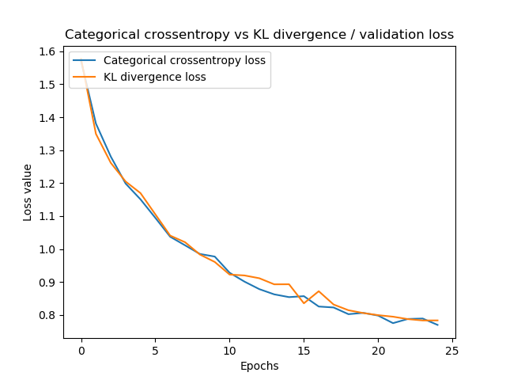
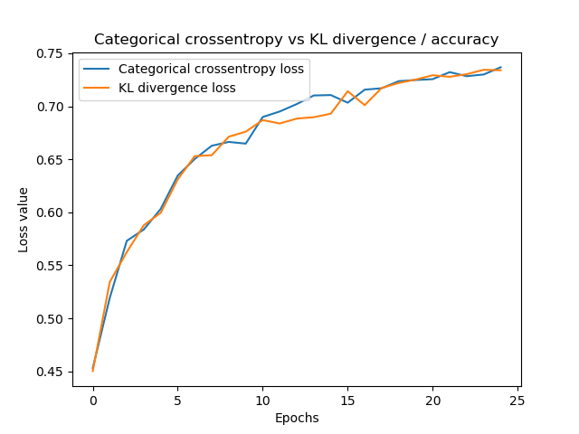
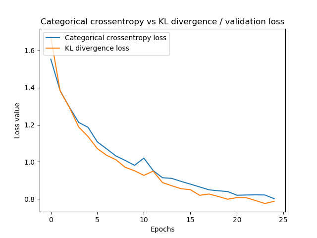
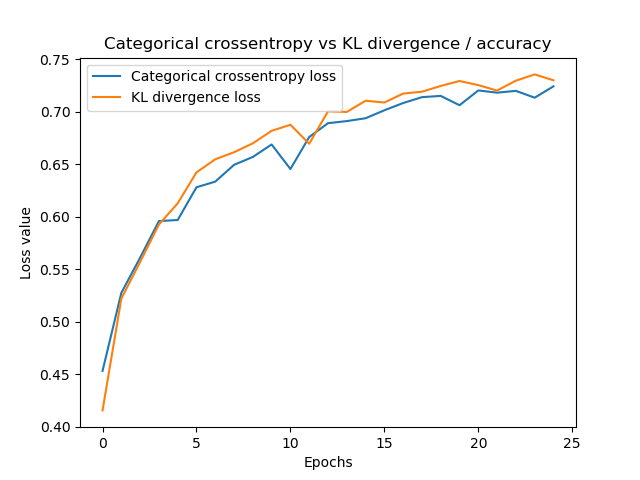

When you train a supervised machine learning model, [you feed forward data](https://www.machinecurve.com/index.php/2019/10/04/about-loss-and-loss-functions/#the-high-level-supervised-learning-process), generating predictions on the fly. The comparison of these predictions with the actual targets valid for the samples used during training can be used to [optimize your model](https://www.machinecurve.com/index.php/2019/10/24/gradient-descent-and-its-variants/).

But how to compare? That's a valid question.

There are various so-called _loss functions_ these days, which essentially present you the [difference between true target and prediction](https://www.machinecurve.com/index.php/2019/10/04/about-loss-and-loss-functions). The Kullback-Leibler divergence (or KL Divergence for short) is one of these. Seeing it in the Keras docs spawned a lot of questions. What is KL divergence? How does it work as a loss function? In what kind of machine learning (or deep learning) problems can it be used? And how can I implement it?

All valid questions which I'll try to answer in this blog article. First, I'll discuss _what the KL divergence is_ - and (spoiler alert) - it's nothing more than a comparison metric for two probability distributions. Subsequently, I'll cover use cases for KL divergence in deep learning problems. This is followed by a look at the Keras API, to find how KL divergence is defined in the Losses section. Finally, we implement a Keras model with a KL divergence loss value, find out see how it works.

Are you ready? Let's go!

* * *

\[toc\]

* * *

## Comparing two probability distributions: KL divergence

Okay, let's take a look at the first question: **what is the Kullback-Leibler divergence?**

When diving into this question, I came across a really good article relatively quickly. At Count Bayesie's website, the article ["Kullback-Leibler Divergence Explained"](https://www.countbayesie.com/blog/2017/5/9/kullback-leibler-divergence-explained) provides a really intuitive yet mathematically sound explanation in plain English. It lies at the basis of my attempt at explaining the KL divergence, augmented with a few extra sources. However, I definitely recommend taking a look!

Small note: contrary to Count Bayesie's article, I'll start my discussion from a supervised machine learning point of view.

### ML based probability distribution

Suppose that you have a probability distribution. Some activation functions do that, such as the Softmax activation function, that generates a probability distribution over the classes in your supervised machine learning setting.

Now what if, contrary to the Softmax situation where the categorical crossentropy loss function is often used which only takes into account the `argmax` of the predictions generated, you wish to compare the _predicted distribution_ with some _actual distribution_?

As we will see, there are situations when this happens. In those cases, you can use the Kullback-Leibler Divergence, which is an adaptation of the entropy metric that is common in information theory (Count Bayesie, n.d.).

### From entropy based information size to expected information loss

But what is entropy? Mathematically, it can be defined as follows (Wikipedia, 2001).

\\begin{equation} H(X) = -\\sum p(X)\\log p(X) \\end{equation}

Intuitively, it's the _expected value of the probability of data in some distribution_. In plain English, it's something like this (assuming that \[latex\]log\_2\[/latex\] is used): "the minimum number of bits it would take us to encode our information" (Count Bayesie, 2017).

The entropy for some probability distribution thus tells you, given some data, how much information is in it. Knowing this, we can also find out _how much is lost_ when you change the distribution.

Because that's what you do when you're performing deep learning activities: your feedforward-generated predictions effectively form a probability distribution ("there is some probability that the value lies between \[latex\]x\[/latex\] or \[latex\]y\[/latex\] / takes value \[latex\]x\[/latex\]"), and hence can be compared with the true distribution for the sample (i.e., your training dataset).

Now - if your optimizer adapts its weights, the predictions change, and so does the probability distribution generated by your model. If only you could measure the loss of information between the model-based probability distributions and the distribution of the actual training dataset... then, you could do some optimization.

### KL divergence

Well, you can!! 😎

By slightly adapting the formula for entropy, we arrive at the **Kullback-Leibler divergence** (Count Bayesie, 2017)! It can be defined as follows (Wikipedia, 2004):

\\begin{equation} KL (P || Q) = \\sum p(X) \\log ( p(X) \\div q(X) ) \\end{equation}

In plain English, this effectively tells you how much entropy you lose or gain when you would change probability distributions (recognize that \[latex\]\\log ( p(X) \\div q(X) ) = \\log p(X) - \\log q(X)\[/latex\], Count Bayesie 2017).

It's hence not surprising that the KL divergence is also called _relative entropy_. It's the gain or loss of entropy when switching from distribution one to distribution two (Wikipedia, 2004) - and it allows us to compare two probability distributions.

Let's now take a look which ML problems require KL divergence loss, to gain some understanding when it can be useful.

* * *

## Use cases for KL divergence in machine learning problems

But when to use KL divergence in your machine learning projects?

Based on some Googling, I found that there are some use cases when Kullback-Leibler divergence is quite useful:

- Primarily, it is used in **Variational Autoencoders** (Count Bayesie, 2017; Shafkat, 2018). These autoencoders learn to encode samples into a latent probability distribution. From this latent distribution, a sample can be drawn that can be fed to a decoder which outputs e.g. an image. It's one of the types of _generative models_ currently being fashionable for generating e.g. [pictures of humans](https://www.machinecurve.com/index.php/2019/07/17/this-person-does-not-exist-how-does-it-work/) (although strictly speaking, for the linked blog a different type of model - a GAN - has been used).
- However, KL divergence can also be used in **_multi_class classification scenarios** (Moreno, n.d.). These problems, which traditionally use the Softmax function and use one-hot encoded target data, are naturally suitable to KL divergence since Softmax "normalizes \[data\] into a probability distribution consisting of K probabilities proportional to the exponentials of the input numbers" (Wikipedia, 2006). In plain English: the output tells you, for some sample \[latex\]x\[/latex\], the odds of being present in the input image. Since KL divergence works with probability distributions, it's very much usable here.
- Funnily, KL divergence is also used for **replacing _Least Squares minimization_** in models (Kosheleva & Kreinovich, 2018). In regression models, the loss function to minimize is usually the error (prediction minus target), often squared. While the simplicity of such loss functions pays off in terms of efficacy, they are notoriously sensitive to noise (especially when the predictions generated by the feedforward operation are everything but part of the normal distribution). Rather counterintuitively, KL divergence has appeared here as an interesting replacement - as it works on the distribution level rather than the sample level.

* * *

## Kullback-Leibler divergence in the Keras API

The Keras API defines the KL divergence as follows (Keras, n.d.):

```
keras.losses.kullback_leibler_divergence(y_true, y_pred)
```

This means that it can simply be defined as 'kullback\_leibler\_divergence' in your models. Simple :-)

* * *

## Implementing a Keras model with KL divergence

Let's now see whether it's possible to implement a model with Keras that makes use of the KL divergence. As we've seen, it's possible to use KL divergence in some ML problems - and multiclass classification with Softmax function is one of them, because it generates probability distributions. These can be compared with KL divergence, and hence training can take place with it.

We'll therefore slightly adapt a [ConvNet created in another blog post](https://www.machinecurve.com/index.php/2019/09/17/how-to-create-a-cnn-classifier-with-keras/) to use KL divergence. This way, you don't have to immerse yourself in an entirely new model (assuming that you've read the linked post) yet can see how KL divergence can be used with Keras.

### Configuring the loss function during Keras model compilation

And it's simple, actually. It just involves specifying it as the used `loss` function during the model compilation step:

```
# Compile the model
model.compile(loss=keras.losses.kullback_leibler_divergence,
              optimizer=keras.optimizers.Adam(),
              metrics=['accuracy'])
```

That's it!

### Full Keras CNN code

Here's the full ConvNet code, including KL divergence:

```
import keras
from keras.datasets import cifar10
from keras.models import Sequential
from keras.layers import Dense, Dropout, Flatten
from keras.layers import Conv2D, MaxPooling2D
from keras import backend as K

# Model configuration
img_width, img_height         = 32, 32
batch_size                    = 250
no_epochs                     = 25
no_classes                    = 10
validation_split              = 0.2
verbosity                     = 1

# Load CIFAR10 dataset
(input_train, target_train), (input_test, target_test) = cifar10.load_data()

# Reshape data based on channels first / channels last strategy.
# This is dependent on whether you use TF, Theano or CNTK as backend.
# Source: https://github.com/keras-team/keras/blob/master/examples/mnist_cnn.py
if K.image_data_format() == 'channels_first':
    input_train = input_train.reshape(input_train.shape[0],3, img_width, img_height)
    input_test = input_test.reshape(input_test.shape[0], 3, img_width, img_height)
    input_shape = (3, img_width, img_height)
else:
    input_train = input_train.reshape(input_train.shape[0], img_width, img_height, 3)
    input_test = input_test.reshape(input_test.shape[0], img_width, img_height, 3)
    input_shape = (img_width  , img_height, 3)

# Parse numbers as floats
input_train = input_train.astype('float32')
input_test = input_test.astype('float32')

# Normalize data.
input_train = input_train / 255
input_test = input_test / 255

# Convert target vectors to categorical targets
target_train = keras.utils.to_categorical(target_train, no_classes)
target_test = keras.utils.to_categorical(target_test, no_classes)

# Create the model
model = Sequential()
model.add(Conv2D(32, kernel_size=(3, 3), activation='relu', input_shape=input_shape))
model.add(MaxPooling2D(pool_size=(2, 2)))
model.add(Dropout(0.50))
model.add(Conv2D(64, kernel_size=(3, 3), activation='relu'))
model.add(MaxPooling2D(pool_size=(2, 2)))
model.add(Dropout(0.50))
model.add(Flatten())
model.add(Dense(256, activation='relu'))
model.add(Dense(no_classes, activation='softmax'))

# Compile the model
model.compile(loss=keras.losses.kullback_leibler_divergence,
              optimizer=keras.optimizers.Adam(),
              metrics=['accuracy'])

# Fit data to model
model.fit(input_train, target_train,
          batch_size=batch_size,
          epochs=no_epochs,
          verbose=verbosity,
          validation_split=validation_split
)

# Generate generalization metrics
score = model.evaluate(input_test, target_test, verbose=0)
print(f'Test loss: {score[0]} / Test accuracy: {score[1]}')
```

* * *

## Results

I ran the model twice, then changed to categorical crossentropy loss, and ran it twice too. This allows for some comparison between KL divergence and categorical crossentropy loss, which is normally used in multiclass classification with one-hot encoded vectors.

In 25 epochs, performance is very similar. Therefore, I'd say you could use both if you're facing the choice when to use categoricall crossentropy or KL divergence.

- [](https://www.machinecurve.com/wp-content/uploads/2019/12/kld4.png)
    
- [](https://www.machinecurve.com/wp-content/uploads/2019/12/kld3.png)
    
- [](https://www.machinecurve.com/wp-content/uploads/2019/12/kld2.png)
    
- [](https://www.machinecurve.com/wp-content/uploads/2019/12/kld1.png)
    

* * *

## Summary

In this blog, we looked at what KL divergence is and how it can be used in neural networks. To illustrate this, we created an example implementation of a convolutional neural network, created with the Keras deep learning framework in Python. This example, which makes use of KL divergence loss, performs equal to traditionally-used categorical crossentropy loss.

I hope you've learnt something from this blog post, even though it's a bit shorter than usual. If you did, I'd love to know - so feel free to leave a comment in the comments box below! Please also do so when you have questions or when you spot mistakes in my text. I'll happily improve it and will then list you in the references list 😊

Thank you for reading MachineCurve today and happy engineering! 😎

* * *

## References

Count Bayesie. (2017, May 10). Kullback-Leibler Divergence Explained. Retrieved from [https://www.countbayesie.com/blog/2017/5/9/kullback-leibler-divergence-explained](https://www.countbayesie.com/blog/2017/5/9/kullback-leibler-divergence-explained)

Wikipedia. (2004, February 13). Kullback–Leibler divergence. Retrieved from [https://en.wikipedia.org/wiki/Kullback%E2%80%93Leibler\_divergence](https://en.wikipedia.org/wiki/Kullback%E2%80%93Leibler_divergence)

Wikipedia. (2001, July 9). Entropy (information theory). Retrieved from [https://en.wikipedia.org/wiki/Entropy\_(information\_theory)](https://en.wikipedia.org/wiki/Entropy_(information_theory))

Shafkat, I. (2018, April 5). Intuitively Understanding Variational Autoencoders. Retrieved from [https://towardsdatascience.com/intuitively-understanding-variational-autoencoders-1bfe67eb5daf](https://towardsdatascience.com/intuitively-understanding-variational-autoencoders-1bfe67eb5daf)

Kosheleva, O., & Kreinovich, V. (2018). Why deep learning methods use KL divergence instead of least squares: a possible pedagogical explanation. [https://digitalcommons.utep.edu/cs\_techrep/1192](https://digitalcommons.utep.edu/cs_techrep/1192)

Moreno. (n.d.). Alexander Moreno's answer to What are some applications of the KL-divergence in machine learning? Retrieved from [https://www.quora.com/What-are-some-applications-of-the-KL-divergence-in-machine-learning/answer/Alexander-Moreno-1](https://www.quora.com/What-are-some-applications-of-the-KL-divergence-in-machine-learning/answer/Alexander-Moreno-1)

Keras. (n.d.). Losses. Retrieved from [https://keras.io/losses/#kullback\_leibler\_divergence](https://keras.io/losses/#kullback_leibler_divergence)

Wikipedia. (2006, July 28). Softmax function. Retrieved from [https://en.wikipedia.org/wiki/Softmax\_function](https://en.wikipedia.org/wiki/Softmax_function)
