Regularizers, or ways to reduce the complexity of your machine learning models - can help you to get models that generalize to new, unseen data better. L1, L2 and Elastic Net regularizers are the ones most widely used in today's machine learning communities.

But what are these regularizers? Why are they needed in the first place? And, most importantly, how can I implement them in my Keras model?

Those questions will be answered in today's blog post.

Firstly, we'll provide a recap on L1, L2 and Elastic Net regularization. In the recap, we look at the need for regularization, how a regularizer is attached to the loss function that is minimized, and how the L1, L2 and Elastic Net regularizers work. We do so intuitively, but we don't hide the maths when necessary.

However, the primary aspect of this blog post is the Keras based set of examples that show the wide range of kernel, bias and activity based regularizers that are available within the framework. Using a CNN based model, we show you how L1, L2 and Elastic Net regularization can be applied to your Keras model - as well as some interesting results for that particular model.

After completing this tutorial, you will know...

- How to use `tensorflow.keras.regularizers` in your TensorFlow 2.0/Keras project.
- What L1, L2 and Elastic Net Regularization is, and how it works.
- What the impact is of adding a regularizer to your project.

**Update 16/Jan/2021:** ensured that post is up to date for 2021 and and that works with TensorFlow 2.0+. Also added a code example to the beginning of this article so that you can get started quickly.

* * *

\[toc\]

* * *

## Example code: L1, L2 and Elastic Net Regularization with TensorFlow 2.0 and Keras

With these code examples, you can immediately apply L1, L2 and Elastic Net Regularization to your TensorFlow or Keras project. If you want to understand the regularizers in more detail as well as using them, make sure to read the rest of this tutorial as well. Please note that these regularizers can also be used as `bias_regularizer` and `activity_regularizer`, not just `kernel_regularizer`.

### L1 Regularization example

```
model.add(Conv2D(64, kernel_size=(3, 3), activation='relu', kernel_regularizer=tensorflow.keras.regularizers.l1(0.01)))
```

### L2 Regularization example

```
model.add(Conv2D(64, kernel_size=(3, 3), activation='relu', kernel_regularizer=tensorflow.keras.regularizers.l2(0.01)))
```

### Elastic Net (L1+L2) Regularization example

```
model.add(Conv2D(64, kernel_size=(3, 3), activation='relu', kernel_regularizer=tensorflow.keras.regularizers.l1_l2(l1=0.01, l2=0.01)))
```

* * *

## Recap: what are L1, L2 and Elastic Net Regularization?

In our blog post ["What are L1, L2 and Elastic Net Regularization in neural networks?"](https://www.machinecurve.com/index.php/2020/01/21/what-are-l1-l2-and-elastic-net-regularization-in-neural-networks/), we looked at the concept of regularization and the L1, L2 and Elastic Net Regularizers. We'll implement these in this blog post, using the Keras deep learning framework.

However, before we actually start looking into the Keras API and coding our Keras based example, it's important to understand the basics of regularization and the basics of the regularizers.

Here, we'll therefore cover these basics in order to provide a recap. Firstly, we'll discuss why we need a regularizer in the first place. Secondly, we'll take a look at L1 and L2 Regularization. Finally, we study Elastic Net Regularization in a bit more detail. Please refer to the blog post linked above for a more detailed explanation.

### The need for regularization

Training a supervised machine learning model equals learning a mapping for a function \[latex\]\\hat{y}: f(\\textbf{x})\[/latex\], where \[latex\]\\textbf{x}\[/latex\] is an input vector and \[latex\]\\hat{y}\[/latex\] is the predicted output value. Given the fact that it's supervised, you have the "ground truth" \[latex\]y\[/latex\] available for all \[latex\]\\textbf{x}\[/latex\] in your training set and hence, your definition of a well-performing machine learning model is to achieve \[latex\]\\hat{y} \\approx y\[/latex\] for your entire training set.

This can be achieved by going through the iterative [high-level supervised machine learning process](https://www.machinecurve.com/index.php/2019/10/04/about-loss-and-loss-functions/#the-high-level-supervised-learning-process), which means that you feed your training set to the model, generate predictions, compare these with ground truth, summarize them in a [loss value](https://www.machinecurve.com/index.php/2019/10/04/about-loss-and-loss-functions/#loss), which you then use to [optimize](https://www.machinecurve.com/index.php/2019/10/24/gradient-descent-and-its-variants/) the weights of your model, before starting a new iteration. This way, you might be able to find a mapping for which \[latex\]\\hat{y} \\approx y\[/latex\] is true to a great extent.

[](https://www.machinecurve.com/wp-content/uploads/2020/01/poly_both.png)

In the exemplary scenario of the blog post linked above, we did however see that many mappings can be learned based on your training data. In the plot above, this becomes clear with a simple polyfit: for a few blue training data samples, it may learn the orange mapping, but there's no guarantee that it doesn't learn the blue one instead.

As you can imagine, the blue one is much less scalable to new data, as it's very unlikely that real-world data produces such large oscillations in such a small domain. It's probably highly overfit i.e. too adapted to the training data.

Can this be avoided?

Yes, to some extent: by adding **a regularizer**, you may enforce the training process to steer towards relatively "simple" weights, which may make your model more generic and thus scalable.

### Loss based regularizer

From above, we know that the supervised machine learning process produces some loss value. Let's now take a look at this loss value in a bit more detail, as it's important to understand what a regularizer does. The first step is to define the loss value at a high level; say, it's \[latex\]L(f, \\textbf{x}, y)\[/latex\], where \[latex\]f\[/latex\] is the model, \[latex\]\\textbf{x}\[/latex\] some input vector and \[latex\]y\[/latex\] the corresponding ground truth value.

Now, the loss value is determined by a _loss function_. Loss functions provide a mathematical way of comparing two values. Exemplary ones are [binary crossentropy](https://www.machinecurve.com/index.php/2019/10/22/how-to-use-binary-categorical-crossentropy-with-keras/) (which compares a ground truth value with a predicted output) and [hinge loss](https://www.machinecurve.com/index.php/2019/10/15/how-to-use-hinge-squared-hinge-loss-with-keras/). But as we don't want to get into too much detail here, we simply define the output of the loss function as \[latex\]L\_{function}(f, \\textbf{x}, y)\[/latex\]. So:

\[latex\] L(f, \\textbf{x}, y) = L\_{function}(f, \\textbf{x}, y)\[/latex\]

The objective during training is to minimize this value, and hence the function:

\[latex\] \\min L(f, \\textbf{x}, y) = \\min L\_{function}(f, \\textbf{x}, y)\[/latex\]

Now back to the regularizer. The _goal for using it_ is to _produce simpler models which scale to more generic data_. This means that you'll have to do something with the _weights_ of your model, and the only way of doing is is during the _optimization step_.

However, measuring the need for regularizing is not something we want to do _during_ optimization. Take a look at loss: the _measurement_ is performed just _before_ the optimization step, after which its outcome - the loss value - is used for optimizing the model.

Can't we do something similar with a regularizer?

Yes, we can: there's no argument as to why we cannot provide a measurement for the _need for regularization_ directly in advance of regularization. In fact, we can even add it to the loss value \[latex\] L(f, \\textbf{x}, y)\[/latex\]! This way, the need for regularization given some model weights is taken into account during optimization, together with the comparison between ground truth and predicted value. This way, you may actually arrive at models which are simple _and_ where \[latex\]\\hat{y} \\approx y\[/latex\].

We do so as follows:

\[latex\] L(f, \\textbf{x}, y) = L\_{function}(f, \\textbf{x}, y) + R(f)\[/latex\]

After which the minimization operation becomes:

\[latex\] \\min L(f, \\textbf{x}, y) = \\min ( L\_{function}(f, \\textbf{x}, y) + R(f) )\[/latex\]

Let's now take a look at two possible instantiations for \[latex\]R(f)\[/latex\], i.e. two actual regularizers: L1 (or Lasso) regularization and L2 (or Ridge) regularization.

### L1 and L2 Regularization

When L1 Regularization is applied to one of the layers of your neural network, \[latex\]R(f)\[/latex\] is instantiated as \[latex\] \\sum\_f{ \_{i=1}^{n}} | w\_i | \[/latex\], where \[latex\]w\_i\[/latex\] is the value for one of your \[latex\]n\[/latex\] weights in that particular layer. This instantiation computes the L1 norm for a vector, which is also called "taxicab norm" as it computes and adds together the lengths between the origin and the value along the axis for a particular dimension.

[](https://www.machinecurve.com/wp-content/uploads/2020/01/l1_component.png)

Applying L1 regularization ensures that given a relatively constant \[latex\] L\_{function}(f, \\textbf{x}, y) \[/latex\] your weights take very small values of \[latex\]\\approx 0\[/latex\], as the L1 value for \[latex\]x = 0\[/latex\] is lowest. Indeed, likely, your weights will even [become _zero_](https://www.machinecurve.com/index.php/2020/01/21/what-are-l1-l2-and-elastic-net-regularization-in-neural-networks/#on-model-sparsity), due to the fact that the L1 derivative is constant. Applying L1 to your neural networks layers thus pushes them to drop out weights that do not contribute to their predictive power significantly enough, and thus leads to sparse models.

However, it may be that you don't want models to be sparse. This may be the case if you face the "small, fat data problem", where you don't have a lot of samples, but the samples you've got are high-dimensional. Another case would be correlative data: if your features contain weights which have high pairwise correlation coefficients, dropping out the effect of certain variables through dropping out weights would be a bad idea, as you would effectively lose information.

In this case, L2 regularization may be applied. For L2, \[latex\]R(f)\[/latex\] is instantiated as \[latex\] \\sum\_f{ \_{i=1}^{n}} w\_i^2 \[/latex\], where \[latex\]w\_i\[/latex\] is the value for one of your \[latex\]n\[/latex\] weights in that particular layer. As it's quadratic, it produces a characteristic plot:

[](https://www.machinecurve.com/wp-content/uploads/2020/01/l2_comp.png)

Applying L2 regularization does lead to models where the weights will get relatively small values, i.e. where they are simple. This is similar to applying L1 regularization. However, contrary to L1, L2 regularization [does not push your weights to be _exactly zero_](https://www.machinecurve.com/index.php/2020/01/21/what-are-l1-l2-and-elastic-net-regularization-in-neural-networks/#why-l1-yields-sparsity-and-l2-likely-does-not). This is also caused by the derivative: contrary to L1, where the derivative is a constant (it's either +1 or -1), the L2 derivative is \[latex\]2x\[/latex\]. This means that the closer you get to zero, the smaller the derivative gets, and hence the smaller the update. As with the case of dividing \[latex\]1\[/latex\] by \[latex\]2\[/latex\], then \[latex\]\\frac{1}{2}\[/latex\] by \[latex\]2\[/latex\], then \[latex\]\\frac{1}{4}\[/latex\] by \[latex\]2\[/latex\], and so on, you never reach _zero_, but the values get _really small_. For the situations where L1 cannot be applied, L2 is a good candidate for regularization.

### Elastic Net Regularization

However, applying L2 yields one disbenefit: interpretability. What's more, it may be the case that you do not exactly know which regularizer to apply, as you don't have sufficient prior knowledge about your dataset. Finally, it can also be that you find insufficient results with either one, but think you could benefit from something in between.

Say hello to Elastic Net Regularization, which was introduced by Zou & Hastie (2005). It effectively instantiates \[latex\]R(f)\[/latex\] as a linear combination of L1 and L2 regularization:

\[latex\] L(f, \\textbf{x}, y) = L\_{function}(f, \\textbf{x}, y) + \\lambda\_1 \\sum\_f{ \_{i=1}^{n}} | w\_i | + \\lambda\_2 \\sum\_f{ \_{i=1}^{n}} w\_i^2 \[/latex\]

In the original paper, \[latex\]\\lambda\_1\[/latex\] can also be defined as \[latex\]1 - \\alpha\[/latex\] and \[latex\]\\lambda\_2\[/latex\] as \[latex\]\\alpha\[/latex\]. This makes the impact of both relative to each other, with \[latex\]\\alpha = 1\[/latex\] giving L2 regularization and \[latex\]\\alpha = 0\[/latex\] giving L1 regularization. All the values in between produce something that mimics one of them.

According to Zou & Hastie (2015) and many practitioners, Elastic Net Regularization produces better results and can be used more naïvely, e.g. when little prior knowledge is available about the dataset.


Now that we know some details about the regularizers, let's find out how they are represented by the Keras API.

### Which lambda values do I need?

It's very difficult, if not impossible, to give an answer to this question, as the most suitable values for \[latex\]\\lambda/latex\] are data-dependent (Google Developers, n.d.).

However, it's best to use values \[latex\]> 0\[/latex\] (otherwise, the regularizer would be dead). Also, it's best not to use lambdas that are too high (risking underfitting) but neither lambdas that are too low (making the regularizer ineffective, increasing the odds of overfitting) (Google Developers, n.d.). However, generally speaking, they should be rather lower than higher. For example, as we shall see, the default value within the Keras framework is \[latex\]\\lambda = 0.01\[/latex\] (TensorFlow, 2021).

* * *

## Regularizers in the Keras API

If we take a look at the Keras docs, we get a sense of how regularization works in Keras. First of all, "the penalties are applied on a per-layer basis" - which means that you can use different regularizers on different layers in your neural network (TensorFlow, 2021).

Secondly, for each layer, regularization can be performed on one (or all) of three areas within the layer (TensorFlow, 2021):

- The **kernel**, through `kernel_regularizer`, which applies regularization to the kernel a.k.a. the actual weights;
- The **bias** value, through `bias_regularizer`, which applies regularization to the bias, which shifts the layer outputs;
- The **activity** value, through `activity_regularizer`, which applies the regularizer to the _output of the layer_, i.e. the activation value (which is the combination of the weights + biases with the input vector, fed through the [activation function](https://www.machinecurve.com/index.php/2019/09/04/relu-sigmoid-and-tanh-todays-most-used-activation-functions/)) (Tonutti, 2017).

To each three, an instance of the `tensorflow.keras.regularizers.Regularizer` class can be supplied in order for regularization to work (TensorFlow, 2021). Soon, we'll cover the L1, L2 and Elastic Net instances of this class by means of an example, which are represented as follows (TensorFlow, 2021):

```
tensorflow.keras.regularizers.l1(0.)
tensorflow.keras.regularizers.l2(0.)
tensorflow.keras.regularizers.l1_l2(l1=0.01, l2=0.01)
```

In short, this way, you can either regularize _parts_ of what happens in the neural network layer, or the combination of the parts by means of the _output_. That's quite some flexibility, isn't it? :)

Let's now take a look at how the regularizers can be applied in a neural network.

* * *

## Keras L1, L2 and Elastic Net Regularization examples

Here's the model that we'll be creating today. It was generated with [Net2Vis](https://www.machinecurve.com/index.php/2020/01/07/visualizing-keras-neural-networks-with-net2vis-and-docker/), a cool web based visualization library for Keras models (Bäuerle & Ropinski, 2019):

- [](https://www.machinecurve.com/wp-content/uploads/2020/01/graph-4.png)
    
- [](https://www.machinecurve.com/wp-content/uploads/2020/01/legend-2.png)
    

As you can see, it's a convolutional neural network. It takes 28 x 28 pixel images as input, learns 32 and 64 filters in two Conv2D layers and applies max pooling twice, together with some Dropout. These results are fed to the Dense layers through a Flattening operation; the Dense layers generate the final prediction, which is a classification operation to 47 output classes through a Softmax activation function.

**Read more:**

- [Visualizing Keras neural networks with Net2Vis and Docker](https://www.machinecurve.com/index.php/2020/01/07/visualizing-keras-neural-networks-with-net2vis-and-docker/)
- [How does the Softmax activation function work?](https://www.machinecurve.com/index.php/2020/01/08/how-does-the-softmax-activation-function-work/)

The dataset that we'll be using today is the EMNIST dataset. It adds _letters_ to the traditional MNIST dataset, as you can see in the plot below. For this to work, we use the [Extra Keras Datasets](https://www.machinecurve.com/index.php/2020/01/10/making-more-datasets-available-for-keras/) module.

[](https://github.com/christianversloot/extra_keras_datasets/raw/master/assets/emnist-balanced.png)

The steps for creating today's model are as follows:

- Stating the imports;
- Setting the model configuration;
- Loading and preparing the data;
- Creating the model architecture;
- Configuring the model;
- Fitting the data;
- Generating evaluation metrics.

### Stating the imports

For today's model, we'll be using TensorFlow 2.0 and the corresponding built-in facilities for Keras. From them, we import the Sequential API, and the layers specified above. Besides Keras, we'll also use Numpy for numbers processing and [extra-keras-datasets](https://pypi.org/project/extra-keras-datasets/) for loading the data. Finally, Matplotlib is used for visualizing the model history. Make sure to have these dependencies installed before you run the model.

```
import tensorflow.keras
from extra_keras_datasets import emnist
import numpy as np
from tensorflow.keras.models import Sequential
from tensorflow.keras.layers import Dense, Dropout, Flatten
from tensorflow.keras.layers import Conv2D, MaxPooling2D
import matplotlib.pyplot as plt
```

### Setting the model configuration

The next step is to define the configuration for our model. First, we set the characteristics of our input image: its width, its height, the number of channels and - based on these - the input shape for one sample.

We also specify batch size, the number of epochs, and the number of classes (47, because we now have capitalized and lowercase letters as well as digits!). The validation split i.e. how much training data will be set apart for model validation is set to 20% and through verbosity mode, we output everything on screen.

```
# Model configuration
img_width, img_height, num_channels = 28, 28, 1
input_shape = (img_height, img_width, num_channels)
batch_size = 250
no_epochs = 25
no_classes = 47
validation_split = 0.2
verbosity = 1
```

### Loading and preparing data

The first step in loading the data is to use the [Extra Keras Datasets](https://www.machinecurve.com/index.php/2020/01/10/making-more-datasets-available-for-keras/) module and call `load_data()`:

```
# Load EMNIST dataset
(input_train, target_train), (input_test, target_test) = emnist.load_data()
```

Next, we add the number of channels to the EMNIST dataset through a `reshape` operation, as they are traditionally not present:

```
# Add number of channels to EMNIST data
input_train = input_train.reshape((len(input_train), img_height, img_width, num_channels))
input_test  = input_test.reshape((len(input_test), img_height, img_width, num_channels))
```

We then convert the data types into `float32` format, which presumably speeds up training:

```
# Parse numbers as floats
input_train = input_train.astype('float32')
input_test = input_test.astype('float32')
```

We then normalize the data:

```
# Normalize data
input_train = input_train / 255
input_test = input_test / 255
```

Finally, we convert the targets into categorical format, which allows us to use [categorical crossentropy loss](https://www.machinecurve.com/index.php/2019/10/22/how-to-use-binary-categorical-crossentropy-with-keras/):

```
# Convert target vectors to categorical targets
target_train = tensorflow.keras.utils.to_categorical(target_train, no_classes)
target_test = tensorflow.keras.utils.to_categorical(target_test, no_classes)
```

### The model part of a neural network

We can next create the architecture for our Keras model. Depending on the regularizer you wish to use, you can choose one of the next combinations. Here, we'll show examples for:

- L1 Kernel/Bias regularization;
- L1 Activity regularization;
- L2 Kernel/Bias regularization;
- L2 Activity regularization;
- Elastic Net Kernel/Bias regularization;
- Elastic Net Activity regularization.

Obviously, you're free to mix and match if desired :)

#### L1 Kernel/Bias regularization

Applying L1 regularization to the kernel and bias values goes as follows:

```
# Create the model
model = Sequential()
model.add(Conv2D(32, kernel_size=(3, 3), activation='relu', input_shape=input_shape, kernel_regularizer=regularizers.l1(0.01), bias_regularizer=regularizers.l1(0.01)))
model.add(MaxPooling2D(pool_size=(2, 2)))
model.add(Dropout(0.25))
model.add(Conv2D(64, kernel_size=(3, 3), activation='relu', kernel_regularizer=regularizers.l1(0.01), bias_regularizer=regularizers.l1(0.01)))
model.add(MaxPooling2D(pool_size=(2, 2)))
model.add(Dropout(0.25))
model.add(Flatten())
model.add(Dense(256, activation='relu', kernel_regularizer=regularizers.l1(0.01), bias_regularizer=regularizers.l1(0.01)))
model.add(Dense(no_classes, activation='softmax', kernel_regularizer=regularizers.l1(0.01), bias_regularizer=regularizers.l1(0.01)))
```

#### L1 Activity regularization

Regularizing activity instead is also simple:

```
# Create the model
model = Sequential()
model.add(Conv2D(32, kernel_size=(3, 3), activation='relu', input_shape=input_shape, activity_regularizer=regularizers.l1(0.01)))
model.add(MaxPooling2D(pool_size=(2, 2)))
model.add(Dropout(0.25))
model.add(Conv2D(64, kernel_size=(3, 3), activation='relu', activity_regularizer=regularizers.l1(0.01)))
model.add(MaxPooling2D(pool_size=(2, 2)))
model.add(Dropout(0.25))
model.add(Flatten())
model.add(Dense(256, activation='relu', activity_regularizer=regularizers.l1(0.01)))
model.add(Dense(no_classes, activation='softmax', activity_regularizer=regularizers.l1(0.01)))
```

#### L2 Kernel/Bias regularization

Switching from L1 to L2 regularization for your kernel and bias values is simply replacing L1 for L2:

```
# Create the model
model = Sequential()
model.add(Conv2D(32, kernel_size=(3, 3), activation='relu', input_shape=input_shape, kernel_regularizer=regularizers.l2(0.01), bias_regularizer=regularizers.l2(0.01)))
model.add(MaxPooling2D(pool_size=(2, 2)))
model.add(Dropout(0.25))
model.add(Conv2D(64, kernel_size=(3, 3), activation='relu', kernel_regularizer=regularizers.l2(0.01), bias_regularizer=regularizers.l2(0.01)))
model.add(MaxPooling2D(pool_size=(2, 2)))
model.add(Dropout(0.25))
model.add(Flatten())
model.add(Dense(256, activation='relu', kernel_regularizer=regularizers.l2(0.01), bias_regularizer=regularizers.l2(0.01)))
model.add(Dense(no_classes, activation='softmax', kernel_regularizer=regularizers.l2(0.01), bias_regularizer=regularizers.l2(0.01)))
```

#### L2 Activity regularization

The same goes for activity regularization:

```
# Create the model
model = Sequential()
model.add(Conv2D(32, kernel_size=(3, 3), activation='relu', input_shape=input_shape, activity_regularizer=regularizers.l2(0.01)))
model.add(MaxPooling2D(pool_size=(2, 2)))
model.add(Dropout(0.25))
model.add(Conv2D(64, kernel_size=(3, 3), activation='relu', activity_regularizer=regularizers.l2(0.01)))
model.add(MaxPooling2D(pool_size=(2, 2)))
model.add(Dropout(0.25))
model.add(Flatten())
model.add(Dense(256, activation='relu', activity_regularizer=regularizers.l2(0.01)))
model.add(Dense(no_classes, activation='softmax', activity_regularizer=regularizers.l2(0.01)))
```

#### Elastic Net Kernel/Bias regularization

Elastic net, or L1 + L2 regularization, can also be added easily to regularize kernels and biases:

```
# Create the model
model = Sequential()
model.add(Conv2D(32, kernel_size=(3, 3), activation='relu', input_shape=input_shape, kernel_regularizer=regularizers.l1_l2(l1=0.01, l2=0.01), bias_regularizer=regularizers.l1_l2(l1=0.01, l2=0.01)))
model.add(MaxPooling2D(pool_size=(2, 2)))
model.add(Dropout(0.25))
model.add(Conv2D(64, kernel_size=(3, 3), activation='relu', kernel_regularizer=regularizers.l1_l2(l1=0.01, l2=0.01), bias_regularizer=regularizers.l1_l2(l1=0.01, l2=0.01)))
model.add(MaxPooling2D(pool_size=(2, 2)))
model.add(Dropout(0.25))
model.add(Flatten())
model.add(Dense(256, activation='relu', kernel_regularizer=regularizers.l1_l2(l1=0.01, l2=0.01), bias_regularizer=regularizers.l1_l2(l1=0.01, l2=0.01)))
model.add(Dense(no_classes, activation='softmax', kernel_regularizer=regularizers.l1_l2(l1=0.01, l2=0.01), bias_regularizer=regularizers.l1_l2(l1=0.01, l2=0.01)))
```

#### Elastic Net Activity regularization

Once again, the same is true for activity regularization:

```
# Create the model
model = Sequential()
model.add(Conv2D(32, kernel_size=(3, 3), activation='relu', input_shape=input_shape, activity_regularizer=regularizers.l1_l2(l1=0.01, l2=0.01)))
model.add(MaxPooling2D(pool_size=(2, 2)))
model.add(Dropout(0.25))
model.add(Conv2D(64, kernel_size=(3, 3), activation='relu', activity_regularizer=regularizers.l1_l2(l1=0.01, l2=0.01)))
model.add(MaxPooling2D(pool_size=(2, 2)))
model.add(Dropout(0.25))
model.add(Flatten())
model.add(Dense(256, activation='relu', activity_regularizer=regularizers.l1_l2(l1=0.01, l2=0.01)))
model.add(Dense(no_classes, activation='softmax', activity_regularizer=regularizers.l1_l2(l1=0.01, l2=0.01)))
```

### Compiling the model

We then `compile` the model to use categorical crossentropy loss and the [Adam optimizer](https://www.machinecurve.com/index.php/2019/11/03/extensions-to-gradient-descent-from-momentum-to-adabound/#adam). Accuracy is added as an additional metric, which is more understandable to humans:

```
model.compile(loss=tensorflow.keras.losses.categorical_crossentropy,
              optimizer=tensorflow.keras.optimizers.Adam(),
              metrics=['accuracy'])
```

### Fitting the data

Then, we `fit` the data to the model. Here, we set the configuration options that we defined earlier. It starts the training process:

```
# Fit data to model
history = model.fit(input_train, target_train,
            batch_size=batch_size,
            epochs=no_epochs,
            verbose=verbosity,
            validation_split=validation_split)
```

### Adding generalization metrics

Once the model has finished training, you'll want to test it with data that the model has never seen before. This is the `input_test` and `target_test` data available to us. By calling `model.evaluate` with this data, we get the results of testing it with the test data:

```
# Generate generalization metrics
score = model.evaluate(input_test, target_test, verbose=0)
print(f'Test loss: {score[0]} / Test accuracy: {score[1]}')
```

By means of the `history` object to which we assigned the output of `model.fit`, we can [visualize the training process](https://www.machinecurve.com/index.php/2019/10/08/how-to-visualize-the-training-process-in-keras/). This way, you can find out how the loss value and/or accuracy value has evolved over time, for both training and validation data. Here is the code that generates a plot for training/validation loss and training/validation accuracy values:

```
# Plot history: Loss
plt.plot(history.history['loss'], label='Training data')
plt.plot(history.history['val_loss'], label='Validation data')
plt.title('L1/L2 Activity Loss')
plt.ylabel('Loss value')
plt.xlabel('No. epoch')
plt.legend(loc="upper left")
plt.show()

# Plot history: Accuracy
plt.plot(history.history['accuracy'], label='Training data')
plt.plot(history.history['val_accuracy'], label='Validation data')
plt.title('L1/L2 Activity Accuracy')
plt.ylabel('%')
plt.xlabel('No. epoch')
plt.legend(loc="upper left")
plt.show()
```

### Full model code

It may be that you just want the model, in order to start playing around. For this purpose, here you've got the full model code at once - just replace the regularizers with the ones you need, possibly guided by the examples from above) ;)

```
import tensorflow.keras
from extra_keras_datasets import emnist
import numpy as np
from tensorflow.keras.models import Sequential
from tensorflow.keras.layers import Dense, Dropout, Flatten
from tensorflow.keras.layers import Conv2D, MaxPooling2D
from tensorflow.keras import regularizers
import matplotlib.pyplot as plt

# Model configuration
img_width, img_height, num_channels = 28, 28, 1
input_shape = (img_height, img_width, num_channels)
batch_size = 250
no_epochs = 25
no_classes = 47
validation_split = 0.2
verbosity = 1

# Load EMNIST dataset
(input_train, target_train), (input_test, target_test) = emnist.load_data()

# Add number of channels to EMNIST data
input_train = input_train.reshape((len(input_train), img_height, img_width, num_channels))
input_test  = input_test.reshape((len(input_test), img_height, img_width, num_channels))

# Parse numbers as floats
input_train = input_train.astype('float32')
input_test = input_test.astype('float32')

# Normalize data
input_train = input_train / 255
input_test = input_test / 255

# Convert target vectors to categorical targets
target_train = tensorflow.keras.utils.to_categorical(target_train, no_classes)
target_test = tensorflow.keras.utils.to_categorical(target_test, no_classes)

# Create the model
model = Sequential()
model.add(Conv2D(32, kernel_size=(3, 3), activation='relu', input_shape=input_shape, activity_regularizer=regularizers.l1_l2(l1=0.01, l2=0.01)))
model.add(MaxPooling2D(pool_size=(2, 2)))
model.add(Dropout(0.25))
model.add(Conv2D(64, kernel_size=(3, 3), activation='relu', activity_regularizer=regularizers.l1_l2(l1=0.01, l2=0.01)))
model.add(MaxPooling2D(pool_size=(2, 2)))
model.add(Dropout(0.25))
model.add(Flatten())
model.add(Dense(256, activation='relu', activity_regularizer=regularizers.l1_l2(l1=0.01, l2=0.01)))
model.add(Dense(no_classes, activation='softmax', activity_regularizer=regularizers.l1_l2(l1=0.01, l2=0.01)))

# Compile the model
model.compile(loss=tensorflow.keras.losses.categorical_crossentropy,
              optimizer=tensorflow.keras.optimizers.Adam(),
              metrics=['accuracy'])

# Fit data to model
history = model.fit(input_train, target_train,
            batch_size=batch_size,
            epochs=no_epochs,
            verbose=verbosity,
            validation_split=validation_split)

# Generate generalization metrics
score = model.evaluate(input_test, target_test, verbose=0)
print(f'Test loss: {score[0]} / Test accuracy: {score[1]}')

# Plot history: Loss
plt.plot(history.history['loss'], label='Training data')
plt.plot(history.history['val_loss'], label='Validation data')
plt.title('L1/L2 Activity Loss')
plt.ylabel('Loss value')
plt.xlabel('No. epoch')
plt.legend(loc="upper left")
plt.show()

# Plot history: Accuracy
plt.plot(history.history['accuracy'], label='Training data')
plt.plot(history.history['val_accuracy'], label='Validation data')
plt.title('L1/L2 Activity Accuracy')
plt.ylabel('%')
plt.xlabel('No. epoch')
plt.legend(loc="upper left")
plt.show()
```

* * *

## Results

The results, which were obtained with regularizers having \[latex\]\\lambda = 0.01\[/latex\] (except for one, the Extended L2 regularizer), suggest a few things:

- **On no regularization:** results are quite good. It serves as a baseline and has these evaluation metrics: `Test loss: 0.4031164909011506 / Test accuracy: 0.8728723526000977`.
- **On L1 regularization:** For EMNIST data, the assumption that sparsity must be introduce to the model seems to be **false**. I'm not sure, but perhaps this can be generalized to many image related problems (do you have any experience? Tell me by leaving a comment!). As we can see, both L1 Kernel/Bias and Activity regularization produce very poor results.
- **On L2 regularization**: results are good, with accuracies of 85%+ with the activity regularizer. Results are a bit lower with the kernel/bias regularizers. The evaluation metrics for the L2 activity regularizer based model: `Test loss: 0.37115383783553507 / Test accuracy: 0.8901063799858093`.
- **On L2 regularization vs No regularization:** L2 regularization with \[latex\]\\lambda = 0.01\[/latex\] results in a model that has a lower test loss and a higher accuracy (a 2 percentage points increase).
- **On extended L2 regularization:** to find out whether this effect gets stronger with an increased impact of the regularizer, we retrained the L2 Activity regularized model with \[latex\]\\lambda = 0.10\[/latex\]. The evaluation metrics : `Test loss: 0.5058084676620808 / Test accuracy: 0.8836702108383179`. Loss is clearly worse.
- **On Elastic Net regularization:** here, results are poor as well. Apparently, here the false sparsity assumption also results in very poor data due to the L1 component of the Elastic Net regularizer. Fortunate that L2 works!

Next, you'll find all the `history` based [plots of the training process](https://www.machinecurve.com/index.php/2019/10/08/how-to-visualize-the-training-process-in-keras/) for each regularizer / regularizer combination created above.

### No regularization

- [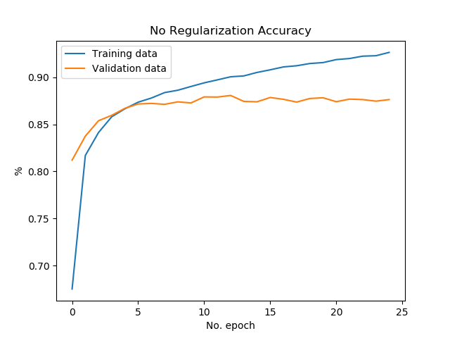](https://www.machinecurve.com/wp-content/uploads/2020/01/no_a.png)
    
- [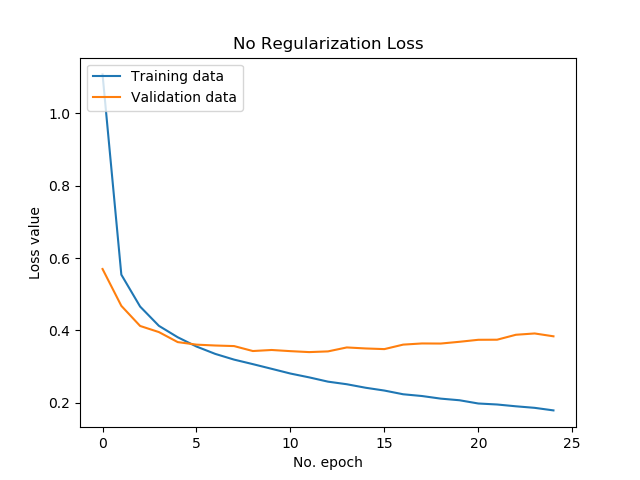](https://www.machinecurve.com/wp-content/uploads/2020/01/no_l.png)
    

### L1 Kernel/Bias regularization

- [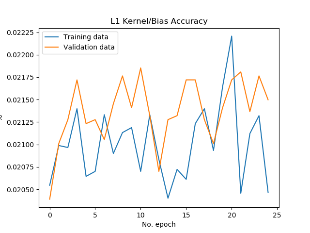](https://www.machinecurve.com/wp-content/uploads/2020/01/l1_kb_a.png)
    
- [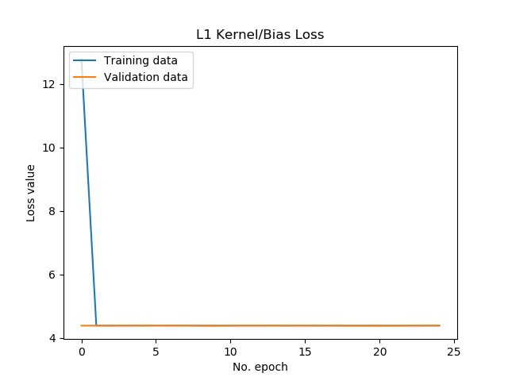](https://www.machinecurve.com/wp-content/uploads/2020/01/l1_kb.png)
    

### L1 Activity regularization

- [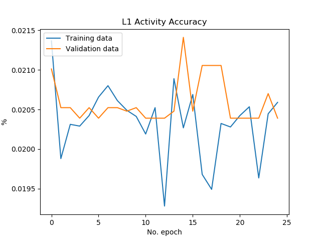](https://www.machinecurve.com/wp-content/uploads/2020/01/l1_a_a.png)
    
- [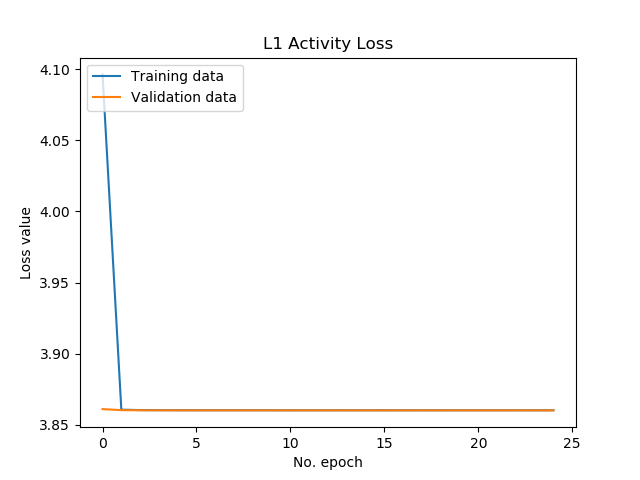](https://www.machinecurve.com/wp-content/uploads/2020/01/l1_a.png)
    

### L2 Kernel/Bias regularization

- [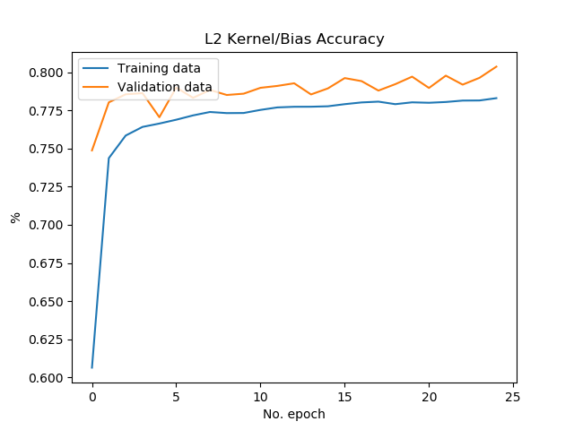](https://www.machinecurve.com/wp-content/uploads/2020/01/l2_a.png)
    
- [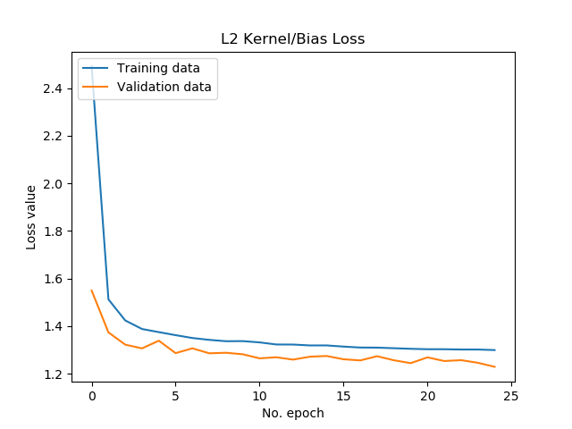](https://www.machinecurve.com/wp-content/uploads/2020/01/l2_kb.png)
    

### L2 Activity regularization

- [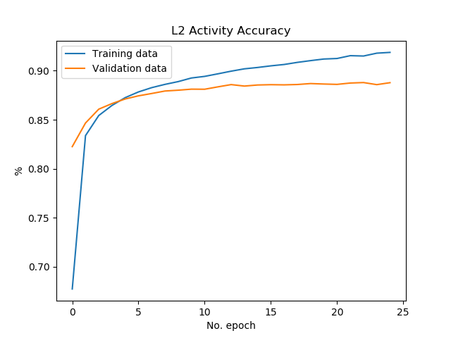](https://www.machinecurve.com/wp-content/uploads/2020/01/l2_a_a.png)
    
- [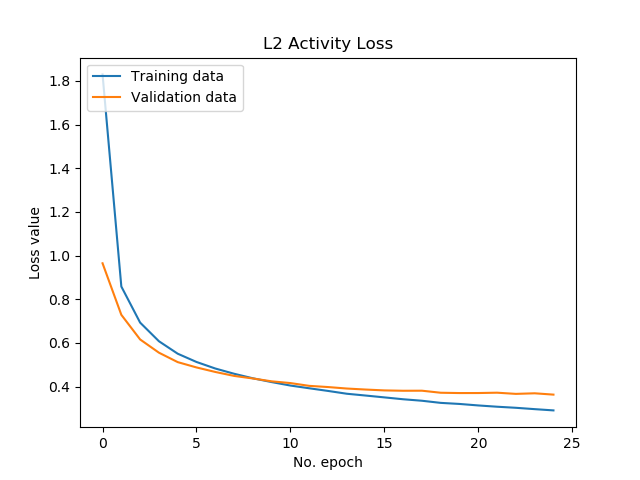](https://www.machinecurve.com/wp-content/uploads/2020/01/l2_a_l.png)
    

### Extended L2 Activity regularization

Here, \[latex\]\\lambda = 0.10\[/latex\], to find out whether the increased impact of the regularizer improves the model.

- [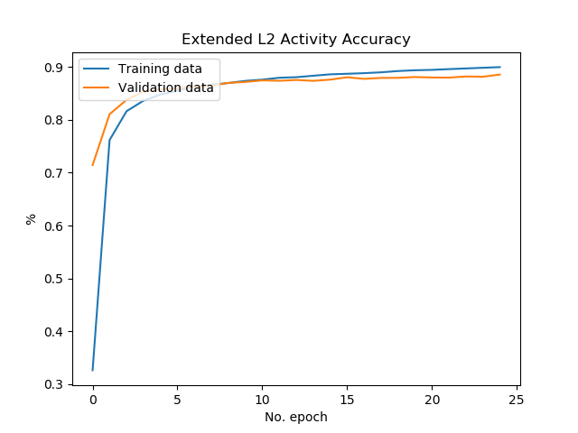](https://www.machinecurve.com/wp-content/uploads/2020/01/extended_a.png)
    
- [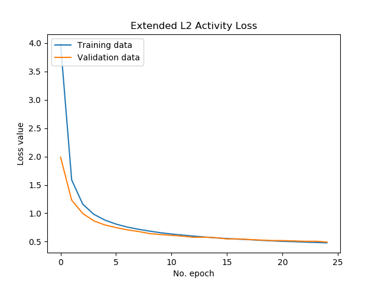](https://www.machinecurve.com/wp-content/uploads/2020/01/extended_l.png)
    

### Elastic Net Kernel/Bias regularization

- [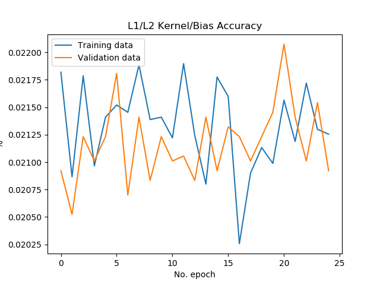](https://www.machinecurve.com/wp-content/uploads/2020/01/l1l2_a.png)
    
- [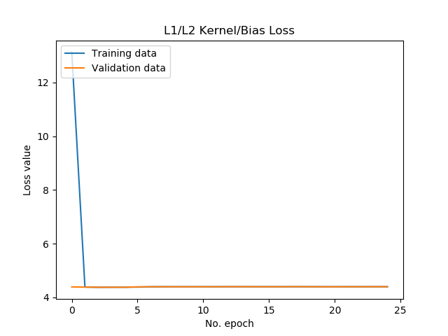](https://www.machinecurve.com/wp-content/uploads/2020/01/l1l2_l.png)
    

### Elastic Net Activity regularization

- [](https://www.machinecurve.com/wp-content/uploads/2020/01/l1_l2_a_a.png)
    
- [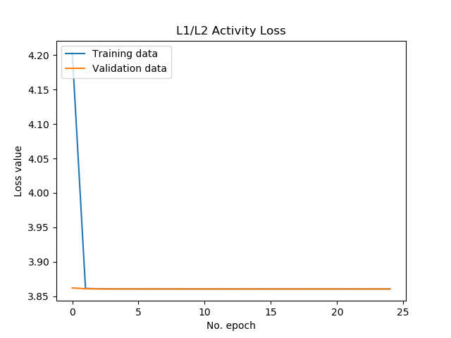](https://www.machinecurve.com/wp-content/uploads/2020/01/l1_l2_a.png)
    

* * *

## Summary

In this blog post, you've seen examples of how to implement L1, L2 and Elastic Net Regularizers with Keras. We saw that various Keras layer types support the regularizers, and that they can be applied at the level of kernels and biases, but also at the level of layer activations. This all was preceded by a recap on the concept of a regularizer, and why we need them in the first place.

By doing so, I hope that I've provided a blog post which helps you to create regularized Keras models. Please let me know if it was useful by leaving a comment in the comments box below 😊👇 Please do the same if you have questions or remarks, or when you spot a mistake, so that I can improve the blog post.

Thank you for reading MachineCurve today and happy engineering! 😎

\[kerasbox\]

* * *

## References

Zou, H., & Hastie, T. (2005). Regularization and variable selection via the elastic net. _Journal of the royal statistical society: series B (statistical methodology)_, _67_(2), 301-320.

MachineCurve. (2020, January 21). What are L1, L2 and Elastic Net Regularization in neural networks? Retrieved from [https://www.machinecurve.com/index.php/2020/01/21/what-are-l1-l2-and-elastic-net-regularization-in-neural-networks](https://www.machinecurve.com/index.php/2020/01/21/what-are-l1-l2-and-elastic-net-regularization-in-neural-networks)

TensorFlow. (2021). _Module: Tf.keras.regularizers_. [https://www.tensorflow.org/api\_docs/python/tf/keras/regularizers](https://www.tensorflow.org/api_docs/python/tf/keras/regularizers)

Tonutti, M. (2017). Keras: Difference between Kernel and Activity regularizers. Retrieved from [https://stackoverflow.com/questions/44495698/keras-difference-between-kernel-and-activity-regularizers](https://stackoverflow.com/questions/44495698/keras-difference-between-kernel-and-activity-regularizers)

Bäuerle, A., & Ropinski, T. (2019). [Net2Vis: Transforming Deep Convolutional Networks into Publication-Ready Visualizations](https://arxiv.org/abs/1902.04394). arXiv preprint arXiv:1902.04394.

Google Developers. (n.d.). Regularization for Simplicity: Lambda. Retrieved from [https://developers.google.com/machine-learning/crash-course/regularization-for-simplicity/lambda](https://developers.google.com/machine-learning/crash-course/regularization-for-simplicity/lambda)
