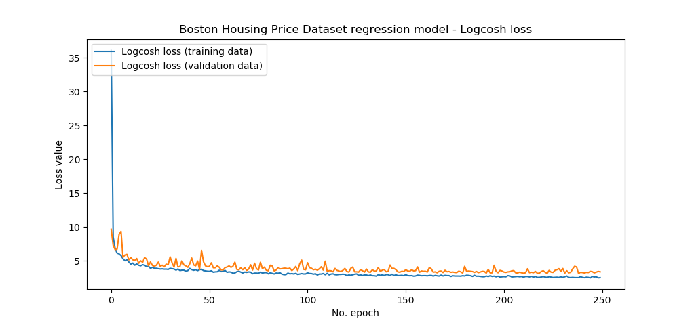
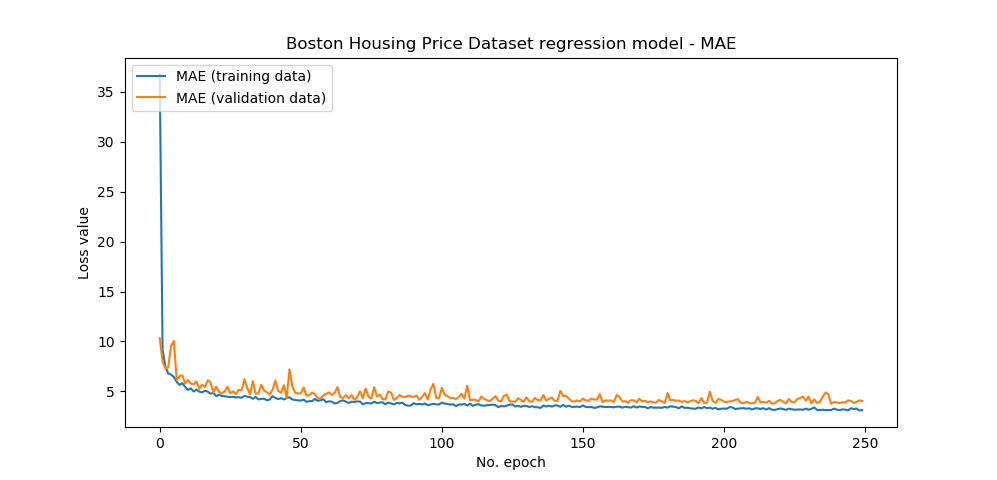

There are two main branches in the domain of supervised machine learning problems: _classification_ and _regression_. While you assign a sample to a fixed set of groups with classification, you're doing something very different when regressing. In fact, your regression model estimates a numeric value for the sample, such as the predicted oxygen levels given certain input values (such as the number of people currently in the room).

In order to [train your machine learning model](https://www.machinecurve.com/index.php/2019/10/04/about-loss-and-loss-functions/#the-high-level-supervised-learning-process), you need to optimize it. That is, the model will adapt itself iteratively, based on the inputs on the left (which you feed through the model) and [a loss function on the right](https://www.machinecurve.com/index.php/2019/10/04/about-loss-and-loss-functions/#loss-functions), which computes how much off the model performs to the actual targets.

For regression problems, there is a wide array of very known loss functions that can be used. MAE, MSE, RMSE, MAPE - they're all usable in such problems, but all have their drawbacks. MAE, for example, is too soft when the average error is small; MSE, on the other hand, lets the computed error explode when you have outliers in your dataset, substantially distorting the computed error.

Another loss function which attempts to combine best of both worlds is the **Logcosh loss function**. It works like the MSE, but is smoothed towards large errors (presumably caused by outliers) so that the final error score isn't impacted thoroughly.

In this blog post, we will first introduce the Logcosh loss intuitively. We do so by providing the maths, the function plot, and an intuitive explanation as to what happens under the hood.

Subsequently, we provide an implementation of a regression model with Keras that makes use of Logcosh loss. Beyond creating the model, we will also run it, discuss model performance, and summarize our observations so that you can make a proper choice about the loss function to use.

_Note that the full code for the models we create in this blog post is also available through my [Keras Loss Functions repository](https://github.com/christianversloot/keras-loss-functions) on GitHub._

**After reading this article, you will understand...**

- How Logcosh loss works.
- Why Logcosh loss can work better than MSE.
- How to implement Logcosh loss with TensorFlow 2

**If you wish to understand loss functions in more detail...**

- [All our blogs about loss functions, some with Keras implementations.](https://www.machinecurve.com/index.php/tag/loss-function/)

**Updates:**

- 01/Mar/2021: updated code examples to reflect TensorFlow 2, ensuring that the code can be used with the recent major TensorFlow version. Also made some textual and structural improvements to the article.

* * *

\[toc\]

* * *

## Code example: Logcosh with TensorFlow 2 based Keras

Logcosh loss can be configured in the model compilation step, i.e. in `model.compile`. In this code example, you can easily find how Logcosh loss is used within TensorFlow. Make sure to read the rest of the article to understand the loss function and its use in more detail.

```
# Configure the model and start training
model.compile(loss='logcosh', optimizer='adam', metrics=['mean_absolute_error'])
history = model.fit(x_train, y_train, epochs=250, batch_size=1, verbose=1, validation_split=0.2)
```

* * *

## Intro: Logcosh loss

Let's first cover Logcosh loss intuitively.

“Log-cosh is the logarithm of the hyperbolic cosine of the prediction error.” (Grover, 2019). Oops, that's not intuitive but nevertheless quite important - this is **the maths behind Logcosh loss:**


Don't be scared by the maths though, because we'll discuss Logcosh by means of its visualization - which is this one:

[](https://www.machinecurve.com/wp-content/uploads/2019/10/logcosh.jpeg)

As you can see, Logcosh loss for some target value (in this case, target = 0), is zero at the target value, and increases when the predicted value is further away from the target value.

The [TensorFlow docs](https://www.tensorflow.org/api_docs/python/tf/keras/losses/logcosh) write this about Logcosh loss:

> `log(cosh(x))` is approximately equal to `(x ** 2) / 2` for small `x` and to `abs(x) - log(2)` for large `x`. This means that 'logcosh' works mostly like the mean squared error, but will not be so strongly affected by the occasional wildly incorrect prediction.
> 
> Source: [TensorFlow docs](https://www.tensorflow.org/api_docs/python/tf/keras/losses/logcosh), taken from [About loss and loss functions](https://www.machinecurve.com/index.php/2019/10/04/about-loss-and-loss-functions/#logcosh)

It is therefore something like the MSE when you're training a regression model, but then with a degree of built-in protection against "wildly incorrect predictions" that are likely caused by outlier samples.

This interesting property will be tested today, since we'll now start implementing our model with Keras :-)

* * *

## Today's dataset

But first, the dataset.

We will be using the **[Boston Housing Prices Regression](https://keras.io/datasets/#boston-housing-price-regression-dataset)** [dataset](https://keras.io/datasets/#boston-housing-price-regression-dataset), which is one of the datasets that is available in the Keras API by default. It allows us to focus on the Logcosh loss aspects of the implementation rather than importing and cleaning the data, and hence ease of use.

> The Boston house-price data of Harrison, D. and Rubinfeld, D.L. 'Hedonic prices and the demand for clean air', J. Environ. Economics & Management, vol.5, 81-102, 1978. Used in Belsley, Kuh & Welsch, 'Regression diagnostics ...', Wiley, 1980.
> 
> [StatLib Datasets Archive](http://lib.stat.cmu.edu/datasets/)

What does it look like?

Let's find out!

It contains these variables, according to the [StatLib website](http://lib.stat.cmu.edu/datasets/boston):

- **CRIM** per capita crime rate by town
- **ZN** proportion of residential land zoned for lots over 25,000 sq.ft.
- **INDUS** proportion of non-retail business acres per town
- **CHAS** Charles River dummy variable (= 1 if tract bounds river; 0 otherwise)
- **NOX** nitric oxides concentration (parts per 10 million)
- **RM** average number of rooms per dwelling
- **AGE** proportion of owner-occupied units built prior to 1940
- **DIS** weighted distances to five Boston employment centres
- **RAD** index of accessibility to radial highways
- **TAX** full-value property-tax rate per $10,000
- **PTRATIO** pupil-teacher ratio by town
- **B** 1000(Bk - 0.63)^2 where Bk is the proportion of blacks by town
- **LSTAT** % lower status of the population
- **MEDV** Median value of owner-occupied homes in $1000's

As you can see, the target value for the preditions is the **median home value in $1000s.** The dataset contains quite some other _feature vectors_, which tell us something about that particular house - such as the crime rate, industry (not retail!) around the house, air pollution, and so on. Together, it is assumed, these variables will be able to tell us something about the median value of the home.

When applying the same dataset with [Huber loss](https://www.machinecurve.com/index.php/2019/10/12/using-huber-loss-in-keras/), we found a mean absolute error of approximately $3.639. Not too bad, but not spot on either.

Let's now find out whether we can improve this score when applying Logcosh loss instead.

* * *

## Building the Keras model

For building the model, let's open up your file explorer, navigate to some folder (or perhaps, create one), and create a file called `logcosh-loss.py`.

We can now start coding. We do so by first inspecting what we need in order to successfully run this model, i.e., our software dependencies. Subsequently, we will construct the model and discuss each step in detail.

### What you'll need to run the model

You will need to install these software dependencies if you wish to run the model on your machine:

- **Python**, for actually running the code. Ensure that you have Python 3.8+ installed.
- **TensorFlow 2** (any of the 2.x versions), which includes `tensorflow.keras` out of the box.
- **Numpy**, for number processing.
- **Matplotlib**, for visualization.

Preferably, you have these installed in an Anaconda environment, but this is not strictly necessary.

### Model imports

We start our code by means of writing down the software imports we need to actually run and support the model:

```
'''
  Keras model demonstrating Logcosh loss
'''
import tensorflow
from tensorflow.keras.datasets import boston_housing
from tensorflow.keras.models import Sequential
from tensorflow.keras.layers import Dense
import numpy as np
import matplotlib.pyplot as plt
```

Obviously, we'll need the `boston_housing` dataset which we can import from `tensorflow.keras.datasets`. When it's not already installed on your system, Keras will automatically download the dataset (from some S3 storage location) and put it in place so that your model can be trained. If it was installed before, it will be loaded from cache.

Additionally, we need the `Sequential` model, as we will use the Sequential API, using which we will stack multiple densely-connected or `Dense` layers.

Numpy is used for numbers processing and Matplotlib is used for visualization purposes (i.e., for [visualizing model performance across epochs](https://www.machinecurve.com/index.php/2019/10/08/how-to-visualize-the-training-process-in-keras/)).

### Loading and preparing the dataset

Next, we load and prepare the dataset, which is as easy as writing this:

```
# Load data
(x_train, y_train), (x_test, y_test) = boston_housing.load_data()

# Set the input shape
shape_dimension = len(x_train[0])
input_shape = (shape_dimension,)
print(f'Feature shape: {input_shape}')
```

Under 'load data', you effectively load the training and testing data from Keras, specifically `load_data()` on `boston_housing`, which you imported before. Simple as that.

Subsequently, you'll set the `input_shape` which describes the structure of one sample in your training and testing sets. In this case, a sample is one-dimensional, containing `len(x_train[0])` values, or the number of values in the array of your first feature vector - the 13 variables defined above.

### Creating the model architecture

Next, we specify the architecture of our model:

```
# Create the model
model = Sequential()
model.add(Dense(16, input_shape=input_shape, activation='relu', kernel_initializer='he_uniform'))
model.add(Dense(8, activation='relu', kernel_initializer='he_uniform'))
model.add(Dense(1, activation='linear'))
```

It's really simple - we're using the Sequential API, which allows us to stack the subsequent layers on top of each other. These layers are all densely-connected, or `Dense`, and have 16, 8 and 1 neuron(s), respectively. The hidden layers (the first two we're adding) use ReLU activation and He uniform init, [which is wise](https://www.machinecurve.com/index.php/2019/09/16/he-xavier-initialization-activation-functions-choose-wisely/). The first hidden layer specifies the input shape and hence the number of neurons in your initial layer. The final layer has one neuron (since only one value - the one being predicted with the regressed function - is output) and activates linearly, so that the predicted value is output.

### Model configuration & training

We next specify code for _hyperparameter tuning_ (or model configuration) and starting the actual training process (or, in Keras terms, _fitting the data to your model architecture_):

```
# Configure the model and start training
model.compile(loss='logcosh', optimizer='adam', metrics=['mean_absolute_error'])
history = model.fit(x_train, y_train, epochs=250, batch_size=1, verbose=1, validation_split=0.2)
```

Here, we specify various configuration options such as the loss value (Logcosh), the optimizer, additional metrics (we also use MAE so that we can compare with the [Huber loss](https://www.machinecurve.com/index.php/2019/10/12/using-huber-loss-in-keras/) variant), and so on. Fitting the data also requires us to specify certain options, such as the number of epochs, the batch size, and the validation split. We store the results of the training process in a `history` object so that we can visualize the model's performance.

### Model testing & performance visualization code

Next, we add code which evaluates the model against the _testing set_ to test whether it generalizes properly to data it has never seen before:

```
# Test the model after training
test_results = model.evaluate(x_test, y_test, verbose=1)
print(f'Test results - Loss: {test_results[0]} - MAE: {test_results[1]}')
```

Next, we visualize training history, for both the Logcosh loss value as the additional MAE metric:

```
# Plot history: Logcosh loss and MAE
plt.plot(history.history['loss'], label='Logcosh loss (training data)')
plt.plot(history.history['val_loss'], label='Logcosh loss (validation data)')
plt.title('Boston Housing Price Dataset regression model - Logcosh loss')
plt.ylabel('Loss value')
plt.xlabel('No. epoch')
plt.legend(loc="upper left")
plt.show()

plt.title('Boston Housing Price Dataset regression model - MAE')
plt.plot(history.history['mean_absolute_error'], label='MAE (training data)')
plt.plot(history.history['val_mean_absolute_error'], label='MAE (validation data)')
plt.ylabel('Loss value')
plt.xlabel('No. epoch')
plt.legend(loc="upper left")
plt.show()
```

* * *

## Whole model code

This concludes our implementation!

If you're interested in the model as a whole - here you go:

```
'''
  Keras model demonstrating Logcosh loss
'''
import tensorflow
from tensorflow.keras.datasets import boston_housing
from tensorflow.keras.models import Sequential
from tensorflow.keras.layers import Dense
import numpy as np
import matplotlib.pyplot as plt

# Load data
(x_train, y_train), (x_test, y_test) = boston_housing.load_data()

# Set the input shape
shape_dimension = len(x_train[0])
input_shape = (shape_dimension,)
print(f'Feature shape: {input_shape}')

# Create the model
model = Sequential()
model.add(Dense(16, input_shape=input_shape, activation='relu', kernel_initializer='he_uniform'))
model.add(Dense(8, activation='relu', kernel_initializer='he_uniform'))
model.add(Dense(1, activation='linear'))

# Configure the model and start training
model.compile(loss='logcosh', optimizer='adam', metrics=['mean_absolute_error'])
history = model.fit(x_train, y_train, epochs=250, batch_size=1, verbose=1, validation_split=0.2)

# Test the model after training
test_results = model.evaluate(x_test, y_test, verbose=1)
print(f'Test results - Loss: {test_results[0]} - MAE: {test_results[1]}')

# Plot history: Logcosh loss and MAE
plt.plot(history.history['loss'], label='Logcosh loss (training data)')
plt.plot(history.history['val_loss'], label='Logcosh loss (validation data)')
plt.title('Boston Housing Price Dataset regression model - Logcosh loss')
plt.ylabel('Loss value')
plt.xlabel('No. epoch')
plt.legend(loc="upper left")
plt.show()

plt.title('Boston Housing Price Dataset regression model - MAE')
plt.plot(history.history['mean_absolute_error'], label='MAE (training data)')
plt.plot(history.history['val_mean_absolute_error'], label='MAE (validation data)')
plt.ylabel('Loss value')
plt.xlabel('No. epoch')
plt.legend(loc="upper left")
plt.show()
```

* * *

## Model performance

Now, we can proceed with the actual training process. Open up a terminal, such as the Anaconda prompt or a regular `cmd`, `cd` to the folder where your Python file is located, and execute `python logcosh-loss.py`. The training process should then start and eventually stop after 250 epochs (or iterations), with a test MAE of approximately $3.5k.

```
Epoch 250/250
323/323 [==============================] - 1s 4ms/step - loss: 2.5377 - mean_absolute_error: 3.1209 - val_loss: 3.4016 - val_mean_absolute_error: 4.0356
102/102 [==============================] - 0s 127us/step
Test results - Loss: 2.8869358511532055 - MAE: 3.4803783893585205
```

This means that the model performed better than when using Huber loss!

We cannot say this with statistical significance, obviously, since for the two groups n = 1 and no actual test is used, but the result is somewhat promising. We cannot say this for sure either, but perhaps the slight improvement is caused by the fact that Logcosh loss is less sensitive to outliers -- but this can be tested only by running the training process time after time, applying statistical tests and more detailed scrutiny of the predictions themselves.

Two nice plots are generated as well which see how the model improves - at large at first, but more slowly towards the end; just as it should be.

[](https://www.machinecurve.com/wp-content/uploads/2019/10/logcosh_loss.png)

[](https://www.machinecurve.com/wp-content/uploads/2019/10/logcosh_mae.png)

* * *

## Summary

In this blog post, we've seen how to implement Logcosh loss with Keras, the deep learning framework for Python. We provided an actual implementation that we discussed in detail, and an intuitive explanation of Logcosh loss and its benefits compared to e.g. MSE. I hope you've learnt something new today 😊 and would appreciate your comment below 👇 Thanks and happy engineering! 👋

_Note that the full code for the models we created in this blog post is also available through my [Keras Loss Functions repository](https://github.com/christianversloot/keras-loss-functions) on GitHub._

* * *

## References

About loss and loss functions – MachineCurve. (2019, October 15). Retrieved from [https://www.machinecurve.com/index.php/2019/10/04/about-loss-and-loss-functions/](https://www.machinecurve.com/index.php/2019/10/04/about-loss-and-loss-functions/)

Grover, P. (2019, September 25). 5 Regression Loss Functions All Machine Learners Should Know. Retrieved from [https://heartbeat.fritz.ai/5-regression-loss-functions-all-machine-learners-should-know-4fb140e9d4b0](https://heartbeat.fritz.ai/5-regression-loss-functions-all-machine-learners-should-know-4fb140e9d4b0)

Carnegie Mellon University StatLib. (n.d.). Boston house-price data. Retrieved from [http://lib.stat.cmu.edu/datasets/boston](http://lib.stat.cmu.edu/datasets/boston)
