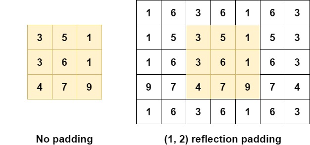
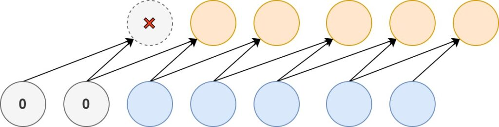

Sometimes, you don't want the shape of your convolutional outputs to reduce in size. Other times, you wish to append zeroes to the inputs of your Conv1D layers. Padding - same/zero padding and causal padding - can help here. This blog post illustrates how, by providing example code for the Keras framework.

However, before we do so, we firstly recap on the concept of padding. What is it, again? And why do we need it? This is followed by the Python examples.

Are you ready? Let's go! 😎

* * *

\[toc\]

* * *

## Recap: what is padding?

Convolutional layers induce spatial hierarchy. That is, generally speaking, they reduce the size of your input data for every layer the data passes through - allowing neural networks to learn both very _specific_ and very _abstract_ aspects of your input data.

However, sometimes you don't want this to happen: you want the size of your input data to stay the same. In that case, padding can help by adding [zeros, constants or different numbers around the reduced input](https://www.machinecurve.com/index.php/2020/02/07/what-is-padding-in-a-neural-network/). This way, the size of your input data remains the same.

[](https://www.machinecurve.com/wp-content/uploads/2020/02/reflection_pad.jpg)

[Reflection padding](https://www.machinecurve.com/index.php/2020/02/07/what-is-padding-in-a-neural-network/#reflection-padding) can be used for this purpose.

In a different scenario, you have one dimensional data representing a time series. Two values in your _feature data_ causally determine a _target_, i.e., together they produce the outcome. However, if you train a `Conv1D` model with both the _inputs_ and the _targets_, effectively, the target will "predate" the input data. As this is weird, [causal padding](https://www.machinecurve.com/index.php/2020/02/07/what-is-padding-in-a-neural-network/#causal-padding) can be applied in order to add zeroes to your input data, as you can see here:



* * *

## Types of padding supported by Keras

Make sure to take a look at our blog post ["What is padding in a neural network?"](https://www.machinecurve.com/index.php/2020/02/07/what-is-padding-in-a-neural-network/) in order to understand padding and the different types in more detail. In this blog post, we'll take a look at _implementations_ - using the Keras framework, to be precise. This framework, which today works with TensorFlow 2.0, allows you to apply padding to your convolutional neural network.

However, not all types of padding from the blog post linked above are supported. Keras supports these types of padding:

- Valid padding, a.k.a. no padding;
- Same padding, a.k.a. zero padding;
- Causal padding.

In this blog post, we'll look at each of them from a Keras point of view. That is, we don't explain them thoroughly (this is the purpose of the blog post linked above), but rather provide actual code! 👩‍💻 This way, you should be able to build ConvNets with these types of padding yourself.

Now, let's open your code editor and go! 😎

* * *

## How to use Valid Padding with Keras?

Building a model with Keras often consists of three steps:

- Instantiating the model, e.g. with the Sequential API;
- Stacking the layers on top of each other;
- Compiling the model.

Once these have been completed, data can be fit to the model, after which the training process starts :)

As you likely understand by now, **applying valid padding** happens during the model building phase. More precisely, it happens during the _stacking_ phase, where you add the individual layers to the model that has been constructed so far.

So, for example, a simple model with three convolutional layers using the Keras Sequential API always starts with the `Sequential` instantiation:

```
# Create the model
model = Sequential()
```

### Adding the Conv layers

Subsequently, the three `Conv` layers can be added. In our case, they are two-dimensional ones, as our ConvNet was used for image classification. Do note that at two layers `padding='valid'` is specified, whereas it is omitted in the second layer. This is for a reason - as you'll see towards the end of this section!

The value for `input_shape = (28, 28, 1)`.

```
model.add(Conv2D(32, kernel_size=(3, 3), activation='relu', input_shape=input_shape, padding='valid'))
model.add(Conv2D(64, kernel_size=(3, 3), activation='relu'))
model.add(Conv2D(128, kernel_size=(3, 3), activation='relu', padding='valid'))
```

Next, we can add a `Flatten` layer - which flattens the multidimensional outputs of the last `Conv2D` layer into one-dimensional format - and two `Dense` layers, [which generate a multiclass probability distribution using Softmax](https://www.machinecurve.com/index.php/2020/01/08/how-does-the-softmax-activation-function-work/). This is perfect for classification 😎

```
model.add(Flatten())
model.add(Dense(256, activation='relu'))
model.add(Dense(no_classes, activation='softmax'))
```

### Full model code

The full stack of layers:

```
# Create the model
model = Sequential()
model.add(Conv2D(32, kernel_size=(3, 3), activation='relu', input_shape=input_shape, padding='valid'))
model.add(Conv2D(64, kernel_size=(3, 3), activation='relu'))
model.add(Conv2D(128, kernel_size=(3, 3), activation='relu', padding='valid'))
model.add(Flatten())
model.add(Dense(256, activation='relu'))
model.add(Dense(no_classes, activation='softmax'))
```

### Model summary and the effects of Valid Padding

Now, it's time to add `model.summary()` and run the Python code in your terminal. You should see a summary appear:

```
Model: "sequential_1"
_________________________________________________________________
Layer (type)                 Output Shape              Param #
=================================================================
conv2d_1 (Conv2D)            (None, 26, 26, 32)        320
_________________________________________________________________
conv2d_2 (Conv2D)            (None, 24, 24, 64)        18496
_________________________________________________________________
conv2d_3 (Conv2D)            (None, 22, 22, 128)       73856
_________________________________________________________________
flatten_1 (Flatten)          (None, 61952)             0
_________________________________________________________________
dense_1 (Dense)              (None, 256)               15859968
_________________________________________________________________
dense_2 (Dense)              (None, 10)                2570
=================================================================
Total params: 15,955,210
Trainable params: 15,955,210
Non-trainable params: 0
_________________________________________________________________
```

Analyzing the summary, the effect of valid padding is clear - and it is also clear why it equals "no padding". That is, unsurprisingly, **no padding is applied when using valid padding**.

For each layer, clearly, the feature map dimensions (i.e. width and height) are reduced, from 28x28 to 22x22 pixels directly before the `Flatten` layer. Just as convolutional layers should work when no padding is applied! :)

For this reason, we told you that we omitted the value for `padding` on the second layer on purpose. It was to show you that it doesn't matter whether you apply it or not - in both cases, feature map dimensions get reduced.

Let's now take a look at "same" or "zero" padding - which _doesn't reduce the feature maps in size._

* * *

## How to use Same / Zero Padding with Keras?

Models that have same or zero padding are not too different from the ones using valid padding. Equally to those, such models - when using the `Sequential` API - are initialized first:

```
# Create the model
model = Sequential()
```

After which the `Conv` layers are added. In our case, they are `Conv2D` again, with 'same' as the value for `padding` for all three layers:

```
model.add(Conv2D(32, kernel_size=(3, 3), activation='relu', input_shape=input_shape, padding='same'))
model.add(Conv2D(64, kernel_size=(3, 3), activation='relu', padding='same'))
model.add(Conv2D(128, kernel_size=(3, 3), activation='relu', padding='same'))
```

Then, like the "valid" padding scenario, we add a Flatten layer and two Dense ones, ending with a Softmax activated output:

```
model.add(Flatten())
model.add(Dense(256, activation='relu'))
model.add(Dense(no_classes, activation='softmax'))
```

Now, we've got our model :)

### Full model code

Here too, you can obtain the full model code at once if you wish:

```
# Create the model
model = Sequential()
model.add(Conv2D(32, kernel_size=(3, 3), activation='relu', input_shape=input_shape, padding='same'))
model.add(Conv2D(64, kernel_size=(3, 3), activation='relu', padding='same'))
model.add(Conv2D(128, kernel_size=(3, 3), activation='relu', padding='same'))
model.add(Flatten())
model.add(Dense(256, activation='relu'))
model.add(Dense(no_classes, activation='softmax'))
```

### Model summary and the effects of Valid Padding

What if we run `model.summary()` here?

This would be the output:

```
Model: "sequential_1"
_________________________________________________________________
Layer (type)                 Output Shape              Param #
=================================================================
conv2d_1 (Conv2D)            (None, 28, 28, 32)        320
_________________________________________________________________
conv2d_2 (Conv2D)            (None, 28, 28, 64)        18496
_________________________________________________________________
conv2d_3 (Conv2D)            (None, 28, 28, 128)       73856
_________________________________________________________________
flatten_1 (Flatten)          (None, 100352)            0
_________________________________________________________________
dense_1 (Dense)              (None, 256)               25690368
_________________________________________________________________
dense_2 (Dense)              (None, 10)                2570
=================================================================
Total params: 25,785,610
Trainable params: 25,785,610
Non-trainable params: 0
_________________________________________________________________
```

Indeed, as we can now observe, the _shape_ of our feature maps has stayed the same - 28x28 pixels! :)

* * *

## How to use Causal Padding with Keras?

Applying causal padding is simple: just apply `causal` to your `Conv1D` model to pad zeroes to the front of your inputs.

```
model.add(Conv1D(32, kernel_size=4, activation='relu', input_shape=input_shape, padding='causal'))
```

* * *

## Summary

In this blog post, we looked at how to implement padding with Keras. Firstly, we looked at what padding is at a high level - followed by example code for valid, same and causal padding.

I hope you've learnt something today! If you did, please leave a comment in the comments section below 😊 Please do the same if you have remarks or questions. I'll happily answer and improve my blog post where possible!

Thanks for reading MachineCurve today and happy engineering 😎

\[kerasbox\]

* * *

## References

Keras. (n.d.). Convolutional Layers. Retrieved from [https://keras.io/layers/convolutional/](https://keras.io/layers/convolutional/)

TensorFlow. (n.d.). tf.keras.layers.ZeroPadding1D. Retrieved from [https://www.tensorflow.org/api\_docs/python/tf/keras/layers/ZeroPadding1D](https://www.tensorflow.org/api_docs/python/tf/keras/layers/ZeroPadding1D)

TensorFlow. (n.d.). tf.keras.layers.ZeroPadding2D. Retrieved from [https://www.tensorflow.org/api\_docs/python/tf/keras/layers/ZeroPadding2D](https://www.tensorflow.org/api_docs/python/tf/keras/layers/ZeroPadding2D)

TensorFlow. (n.d.). tf.keras.layers.ZeroPadding3D. Retrieved from [https://www.tensorflow.org/api\_docs/python/tf/keras/layers/ZeroPadding3D](https://www.tensorflow.org/api_docs/python/tf/keras/layers/ZeroPadding3D)
