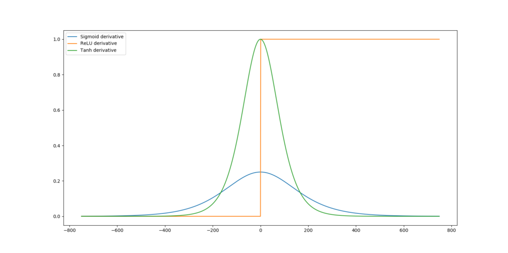
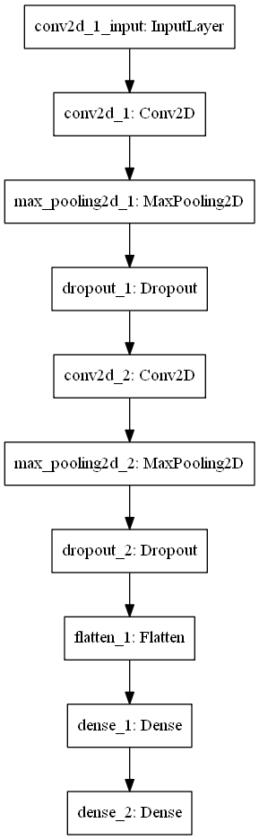
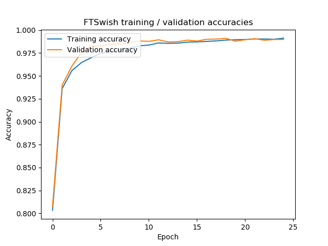
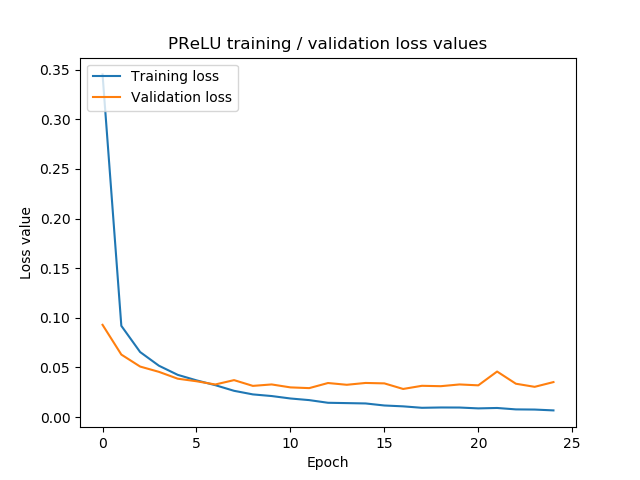
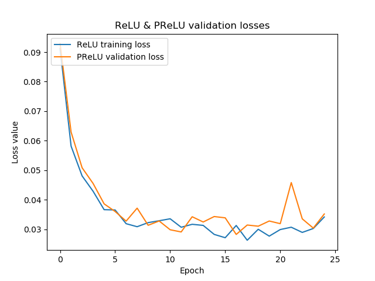
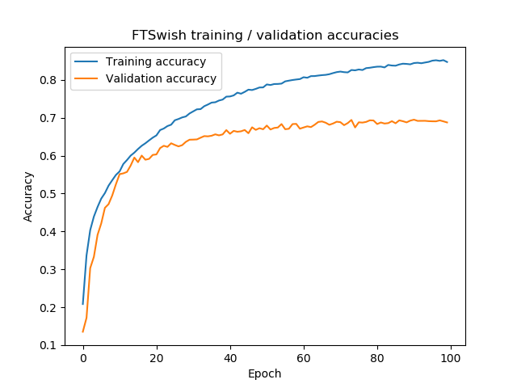
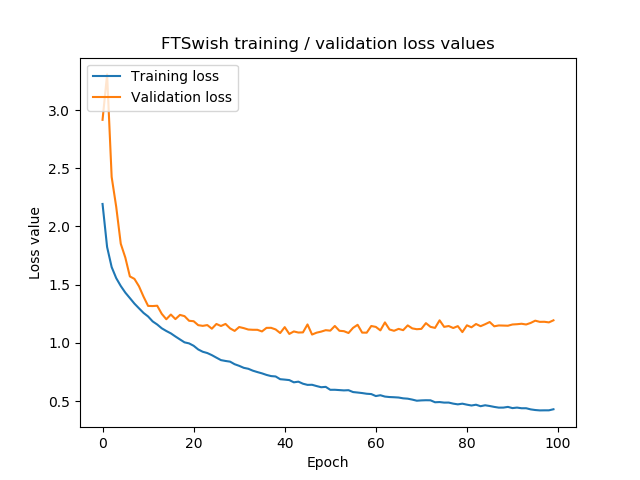
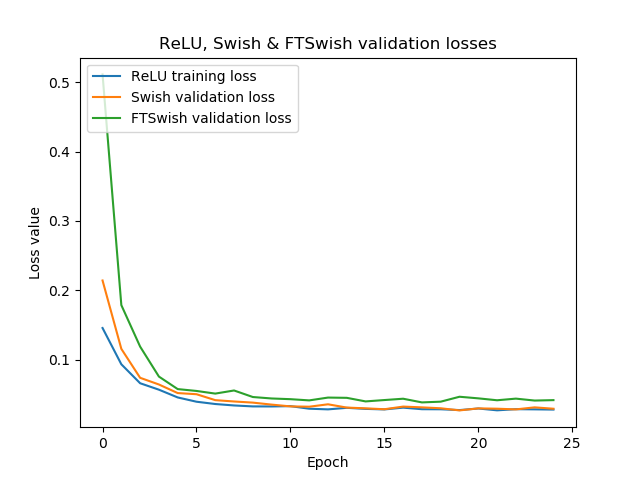

Rectified Linear Unit, or [ReLU](https://www.machinecurve.com/index.php/2019/09/04/relu-sigmoid-and-tanh-todays-most-used-activation-functions/), is considered to be the standard activation function of choice for today's neural networks. Even though time has passed since its introduction and many new activation functions have been introduced, ReLU is still recommended everywhere.

The reason for this is twofold: first, it is a very simple activation function. As such, it is computationally inexpensive than others (such as [Sigmoid and Tanh](https://www.machinecurve.com/index.php/2019/09/04/relu-sigmoid-and-tanh-todays-most-used-activation-functions/)), which means that fewer computational resources are required for training your model. Second, it is highly generalizable. That is, it's difficult to use activation functions in practice if they work well on _some data_, while poorly on other data. If their performance is relatively independent of the dataset, they're good.

And ReLU has both.

However, it also has problems - or, rather, challenges. While it does not suffer from the [vanishing gradients problem](https://www.machinecurve.com/index.php/2019/08/30/random-initialization-vanishing-and-exploding-gradients/), it does suffer from [dying neurons](https://www.machinecurve.com/index.php/2019/10/15/leaky-relu-improving-traditional-relu/) instead. For this reason, various new activation functions have been proposed in the past. **Parametric Rectified Linear Unit**, or PReLU, is one of them, and we will cover it in this blog (He et al., 2015).

First, we'll provide a recap on ReLU: why is it so useful for many neural networks? What are the challenges we just introduced, and why is PReLU different? Subsequently, we'll give an example implementation for PReLU for your Keras based neural network. This includes a comparison with standard ReLU, in our case with the MNIST dataset. This way, you can both understand _why_ PReLU may be useful, _and_ immediately use it in practice.

All right, let's go! 😎

\[toc\]

## Recap on ReLU: no vanishing gradients, but dying neurons instead

ReLU - such a nice activation function: it is highly usable, as it generalizes acceptably well to pretty much any machine learning problem. It's also really simple, as it's just a two-path decision given some input:

\\begin{equation} f(x) = \\begin{cases} 0, & \\text{if}\\ x < 0 \\\\ x, & \\text{otherwise} \\\\ \\end{cases} \\end{equation}

The output equals the input for all positive inputs, and zero for all others.

This can be visualized as follows:

[](https://www.machinecurve.com/wp-content/uploads/2019/05/relu.png)

### No vanishing gradients

During [optimization](https://www.machinecurve.com/index.php/2019/11/03/extensions-to-gradient-descent-from-momentum-to-adabound/), the neural network optimizer uses the gradient (computed with backpropagation) in order to find its path towards better weights.

With traditional activation functions, such as the Sigmoid function, this gradient - which can be computed by letting the input pass through the first-order derivative of the original function - gets a lot smaller:

[](https://www.machinecurve.com/wp-content/uploads/2019/11/sigmoid_deriv.png)

In fact, the maximum output for any input is \[latex\]\\approx 0.25\[/latex\], while in most cases it is even smaller.

A gradient is always generated with respect to the error generated based on the predictions at the model's tail. For upstream layers, this means that _all the gradients of the layers in between layer X and the error must be included_. In mathematical terms, this means that they are chained - multiplied - by the backpropagation algorithm, for finding the gradient at some layer. This is exactly the problem: when the gradients are 0.25 at max, chaining four gradients results in a 0.25^4 = 0.00390625 gradient at max.

You've just found out about the **[vanishing gradients problem](https://www.machinecurve.com/index.php/2019/08/30/random-initialization-vanishing-and-exploding-gradients/)**. For upstream layers, gradients vanish when the wrong activation function is used. With relatively shallow networks, this was not much of a problem, but learning gets severely impaired when your neural network gets deep - and they do these days. Upstream layers simply learn very slowly - or might no longer converge at all!

Fortunately, ReLU does not suffer from this problem, as can be seen when its gradients are visualized:

[](https://www.machinecurve.com/wp-content/uploads/2019/05/derivatives.png)

The gradient is either _zero_ or _one_. No more vanishing gradients! 😁

### The 'dying ReLU' problem

...but I'm sorry to spoil the fun here 😐

Can you imagine what happens when the input at some layer is \[latex\]\\leq 0\[/latex\]?

Indeed, the gradient for that layer is zero - **and so are all the gradients for the upstream layers, as the zero is included in the chain from error to layer gradient**.

Welcome to the _dying ReLU problem_.

When your data is not normalized properly or when you use a wrong [weight initialization](https://www.machinecurve.com/index.php/2019/09/16/he-xavier-initialization-activation-functions-choose-wisely/) strategy, it may be that large parts of your neural network will find gradients of **zero** during optimization. This simply means that they can no longer participate in learning.

The effect: your model does learn very slowly or, once again, does not converge at all. Indeed, that's an entire waste of resources.

Consequently, ReLU is not problem-free either.

## What is PReLU?

Kaiming He and others, in one of the landmark papers of machine learning research, recognized this problem and set out to find a solution (He et al., 2015). They started with a couple of facts:

- Tremendous improvements in recognition performance have been reported for computer vision models in the years prior to the paper.
- One of the primary drivers of these improvements is the ReLU activation function, which is a significant improvement over traditional Sigmoid and Tanh.
- Nevertheless, ReLU is not problem-free.
- One attempt to fix this problem - with [Leaky ReLU](https://www.machinecurve.com/index.php/2019/11/12/using-leaky-relu-with-keras/) - is not sufficient: while it indeed resolves the _dying ReLU problem_ by setting the inputs \[latex\]<= 0\[/latex\] to very small but nonzero values, empirical testing hasn't resulted in significant performance improvements.

The authors argue that this might occur because the \[latex\]\\alpha\[/latex\] parameter, which configures the steepness of the nonzero negative outputs, must be set by the user before starting the training process.

Why, they argued, can't this parameter be learnt during training? And, even better, why - for every neuron - can't we learn \[latex\]\\alpha\[/latex\] _per input element_, instead of a global alpha for all the input dimensions?

This is what **Parametric Rectified Linear Unit** or **PReLU** is all about. Being a generalization of Leaky ReLU, the alpha value need no longer to be configured by the user, but is learnt during training instead. It is therefore entirely dependent on the data, and not on the engineer's guess, and hence it is estimated that this variant of ReLU both avoids the dying ReLU problem and shows performance improvements.

### How PReLU works

PReLU is actually not so different from [traditional ReLU](https://www.machinecurve.com/index.php/2019/09/04/relu-sigmoid-and-tanh-todays-most-used-activation-functions/):

\\begin{equation} f(x\_i) = \\begin{cases} x\_i, & \\text{if}\\ x\_i > 0 \\\\ \\alpha\_ix\_i, & \\text{otherwise} \\\\ \\end{cases} \\end{equation}

Note that \[latex\]x\_i\[/latex\] is just one feature from the feature vector \[latex\]\\textbf{x}\[/latex\]. As the authors argue: "\[t\]he subscript _i_ in \[latex\]\\alpha\_i\[/latex\] indicates that we allow the nonlinear activation to vary on different channels" (He et al., 2015). This is called **channel-wise** PReLU and is the default setting. If you choose to learn the same \[latex\]\\alpha\[/latex\] for all features, you use what is known as **channel-shared** PReLU (He et al., 2015).

This brings us to the following insights:

- When all \[latex\]a\_i\[/latex\] values (or the global alpha, if channel-shared PReLU is used) are learnt to **zeros**, PReLU effectively behaves like traditional ReLU.
- When they are learnt to _small values_, you effectively have Leaky ReLU (see the image below for an example).
- In any other case, you benefit from the generalization: you don't have traditional ReLU nor Leaky ReLU, but have a variant that is better suited to your input data.

[](https://www.machinecurve.com/wp-content/uploads/2019/10/leaky_relu.png)

Learning the values for \[latex\]\\alpha\[/latex\] takes place by adding a few extra parameters to the network. In computational terms, the effects on resource requirements are negligible, and especially so in the channel-shared variant (meaning that only one parameter needs to be added). Traditional backpropagation is used for computing the alpha gradients, and optimization is performed with [momentum gradient descent](https://www.machinecurve.com/index.php/2019/11/03/extensions-to-gradient-descent-from-momentum-to-adabound/#momentum) (He et al., 2015). In Keras, that would be the optimizer of your choice instead, I'd guess.

As with any set of weights, the \[latex\]\\alpha\[/latex\] values must be initialized when the training process commences. The weight initialization strategy used by the authors is to initialize all \[latex\]\\alpha\[/latex\]s to 0.25. Backprop and the optimizer will then take over.

### Empirical performance tests by the authors

The authors performed various experiments with a deep model, using various datasets (He et al., 2015), but primarily this one:

- Baseline: using traditional ReLU, trained on ImageNet 2012.
- Comparison: using PReLU, trained on ImageNet 2012.

**Result:** 1.2% gain in error rate, which is a significant reduction. The channel-wise strategy performs better than the channel-shared strategy, and is therefore preferred.

Many other tests were performed, where PReLU continously outperformed ReLU.

I've become curious now - since these tests were performed with deep models. For those, due to the nature of the dying ReLU problem, and the vanishing gradients problem in the case of Leaky ReLU, the sensitivity to such problems is quite large. But for more shallow models, like very simple neural nets, I consistenly see that the differences between traditional ReLU and these variants of ReLU are low. Will we see any differences when we train a simple Keras model with PReLU and ReLU, using the same dataset - the MNIST dataset - as well as the architecture?

Let's find out. 😁

## Implementing PReLU in your Keras models

### What you'll need to run the model

As with many of the tutorials at MachineCurve, you'll need to install a set of dependencies if you wish to run the model we're creating today:

- As usual, you'll need **Python**, and preferably version 3.6+.
- You'll also need to install **Keras**, the deep learning framework we are using today.
- Similarly, you need to install one of the backends Keras runs on - and preferably **Tensorflow**, as it has deeply integrated with it recently.
- Finally, you'll need **Matplotlib** for generating some visualizations. This is not mandatory, but it's likely that you already have Matplotlib installed on your system, so it shouldn't be too much of an issue.

### Inspecting the Keras API for PReLU

When taking a look at the Keras API for PReLU, we see this:

```
keras.layers.PReLU(alpha_initializer='zeros', alpha_regularizer=None, alpha_constraint=None, shared_axes=None)
```

As you can see, the PReLU layer comes with an initializer, regularizer and constraint possibility, as well as something called `shared_axes`:

- With the **initializer**, or `alpha_initializer`, you define how the \[latex\]\\alpha\[/latex\] weights are initialized. You can use any of the [Keras initializers](https://keras.io/initializers/) for this purpose - and even define your own one. He et al. (2015) use \[latex\]\\alpha = 0.25\[/latex\].
- With the **regularizer**, or `alpha_regularizer`, it's possible to _regulate_ weight swings by applying penalties to outliers. You can use any of the [Keras regularizers](https://keras.io/regularizers/) for this purpose. He et al. (2015) do not use a regularizer, as they argue that some of them - especially L2 regularization - "tends to push \[alphas\] to zero, and thus biases PReLU towards ReLU". Combined L1 and L2 and/or L1, L2 regularization may also bias the activation function towards [Leaky ReLU](https://www.machinecurve.com/index.php/2019/11/12/using-leaky-relu-with-keras/) (Uthmān, 2017).
- With the **constraint**, or `alpha_constraint`, you can set fixed limits to the network parameters during training. You can use any of the [Keras constraints](https://keras.io/constraints/) for this purpose. He et al. (2015) do not use constraints to allow the activation function to be non-monotonic.
- With **shared\_axes**, you can share axes over space. This is useful when you wish to share axes over e.g. the filters present in ConvNets.

By default, only the `alpha_initializer` value is set, to zero initialization: it is set to `zeros`. On Keras' GitHub page, Arseny Kravchenko points out that this might be wrong, as He et al. (2015) initialize alpha to 0.25 (Kravchenko, n.d.). In fact, he argues, zero initialization may lead to worse performance. We'll take this into account when inspecting model performance on the MNIST dataset and run it twice: once with zeros init, once with 0.25 init.

### Today's model and dataset

Today, we'll be creating a simple [ConvNet](https://www.machinecurve.com/index.php/2018/12/07/convolutional-neural-networks-and-their-components-for-computer-vision/). We use two convolutional blocks with MaxPooling and Dropout, followed by two densely-connected layers. The architecture is visualized next:

[](https://www.machinecurve.com/wp-content/uploads/2019/12/model-1.png)

We'll be training our ConvNet so that it will become able to classify digits from the MNIST dataset. This dataset, which contains 28x28 pixels of handwritten digits, is quite extensive, yet simple enough to use in demonstrations & tutorials. It looks as follows:

[](https://www.machinecurve.com/wp-content/uploads/2019/07/mnist.png)

### Model code

It's time to write some code!

Open up your Explorer, navigate to some folder, and create a file, e.g. `model_prelu.py`. Now open up a code editor, open that file, and start coding 😀

#### Imports

First, we'll have to import the dependencies that we listed before:

```
import keras
from keras.datasets import mnist
from keras.models import Sequential
from keras.layers import Dense, Dropout, Flatten
from keras.layers import Conv2D, MaxPooling2D
from keras.initializers import Constant
from keras import backend as K
from keras.layers import PReLU
import matplotlib.pyplot as plt
```

#### Model configuration

Secondly, we'll add configuration parameters for the ConvNet and the training process. We use the ones we defined and elaborated on in our [tutorial on Keras CNNs](https://www.machinecurve.com/index.php/2019/09/17/how-to-create-a-cnn-classifier-with-keras/), so if you wish to understand the _whys_, I'd recommend you also read that blog post :)

```
# Model configuration
img_width, img_height = 28, 28
batch_size = 250
no_epochs = 25
no_classes = 10
validation_split = 0.2
verbosity = 1
leaky_relu_alpha = 0.1
```

#### Data import & preparation

Subsequently, we import the data and prepare it for training:

```
# Load MNIST dataset
(input_train, target_train), (input_test, target_test) = mnist.load_data()

# Reshape data based on channels first / channels last strategy.
# This is dependent on whether you use TF, Theano or CNTK as backend.
# Source: https://github.com/keras-team/keras/blob/master/examples/mnist_cnn.py
if K.image_data_format() == 'channels_first':
    input_train = input_train.reshape(input_train.shape[0], 1, img_width, img_height)
    input_test = input_test.reshape(input_test.shape[0], 1, img_width, img_height)
    input_shape = (1, img_width, img_height)
else:
    input_train = input_train.reshape(input_train.shape[0], img_width, img_height, 1)
    input_test = input_test.reshape(input_test.shape[0], img_width, img_height, 1)
    input_shape = (img_width, img_height, 1)

# Parse numbers as floats
input_train = input_train.astype('float32')
input_test = input_test.astype('float32')

# Normalize data [0, 1].
input_train = input_train / 255
input_test = input_test / 255

# Convert target vectors to categorical targets
target_train = keras.utils.to_categorical(target_train, no_classes)
target_test = keras.utils.to_categorical(target_test, no_classes)
```

- We simply load the MNIST data with `load_data`.
- Subsequently, we reshape the data based on whether the image strategy is channels first or channels last (this depends on the backend you are using).
- Subsequently, we parse the input data as floats, which reportedly speeds up the training process.
- Subsequently, we normalize the data into the \[0, 1\] range.
- Finally, we convert the integer target vectors into categorical format (i.e. true/false vector format) so that we can use [categorical crossentropy loss](https://www.machinecurve.com/index.php/2019/10/22/how-to-use-binary-categorical-crossentropy-with-keras/).

#### Defining model architecture

Subsequently, we specify the architecture in line with the image showed above:

```
# Create the model
model = Sequential()
model.add(Conv2D(32, kernel_size=(3, 3), input_shape=input_shape))
model.add(PReLU(alpha_initializer=Constant(value=0.25)))
model.add(MaxPooling2D(pool_size=(2, 2)))
model.add(Dropout(0.25))
model.add(Conv2D(64, kernel_size=(3, 3)))
model.add(PReLU(alpha_initializer=Constant(value=0.25)))
model.add(MaxPooling2D(pool_size=(2, 2)))
model.add(Dropout(0.25))
model.add(Flatten())
model.add(Dense(256))
model.add(PReLU(alpha_initializer=Constant(value=0.25)))
model.add(Dense(no_classes, activation='softmax'))
```

Note that here, we perform alpha initialization by setting `alpha_initializer` to `Constant(value=0.25)`, i.e., in line with the strategy proposed by He et al. (2015). However, you may also wish to initialize all-zeroes. You can then either replace `value=0.25` with `value=0` or replace `Constant(...)` with `'zeroes'`. Of course, you can also use any of the other [Keras initializers](https://keras.io/initializers/).

#### Model configuration & training

Next, we configure the model - in Keras terms: 'compile the model with our hyperparameters as its configuration'. Subsequently, we fit the data to our compiled model, which starts the training process:

```
# Compile the model
model.compile(loss=keras.losses.categorical_crossentropy,
              optimizer=keras.optimizers.Adam(),
              metrics=['accuracy'])

# Fit data to model
history = model.fit(input_train, target_train,
          batch_size=batch_size,
          epochs=no_epochs,
          verbose=verbosity,
          validation_split=validation_split)
```

#### Test and visualization metrics

Finally, we provide metrics for testing the model - based on the test set, to see how well it generalizes to new data - and for [visualizing the training process](https://www.machinecurve.com/index.php/2019/10/08/how-to-visualize-the-training-process-in-keras/).

```
# Generate generalization metrics
score = model.evaluate(input_test, target_test, verbose=0)
print(f'Test loss for Keras PReLU CNN: {score[0]} / Test accuracy: {score[1]}')

# Visualize model history
plt.plot(history.history['accuracy'], label='Training accuracy')
plt.plot(history.history['val_accuracy'], label='Validation accuracy')
plt.title('PReLU training / validation accuracies')
plt.ylabel('Accuracy')
plt.xlabel('Epoch')
plt.legend(loc="upper left")
plt.show()

plt.plot(history.history['loss'], label='Training loss')
plt.plot(history.history['val_loss'], label='Validation loss')
plt.title('PReLU training / validation loss values')
plt.ylabel('Loss value')
plt.xlabel('Epoch')
plt.legend(loc="upper left")
plt.show()
```

## Results

Now open up a terminal, `cd` to the folder where your Python script is located, and run e.g. `python model_prelu.py`. You You should see the training process starting, and the model should train nicely with PReLU.

My initial observation about PReLU is that it's slower than traditional ReLU. This might make sense, given the fact that more computations need to be made (rather than a simple `max` operation) at more dimensions (given the channel-wise strategy we're using). However, if it would result in better performance, it could be a perfectly acceptable trade-off.

What we did beyond the script above is to compare PReLU loss with ReLU loss as well. We used the same dataset, the same hyperparameters, and the same model architecture - we only changed the activation functions. We did so for both alpha-zero initialization and alpha-0.25 initialization. Let's see whether (1) there is a difference between the two, and (2) whether PReLU works better on MNIST or whether it doesn't, answering my question about the necessity for altered ReLUs on small datasets.

### Alpha init = 'zeroes'

The test loss for both CNNs when alphas were initialized as zeroes are as follows:

```
Test loss for Keras ReLU CNN: 0.02572663464686841 / Test accuracy: 0.992900013923645
Test loss for Keras PReLU CNN: 0.030429376099322735 / Test accuracy: 0.9926999807357788
```

...loss for traditional ReLU seems to be lower! This also becomes clear from the visualizations:

- [](https://www.machinecurve.com/wp-content/uploads/2019/12/acc.png)
    
- [](https://www.machinecurve.com/wp-content/uploads/2019/12/loss.png)
    
- [](https://www.machinecurve.com/wp-content/uploads/2019/12/comparison.png)
    

Hence, for alpha-zero initialization, we can say that PReLU does not necessarily perform better than traditional ReLU. Additionally, it results in more loss oscillations, although we cannot say for certain whether this isn't just bad luck. However, for small datasets, PReLU seems to be less important than for larger ones (given the nature of the dying ReLU and vanishing gradient problems).

Let's now find out what happens when we use our alpha-0.25 strategy.

### Alpha init = 0.25

PReLU still performs worse:

```
Test loss for Keras ReLU CNN: 0.02390692584049343 / Test accuracy: 0.9926999807357788
Test loss for Keras PReLU CNN: 0.030004095759327037 / Test accuracy: 0.9929999709129333
```

- [](https://www.machinecurve.com/wp-content/uploads/2019/12/acc-1.png)
    
- [](https://www.machinecurve.com/wp-content/uploads/2019/12/loss-1.png)
    
- [](https://www.machinecurve.com/wp-content/uploads/2019/12/comp.png)
    

Nevertheless, the loss function seems to oscillate less significantly than with our alpha-zeroes strategy. Final test loss is not significantly better in the 0.25 case, however. Additionally, we can still conclude that for smaller networks, PReLU does not significantly improve model performance.

## Summary

In this blog post, we've discussed possible problems with the ReLU activation function and introduced a possible solution - the Parametric ReLU, or PReLU. We discussed the findings by the authors (He et al., 2015) and showed that, in their tests with large networks, PReLU yields significant performance improvements over traditional ReLU.

We also provided an example implementation of a Keras based CNN using PReLU, with both zeroes initialization and alpha-0.25 initialization, the latter of which is recommended by the authors. Our empirical tests with a _smaller network_ show that PReLU does not yield better-performing models compared with ReLU, when trained on the MNIST dataset. PReLU, probably given the fact that it's more computationally complex than ReLU, did yield slower training times, though. Hence, when choosing activations for practical applications, I'd say you best inform yourself of the _depth_ of your network first before choosing between traditional or extended ReLUs.

Thanks for reading MachineCurve today and happy engineering! 😎

## References

He, K., Zhang, X., Ren, S., & Sun, J. (2015). Delving Deep into Rectifiers: Surpassing Human-Level Performance on ImageNet Classification. _2015 IEEE International Conference on Computer Vision (ICCV)_. [doi:10.1109/iccv.2015.123](https://arxiv.org/abs/1502.01852)

Keras. (n.d.). Advanced Activations Layers \_ PReLU. Retrieved from [https://keras.io/layers/advanced-activations/#prelu](https://keras.io/layers/advanced-activations/#prelu)

Arseny Kravchenko. (n.d.). Inaccurate initialization for PReLU layer · Issue #9810 · keras-team/keras. Retrieved from [https://github.com/keras-team/keras/issues/9810](https://github.com/keras-team/keras/issues/9810)

Uthmān. (2017, July 16). Don't Regularize Me, Bro. Retrieved from [https://discuss.pytorch.org/t/dont-regularize-me-bro/4946](https://discuss.pytorch.org/t/dont-regularize-me-bro/4946)
