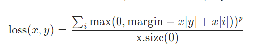
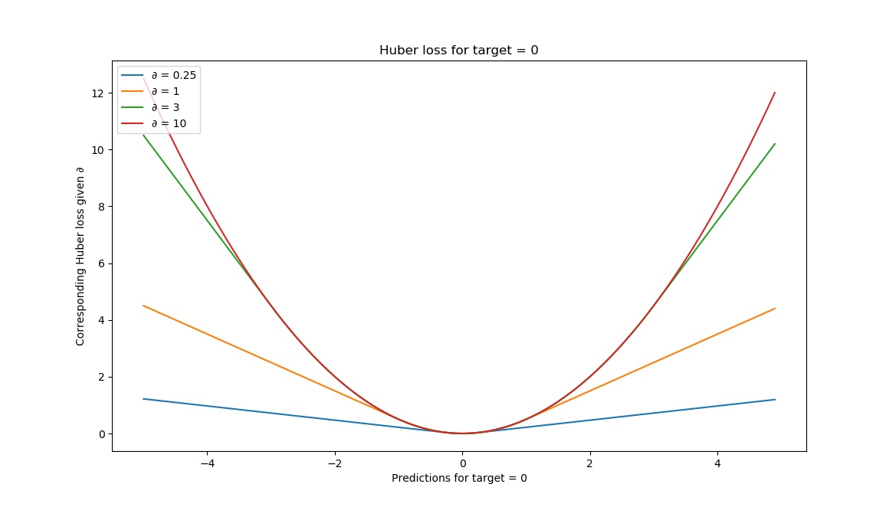

Loss functions are an important component of a neural network. Interfacing between the forward and backward pass within a Deep Learning model, they effectively compute how _poor_ a model performs (how big its _loss_) is. In this article, we're going to cover how to use a variety of PyTorch loss functions for classification and regression.

After reading this article, you will...

- **Understand what the role of a loss function in a neural network is.**
- **Be familiar with a variety of PyTorch based loss functions for classification and regression.**
- **Be able to use these loss functions in your Deep Learning models.**

Are you ready? Let's take a look! 😎

* * *

\[toc\]

* * *

## What is a loss function?

Training a Deep Learning model involves what I call a _high-level training process_. This process is visualized below. It all starts with a training dataset, which - in the case of classification and regression - contains a set of descriptive variables (features) that jointly are capable of predicting some target variable.

Training the Deep Learning model, which often is a neural network, involves sequentially performing a forward pass and a backward pass, followed by optimization. In the forward pass, the dataset is fed to the network (in a batched fashion). This leads to predictions for the targets, which can then be compared with the _true_ labels. No prediction is perfect, and hence there will be an error value. Using this error value, the error can be computed backwards into the neural network using _backpropagation_. Subsequently, with an optimizer, the model can be changed slightly in the hope that it performs better next time. By repeating this process over and over again, the model can improve and _learn_ to generate accurate predictions.

Let's get back to this error value. As the name suggests, it is used to illustrate how _poorly_ the model performs. In Deep Learning jargon, this value is also called a _loss value_. It is computed by means of a _loss function_. There are many functions that can be used for this purpose. Choosing one depends on the problem you are solving (i.e. classification or regression), the characteristics of your dataset, and quite frequently on trial and error. In the rest of this article, we're going to walk through a lot of loss functions available in PyTorch. Let's take a look!


* * *

## PyTorch Classification loss function examples

The first category of loss functions that we will take a look at is the one of **classification models**.

### Binary Cross-entropy loss, on Sigmoid (`nn.BCELoss`) example

**Binary cross-entropy** **loss** or **BCE Loss** compares a target \[latex\]t\[/latex\] with a prediction \[latex\]p\[/latex\] in a logarithmic and hence exponential fashion. In neural network implementations, the value for \[latex\]t\[/latex\] is either 0 or 1, while \[latex\]p\[/latex\] can take any value between 0 and 1. This is the formula for binary cross-entropy loss:


When visualizing BCE loss for a target value of 1, you can see that loss increases exponentially when the prediction approaches the opposite - 0, in our case.

This suggests that small deviations are punished albeit lightly, whereas big prediction errors are punished significantly.


This makes binary cross-entropy loss a good candidate for **binary classification** problems, where a classifier has two classes.

Implementing binary cross-entropy loss with PyTorch is easy. It involves the following steps:

1. Ensuring that the output of your neural network is a value between 0 and 1. Recall that the Sigmoid activation function can be used for this purpose. This is why we apply `nn.Sigmoid()` in our neural network below.
2. Ensuring that you use `nn.BCELoss()` as your loss function of choice during the training loop.

A full example of using binary cross-entropy loss is given next, using the `torchvision.datasets.FakeData` dataset:

```
import os
import torch
from torch import nn
from torchvision.datasets import FakeData
from torch.utils.data import DataLoader
from torchvision import transforms

class MLP(nn.Module):
  '''
    Multilayer Perceptron.
  '''
  def __init__(self):
    super().__init__()
    self.layers = nn.Sequential(
      nn.Flatten(),
      nn.Linear(28 * 28 * 3, 64),
      nn.ReLU(),
      nn.Linear(64, 32),
      nn.ReLU(),
      nn.Linear(32, 1),
      nn.Sigmoid()
    )


  def forward(self, x):
    '''Forward pass'''
    return self.layers(x)
  
  
if __name__ == '__main__':
  
  # Set fixed random number seed
  torch.manual_seed(42)
  
  # Prepare FakeData dataset
  dataset = FakeData(size=15000, image_size=(3, 28, 28), num_classes=2, transform=transforms.ToTensor())
  trainloader = torch.utils.data.DataLoader(dataset, batch_size=64, shuffle=True, num_workers = 4, pin_memory = True)
  
  # Initialize the MLP
  mlp = MLP()
  
  # Define the loss function and optimizer
  loss_function = nn.BCELoss()
  optimizer = torch.optim.Adam(mlp.parameters(), lr=1e-4)
  
  # Run the training loop
  for epoch in range(0, 5): # 5 epochs at maximum
    
    # Print epoch
    print(f'Starting epoch {epoch+1}')
    
    # Set current loss value
    current_loss = 0.0
    
    # Iterate over the DataLoader for training data
    for i, data in enumerate(trainloader, 0):
      
      # Get inputs
      inputs, targets = data
      
      # Prepare targets
      targets = targets \
                  .type(torch.FloatTensor) \
                  .reshape((targets.shape[0], 1))
      
      # Zero the gradients
      optimizer.zero_grad()
      
      # Perform forward pass
      outputs = mlp(inputs)
      
      # Compute loss
      loss = loss_function(outputs, targets)
      
      # Perform backward pass
      loss.backward()
      
      # Perform optimization
      optimizer.step()
      
      # Print statistics
      current_loss += loss.item()
      if i % 10 == 0:
          print('Loss after mini-batch %5d: %.3f' %
                (i + 1, current_loss / 500))
          current_loss = 0.0

  # Process is complete.
  print('Training process has finished.')
```

### Binary Cross-entropy loss, on logits (`nn.BCEWithLogitsLoss`)

Simple binary cross-entropy loss (represented by `nn.BCELoss` in PyTorch) computes BCE loss on the predictions \[latex\]p\[/latex\] generated in the range `[0, 1]`.

However, it is possible to generate more numerically stable variant of binary cross-entropy loss by _combining_ the Sigmoid and the BCE Loss into one loss function:

> This version is more numerically stable than using a plain Sigmoid followed by a BCELoss as, by combining the operations into one layer, we take advantage of the log-sum-exp trick for numerical stability.
> 
> PyTorch (n.d.)

This trick is summarized [here](https://en.wikipedia.org/wiki/LogSumExp#log-sum-exp_trick_for_log-domain_calculations).

In PyTorch, this is combined into the `**nn.BCEWithLogitsLoss**` function. The difference between `nn.BCEWithLogitsLoss` and `nn.BCELoss` is that BCE with Logits loss _adds_ the Sigmoid function into the loss function. With simple BCE Loss, you will have to add Sigmoid to the neural network, whereas with BCE With Logits Loss you will not.

Here is an example demonstrating `nn.BCEWithLogitsLoss` using the `torchvision.datasets.FakeData` dataset:

```
import os
import torch
from torch import nn
from torchvision.datasets import FakeData
from torch.utils.data import DataLoader
from torchvision import transforms

class MLP(nn.Module):
  '''
    Multilayer Perceptron.
  '''
  def __init__(self):
    super().__init__()
    self.layers = nn.Sequential(
      nn.Flatten(),
      nn.Linear(28 * 28 * 3, 64),
      nn.ReLU(),
      nn.Linear(64, 32),
      nn.ReLU(),
      nn.Linear(32, 1)
    )


  def forward(self, x):
    '''Forward pass'''
    return self.layers(x)
  
  
if __name__ == '__main__':
  
  # Set fixed random number seed
  torch.manual_seed(42)
  
  # Prepare FakeData dataset
  dataset = FakeData(size=15000, image_size=(3, 28, 28), num_classes=2, transform=transforms.ToTensor())
  trainloader = torch.utils.data.DataLoader(dataset, batch_size=64, shuffle=True, num_workers = 4, pin_memory = True)
  
  # Initialize the MLP
  mlp = MLP()
  
  # Define the loss function and optimizer
  loss_function = nn.BCEWithLogitsLoss()
  optimizer = torch.optim.Adam(mlp.parameters(), lr=1e-4)
  
  # Run the training loop
  for epoch in range(0, 5): # 5 epochs at maximum
    
    # Print epoch
    print(f'Starting epoch {epoch+1}')
    
    # Set current loss value
    current_loss = 0.0
    
    # Iterate over the DataLoader for training data
    for i, data in enumerate(trainloader, 0):
      
      # Get inputs
      inputs, targets = data
      
      # Prepare targets
      targets = targets \
                  .type(torch.FloatTensor) \
                  .reshape((targets.shape[0], 1))
      
      # Zero the gradients
      optimizer.zero_grad()
      
      # Perform forward pass
      outputs = mlp(inputs)
      
      # Compute loss
      loss = loss_function(outputs, targets)
      
      # Perform backward pass
      loss.backward()
      
      # Perform optimization
      optimizer.step()
      
      # Print statistics
      current_loss += loss.item()
      if i % 10 == 0:
          print('Loss after mini-batch %5d: %.3f' %
                (i + 1, current_loss / 500))
          current_loss = 0.0

  # Process is complete.
  print('Training process has finished.')
```

### Negative log likelihood loss (`nn.NLLLoss`)

The previous two loss functions involved binary classification. In other words, they can be used for a classifier that works with two possible targets only - a class 0 and a class 1.

However, many classification problems involve more than two classes. The MNIST dataset (`torchvision.datasets.MNIST`) is a good example of such a classification problem: in MNIST, there is one class per digit, and hence there are 10 classes.

**Negative log likelihood loss** (represented in PyTorch as `nn.NLLLoss`) can be used for this purpose. Sometimes also called _categorical cross-entropy_, it computes the _negative log likelihood_ of each prediction, and multiplies each log prediction with the true target value.

For example, if we have a three-class classification problem with a sample where the third target class is the true target class, our target vector is as follows: `[0 0 1]`.

Say that our model predicts a 60% likelihood that it's the second class: `[0.3 0.6 0.1]`. In that case, our negative log likelihood loss is as follows:

`-(0 * log(0.3) + 0 * log(0.6) + 1 * log(0.1)) = 1`

Now suppose that after a few more epochs, it successfully starts predicting the third: `[0.3 0.2 0.5]`. Ensure that loss now becomes `0.30`. When it is even more confident (say `[0.05 0.05 0.90]`), loss is `0.045`. In other words, using this loss, you can create a multiclass classifier


Note as well that by consequence, you can also model a binary classification problem this way: it is then a multiclass classification problem with two classes.

As you can see above, the _prediction_ of our classifier should be a _pseudo probability distribution_ over all the target classes. The softmax activation function serves this purpose. Using `nn.NLLLoss` therefore requires that we use a Softmax activated output in our neural network. `nn.LogSoftmax` is faster than pure `nn.Softmax`, however; that's why we are using `nn.LogSoftmax` in the `nn.NLLLoss` example for PyTorch below.

```
import os
import torch
from torch import nn
from torchvision.datasets import MNIST
from torch.utils.data import DataLoader
from torchvision import transforms

class MLP(nn.Module):
  '''
    Multilayer Perceptron.
  '''
  def __init__(self):
    super().__init__()
    self.layers = nn.Sequential(
      nn.Flatten(),
      nn.Linear(28 * 28 * 1, 64),
      nn.ReLU(),
      nn.Linear(64, 32),
      nn.ReLU(),
      nn.Linear(32, 10),
      nn.LogSoftmax(dim = 1)
    )


  def forward(self, x):
    '''Forward pass'''
    return self.layers(x)
  
  
if __name__ == '__main__':
  
  # Set fixed random number seed
  torch.manual_seed(42)
  
  # Prepare MNIST dataset
  dataset = MNIST(os.getcwd(), download=True, transform=transforms.ToTensor())
  trainloader = torch.utils.data.DataLoader(dataset, batch_size=10, shuffle=True, num_workers=1)
  
  # Initialize the MLP
  mlp = MLP()
  
  # Define the loss function and optimizer
  loss_function = nn.NLLLoss()
  optimizer = torch.optim.Adam(mlp.parameters(), lr=1e-4)
  
  # Run the training loop
  for epoch in range(0, 5): # 5 epochs at maximum
    
    # Print epoch
    print(f'Starting epoch {epoch+1}')
    
    # Set current loss value
    current_loss = 0.0
    
    # Iterate over the DataLoader for training data
    for i, data in enumerate(trainloader, 0):
      
      # Get inputs
      inputs, targets = data
      
      # Zero the gradients
      optimizer.zero_grad()
      
      # Perform forward pass
      outputs = mlp(inputs)
      
      # Compute loss
      loss = loss_function(outputs, targets)
      
      # Perform backward pass
      loss.backward()
      
      # Perform optimization
      optimizer.step()
      
      # Print statistics
      current_loss += loss.item()
      if i % 500 == 499:
          print('Loss after mini-batch %5d: %.3f' %
                (i + 1, current_loss / 500))
          current_loss = 0.0

  # Process is complete.
  print('Training process has finished.')
```

### Cross-entropy loss (`nn.CrossEntropyLoss`)

Recall that `nn.NLLLoss` requires the application of a `Softmax` (or `LogSoftmax`) layer. As with the difference between `BCELoss` and `BCEWithLogitsLoss`, combining the Softmax and the `NLLLoss` into one likely allows you to benefit from computational benefits (PyTorch, n.d.). That's why you can also choose to use `nn.CrossEntropyLoss` instead.

This is an example of `nn.CrossEntropyLoss` with a PyTorch neural network. Note that the final layer does not use any `Softmax` related loss; this is already built into the loss function!

```
import os
import torch
from torch import nn
from torchvision.datasets import MNIST
from torch.utils.data import DataLoader
from torchvision import transforms

class MLP(nn.Module):
  '''
    Multilayer Perceptron.
  '''
  def __init__(self):
    super().__init__()
    self.layers = nn.Sequential(
      nn.Flatten(),
      nn.Linear(28 * 28 * 1, 64),
      nn.ReLU(),
      nn.Linear(64, 32),
      nn.ReLU(),
      nn.Linear(32, 10)
    )


  def forward(self, x):
    '''Forward pass'''
    return self.layers(x)
  
  
if __name__ == '__main__':
  
  # Set fixed random number seed
  torch.manual_seed(42)
  
  # Prepare MNIST dataset
  dataset = MNIST(os.getcwd(), download=True, transform=transforms.ToTensor())
  trainloader = torch.utils.data.DataLoader(dataset, batch_size=10, shuffle=True, num_workers=1)
  
  # Initialize the MLP
  mlp = MLP()
  
  # Define the loss function and optimizer
  loss_function = nn.CrossEntropyLoss()
  optimizer = torch.optim.Adam(mlp.parameters(), lr=1e-4)
  
  # Run the training loop
  for epoch in range(0, 5): # 5 epochs at maximum
    
    # Print epoch
    print(f'Starting epoch {epoch+1}')
    
    # Set current loss value
    current_loss = 0.0
    
    # Iterate over the DataLoader for training data
    for i, data in enumerate(trainloader, 0):
      
      # Get inputs
      inputs, targets = data
      
      # Zero the gradients
      optimizer.zero_grad()
      
      # Perform forward pass
      outputs = mlp(inputs)
      
      # Compute loss
      loss = loss_function(outputs, targets)
      
      # Perform backward pass
      loss.backward()
      
      # Perform optimization
      optimizer.step()
      
      # Print statistics
      current_loss += loss.item()
      if i % 500 == 499:
          print('Loss after mini-batch %5d: %.3f' %
                (i + 1, current_loss / 500))
          current_loss = 0.0

  # Process is complete.
  print('Training process has finished.')
```

### Poisson Negative log likelihood loss (`nn.PoissonNLLLoss`)

Suppose that your multiclass classification targets are drawn from a Poisson distribution (PyTorch, n.d.); that you already know this fact from your exploratory data analysis. You can then use the **Poisson Negative log likelihood loss** instead of regular `nn.NLLLoss`. In PyTorch (n.d.), this loss is described as follows:


An example using Poisson Negative log likelihood loss with PyTorch is as follows:

```
import os
import torch
from torch import nn
from torchvision.datasets import MNIST
from torch.utils.data import DataLoader
from torchvision import transforms

class MLP(nn.Module):
  '''
    Multilayer Perceptron.
  '''
  def __init__(self):
    super().__init__()
    self.layers = nn.Sequential(
      nn.Flatten(),
      nn.Linear(28 * 28 * 1, 64),
      nn.ReLU(),
      nn.Linear(64, 32),
      nn.ReLU(),
      nn.Linear(32, 10),
      nn.LogSoftmax(dim = 1)
    )


  def forward(self, x):
    '''Forward pass'''
    return self.layers(x)
  
  
if __name__ == '__main__':
  
  # Set fixed random number seed
  torch.manual_seed(42)
  
  # Prepare MNIST dataset
  dataset = MNIST(os.getcwd(), download=True, transform=transforms.ToTensor())
  trainloader = torch.utils.data.DataLoader(dataset, batch_size=10, shuffle=True, num_workers=1)
  
  # Initialize the MLP
  mlp = MLP()
  
  # Define the loss function and optimizer
  loss_function = nn.PoissonNLLLoss()
  optimizer = torch.optim.Adam(mlp.parameters(), lr=1e-4)
  
  # Run the training loop
  for epoch in range(0, 5): # 5 epochs at maximum
    
    # Print epoch
    print(f'Starting epoch {epoch+1}')
    
    # Set current loss value
    current_loss = 0.0
    
    # Iterate over the DataLoader for training data
    for i, data in enumerate(trainloader, 0):
      
      # Get inputs
      inputs, targets = data
      
      # Zero the gradients
      optimizer.zero_grad()
      
      # Perform forward pass
      outputs = mlp(inputs)
      
      # Compute loss
      loss = loss_function(outputs, targets)
      
      # Perform backward pass
      loss.backward()
      
      # Perform optimization
      optimizer.step()
      
      # Print statistics
      current_loss += loss.item()
      if i % 500 == 499:
          print('Loss after mini-batch %5d: %.3f' %
                (i + 1, current_loss / 500))
          current_loss = 0.0

  # Process is complete.
  print('Training process has finished.')
```

### Gaussian Negative log likelihood loss (`nn.GaussianNLLLoss`)

Suppose that your multiclass classification targets are drawn from a Gaussian distribution (PyTorch, n.d.). Loss can then be computed differently - by using the **Gaussian Negative log likelihood loss**. This loss function is represented within PyTorch (n.d.) as `nn.GaussianNLLLoss`.


This is an example of using Gaussian Negative log likelihood loss with PyTorch.

```
import os
import torch
from torch import nn
from torchvision.datasets import MNIST
from torch.utils.data import DataLoader
from torchvision import transforms

class MLP(nn.Module):
  '''
    Multilayer Perceptron.
  '''
  def __init__(self):
    super().__init__()
    self.layers = nn.Sequential(
      nn.Flatten(),
      nn.Linear(28 * 28 * 1, 64),
      nn.ReLU(),
      nn.Linear(64, 32),
      nn.ReLU(),
      nn.Linear(32, 10),
      nn.LogSoftmax(dim = 1)
    )


  def forward(self, x):
    '''Forward pass'''
    return self.layers(x)
  
  
if __name__ == '__main__':
  
  # Set fixed random number seed
  torch.manual_seed(42)
  
  # Prepare MNIST dataset
  dataset = MNIST(os.getcwd(), download=True, transform=transforms.ToTensor())
  trainloader = torch.utils.data.DataLoader(dataset, batch_size=10, shuffle=True, num_workers=1)
  
  # Initialize the MLP
  mlp = MLP()
  
  # Define the loss function and optimizer
  loss_function = nn.GaussianNLLLoss()
  optimizer = torch.optim.Adam(mlp.parameters(), lr=1e-4)
  
  # Run the training loop
  for epoch in range(0, 5): # 5 epochs at maximum
    
    # Print epoch
    print(f'Starting epoch {epoch+1}')
    
    # Set current loss value
    current_loss = 0.0
    
    # Iterate over the DataLoader for training data
    for i, data in enumerate(trainloader, 0):
      
      # Get inputs
      inputs, targets = data
      
      # Zero the gradients
      optimizer.zero_grad()
      
      # Perform forward pass
      outputs = mlp(inputs)
      
      # Compute loss
      loss = loss_function(outputs, targets)
      
      # Perform backward pass
      loss.backward()
      
      # Perform optimization
      optimizer.step()
      
      # Print statistics
      current_loss += loss.item()
      if i % 500 == 499:
          print('Loss after mini-batch %5d: %.3f' %
                (i + 1, current_loss / 500))
          current_loss = 0.0

  # Process is complete.
  print('Training process has finished.')
```

### Hinge embedding loss (`nn.HingeEmbeddingLoss`)

In PyTorch, the **Hinge Embedding Loss** is defined as follows:


It can be used to measure whether two inputs (`x` and `y`) are similar, and works only if `y`s are either 1 or -1.

```
import os
import torch
from torch import nn
from torchvision.datasets import FakeData
from torch.utils.data import DataLoader
from torchvision import transforms

class MLP(nn.Module):
  '''
    Multilayer Perceptron.
  '''
  def __init__(self):
    super().__init__()
    self.layers = nn.Sequential(
      nn.Flatten(),
      nn.Linear(28 * 28 * 3, 64),
      nn.ReLU(),
      nn.Linear(64, 32),
      nn.ReLU(),
      nn.Linear(32, 1),
      nn.Tanh()
    )


  def forward(self, x):
    '''Forward pass'''
    return self.layers(x)
  
  
if __name__ == '__main__':
  
  # Set fixed random number seed
  torch.manual_seed(42)
  
  # Prepare FakeData dataset
  dataset = FakeData(size=15000, image_size=(3, 28, 28), num_classes=2, transform=transforms.ToTensor())
  trainloader = torch.utils.data.DataLoader(dataset, batch_size=64, shuffle=True, num_workers = 4, pin_memory = True)
  
  # Initialize the MLP
  mlp = MLP()
  
  # Define the loss function and optimizer
  loss_function = nn.HingeEmbeddingLoss()
  optimizer = torch.optim.Adam(mlp.parameters(), lr=1e-4)
  
  # Run the training loop
  for epoch in range(0, 5): # 5 epochs at maximum
    
    # Print epoch
    print(f'Starting epoch {epoch+1}')
    
    # Set current loss value
    current_loss = 0.0
    
    # Iterate over the DataLoader for training data
    for i, data in enumerate(trainloader, 0):
      
      # Get inputs
      inputs, targets = data
      
      # For this example, change zero targets into -1
      targets[targets == 0] = -1
      
      # Prepare targets
      targets = targets \
                  .type(torch.FloatTensor) \
                  .reshape((targets.shape[0], 1))
      
      # Zero the gradients
      optimizer.zero_grad()
      
      # Perform forward pass
      outputs = mlp(inputs)
      
      # Compute loss
      loss = loss_function(outputs, targets)
      
      # Perform backward pass
      loss.backward()
      
      # Perform optimization
      optimizer.step()
      
      # Print statistics
      current_loss += loss.item()
      if i % 10 == 0:
          print('Loss after mini-batch %5d: %.3f' %
                (i + 1, current_loss / 500))
          current_loss = 0.0

  # Process is complete.
  print('Training process has finished.')
```

### Two-class soft margin loss (`nn.SoftMarginLoss`)

The two-class soft margin loss optimizes the following formula (PyTorch, n.d.):


It can be used in binary classification problems as follows:

```
import os
import torch
from torch import nn
from torchvision.datasets import FakeData
from torch.utils.data import DataLoader
from torchvision import transforms

class MLP(nn.Module):
  '''
    Multilayer Perceptron.
  '''
  def __init__(self):
    super().__init__()
    self.layers = nn.Sequential(
      nn.Flatten(),
      nn.Linear(28 * 28 * 3, 64),
      nn.ReLU(),
      nn.Linear(64, 32),
      nn.ReLU(),
      nn.Linear(32, 1),
      nn.Tanh()
    )


  def forward(self, x):
    '''Forward pass'''
    return self.layers(x)
  
  
if __name__ == '__main__':
  
  # Set fixed random number seed
  torch.manual_seed(42)
  
  # Prepare FakeData dataset
  dataset = FakeData(size=15000, image_size=(3, 28, 28), num_classes=2, transform=transforms.ToTensor())
  trainloader = torch.utils.data.DataLoader(dataset, batch_size=64, shuffle=True, num_workers = 4, pin_memory = True)
  
  # Initialize the MLP
  mlp = MLP()
  
  # Define the loss function and optimizer
  loss_function = nn.SoftMarginLoss()
  optimizer = torch.optim.Adam(mlp.parameters(), lr=1e-4)
  
  # Run the training loop
  for epoch in range(0, 5): # 5 epochs at maximum
    
    # Print epoch
    print(f'Starting epoch {epoch+1}')
    
    # Set current loss value
    current_loss = 0.0
    
    # Iterate over the DataLoader for training data
    for i, data in enumerate(trainloader, 0):
      
      # Get inputs
      inputs, targets = data
      
      # For this example, change zero targets into -1
      targets[targets == 0] = -1
      
      # Prepare targets
      targets = targets \
                  .type(torch.FloatTensor) \
                  .reshape((targets.shape[0], 1))
      
      # Zero the gradients
      optimizer.zero_grad()
      
      # Perform forward pass
      outputs = mlp(inputs)
      
      # Compute loss
      loss = loss_function(outputs, targets)
      
      # Perform backward pass
      loss.backward()
      
      # Perform optimization
      optimizer.step()
      
      # Print statistics
      current_loss += loss.item()
      if i % 10 == 0:
          print('Loss after mini-batch %5d: %.3f' %
                (i + 1, current_loss / 500))
          current_loss = 0.0

  # Process is complete.
  print('Training process has finished.')
```

### Multi-class margin loss (`nn.MultiMarginLoss`)

For multiclass classification problems, a **multi-class hinge loss** can be used represented by `nn.MultiMarginLoss` (PyTorch, n.d.):



Here is an examplke using `nn.MultiMarginLoss` with PyTorch for **multi-class single-label classification problems:**

```
import os
import torch
from torch import nn
from torchvision.datasets import MNIST
from torch.utils.data import DataLoader
from torchvision import transforms

class MLP(nn.Module):
  '''
    Multilayer Perceptron.
  '''
  def __init__(self):
    super().__init__()
    self.layers = nn.Sequential(
      nn.Flatten(),
      nn.Linear(28 * 28 * 1, 64),
      nn.ReLU(),
      nn.Linear(64, 32),
      nn.ReLU(),
      nn.Linear(32, 10),
      nn.LogSoftmax(dim = 1)
    )


  def forward(self, x):
    '''Forward pass'''
    return self.layers(x)
  
  
if __name__ == '__main__':
  
  # Set fixed random number seed
  torch.manual_seed(42)
  
  # Prepare MNIST dataset
  dataset = MNIST(os.getcwd(), download=True, transform=transforms.ToTensor())
  trainloader = torch.utils.data.DataLoader(dataset, batch_size=10, shuffle=True, num_workers=1)
  
  # Initialize the MLP
  mlp = MLP()
  
  # Define the loss function and optimizer
  loss_function = nn.MultiMarginLoss()
  optimizer = torch.optim.Adam(mlp.parameters(), lr=1e-4)
  
  # Run the training loop
  for epoch in range(0, 5): # 5 epochs at maximum
    
    # Print epoch
    print(f'Starting epoch {epoch+1}')
    
    # Set current loss value
    current_loss = 0.0
    
    # Iterate over the DataLoader for training data
    for i, data in enumerate(trainloader, 0):
      
      # Get inputs
      inputs, targets = data
      
      # Zero the gradients
      optimizer.zero_grad()
      
      # Perform forward pass
      outputs = mlp(inputs)
      
      # Compute loss
      loss = loss_function(outputs, targets)
      
      # Perform backward pass
      loss.backward()
      
      # Perform optimization
      optimizer.step()
      
      # Print statistics
      current_loss += loss.item()
      if i % 500 == 499:
          print('Loss after mini-batch %5d: %.3f' %
                (i + 1, current_loss / 500))
          current_loss = 0.0

  # Process is complete.
  print('Training process has finished.')
```

### Multilabel soft margin loss (`nn.MultiLabelSoftMarginLoss`)

In **multilabel classification problems**, the neural network learns to predict multiple labels for an input sample. It can also be viewed as solving a _tagging problem_, as you are essentially assigning multiple tags (instead of just one class) to _one_ input sample.

Multilabel soft margin loss (implemented in PyTorch as `nn.MultiLabelSoftMarginLoss`) can be used for this purpose. Here is an example with PyTorch. If you look closely, you will see that:

- We use the MNIST dataset for this purpose. By replacing the targets with one of three multilabel Tensors, we are simulating a multilabel classification problem. Note that there is no resemblence whatsoever between targets and inputs, as this is simply an example.
- The final Linear layer outputs a 10-dimensional Tensor, which makes sense since we need 10 logits per sample.

```
import os
import numpy as np
import torch
from torch import nn
from torchvision.datasets import MNIST
from torch.utils.data import DataLoader
from torchvision import transforms

class MLP(nn.Module):
  '''
    Multilayer Perceptron.
  '''
  def __init__(self):
    super().__init__()
    self.layers = nn.Sequential(
      nn.Flatten(),
      nn.Linear(28 * 28 * 1, 64),
      nn.ReLU(),
      nn.Linear(64, 32),
      nn.ReLU(),
      nn.Linear(32, 10)
    )


  def forward(self, x):
    '''
      Forward pass
      Note that 
    '''
    fp = self.layers(x)
    return fp
  
  
def draw_label(label):
  if label < 5:
    return [0, 0, 0, 1, 0, 0, 0, 1, 0, 0]
  if label < 8:
    return [1, 0, 0, 1, 0, 0, 0, 1, 0, 0]
  else:
    return [0, 0, 0, 0, 1, 0, 0, 1, 1, 0]
  
def replace_labels(labels):
  ''' Randomly replace labels '''
  new_labels = []
  for label in labels:
    new_labels.append(draw_label(label))
  return torch.from_numpy(np.array(new_labels))
  
  
if __name__ == '__main__':
  
  # Set fixed random number seed
  torch.manual_seed(42)
  
  # Prepare MNIST dataset
  dataset = MNIST(os.getcwd(), download=True, transform=transforms.ToTensor())
  trainloader = torch.utils.data.DataLoader(dataset, batch_size=10, shuffle=True, num_workers=1)
  
  # Initialize the MLP
  mlp = MLP()
  
  # Define the loss function and optimizer
  loss_function = nn.MultiLabelSoftMarginLoss()
  optimizer = torch.optim.Adam(mlp.parameters(), lr=1e-4)
  
  # Run the training loop
  for epoch in range(0, 5): # 5 epochs at maximum
    
    # Print epoch
    print(f'Starting epoch {epoch+1}')
    
    # Set current loss value
    current_loss = 0.0
    
    # Iterate over the DataLoader for training data
    for i, data in enumerate(trainloader, 0):
      
      # Get inputs
      inputs, targets = data
      targets = replace_labels(targets)
      
      # Zero the gradients
      optimizer.zero_grad()
      
      # Perform forward pass
      outputs = mlp(inputs)
      
      # Compute loss
      loss = loss_function(outputs, targets)
      
      # Perform backward pass
      loss.backward()
      
      # Perform optimization
      optimizer.step()
      
      # Print statistics
      current_loss += loss.item()
      if i % 500 == 499:
          print('Loss after mini-batch %5d: %.3f' %
                (i + 1, current_loss / 500))
          current_loss = 0.0

  # Process is complete.
  print('Training process has finished.')
```

### Kullback-Leibler Divergence (KL Divergence) loss (`nn.KLDivLoss`)

KL Divergence can be used for [Variational Autoencoders, multiclass classification and replacing Least Squares regression](https://www.machinecurve.com/index.php/2019/12/21/how-to-use-kullback-leibler-divergence-kl-divergence-with-keras/). Here is an example that uses KL Divergence with PyTorch:

```
import os
import numpy as np
import torch
from torch import nn
from torchvision.datasets import MNIST
from torch.utils.data import DataLoader
from torchvision import transforms

class MLP(nn.Module):
  '''
    Multilayer Perceptron.
  '''
  def __init__(self):
    super().__init__()
    self.layers = nn.Sequential(
      nn.Flatten(),
      nn.Linear(28 * 28 * 1, 64),
      nn.ReLU(),
      nn.Linear(64, 32),
      nn.ReLU(),
      nn.Linear(32, 1),
      nn.Sigmoid()
    )


  def forward(self, x):
    '''
      Forward pass
      Note that 
    '''
    fp = self.layers(x)
    return fp

  
if __name__ == '__main__':
  
  # Set fixed random number seed
  torch.manual_seed(42)
  
  # Prepare MNIST dataset
  dataset = MNIST(os.getcwd(), download=True, transform=transforms.ToTensor())
  trainloader = torch.utils.data.DataLoader(dataset, batch_size=10, shuffle=True, num_workers=1)
  
  # Initialize the MLP
  mlp = MLP()
  
  # Define the loss function and optimizer
  loss_function = nn.KLDivLoss()
  optimizer = torch.optim.Adam(mlp.parameters(), lr=1e-4)
  
  # Run the training loop
  for epoch in range(0, 5): # 5 epochs at maximum
    
    # Print epoch
    print(f'Starting epoch {epoch+1}')
    
    # Set current loss value
    current_loss = 0.0
    
    # Iterate over the DataLoader for training data
    for i, data in enumerate(trainloader, 0):
      
      # Get inputs
      inputs, targets = data
      targets = targets.float()
      
      # Zero the gradients
      optimizer.zero_grad()
      
      # Perform forward pass
      outputs = mlp(inputs)
      
      # Compute loss
      loss = loss_function(outputs, targets)
      
      # Perform backward pass
      loss.backward()
      
      # Perform optimization
      optimizer.step()
      
      # Print statistics
      current_loss += loss.item()
      if i % 500 == 499:
          print('Loss after mini-batch %5d: %.3f' %
                (i + 1, current_loss / 500))
          current_loss = 0.0

  # Process is complete.
  print('Training process has finished.')
```

* * *

## PyTorch Regression loss function examples

Let's now take a look at PyTorch loss functions for regression models.

### Mean Absolute Error (MAE) / L1 Loss (`nn.L1Loss`)

**Mean Absolute Error** (MAE) is one of the loss functions for regression. This is what it looks like:


As you can see, it simply computes the difference between the input `x` and the expected value for `y`, then computing the absolute value (so that the outcome is always positive). It then averages this error.

Below, you will see an example of MAE loss (also called L1 Loss) within PyTorch, using `nn.L1Loss` and the Boston Housing dataset:

```
import os
import numpy as np
import torch
from torch import nn
from torchvision.datasets import MNIST
from torch.utils.data import DataLoader
from torchvision import transforms
from sklearn.datasets import load_boston
from sklearn.preprocessing import StandardScaler

class BostonDataset(torch.utils.data.Dataset):
  '''
  Prepare the Boston dataset for regression
  '''

  def __init__(self, X, y, scale_data=True):
    if not torch.is_tensor(X) and not torch.is_tensor(y):
      # Apply scaling if necessary
      if scale_data:
          X = StandardScaler().fit_transform(X)
      self.X = torch.from_numpy(X)
      self.y = torch.from_numpy(y)

  def __len__(self):
      return len(self.X)

  def __getitem__(self, i):
      return self.X[i], self.y[i]
      

class MLP(nn.Module):
  '''
    Multilayer Perceptron for regression.
  '''
  def __init__(self):
    super().__init__()
    self.layers = nn.Sequential(
      nn.Linear(13, 64),
      nn.ReLU(),
      nn.Linear(64, 32),
      nn.ReLU(),
      nn.Linear(32, 1)
    )


  def forward(self, x):
    '''
      Forward pass
      Note that 
    '''
    fp = self.layers(x)
    return fp

  
if __name__ == '__main__':
  
  # Set fixed random number seed
  torch.manual_seed(42)
  
  # Load Boston dataset
  X, y = load_boston(return_X_y=True)
  
  # Prepare Boston dataset
  dataset = BostonDataset(X, y)
  trainloader = torch.utils.data.DataLoader(dataset, batch_size=10, shuffle=True, num_workers=1)
  
  # Initialize the MLP
  mlp = MLP()
  
  # Define the loss function and optimizer
  loss_function = nn.L1Loss()
  optimizer = torch.optim.Adam(mlp.parameters(), lr=1e-4)
  
  # Run the training loop
  for epoch in range(0, 5): # 5 epochs at maximum
    
    # Print epoch
    print(f'Starting epoch {epoch+1}')
    
    # Set current loss value
    current_loss = 0.0
    
    # Iterate over the DataLoader for training data
    for i, data in enumerate(trainloader, 0):
      
      # Get and prepare inputs
      inputs, targets = data
      inputs, targets = inputs.float(), targets.float()
      targets = targets.reshape((targets.shape[0], 1))
      
      # Zero the gradients
      optimizer.zero_grad()
      
      # Perform forward pass
      outputs = mlp(inputs)
      
      # Compute loss
      loss = loss_function(outputs, targets)
      
      # Perform backward pass
      loss.backward()
      
      # Perform optimization
      optimizer.step()
      
      # Print statistics
      current_loss += loss.item()
      if i % 10 == 0:
          print('Loss after mini-batch %5d: %.3f' %
                (i + 1, current_loss / 500))
          current_loss = 0.0

  # Process is complete.
  print('Training process has finished.')
```

### Mean Squared Error (MSE) loss (`nn.MSELoss`)

The **Mean Squared Error** loss (or `nn.MSELoss`) essentially performs the same, but then doesn't compute the _absolute value_ but rather the _square_ of the difference. This also leads to the fact that all negatives are gone (squaring a negative value yields a positive one), but is better when the difference between errors is relatively small. Note that this comes at the cost of being sensitive to outliers.


This is an example of using MSE Loss with PyTorch, which is provided as `nn.MSELoss`:

```
import os
import numpy as np
import torch
from torch import nn
from torchvision.datasets import MNIST
from torch.utils.data import DataLoader
from torchvision import transforms
from sklearn.datasets import load_boston
from sklearn.preprocessing import StandardScaler

class BostonDataset(torch.utils.data.Dataset):
  '''
  Prepare the Boston dataset for regression
  '''

  def __init__(self, X, y, scale_data=True):
    if not torch.is_tensor(X) and not torch.is_tensor(y):
      # Apply scaling if necessary
      if scale_data:
          X = StandardScaler().fit_transform(X)
      self.X = torch.from_numpy(X)
      self.y = torch.from_numpy(y)

  def __len__(self):
      return len(self.X)

  def __getitem__(self, i):
      return self.X[i], self.y[i]
      

class MLP(nn.Module):
  '''
    Multilayer Perceptron for regression.
  '''
  def __init__(self):
    super().__init__()
    self.layers = nn.Sequential(
      nn.Linear(13, 64),
      nn.ReLU(),
      nn.Linear(64, 32),
      nn.ReLU(),
      nn.Linear(32, 1)
    )


  def forward(self, x):
    '''
      Forward pass
      Note that 
    '''
    fp = self.layers(x)
    return fp

  
if __name__ == '__main__':
  
  # Set fixed random number seed
  torch.manual_seed(42)
  
  # Load Boston dataset
  X, y = load_boston(return_X_y=True)
  
  # Prepare Boston dataset
  dataset = BostonDataset(X, y)
  trainloader = torch.utils.data.DataLoader(dataset, batch_size=10, shuffle=True, num_workers=1)
  
  # Initialize the MLP
  mlp = MLP()
  
  # Define the loss function and optimizer
  loss_function = nn.MSELoss()
  optimizer = torch.optim.Adam(mlp.parameters(), lr=1e-4)
  
  # Run the training loop
  for epoch in range(0, 5): # 5 epochs at maximum
    
    # Print epoch
    print(f'Starting epoch {epoch+1}')
    
    # Set current loss value
    current_loss = 0.0
    
    # Iterate over the DataLoader for training data
    for i, data in enumerate(trainloader, 0):
      
      # Get and prepare inputs
      inputs, targets = data
      inputs, targets = inputs.float(), targets.float()
      targets = targets.reshape((targets.shape[0], 1))
      
      # Zero the gradients
      optimizer.zero_grad()
      
      # Perform forward pass
      outputs = mlp(inputs)
      
      # Compute loss
      loss = loss_function(outputs, targets)
      
      # Perform backward pass
      loss.backward()
      
      # Perform optimization
      optimizer.step()
      
      # Print statistics
      current_loss += loss.item()
      if i % 10 == 0:
          print('Loss after mini-batch %5d: %.3f' %
                (i + 1, current_loss / 500))
          current_loss = 0.0

  # Process is complete.
  print('Training process has finished.')
```

### Smooth MAE / L1 Loss (`nn.SmoothL1Loss`)

Recall from above that in comparison, MAE Loss (L1 Loss) works better when there are many outliers, while MSE Loss works better when there are few outliers and relatively small differences between errors. However, sometimes you want to use a loss function that is precisely in between these two. **Smooth MAE Loss** can then be used. Being provided as `nn.SmoothL1Loss`, the error is computed in a squared fashion if the error is smaller than a value for beta (i.e. benefiting from the MSE part). In all other cases, a value similar to the MAE is computed.

The `beta` parameter is configurable in the `nn.SmoothL1Loss(...)` initialization.


```
import os
import numpy as np
import torch
from torch import nn
from torchvision.datasets import MNIST
from torch.utils.data import DataLoader
from torchvision import transforms
from sklearn.datasets import load_boston
from sklearn.preprocessing import StandardScaler

class BostonDataset(torch.utils.data.Dataset):
  '''
  Prepare the Boston dataset for regression
  '''

  def __init__(self, X, y, scale_data=True):
    if not torch.is_tensor(X) and not torch.is_tensor(y):
      # Apply scaling if necessary
      if scale_data:
          X = StandardScaler().fit_transform(X)
      self.X = torch.from_numpy(X)
      self.y = torch.from_numpy(y)

  def __len__(self):
      return len(self.X)

  def __getitem__(self, i):
      return self.X[i], self.y[i]
      

class MLP(nn.Module):
  '''
    Multilayer Perceptron for regression.
  '''
  def __init__(self):
    super().__init__()
    self.layers = nn.Sequential(
      nn.Linear(13, 64),
      nn.ReLU(),
      nn.Linear(64, 32),
      nn.ReLU(),
      nn.Linear(32, 1)
    )


  def forward(self, x):
    '''
      Forward pass
      Note that 
    '''
    fp = self.layers(x)
    return fp

  
if __name__ == '__main__':
  
  # Set fixed random number seed
  torch.manual_seed(42)
  
  # Load Boston dataset
  X, y = load_boston(return_X_y=True)
  
  # Prepare Boston dataset
  dataset = BostonDataset(X, y)
  trainloader = torch.utils.data.DataLoader(dataset, batch_size=10, shuffle=True, num_workers=1)
  
  # Initialize the MLP
  mlp = MLP()
  
  # Define the loss function and optimizer
  loss_function = nn.SmoothL1Loss()
  optimizer = torch.optim.Adam(mlp.parameters(), lr=1e-4)
  
  # Run the training loop
  for epoch in range(0, 5): # 5 epochs at maximum
    
    # Print epoch
    print(f'Starting epoch {epoch+1}')
    
    # Set current loss value
    current_loss = 0.0
    
    # Iterate over the DataLoader for training data
    for i, data in enumerate(trainloader, 0):
      
      # Get and prepare inputs
      inputs, targets = data
      inputs, targets = inputs.float(), targets.float()
      targets = targets.reshape((targets.shape[0], 1))
      
      # Zero the gradients
      optimizer.zero_grad()
      
      # Perform forward pass
      outputs = mlp(inputs)
      
      # Compute loss
      loss = loss_function(outputs, targets)
      
      # Perform backward pass
      loss.backward()
      
      # Perform optimization
      optimizer.step()
      
      # Print statistics
      current_loss += loss.item()
      if i % 10 == 0:
          print('Loss after mini-batch %5d: %.3f' %
                (i + 1, current_loss / 500))
          current_loss = 0.0

  # Process is complete.
  print('Training process has finished.')
```

### Huber loss (`nn.HuberLoss`)

**Huber loss** is another loss function that can be used for regression. Depending on a value for `delta`, it is computed in a different way - put briefly, when errors are small, the error itself is part of the square, whereas it's the delta in the case of large errors:


Visually, Huber loss looks as follows given different deltas:



In other words, by tweaking the value for `delta`, we can adapt the loss function's sensitivity to outliers. It is therefore also a value that lies somewhere between MSE and MAE loss.

Being available as `nn.HuberLoss` (with a configurable `delta` parameter), it can be used in the following way:

```
import os
import numpy as np
import torch
from torch import nn
from torchvision.datasets import MNIST
from torch.utils.data import DataLoader
from torchvision import transforms
from sklearn.datasets import load_boston
from sklearn.preprocessing import StandardScaler

class BostonDataset(torch.utils.data.Dataset):
  '''
  Prepare the Boston dataset for regression
  '''

  def __init__(self, X, y, scale_data=True):
    if not torch.is_tensor(X) and not torch.is_tensor(y):
      # Apply scaling if necessary
      if scale_data:
          X = StandardScaler().fit_transform(X)
      self.X = torch.from_numpy(X)
      self.y = torch.from_numpy(y)

  def __len__(self):
      return len(self.X)

  def __getitem__(self, i):
      return self.X[i], self.y[i]
      

class MLP(nn.Module):
  '''
    Multilayer Perceptron for regression.
  '''
  def __init__(self):
    super().__init__()
    self.layers = nn.Sequential(
      nn.Linear(13, 64),
      nn.ReLU(),
      nn.Linear(64, 32),
      nn.ReLU(),
      nn.Linear(32, 1)
    )


  def forward(self, x):
    '''
      Forward pass
      Note that 
    '''
    fp = self.layers(x)
    return fp

  
if __name__ == '__main__':
  
  # Set fixed random number seed
  torch.manual_seed(42)
  
  # Load Boston dataset
  X, y = load_boston(return_X_y=True)
  
  # Prepare Boston dataset
  dataset = BostonDataset(X, y)
  trainloader = torch.utils.data.DataLoader(dataset, batch_size=10, shuffle=True, num_workers=1)
  
  # Initialize the MLP
  mlp = MLP()
  
  # Define the loss function and optimizer
  loss_function = nn.HuberLoss(delta=1.0)
  optimizer = torch.optim.Adam(mlp.parameters(), lr=1e-4)
  
  # Run the training loop
  for epoch in range(0, 5): # 5 epochs at maximum
    
    # Print epoch
    print(f'Starting epoch {epoch+1}')
    
    # Set current loss value
    current_loss = 0.0
    
    # Iterate over the DataLoader for training data
    for i, data in enumerate(trainloader, 0):
      
      # Get and prepare inputs
      inputs, targets = data
      inputs, targets = inputs.float(), targets.float()
      targets = targets.reshape((targets.shape[0], 1))
      
      # Zero the gradients
      optimizer.zero_grad()
      
      # Perform forward pass
      outputs = mlp(inputs)
      
      # Compute loss
      loss = loss_function(outputs, targets)
      
      # Perform backward pass
      loss.backward()
      
      # Perform optimization
      optimizer.step()
      
      # Print statistics
      current_loss += loss.item()
      if i % 10 == 0:
          print('Loss after mini-batch %5d: %.3f' %
                (i + 1, current_loss / 500))
          current_loss = 0.0

  # Process is complete.
  print('Training process has finished.')
```

* * *

## Summary

In this article, you have...

- **Learned what the role of a loss function in a neural network is.**
- **Been familiarized with a variety of PyTorch based loss functions for classification and regression.**
- **Been able to use these loss functions in your Deep Learning models.**

I hope that this article was useful to you! If it was, please feel free to drop a comment in the comments section 💬 Feel free to do the same if you have questions or other remarks.

Thank you for reading MachineCurve today and happy engineering! 😎

* * *

## Sources

PyTorch. (n.d.). _BCELoss — PyTorch 1.7.0 documentation_. [https://pytorch.org/docs/stable/generated/torch.nn.BCELoss.html](https://pytorch.org/docs/stable/generated/torch.nn.BCELoss.html)

PyTorch. (n.d.). _BCEWithLogitsLoss — PyTorch 1.8.1 documentation_. [https://pytorch.org/docs/stable/generated/torch.nn.BCEWithLogitsLoss.html](https://pytorch.org/docs/stable/generated/torch.nn.BCEWithLogitsLoss.html)

PyTorch. (2019, March 7). _Difference between cross-entropy loss or log likelihood loss?_ PyTorch Forums. [https://discuss.pytorch.org/t/difference-between-cross-entropy-loss-or-log-likelihood-loss/38816/2](https://discuss.pytorch.org/t/difference-between-cross-entropy-loss-or-log-likelihood-loss/38816/2)

PyTorch. (n.d.). _NLLLoss — PyTorch 1.9.0 documentation_. [https://pytorch.org/docs/stable/generated/torch.nn.NLLLoss.html](https://pytorch.org/docs/stable/generated/torch.nn.NLLLoss.html)

PyTorch. (n.d.). _CrossEntropyLoss — PyTorch 1.9.0 documentation_. [https://pytorch.org/docs/stable/generated/torch.nn.CrossEntropyLoss.html](https://pytorch.org/docs/stable/generated/torch.nn.CrossEntropyLoss.html)

PyTorch. (n.d.). _SoftMarginLoss — PyTorch 1.9.0 documentation_. [https://pytorch.org/docs/stable/generated/torch.nn.SoftMarginLoss.html](https://pytorch.org/docs/stable/generated/torch.nn.SoftMarginLoss.html)

PyTorch. (n.d.). _HingeEmbeddingLoss — PyTorch 1.9.0 documentation_. [https://pytorch.org/docs/stable/generated/torch.nn.HingeEmbeddingLoss.html#torch.nn.HingeEmbeddingLoss](https://pytorch.org/docs/stable/generated/torch.nn.HingeEmbeddingLoss.html#torch.nn.HingeEmbeddingLoss)

PyTorch. (n.d.). _MultiMarginLoss — PyTorch 1.9.0 documentation_. [https://pytorch.org/docs/stable/generated/torch.nn.MultiMarginLoss.html](https://pytorch.org/docs/stable/generated/torch.nn.MultiMarginLoss.html)

PyTorch. (n.d.). _MultiLabelSoftMarginLoss — PyTorch 1.9.0 documentation_. [https://pytorch.org/docs/stable/generated/torch.nn.MultiLabelSoftMarginLoss.html#torch.nn.MultiLabelSoftMarginLoss](https://pytorch.org/docs/stable/generated/torch.nn.MultiLabelSoftMarginLoss.html#torch.nn.MultiLabelSoftMarginLoss)

PyTorch. (n.d.). _MultiLabelMarginLoss — PyTorch 1.9.0 documentation_. [https://pytorch.org/docs/stable/generated/torch.nn.MultiLabelMarginLoss.html#torch.nn.MultiLabelMarginLoss](https://pytorch.org/docs/stable/generated/torch.nn.MultiLabelMarginLoss.html#torch.nn.MultiLabelMarginLoss)

MachineCurve. (2019, December 22). _How to use kullback-leibler divergence (KL divergence) with Keras?_ [https://www.machinecurve.com/index.php/2019/12/21/how-to-use-kullback-leibler-divergence-kl-divergence-with-keras/](https://www.machinecurve.com/index.php/2019/12/21/how-to-use-kullback-leibler-divergence-kl-divergence-with-keras/)

PyTorch. (n.d.). _HuberLoss — PyTorch 1.9.0 documentation_. [https://pytorch.org/docs/stable/generated/torch.nn.HuberLoss.html#torch.nn.HuberLoss](https://pytorch.org/docs/stable/generated/torch.nn.HuberLoss.html#torch.nn.HuberLoss)

PyTorch. (n.d.). _L1Loss — PyTorch 1.9.0 documentation_. [https://pytorch.org/docs/stable/generated/torch.nn.L1Loss.html#torch.nn.L1Loss](https://pytorch.org/docs/stable/generated/torch.nn.L1Loss.html#torch.nn.L1Loss)

PyTorch. (n.d.). _MSELoss — PyTorch 1.9.0 documentation_. [https://pytorch.org/docs/stable/generated/torch.nn.MSELoss.html#torch.nn.MSELoss](https://pytorch.org/docs/stable/generated/torch.nn.MSELoss.html#torch.nn.MSELoss)

PyTorch. (n.d.). _SmoothL1Loss — PyTorch 1.9.0 documentation_. [https://pytorch.org/docs/stable/generated/torch.nn.SmoothL1Loss.html#torch.nn.SmoothL1Loss](https://pytorch.org/docs/stable/generated/torch.nn.SmoothL1Loss.html#torch.nn.SmoothL1Loss)
