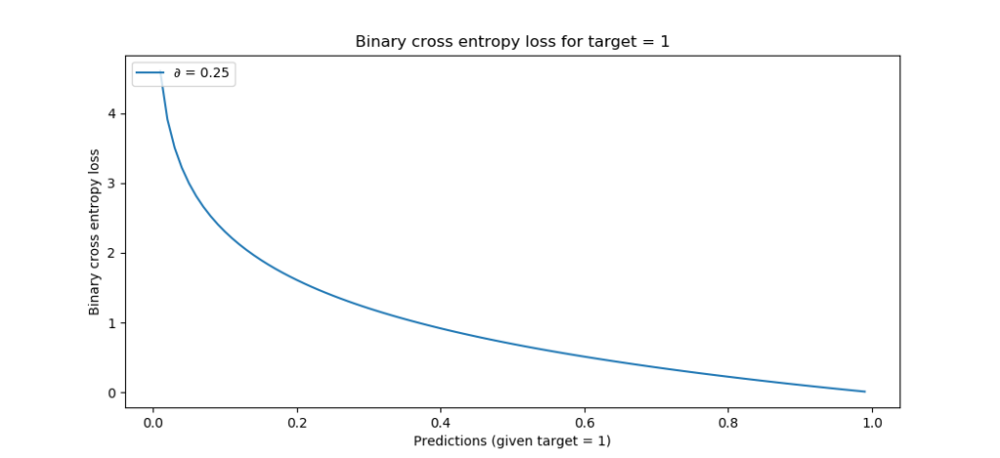

For multiclass classification problems, many online tutorials - and even François Chollet's book _Deep Learning with Python_, which I think is one of the most intuitive books on deep learning with Keras - use **[categorical crossentropy](https://www.machinecurve.com/index.php/2019/10/22/how-to-use-binary-categorical-crossentropy-with-keras/)** for computing the [loss value](https://www.machinecurve.com/index.php/2019/10/04/about-loss-and-loss-functions/) of your neural network.

However, traditional categorical crossentropy requires that your data is one-hot encoded and hence converted into categorical format. Often, this is not what your dataset looks like when you'll start creating your models. Rather, you likely have feature vectors with integer targets - such as 0 to 9 for the numbers 0 to 9.

This means that you'll have to convert these targets first. In Keras, this can be done with `to_categorical`, which essentially applies one-hot encoding to your training set's targets. When applied, you can start using categorical crossentropy.

But did you know that there exists another type of loss - **sparse categorical crossentropy** - with which you can leave the integers as they are, yet benefit from crossentropy loss? I didn't when I just started with Keras, simply because pretty much every article I read performs one-hot encoding before applying regular categorical crossentropy loss.

In this blog, we'll figure out how to _build a convolutional neural network with sparse categorical crossentropy loss_.

We'll create an actual CNN with Keras. It'll be a simple one - an extension of a [CNN that we created before](https://www.machinecurve.com/index.php/2019/09/17/how-to-create-a-cnn-classifier-with-keras/), with the MNIST dataset. However, doing that allows us to compare the model in terms of its performance - to actually see whether sparse categorical crossentropy does as good a job as the regular one.

**After reading this tutorial, you will...**

- Understand what `to_categorical` does when creating your TensorFlow/Keras models.
- Why it's not necessary if you have integer labels/targets, but why you will have to change your loss function.
- How `sparse_categorical_crossentropy` loss can be useful in that case.

Let's go! 😎

_Note that model code is also available [on GitHub](https://github.com/christianversloot/keras-cnn/blob/master/model_sparse.py)._

* * *

**Update 28/Jan/2021:** Added summary and code example to get started straight away. Performed textual improvements, changed header information and slight addition to title of the tutorial.

**Update 17/Nov/2020:** Made the code examples compatible with TensorFlow 2

**Update 01/Feb/2020**: Fixed an error in full model code.

* * *

\[toc\]

* * *

## Summary and code example: tf.keras.losses.sparse\_categorical\_crossentropy

Training a neural network involves passing data forward, through the model, and comparing predictions with ground truth labels. This comparison is done by a loss function. In multiclass classification problems, **categorical crossentropy loss** is the loss function of choice. However, it requires that your labels are one-hot encoded, which is not always the case.

In that case, **sparse categorical crossentropy loss** can be a good choice. This loss function performs the same type of loss - categorical crossentropy loss - but works on integer targets instead of one-hot encoded ones. Saves you that `to_categorical` step which is common with TensorFlow/Keras models!

```
# Compile the model
model.compile(loss=tensorflow.keras.losses.sparse_categorical_crossentropy,
              optimizer=tensorflow.keras.optimizers.Adam(),
              metrics=['accuracy'])
```

* * *

## Sparse categorical crossentropy vs normal categorical crossentropy

Have you also seen lines of code like these in your Keras projects?

```
target_train = tensorflow.keras.utils.to_categorical(target_train, no_classes)
target_test = tensorflow.keras.utils.to_categorical(target_test, no_classes)
```

Most likely, you have - because many blogs explaining how to create multiclass classifiers with Keras apply **categorical crossentropy**, which requires you to one-hot encode your target vectors.

Now you may wonder: what is one-hot encoding?

### One-hot encoding

Suppose that you have a classification problem where you have four target classes: { 0, 1, 2, 3 }.

Your dataset likely comes in this flavor: `{ feature vector } -> target`, where your target is an integer value from { 0, 1, 2, 3 }.

However, as we saw [in another blog on categorical crossentropy](https://www.machinecurve.com/index.php/2019/10/04/about-loss-and-loss-functions/#categorical-crossentropy), its mathematical structure doesn't allow us to feed it integers directly.

We'll have to convert it into categorical format first - with one-hot encoding, or `to_categorical` in Keras.

You'll effectively transform your targets into this:

- For class 0: \[latex\]\[1, 0, 0, 0\]\[/latex\];
- For class 1: \[latex\]\[0, 1, 0, 0\]\[/latex\];
- For class 2: \[latex\]\[0, 0, 1, 0\]\[/latex\];
- For class 3: \[latex\]\[0, 0, 0, 1\]\[/latex\].

Note that when you have more classes, the trick goes on and on - you simply create **n**\-dimensional vectors, where **n** equals the unique number of classes in your dataset.

### Categorical crossentropy

When converted into categorical data, you can apply **[categorical crossentropy](https://www.machinecurve.com/index.php/2019/10/22/how-to-use-binary-categorical-crossentropy-with-keras/)**:


Don't worry - it's a human pitfall to always think defensively when we see maths.

It's not so difficult at all, to be frank, so make sure to read on!

What you see is obviously the categorical crossentropy formula. What it does is actually really simple: it iterates over all the possible classes `C` predicted by the ML during the forward pass of your machine learning training process.

For each class, it takes a look at the target observation of the class - i.e., whether the actual class matching the prediction in your training set is 0 or one. Additionally, it computes the (natural) logarithm of the prediction of the observation (the odds that it belongs to that class). From this, it follows that only one such value is relevant - the _actual_ target. For this, it simply computes the natural log value which increases significantly when it is further away from 1:

[](https://www.machinecurve.com/wp-content/uploads/2019/10/bce.png)

### Sparse categorical crossentropy

Now, it could be the case that your dataset is not categorical at first ... and possibly, that it is too large in order to use `to_categorical`. In that case, it would be rather difficult to use categorical crossentropy, since it is dependent on categorical data.

However, when you have integer targets instead of categorical vectors as targets, you can use **sparse categorical crossentropy**. It's an integer-based version of the categorical crossentropy loss function, which means that we don't have to convert the targets into categorical format anymore.

* * *

## Creating a CNN with TensorFlow 2 and Keras

Let's now create a CNN with Keras that uses sparse categorical crossentropy. In some folder, create a file called `model.py` and open it in some code editor.

### Today's dataset: MNIST

As usual, like in our previous blog on [creating a (regular) CNN with Keras](https://www.machinecurve.com/index.php/2019/09/17/how-to-create-a-cnn-classifier-with-keras/), we use the MNIST dataset. This dataset, which contains thousands of 28x28 pixel handwritten digits (individual numbers from 0-9), is one of the standard datasets in machine learning training programs because it's a very easy and normalized one. The images are also relatively small and high in quantity, which benefits the predictive and generalization power of your model when trained properly. This way, one can really focus on the machine learning aspects of an exercise, rather than the data related issues.

Let's go!

### Software dependencies

If we wish to run the sparse categorical crossentropy Keras CNN, it's necessary to install a few software tools:

- Obviously, you need **TensorFlow**, version 2.x (i.e. some version of 2), which comes with Keras installed as `tensorflow.keras`.
- By consequence, you'll need to install peer dependencies such as **NumPy**. You'll also need them for processing the data.
- In order to run any of those, you need to have a working **Python** installation; preferably, your Python version is 3.6+.

Preferably, you run your model in an **Anaconda** environment. This way, you will be able to install your packages in a unique environment with which other packages do not interfere. Mingling Python packages is often a tedious job, which often leads to trouble. Anaconda resolves this by allowing you to use _environments_ or isolated sandboxes in which your code can run. Really recommended!

### Our model

This will be our model for today:

```
from tensorflow.keras.datasets import mnist
from tensorflow.keras.models import Sequential
from tensorflow.keras.layers import Dense, Dropout, Flatten
from tensorflow.keras.layers import Conv2D, MaxPooling2D

# Model configuration
img_width, img_height = 28, 28
batch_size = 250
no_epochs = 25
no_classes = 10
validation_split = 0.2
verbosity = 1

# Load MNIST dataset
(input_train, target_train), (input_test, target_test) = mnist.load_data()

# Reshape data
input_train = input_train.reshape(input_train.shape[0], img_width, img_height, 1)
input_test = input_test.reshape(input_test.shape[0], img_width, img_height, 1)
input_shape = (img_width, img_height, 1)
    
# Parse numbers as floats
input_train = input_train.astype('float32')
input_test = input_test.astype('float32')

# Normalize data
input_train = input_train / 255
input_test = input_test / 255

# Create the model
model = Sequential()
model.add(Conv2D(32, kernel_size=(3, 3), activation='relu', input_shape=input_shape))
model.add(MaxPooling2D(pool_size=(2, 2)))
model.add(Dropout(0.25))
model.add(Conv2D(64, kernel_size=(3, 3), activation='relu'))
model.add(MaxPooling2D(pool_size=(2, 2)))
model.add(Dropout(0.25))
model.add(Flatten())
model.add(Dense(256, activation='relu'))
model.add(Dense(no_classes, activation='softmax'))

# Compile the model
model.compile(loss=tensorflow.keras.losses.sparse_categorical_crossentropy,
              optimizer=tensorflow.keras.optimizers.Adam(),
              metrics=['accuracy'])

# Fit data to model
model.fit(input_train, target_train,
          batch_size=batch_size,
          epochs=no_epochs,
          verbose=verbosity,
          validation_split=validation_split)

# Generate generalization metrics
score = model.evaluate(input_test, target_test, verbose=0)
print(f'Test loss: {score[0]} / Test accuracy: {score[1]}')
```

Let's break creating the model apart.

#### Adding imports

First, we add our imports - packages and functions that we'll need for our model to work as intended.

```
from tensorflow.keras.datasets import mnist
from tensorflow.keras.models import Sequential
from tensorflow.keras.layers import Dense, Dropout, Flatten
from tensorflow.keras.layers import Conv2D, MaxPooling2D
```

More specifically, we...

- Import the **MNIST** dataset. It comes with Keras by default because it's a perfect dataset for educational purposes. When you use a model with this dataset for the first time, Keras will download the dataset automatically, after which it is stored locally - and you don't ever have to worry about downloading the dataset again. Very user friendly.
- Import the **Sequential API** \- which is one of the two APIs with which engineers can create Keras based models, the other being the Functional API. As Sequential is relatively easier than Functional, we'll use it for this tutorial.
- Import the **Dense** layer, the **Dropout** function and the **Flatten** layer. Dense layers are used for the classification part of the CNN; Dropout adds random noise which reduces the odds of overfitting, and Flatten converts the multidimensional output of the convolutional layers (which interpret your images) into a onedimensional vector to be used by the Dense layers (for classifying the interpretations into the correct classes).
- Additionally, we import **Conv2D** and **MaxPooling2D**, which are used for image interpretation and downscaling - i.e., the first part of your CNN.

#### Model configuration

Next up, model configuration:

```
# Model configuration
img_width, img_height = 28, 28
batch_size = 250
no_epochs = 25
no_classes = 10
validation_split = 0.2
verbosity = 1
```

We specify image width and image height, which are 28 for both given the images in the MNIST dataset. We specify a batch size of 250, which means that during training 250 images at once will be processed. When all images are processed, one completes an **epoch**, of which we will have 25 in total during the training of our model. Additionally, we specify the number of classes in advance - 10, the numbers 0 to 9. 20% of our training set will be set apart for validating the model after every batch, and for educational purposes we set model verbosity to True (1) - which means that all possible output is actually displayed on screen.

#### Preparing MNIST data

Next, we load and prepare the MNIST data:

```
# Load MNIST dataset
(input_train, target_train), (input_test, target_test) = mnist.load_data()

# Reshape data
input_train = input_train.reshape(input_train.shape[0], img_width, img_height, 1)
input_test = input_test.reshape(input_test.shape[0], img_width, img_height, 1)
input_shape = (img_width, img_height, 1)
```

What we do is simple - we use `mnist.load_data()` to load the MNIST data into four Python variables, representing inputs and targets for both the training and testing datasets.

Additionally, we reshape the data so that TensorFlow will accept it.

#### Additional preparations

Additionally, we perform some other preparations which concern the _data_ instead of how it is handled by your system:

```
# Parse numbers as floats
input_train = input_train.astype('float32')
input_test = input_test.astype('float32')

# Normalize data
input_train = input_train / 255
input_test = input_test / 255
```

We first parse the numbers as floats. This benefits the optimization step of the training process.

Additionally, we normalize the data, which benefits the training process as well.

#### Model architecture

We then create the architecture of our model:

```
# Create the model
model = Sequential()
model.add(Conv2D(32, kernel_size=(3, 3), activation='relu', input_shape=input_shape))
model.add(MaxPooling2D(pool_size=(2, 2)))
model.add(Dropout(0.25))
model.add(Conv2D(64, kernel_size=(3, 3), activation='relu'))
model.add(MaxPooling2D(pool_size=(2, 2)))
model.add(Dropout(0.25))
model.add(Flatten())
model.add(Dense(256, activation='relu'))
model.add(Dense(no_classes, activation='softmax'))
```

To be frank: the architecture of our model doesn't really matter for showing that sparse categorical crossentropy really works. In fact, you can use the architecture you think is best for your machine learning problem. However, we put up the architecture above because it is very generic and hence works well in many simple classification scenarios:

- We use two convolutional blocks which comprise a 2-dimensional convolutional layer, max pooling and Dropout. The convolutional layer interprets the features into feature maps, which are subsequently downsampled (made smaller / less granular) by the max pooling operation. Subsequently, random Dropout noise is introduced to reduce the odds of overfitting, which means that your model is tailored too specifically to your training data, and might not work anymore with data it has never seen.
- We then flatten the multidimensional input into a 1-dimensional vector that can be handled by the densely-connected layers. We specify the number of output neurons to `no_classes` which in the case of the MNIST dataset is 10: each neuron generates the probability (summated to one considering all neurons together) that the input belongs to one of the 10 classes in the MNIST scenario.
- We use two Dense layers which essentially give the CNN its classification power. Note that ReLU is used as an [activation function](https://www.machinecurve.com/index.php/2019/09/04/relu-sigmoid-and-tanh-todays-most-used-activation-functions/) throughout all layers given its simplicity and relative power in today's deep learning problems. However, the last layer uses a Softmax activation, which essentially generates a multiclass probability distribution over all the classes that are available in your targets.

#### Model compilation: hyperparameter tuning

We next compile the model, which involves configuring it by means of hyperparameter tuning:

```
# Compile the model
model.compile(loss=tensorflow.keras.losses.sparse_categorical_crossentropy,
              optimizer=tensorflow.keras.optimizers.Adam(),
              metrics=['accuracy'])
```

We specify the loss function used - **sparse categorical crossentropy!** We use it together with the Adam optimizer, which is one of the standard ones used today in very generic scenarios, and use accuracy as an additional metric, since it is more intuitive to humans.

#### Training and evaluation

Next, we fit the data following the specification created in the model configuration step and specify evaluation metrics that test the trained model with the testing data:

```
# Fit data to model
model.fit(input_train, target_train,
          batch_size=batch_size,
          epochs=no_epochs,
          verbose=verbosity,
          validation_split=validation_split)

# Generate generalization metrics
score = model.evaluate(input_test, target_test, verbose=0)
print(f'Test loss: {score[0]} / Test accuracy: {score[1]}')
```

Now, we can start the training process. Open a command prompt, possible the Anaconda one navigating to your environment by means of `conda activate <env_name>`, and navigate to the folder storing `model.py` by means of the `cd` function.

Next, start the training process with Python: `python model.py`.

* * *

## Model performance

You should then see something like this:

```
48000/48000 [==============================] - 21s 431us/step - loss: 0.3725 - acc: 0.8881 - val_loss: 0.0941 - val_acc: 0.9732
Epoch 2/25
48000/48000 [==============================] - 6s 124us/step - loss: 0.0974 - acc: 0.9698 - val_loss: 0.0609 - val_acc: 0.9821
Epoch 3/25
48000/48000 [==============================] - 6s 122us/step - loss: 0.0702 - acc: 0.9779 - val_loss: 0.0569 - val_acc: 0.9832
Epoch 4/25
48000/48000 [==============================] - 6s 124us/step - loss: 0.0548 - acc: 0.9832 - val_loss: 0.0405 - val_acc: 0.9877
Epoch 5/25
48000/48000 [==============================] - 6s 122us/step - loss: 0.0450 - acc: 0.9861 - val_loss: 0.0384 - val_acc: 0.9873
Epoch 6/25
48000/48000 [==============================] - 6s 122us/step - loss: 0.0384 - acc: 0.9877 - val_loss: 0.0366 - val_acc: 0.9886
Epoch 7/25
48000/48000 [==============================] - 5s 100us/step - loss: 0.0342 - acc: 0.9892 - val_loss: 0.0321 - val_acc: 0.9907
Epoch 8/25
48000/48000 [==============================] - 5s 94us/step - loss: 0.0301 - acc: 0.9899 - val_loss: 0.0323 - val_acc: 0.9898
Epoch 9/25
48000/48000 [==============================] - 4s 76us/step - loss: 0.0257 - acc: 0.9916 - val_loss: 0.0317 - val_acc: 0.9907
Epoch 10/25
48000/48000 [==============================] - 4s 76us/step - loss: 0.0238 - acc: 0.9922 - val_loss: 0.0318 - val_acc: 0.9910
Epoch 11/25
48000/48000 [==============================] - 4s 82us/step - loss: 0.0214 - acc: 0.9928 - val_loss: 0.0324 - val_acc: 0.9905
Epoch 12/25
48000/48000 [==============================] - 4s 85us/step - loss: 0.0201 - acc: 0.9934 - val_loss: 0.0296 - val_acc: 0.9907
Epoch 13/25
48000/48000 [==============================] - 4s 88us/step - loss: 0.0173 - acc: 0.9940 - val_loss: 0.0302 - val_acc: 0.9914
Epoch 14/25
48000/48000 [==============================] - 4s 79us/step - loss: 0.0157 - acc: 0.9948 - val_loss: 0.0306 - val_acc: 0.9912
Epoch 15/25
48000/48000 [==============================] - 4s 85us/step - loss: 0.0154 - acc: 0.9949 - val_loss: 0.0308 - val_acc: 0.9910
Epoch 16/25
48000/48000 [==============================] - 4s 84us/step - loss: 0.0146 - acc: 0.9950 - val_loss: 0.0278 - val_acc: 0.9918
Epoch 17/25
48000/48000 [==============================] - 4s 84us/step - loss: 0.0134 - acc: 0.9954 - val_loss: 0.0302 - val_acc: 0.9911
Epoch 18/25
48000/48000 [==============================] - 4s 79us/step - loss: 0.0129 - acc: 0.9956 - val_loss: 0.0280 - val_acc: 0.9922
Epoch 19/25
48000/48000 [==============================] - 4s 80us/step - loss: 0.0096 - acc: 0.9968 - val_loss: 0.0358 - val_acc: 0.9908
Epoch 20/25
48000/48000 [==============================] - 4s 79us/step - loss: 0.0114 - acc: 0.9960 - val_loss: 0.0310 - val_acc: 0.9899
Epoch 21/25
48000/48000 [==============================] - 4s 86us/step - loss: 0.0086 - acc: 0.9970 - val_loss: 0.0300 - val_acc: 0.9922
Epoch 22/25
48000/48000 [==============================] - 4s 88us/step - loss: 0.0088 - acc: 0.9970 - val_loss: 0.0320 - val_acc: 0.9915
Epoch 23/25
48000/48000 [==============================] - 4s 87us/step - loss: 0.0080 - acc: 0.9971 - val_loss: 0.0320 - val_acc: 0.9919
Epoch 24/25
48000/48000 [==============================] - 4s 87us/step - loss: 0.0083 - acc: 0.9969 - val_loss: 0.0416 - val_acc: 0.9887
Epoch 25/25
48000/48000 [==============================] - 4s 86us/step - loss: 0.0083 - acc: 0.9969 - val_loss: 0.0334 - val_acc: 0.9917
Test loss: 0.02523074444185986 / Test accuracy: 0.9932
```

25 epochs as configured, with impressive scores in both the validation and testing phases. It pretty much works as well as the classifier created with categorical crossentropy - and I actually think the difference can be attributed to the relative randomness of the model optimization process:

```
Epoch 25/25
48000/48000 [==============================] - 4s 85us/step - loss: 0.0072 - acc: 0.9975 - val_loss: 0.0319 - val_acc: 0.9925

Test loss: 0.02579820747410522 / Test accuracy: 0.9926
```

* * *

## Recap

Well, today, we've seen how to create a Convolutional Neural Network (and by consequence, any model) with **sparse categorical crossentropy** in Keras. If you have integer targets in your dataset, which happens in many cases, you usually perform `to_categorical` in order to use multiclass crossentropy loss. With sparse categorical crossentropy, this is no longer necessary. This blog demonstrated this by means of an example Keras implementation of a CNN that classifies the MNIST dataset.

Model code is also available [on GitHub](https://github.com/christianversloot/keras-cnn/blob/master/model_sparse.py), if it benefits you.

I hope this blog helped you - if it did, or if you have any questions, let me know in the comments section! 👇 I'm happy to answer any questions you may have 😊 Thanks and enjoy coding!

* * *

## References

Chollet, F. (2017). _Deep Learning with Python_. New York, NY: Manning Publications.

Keras. (n.d.). Losses. Retrieved from [https://keras.io/losses/](https://keras.io/losses/)

How to create a CNN classifier with Keras? – MachineCurve. (2019, September 24). Retrieved from [https://www.machinecurve.com/index.php/2019/09/17/how-to-create-a-cnn-classifier-with-keras](https://www.machinecurve.com/index.php/2019/09/17/how-to-create-a-cnn-classifier-with-keras)

About loss and loss functions – MachineCurve. (2019, October 4). Retrieved from [https://www.machinecurve.com/index.php/2019/10/04/about-loss-and-loss-functions/](https://www.machinecurve.com/index.php/2019/10/04/about-loss-and-loss-functions/)
