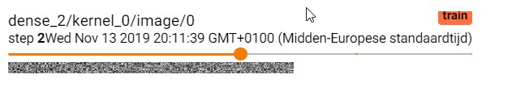
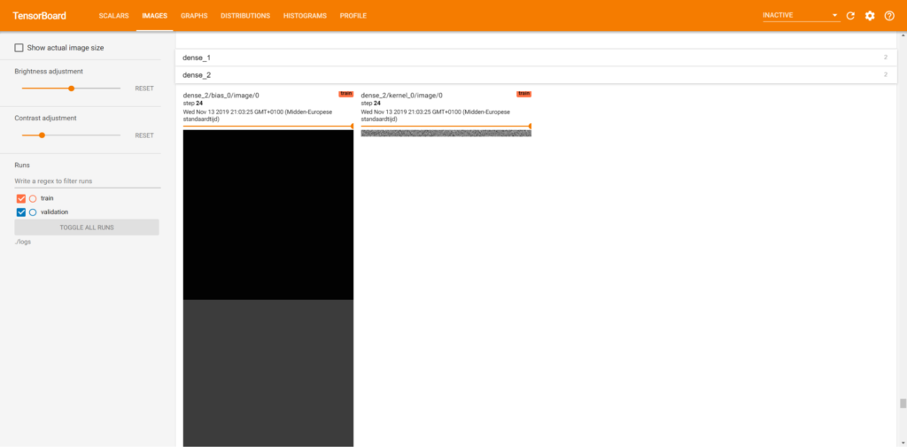
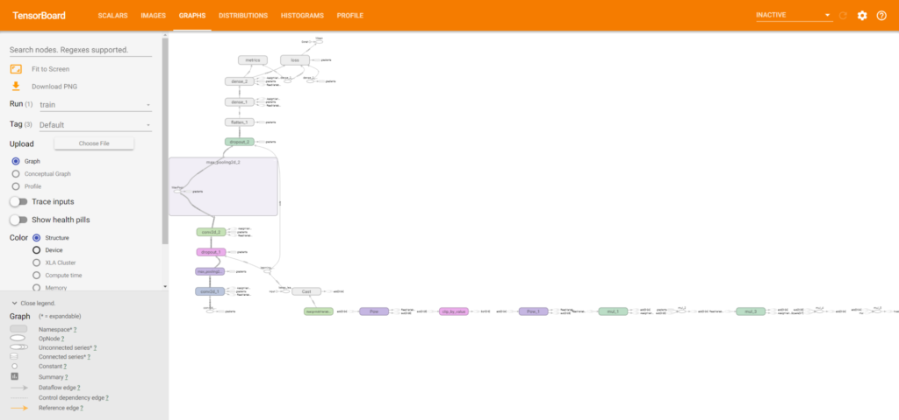
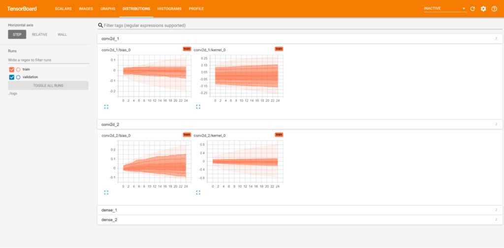
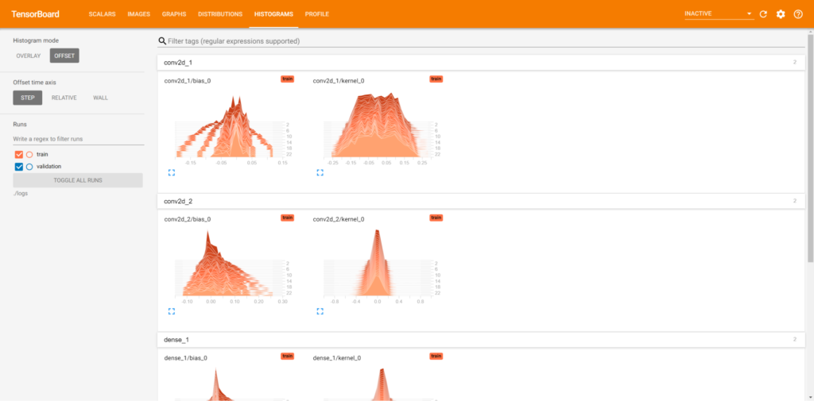

If you want to visualize how your Keras model performs, it's possible to use MachineCurve's tutorial for [visualizing the training process](https://www.machinecurve.com/index.php/2019/10/08/how-to-visualize-the-training-process-in-keras/). Additionally, if you wish to visualize the model yourself, you can [use another tutorial](https://www.machinecurve.com/index.php/2019/10/07/how-to-visualize-a-model-with-keras/).

But are they they only options you've got?

No - not at all!

You may also wish to use TensorBoard, for example.

In this blog post, we'll discover what TensorBoard is, what you can use it for, and how it works with Keras. We specifically take a look at how TensorBoard is integrated into the Keras API by means of [callbacks](https://www.machinecurve.com/index.php/2020/11/10/an-introduction-to-tensorflow-keras-callbacks/), and we take a look at the specific Keras callback that can be used to control TensorBoard.

This is followed by an example implementation of TensorBoard into your Keras model - by means of [our Keras CNN](https://www.machinecurve.com/index.php/2019/09/17/how-to-create-a-cnn-classifier-with-keras/) and the [CIFAR10 dataset](https://www.machinecurve.com/index.php/2019/12/31/exploring-the-keras-datasets/). This way, you'll understand _what it is and how it works_, allowing you to easily implement TensorBoard in your own deep learning model.

Let's go! 😎

In this tutorial, you will learn...

- **What TensorBoard is and why it can be useful.**
- **How TensorBoard is implemented in the TensorFlow/Keras library.**
- **How you can add TensorBoard to your Keras model, and the configuration options you can set.**
- **What TensorBoard looks like after you added it to your model.**

**Update 01/Mar/2021:** made some style improvements and changed title to reflect that this code works with any TF 2 based version, not just TF 2.0.

**Update 13/Jan/2021:** added summary of what you will learn above. Also added internal links about TensorBoard to pages on this website.

**Update 11/Jan/2021:** updated this article to 2021. Ensured compatibility with TensorFlow 2.x, removed references to Theano and CNTK, and added information about PyTorch usage. Fixed spelling mistakes. Added links to other articles on this website. Updated references and article metadata. Added code example for quick usage.

* * *

\[toc\]

* * *

## Code example: using TensorBoard with TensorFlow and Keras

You can use the code example below to get started immediately. If you want to understand TensorBoard and how it can be used in more detail, make sure to continue and read the rest of the article below.

```
# The 'model' variable is a compiled Keras model.

# Import TensorBoard
from tensorflow.keras.callbacks import TensorBoard

# Define Tensorboard as a Keras callback
tensorboard = TensorBoard(
  log_dir='.\logs',
  histogram_freq=1,
  write_images=True
)
keras_callbacks = [
  tensorboard
]

# Fit data to model
model.fit(input_train, target_train,
          batch_size=batch_size,
          epochs=no_epochs,
          verbose=verbosity,
          validation_split=validation_split,
          callbacks=keras_callbacks)
```

* * *

## What is TensorBoard?

Let's turn to the TensorFlow docs for a more elaborate description, as they can describe it best:

> In machine learning, to improve something you often need to be able to measure it. TensorBoard is a tool for providing the measurements and visualizations needed during the machine learning workflow. It enables tracking experiment metrics like loss and accuracy, visualizing the model graph, projecting embeddings to a lower dimensional space, and much more.
> 
> [TensorBoard - Get Started](https://www.tensorflow.org/tensorboard/get_started)

In short, TensorBoard helps you better understand your machine learning model that you generated with TensorFlow. It allows you to measure various aspects - such as the [weights](https://www.machinecurve.com/index.php/2019/08/22/what-is-weight-initialization/), biases, gradients of your model - as well as how they progressed during training (i.e., across epochs). Additionally, you can [visualize model performance](https://www.machinecurve.com/index.php/2019/12/03/visualize-keras-models-overview-of-visualization-methods-tools/) over time, visualize classes in a multidimensional space, and so on.

Quite exciting!

Fortunately, TensorBoard integrates natively with Keras. Let's find out how it does next 😊

* * *

## TensorBoard and the Keras API

Keras provides TensorBoard in the form of a _[callback](https://www.machinecurve.com/index.php/2020/11/10/an-introduction-to-tensorflow-keras-callbacks/)_, which is "a set of functions to be applied at given stages of the training procedure" (Keras, n.d.). According to the Keras website, they can be used to take a look at the model's internals and statistics during training, but also afterwards.

An exemplary combination of Keras callbacks is [EarlyStopping and ModelCheckpoint](https://www.machinecurve.com/index.php/2019/05/30/avoid-wasting-resources-with-earlystopping-and-modelcheckpoint-in-keras/), which you can use to (1) identify whether your model's performance is still increasing, and if not, stop it, while (2) always [saving](https://www.machinecurve.com/index.php/2020/02/14/how-to-save-and-load-a-model-with-keras/) the best model to disk.

In January 2021, Keras defined the **TensorBoard** callback as follows (Keras, n.d.):

```
tf.keras.callbacks.tensorboard_v1.TensorBoard(log_dir='./logs', histogram_freq=0, batch_size=32, write_graph=True, write_grads=False, write_images=False, embeddings_freq=0, embeddings_layer_names=None, embeddings_metadata=None, embeddings_data=None, update_freq='epoch')
```

Let's break the arguments for the `TensorBoard` callback apart and describe what they do and how they work. This is mainly based on the description provided in the Keras API docs for the TensorBoard callback (TensorFlow, n.d.):

- With `log_dir` you specify the path to the directory where Keras saves the log files that you can later read when starting the actual TensorBoard.
- The histogram frequency, or `histogram_freq`, determines the frequency (in number of epochs) for compute weight histograms for all layers of the model (Sunside, n.d.). If `histogram_freq = 0`, no histograms will be computed, and computing them requires validation data to be present. [Click here to understand them more deeply.](#about-histogram_freq-what-are-weight-histograms)
- If you choose to compute these histograms, you can also specify the batch size with the `batch_size` attribute. It defaults to 32, but is only relevant if you compute histograms. The larger the batch size, the higher the memory requirements for your system.
- If you don't wish to visualize the graph of your model, as you can also do [with Keras-native functions](https://www.machinecurve.com/index.php/2019/10/07/how-to-visualize-a-model-with-keras/), you can choose to set `write_graph` to `False`. By default, it's set to `True` and your network graph will be visualized.
- While `histogram_freq` can be used to visualize the histograms of your layer _weights_ across epochs, you may also wish to visualize the distribution of _gradients_ for every layer. If `histogram_freq = True`, you can also set `write_grads` to True, which generates gradient histograms as well.
- Some people are more into numbers while others are more into visuals. For the latter, setting `write_images` to `True` results in the fact that Keras generates images for the weights based on the numbers present. This may allow you to spot patterns in weight changes, even if you're not too much into numbers! Very useful.
- The Keras TensorBoard callback also provides quite some functions related to _embeddings_. We'll cover these next. However, like me, it may be that your knowledge about embeddings isn't really... up to date, to say it nicely. In that case, I've attempted to explain the concept of embeddings briefly as part of this blog post - [and you can find it here](#about-embeddings-in-tensorboard-what-are-they). I hope it helps you.
- With `embeddings_freq`, like the `histogram_freq`, you can specify how often embeddings should be saved in the logs. The number you specify is the number of epochs. If set to zero, no embeddings will be saved.
- The attribute `embeddings_layer_names` can be used to specify the layers at which embeddings should be learnt. They do not necessarily have to be learnt at the most downstream layer of your neural network, but can be learnt e.g. in the middle, allowing you to find out whether e.g. a model has too many layers. With this attribute, you can specify the layers at which the embeddings should be learnt and visualized in TensorBoard.
- In `embeddings_metadata`, you provide a dictionary of file names per layer in `embeddings_layer_names`. Each file essentially contains the _targets_ of the samples you'll use next, in corresponding order.
- In `embeddings_data`, you specify the data which should be used to generate the embeddings learnt. That is, you generate the visualization based on `embeddings_data` and `embeddings_metadata`. While often, test data is suitable, you can also use data that does not belong to training and testing data. This is up to you.
- Finally, with `update_freq`, you can specify how often data should be written to `log_dir` logs. You can either configure `batch`, `epoch` or an integer number. If you set `update_freq` to `batch`, logs will be written after each batch (which, in Keras, you set as `batch_size` when calling `model.fit`). This may especially be useful when you use a minibatch [gradient descent](https://www.machinecurve.com/index.php/2019/10/24/gradient-descent-and-its-variants/) (or [gradient descent-like](https://www.machinecurve.com/index.php/2019/11/03/extensions-to-gradient-descent-from-momentum-to-adabound/)) optimizer. However, when you set the update frequency to `epoch`, it writes logs after each epoch, as if it were a batch SGD approach. You can also configure the update frequency to be an integer value `n`, which means that logs are written every `n` samples. The Keras docs warn you here: "writing too frequently (...) can slow down your training" (Keras, n.d.).

Next, we'll dive more deeply into questions arising from the Keras API, specifically these ones:

- What are weight histograms?
- What do weight images look like?
- What are TensorBoard embeddings?
- Does TensorBoard also work with PyTorch?

If you're interested in any or multiple of those, I'd say: read on! 😎

If not, that's also fine 😊 - but in that case, it's best to [click here and move to the section about implementing the Keras model with TensorBoard](#implementing-tensorboard-into-your-keras-model).

### About `histogram_freq`: what are weight histograms?

Yep, those fancy weight histograms you can specify with `histogram_freq` when configuring TensorBoard with Keras 😎

Well, what are they?

Let's take a look at some examples:


Here, we see the _bias_ values and the true _weight_ values for the second and first [convolutional layer](https://www.machinecurve.com/index.php/2020/03/30/how-to-use-conv2d-with-keras/) in our model (which we specify later 😉), but then when we configured it to train for only 5 epochs.

A weight histogram essentially tells you something about the distribution of your weights: visualize a histogram as many buckets where you can drop balls into. When a weight equals the (very small) range for one bucket, you drop the weight (represented by the ball) into that particular bucket. At the end, you can take a global look and see how many weights have landed in every bucket. This is your histogram.

By inspecting weight histograms over time (i.e., by epoch), you can see how the distribution of weights or biases has changed over time. This leads to three important observations:

- If the weight histograms for some layers didn't change at all in terms of their shape (e.g., the second image above), you can easily say that this layer didn't participate in learning. Question yourself if this layer is actually necessary, and if your architecture requires a change.
- If the weight histograms changed much, your layer contributed significantly to learning. Good! Also question (and perhaps test empirically) whether adding additional layers might capture the dataset even better.
- If the weight histograms changed significantly, but not extremely (e.g. in the first histogram, where the peak of the histogram essentially moved to the left over time), it's likely that you don't really need to change your architecture.

Yep - what seemed difficult at first is actually really simple 😊

### About `write_images`: what do weight images look like?

It may be that you wish to compare weights and how they changed over time. You may do so numerically, by inspecting the _numbers_ - but this doesn't work for everyone.

Especially when you're very visually oriented, you may wish to compare visuals rather than numbers, and yay - TensorBoard with Keras supports this. By configuring `write_images`, you can actually visualize the weights as an image:



That's great!

### About embeddings in TensorBoard: what are they?

When I came across the embeddings part of the TensorBoard callback, I was quite confused.

What the \*bleep\* are they?

It cost me quite some time to understand them, and I bet you don't fully understand them (yet!) either, since you're reading this text.

I'll try to explain them as intuitively as possible. We'll do so by means of the TensorFlow docs, which you can find in the references as TensorFlow (n.d.).

If you wish to represent words, or objects - since we can also generate embeddings of images, such as the ones present in the MNIST or CIFAR10 datasets - you'll have to convert them into _categorical vectors_ or _integers_. These approaches are relatively inefficient and arbitrary, which either results in longer training times or missing relationships between objects.

[Embeddings](https://www.machinecurve.com/index.php/2020/03/03/classifying-imdb-sentiment-with-keras-and-embeddings-dropout-conv1d/) enter the picture here. They allow you to map an object (say, a word, or an image) into a high-dimensional space by specifying coordinates for each dimension. For a two-dimensional space, that would be (x, y) coordinates. Often, you would want to use higher-dimensional spaces, because this makes your representation more accurate.

Let's make it more intuitive. Take a look at this point cloud:

https://www.youtube.com/watch?v=MPHPJ5mBTA8

...which allows you to map points into a three-dimensional space: they are represented by (x, y, z) coordinates. _What_ you plot is the actual color and other details of the point as measured by e.g. a LiDAR device.

Now suppose that instead of LiDAR measurement, you map samples from the MNIST dataset to (x, y, z) coordinates. That is, you map these images to the point cloud, generating a three-dimensional space... _an embedding_.

The question you now may have is as follows: **how are [embeddings](https://www.machinecurve.com/index.php/2020/03/03/classifying-imdb-sentiment-with-keras-and-embeddings-dropout-conv1d/) generated?**

Well, they are learnt - at least in TensorFlow (TensorFlow, n.d.). Embeddings are initialized randomly, and the table representing classes vertically and the many dimensions horizontally is learnt during the training process. This way, you can generate really cool embeddings, such as this one for the MNIST dataset:

https://www.youtube.com/watch?v=0W6o4chVxfk

### Can TensorBoard be used when using PyTorch?

Yes, TensorBoard [can be used with PyTorch](https://pytorch.org/docs/stable/tensorboard.html).

* * *

_You may also be interested in:_

- [How to visualize your Keras model without TensorBoard?](https://www.machinecurve.com/index.php/2019/10/07/how-to-visualize-a-model-with-keras/)

* * *

## Implementing TensorBoard into your Keras model

### What model will we create today?

Simple. We're going to use the [Keras CNN](https://www.machinecurve.com/index.php/2019/09/17/how-to-create-a-cnn-classifier-with-keras/) that we already created before, as it is relatively simple and achieves adequate performance across a wide range of machine learning tasks.

If you wish to understand how to create a convolutional neural network with Keras, specifically using Conv2D layers, click the link above 😄

### What dataset will we use?

We're going to use the [CIFAR10 dataset](https://www.machinecurve.com/index.php/2019/12/31/exploring-the-keras-datasets/). This one, like the MNIST one, also comes with Keras by default (Keras, n.d.). It's a 32x32 pixel dataset representing common objects across ten classes, and when visualized looks as follows:


Ten randomly generated samples from the CIFAR10 dataset.

If you wish to read more about the dataset, please feel free to look around at the [University of Toronto website](https://www.cs.toronto.edu/~kriz/cifar.html), which is home of the dataset 😊

### What you'll need to run this model

As with any software scenario, you'll need a fair share of dependencies if you wish to run the TensorBoard based Keras CNN successfully:

- Obviously, you'll need **TensorFlow** version 2.x, which includes Keras by default.
- For both, you'll need a recent version of **Python**.
- Additionally, but only if you wish to visualize the dataset, you'll need **Matplotlib**.

### Specifying the imports

Now that we know _what_ you need, we can actually create the model.

Open your Explorer and create a file in a directory of your choice with a name of your choice, e.g. `model_cifar10_tensorboard.py`, as I called it.

Let's next specify the imports:

```
import tensorflow.keras
from tensorflow.keras.datasets import cifar10
from tensorflow.keras.models import Sequential
from tensorflow.keras.layers import Dense, Dropout, Flatten
from tensorflow.keras.layers import Conv2D, MaxPooling2D
from tensorflow.keras.callbacks import TensorBoard
from time import time
```

They are really simple:

- We import Keras itself;
- We import the CIFAR10 dataset;
- We import the Sequential API for stacking our layers on top of each other;
- We import the Dense, Dropout, Flatten, [Conv2D](https://www.machinecurve.com/index.php/2020/03/30/how-to-use-conv2d-with-keras/) and [MaxPooling2D](https://www.machinecurve.com/index.php/2020/01/30/what-are-max-pooling-average-pooling-global-max-pooling-and-global-average-pooling/) layers - refer to [this post](https://www.machinecurve.com/index.php/2019/09/17/how-to-create-a-cnn-classifier-with-keras/) if you wish to understand them in more detail.
- We import `TensorBoard` from the Keras callbacks.

### Model configuration & loading CIFAR10 data

Next, we configure the model, which is essentially just a configuration of image width and height, batch size, epochs, classes, [validation split](https://www.machinecurve.com/index.php/2020/11/16/how-to-easily-create-a-train-test-split-for-your-machine-learning-model/) and verbosity - just the regular stuff:

```
# Model configuration
img_width, img_height = 32, 32
batch_size = 250
no_epochs = 25
no_classes = 10
validation_split = 0.2
verbosity = 1
```

And (which is why I love Keras) we next [import the data](https://www.machinecurve.com/index.php/2019/12/31/exploring-the-keras-datasets/) with one line of code (or two, if we include the comment):

```
# Load CIFAR10 dataset
(input_train, target_train), (input_test, target_test) = cifar10.load_data()
```

### Optional: data visualization

Now, if you wish to visualize the data, a.k.a. create this plot...


...this is what you'll have to add:

```
# Visualize CIFAR10 dataset
import matplotlib.pyplot as plt
classes = {
  0: 'airplane',
  1: 'automobile',
  2: 'bird',
  3: 'cat',
  4: 'deer',
  5: 'dog',
  6: 'frog',
  7: 'horse',
  8: 'ship',
  9: 'truck'
}
fig, axes = plt.subplots(2,5, sharex=True)
axes[0,0].imshow(input_train[0])
axes[0,1].imshow(input_train[1])
axes[0,2].imshow(input_train[2])
axes[0,3].imshow(input_train[3])
axes[0,4].imshow(input_train[4])
axes[1,0].imshow(input_train[5])
axes[1,1].imshow(input_train[6])
axes[1,2].imshow(input_train[7])
axes[1,3].imshow(input_train[8])
axes[1,4].imshow(input_train[9])
axes[0,0].set_title(classes[target_train[0][0]])
axes[0,1].set_title(classes[target_train[1][0]])
axes[0,2].set_title(classes[target_train[2][0]])
axes[0,3].set_title(classes[target_train[3][0]])
axes[0,4].set_title(classes[target_train[4][0]])
axes[1,0].set_title(classes[target_train[5][0]])
axes[1,1].set_title(classes[target_train[6][0]])
axes[1,2].set_title(classes[target_train[7][0]])
axes[1,3].set_title(classes[target_train[8][0]])
axes[1,4].set_title(classes[target_train[9][0]])
axes[0,0].set_axis_off()
axes[0,1].set_axis_off()
axes[0,2].set_axis_off()
axes[0,3].set_axis_off()
axes[0,4].set_axis_off()
axes[1,0].set_axis_off()
axes[1,1].set_axis_off()
axes[1,2].set_axis_off()
axes[1,3].set_axis_off()
axes[1,4].set_axis_off()
plt.show()
```

Which is a bunch of code that just tells Matplotlib to visualize the first ten samples of the CIFAR10 dataset you just imported as one plot with ten sub plots.

### Data preparation

Now, we can prepare our data, which comprises these steps:

- Setting the [shape of our input data](https://www.machinecurve.com/index.php/2020/04/05/how-to-find-the-value-for-keras-input_shape-input_dim/), which is of shape `(img_width, img_height, 3)` because we're working with RGB and hence three-channel images.
- Converting the input data into `float32` format, which apparently [speeds up the training process](https://www.machinecurve.com/index.php/2020/09/16/tensorflow-model-optimization-an-introduction-to-quantization/) (Quora, n.d.).
- Input data [normalization](https://www.machinecurve.com/index.php/2020/11/19/how-to-normalize-or-standardize-a-dataset-in-python/).
- Generating [categorical data from the integer targets](https://www.machinecurve.com/index.php/2020/11/24/one-hot-encoding-for-machine-learning-with-tensorflow-and-keras/), allowing us to use [categorical crossentropy](https://www.machinecurve.com/index.php/2019/10/22/how-to-use-binary-categorical-crossentropy-with-keras/) for computing loss.

```
# Set input shape
input_shape = (img_width, img_height, 3)

# Parse numbers as floats
input_train = input_train.astype('float32')
input_test = input_test.astype('float32')

# Normalize data
input_train = input_train / 255
input_test = input_test / 255

# Convert target vectors to categorical targets
target_train = tensorflow.keras.utils.to_categorical(target_train, no_classes)
target_test = tensorflow.keras.utils.to_categorical(target_test, no_classes)
```

### Model architecture

Next, we can specify the model architecture:

```
# Create the model
model = Sequential()
model.add(Conv2D(32, kernel_size=(3, 3), activation='relu', input_shape=input_shape))
model.add(MaxPooling2D(pool_size=(2, 2)))
model.add(Dropout(0.25))
model.add(Conv2D(64, kernel_size=(3, 3), activation='relu'))
model.add(MaxPooling2D(pool_size=(2, 2)))
model.add(Dropout(0.25))
model.add(Flatten())
model.add(Dense(256, activation='relu'))
model.add(Dense(no_classes, activation='softmax'))
```

It's a relatively simple [convolutional](https://www.machinecurve.com/index.php/2018/12/07/convolutional-neural-networks-and-their-components-for-computer-vision/) architecture, with two convolutional blocks comprising [conv layers](https://www.machinecurve.com/index.php/2020/03/30/how-to-use-conv2d-with-keras/), [max pooling](https://www.machinecurve.com/index.php/2020/01/30/what-are-max-pooling-average-pooling-global-max-pooling-and-global-average-pooling/) and [dropout](https://www.machinecurve.com/index.php/2019/12/18/how-to-use-dropout-with-keras/), followed by two Dense layers, with flattening in between.

Refer to [this post](https://www.machinecurve.com/index.php/2019/09/17/how-to-create-a-cnn-classifier-with-keras/) if you wish to understand this architecture in more detail.

### Model compilation & fitting data

Next, we can compile our model - i.e., add our configuration or the model's hyperparameters - and fit the data:

```
# Compile the model
model.compile(loss=tensorflow.keras.losses.categorical_crossentropy,
              optimizer=tensorflow.keras.optimizers.Adam(),
              metrics=['accuracy'])

# Define Tensorboard as a Keras callback
tensorboard = TensorBoard(
  log_dir='.\logs',
  histogram_freq=1,
  write_images=True
)
keras_callbacks = [
  tensorboard
]

# Fit data to model
model.fit(input_train, target_train,
          batch_size=batch_size,
          epochs=no_epochs,
          verbose=verbosity,
          validation_split=validation_split,
          callbacks=keras_callbacks)
```

Compiling the model involves specifying a loss function ([categorical crossentropy](https://www.machinecurve.com/index.php/2019/10/22/how-to-use-binary-categorical-crossentropy-with-keras/)), an [optimizer](https://www.machinecurve.com/index.php/2019/11/03/extensions-to-gradient-descent-from-momentum-to-adabound/) and an additional metric - which is not too exciting.

Fitting the data to the compiled model is neither (you just specify the data, the number of epochs, batch size, and so on) - except for one thing: the additional [callbacks](https://www.machinecurve.com/index.php/2020/11/10/an-introduction-to-tensorflow-keras-callbacks/) variable that we added.

And this `callbacks` variable refers to `keras_callbacks`, which is an array of Keras callbacks that we apply to this model - in this case, `tensorboard`!

Tensorboard, or `tensorboard`, in its own is the implementation as defined by the Keras API. In our case, we save logs at `.\logs`, generate weight histograms after each epochs, and do write weight images to our logs. Take a look at the API spec above if you wish to understand the choices you can make.

### Model evaluation

Finally, we add this evaluation code which tells you how well the trained model performs based on the testing data - i.e., how well it [generalizes](https://www.machinecurve.com/index.php/2020/12/01/how-to-check-if-your-deep-learning-model-is-underfitting-or-overfitting/) to data it has never seen before:

```
# Generate generalization metrics
score = model.evaluate(input_test, target_test, verbose=0)
print(f'Test loss: {score[0]} / Test accuracy: {score[1]}')
```

### Full model code

If you're interested in the full model code - here you go:

```
import tensorflow.keras
from tensorflow.keras.datasets import cifar10
from tensorflow.keras.models import Sequential
from tensorflow.keras.layers import Dense, Dropout, Flatten
from tensorflow.keras.layers import Conv2D, MaxPooling2D
from tensorflow.keras.callbacks import TensorBoard
from time import time

# Model configuration
img_width, img_height = 32, 32
batch_size = 250
no_epochs = 25
no_classes = 10
validation_split = 0.2
verbosity = 1

# Load CIFAR10 dataset
(input_train, target_train), (input_test, target_test) = cifar10.load_data()

# Visualize CIFAR10 dataset
import matplotlib.pyplot as plt
classes = {
  0: 'airplane',
  1: 'automobile',
  2: 'bird',
  3: 'cat',
  4: 'deer',
  5: 'dog',
  6: 'frog',
  7: 'horse',
  8: 'ship',
  9: 'truck'
}
fig, axes = plt.subplots(2,5, sharex=True)
axes[0,0].imshow(input_train[0])
axes[0,1].imshow(input_train[1])
axes[0,2].imshow(input_train[2])
axes[0,3].imshow(input_train[3])
axes[0,4].imshow(input_train[4])
axes[1,0].imshow(input_train[5])
axes[1,1].imshow(input_train[6])
axes[1,2].imshow(input_train[7])
axes[1,3].imshow(input_train[8])
axes[1,4].imshow(input_train[9])
axes[0,0].set_title(classes[target_train[0][0]])
axes[0,1].set_title(classes[target_train[1][0]])
axes[0,2].set_title(classes[target_train[2][0]])
axes[0,3].set_title(classes[target_train[3][0]])
axes[0,4].set_title(classes[target_train[4][0]])
axes[1,0].set_title(classes[target_train[5][0]])
axes[1,1].set_title(classes[target_train[6][0]])
axes[1,2].set_title(classes[target_train[7][0]])
axes[1,3].set_title(classes[target_train[8][0]])
axes[1,4].set_title(classes[target_train[9][0]])
axes[0,0].set_axis_off()
axes[0,1].set_axis_off()
axes[0,2].set_axis_off()
axes[0,3].set_axis_off()
axes[0,4].set_axis_off()
axes[1,0].set_axis_off()
axes[1,1].set_axis_off()
axes[1,2].set_axis_off()
axes[1,3].set_axis_off()
axes[1,4].set_axis_off()
plt.show()

# Set input shape
input_shape = (img_width, img_height, 3)

# Parse numbers as floats
input_train = input_train.astype('float32')
input_test = input_test.astype('float32')

# Convert them into black or white: [0, 1].
input_train = input_train / 255
input_test = input_test / 255

# Convert target vectors to categorical targets
target_train = tensorflow.keras.utils.to_categorical(target_train, no_classes)
target_test = tensorflow.keras.utils.to_categorical(target_test, no_classes)

# Create the model
model = Sequential()
model.add(Conv2D(32, kernel_size=(3, 3), activation='relu', input_shape=input_shape))
model.add(MaxPooling2D(pool_size=(2, 2)))
model.add(Dropout(0.25))
model.add(Conv2D(64, kernel_size=(3, 3), activation='relu'))
model.add(MaxPooling2D(pool_size=(2, 2)))
model.add(Dropout(0.25))
model.add(Flatten())
model.add(Dense(256, activation='relu'))
model.add(Dense(no_classes, activation='softmax'))

# Compile the model
model.compile(loss=tensorflow.keras.losses.categorical_crossentropy,
              optimizer=tensorflow.keras.optimizers.Adam(),
              metrics=['accuracy'])

# Define Tensorboard as a Keras callback
tensorboard = TensorBoard(
  log_dir='.\logs',
  histogram_freq=1,
  write_images=True
)
keras_callbacks = [
  tensorboard
]

# Fit data to model
model.fit(input_train, target_train,
          batch_size=batch_size,
          epochs=no_epochs,
          verbose=verbosity,
          validation_split=validation_split,
          callbacks=keras_callbacks)

# Generate generalization metrics
score = model.evaluate(input_test, target_test, verbose=0)
print(f'Test loss: {score[0]} / Test accuracy: {score[1]}')
```

* * *

## Starting the training process

Now, you can start the training process by simply opening a terminal that covers the dependencies that we listed before. `cd` to the directory you saved your model to, and start training with Python, with e.g. `python model_cifar10_tensorboard.py`.

Normally, your model would start the training process, but I ran into this error at first:

```
tensorflow.python.framework.errors_impl.NotFoundError: Failed to create a directory: ./logs/1573629879\train; No such file or directory [Op:CreateSummaryFileWriter]
```

...if you're facing this, take a close look at how you specify the `log_dir` in your `TensorBoard` callback. If you specify your directory as e.g. `/this/is/a/dir`, it won't work. Instead, when you specify your logs directory as `\this\is\a\dir`, it will 😊

Now, the training process should commence, and you'll have to wait a bit to see results flowing in 😄

In my case, for the training process and the evaluation step, the results were as follows:

```
40000/40000 [==============================] - 6s 151us/step - loss: 1.7320 - accuracy: 0.3748 - val_loss: 1.4869 - val_accuracy: 0.4693
Epoch 2/25
40000/40000 [==============================] - 4s 103us/step - loss: 1.3774 - accuracy: 0.5084 - val_loss: 1.2976 - val_accuracy: 0.5448
Epoch 3/25
40000/40000 [==============================] - 4s 103us/step - loss: 1.2614 - accuracy: 0.5557 - val_loss: 1.1788 - val_accuracy: 0.5959
Epoch 4/25
40000/40000 [==============================] - 4s 105us/step - loss: 1.1687 - accuracy: 0.5863 - val_loss: 1.1033 - val_accuracy: 0.6199
Epoch 5/25
40000/40000 [==============================] - 4s 103us/step - loss: 1.1042 - accuracy: 0.6119 - val_loss: 1.0838 - val_accuracy: 0.6263
Epoch 6/25
40000/40000 [==============================] - 4s 101us/step - loss: 1.0471 - accuracy: 0.6307 - val_loss: 1.0273 - val_accuracy: 0.6428
Epoch 7/25
40000/40000 [==============================] - 4s 102us/step - loss: 0.9940 - accuracy: 0.6548 - val_loss: 0.9785 - val_accuracy: 0.6638
Epoch 8/25
40000/40000 [==============================] - 4s 102us/step - loss: 0.9554 - accuracy: 0.6669 - val_loss: 0.9411 - val_accuracy: 0.6739
Epoch 9/25
40000/40000 [==============================] - 4s 104us/step - loss: 0.9162 - accuracy: 0.6781 - val_loss: 0.9323 - val_accuracy: 0.6745
Epoch 10/25
40000/40000 [==============================] - 4s 106us/step - loss: 0.8866 - accuracy: 0.6895 - val_loss: 0.8977 - val_accuracy: 0.6880
Epoch 11/25
40000/40000 [==============================] - 4s 104us/step - loss: 0.8484 - accuracy: 0.7008 - val_loss: 0.8895 - val_accuracy: 0.6926
Epoch 12/25
40000/40000 [==============================] - 4s 108us/step - loss: 0.8119 - accuracy: 0.7171 - val_loss: 0.8796 - val_accuracy: 0.6969
Epoch 13/25
40000/40000 [==============================] - 4s 110us/step - loss: 0.7792 - accuracy: 0.7264 - val_loss: 0.8721 - val_accuracy: 0.6986
Epoch 14/25
40000/40000 [==============================] - 4s 108us/step - loss: 0.7480 - accuracy: 0.7369 - val_loss: 0.8384 - val_accuracy: 0.7127
Epoch 15/25
40000/40000 [==============================] - 4s 111us/step - loss: 0.7214 - accuracy: 0.7481 - val_loss: 0.8160 - val_accuracy: 0.7191
Epoch 16/25
40000/40000 [==============================] - 4s 112us/step - loss: 0.6927 - accuracy: 0.7575 - val_loss: 0.8109 - val_accuracy: 0.7215
Epoch 17/25
40000/40000 [==============================] - 5s 113us/step - loss: 0.6657 - accuracy: 0.7660 - val_loss: 0.8163 - val_accuracy: 0.7203
Epoch 18/25
40000/40000 [==============================] - 5s 113us/step - loss: 0.6400 - accuracy: 0.7747 - val_loss: 0.7908 - val_accuracy: 0.7282
Epoch 19/25
40000/40000 [==============================] - 5s 115us/step - loss: 0.6099 - accuracy: 0.7869 - val_loss: 0.8109 - val_accuracy: 0.7236
Epoch 20/25
40000/40000 [==============================] - 5s 115us/step - loss: 0.5808 - accuracy: 0.7967 - val_loss: 0.7823 - val_accuracy: 0.7364
Epoch 21/25
40000/40000 [==============================] - 5s 120us/step - loss: 0.5572 - accuracy: 0.8049 - val_loss: 0.7999 - val_accuracy: 0.7231
Epoch 22/25
40000/40000 [==============================] - 5s 114us/step - loss: 0.5226 - accuracy: 0.8170 - val_loss: 0.8005 - val_accuracy: 0.7310
Epoch 23/25
40000/40000 [==============================] - 5s 114us/step - loss: 0.5092 - accuracy: 0.8203 - val_loss: 0.7951 - val_accuracy: 0.7341
Epoch 24/25
40000/40000 [==============================] - 5s 124us/step - loss: 0.4890 - accuracy: 0.8291 - val_loss: 0.8062 - val_accuracy: 0.7257
Epoch 25/25
40000/40000 [==============================] - 5s 124us/step - loss: 0.4627 - accuracy: 0.8370 - val_loss: 0.8146 - val_accuracy: 0.7325
Test loss: 0.823152067565918 / Test accuracy: 0.7271000146865845
```

* * *

## Viewing model performance in TensorBoard

We can now inspect model performance in TensorBoard!

Once the [training process](https://www.machinecurve.com/index.php/2019/10/04/about-loss-and-loss-functions/#the-high-level-supervised-learning-process) is finished, execute this command in the same terminal:

```
tensorboard --logdir=./logs
```

(note that you may wish to change the `--logdir` flag if you used a different `log_dir` in your Keras callback)

This is what you likely see next:

```
Serving TensorBoard on localhost; to expose to the network, use a proxy or pass --bind_all
TensorBoard 2.0.0 at http://localhost:6006/ (Press CTRL+C to quit)
```

In that case, you can open a browser, navigate to http://localhost:6006, and see TensorBoard! 😍

### TensorBoard Scalars tab

...which opens with the Scalars tab:

[](https://www.machinecurve.com/wp-content/uploads/2019/11/image-1.png)

This tab essentially shows you how the training process happened over time by showing you the [loss value](https://www.machinecurve.com/index.php/2019/10/04/about-loss-and-loss-functions/) (for [training and validation data](https://www.machinecurve.com/index.php/2020/11/16/how-to-easily-create-a-train-test-split-for-your-machine-learning-model/)) as well as other metrics. On the left, you can configure the charts.

### TensorBoard Images tab

Next, you can move to the Images tab:

[](https://www.machinecurve.com/wp-content/uploads/2019/11/image-2.png)

This tab shows you the weight images that you could configure with `write_images`.

### TensorBoard Graphs tab

The Graphs tab shows you the network graph created by Keras when training your model:

[](https://www.machinecurve.com/wp-content/uploads/2019/11/image-6.png)

### TensorBoard Distributions tab

The Distributions tab shows you how the weights and biases are distributed per iteration:

[](https://www.machinecurve.com/wp-content/uploads/2019/11/image-4.png)

### TensorBoard Histograms tab

Finally, the Histograms tab shows the weights histograms which help you determine how the model learnt:

[](https://www.machinecurve.com/wp-content/uploads/2019/11/image-5.png)

In the case of our model that learns to classify based on the [CIFAR10 dataset](https://www.machinecurve.com/index.php/2019/12/31/exploring-the-keras-datasets/), it becomes clear that it has primarily learnt by _slightly_ adapting the [weights](https://www.machinecurve.com/index.php/2019/08/22/what-is-weight-initialization/) of some models, and by _steering_ the biases quite substantially. This eventually reflects a 72.7% test accuracy.

* * *

## Summary

In this blog post, we've seen quite a few things with respect to TensorBoard and Keras:

- What it is;
- What it can be used for;
- How to use TensorBoard with Keras;
- And how its results can subsequently be viewed in TensorBoard.

I hope you've learnt something from today's blog post! If you did, feel free to leave comment below 👇, especially if you have questions or think I made mistakes and/or can improve my post in any way.

Thank you for visiting MachineCurve today and happy engineering 😊

* * *

## References

Keras. (n.d.). Callbacks. Retrieved from [https://keras.io/callbacks/#callback](https://keras.io/callbacks/#callback)

TensorFlow. (n.d.). _Tf.keras.callbacks.TensorBoard_. [https://www.tensorflow.org/api\_docs/python/tf/keras/callbacks/TensorBoard](https://www.tensorflow.org/api_docs/python/tf/keras/callbacks/TensorBoard)

Sunside. (n.d.). Understanding TensorBoard (weight) histograms. Retrieved from [https://stackoverflow.com/questions/42315202/understanding-tensorboard-weight-histograms](https://stackoverflow.com/questions/42315202/understanding-tensorboard-weight-histograms)

TensorFlow. (n.d.). Word embeddings. Retrieved from [https://www.tensorflow.org/tutorials/text/word\_embeddings#word\_embeddings\_2](https://www.tensorflow.org/tutorials/text/word_embeddings#word_embeddings_2)

Quora. (n.d.). When should I use tf.float32 vs tf.float64 in TensorFlow? Retrieved from [https://www.quora.com/When-should-I-use-tf-float32-vs-tf-float64-in-TensorFlow](https://www.quora.com/When-should-I-use-tf-float32-vs-tf-float64-in-TensorFlow)

TensorFlow. (n.d.). Get started with TensorBoard. Retrieved from [https://www.tensorflow.org/tensorboard/get\_started](https://www.tensorflow.org/tensorboard/get_started)

Keras. (n.d.). Callbacks – TensorBoard. Retrieved from [https://keras.io/callbacks/#tensorboard](https://keras.io/callbacks/#tensorboard)

PyTorch. (n.d.). _Torch.utils.tensorboard — PyTorch 1.7.0 documentation_. [https://pytorch.org/docs/stable/tensorboard.html](https://pytorch.org/docs/stable/tensorboard.html)
