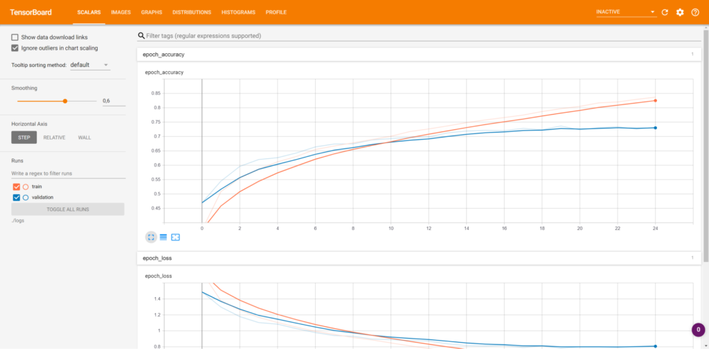
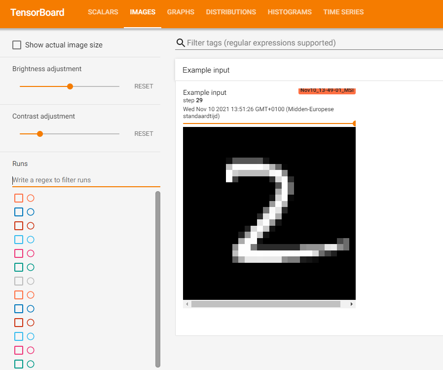
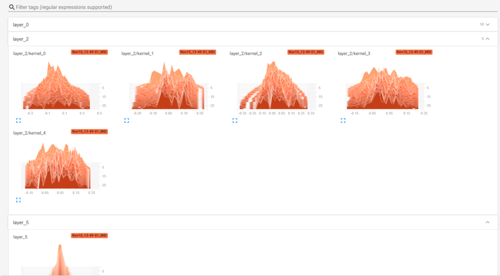

When your Deep Learning model is training, you are interested in how well it performs. Often, it's possible to output a variety of metrics on the fly. But did you know that there are tools for visualizing how performance evolves over time - and even allowing you to see performance over time _after_ training was finished?

TensorBoard is one such tool. Originally intended for the TensorFlow library (including Keras models), it's a web application which reads log files from a directory and displays a variety of charts that can be very useful. Fun fact: it's also available for PyTorch! And precisely that is what we're going to build in today's article.

First of all, we're going to start with taking a look at TensorBoard. What is it capable of doing? How is TensorBoard available in PyTorch (hint: through the `SummaryWriter`)? This includes working on a real example that adds TensorBoard to your PyTorch model.

Are you ready? Let's take a look! 😎

* * *

\[toc\]

* * *

## What is TensorBoard?

People who create stuff can usually know best how to describe what they created - and the same is true for the creators of TensorBoard:

> _In machine learning, to improve something you often need to be able to measure it. TensorBoard is a tool for providing the measurements and visualizations needed during the machine learning workflow. It enables tracking experiment metrics like_ [loss](https://www.machinecurve.com/index.php/2019/10/04/about-loss-and-loss-functions/) _and accuracy, visualizing the model graph, projecting embeddings to a lower dimensional space, and much more._
> 
> [TensorBoard – Get Started](https://www.tensorflow.org/tensorboard/get_started)

In other words, it's a tool for visualizing the machine learning experiments you performed in a variety of ways.

Indeed, it's possible to generate a large amount of plots when using TensorBoard. For example, using **weight histograms**, it's possible to see how the distribution of your layer weights evolved over time - in this case, over five epochs:


In another screen, you can see how loss has evolved over the epochs:



[And so on. And so on.](https://www.machinecurve.com/index.php/2019/11/13/how-to-use-tensorboard-with-keras/#viewing-model-performance-in-tensorboard)

Installing TensorBoard must be done separately to your PyTorch install. Doing so is not difficult, fortunately, and can be done by simply executing `pip` via `pip install tensorboard`.

* * *

## TensorBoard in PyTorch using the `SummaryWriter`

TensorBoard was originally developed for TensorFlow. As you saw above, it is also available for PyTorch! But how? Through the `SummaryWriter`:

> The SummaryWriter class provides a high-level API to create an event file in a given directory and add summaries and events to it. The class updates the file contents asynchronously. This allows a training program to call methods to add data to the file directly from the training loop, without slowing down training.
> 
> PyTorch (n.d.)

Great!

This means that we can create a `SummaryWriter` (or, fully: `torch.utils.tensorboard.writer.SummaryWriter`) and use it to write away the data that we want.

Recall from the article [linked above](https://www.machinecurve.com/index.php/2019/11/13/how-to-use-tensorboard-with-keras/#viewing-model-performance-in-tensorboard) that TensorBoard provides a variety of tabs:

- The **scalar tab** for showing how the training process happened over time by means of displaying scalars (e.g., in a line plot).
- The **images tab** for showing images written away during the training process.
- The **graphs tab** showing the network graph created by (in the original case) TensorFlow during training.
- The **distributions tab** showing the distributions of the weights and biases of your network for every iteration.
- The **histograms tab** showing the weight and bias histograms helping you determine how the model learned what it learned.
- The **embeddings tab** visualizes learned embeddings.

It's possible to write from PyTorch to each of these tabs:

- Using `add_scalar` (or `add_scalars`), you can write scalar data to the scalar tab.
- By means of `add_image` (or `add_images`), images can be written to the images tab. Besides, it is also possible to write Matplotlib figures using `add_figure`. And if you have videos (for example by having an array with multiple images), `add_video` can be used.
- Through `add_graph`, graph data can be written to TensorBoard's graphs tab.
- With `add_histogram`, you can write histogram data to the histogram tab.
- Via `add_embedding`, embedding data can be written to the embeddings tab.
- You can also use `add_audio` for audio data and `add_text` for text data. `add_mesh` can be used for 3D point cloud data.
- And there is a lot more!

In other words, it's possible to fully recreate the TensorBoard experience you're used to when coming from TensorFlow... but then using PyTorch!

* * *

## Adding TensorBoard to your PyTorch model

Let's now take a look at _how_ we can use TensorBoard with PyTorch by means of an example.

Please ensure that you have installed both PyTorch (and its related packages such as `torchvision`) as well as TensorBoard (if not: `pip install tensorboard`) before continuing.

Adding TensorBoard to your PyTorch model will take a few simple steps:

1. Starting with a simple Convolutional Neural Network.
2. Initializing the `SummaryWriter` which allows us to write to TensorBoard.
3. Writing away some scalar values, both individually and in groups.
4. Writing away images, graphs and histograms.

This will give you a rough idea how TensorBoard can be used, leaving sufficient [room for experimentation](https://pytorch.org/docs/stable/generated/torch.nn.functional.pad.html#torch.nn.functional.pad) with all the other TensorBoard functionality available in PyTorch.

### A simple ConvNet to start with

In a different article, [we created a simple Convolutional Neural Network](https://www.machinecurve.com/index.php/2021/07/08/convolutional-neural-networks-with-pytorch/) for classifying MNIST digits. Let's use that code here and expand it with the `SummaryWriter` for

```
import os
import torch
from torch import nn
from torchvision.datasets import MNIST
from torch.utils.data import DataLoader
from torchvision import transforms

class ConvNet(nn.Module):
  '''
    Simple Convolutional Neural Network
  '''
  def __init__(self):
    super().__init__()
    self.layers = nn.Sequential(
      nn.Conv2d(1, 10, kernel_size=3),
      nn.ReLU(),
      nn.Conv2d(10, 5, kernel_size=3),
      nn.ReLU(),
      nn.Flatten(),
      nn.Linear(24 * 24 * 5, 64),     
      nn.ReLU(),
      nn.Linear(64, 32),
      nn.ReLU(),
      nn.Linear(32, 10)
    )


  def forward(self, x):
    '''Forward pass'''
    return self.layers(x)
  
  
if __name__ == '__main__':
  
  # Set fixed random number seed
  torch.manual_seed(42)
  
  # Prepare CIFAR-10 dataset
  dataset = MNIST(os.getcwd(), download=True, transform=transforms.ToTensor())
  trainloader = torch.utils.data.DataLoader(dataset, batch_size=10, shuffle=True, num_workers=1)
  
  # Initialize the ConvNet
  convnet = ConvNet()
  
  # Define the loss function and optimizer
  loss_function = nn.CrossEntropyLoss()
  optimizer = torch.optim.Adam(convnet.parameters(), lr=1e-4)
  
  # Run the training loop
  for epoch in range(0, 5): # 5 epochs at maximum
    
    # Print epoch
    print(f'Starting epoch {epoch+1}')
    
    # Set current loss value
    current_loss = 0.0
    
    # Iterate over the DataLoader for training data
    for i, data in enumerate(trainloader, 0):
      
      # Get inputs
      inputs, targets = data
      
      # Zero the gradients
      optimizer.zero_grad()
      
      # Perform forward pass
      outputs = convnet(inputs)
      
      # Compute loss
      loss = loss_function(outputs, targets)
      
      # Perform backward pass
      loss.backward()
      
      # Perform optimization
      optimizer.step()
      
      # Print statistics
      current_loss += loss.item()
      if i % 500 == 499:
          print('Loss after mini-batch %5d: %.3f' %
                (i + 1, current_loss / 500))
          current_loss = 0.0

  # Process is complete.
  print('Training process has finished.')
```

### Initializing the SummaryWriter

Add the `SummaryWriter` to your imports first:

```
import os
import torch
from torch import nn
from torchvision.datasets import MNIST
from torch.utils.data import DataLoader
from torch.utils.tensorboard import SummaryWriter
from torchvision import transforms
```

Then, directly after the `__name__` check, initialize it:

```
if __name__ == '__main__':

  # Initialize the SummaryWriter for TensorBoard
  # Its output will be written to ./runs/
  writer = SummaryWriter()
```

We can now use TensorBoard within PyTorch :)

### Writing scalar values and groups to TensorBoard from PyTorch

If we inspect the code above, a prime candidate for writing to TensorBoard is the **loss value**. It is a simple value and hence can be represented as a _scalar_, and thus be written using `add_scalar`.

First, we add a new counter just after we start the training loop:

```
  # Run the training loop
  loss_idx_value = 0
```

Then, we add the `add_scalar` call to our code - we write away the `current_loss` variable for the current index value, which we then increase with one.

```
      # Print statistics
      current_loss += loss.item()
      writer.add_scalar("Loss", current_loss, loss_idx_value)
      loss_idx_value += 1
      if i % 500 == 499:
          print('Loss after mini-batch %5d: %.3f' %
                (i + 1, current_loss / 500))
          current_loss = 0.0
```

Because `current_loss` is reset after every 500th minibatch, we're likely going to see a _wavy_ pattern.

Let's now run the Python script - and when training finishes, you can start TensorBoard as follows _from the directory where your script is located_:

```
tensorboard --logdir=runs
```

You should then see the following:

```
(pytorch) C:\Users\Chris\Test>tensorboard --logdir=runs
Serving TensorBoard on localhost; to expose to the network, use a proxy or pass --bind_all
TensorBoard 2.6.0 at http://localhost:6006/ (Press CTRL+C to quit)
```

Let's go visit [localhost](http://localhost:6006/)!

Indeed, a wavy pattern. This makes sense, because loss is reset continuously. Fortunately, we also see a lower loss range - indicating that our maximum loss per epoch is decreasing, suggesting that the model gets better.


If we want, we can also group multiple graphs in a **scalar group**, this way:

```
  # Run the training loop
  loss_idx_value = 0
  for epoch in range(0, 5): # 5 epochs at maximum
    
    # Print epoch
    print(f'Starting epoch {epoch+1}')
    
    # Set current loss value
    current_loss = 0.0
    
    # Iterate over the DataLoader for training data
    for i, data in enumerate(trainloader, 0):
      
      # Get inputs
      inputs, targets = data
      
      # Zero the gradients
      optimizer.zero_grad()
      
      # Perform forward pass
      outputs = convnet(inputs)
      
      # Compute loss
      loss = loss_function(outputs, targets)
      
      # Perform backward pass
      loss.backward()
      
      # Perform optimization
      optimizer.step()
      
      # Print statistics
      current_loss += loss.item()
      writer.add_scalar("Loss/Minibatches", current_loss, loss_idx_value)
      loss_idx_value += 1
      if i % 500 == 499:
          print('Loss after mini-batch %5d: %.3f' %
                (i + 1, current_loss / 500))
          current_loss = 0.0

    # Write loss for epoch
    writer.add_scalar("Loss/Epochs", current_loss, epoch)
```

We can now see loss at _minibatch level_ (including the resets) and _epoch level_ (which is more smooth) - all under the umbrella term of "Loss". This way, you can construct multiple groups which contain many visualizations.


### Writing network graphs, images and weight histograms to TensorBoard using PyTorch

#### Graphs

Using `add_graph`, you can write the network graph to TensorBoard so that it can be visualized. This is how to do it:

```
    # Iterate over the DataLoader for training data
    for i, data in enumerate(trainloader, 0):
      
      # Get inputs
      inputs, targets = data

      # Write the network graph at epoch 0, batch 0
      if epoch == 0 and i == 0:
        writer.add_graph(convnet, input_to_model=data[0], verbose=False)
```

Et voila:


#### Images

Suppose that you have _image data_ available during the training process - for example, random selections from your batches, weight visualizations or e.g. Activation Maximization values - then you can use `add_image` in the following way:

```
      # Write an image at every batch 0
      if i == 0:
        writer.add_image("Example input", inputs[0], global_step=epoch)
```

At every 0th minibatch (i.e. at the start of every epoch), this writes the first input image to TensorBoard.



#### Weight histograms

Visualizing weight histograms in TensorBoard takes a bit more time, because PyTorch doesn't natively support making weight histograms. Since its APIs are really accessible, it is not very difficult to replicate this behavior either. Let's take a look at what must be done for passing weight histograms to TensorBoard:

_Please do note that the functionality below only works with `Conv2d` and `Linear` layers. All others will be skipped. If you need other layers, please feel free to let me know through the comments, and I will try to add them!_

```
def weight_histograms_conv2d(writer, step, weights, layer_number):
  weights_shape = weights.shape
  num_kernels = weights_shape[0]
  for k in range(num_kernels):
    flattened_weights = weights[k].flatten()
    tag = f"layer_{layer_number}/kernel_{k}"
    writer.add_histogram(tag, flattened_weights, global_step=step, bins='tensorflow')


def weight_histograms_linear(writer, step, weights, layer_number):
  flattened_weights = weights.flatten()
  tag = f"layer_{layer_number}"
  writer.add_histogram(tag, flattened_weights, global_step=step, bins='tensorflow')


def weight_histograms(writer, step, model):
  print("Visualizing model weights...")
  # Iterate over all model layers
  for layer_number in range(len(model.layers)):
    # Get layer
    layer = model.layers[layer_number]
    # Compute weight histograms for appropriate layer
    if isinstance(layer, nn.Conv2d):
      weights = layer.weight
      weight_histograms_conv2d(writer, step, weights, layer_number)
    elif isinstance(layer, nn.Linear):
      weights = layer.weight
      weight_histograms_linear(writer, step, weights, layer_number)
```

Add these Python `def`s above the `__main__` check. Here's what they do, from the bottom to the top one:

- With `weight_histograms`, you iterate over all layers in the model, check whether the layer is a `nn.Conv2d` or `nn.Linear` type of layer, and then proceed with the relevant definition.
- In `weight_histograms_linear`, we take the layer weights, flatten everything, and pass them to `writer` for making the histogram.
- In `weight_histograms_conv2d`, we do almost the same, except for doing it at _kernel_ level. This is how it's done in TensorFlow too.

You can then add the call to your code:

```
  # Run the training loop
  loss_idx_value = 0
  for epoch in range(0, 5): # 5 epochs at maximum

    # Visualize weight histograms
    weight_histograms(writer, epoch, convnet)
```

It's then possible to see weight histograms in your TensorBoard page (_note that the network below was trained for 30 epochs_):



* * *

## Full model code

Should you wish to use everything at once, here you go:

```
import os
import torch
from torch import nn
from torchvision.datasets import MNIST
from torch.utils.data import DataLoader
from torch.utils.tensorboard import SummaryWriter
from torchvision import transforms
import numpy as np

class ConvNet(nn.Module):
  '''
    Simple Convolutional Neural Network
  '''
  def __init__(self):
    super().__init__()
    self.layers = nn.Sequential(
      nn.Conv2d(1, 10, kernel_size=3),
      nn.ReLU(),
      nn.Conv2d(10, 5, kernel_size=3),
      nn.ReLU(),
      nn.Flatten(),
      nn.Linear(24 * 24 * 5, 64),     
      nn.ReLU(),
      nn.Linear(64, 32),
      nn.ReLU(),
      nn.Linear(32, 10)
    )


  def forward(self, x):
    '''Forward pass'''
    return self.layers(x)


def weight_histograms_conv2d(writer, step, weights, layer_number):
  weights_shape = weights.shape
  num_kernels = weights_shape[0]
  for k in range(num_kernels):
    flattened_weights = weights[k].flatten()
    tag = f"layer_{layer_number}/kernel_{k}"
    writer.add_histogram(tag, flattened_weights, global_step=step, bins='tensorflow')


def weight_histograms_linear(writer, step, weights, layer_number):
  flattened_weights = weights.flatten()
  tag = f"layer_{layer_number}"
  writer.add_histogram(tag, flattened_weights, global_step=step, bins='tensorflow')


def weight_histograms(writer, step, model):
  print("Visualizing model weights...")
  # Iterate over all model layers
  for layer_number in range(len(model.layers)):
    # Get layer
    layer = model.layers[layer_number]
    # Compute weight histograms for appropriate layer
    if isinstance(layer, nn.Conv2d):
      weights = layer.weight
      weight_histograms_conv2d(writer, step, weights, layer_number)
    elif isinstance(layer, nn.Linear):
      weights = layer.weight
      weight_histograms_linear(writer, step, weights, layer_number)
  
  
if __name__ == '__main__':

  # Initialize the SummaryWriter for TensorBoard
  # Its output will be written to ./runs/
  writer = SummaryWriter()
  
  # Set fixed random number seed
  torch.manual_seed(42)
  
  # Prepare CIFAR-10 dataset
  dataset = MNIST(os.getcwd(), download=True, transform=transforms.ToTensor())
  trainloader = torch.utils.data.DataLoader(dataset, batch_size=10, shuffle=True, num_workers=1)
  
  # Initialize the ConvNet
  convnet = ConvNet()
  
  # Define the loss function and optimizer
  loss_function = nn.CrossEntropyLoss()
  optimizer = torch.optim.Adam(convnet.parameters(), lr=1e-4)
  
  # Run the training loop
  loss_idx_value = 0
  for epoch in range(0, 30): # 5 epochs at maximum


    # Visualize weight histograms
    weight_histograms(writer, epoch, convnet)
    
    # Print epoch
    print(f'Starting epoch {epoch+1}')
    
    # Set current loss value
    current_loss = 0.0
    
    # Iterate over the DataLoader for training data
    for i, data in enumerate(trainloader, 0):

      if i > 1000:
        break
      
      # Get inputs
      inputs, targets = data

      # Write the network graph at epoch 0, batch 0
      if epoch == 0 and i == 0:
        writer.add_graph(convnet, input_to_model=data[0], verbose=True)

      # Write an image at every batch 0
      if i == 0:
        writer.add_image("Example input", inputs[0], global_step=epoch)
      
      # Zero the gradients
      optimizer.zero_grad()
      
      # Perform forward pass
      outputs = convnet(inputs)
      
      # Compute loss
      loss = loss_function(outputs, targets)
      
      # Perform backward pass
      loss.backward()
      
      # Perform optimization
      optimizer.step()
      
      # Print statistics
      current_loss += loss.item()
      writer.add_scalar("Loss/Minibatches", current_loss, loss_idx_value)
      loss_idx_value += 1
      if i % 500 == 499:
          print('Loss after mini-batch %5d: %.3f' %
                (i + 1, current_loss / 500))
          current_loss = 0.0

    # Write loss for epoch
    writer.add_scalar("Loss/Epochs", current_loss, epoch)

  # Process is complete.
  print('Training process has finished.')
```

That's it! You have successfully integrated your PyTorch model with TensorBoard.

* * *

## References

PyTorch. (n.d.). _Torch.utils.tensorboard — PyTorch 1.7.0 documentation_. [https://pytorch.org/docs/stable/tensorboard.html](https://pytorch.org/docs/stable/tensorboard.html)

TensorFlow. (n.d.). _Get started with TensorBoard_. [https://www.tensorflow.org/tensorboard/get\_started](https://www.tensorflow.org/tensorboard/get_started)
