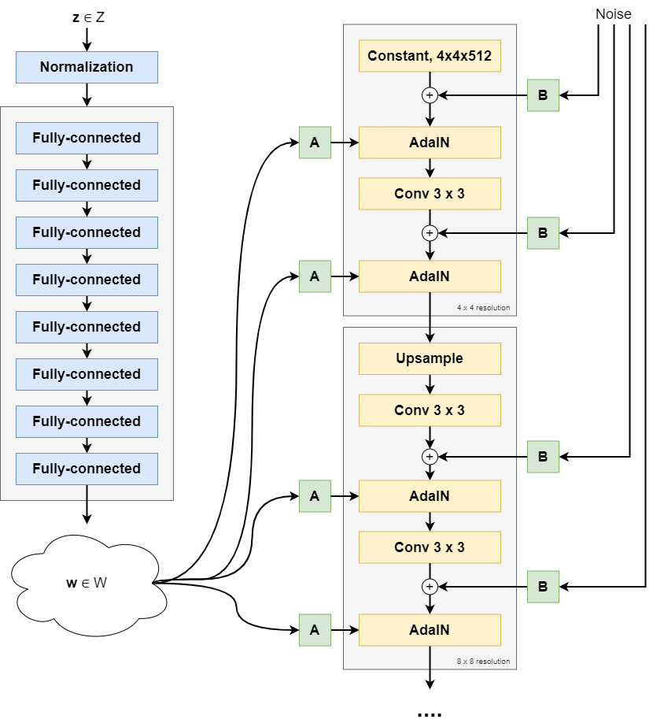
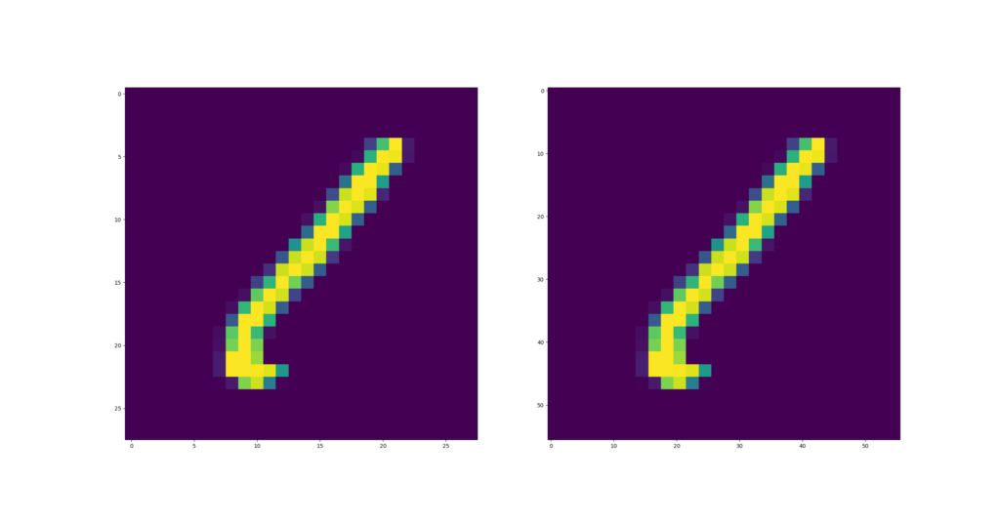

Within computer vision, upsampling is a relatively common practice these days. Whereas Convolutional layers and Pooling layers make inputs _smaller_, or _downsample the inputs_, we sometimes want to perform the opposite as well.

This is called Upsampling, and in today's tutorial you're going to learn how you can perform upsampling with the PyTorch deep learning library.

Upsampling is commonly used within encoder-decoder architectures and within Generative Adversarial Networks, such as [StyleGAN](https://www.machinecurve.com/index.php/2021/12/27/stylegan-a-step-by-step-introduction/).

In today's tutorial, we will take a look at three different things:

1. **What upsampling involves**. Conceptually, and very briefly, we're taking a look at what happens when an image is upsampled.
2. **The PyTorch Upsample layer**. We take a look at how upsampling is implemented within PyTorch, one of today's leading deep learning libraries.
3. **A PyTorch based Upsample example**. You will also move from theory into practice, by learning how to perform upsampling within PyTorch by means of an example.

Are you ready? Let's take a look 😎

* * *

\[toc\]

* * *

## What is upsampling?

Here's the Wikipedia explanation of upsampling:

> When upsampling is performed on a sequence of samples of a _signal_ or other continuous function, it produces an approximation of the sequence that would have been obtained by sampling the signal at a higher rate (or [density](https://en.wikipedia.org/wiki/Dots_per_inch), as in the case of a photograph).
> 
> Wikipedia (2004)

In other words: you have an input, in computer vision frequently an image, that has a specific size. For example, you have an MNIST image that is 28 x 28 pixels and has one color channel. That is, a grayscale image.


Instead of 28x28 pixels, you want the image to be 56x56 pixels. This is when, in the words of the Wikipedia page, you will need to _produce an approximation as if you'd sampled at a higher rate or density_. In other words, if you imagine one MNIST sample to be a photograph, when upsampling you'd _approximate_ as if _you would have made a larger-pixel image with better equipment_.

If you cannot distinguish between the approximation and the true image, upsampling has succeeded. As you will see next, there are multiple interpolation algorithms for upsampling - but let's take a look at a usecase for upsampling first.

* * *

## Upsampling use: encoder-decoder architectures

Below, you can see the architecture of the [StyleGAN](https://www.machinecurve.com/index.php/2021/12/27/stylegan-a-step-by-step-introduction/) generative adversarial network. The left side produces a so-called _latent vector_ which is used subsequently in the _synthesis network_ that produces an output picture:



The synthesis network consists of a number of blocks that produce an image of a specific resolution, which is then used to increase image size even further. For example, in the picture above you see a 4 x 4 resolution for the first block, followed by an 8 x 8 pixel resolution, all the way to a 1024 x 1024 pixels image size.

Between each block, _upsampling_ takes place. After the last adaptive instance normalization element in each block, an upsample step is performed to increase the _current output_ to something larger than the image output of the next block. Using a Convolutional layer, important input features from the previous block are learned by the next block, to which noise and styles are then added for control and randomness in the image synthesis process.

Read the [StyleGAN article](https://www.machinecurve.com/index.php/2021/12/27/stylegan-a-step-by-step-introduction/) for a deep dive into that specific GAN, but hopefully this makes it clear how upsampling can be used within your neural network! :)

* * *

## PyTorch Upsample layer

In PyTorch, upsampling is built into the `torch.nn.Upsample` class representing a layer called `Upsample` that can be added to your neural network:

> Upsamples a given multi-channel 1D (temporal), 2D (spatial) or 3D (volumetric) data.
> 
> PyTorch (n.d.)

In other words, it works with both 1D, 2D and 3D data:

- 1D data is a one-dimensional array and is associated with timeseries (with one list element representing one time step). This is why 1D data is called _temporal_.
- 2D data is a two-dimensional array and associated with images, _spatial_.
- 3D data is a three-dimensional array and often associated with real-world data (pointcloud scans, and so forth) or videos.

The `Upsample` layer is made available in the following way:

`torch.nn.Upsample(_size=None_, _scale_factor=None_, _mode='nearest'_, _align_corners=None_)`

### Configurable attributes

These attributes can be configured:

- With `size`, the target output size can be represented. For example, if you have a 28 x 28 pixel image you wish to upsample to 56 x 56 pixels, you specify `size=(56, 56)`.
- If you don't use size, you can also specify a `scale_factor`, which scales the inputs.
- Through `mode`, it is possible to configure the interpolation algorithm used for filling in the empty pixels created after image shape was increased. It's possible to pick one of `'nearest'`, `'linear'`, `'bilinear'`, `'bicubic'` and `'trilinear'`. By default, it's `nearest`.
- Finally, to handle certain upsampling algorithms (linear, bilinear, trilinear), it's possible to set `align_corners` to `True`. This way, the corner points keep the same value whatever the interpolation output.

* * *

## PyTorch Upsample example

The example below shows you how you can use upsampling in a 2D setting, with images from the MNIST dataset.

It contains multiple parts:

- **The imports**. We're going to depend on certain Python features and external libraries, such as `torch`, `torchvision` and `matplotlib`. As we're working with the MNIST dataset, we need to import it as well. These imports are fairly standard when creating a machine learning model with PyTorch.
- **The nn.Module** **\- a.k.a. the neural network**. As this tutorial involves using the Upsampling functionality within PyTorch, today's neural network is called `UpsampleExample`. It does only one thing: stack one `Upsample` layer in a `Sequential` block, which resizes inputs to `(56, 56)` shape and uses nearest neighbor interpolation for filling up the 'empty' pixels. The `forward` definition simply feeds the inputs to the layers and returns the result.
- **The main segment**. Firstly, we prepare the MNIST dataset by creating an instance of the `MNIST` class, which downloads the data if necessary. In addition, a Tensorfication of the input data is performed before any data will be passed to the neural network. Secondly, a `DataLoader` is initialized on top of the `dataset`, which shuffles and selects data using a preconfigured batch size (of 10 images). Thirdly, the upsample example is initialized, and we perform an iteration over the (first) batch. For each batch, we feed the data through the neural network, and pick the first example for visualization with Matplotlib.

```
import os
import torch
from torch import nn
from torchvision.datasets import MNIST
from torch.utils.data import DataLoader
from torchvision import transforms
import matplotlib.pyplot as plt

class UpsampleExample(nn.Module):
  '''
    Simple example for upsampling
  '''
  def __init__(self):
    super().__init__()
    self.layers = nn.Sequential(
      nn.Upsample(size=(56,56), mode = 'nearest')
    )


  def forward(self, x):
    '''Forward pass'''
    return self.layers(x)
  
  
if __name__ == '__main__':
  
  # Prepare MNIST
  dataset = MNIST(os.getcwd(), download=True, transform=transforms.ToTensor())
  trainloader = torch.utils.data.DataLoader(dataset, batch_size=10, shuffle=True, num_workers=1)
  
  # Initialize the upsample_example
  upsample_example = UpsampleExample()
  
  # Iterate over the DataLoader for training data
  for i, data in enumerate(trainloader, 0):
    
    # Get inputs
    inputs, targets = data

    # Take just one input
    before_upsampling = inputs
    
    # Perform forward pass
    after_upsampling = upsample_example(before_upsampling)[0]
    
    # Visualize subplots
    fig, (ax1, ax2) = plt.subplots(1, 2)
    ax1.imshow(before_upsampling[0].reshape((28, 28)))
    ax2.imshow(after_upsampling.reshape(56, 56))
    plt.show()
```

After upsampling, this is what the inputs look like:

[](https://www.machinecurve.com/wp-content/uploads/2021/12/afterupsampling.png)

On the left, you can see the image before upsampling. On the right, the image after upsampling.

You can see that the image pretty much stayed the same - but from the axes, you can see that it became bigger.

From 28x28 pixels (the default sample shape of an MNIST sample), the image is now 56 x 56 pixels.

Successfully upsampled with PyTorch! :D

* * *

## References

PyTorch. (n.d.). _Upsample — PyTorch 1.10.1 documentation_. [https://pytorch.org/docs/stable/generated/torch.nn.Upsample.html](https://pytorch.org/docs/stable/generated/torch.nn.Upsample.html)

Wikipedia. (2004, December 23). _Upsampling_. Wikipedia, the free encyclopedia. Retrieved December 28, 2021, from [https://en.wikipedia.org/wiki/Upsampling](https://en.wikipedia.org/wiki/Upsampling)
