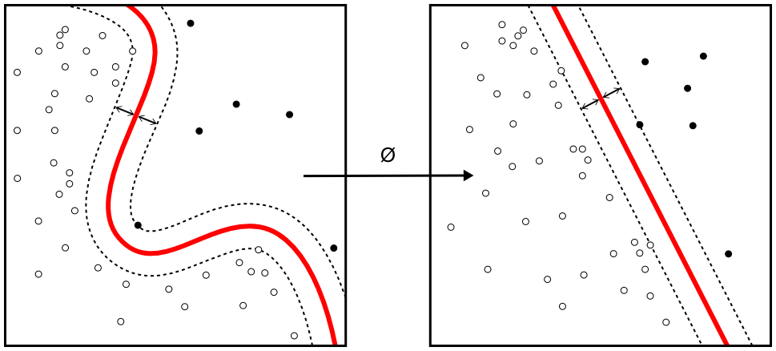
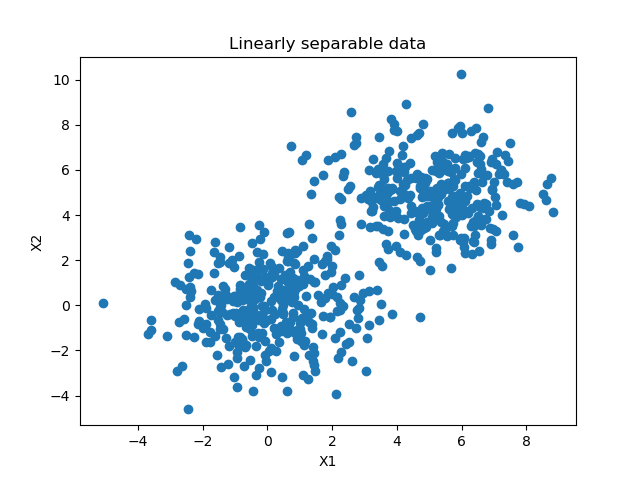
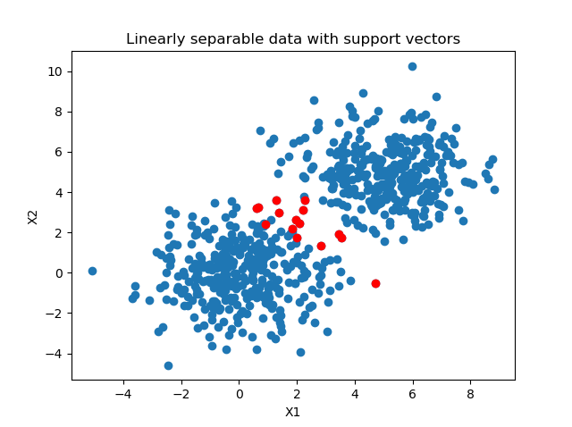

In today's world filled with buzz about deep neural networks, Support Vector Machines remain a widely used class of machine learning algorithms.

The machines, which construct a hyperplane that aims to separate between classes in your dataset by maximizing the margin using _support vectors_, are still pretty useful when your number of samples is relatively low - given that your number of features does not exceed the number of samples.

In the case of using SVMs for classification - they can also be used for regression - it could be valuable to visualize the support vectors of your SVM classifier. Doing so could help you determine how separable your dataset is, to give just one example: if many support vectors are necessary, the model had more difficulty generating the boundary than when say, one vector on each side was used to find the boundary. What's more, it helps you find out where precisely the decision boundary is located in your dataset.

That's why in today's blog post, we will be looking at visualizing the support vectors that are used when constructing the decision boundary of your SVM classifier. Firstly, we will take a look at Support Vector Machines for classification and support vectors. What are they? How are they chosen? What does maximum-margin mean? Those questions will be answered.

Subsequently, we'll move on to a practical example using Python and Scikit-learn. For an example dataset, which we will generate in this post as well, we will show you how a [simple SVM can be trained](https://www.machinecurve.com/index.php/2020/05/03/creating-a-simple-binary-svm-classifier-with-python-and-scikit-learn/) and how you can subsequently visualize the support vectors. We will do this step-by-step, so that you understand everything that happens.

All right, let's go! :)

* * *

\[toc\]

* * *

## Support Vector Machines and support vectors

Support Vector Machines (SVMs) are a well-known and widely-used class of machine learning models traditionally used in classification. They can be used to generate a decision boundary between classes for both linearly separable and nonlinearly separable data.

Formally, SVMs construct a hyperplane in feature space. Here, a hyperplane is a subspace of dimensionality N-1, where N is the number of dimensions of the feature space itself. For example, in the two-dimensional feature space of the example below (representing a plane), the hyperplane (a line) illustrated in red separates the ‘black’ class from the ‘white’ class. Model optimization is performed by finding a maximum-margin decision boundary for the hyperplane, by using so called _support vectors_ (hence the name of the model class). Support vectors lie at the ‘front line’ between the two classes and are of importance for separating the data. By maximizing the margin between the hyperplane and those support vectors, the confidence about separability between the samples is maximized, and so is model performance.

SVMs can be used efficiently with linearly separable data. For nonlinearly separable data, such as the features in the example below, they need to apply what is known as the _kernel trick_ first. This trick, which is an efficient mathematical mapping of the original samples onto a higher-dimensional mathematical space by means of a kernel function, can make linear separability between the original samples possible. This allows SVMs to work with nonlinearly separable data too, although determining kernel suitability as well as kernel application and testing is a human task and can be exhausting.



Source: [Alisneaky on Wikipedia](https://commons.wikimedia.org/wiki/File:Kernel_Machine.png) / CC0 license

* * *

## Constructing an SVM with Python and Scikit-learn

[](https://www.machinecurve.com/wp-content/uploads/2020/05/separable_data.png)

_Today's dataset the SVM is trained on: clearly, two blobs of separable data are visible._

Constructing and training a Support Vector Machine is not difficult, as we could see [in a different blog post](https://www.machinecurve.com/index.php/2020/05/03/creating-a-simple-binary-svm-classifier-with-python-and-scikit-learn/). In fact, with Scikit-learn and Python, it can be as easy as 3 lines of code.

That's why today, given the focus of this post, we don't focus on creating the SVM itself step-by-step. Instead, I'd like to point you to the link referenced above if you wish to understand SVM creation in more detail. Here, we'll focus on visualizing the SVM's support vectors.

Here's the full code for generating a dataset, performing a 66/33 train/test split and training the linear SVM:

```
# Imports
from sklearn.datasets import make_blobs

from sklearn.model_selection import train_test_split
import numpy as np
import matplotlib.pyplot as plt
from sklearn import svm
from sklearn.metrics import plot_confusion_matrix

# Configuration options
blobs_random_seed = 42
centers = [(0,0), (5,5)]
cluster_std = 1.5
frac_test_split = 0.33
num_features_for_samples = 2
num_samples_total = 1000

# Generate data
inputs, targets = make_blobs(n_samples = num_samples_total, centers = centers, n_features = num_features_for_samples, cluster_std = cluster_std)
X_train, X_test, y_train, y_test = train_test_split(inputs, targets, test_size=frac_test_split, random_state=blobs_random_seed)

# Save and load temporarily
np.save('./datasv.npy', (X_train, X_test, y_train, y_test))
X_train, X_test, y_train, y_test = np.load('./datasv.npy', allow_pickle=True)

# Generate scatter plot for training data 
plt.scatter(X_train[:,0], X_train[:,1])
plt.title('Linearly separable data')
plt.xlabel('X1')
plt.ylabel('X2')
plt.show()

# Initialize SVM classifier
clf = svm.SVC(kernel='linear')

# Fit data
clf = clf.fit(X_train, y_train)
```

* * *

## Visualizing your SVM's support vectors

According to Scikit-learn's website, there are three variables attached to the trained `clf` (= classifier) object that are of interest when you want to do something with the support vectors of your model:

- The **support\_** variable, which holds the index numbers of the samples from your training set that were found to be the support vectors.
- The **n\_support\_** variable, which produces the number of support vectors for every class.
- The **support\_vectors\_** variable, which produces the support vectors themselves - so that you don't need to perform an array search after using **support\_**.

Let's now take a look at each one in more detail.

If you wanted to retrieve the index numbers of the support vectors for your SVM, you would need to add this code:

```
# Get support vector indices
support_vector_indices = clf.support_
print(support_vector_indices)
```

Which, in our case, produces:

```
[ 66 108 138 267 319 367 427 536 548 562 606 650   4   9  99 126]
```

I count 16 vectors. Indeed, if you look at the numbers of support vectors per class, you see 2x8 = 16 vectors - so they are evenly spread across the classes:

```
# Get number of support vectors per class
support_vectors_per_class = clf.n_support_
print(support_vectors_per_class)
```

Then, finally, by simply using Matplotlib to visualize the training set and stacking the support vectors on top, we can visualize the support vectors and the training set:

```
# Get support vectors themselves
support_vectors = clf.support_vectors_

# Visualize support vectors
plt.scatter(X_train[:,0], X_train[:,1])
plt.scatter(support_vectors[:,0], support_vectors[:,1], color='red')
plt.title('Linearly separable data with support vectors')
plt.xlabel('X1')
plt.ylabel('X2')
plt.show()
```

Of course, by leaving out the first `plt.scatter`, you can visualize the support vectors only, if that's what you're interested in :)

Et voila - we have a nice plot of our support vectors:

[](https://www.machinecurve.com/wp-content/uploads/2020/05/support_vectors.png)

\[affiliatebox\]

## Summary

In this blog post, we looked at Support Vector Machines and, more precisely, support vectors. What are those vectors? How do they play a role in deciding about the decision boundary when an SVM is trained? In the first part of this blog, we looked at those questions from a theoretical point of view.

Building further on top of an existing MachineCurve blog article, which constructs and trains a simple binary SVM classifier, we then looked at how support vectors for an SVM can be visualized. By using Python and Scikit-learn, we provided a step-by-step example of how to do this. The end result: a nice Matplotlib-based plot with visualized support vectors. Obviously, this will work with multiclass SVMs as well.

I hope you've learned something from today's blog post. If you did, please feel free to leave a comment below 💬 Please do the same if you have any questions or other remarks, or when you spot mistakes in my post. I'll happily answer your questions and repair my blog, when necessary.

Thank you for reading MachineCurve today and happy engineering! 😎

\[scikitbox\]

* * *

## References

Scikit-learn. (n.d.). _Sklearn.svm.SVC — scikit-learn 0.22.2 documentation_. scikit-learn: machine learning in Python — scikit-learn 0.16.1 documentation. Retrieved May 3, 2020, from [https://scikit-learn.org/stable/modules/generated/sklearn.svm.SVC.html#sklearn.svm.SVC](https://scikit-learn.org/stable/modules/generated/sklearn.svm.SVC.html#sklearn.svm.SVC)
