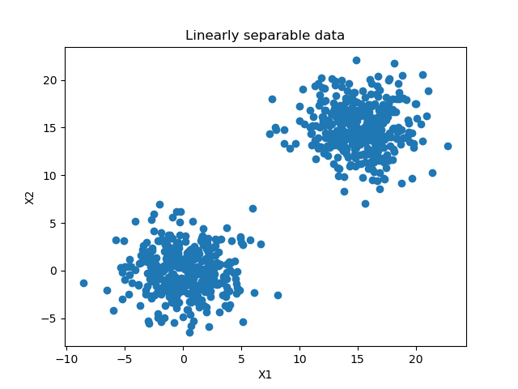
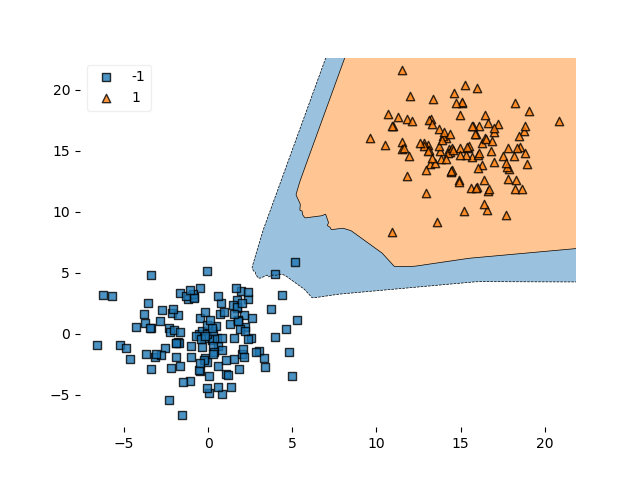
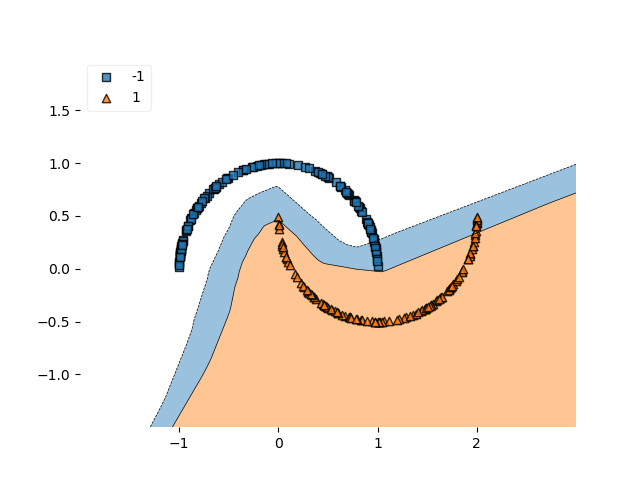

When you build a classifier, you're effectively learning a mathematical model to draw a _decision boundary_ that can separate between the classes present in your data set's targets.

Many algorithms have many different approaches to generating such decision boundaries. Neural networks learn them differently, dependent on the optimizer, activation function(s) and loss function used in your training setting. They support multiclass classification quite natively in many cases.

Support Vector machines learn them by finding a maximum-margin boundary between the two (!) classes in your ML problem. Indeed, SVMs do not work for more than two classes, and many SVMs have to be trained and merged to support multiclass classification.

Linear classifiers generate a linear decision boundary, which can happen in a multitude of ways - whether with SVMs, neural networks or more traditional techniques such as just fitting a line.

And so on.

But how do we visualize such a decision boundary? Especially: **how do I visualize the decision boundary for my Keras classifier?** That's what we'll answer in this blog post today. By means of the library Mlxtend created by Raschka (2018), we show you by means of example code how to visualize the decision boundaries of classifiers for both linearly separable and nonlinear data.

After reading this tutorial, you will...

- Understand how to visualize the decision boundary of your TensorFlow 2/Keras classifier with Mlxtend.
- See how this works with linear and nonlinear data.
- Have walked through a full example demonstrating how to visualize the decision boundary.

Are you ready?

Let's go! 😎

_Note that code is also available on [GitHub](https://github.com/christianversloot/keras-visualizations), in my Keras Visualizations repository._

* * *

**Update 25/Jan/2021:** updated code examples to TensorFlow 2. Added code example near the top of the tutorial so that people can get started immediately. Also updated header information and title to reflect availability of TensorFlow 2 code.

* * *

\[toc\]

* * *

## Code example: visualizing the decision boundary of your model

This code example provides a **full example showing how to visualize the decision boundary of your TensorFlow / Keras model**. If you want to understand it in more detail, in particular the usage of Mlxtend's `plot_decision_regions`, make sure to read the rest of this tutorial as well!

```
# Imports
import tensorflow.keras
from tensorflow.keras.datasets import mnist
from tensorflow.keras.models import Sequential
from tensorflow.keras.layers import Dense
from tensorflow.keras.utils import to_categorical
import matplotlib.pyplot as plt
import numpy as np
from sklearn.datasets import make_blobs
from mlxtend.plotting import plot_decision_regions

# Configuration options
num_samples_total = 1000
training_split = 250

# Generate data
X, targets = make_moons(n_samples = num_samples_total)
targets[np.where(targets == 0)] = -1
X_training = X[training_split:, :]
X_testing = X[:training_split, :]
Targets_training = targets[training_split:]
Targets_testing = targets[:training_split]

# Generate scatter plot for training data
plt.scatter(X_training[:,0], X_training[:,1])
plt.title('Nonlinear data')
plt.xlabel('X1')
plt.ylabel('X2')
plt.show()

# Set the input shape
feature_vector_shape = len(X_training[0])
input_shape = (feature_vector_shape,)
print(f'Feature shape: {input_shape}')

# Create the model
model = Sequential()
model.add(Dense(50, input_shape=input_shape, activation='relu', kernel_initializer='he_uniform'))
model.add(Dense(1, activation='tanh'))

# Configure the model and start training
model.compile(loss='squared_hinge', optimizer='adam', metrics=['accuracy'])
model.fit(X_training, Targets_training, epochs=50, batch_size=25, verbose=1, validation_split=0.2)

# Test the model after training
test_results = model.evaluate(X_testing, Targets_testing, verbose=1)
print(f'Test results - Loss: {test_results[0]} - Accuracy: {test_results[1]*100}%')

# Plot decision boundary
plot_decision_regions(X_testing, Targets_testing, clf=model, legend=2)
plt.show()
```

* * *

## An example with linearly separable data

Now that we know what a decision boundary is, we can try to visualize some of them for our Keras models. Here, we'll provide an example for visualizing the decision boundary with linearly separable data.

Thus, data which can be separated by drawing a line in between the clusters. Typically, this is seen with classifiers and particularly [Support Vector Machines](https://www.machinecurve.com/index.php/2019/09/20/intuitively-understanding-svm-and-svr/) (which maximize the margin between the line and the two clusters), but also with neural networks.

Let's start. Perhaps, create a file in some folder called `decision_boundary_linear_data.py` in which you'll add the following code.

### Importing dependencies

We first import the required dependencies:

```
# Imports
import tensorflow.keras
from tensorflow.keras.datasets import mnist
from tensorflow.keras.models import Sequential
from tensorflow.keras.layers import Dense
from tensorflow.keras.utils import to_categorical
import matplotlib.pyplot as plt
import numpy as np
from sklearn.datasets import make_blobs
from mlxtend.plotting import plot_decision_regions
```

We use **TensorFlow 2.0** for training our machine learning model, which includes a tightly coupled version of Keras through `tensorflow.keras`. Additionally, we'll import **Matplotlib**, which we need to visualize our dataset. **Numpy** is imported for preprocessing the data, **Scikit-learn**'s function `make_blobs` is imported for generating the linearly separable clusters of data and **Mlxtend** is used for visualizing the decision boundary.

### Configuration options

Next, we set some configuration options:

```
# Configuration options
num_samples_total = 1000
training_split = 250
```

The number of samples used in our visualization experiment is 1000 - to keep the training process fast, while still being able to show the predictive power of our model.

We use 250 samples of them as _testing_ data by splitting them off the total dataset.

Let's now generate data for the experiment.

### Generating data

With the help of the Scikit-learn library we generate data using the `make_blobs` function. It generates `n_samples` data points at the centers (0, 0) and (15, 15). The `n_features` is two: our samples have an (x, y) value on a 2D-space. The standard deviation of our cluster is set at 2.5. This allows us to add some spread without losing linear separability.

```
# Generate data
X, targets = make_blobs(n_samples = num_samples_total, centers = [(0,0), (15,15)], n_features = 2, center_box=(0, 1), cluster_std = 2.5)
targets[np.where(targets == 0)] = -1
X_training = X[training_split:, :]
X_testing = X[:training_split, :]
Targets_training = targets[training_split:]
Targets_testing = targets[:training_split]
```

Scikit-learn's `make_blobs` generates numbers as targets, starting at 0. However, we will use [Hinge loss](https://www.machinecurve.com/index.php/2019/10/04/about-loss-and-loss-functions/#hinge) in an attempt to maximize the decision boundary between our clusters. This should be possible given its separability. Hinge loss does not understand a target value of 0; rather, targets must be -1 or +1. Hence, we next convert all zero targets into minus one.

We finally split between training and testing data given the number of splitoff values that we configured earlier.

### Visualizing our dataset

We next visualize our data:

```
# Generate scatter plot for training data
plt.scatter(X_training[:,0], X_training[:,1])
plt.title('Linearly separable data')
plt.xlabel('X1')
plt.ylabel('X2')
plt.show()
```

Put simply, we generate a scatter plot with Matplotlib, which clearly shows linear separability for our dataset:

[](blob:https://www.machinecurve.com/2f4d2ae3-1171-4ade-b5a8-3f164f3d5717)

### Model configuration, training & testing

We next add the (relatively basic) Keras model used today:

```
# Set the input shape
feature_vector_shape = len(X_training[0])
input_shape = (feature_vector_shape,)
print(f'Feature shape: {input_shape}')

# Create the model
model = Sequential()
model.add(Dense(50, input_shape=input_shape, activation='relu', kernel_initializer='he_uniform'))
model.add(Dense(1, activation='tanh'))

# Configure the model and start training
model.compile(loss='squared_hinge', optimizer='adam', metrics=['accuracy'])
model.fit(X_training, Targets_training, epochs=50, batch_size=25, verbose=1, validation_split=0.2)
```

We configure the input shape and next define the model architecture - we use Keras's Sequential API and let the data pass through two densely-connected layers. Two such layers should be sufficient for generating a successful decision boundary since our data is relatively simple - and in fact, linearly separable.

Do note that since we use the ReLU [activation function](https://www.machinecurve.com/index.php/2019/09/04/relu-sigmoid-and-tanh-todays-most-used-activation-functions/), we cannot use Glorot uniform initialization - the default choice in Keras. Rather, we must [use He initialization](https://www.machinecurve.com/index.php/2019/09/16/he-xavier-initialization-activation-functions-choose-wisely/), and choose to do so with a uniform distribution.

Next, we compile the model, using [squared hinge](https://www.machinecurve.com/index.php/2019/10/04/about-loss-and-loss-functions/#squared-hinge) as our loss function, Adam as our optimizer (it's the de facto standard one used today) and accuracy as an additional metric - pretty much the choices I always make when creating models with Keras.

Next, we fit the training data to the model, perform 50 iterations (or epochs) with batch sizes of 25, and use 20% of our 750 training samples for validating the outcomes of the training process after every epoch. Verbosity is set to 1 to show what happens during training.

Subsequently, we add another default metric, which tests the final model once it stops training against the test set - to also show its power to _generalize_ to data the model has not seen before.

```
# Test the model after training
test_results = model.evaluate(X_testing, Targets_testing, verbose=1)
print(f'Test results - Loss: {test_results[0]} - Accuracy: {test_results[1]*100}%')
```

### Plotting decision boundaries with Mlxtend

Finally, we add code for visualizing the model's decision boundary. We use [Mlxtend](http://rasbt.github.io/mlxtend/) for this purpose, which is "a Python library of useful tools for the day-to-day data science tasks". Great!

What's even better is that we can visualize the decision boundary of our Keras model with only two lines of code:

```
# Plot decision boundary
plot_decision_regions(X_testing, Targets_testing, clf=model, legend=2)
plt.show()
```

Note that we use our testing data for this rather than our training data, that we input the instance of our Keras model and that we display a legend.

Altogether, this is the code for the entire experiment:

```
# Imports
import tensorflow.keras
from tensorflow.keras.datasets import mnist
from tensorflow.keras.models import Sequential
from tensorflow.keras.layers import Dense
from tensorflow.keras.utils import to_categorical
import matplotlib.pyplot as plt
import numpy as np
from sklearn.datasets import make_blobs
from mlxtend.plotting import plot_decision_regions

# Configuration options
num_samples_total = 1000
training_split = 250

# Generate data
X, targets = make_blobs(n_samples = num_samples_total, centers = [(0,0), (15,15)], n_features = 2, center_box=(0, 1), cluster_std = 2.5)
targets[np.where(targets == 0)] = -1
X_training = X[training_split:, :]
X_testing = X[:training_split, :]
Targets_training = targets[training_split:]
Targets_testing = targets[:training_split]

# Generate scatter plot for training data
plt.scatter(X_training[:,0], X_training[:,1])
plt.title('Linearly separable data')
plt.xlabel('X1')
plt.ylabel('X2')
plt.show()

# Set the input shape
feature_vector_shape = len(X_training[0])
input_shape = (feature_vector_shape,)
print(f'Feature shape: {input_shape}')

# Create the model
model = Sequential()
model.add(Dense(50, input_shape=input_shape, activation='relu', kernel_initializer='he_uniform'))
model.add(Dense(1, activation='tanh'))

# Configure the model and start training
model.compile(loss='squared_hinge', optimizer='adam', metrics=['accuracy'])
model.fit(X_training, Targets_training, epochs=50, batch_size=25, verbose=1, validation_split=0.2)

# Test the model after training
test_results = model.evaluate(X_testing, Targets_testing, verbose=1)
print(f'Test results - Loss: {test_results[0]} - Accuracy: {test_results[1]*100}%')

# Plot decision boundary
plot_decision_regions(X_testing, Targets_testing, clf=model, legend=2)
plt.show()
```

### Running the model

Running the code requires that you installed all dependencies mentioned earlier; preferably in an Anaconda environment to keep them isolated. Next, you can open up a terminal, navigate to the folder your file is located in and hit e.g. `python decision_boundary_linear_data.py`. What you will see is that Keras starts training the model, but that also the visualization above and the decision boundary visualization is generated for you.

```
Epoch 1/50
600/600 [==============================] - 5s 8ms/step - loss: 1.4986 - acc: 0.4917 - val_loss: 1.0199 - val_acc: 0.6333
Epoch 2/50
600/600 [==============================] - 0s 107us/step - loss: 0.7973 - acc: 0.6933 - val_loss: 0.6743 - val_acc: 0.7400
Epoch 3/50
600/600 [==============================] - 0s 102us/step - loss: 0.6273 - acc: 0.7467 - val_loss: 0.6020 - val_acc: 0.7800
Epoch 4/50
600/600 [==============================] - 0s 102us/step - loss: 0.5472 - acc: 0.7750 - val_loss: 0.5241 - val_acc: 0.8200
Epoch 5/50
600/600 [==============================] - 0s 93us/step - loss: 0.4313 - acc: 0.8000 - val_loss: 0.4170 - val_acc: 0.8467
Epoch 6/50
600/600 [==============================] - 0s 97us/step - loss: 0.2492 - acc: 0.8283 - val_loss: 0.1900 - val_acc: 0.8800
Epoch 7/50
600/600 [==============================] - 0s 107us/step - loss: 0.1199 - acc: 0.8850 - val_loss: 0.1109 - val_acc: 0.9133
Epoch 8/50
600/600 [==============================] - 0s 98us/step - loss: 0.0917 - acc: 0.9000 - val_loss: 0.0797 - val_acc: 0.9200
Epoch 9/50
600/600 [==============================] - 0s 96us/step - loss: 0.0738 - acc: 0.9183 - val_loss: 0.0603 - val_acc: 0.9200
Epoch 10/50
600/600 [==============================] - 0s 98us/step - loss: 0.0686 - acc: 0.9200 - val_loss: 0.0610 - val_acc: 0.9200
Epoch 11/50
600/600 [==============================] - 0s 101us/step - loss: 0.0629 - acc: 0.9367 - val_loss: 0.0486 - val_acc: 0.9333
Epoch 12/50
600/600 [==============================] - 0s 108us/step - loss: 0.0574 - acc: 0.9367 - val_loss: 0.0487 - val_acc: 0.9267
Epoch 13/50
600/600 [==============================] - 0s 102us/step - loss: 0.0508 - acc: 0.9400 - val_loss: 0.0382 - val_acc: 0.9467
Epoch 14/50
600/600 [==============================] - 0s 109us/step - loss: 0.0467 - acc: 0.9483 - val_loss: 0.0348 - val_acc: 0.9533
Epoch 15/50
600/600 [==============================] - 0s 108us/step - loss: 0.0446 - acc: 0.9467 - val_loss: 0.0348 - val_acc: 0.9467
Epoch 16/50
600/600 [==============================] - 0s 109us/step - loss: 0.0385 - acc: 0.9583 - val_loss: 0.0280 - val_acc: 0.9533
Epoch 17/50
600/600 [==============================] - 0s 100us/step - loss: 0.0366 - acc: 0.9583 - val_loss: 0.0288 - val_acc: 0.9467
Epoch 18/50
600/600 [==============================] - 0s 105us/step - loss: 0.0320 - acc: 0.9633 - val_loss: 0.0227 - val_acc: 0.9733
Epoch 19/50
600/600 [==============================] - 0s 100us/step - loss: 0.0289 - acc: 0.9633 - val_loss: 0.0224 - val_acc: 0.9733
Epoch 20/50
600/600 [==============================] - 0s 107us/step - loss: 0.0264 - acc: 0.9683 - val_loss: 0.0202 - val_acc: 0.9733
Epoch 21/50
600/600 [==============================] - 0s 99us/step - loss: 0.0251 - acc: 0.9767 - val_loss: 0.0227 - val_acc: 0.9667
Epoch 22/50
600/600 [==============================] - 0s 95us/step - loss: 0.0247 - acc: 0.9750 - val_loss: 0.0170 - val_acc: 0.9800
Epoch 23/50
600/600 [==============================] - 0s 101us/step - loss: 0.0210 - acc: 0.9833 - val_loss: 0.0170 - val_acc: 0.9800
Epoch 24/50
600/600 [==============================] - 0s 104us/step - loss: 0.0192 - acc: 0.9833 - val_loss: 0.0148 - val_acc: 0.9933
Epoch 25/50
600/600 [==============================] - 0s 105us/step - loss: 0.0191 - acc: 0.9833 - val_loss: 0.0138 - val_acc: 0.9867
Epoch 26/50
600/600 [==============================] - 0s 103us/step - loss: 0.0169 - acc: 0.9867 - val_loss: 0.0128 - val_acc: 0.9933
Epoch 27/50
600/600 [==============================] - 0s 105us/step - loss: 0.0157 - acc: 0.9867 - val_loss: 0.0121 - val_acc: 1.0000
Epoch 28/50
600/600 [==============================] - 0s 103us/step - loss: 0.0150 - acc: 0.9883 - val_loss: 0.0118 - val_acc: 0.9933
Epoch 29/50
600/600 [==============================] - 0s 106us/step - loss: 0.0140 - acc: 0.9883 - val_loss: 0.0112 - val_acc: 1.0000
Epoch 30/50
600/600 [==============================] - 0s 105us/step - loss: 0.0131 - acc: 0.9917 - val_loss: 0.0101 - val_acc: 1.0000
Epoch 31/50
600/600 [==============================] - 0s 110us/step - loss: 0.0123 - acc: 0.9917 - val_loss: 0.0099 - val_acc: 1.0000
Epoch 32/50
600/600 [==============================] - 0s 111us/step - loss: 0.0119 - acc: 0.9917 - val_loss: 0.0102 - val_acc: 0.9933
Epoch 33/50
600/600 [==============================] - 0s 116us/step - loss: 0.0116 - acc: 0.9933 - val_loss: 0.0093 - val_acc: 1.0000
Epoch 34/50
600/600 [==============================] - 0s 108us/step - loss: 0.0107 - acc: 0.9933 - val_loss: 0.0085 - val_acc: 1.0000
Epoch 35/50
600/600 [==============================] - 0s 102us/step - loss: 0.0100 - acc: 0.9933 - val_loss: 0.0081 - val_acc: 1.0000
Epoch 36/50
600/600 [==============================] - 0s 103us/step - loss: 0.0095 - acc: 0.9917 - val_loss: 0.0078 - val_acc: 1.0000
Epoch 37/50
600/600 [==============================] - 0s 105us/step - loss: 0.0093 - acc: 0.9967 - val_loss: 0.0079 - val_acc: 1.0000
Epoch 38/50
600/600 [==============================] - 0s 104us/step - loss: 0.0088 - acc: 0.9950 - val_loss: 0.0072 - val_acc: 1.0000
Epoch 39/50
600/600 [==============================] - 0s 98us/step - loss: 0.0085 - acc: 0.9967 - val_loss: 0.0069 - val_acc: 1.0000
Epoch 40/50
600/600 [==============================] - 0s 103us/step - loss: 0.0079 - acc: 0.9983 - val_loss: 0.0066 - val_acc: 1.0000
Epoch 41/50
600/600 [==============================] - 0s 103us/step - loss: 0.0075 - acc: 0.9967 - val_loss: 0.0065 - val_acc: 1.0000
Epoch 42/50
600/600 [==============================] - 0s 101us/step - loss: 0.0074 - acc: 0.9950 - val_loss: 0.0060 - val_acc: 1.0000
Epoch 43/50
600/600 [==============================] - 0s 101us/step - loss: 0.0072 - acc: 0.9967 - val_loss: 0.0057 - val_acc: 1.0000
Epoch 44/50
600/600 [==============================] - 0s 105us/step - loss: 0.0071 - acc: 0.9950 - val_loss: 0.0056 - val_acc: 1.0000
Epoch 45/50
600/600 [==============================] - 0s 105us/step - loss: 0.0065 - acc: 0.9983 - val_loss: 0.0054 - val_acc: 1.0000
Epoch 46/50
600/600 [==============================] - 0s 110us/step - loss: 0.0062 - acc: 0.9983 - val_loss: 0.0056 - val_acc: 1.0000
Epoch 47/50
600/600 [==============================] - 0s 105us/step - loss: 0.0059 - acc: 0.9983 - val_loss: 0.0051 - val_acc: 1.0000
Epoch 48/50
600/600 [==============================] - 0s 103us/step - loss: 0.0057 - acc: 0.9983 - val_loss: 0.0049 - val_acc: 1.0000
Epoch 49/50
600/600 [==============================] - 0s 101us/step - loss: 0.0056 - acc: 0.9983 - val_loss: 0.0047 - val_acc: 1.0000
Epoch 50/50
600/600 [==============================] - 0s 105us/step - loss: 0.0054 - acc: 0.9983 - val_loss: 0.0050 - val_acc: 1.0000
250/250 [==============================] - 0s 28us/step
Test results - Loss: 0.007074932985007763 - Accuracy: 99.2%
```

As you can see, during training validation accuracy goes to 1 or 100%. Testing the model with the testing dataset yields an accuracy of 99.2%. That's quite good news!

And the visualized decision boundary?



Let's now take a look at an example with nonlinear data.

* * *

## An example with nonlinear data

Now what if we have nonlinear data? We can do the same!

We'll have to change a few lines in our code, though. Let's first replace the `make_blobs` import by `make_moons`:

```
from sklearn.datasets import make_moons
```

Next, also replace the call to this function under _Generate data_ to this:

```
X, targets = make_moons(n_samples = num_samples_total)
```

What happens? Well, unlike the linearly separable data, two shapes resembling half moons are generated; they cannot be linearly separated, at least in regular feature space:

[](blob:https://www.machinecurve.com/4683f482-c683-4b5d-9959-7d3573547adb)

Running the code with these adaptations (the full code can be retrieved next) shows that the Keras model is actually able to perform hinge-loss based nonlinear separation pretty successfully:

```
Epoch 50/50
600/600 [==============================] - 0s 107us/step - loss: 0.0748 - acc: 0.9233 - val_loss: 0.0714 - val_acc: 0.9400
250/250 [==============================] - 0s 26us/step
Test results - Loss: 0.07214225435256957 - Accuracy: 91.59999976158142%
```

And it looks as follows:



### Full model code

```
# Imports
import tensorflow.keras
from tensorflow.keras.datasets import mnist
from tensorflow.keras.models import Sequential
from tensorflow.keras.layers import Dense
from tensorflow.keras.utils import to_categorical
import matplotlib.pyplot as plt
import numpy as np
from sklearn.datasets import make_blobs
from mlxtend.plotting import plot_decision_regions

# Configuration options
num_samples_total = 1000
training_split = 250

# Generate data
X, targets = make_moons(n_samples = num_samples_total)
targets[np.where(targets == 0)] = -1
X_training = X[training_split:, :]
X_testing = X[:training_split, :]
Targets_training = targets[training_split:]
Targets_testing = targets[:training_split]

# Generate scatter plot for training data
plt.scatter(X_training[:,0], X_training[:,1])
plt.title('Nonlinear data')
plt.xlabel('X1')
plt.ylabel('X2')
plt.show()

# Set the input shape
feature_vector_shape = len(X_training[0])
input_shape = (feature_vector_shape,)
print(f'Feature shape: {input_shape}')

# Create the model
model = Sequential()
model.add(Dense(50, input_shape=input_shape, activation='relu', kernel_initializer='he_uniform'))
model.add(Dense(1, activation='tanh'))

# Configure the model and start training
model.compile(loss='squared_hinge', optimizer='adam', metrics=['accuracy'])
model.fit(X_training, Targets_training, epochs=50, batch_size=25, verbose=1, validation_split=0.2)

# Test the model after training
test_results = model.evaluate(X_testing, Targets_testing, verbose=1)
print(f'Test results - Loss: {test_results[0]} - Accuracy: {test_results[1]*100}%')

# Plot decision boundary
plot_decision_regions(X_testing, Targets_testing, clf=model, legend=2)
plt.show()
```

* * *

## Summary

In this blog, we've seen how to visualize the decision boundary of your Keras model by means of Mlxtend, a Python library that extends the toolkit of today's data scientists. We saw that we only need **two lines of code** to provide for a basic visualization which clearly demonstrates the presence of the decision boundary.

I hope you've learnt something from this blog! Please let me know in a comment 👇 if you have any questions, any remarks or when you have comments. I'll happily improve my blog if I made mistakes or forgot crucial information - and I'm also very eager to hear what you've done with the information! Thanks and happy engineering! 😊💬

_Note that code is also available on [GitHub](https://github.com/christianversloot/keras-visualizations), in my Keras Visualizations repository._

* * *

## References

Raschka, S. (n.d.). Home - mlxtend. Retrieved from [http://rasbt.github.io/mlxtend/](http://rasbt.github.io/mlxtend/)

Raschka, S. (2018). MLxtend: Providing machine learning and data science utilities and extensions to Python’s scientific computing stack. _Journal of Open Source Software_, _3_(24), 638. [doi:10.21105/joss.00638](https://joss.theoj.org/papers/10.21105/joss.00638)

Intuitively understanding SVM and SVR – MachineCurve. (2019, September 20). Retrieved from [https://www.machinecurve.com/index.php/2019/09/20/intuitively-understanding-svm-and-svr/](https://www.machinecurve.com/index.php/2019/09/20/intuitively-understanding-svm-and-svr/)

About loss and loss functions: Hinge loss – MachineCurve. (2019, October 4). Retrieved from [https://www.machinecurve.com/index.php/2019/10/04/about-loss-and-loss-functions/#hinge](https://www.machinecurve.com/index.php/2019/10/04/about-loss-and-loss-functions/#hinge)

About loss and loss functions: Squared hinge loss – MachineCurve. (2019, October 4). Retrieved from [https://www.machinecurve.com/index.php/2019/10/04/about-loss-and-loss-functions/#squared-hinge](https://www.machinecurve.com/index.php/2019/10/04/about-loss-and-loss-functions/#squared-hinge)

ReLU, Sigmoid and Tanh: today's most used activation functions – MachineCurve. (2019, September 4). Retrieved from [https://www.machinecurve.com/index.php/2019/09/04/relu-sigmoid-and-tanh-todays-most-used-activation-functions/](https://www.machinecurve.com/index.php/2019/09/04/relu-sigmoid-and-tanh-todays-most-used-activation-functions/)

He/Xavier initialization & activation functions: choose wisely – MachineCurve. (2019, September 18). Retrieved from [https://www.machinecurve.com/index.php/2019/09/16/he-xavier-initialization-activation-functions-choose-wisely/](https://www.machinecurve.com/index.php/2019/09/16/he-xavier-initialization-activation-functions-choose-wisely/)
