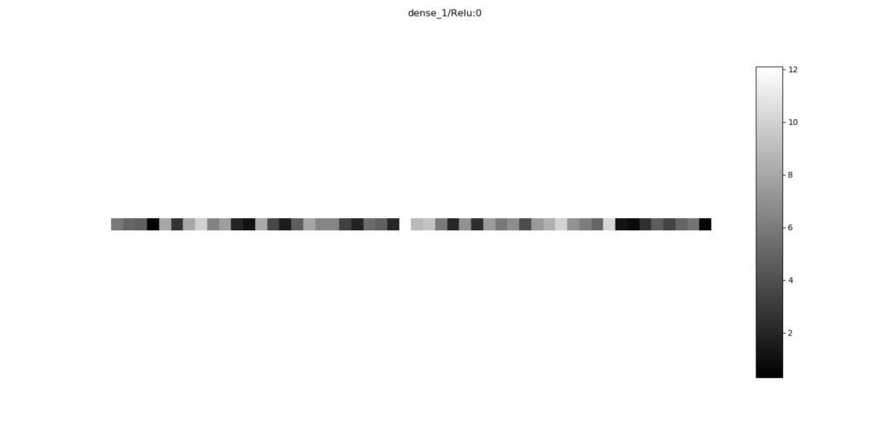
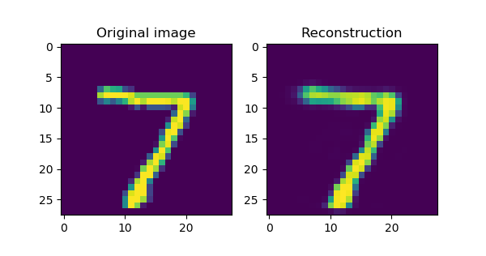
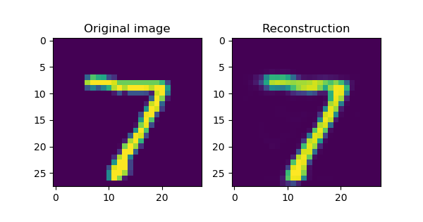
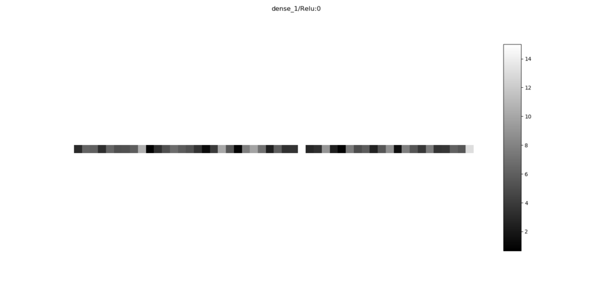
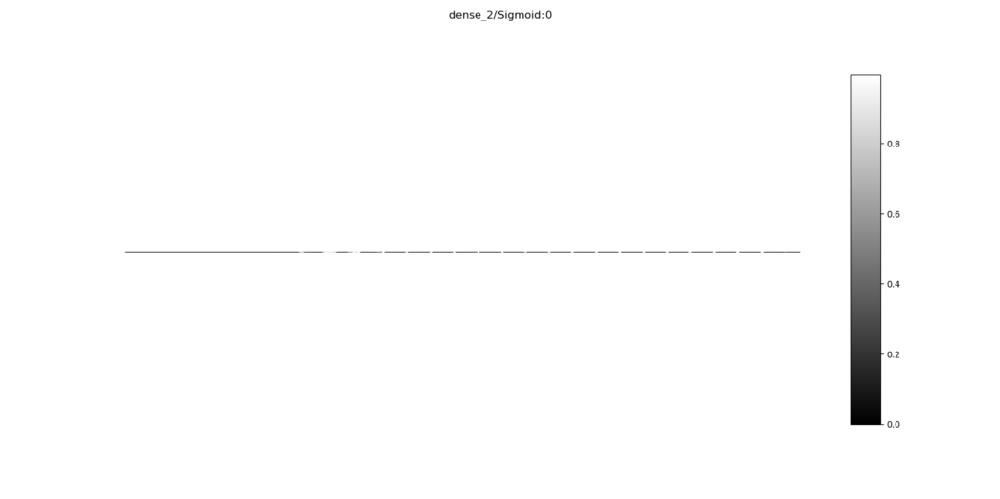

Autoencoders are special types of neural networks which learn to convert inputs into lower-dimensional form, after which they convert it back into the original or some related output. A variety of interesting applications has emerged for them: denoising, dimensionality reduction, input reconstruction, and - with a particular type of autoencoder called Variational Autoencoder - even [generative actions](https://www.machinecurve.com/index.php/2019/12/24/what-is-a-variational-autoencoder-vae/).

This lower-dimensional form is also called the encoded state. But what does it look like? Can we visualize the encoded state of an autoencoder? And how do we do that for a Keras model? Those are questions that I'll answer in this blog post. Firstly, we'll dive into the concept of an autoencoder, to recap - or to inject - your high-level understanding of them. Next, we'll take a look at what we're going to do today, i.e., generate visualizations of the encoded state. Subsequently, we provide an example for encoded state visualization with both the Keras Functional API and the Keras Sequential API.

Are you ready? Let's go! 😎

\[toc\]

* * *

## Recap: what are autoencoders and what are they used for?

We talk about _encoded states_ and _autoencoders_ - but what are they?

Likely, you already know what is meant with these concepts. In that case, I'd suggest that you skip this section and start at the next one.

However, it's also possible that you _don't know yet_ what they are, or that your familiarity with these concepts is growing - but that you can't dream them yet 😴

In that case, read on :-)

At a high level, this is an autoencoder:


It's a combination of building blocks which allows you to feed it some input, which is encoded, decoded and then returned to the user. Depending on how you configure it (in terms of input and desired outputs), they can be used for:

- [Input reconstruction](https://www.machinecurve.com/index.php/2019/12/19/creating-a-signal-noise-removal-autoencoder-with-keras/);
- [Noise reduction](https://www.machinecurve.com/index.php/2019/12/20/building-an-image-denoiser-with-a-keras-autoencoder-neural-network/);
- Dimensionality reduction.

Besides the input image and the 'reconstructed image' (or denoised image), there are more building blocks: an encoder, a decoder and an encoded state.

What are they?

Let's take at the encoder first. When you feed an autoencoder input, the input has multiple dimensions. For example, a 28 x 28 pixels input image has 28 x 28 = 784 dimensions, which all take a real value (i.e., a number with some decimals that can be positive and negative). The _encoder_ reduces the dimensionality of your input to the extent that it can be overseen by compressing information and discarding useless information (e.g. sampling noise), to e.g. 25 dimensions. This is called the _encoded state_, which you can feed to the _decoder_. The decoder, in turn, attempts to build up a new image, such as a reconstruction of the input. How good the autoencoder works is determined by the loss function with which it is trained, and is determined by how similar the output is to the input.

An important word in the previous paragraph is _trained_. Indeed, the encoder and decoder segments of autoencoders must be trained. Usually, neural networks are employed for this purpose, as they are [universal function approximators](https://www.machinecurve.com/index.php/2019/07/18/can-neural-networks-approximate-mathematical-functions/) and can by consequence _learn_ the mapping from input to encoded state, and from encoded state to reconstruction. This is really important to remember when you're talking about autoencoders. While they are usually associated with neural networks, they're not the same. Rather, they are _implemented_ with neural nets.

* * *

## Visualizing the encoded state: what we want to achieve

You may now wonder: _what's the goal of this blog post?_

It's to visualize the **encoded state**, when a sample is fed to the autoencoder.

This can be useful in situations when you use autoencoders for dimensionality reduction, and you consider the encoded states to be features for e.g. [Support Vector Machines](https://www.machinecurve.com/index.php/2019/09/20/intuitively-understanding-svm-and-svr/). In those cases, you may wish to look at your encoded states in order to find whether dimensions must be added or dropped, and so on. In other words, you wish to generate images like this one:

[](https://www.machinecurve.com/wp-content/uploads/2019/12/encoded-state.png)

Fortunately, this is possible! 🎉

**Keract** ([link to their GitHub](https://github.com/philipperemy/keract)) is a nice toolkit with which you can "get the activations (outputs) and gradients for each layer of your Keras model" (Rémy, 2019). We already covered Keract before, in a blog post illustrating how to use it for [visualizing the hidden layers in your neural net](https://www.machinecurve.com/index.php/2019/12/02/visualize-layer-outputs-of-your-keras-classifier-with-keract/), but we're going to use it again today.

This time, we'll be using it to visualize the encoded state - which, in terms of the neural network implementation of your autoecoder, is nothing else than a visualization of the output of the _encoder segment_, i.e. the final layer of the neural network segment that represents your autoencoder's encoder.

Let's find out how we can do that, with both the Keras Functional API and the Keras Sequential API! 😀

### What you'll need to run the model

Today, we create two variants of one autoencoder: one with the Keras Functional API, and one with the Keras Sequential API. This allows you to choose what fits best for you, and use code for both scenarios in your machine learning projects.

Regardless of the API that we will use, you need to install a set of software dependencies if you wish to run the autoencoders successfully in your local system:

- **Keras**, which is the deep learning framework we will use today.
- **Python**, which is the language in which Keras models are created. Preferably, use Python 3.6 or newer.
- One of the backends supported by Keras, and since the deep integration with TensorFlow (since v2.0) I'd say that **Tensorflow** is the best choice.
- **Keract**, for visualizing the encoded state: `pip install keract`.
- **Matplotlib**, for plotting the visualizations on screen.

Are you ready? Lets go! 😎

* * *

## Visualizing encoded state with a Keras Functional API autoencoder

We'll first take a look at how encoded states can be visualized when building autoencoders with the Keras Functional API. While it's a bit harder to structure your models, it allows easier access to intermediate layers compared to the Keras Sequential API.

And access to these intermediate layers is what we need. Remember that autoencoders contain an _encoder_ segment, as well as a _decoder_ segment, which are trained together but have separate tasks. Additionally, the _autoencoder_ must be considered as a whole. Separating between layers and/or segments is thus necessary when creating autoencoders. While this is certainly possible with the Sequential API (as we will show later in this blog post), you'll make your life easier when you use the Functional API.

In order to start, open up your Explorer/Finder, navigate to some folder, and create a Python file, e.g. `autoencoder_encodedstate_functional.py`. Next, open this file in your code editor. Now, we can start!

### Model imports

The first thing we must do is import the dependencies:

```python
'''
  Visualizing the encoded state of a simple autoencoder created with the Keras Functional API
  with Keract.
'''
import keras
from keras.layers import Input, Dense
from keras.datasets import mnist
from keras.models import Model
from keract import get_activations, display_activations
import matplotlib.pyplot as plt
```

We'll need the `Input` and `Dense` layers today: Input for serving as the input layer of the neural network implementing our autoencoder, Dense as the hidden layer that generates the encoding. With the `mnist` dataset, we'll train our autoencoder, and use the `Model` instance to instantiate our models later on. Additionally, we'll need some functions from `keract`, and need to import the Matplotlib PyPlot API as `plt`.

### Model configuration

Next up: model configuration. As usual, we'll define the width and height of our images, and multiply them in order to define our initial dimension (which is 28 x 28 = 784 pixels). Batch size is set to 128, which is default, and the number of epochs is kept low deliberately (as the model seems to converge quite quickly). 20% of the training data is used for validation purposes, verbosity mode is set to True (i.e., all output is shown on screen), and our encoder reduces the dimensionality to 50 (from 784).

```python
# Model configuration
img_width, img_height = 28, 28
initial_dimension = img_width * img_height
batch_size = 128
no_epochs = 10
validation_split = 0.2
verbosity = 1
encoded_dim = 50
```

### Data loading and preprocessing

Now, it's time to load data and preprocess it.

First, we use the built-in Keras functionality for loading the MNIST dataset: `mnist.load_data()`. This automatically downloads the data from some S3 endpoint and puts it into local cache, which allows you to use it without any difficulty.

Secondly, we'll reshape the data into our `initial_dimension` (i.e., from (28, 28, 1) format - 28 width, 28 height and 1 channel - into 784 (everything merged together). We finally represent our new shape in `input_shape`.

Subsequently, we parse the numbers in our data as floats - specifically, `float32` - which presumably speeds up the training process.

Finally, we normalize the data, so that it's in the \[-1, +1\] range. This is appreciated by the neural network during training.

```python
# Load MNIST dataset
(input_train, target_train), (input_test, target_test) = mnist.load_data()

# Reshape data
input_train = input_train.reshape(input_train.shape[0], initial_dimension)
input_test = input_test.reshape(input_test.shape[0], initial_dimension)
input_shape = (initial_dimension, )

# Parse numbers as floats
input_train = input_train.astype('float32')
input_test = input_test.astype('float32')

# Normalize data
input_train = input_train / 255
input_test = input_test / 255
```

### Defining the layers of the autoencoder

Next, we can define the layers that we will use in the autoencoder.

The `inputs` layer does what you think it does: it serves to "take in" the input following the `input_shape` determined before.

Recognizable by the `(inputs)` code in the next layer, we can tell that it's fed to the `encoding_layer`, which is a densely-connected layer with `encoded_dim` (= 50, in our case) neurons, [ReLU activation](https://www.machinecurve.com/index.php/2019/09/09/implementing-relu-sigmoid-and-tanh-in-keras/), [and by consequence He init](https://www.machinecurve.com/index.php/2019/09/16/he-xavier-initialization-activation-functions-choose-wisely/).

The decoding layer, which takes the input from the encoding layer, is once again densely-connected. Its output equals the `initial_dimension`, which results in the same shape as we fed it in the first place. It activates with a Sigmoi activation function, so that we can use [binary crossentropy](https://www.machinecurve.com/index.php/2019/10/22/how-to-use-binary-categorical-crossentropy-with-keras/) for computing loss (as we will see next).

```python
# Define the layers
inputs = Input(shape=input_shape)
encoding_layer = Dense(encoded_dim, activation='relu', kernel_initializer='he_normal')(inputs)
decoding_layer = Dense(initial_dimension, activation='sigmoid')(encoding_layer)
```

### Intermezzo: definitions versus instantiations

Above, we defined the layers of our autoencoder:

- The input layer;
- The encoding layer;
- The decoding layer.

We also told Keras in our code how information should flow with these layers: from the input layer, through the encoding layer, through the decoding layer, to become output again.

However, we don't have a model yet. It's important to understand that even though we defined the _architecture_ of the model, we haven't actually _got a model instance_ yet. We'll create one now :)

### Instantiating the full autoencoder and encoder/decoder segments

Now that we have defined out layers, we can instantiate them, i.e. convert them to true Model instances.

#### Full autoencoder

First, for the full autoencoder, we essentially tell the `Model` that we'll wish to create one with `inputs` (the inputs layer) as the starting layer, and `decoding_layer` (the output of the decoder) as the full layer.

```python
# Instantiate the autoencoder
autoencoder = Model(inputs, decoding_layer, name='full_autoencoder')
```

#### Encoder segment

For the encoder, we only want the flow to go from `inputs` to `encoding_layer`:

```python
# Instantiate the encoder
encoder = Model(inputs, encoding_layer, name='encoder')
```

#### Decoder segment

For the decoder, well have to take a slightly different approach. Contrary to the decoder, which is not dependent on anything, the decoder is dependent on the _learnt_ encoder. Hence, we'll need to include it in our code: simply adding the `decoding_layer` here would suggest that we split encoder and decoder.

Hence, we'll first define a new pseudo-Input layer, which takes inputs with shape `(encoded_dim, )`. Next, we retrieve the final (i.e., the decoding) layer from our instantiated `autoencoder`. This layer is used in the `decoder` model, which has the `encoded_input` as its input (which makes sense) and `final_ae_layer(encoded_input)` as output. Although being slightly more difficult, this makes sense as well: it's just the _encoded input_ fed to the _decoder layer_ we already _trained before_.

```python
# Instantiate the decoder
encoded_input = Input(shape=(encoded_dim, ))
final_ae_layer = autoencoder.layers[-1]
decoder = Model(encoded_input, final_ae_layer(encoded_input), name='decoder')
```

### Compile autoencoder & encoder segment

Next, we can compile both the autoencoder and the encoder segment. We'll need to compile them both, as we'll use them later to generate an image of input and reconstructed output (hence we need `autoencoder`) and visualize the encoded state (hence we need `encoder`). If you only need one of them, it's of course fine to drop any of them.

We'll use the [Adam optimizer](https://www.machinecurve.com/index.php/2019/11/03/extensions-to-gradient-descent-from-momentum-to-adabound/) and [binary crossentropy](https://www.machinecurve.com/index.php/2019/10/22/how-to-use-binary-categorical-crossentropy-with-keras/), pretty much the standard settings for today's networks with Sigmoid activation functions.

```python
# Compile the autoencoder
encoder.compile(optimizer='adam', loss='binary_crossentropy')
autoencoder.compile(optimizer='adam', loss='binary_crossentropy')
```

It's now time to get some insights about the structure of our models as well.

To achieve this, we generate summaries:

```python
# Give us some insights
autoencoder.summary()
encoder.summary()
decoder.summary()
```

### Fitting data

Finally, we'll fit the data - our `input_train` serves both as features and as targets, specify the number of epochs and batch size as configured before, and do the same for the validation split.

```python
# Fit data
autoencoder.fit(input_train, input_train, epochs=no_epochs, batch_size=batch_size, validation_split=validation_split)
```

Almost ready!

### Visualizing a sample and reconstruction

The only thing left is generating some visualizations, which is why you're here in the first place.

The first thing to add is taking a sample from the _testing_ dataset, which you'll feed to the `autoencoder` (i.e. the encoder _and_ decoder segments) in order to retrieve a reconstruction.

```python
# =============================================
# Take a sample for visualization purposes
# =============================================
input_sample = input_test[:1]
reconstruction = autoencoder.predict([input_sample])
```

The next thing we do is plot this reconstruction together with the `input_sample`. This allows us to see how well the autoencoder performs:

```python
# =============================================
# Visualize input-->reconstruction
# =============================================
fig, axes = plt.subplots(1, 2)
fig.set_size_inches(6, 3.5)
input_sample_reshaped = input_sample.reshape((img_width, img_height))
reconsstruction_reshaped = reconstruction.reshape((img_width, img_height))
axes[0].imshow(input_sample_reshaped) 
axes[0].set_title('Original image')
axes[1].imshow(reconsstruction_reshaped)
axes[1].set_title('Reconstruction')
plt.show()
```

### Visualizing the encoded state

Next, we can visualize the encoded state. As said, we'll use Keract for this, which allows you to visualize activations in neural network layers made with Keras. Since it abstracts much of the coding away, it's actually really easy to generate these visualizations:

```python
# =============================================
# Visualize encoded state with Keract
# =============================================
activations = get_activations(encoder, input_sample)
display_activations(activations, cmap="gray", save=False)
```

The steps are simple:

- Get the activations for the `encoder` model (_we use the encoder because we want to visualize the encoded state!)_ from the `input_sample` we took before.
- Next, display these activations with `display_activations`, using the gray colormap and without saving them.

That's it!

### Full model code

Should you wish to copy the full model code at once, here you go 😀

```python
'''
  Visualizing the encoded state of a simple autoencoder created with the Keras Functional API
  with Keract.
'''
import keras
from keras.layers import Input, Dense
from keras.datasets import mnist
from keras.models import Model
from keract import get_activations, display_activations
import matplotlib.pyplot as plt

# Model configuration
img_width, img_height = 28, 28
initial_dimension = img_width * img_height
batch_size = 128
no_epochs = 10
validation_split = 0.2
verbosity = 1
encoded_dim = 50

# Load MNIST dataset
(input_train, target_train), (input_test, target_test) = mnist.load_data()

# Reshape data
input_train = input_train.reshape(input_train.shape[0], initial_dimension)
input_test = input_test.reshape(input_test.shape[0], initial_dimension)
input_shape = (initial_dimension, )

# Parse numbers as floats
input_train = input_train.astype('float32')
input_test = input_test.astype('float32')

# Normalize data
input_train = input_train / 255
input_test = input_test / 255

# Define the layers
inputs = Input(shape=input_shape)
encoding_layer = Dense(encoded_dim, activation='relu', kernel_initializer='he_normal')(inputs)
decoding_layer = Dense(initial_dimension, activation='sigmoid')(encoding_layer)

# Instantiate the autoencoder
autoencoder = Model(inputs, decoding_layer, name='full_autoencoder')

# Instantiate the encoder
encoder = Model(inputs, encoding_layer, name='encoder')

# Instantiate the decoder
encoded_input = Input(shape=(encoded_dim, ))
final_ae_layer = autoencoder.layers[-1]
decoder = Model(encoded_input, final_ae_layer(encoded_input), name='decoder')

# Compile the autoencoder
encoder.compile(optimizer='adam', loss='binary_crossentropy')
autoencoder.compile(optimizer='adam', loss='binary_crossentropy')

# Give us some insights
autoencoder.summary()
encoder.summary()
decoder.summary()

# Fit data
autoencoder.fit(input_train, input_train, epochs=no_epochs, batch_size=batch_size, validation_split=validation_split)

# =============================================
# Take a sample for visualization purposes
# =============================================
input_sample = input_test[:1]
reconstruction = autoencoder.predict([input_sample])

# =============================================
# Visualize input-->reconstruction
# =============================================
fig, axes = plt.subplots(1, 2)
fig.set_size_inches(6, 3.5)
input_sample_reshaped = input_sample.reshape((img_width, img_height))
reconsstruction_reshaped = reconstruction.reshape((img_width, img_height))
axes[0].imshow(input_sample_reshaped) 
axes[0].set_title('Original image')
axes[1].imshow(reconsstruction_reshaped)
axes[1].set_title('Reconstruction')
plt.show()

# =============================================
# Visualize encoded state with Keract
# =============================================
activations = get_activations(encoder, input_sample)
display_activations(activations, cmap="gray", save=False)
```

### Results

Now, it's time to run the model.

Open up a terminal, `cd` to the folder where your `.py` file is located, and run it: e.g. `python autoencoder_encodedstate_functional.py`. You should see the training process begin, and once it finishes, some visualizations should start popping up.

The results are pretty awesome.

This is the first visualization we'll get:

[](https://www.machinecurve.com/wp-content/uploads/2019/12/reconstruction.png)

As you can see, the MNIST dataset is so discriminative that even with a simple structure (Dense layers only!), the autoencoder is capable of generating accurate reconstructions 😊

Next, the visualization of the encoded state - which is, once again, why you're here. Here you go:

[](https://www.machinecurve.com/wp-content/uploads/2019/12/encoded-state.png)

Looks good to me! 😎

* * *

## Visualizing encoded state with a Keras Sequential API autoencoder

Visualizing the encoded state of an autoencoder created with the Keras Sequential API is a bit harder, because you don't have as much control over the individual layers as you'd like to have.

However, it's possible nevertheless :)

Open up your Explorer/Finder again, navigate to some folder, and create another Python file: `autoencoder_encodedstate_sequential.py`. Now open this file in your code editor. We can start coding again :)

### Model imports

First, we'll add the imports:

```python
'''
  Visualizing the encoded state of a simple autoencoder created with the Keras Sequential API
  with Keract.
'''
import keras
from keras.layers import Dense
from keras.datasets import mnist
from keras.models import Sequential
from keract import get_activations, display_activations
import matplotlib.pyplot as plt
from keras import backend as K
```

We use Keras for creating the deep learning model. From Keras, we'll import the densely-connected layer, the MNIST dataset - just as we did before. However, this time, instead of the `Model` container, we import the `Sequential` API. This allows us to stack the layers easily.

Next, we import some calls from Keract which we can use to generate the visualizations. This is followed by the Matplotlib PyPlot API, which we'll use to plot the visualizations generated with Keract. Finally, we import the Keras backend - which we'll use to get the intermediate layer (from the encoder) later on.

### Model configuration

Next, we specify the configuration of our model:

```python
# Model configuration
img_width, img_height = 28, 28
initial_dimension = img_width * img_height
batch_size = 128
no_epochs = 10
validation_split = 0.2
verbosity = 1
encoded_dim = 50
```

It's equal to the model configuration for the model created with the Functional API.

### Import & process dataset

The same is valid for importing and preprocessing the data: it's equal to using the Functional API. First, we import the data, reshape it into the correct format, parse the data as floats (to speed up the training process) and normalize it to the \[-1, +1\] range.

```python
# Load MNIST dataset
(input_train, target_train), (input_test, target_test) = mnist.load_data()

# Reshape data
input_train = input_train.reshape(input_train.shape[0], initial_dimension)
input_test = input_test.reshape(input_test.shape[0], initial_dimension)
input_shape = (initial_dimension, )

# Parse numbers as floats
input_train = input_train.astype('float32')
input_test = input_test.astype('float32')

# Normalize data
input_train = input_train / 255
input_test = input_test / 255
```

### Defining the full autoencoder

We next define the autoencoder in full. We do so by assigning a new instance of the `Sequential` model type to the `autoencoder` variable. Subsequently, we'll add a densely-connected layer that has `encoded_dim` outputs i.e. neurons - and thus learns the encoded state.

It makes use of [ReLU activation](https://www.machinecurve.com/index.php/2019/09/09/implementing-relu-sigmoid-and-tanh-in-keras/) and by consequence [He initialization](https://www.machinecurve.com/index.php/2019/09/16/he-xavier-initialization-activation-functions-choose-wisely/). The `input_shape` is defined as well as with the Sequential API, the input layer is defined under the hood.

Next, we add another densely-connected layer, which converts the representation of `encoded_dim` dimensionality back into the `initial_dimension`, and thus serves as the decoder segment. It makes use of Sigmoid activation in order to allow us to use [binary crossentropy loss](https://www.machinecurve.com/index.php/2019/10/22/how-to-use-binary-categorical-crossentropy-with-keras/).

```python
# Define the 'autoencoder' full model
autoencoder = Sequential()
autoencoder.add(Dense(encoded_dim, activation='relu', kernel_initializer='he_normal', input_shape=input_shape))
autoencoder.add(Dense(initial_dimension, activation='sigmoid'))
```

### Compilation & fitting data

Next up: compiling the model (using the default Adam optimizer and binary crossentropy loss), outputting a summary, and fitting the data. Note that, as usual with an autoencoder, we feed `input_train` both as features and as targets. We train the model as specified in the configuration in terms of number of epochs, batch size and validation split.

```python
# Compile the autoencoder
autoencoder.compile(optimizer='adam', loss='binary_crossentropy')

# Give us some insights
autoencoder.summary()

# Fit data
autoencoder.fit(input_train, input_train, epochs=no_epochs, batch_size=batch_size, validation_split=validation_split)
```

### Visualizing a sample

We next take a sample, generate a reconstruction using the trained model and visualize it using Matplotlib. This code is no different compared to the one used with the Functional API.

```python
# =============================================
# Take a sample for visualization purposes
# =============================================
input_sample = input_test[:1]
reconstruction = autoencoder.predict([input_sample])

# =============================================
# Visualize input-->reconstruction
# =============================================
fig, axes = plt.subplots(1, 2)
fig.set_size_inches(6, 3.5)
input_sample_reshaped = input_sample.reshape((img_width, img_height))
reconsstruction_reshaped = reconstruction.reshape((img_width, img_height))
axes[0].imshow(input_sample_reshaped) 
axes[0].set_title('Original image')
axes[1].imshow(reconsstruction_reshaped)
axes[1].set_title('Reconstruction')
plt.show()
```

### Visualizing the encoded state

Next, we visualize the encoded state ... _and here is one difference compared to the Functional API_.

Since Keras does not allow us to consider layers and their outputs easily (and to make it compatible with add-ons like Keract), we'll have to feed Keract the entire `autoencoder` instance. This means that you will get visualizations for both the _encoder_ and the _decoder_ segment (the latter of which is simply the output that is visualized later, but has to be reshaped yet into 28 x 28 pixels format). It's unfortunate, but it's how we'll have to do it. The silver lining: there's not much to visualize here, so it won't take you a lot of extra time :)

```python
# =============================================
# Visualize encoded state with Keract
# =============================================
activations = get_activations(autoencoder, input_sample)
display_activations(activations, cmap="gray", save=False)
```

Now, we're ready! Time to start up your terminal again, `cd` into the folder where your Sequential API model is stored, and run `python autoencoder_encodedstate_sequential.py`. Training should begin and visualizations should pop up once it finishes. Let's go! 😎

### Full model code

Should you wish to obtain the full code for the Sequential version at once, here you go:

```python
'''
  Visualizing the encoded state of a simple autoencoder created with the Keras Sequential API
  with Keract.
'''
import keras
from keras.layers import Dense
from keras.datasets import mnist
from keras.models import Sequential
from keract import get_activations, display_activations
import matplotlib.pyplot as plt
from keras import backend as K

# Model configuration
img_width, img_height = 28, 28
initial_dimension = img_width * img_height
batch_size = 128
no_epochs = 10
validation_split = 0.2
verbosity = 1
encoded_dim = 50

# Load MNIST dataset
(input_train, target_train), (input_test, target_test) = mnist.load_data()

# Reshape data
input_train = input_train.reshape(input_train.shape[0], initial_dimension)
input_test = input_test.reshape(input_test.shape[0], initial_dimension)
input_shape = (initial_dimension, )

# Parse numbers as floats
input_train = input_train.astype('float32')
input_test = input_test.astype('float32')

# Normalize data
input_train = input_train / 255
input_test = input_test / 255

# Define the 'autoencoder' full model
autoencoder = Sequential()
autoencoder.add(Dense(encoded_dim, activation='relu', kernel_initializer='he_normal', input_shape=input_shape))
autoencoder.add(Dense(initial_dimension, activation='sigmoid'))

# Compile the autoencoder
autoencoder.compile(optimizer='adam', loss='binary_crossentropy')

# Give us some insights
autoencoder.summary()

# Fit data
autoencoder.fit(input_train, input_train, epochs=no_epochs, batch_size=batch_size, validation_split=validation_split)

# =============================================
# Take a sample for visualization purposes
# =============================================
input_sample = input_test[:1]
reconstruction = autoencoder.predict([input_sample])

# =============================================
# Visualize input-->reconstruction
# =============================================
fig, axes = plt.subplots(1, 2)
fig.set_size_inches(6, 3.5)
input_sample_reshaped = input_sample.reshape((img_width, img_height))
reconsstruction_reshaped = reconstruction.reshape((img_width, img_height))
axes[0].imshow(input_sample_reshaped) 
axes[0].set_title('Original image')
axes[1].imshow(reconsstruction_reshaped)
axes[1].set_title('Reconstruction')
plt.show()

# =============================================
# Visualize encoded state with Keract
# =============================================
activations = get_activations(autoencoder, input_sample)
display_activations(activations, cmap="gray", save=False)
```

### Results

Time for some results :-)

As with the Functional API version, the Sequential API based autoencoder learns to reconstruct the inputs pretty accurately. Additionally, you'll also get a visualization of the encoded state:

- [](https://www.machinecurve.com/wp-content/uploads/2019/12/sequential_rec.png)
    
- [](https://www.machinecurve.com/wp-content/uploads/2019/12/sequential_encodedstate.png)
    

This time, as indicated before, you'll also get an extra visualization - being what is output by the decoder before it's reshaped into 28 x 28 pixels format. It's simply the way Keract works, and given the relative inflexibility of the Sequential API there's not much we can do about it.

[](https://www.machinecurve.com/wp-content/uploads/2019/12/sequential_output.png)

Mission achieved! 🎉

* * *

## Summary

In this blog post, we've seen how the encoded state of an autoencoder created with Keras can be visualized. We first looked at the concepts behind autoencoders, and how they can be implemented by using neural networks. This included an analysis of the concept 'encoded state' and how autoencoders learn it.

In order to demonstrate how it works, we created an example with Keras which contains two densely-connected (Dense) autoencoders being trained on the MNIST dataset. The two, one of which is created with the Functional API and the other with the Sequential API, learnt to reconstruct the MNIST digits pretty accurately. With Keract, we finally visualized the encoded state with only a few lines of code.

I hope that you've learnt something new today 😀 Please let me know what you think by dropping a comment in the comments section below 👍 Thank you for reading MachineCurve today and happy engineering! 😎

* * *

## References

Rémy, P. (2019, November 28). Keract. Retrieved from [https://github.com/philipperemy/keract](https://github.com/philipperemy/keract)
