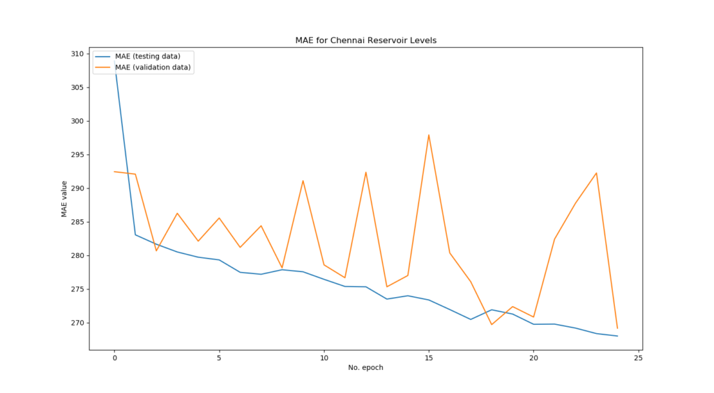
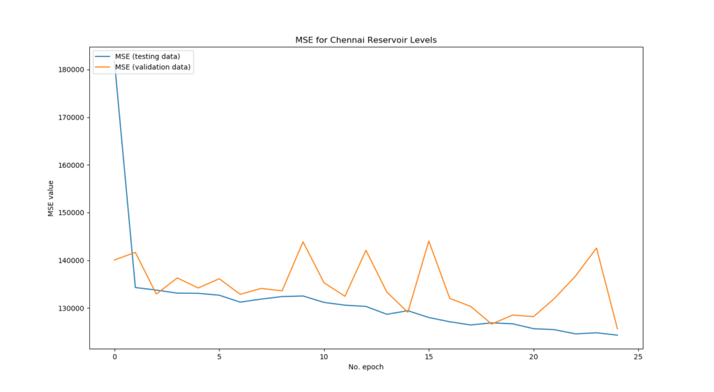

Sometimes, you don't want to visualize the [architecture](https://www.machinecurve.com/index.php/2019/10/07/how-to-visualize-a-model-with-keras/) of your Keras model, but rather you wish to show the training process.

One way of achieving that is by exporting all the loss values and accuracies manually, adding them to an Excel sheet - before generating a chart.

Like I did a while ago 🙈

[](https://www.machinecurve.com/wp-content/uploads/2019/07/image-2.png)

It goes without saying that there are smarter ways for doing that. In today's blog, we'll cover how to visualize the training process in Keras - just like above, but then with a little piece of extra code. This blog covers precisely what you need in order to generate such plots, it discusses the Keras `History` object which contains the data you'll need and presents the visualization code.

In this tutorial, you will learn...

- That a History object is attached to `model.fit` in TensorFlow/Keras and that it provides useful information.
- What the structure of this History object is.
- How to visualize the contents of the History object to see model performance across epochs.

Let's go!

_Note that model code is also available [on GitHub](https://github.com/christianversloot/keras-visualizations)._

* * *

**Update 26/Jan/2021:** updated the article. It now uses TensorFlow 2 meaning that it works with recent versions of the library. Additionally, the headers were changed, and a few textual corrections were made.

* * *

\[toc\]

* * *

## Code example: visualizing the History object of your TensorFlow model

Here is a **simple but complete example** that can be used for visualizing the performance of your TensorFlow model during training. It utilizes the `history` object, which is returned by calling `model.fit()` on your Keras model. This example visualizes the _training loss_ and _validation loss_, which can e.g. be MAE.

If you want to understand everything in more detail - such as how this History object works - then make sure to read the rest of this tutorial as well! :)

```
from tensorflow.keras.models import Sequential
import matplotlib.pyplot as plt

# Some TensorFlow/Keras model
model = Sequential()
model.compile()
history = model.fit()

# Plot history: MAE
plt.plot(history.history['loss'], label='MAE (training data)')
plt.plot(history.history['val_loss'], label='MAE (validation data)')
plt.title('MAE for Chennai Reservoir Levels')
plt.ylabel('MAE value')
plt.xlabel('No. epoch')
plt.legend(loc="upper left")
plt.show()
```

* * *

## What you'll need

Since we're creating some actual code, you'll likely wish to run it on your machine. For this to work, you need to install certain software dependencies. Specifically:

- You'll need **Python** to run Keras, preferably 3.8+
- A recent version of **TensorFlow**, 2.1.0+ for example.
- What's also necessary is **Matplotlib** and, by consequence, **SciPy**.

Preferably, you run these in an Anaconda environment that isolates these packages from your other development environments. It saves you a lot of struggle as packages could otherwise interfere with each other.

* * *

## The model we'll work with today

In this blog we want to visualize the training process of a Keras model. This requires that we'll work with an actual model. We use this simple one today:

```
# Load dependencies
from tensorflow.keras.models import Sequential
from tensorflow.keras.layers import Dense
import numpy as np

# Load data
dataset = np.loadtxt('./chennai_reservoir_levels.csv', delimiter='|', skiprows=1, usecols=(1,2,3,4))

# Shuffle dataset
np.random.shuffle(dataset)

# Separate features and targets
X = dataset[:, 0:3]
Y = dataset[:, 3]

# Set the input shape
input_shape = (3,)
print(f'Feature shape: {input_shape}')

# Create the model
model = Sequential()
model.add(Dense(16, input_shape=input_shape, activation='relu'))
model.add(Dense(8, activation='relu'))
model.add(Dense(1, activation='linear'))

# Configure the model and start training
model.compile(loss='mean_absolute_error', optimizer='adam', metrics=['mean_squared_error'])
model.fit(X, Y, epochs=25, batch_size=1, verbose=1, validation_split=0.2)
```

Why such a simple one? Well - it's not about the model today, so we should keep most complexity out of here. The regular reader recognizes that this is the regression MLP that we created [earlier](https://www.machinecurve.com/index.php/2019/07/30/creating-an-mlp-for-regression-with-keras/). It loads Chennai, India based water reservoir water levels and attempts to predict the levels at one given the levels in the other 3 reservoirs. It does so by means of the Keras Sequential API and densely-conencted layers and MAE as a [regression loss function](https://www.machinecurve.com/index.php/2019/10/04/about-loss-and-loss-functions/#loss-functions-for-regression), with MSE as an additional one. It performs training in 25 epochs.

Let's create a file called `history_visualization.py` and paste the above code into it.

* * *

## The `History` object

When running this model, Keras maintains a so-called `History` object in the background. This object keeps all loss values and other metric values in memory so that they can be used in e.g. [TensorBoard](https://www.tensorflow.org/tensorboard/r1/summaries), in Excel reports or indeed for our own custom visualizations.

The history object is the output of the `fit` operation. Hence, it can be accessed in your Python script by slightly adapting that row in the above code to:

`history = model.fit(X, Y, epochs=250, batch_size=1, verbose=1, validation_split=0.2)`

In the Keras docs, we find:

> The `History.history` attribute is a dictionary recording training loss values and metrics values at successive epochs, as well as validation loss values and validation metrics values (if applicable).
> 
> [Keras docs on model visualization](https://keras.io/visualization/#model-visualization)

Also add `print(history)` so that we can inspect the history before we visualize it, to get a feel for its structure.

It indeed outputs the model history (note that for simplicity we trained with only 5 epochs):

```
{'val_loss': [281.05517045470464, 281.0461930366744, 282.3450624835175, 283.21272195725317, 278.22250578392925], 'val_mean_squared_error': [131946.00690089026, 131610.73269158995, 132186.26299269326, 133621.92045977595, 131213.40662287443], 'loss': [319.1303724563634, 279.54961594772305, 277.2224043372698, 276.19018290098035, 276.37119589065435], 'mean_squared_error': [210561.46019607811, 132310.933269216, 131070.35584168187, 131204.38709398077, 131249.8484192732]}
```

Or, when nicely formatted:

```
{
   "val_loss":[
      281.05517045470464,
      281.0461930366744,
      282.3450624835175,
      283.21272195725317,
      278.22250578392925
   ],
   "val_mean_squared_error":[
      131946.00690089026,
      131610.73269158995,
      132186.26299269326,
      133621.92045977595,
      131213.40662287443
   ],
   "loss":[
      319.1303724563634,
      279.54961594772305,
      277.2224043372698,
      276.19018290098035,
      276.37119589065435
   ],
   "mean_squared_error":[
      210561.46019607811,
      132310.933269216,
      131070.35584168187,
      131204.38709398077,
      131249.8484192732
   ]
}
```

It nicely displays all the metrics that we defined: **MAE** ("loss" and "val\_loss" i.e. for both testing and validation data) and **MSE** as an additional metric.

Since this is a simple Python dictionary structure, we can easily use it for visualization purposes.

* * *

## Visualizing the model history

Let's now add an extra import - for Matplotlib, our visualization library:

`import matplotlib.pyplot as plt`

Next, ensure that the number of epochs is at 25 again.

### Visualizing the MAE

Let's now add a piece of code that visualizes the MAE:

```
# Plot history: MAE
plt.plot(history.history['loss'], label='MAE (training data)')
plt.plot(history.history['val_loss'], label='MAE (validation data)')
plt.title('MAE for Chennai Reservoir Levels')
plt.ylabel('MAE value')
plt.xlabel('No. epoch')
plt.legend(loc="upper left")
plt.show()
```

Note that since you defined MAE to be the official loss value (`loss='mean_absolute_error'`), you'll have to use `loss` and `val_loss` in the History object. Above, we additionally add labels, a title and a legend which eventually arrives at this:

[](https://www.machinecurve.com/wp-content/uploads/2019/10/mae.png)

### Visualizing the MSE

Similarly, we can add a visualization of our MSE value - but here, we'll have to use `mean_squared_error` and `val_mean_squared_error` instead, because they are an additional metric (`metrics=['mean_squared_error']`).

```
# Plot history: MSE
plt.plot(history.history['mean_squared_error'], label='MSE (training data)')
plt.plot(history.history['val_mean_squared_error'], label='MSE (validation data)')
plt.title('MSE for Chennai Reservoir Levels')
plt.ylabel('MSE value')
plt.xlabel('No. epoch')
plt.legend(loc="upper left")
plt.show()
```

This is the output for our training process:

[](https://www.machinecurve.com/wp-content/uploads/2019/10/mse.png)

### Interpreting the training process

What can we observe from the training process?

- Both the _validation_ MAE and MSE are very sensitive to weight swings over the epochs, but the general trend goes downward. This is good.
- Especially testing loss decreases very rapidly in the beginning, to decrease only lightly when the number of epochs increases. This is normal and is a good sign.
- The _testing_ MAE and MSE are less sensitive to weight swings. This might be the case because the model has never seen the data before. This is also good.
- What can be improved is that apparently the model can improve even further: _testing loss_ is still decreasing at the 25th epoch. This means that the model is not yet overfitting to the data and that its predictive power can be increased. The solution: more epochs.

* * *

## Summary

As you can see, visualizing the training process of your Keras model can help you understand how the model performs. While you can do this manually with e.g. Excel, we've seen in this blog that you can also use built-in Keras utils (namely, the `History`object) to generate an overview of your training process. With Matplotlib, this history can subsequently be visualized.

I hope you've learnt something today - if so, please let me know in the comments; I'd appreciate your remarks! 😊 Feel free to leave a comment as well if you have any questions or when you think this blog can be improved. I'll happily edit the text. Happy engineering!

_Note that model code is also available [on GitHub](https://github.com/christianversloot/keras-visualizations)._

* * *

## Resources

Keras. (n.d.). Visualization. Retrieved from [https://keras.io/visualization/#model-visualization](https://keras.io/visualization/#model-visualization)

Creating an MLP for regression with Keras – MachineCurve. (2019, July 30). Retrieved from [https://www.machinecurve.com/index.php/2019/07/30/creating-an-mlp-for-regression-with-keras/](https://www.machinecurve.com/index.php/2019/07/30/creating-an-mlp-for-regression-with-keras/)

How to visualize a model with Keras? – MachineCurve. (2019, October 7). Retrieved from [https://www.machinecurve.com/index.php/2019/10/07/how-to-visualize-a-model-with-keras/](https://www.machinecurve.com/index.php/2019/10/07/how-to-visualize-a-model-with-keras/)

TensorBoard: Visualizing Learning. (n.d.). Retrieved from [https://www.tensorflow.org/tensorboard/r1/summaries](https://www.tensorflow.org/tensorboard/r1/summaries)
