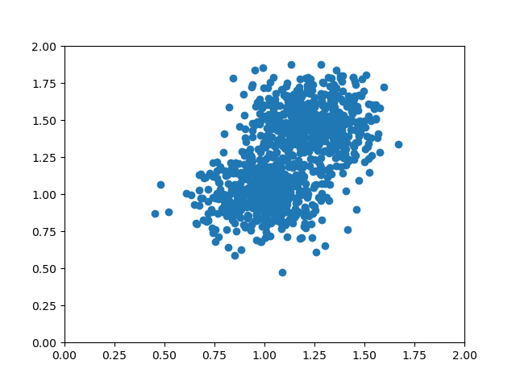
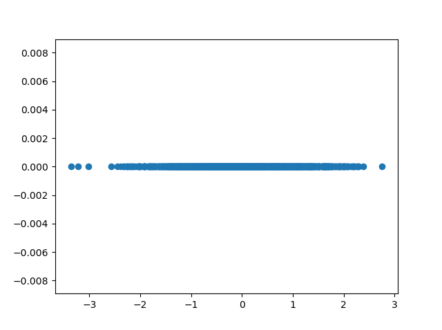
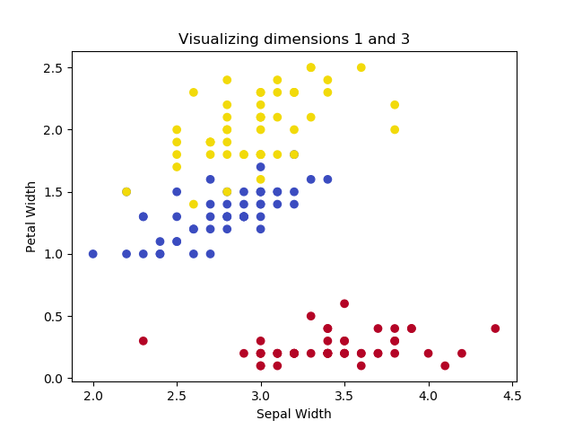
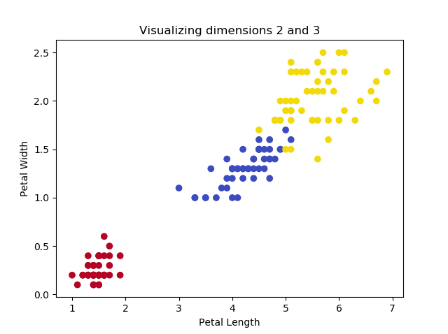
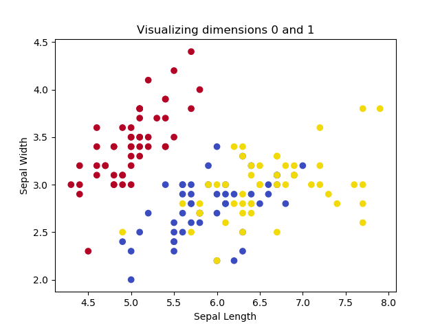
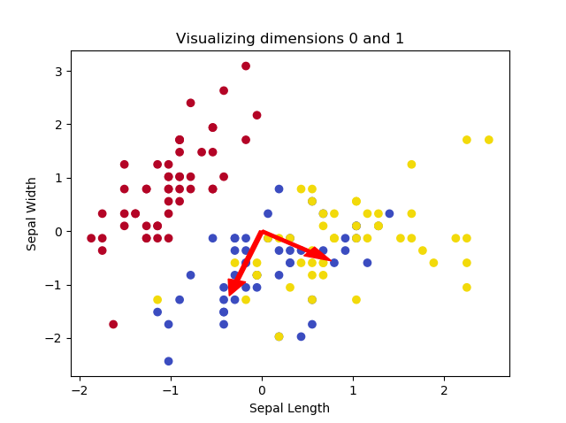
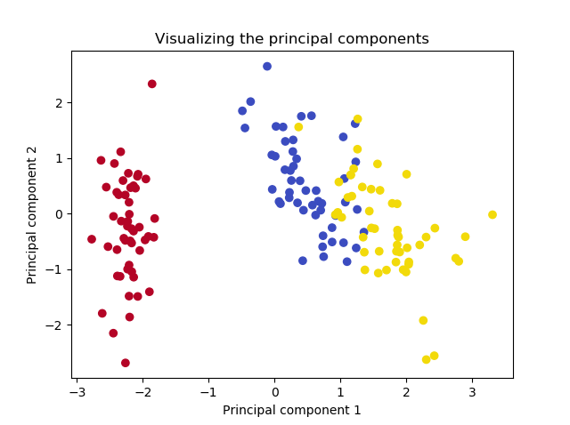
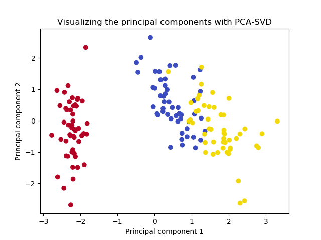
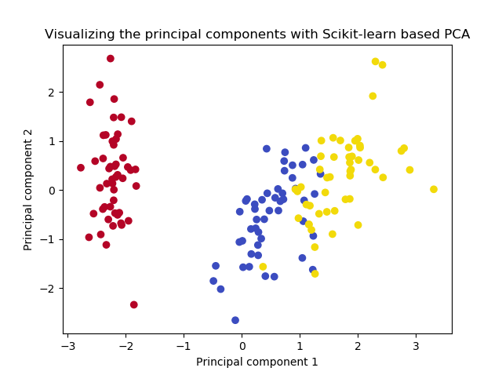

Training a Supervised Machine Learning model - whether that is a traditional one or a Deep Learning model - involves a few steps. The first is feeding forward the data through the model, generating predictions. The second is comparing those predictions with the actual values, which are also called ground truth. The third, then, is to optimize the model based on the minimization of some objective function.

In this iterative process, the model gets better and better, and sometimes it even gets _really_ good.

But what data will you feed forward?

Sometimes, your input sample will contain many _columns_, also known as features. It is common knowledge (especially with traditional models) that using every column in your Machine Learning model will mean trouble, the so-called curse of dimensionality. In this case, you'll have to selectively handle the features you are working with. In this article, we'll cover **Principal Component Analysis** (PCA), which is one such way. It provides **a gentle but extensive introduction to feature extraction for your Machine Learning model with PCA.**

It is structured as follows. First of all, we'll take a look at what PCA is. We do this through the lens of the Curse of Dimensionality, which explains why we need to reduce dimensionality especially with traditional Machine Learning algorithms. This also involves the explanation of the differences between Feature Selection and Feature Extraction technique, which have a different goal. PCA, which is part of the Feature Extraction branch of techniques, is then introduced.

When we know sufficiently about PCA conceptually, we'll take a look at it from a Python point of view. For a sample dataset, we're going to perform PCA in a step-by-step fashion. We'll take a look at all the individual components. Firstly, we'll compute the covariance matrix for the variables. Then, we compute the eigenvectors and eigenvalues, and select which ones are best. Subsequently, we compose the PCA projection matrix for mapping the data onto the axes of the principal components. This allows us to create entirely new dimensions which capture most of the variance from the original dataset, at a fraction of the dimensions. Note that SVD can also be used instead of eigenvector decomposition; we'll also take a look at that.

Once we clearly understand how PCA happens by means of the Python example, we'll show you how you don't have to reinvent the wheel if you're using PCA. If you understand what's going on, it's often better to use a well-established library for computing the PCA. Using Scikit-learn's `sklearn.decomposition.PCA` API, we will finally show you how to compute principal components and apply them to perform dimensionality reduction for your dataset.

All right. Enough introduction for now.

Let's get to work! 😎

**Update 11/Jan/2021:** added quick code example to start using PCA straight away. Also corrected a few spelling issues.

* * *

\[toc\]

* * *

## Code example: using PCA with Python

This quick code example allows you to start using Principal Component Analysis with Python immediately. If you want to understand the concepts and code in more detail, make sure to read the rest of this article :)

```
from sklearn import datasets
from sklearn.decomposition import PCA
from sklearn.preprocessing import StandardScaler

# Load Iris dataset
iris = datasets.load_iris()
X = iris.data
y = iris.target

# Standardize
scaler = StandardScaler()
scaler.fit(X)
X = scaler.transform(X)

# PCA
pca = PCA(n_components=2)
pca.fit(X)
print(pca.explained_variance_ratio_)
print(pca.components_)
X = pca.transform(X)
```

* * *

## What is Principal Component Analysis?

Before we dive in to the specifics of PCA, I think we should first take a look at why it can be really useful for Machine Learning projects. For this reason, we will first take a look at Machine Learning projects and the Curse of Dimensionality, which is especially present when using older Machine Learning algorithms (Support Vector Machines, Logistic Regression, ...).

Then, we'll discuss what can be done against it - _dimensionality reduction_ - and explain the difference between Feature Selection and Feature Extraction. Finally, we'll get to PCA - and provide a high-level introduction.

### Machine Learning and the Curse of Dimensionality

If you are training a Supervised Machine Learning model, at a high level, you are following a three-step, iterative process:


Since Supervised Learning means that you have a dataset at your disposal, the first step in training a model is **feeding the samples to the model**. For every sample, a prediction is generated. Note that at the first iteration, the model has just been initialized. The predictions therefore likely make no sense at all.

This becomes especially evident from what happens in the second step, **where predictions and ground truth (= actual targets) are compared**. This comparison produces an [error or loss value](https://www.machinecurve.com/index.php/2020/11/02/machine-learning-error-bias-variance-and-irreducible-error-with-python/) which illustrates how bad the model performs.

The third step is then really simple: you **improve the model**. Depending on the Machine Learning algorithm, optimization happens in different ways. In the case of Neural networks, gradients are computed with backpropagation, and subsequently [optimizers](https://www.machinecurve.com/index.php/2019/11/03/extensions-to-gradient-descent-from-momentum-to-adabound/) are used for changing the model internals. Weights can also be changed by minimizing one function only; it just depends on the algorithm.

You then start again. Likely, because you have optimized the model, the predictions are a little bit better now. You simply keep iterating until you are satisfied with the results, and then you stop the training process.

#### Underfitting and overfitting a model

When you are performing this iterative process, you are effectively moving from a model that is _underfit_ to a model that demonstrates a _good fit_. If you want to understand these concepts in more detail, [this article can help](https://www.machinecurve.com/index.php/2020/12/01/how-to-check-if-your-deep-learning-model-is-underfitting-or-overfitting/), but let's briefly take a look at them here as well.

In the first stages of the training process, your model is likely not able to capture the patterns in your dataset. This is visible in the left part of the figure below. The solution is simple: just keep training until you achieve the right fit for the dataset (that's the right part). Now, you _can't keep training forever_. If you do, the model will learn to focus too much on patterns hidden within your training dataset - patterns that may not be present in other real-world data at all; patterns truly specific to the sample with which you are training.

The result: a model tailored to your specific dataset, visible in the middle part of the figure.

In other words, training a Machine Learning model involves finding a good balance between a model that is underfit and a model that is overfit. Fortunately, many techniques are available [to help you with this](https://www.machinecurve.com/index.php/2019/05/30/avoid-wasting-resources-with-earlystopping-and-modelcheckpoint-in-keras/), but it's one of the most common problems in Supervised ML today.

- [](https://www.machinecurve.com/wp-content/uploads/2020/11/30under.png)
    
- [](https://www.machinecurve.com/wp-content/uploads/2020/11/30over.png)
    
- [](https://www.machinecurve.com/wp-content/uploads/2020/11/30good.png)
    

On the left: a model that is underfit with respect to the data. In the middle: a model that is overfit with respect to the data. On the right: the fit that we were looking for.

#### Having a high-dimensional feature vector

I think the odds are that I can read your mind at this point.

Overfitting, underfitting, and training a Machine Learning model - how are they related to Principal Component Analysis?

That's a fair question. What I want to do is to illustrate why a large dataset - in terms of the number of columns - can significantly increase the odds that your model will overfit.

Suppose that you have the following feature vector:

\[latex\]\\textbf{x} = \[1.23, -3.00, 45.2, 9.3, 0.1, 12.3, 8.999, 1.02, -2.45, -0.26, 1.24\]\[/latex\]

This feature vector is 11-dimensional.

Now suppose that you have 200 samples.

Will a Machine Learning model be able to _generalize_ across all eleven dimensions? In other words, do we have sufficient samples to cover large parts of the domains for all features in the vector (i.e., all the axes in the 11-dimensional space)? Or does it look like a cheese with (massive) holes?

I think it's the latter. Welcome to the Curse of Dimensionality.

#### The Curse of Dimensionality

Quoted from Wikipedia:

> In machine learning problems that involve learning a "state-of-nature" from a finite number of data samples in a high-dimensional feature space with each feature having a range of possible values, typically an enormous amount of training data is required to ensure that there are several samples with each combination of values.
> 
> Wikipedia (n.d.)

In other words, that's what we just described.

The point with "\[ensuring that there are several samples with each combination of values" is that when this is performed well, you will likely be able to train a model that (1) performs well and (2) generalizes well across many settings. With 200 samples, however, it's _100% certain_ that you don't meet this requirement. The effect is simple: your model will overfit to the data at hand, and it will become worthless if it is used with data from the real world.

Since increasing dimensionality equals an increasingly growing need for more data, the only way out of this curse is to reduce the number of dimensions in our dataset. This is called Dimensionality Reduction, and we'll now take a look at two approaches - Feature Selection and Feature Extraction.

### Dimensionality Reduction: Feature Selection vs Feature Extraction

We saw that if we want to decrease the odds of overfitting, we must reduce the dimensionality of our data. While this can easily be done in theory (we can simply cut off a few dimensions, who cares?), this gets slightly difficult in practice (which dimension to cut... because, how do I know which one contributes most?).

And what if _each dimension contributes an equal emount to the predictive power of the model?_ What then?

In the field of Dimensionality Reduction, there are two main approaches that you can use: Feature Selection and Feature Extraction.

- **Feature Selection** involves "the process of selecting a subset of relevant features (variables, predictors) for use in model construction" (Wikipedia, 2004). In other words, Feature Selection approaches attempt to measure the contribution of each feature, so that you can keep the ones that contribute most. What must be clear is that your model will be trained with the _original_ variables; however, with only a few of them.
    - Feature Selection can be a good idea if you already think that most variance within your dataset can be explained by a few variables. If the others are truly non-important, then you can easily discard them without losing too much information.
- **Feature Extraction**, on the other hand, "starts from an initial set of measured data and builds derived values (features) intended to be informative and non-redundant" (Wikipedia, 2003). In other words, _a derived dataset will be built_ that can be used for training your Machine Learning model. It is lower-dimensional compared to the original dataset. It will be as informative as possible (i.e., as much information from the original dataset is pushed into the new variables) while non-redundant (i.e., we want to avoid that information present in one variable in the new dataset is also present in another variable in the new dataset). In other words, we get a lower-dimensional dataset that explains most variance in the dataset, while keeping things relatively simple.
    - Especially in the case where each dimension contributes an equal emount, Feature Extraction can be preferred over Feature Selection. The same is true if you have no clue about the contribution of each variable to the model's predictive power.

### Introducing Principal Component Analysis (PCA)

Now that we are aware of the two approaches, it's time to get to the point. We'll now introduce PCA, a Feature Extraction technique, for dimensionality reduction.

**Principal Component Analysis** is defined as follows:

> Principal component analysis (PCA) is the process of computing the principal components and using them to perform a change of basis on the data, sometimes using only the first few principal components and ignoring the rest.
> 
> Wikipedia (2002)

Well, that's quite a technical description, isn't it. And what are "principal components"?

> The principal components of a collection of points in a real p-space are a sequence of \[latex\]p\[/latex\] direction vectors, where the \[latex\]i^{th}\[/latex\] vector is the direction of a line that best fits the data while being orthogonal to the first \[latex\]i - 1\[/latex\] vectors.
> 
> Wikipedia (2002)

I can perfectly get it when you still have no idea what PCA is after reading those two quotes. I had the same. For this reason, let's break down stuff step-by-step.

**The goal of PCA:** finding a set of vectors (principal components) that best describe the spread and direction of your data across its many dimensions, allowing you to subsequently pick the top-\[latex\]n\[/latex\] best-describing ones for reducing the dimensionality of your feature space.

**The steps of PCA:**

1. If you have a dataset, its spread can be expressed in orthonormal vectors - the principal directions of the dataset. Orthonormal, here, means that the vectors are orthogonal to each other (i.e. they have an angle of 90°) and are of size 1.
2. By sorting these vectors in order of importance (by looking at their relative contribution to the spread of the data as a whole), we can find the dimensions of the data which explain most variance.
3. We can then reduce the number of dimensions to the most important ones only.
4. And finally, we can project our dataset onto these new dimensions, called the principal components, performing dimensionality reduction without losing much of the information present in the dataset.

**The how:**

Although we will explain _how_ later in this article, we'll now visually walk through performing PCA at a high level. This allows you to understand _what happens_ first, before we dive into _how it happens._

Another important note is that for step (1), decomposing your dataset into vectors can be done in two different ways - by means of (a) eigenvector decomposition of the covariance matrix, or (b) Singular Value Decomposition. Later in this article, we'll walk through both approaches step-by-step.

#### Expressing the spread of your dataset in vectors

Suppose that we generate a dataset based on two overlapping blobs which we consider to be part of just one dataset:

```
from sklearn.datasets import make_blobs
import matplotlib.pyplot as plt
import numpy as np

# Configuration options
num_samples_total = 1000
cluster_centers = [(1,1), (1.25,1.5)]
num_classes = len(cluster_centers)

# Generate data
X, y = make_blobs(n_samples = num_samples_total, centers = cluster_centers, n_features = num_classes, center_box=(0, 1), cluster_std = 0.15)
e)

# Make plot
plt.scatter(X[:, 0], X[:, 1])
axes = plt.gca()
axes.set_xlim([0, 2])
axes.set_ylim([0, 2])
plt.show()
```

...which looks as follows:



  
If you look closely at the dataset, you can see that it primarily spreads into two directions. These directions are from the upper right corner to the lower left corner and from the lower right middle to the upper left middle. Those directions are different from the **axis directions**, which are orthogonal to each other: the x and y axes have an angle of 90 degrees.

No other set of directions will explain as much as the variance than the one we mentioned above.

After [standardization](https://www.machinecurve.com/index.php/2020/11/19/how-to-normalize-or-standardize-a-dataset-in-python/), we can visualize the directions as a pair of two vectors. These vectors are called the **principal directions** of the data (StackExchange, n.d.). There are as many principal directions as the number of dimensions; in our case, there are two.


We call these vectors **eigenvectors**. Their length is represented by what is known as an **eigenvalue**. They play a big role in PCA because of the following reason:

> \[The eigenvectors and related\] eigenvalues explain the variance of the data along the new feature axes.
> 
> Raschka (2015)

In other words, they allow us to capture both the (1) direction and (2) magnitude of the spread in your dataset.

Notice that the vectors are orthogonal to each other. Also recall that our axes are orthogonal to each other. You can perhaps now imagine that it becomes possible to perform a transformation to your dataset, so that the directions of the axes are equal to the directions of the eigenvectors. In other words, we change the "viewpoint" of our data, so that the axes and vectors have equal directions.

This is the core of PCA: projecting the data to our principal directions, which are then called **principal components**.

The benefit here is that while the _eigenvectors_ tell us something about the directions of our projection, the corresponding _eigenvalues_ tell us something about the **importance** of that particular principal direction in explaining the variance of the dataset. It allows us to easily discard the directions that don't contribute sufficiently enough. That's why before projecting the dataset onto the principal components, we must first sort the vectors and reduce the number of dimensions.

#### Sorting the vectors in order of importance

Once we know the eigenvectors and eigenvalues that explain the spread of our dataset, we must sort them in order of descending importance. This allows us to perform dimensionality reduction, as we can keep the principal directions which contribute most significantly to the spread in our dataset.

Sorting is simple: we sort the list with eigenvalues in descending order and ensure that our list with eigenvectors is sorted in the same way. In other words, the pairs of eigenvectors and eigenvalues are jointly sorted in a descending order based on the eigenvalue. As the largest eigenvalues indicate the biggest explanation for spread in your dataset, they must be on top of the list.

For the example above, we can see that the eigenvalue for the downward-oriented eigenvector exceeds the one for the upward-oriented vector. If we draw a line through the dataset that overlaps with the vector, we can also see that variance for that line as a whole (where variance is defined as the squared distance of each point to the mean value for the line) is biggest. We can simply draw no line where variance is larger.

In fact, the total (relative) contribution of the eigenvectors to the spread for our example is as follows:

```
[0.76318124 0.23681876]
```

(We'll look at how we can determine this later.)

So, for our example above, we now have a sorted list with eigenpairs.

#### Reducing the number of dimensions

As we saw above, the first eigenpair explains 76.3% of the spread in our dataset, whereas the second one explains only 23.7%. Jointly, they explain 100% of the spread, which makes sense.

Using PCA for dimensionality reduction now allows us to take the biggest-contributing vectors (if your original feature space was say 10-dimensional, it is likely that you can find a smaller set of vectors which explains most of the variance) and only move forward with them.

If our goal was to reduce dimensionality to one, we would now move forward and take the 0.763 contributing eigenvector for data projection. Note that this implies that we will lose 0.237 worth of information about our spread, but in return get a lower number of dimensions.

Clearly, this example with only two dimensions makes no rational sense as two dimensions can easily be handled by Machine Learning algorithms, but this is incredibly useful if you have many dimensions to work with.

#### Projecting the dataset

Once we have chosen the number of eigenvectors that we will use for dimensionality reduction (i.e. our target number of dimensions), we can project the data onto the principal components - or component, in our case.

This means that we will be changing the axes so that they are now equal to the eigenvectors.

In the example below, we can project our data to one eigenvector. We can see that only the \[latex\]x\[/latex\] axis has values after projecting, and that hence our feature space has been reduced to one dimension.

We have thus used PCA for dimensionality reduction.



#### The how of generating eigenpairs: Eigenvector Decomposition or Singular Value Decomposition

Above, we covered the general steps of performing Principal Component Analysis. Recall that they are as follows:

1. Decomposing the dataset into a set of eigenpairs.
2. Sorting the eigenpairs in descending order of importance.
3. Selecting \[latex\]n\[/latex\] most important eigenpairs, where \[latex\]n\[/latex\] is the desired number of dimensions.
4. Projecting the data to the \[latex\]n\[/latex\] eigenpairs so that their directions equal the ones of our axes.

In step (1), we simply mentioned that we can express the spread of our data by means of eigenpairs. On purpose, we didn't explain _how_ this can be done, for the sake of simplicity.

In fact, there are two methods that are being used for this purpose today: **Eigenvector Decomposition** (often called "EIG") and **Singular Value Decomposition** ("SVD"). Using different approaches, they can be used to obtain the same end result: expressing the spread of your dataset in eigenpairs, the principal directions of your data, which can subsequently be used to reduce the number of dimensions by projecting your dataset to the most important ones, the principal components.

While mathematically and hence formally you can obtain the same result with both, in practice PCA-SVD is numerically more stable (StackExchange, n.d.). For this reason, you will find that most libraries and frameworks favor a PCA-SVD implementation over a PCA-EIG one. Nevertheless, you can still achieve the same result with both approaches!

In the next sections, we will take a look at clear and step-by-step examples of PCA with EIG and PCA with SVD, allowing you to understand the differences intuitively. We will then look at `sklearn.decomposition.PCA`, Scikit-learn's implementation of Principal Component Analysis based on PCA-SVD. There is no need to perform PCA manually if there are great tools out there, after all! ;-)

* * *

## PCA-EIG: Eigenvector Decomposition with Python Step-by-Step

One of the ways in which PCA can be performed is by means of **Eigenvector Decomposition (EIG)**. More specifically, we can use the covariance matrix of our \[latex\]N\[/latex\]-dimensional dataset and decompose it into \[latex\]N\[/latex\] eigenpairs. We can do this as follows:

1. **Standardizing the dataset:** EIG based PCA only works well if the dataset is centered and has a mean of zero (i.e. \[latex\]\\mu = 0.0\[/latex\]). We will use [standardization](https://www.machinecurve.com/index.php/2020/11/19/how-to-normalize-or-standardize-a-dataset-in-python/) for this purpose, which also scales the data to a standard deviation of one (\[latex\]\\sigma = 1.0\[/latex\]).
2. **Computing the covariance matrix of the variables:** a covariance matrix indicates how much variance each individual variable has, and how much they 'covary' - in other words, how much certain variables move together.
3. **Decomposing the covariance matrix into eigenpairs:** mathematically, we can rewrite the covariance matrix so that we can get a set of eigenvectors and eigenvalues, or eigenpairs.
4. **Sorting the eigenpairs in decreasing order of importance**, to find the principal directions in your dataset which contribute to the spread most significantly.
5. **Selecting the variance contribution of your principal directions and selecting \[latex\]n\[/latex\] principal components:** if we know the relative contributions to the spread for each principal direction, we can perform dimensionality reduction by selecting only the \[latex\]n\[/latex\] most contributing principal components.
6. **Building the projection matrix** for projecting our original dataset onto the principal components.

We can see that steps (1), (4), (5) and (6) are general - we also saw them above. Steps (2) and (3) are specific to PCA-EIG and represent the core of what makes eigenvector decomposition based PCA unique. We will now cover each step in more detail, including step-by-step examples with Python. Note that the example in this section makes use of native / vanilla Python deliberately, and that Scikit-learn based implementations of e.g. [standardization](https://www.machinecurve.com/index.php/2020/11/19/how-to-normalize-or-standardize-a-dataset-in-python/) and PCA will be used in another section.

### Using the multidimensional Iris dataset

If we want to show how PCA works, we must use a dataset where the number of dimensions \[latex\]> 2\[/latex\]. Fortunately, Scikit-learn provides the Iris dataset, which can be used to classify three groups of Iris flowers based on four characteristics (and hence features or dimensions): petal length, petal width, sepal length and sepal width.

This code can be used for visualizing two dimensions every time:

```
from sklearn import datasets
import matplotlib.pyplot as plt
import numpy as np

# Configuration options
dimension_one = 1
dimension_two = 3

# Load Iris dataset
iris = datasets.load_iris()
X = iris.data
y = iris.target

# Shape
print(X.shape)
print(y.shape)

# Dimension definitions
dimensions = {
  0: 'Sepal Length',
  1: 'Sepal Width',
  2: 'Petal Length',
  3: 'Petal Width'
}

# Color definitions
colors = {
  0: '#b40426',
  1: '#3b4cc0',
  2: '#f2da0a',
}

# Legend definition
legend = ['Iris Setosa', 'Iris Versicolour', 'Iris Virginica']

# Make plot
colors = list(map(lambda x: colors[x], y))
plt.scatter(X[:, dimension_one], X[:, dimension_two], c=colors)
plt.title(f'Visualizing dimensions {dimension_one} and {dimension_two}')
plt.xlabel(dimensions[dimension_one])
plt.ylabel(dimensions[dimension_two])
plt.show()
```

This yields the following plots, if we play with the dimensions:

- [](https://www.machinecurve.com/wp-content/uploads/2020/12/iris-mix.png)
    
- [](https://www.machinecurve.com/wp-content/uploads/2020/12/iris-petal.png)
    
- [](https://www.machinecurve.com/wp-content/uploads/2020/12/iris-sepal.png)
    

The images illustrate that two of the Iris flowers cannot be linearly separated, but that this group _can_ be separated from the other Iris flower. Printing the shape yields the following:

```
(150, 4)
(150,)
```

...indicating that we have only 150 samples, but that our feature space is four-dimensional. Clearly a case where feature extraction _could_ be beneficial for training our Machine Learning model.

### Performing standardization

We first add Python code for [standardization](https://www.machinecurve.com/index.php/2020/11/19/how-to-normalize-or-standardize-a-dataset-in-python/), which brings our data to \[latex\]\\mu = 0.0, \\sigma = 1.0\[/latex\] by performing \[latex\]x = \\frac{x - \\mu}{\\sigma}\[/latex\] for each dimension (MachineCurve, 2020).

```
# Perform standardization
for dim in range(0, X.shape[1]):
  print(f'Old mean/std for dim={dim}: {np.average(X[:, dim])}/{np.std(X[:, dim])}')
  X[:, dim] = (X[:, dim] - np.average(X[:, dim])) / np.std(X[:, dim])
  print(f'New mean/std for dim={dim}: {np.abs(np.round(np.average(X[:, dim])))}/{np.std(X[:, dim])}')

# Make plot
colors = list(map(lambda x: colors[x], y))
plt.scatter(X[:, dimension_one], X[:, dimension_two], c=colors)
plt.title(f'Visualizing dimensions {dimension_one} and {dimension_two}')
plt.xlabel(dimensions[dimension_one])
plt.ylabel(dimensions[dimension_two])
plt.show()
```

And indeed:

```
Old mean/std for dim=0: 5.843333333333334/0.8253012917851409
New mean/std for dim=0: 0.0/1.0
Old mean/std for dim=1: 3.0573333333333337/0.4344109677354946
New mean/std for dim=1: 0.0/0.9999999999999999
Old mean/std for dim=2: 3.7580000000000005/1.759404065775303
New mean/std for dim=2: 0.0/1.0
Old mean/std for dim=3: 1.1993333333333336/0.7596926279021594
New mean/std for dim=3: 0.0/1.0
```

### Computing the covariance matrix of your variables

The next step is computing the covariance matrix for our dataset.

> In probability theory and statistics, a covariance matrix (…) is a square matrix giving the covariance between each pair of elements of a given random vector.
> 
> Wikipedia (2003)

If you're not into mathematics, I can understand that you don't know what this is yet. Let's therefore briefly take a look at a few aspects related to a covariance matrix before we move on, based on Lambers (n.d.).

**A variable:** such as \[latex\]X\[/latex\]. A mathematical representation of one dimension of the data set. For example, if \[latex\]X\[/latex\] represents \[latex\]\\text{petal width}\[/latex\], numbers such as \[latex\]1.19, 1.20, 1.21, 1.18, 1.16, ...\[/latex\] which represent the petal width for one flower can all be described by variable \[latex\]X\[/latex\].

**Variable mean:** the average value for the variable. Computed as the sum of all available values divided by the number of values summed together. As petal width represents `dim=3` in the visualization above, with a mean of \[latex\]\\approx 1.1993\[/latex\], we can see how the numbers above fit.

**Variance:** describing the "spread" of data around the variable. Computed as the sum of squared differences between each number and the mean, i.e. the sum of \[latex\](x - \\mu)^2\[/latex\] for each number.

**Covariance:** describing the _joint variability_ (or joint spread) of two variables. For each pair of numbers from both variables, covariance is computed as \[latex\]Cov(x, y) = (x - \\mu\_x)(y - \\mu\_y)\[/latex\].

**Covariance matrix for \[latex\]n\[/latex\] variables:** a matrix representing covariances for each pair of variables from some set of variables (dimensions) \[latex\]V = \[X, Y, Z, ....\]\[/latex\].

A covariance matrix for two dimensions \[latex\]X\[/latex\] and \[latex\]Y\[/latex\] looks as follows:

\[latex\]\\begin{pmatrix}Cov(X, X) & Cov(X, Y)\\\\ Cov(Y, X) & Cov(Y, Y)\\end{pmatrix}\[/latex\]

Fortunately, there are some properties which make covariance matrices interesting for PCA (Lambers, n.d.):

- \[latex\]Cov(X, X) = Var(X)\[/latex\]
- \[latex\]Cov(X, Y) = Cov(Y, X)\[/latex\].

By consequence, our covariance matrix is a symmetrical and square, \[latex\]n \\times n\[/latex\] matrix and can hence also be written as follows:

\[latex\]\\begin{pmatrix}Var(X) & Cov(X, Y)\\\\ Cov(Y, X) & Var(Y)\\end{pmatrix}\[/latex\]

We can compute the covariance matrix by generating a \[latex\]n \\times n\[/latex\] matrix and then filling it by iterating over its rows and columns, setting the value to the average covariance for each respective number from both variables:

```
# Compute covariance matrix
cov_matrix = np.empty((X.shape[1], X.shape[1])) # 4 x 4 matrix
for row in range(0, X.shape[1]):
  for col in range(0, X.shape[1]):
    cov_matrix[row][col] = np.round(np.average([(X[i, row] - np.average(X[:, row]))*(X[i, col]\
        - np.average(X[:, col])) for i in range(0, X.shape[0])]), 2)
```

If we compare our self-computed covariance matrix with one generated with NumPy's `np.cov`, we can see the similarities:

```
# Compare the matrices
print('Self-computed:')
print(cov_matrix)
print('NumPy-computed:')
print(np.round(np.cov(X.T), 2))

> Self-computed:
> [[ 1. -0.12  0.87  0.82]
>  [-0.12  1. -0.43 -0.37]
>  [ 0.87 -0.43  1. 0.96]
>  [ 0.82 -0.37  0.96  1. ]]
> NumPy-computed:
> [[ 1.01 -0.12  0.88  0.82]
>  [-0.12  1.01 -0.43 -0.37]
>  [ 0.88 -0.43  1.01  0.97]
>  [ 0.82 -0.37  0.97  1.01]]
```

### Decomposing the covariance matrix into eigenvectors and eigenvalues

Above, we have expressed the spread of our dataset across the dimensions in our covariance matrix. Recall that PCA works by expressing this spread in terms of _vectors_, called eigenvectors, which together with their corresponding eigenvalues tell us something about the direction and magnitude of the spread.

The great thing of EIG-PCA is that we can **decompose the covariance matrix into eigenvectors and eigenvalues.**

We can do this as follows:

\[latex\]\\mathbf C = \\mathbf V \\mathbf L \\mathbf V^\\top\[/latex\]

Here, \[latex\]\\mathbf V\[/latex\] is a matrix of _eigenvectors_ where each column is an eigenvector, \[latex\]\\mathbf L\[/latex\] is a diagonal matrix with eigenvalues and \[latex\]\\mathbf V^\\top\[/latex\] is the transpose of \[latex\]\\mathbf V\[/latex\].

We can use NumPy's `numpy.linalg.eig` to compute the eigenvectors for this square array:

```
# Compute the eigenpairs
eig_vals, eig_vect = np.linalg.eig(cov_matrix)
print(eig_vect)
print(eig_vals)
```

This yields the following:

```
[[ 0.52103086 -0.37921152 -0.71988993  0.25784482]
 [-0.27132907 -0.92251432  0.24581197 -0.12216523]
 [ 0.57953987 -0.02547068  0.14583347 -0.80138466]
 [ 0.56483707 -0.06721014  0.63250894  0.52571316]]
[2.91912926 0.91184362 0.144265   0.02476212]
```



If we compute how much each principal dimension contributes to variance explanation, we get the following:

```
# Compute variance contribution of each vector
contrib_func = np.vectorize(lambda x: x / np.sum(eig_vals))
var_contrib = contrib_func(eig_vals)
print(var_contrib)
print(np.sum(var_contrib))
> [0.72978232 0.2279609  0.03606625 0.00619053]
> 1.0
```

In other words, the first principal dimension contributes for 73%; the second one for 23%. If we therefore reduce the dimensionality to two, we get to keep approximately \[latex\]73 + 23 = 96%\[/latex\] of the variance explanation.

### Sorting the eigenpairs in decreasing order of importance

Even though the eigenpairs above have already been sorted, it's a thing we must definitely do - especially when you perform the decomposition in eigenpairs in a different way.

Sorting the eigenpairs happens by eigenvalue: the eigenvalues must be sorted in a descending way; the corresponding eigenvectors must therefore also be sorted equally.

```
# Sort eigenpairs
eigenpairs = [(np.abs(eig_vals[x]), eig_vect[:,x]) for x in range(0, len(eig_vals))]
eig_vals = [eigenpairs[x][0] for x in range(0, len(eigenpairs))]
eig_vect = [eigenpairs[x][1] for x in range(0, len(eigenpairs))]
print(eig_vals)
```

This yields sorted eigenpairs, as we can see from the eigenvalues:

```
[2.919129264835876, 0.9118436180017795, 0.14426499504958146, 0.024762122112763244]
```

### Selecting n principal components

Above, we saw that 96% of the variance can be explained by only two of the dimensions. We can therefore reduce the dimensionality of our feature space from \[latex\]n = 4\[/latex\] to \[latex\]n = 2\[/latex\] without losing much of the information.

### Building the projection matrix

The final thing we must do is generate the **projection matrix** and **project our original data onto the (two) principal components** (Raschka, 2015):

```
# Build the projection matrix
proj_matrix = np.hstack((eig_vect[0].reshape(4,1), eig_vect[1].reshape(4,1)))
print(proj_matrix)

# Project onto the principal components
X_proj = X.dot(proj_matrix)
```

### Voilà, you've performed PCA

If we now plot the projected data, we get the following plot:

```
# Make plot of projection
plt.scatter(X_proj[:, 0], X_proj[:, 1], c=colors)
plt.title(f'Visualizing the principal components')
plt.xlabel('Principal component 1')
plt.ylabel('Principal component 2')
plt.show()
```



That's it! You just performed Principal Component Analysis using Eigenvector Decomposition and have reduced dimensionality to two without losing much of the information in the dataset.

* * *

## PCA-SVD: Singular Value Decomposition with Python Step-by-Step

Above, we covered performing Principal Component Analysis with Eigenvector Decomposition of the dataset's covariance matrix. A more numerically stable method is using **Singular Value Decomposition** on the data matrix itself instead of Eigenvector Decomposition on its covariance matrix. In this section, we'll cover the SVD approach in a step-by-step fashion, using Python.

Note that here as well, we'll use a vanilla / native Python approach to performing PCA, since it brings more clarity. In the next section, we'll use the framework provided tools (i.e. `sklearn.decomposition.PCA`) instead of the native ones.

### Starting with the standardized Iris dataset

In the PCA-SVD approach, we also use the Iris dataset as an example. Using the code below, we'll load the Iris data and perform [standardization](https://www.machinecurve.com/index.php/2020/11/19/how-to-normalize-or-standardize-a-dataset-in-python/), which means that your mean will become \[latex\]\\mu = 0.0\[/latex\] and your standard deviation will become \[latex\]\\sigma = 1.0\[/latex\].

```
from sklearn import datasets
import matplotlib.pyplot as plt
import numpy as np

# Load Iris dataset
iris = datasets.load_iris()
X = iris.data
y = iris.target

# Shape
print(X.shape)
print(y.shape)

# Color definitions
colors = {
  0: '#b40426',
  1: '#3b4cc0',
  2: '#f2da0a',
}

# Legend definition
legend = ['Iris Setosa', 'Iris Versicolour', 'Iris Virginica']

# Perform standardization
for dim in range(0, X.shape[1]):
  print(f'Old mean/std for dim={dim}: {np.average(X[:, dim])}/{np.std(X[:, dim])}')
  X[:, dim] = (X[:, dim] - np.average(X[:, dim])) / np.std(X[:, dim])
  print(f'New mean/std for dim={dim}: {np.abs(np.round(np.average(X[:, dim])))}/{np.std(X[:, dim])}')
```

### Performing SVD on the data matrix

In the EIG variant of PCA, we computed the covariance matrix of our dataset, and then performed Eigenvector Decomposition on this matrix to find the eigenvectors and eigenvalues. We could then use these to sort the most important ones and project our dataset onto the most important ones, i.e. the principal components.

In the SVD variant, we compute the **singular values** of the **data matrix** instead. It is a generalization of the Eigenvector Decomposition, meaning that it can also be used on non-square and non-symmetric matrices (which in the EIG case required us to use the covariance matrix, which satisfies both criteria).

```
# Compute SVD
u, s, vh = np.linalg.svd(X.T, full_matrices=True)
```

In SVD, we decompose a matrix into three components:

- **Unitary arrays** \[latex\]U\[/latex\]
- **Vectors with the singular values** \[latex\]s\[/latex\]
- **Unitary arrays** \[latex\]vh\[/latex\]

Here, the columns of the unitary arrays give results equal to the eigenvectors of the covariance matrix in the PCA-EIG approach, and the singular value vectors are equal to the square roots of the eigenvalues of the covariance matrix (StackExchange, n.d.).

### Translating SVD outputs to usable vectors and values

In other words, by performing SVD on the data matrix, we can create the same results as with the PCA-EIG approach. With that approach, the eigenvectors of the covariance matrix were as follows:

```
[[ 0.52103086 -0.37921152 -0.71988993  0.25784482]
 [-0.27132907 -0.92251432  0.24581197 -0.12216523]
 [ 0.57953987 -0.02547068  0.14583347 -0.80138466]
 [ 0.56483707 -0.06721014  0.63250894  0.52571316]]
```

Now compare them to the output of `vh`:

```
print(vh)

> [[ 0.52106591 -0.26934744  0.5804131   0.56485654]
>  [-0.37741762 -0.92329566 -0.02449161 -0.06694199]
>  [ 0.71956635 -0.24438178 -0.14212637 -0.63427274]
>  [ 0.26128628 -0.12350962 -0.80144925  0.52359713]]
```

Except for the sign, the _columns_ of `vh` equal the _rows_ of the EIG-based eigenvectors.

### Sorting eigenvalues and eigenvectors

In the PCA-EIG scenario, you had to sort eigenpairs in descending order of the eigenvalues. `np.linalg.svd` already sorts in descending order, so this is no longer necessary.

### Selecting n components

Here, too, we can simply select \[latex\]n\[/latex\] components. As with the PCA-EIG scenario, here we also take \[latex\]n = 2\[/latex\] and hence reduce our dimensionality from 4 to 2.

### Building the projection matrix

We can now easily build the projection matrix as we did in the PCA-EIG case, project our data onto the principal components, and make a plot of the projection.

```
# Build the projection matrix
proj_matrix = np.hstack((vh[0].reshape(4,1), vh[1].reshape(4,1)))
print(proj_matrix)

# Project onto the principal components
X_proj = X.dot(proj_matrix)

# Make plot of projection
colors = list(map(lambda x: colors[x], y))
plt.scatter(X_proj[:, 0], X_proj[:, 1], c=colors)
plt.title(f'Visualizing the principal components')
plt.xlabel('Principal component 1')
plt.ylabel('Principal component 2')
plt.show()
```

The end result:



It's the same!

* * *

## Easy PCA with Scikit-learn for real datasets

In the previous two sections, we manually computed the principal components and manually projected our dataset onto these components - for the sake of showing you how stuff works.

Fortunately, this task is not necessary when using modern Machine Learning libraries such as Scikit-learn. Instead, it provides the functionality for PCA out of the box, through `sklearn.decomposition.PCA`. Really easy!

To be more precise, Scikit-learn utilizes PCA-SVD for computing the Principal Components of your dataset. Let's now take a look at how Scikit's approach works, so that you can finish this article both knowing how (1) PCA-EIG and PCA-SVD work (previous sections) and (2) how you can implement PCA pragmatically (this section).

### Restarting with the Iris dataset

Here, too, we start with the Iris dataset:

```
from sklearn import datasets
import matplotlib.pyplot as plt
import numpy as np
from sklearn.decomposition import PCA
from sklearn.preprocessing import StandardScaler

# Load Iris dataset
iris = datasets.load_iris()
X = iris.data
y = iris.target
```

### Performing Scikit-learn based standardization

As we could read in [another article](https://www.machinecurve.com/index.php/2020/11/19/how-to-normalize-or-standardize-a-dataset-in-python/), Scikit-learn provides standardization out of the box through the `StandardScaler`, so we also implement it here:

```
# Standardize
scaler = StandardScaler()
scaler.fit(X)
X = scaler.transform(X)
```

### Performing sklearn.decomposition.PCA

We can then easily implement PCA as follows. First, we initialize `sklearn.decomposition.PCA` and instruct it to extract two principal components (just like we did before) based on the Iris dataset (recall that `X = iris.data`):

```
# PCA
pca = PCA(n_components=2)
pca.fit(X)
```

We can then already print information about the analysis:

```
print(pca.explained_variance_ratio_)
print(pca.components_)
```

```
> [0.72962445 0.22850762]
> [[ 0.52106591 -0.26934744  0.5804131   0.56485654]
>  [ 0.37741762  0.92329566  0.02449161  0.06694199]]
```

We can see that our explained variance ratio is equal to the ones we found manually; that the same is true for the PCA components.

We can now easily project the data onto the principal components with `.transform(X)`:

```
X = pca.transform(X)
```

Visualizing the data...

```
# Color definitions
colors = {
  0: '#b40426',
  1: '#3b4cc0',
  2: '#f2da0a',
}

# Make plot of projection
colors = list(map(lambda x: colors[x], y))
plt.scatter(X[:, 0], X[:, 1], c=colors)
plt.title(f'Visualizing the principal components with Scikit-learn based PCA')
plt.xlabel('Principal component 1')
plt.ylabel('Principal component 2')
plt.show()
```

...gives the following result:



Voila, precisely as we have seen before!

### Full PCA code

The full code for performing the PCA with Scikit-learn on the Iris dataset is as follows:

```
from sklearn import datasets
import matplotlib.pyplot as plt
import numpy as np
from sklearn.decomposition import PCA
from sklearn.preprocessing import StandardScaler

# Load Iris dataset
iris = datasets.load_iris()
X = iris.data
y = iris.target

# Standardize
scaler = StandardScaler()
scaler.fit(X)
X = scaler.transform(X)

# PCA
pca = PCA(n_components=2)
pca.fit(X)
print(pca.explained_variance_ratio_)
print(pca.components_)
X = pca.transform(X)

# Color definitions
colors = {
  0: '#b40426',
  1: '#3b4cc0',
  2: '#f2da0a',
}

# Make plot of projection
colors = list(map(lambda x: colors[x], y))
plt.scatter(X[:, 0], X[:, 1], c=colors)
plt.title(f'Visualizing the principal components with Scikit-learn based PCA')
plt.xlabel('Principal component 1')
plt.ylabel('Principal component 2')
plt.show()
```

* * *

## Summary

In this article, we read about performing Principal Component Analysis on the dimensions of your dataset for the purpose of dimensionality reduction. Some datasets have many features and few samples, meaning that many Machine Learning algorithms will be struck by the curse of dimensionality. Feature extraction approaches like PCA, which attempt to construct a lower-dimensional feature space based on the original dataset, can help reduce this curse. Using PCA, we can attempt to recreate our feature space with fewer dimensions _and_ with minimum information loss.

After defining the context for applying PCA, we looked at it from a high-level perspective. We saw that we can compute eigenvectors and eigenvalues and sort those to find the principal directions in your dataset. After generating a projection matrix for these directions, we can map our dataset onto these directions, which are then called the principal components. But _how_ these eigenvectors can be derived was explained later, because there are two methods for doing so: using Eigenvector Decomposition (EIG) and the more generalized Singular Value Decomposition (SVD).

In two step-by-step examples, we saw how we can apply both PCA-EIG and PCA-SVD for performing a Principal Component Analysis. In the first case, we saw that we can compute a covariance matrix for the standardized dataset which illustrates the variances and covariances of its variables. This matrix can then be decomposed into eigenvectors and eigenvalues, which illustrate the direction and magnitude of the spread expressed by the covariance matrix. Sorting the eigenpairs, we can select the principal directions that contribute most to variance, generate the projection matrix and project our data.

While PCA-EIG works well with symmetric and square matrices (and hence with our covariance matrix), it can be numerically unstable. That's why PCA-SVD is very common in today's Machine Learning libraries. In another step-by-step example, we looked at how the SVD can be used directly on the standardized data matrix for deriving the eigenvectors we also found with PCA-EIG. They can be used for generating a projection matrix which allowed us to arrive at the same end result as when performing PCA-EIG.

Finally, knowing how PCA-EIG and PCA-SVD work, we moved to a Scikit-learn based implementation of Principal Component Analysis. Because why reinvent the wheel if good implementations are already available? Using the Scikit `StandardScaler` and `PCA` implementations, we performed the standardization and (SVD-based) PCA that we also performed manually, once again finding the same results.

It's been a thorough read, that's for sure. Still, I hope that you have learned something. Please share this article or drop a comment in the comments section below if you find it useful 💬 Please do the same when you have additional questions, remarks or suggestions for improvement. Where possible, I'll respond as quickly as I can. Thank you for reading MachineCurve today and happy engineering! 😎

* * *

## References

Wikipedia. (n.d.). _Curse of dimensionality_. Wikipedia, the free encyclopedia. Retrieved December 3, 2020, from [https://en.wikipedia.org/wiki/Curse\_of\_dimensionality](https://en.wikipedia.org/wiki/Curse_of_dimensionality)

Wikipedia. (2004, November 17). _Feature selection_. Wikipedia, the free encyclopedia. Retrieved December 3, 2020, from [https://en.wikipedia.org/wiki/Feature\_selection](https://en.wikipedia.org/wiki/Feature_selection)

Wikipedia. (2003, June 8). _Feature extraction_. Wikipedia, the free encyclopedia. Retrieved December 3, 2020, from [https://en.wikipedia.org/wiki/Feature\_extraction](https://en.wikipedia.org/wiki/Feature_extraction)

Wikipedia. (2002, August 26). _Principal component analysis_. Wikipedia, the free encyclopedia. Retrieved December 7, 2020, from [https://en.wikipedia.org/wiki/Principal\_component\_analysis](https://en.wikipedia.org/wiki/Principal_component_analysis)

StackExchange. (n.d.). _Relationship between SVD and PCA. How to use SVD to perform PCA?_ Cross Validated. [https://stats.stackexchange.com/questions/134282/relationship-between-svd-and-pca-how-to-use-svd-to-perform-pca](https://stats.stackexchange.com/questions/134282/relationship-between-svd-and-pca-how-to-use-svd-to-perform-pca)

Wikipedia. (n.d.). _Eigenvalues and eigenvectors_. Wikipedia, the free encyclopedia. Retrieved December 7, 2020, from [https://en.wikipedia.org/wiki/Eigenvalues\_and\_eigenvectors](https://en.wikipedia.org/wiki/Eigenvalues_and_eigenvectors)

Lambers, J. V. (n.d.). _PCA - Mathematical Background_. [https://www.math.usm.edu/lambers/cos702/cos702\_files/docs/PCA.pdf](https://www.math.usm.edu/lambers/cos702/cos702_files/docs/PCA.pdf)

Raschka, S. (2015, January 27). _Principal component analysis_. Dr. Sebastian Raschka. [https://sebastianraschka.com/Articles/2015\_pca\_in\_3\_steps.html](https://sebastianraschka.com/Articles/2015_pca_in_3_steps.html)

StackExchange. (n.d.). _Why does Andrew Ng prefer to use SVD and not EIG of covariance matrix to do PCA?_ Cross Validated. [https://stats.stackexchange.com/questions/314046/why-does-andrew-ng-prefer-to-use-svd-and-not-eig-of-covariance-matrix-to-do-pca](https://stats.stackexchange.com/questions/314046/why-does-andrew-ng-prefer-to-use-svd-and-not-eig-of-covariance-matrix-to-do-pca)

MachineCurve. (2020, November 19). _How to normalize or standardize a dataset in Python? – MachineCurve_. [https://www.machinecurve.com/index.php/2020/11/19/how-to-normalize-or-standardize-a-dataset-in-python/](https://www.machinecurve.com/index.php/2020/11/19/how-to-normalize-or-standardize-a-dataset-in-python/)

Wikipedia. (2003, March 4). _Covariance matrix_. Wikipedia, the free encyclopedia. Retrieved December 7, 2020, from [https://en.wikipedia.org/wiki/Covariance\_matrix](https://en.wikipedia.org/wiki/Covariance_matrix)

NumPy. (n.d.). _Numpy.linalg.svd — NumPy v1.19 manual_. [https://numpy.org/doc/stable/reference/generated/numpy.linalg.svd.html](https://numpy.org/doc/stable/reference/generated/numpy.linalg.svd.html)

StackExchange. (n.d.). _Understanding the output of SVD when used for PCA_. Cross Validated. [https://stats.stackexchange.com/questions/96482/understanding-the-output-of-svd-when-used-for-pca](https://stats.stackexchange.com/questions/96482/understanding-the-output-of-svd-when-used-for-pca)
