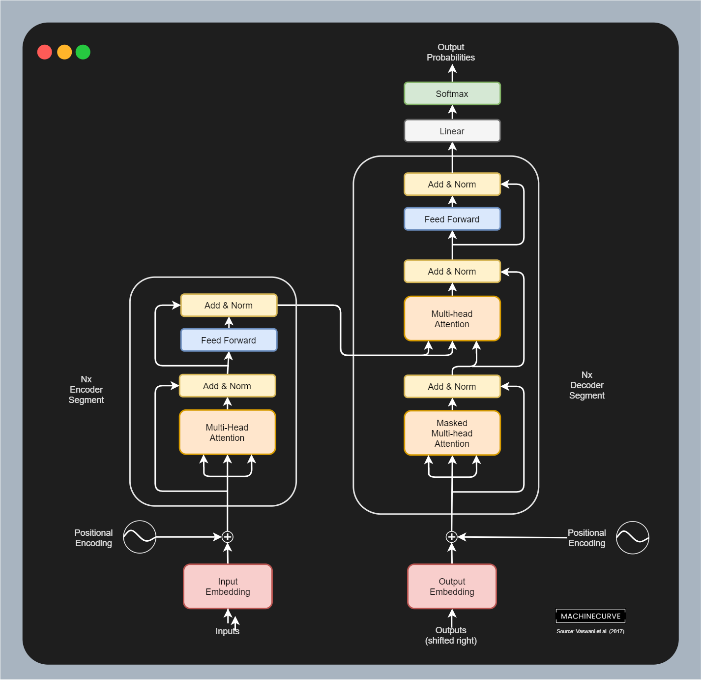

If you are new to Deep Learning, or have worked with neural networks for some time, it's likely that you're familiar with Convolutional layers. These have been the standard building blocks for computer vision models since 2012, when AlexNet had a breakthrough and boosted the era of Deep Learning that we are still building on top of these days.

Maybe, you're also familiar to recent developments in Natural Language Processing - with Transformer based architectures in particular. Using a concept called self-attention, models can be taught to connect related lingual concepts and hence better understand language. Generative architectures like the GPT series and understanding architectures like BERT have been notable developments in this space.

Recently, however, Transformers have been altered to the Vision domain. The concept of an **Isotropic architecture** has emerged from these developments. Isotropic architectures have equal size and shape for all elements troughout the network. Contrary to more pyramid-shaped architectures, recent research discovers that isotropic architectures may improve model performance or even meet state-of-the-art performance with a lot lighter components.

In this article, we'll dive a bit deeper into isotropic architectures. What are they? How do they compare to classic pyramid shaped Convolutional architectures? Let's take a look.

* * *

\[toc\]

* * *

## Standard building blocks for Computer Vision: Convolutional layers

This is what happens within a standard 2D convolutional layer:

A kernel with some `(width, height)` and `C` channels is slided from left to right and while doing so from top to bottom (i.e., convolved) over an input image with some width and height and `C` channels (recall that RGB images have `C=3`). In fact, multiple such kernels are convolved during one forward pass. For each slide, a scalar output value is produced using element-wise multiplications.

The output of a convolutional layer is a feature map: a 3D block with some height and width and `N` 'channels', which represent the result for each of the `N` maps.

By effectively summarizing regions of the image in a feature map, and then summarizing these in another layer, and another, and another, it's possible to learn connections _within_ regions and _between_ regions in an image. In other words: it then no longer matters whether the object is in a certain region... as the object gets detected anyway. Object invariance is one of the strongest virtues of a Convolutional Neural Network.

### Pyramid structure

Given what was mentioned above for every kernel - that kernels slide over the image, effectively outputting a scalar value and hence a summary of a region - it's easy to see that feature maps get smaller for every layer if you stack multiple layers together.

This pyramid structure is also very common for Convolutional Neural Networks: the shape of the data changes downstream, as well as the size of the network. Previously, it was thought that such pyramid structures introduce an information bottleneck to your neural networks. But does it actually improve performance? Isotropic architectures change this way of thinking about neural networks.

* * *

## Transformers and Mixers in Computer Vision: Isotropic architectures

If you have followed the field of Natural Language Processing in recent years, you must know about the fact that [Transformer architectures](https://www.machinecurve.com/index.php/2020/12/28/introduction-to-transformers-in-machine-learning/) have really boosted progress over there. These architectures, which combine an **encoding segment** with a **decoding segment** (or have one of them) with the concept of **self-attention** really changed the way language models have been created.

I would suggest to click the link above to read more about what Transformers do. For now, it's enough to know that they have recently been applied in Computer Vision problems as well. For example, the Vision Transformer (Dosovitskiy et al., 2020) has reached state-of-the-art performance when pretrained and then finetuned using massive image datasets. In doing so, images have been divided into patches, and these patches (turned into an embedding) have been used as input for the Transformer architecture.

The same is true for Mixer architectures like MLP-Mixer (Tolstikhin et al., 2021) and ConvMixer (of which the authors are yet unknown; see the reference at the bottom of this page), which _strip_ the Transformer architecture but rather keep the patches, to point at the question whether it's actually the image patches that ensure that SOTA performance can be reached.

Both Transformer architectures and Mixer architectures are part of the class of **isotropic architectures**. To understand what they are, let's take a look at what the word _isotropic_ means first:

> (of an object or substance) having a physical property which has the same value when measured in different directions.  
> (of a property or phenomenon) not varying in magnitude according to the direction of measurement.

In other (simpler) words, when you take a look at the value going through an _isotropic_ network, it doesn't change in size.

And precisely that is what an isotropic architecture is. Isotropic architectures do not produce pyramid shaped data transformations, but rather _fixed_ ones where data does not change in shape and size, like in the image below.

The structure of a Mixer Layer from MLP-Mixer (Tolstikhin et al., 2021). As you can see, the input data (the various patches) are used in a variety of ways (primarily by Transposing them) but are not _changed_. In other words, the data size and shape is kept intact, and hence the architecture is isotropic rather than pyramidal.

* * *

## References

Tolstikhin, I., Houlsby, N., Kolesnikov, A., Beyer, L., Zhai, X., Unterthiner, T., ... & Dosovitskiy, A. (2021). [Mlp-mixer: An all-mlp architecture for vision.](https://arxiv.org/abs/2105.01601) _arXiv preprint arXiv:2105.01601_.

_Patches are all you need?_ (n.d.). OpenReview. [https://openreview.net/forum?id=TVHS5Y4dNvM](https://openreview.net/forum?id=TVHS5Y4dNvM)

Dosovitskiy, A., Beyer, L., Kolesnikov, A., Weissenborn, D., Zhai, X., Unterthiner, T., ... & Houlsby, N. (2020). [An image is worth 16x16 words: Transformers for image recognition at scale](https://arxiv.org/abs/2010.11929). _arXiv preprint arXiv:2010.11929_.
