When you talk about Machine Learning in Natural Language Processing these days, all you hear is one thing - Transformers. Models based on this Deep Learning architecture have taken the NLP world by storm since 2017. In fact, they are the go-to approach today, and many of the approaches build on top of the original Transformer, one way or another.

Transformers are however not simple. The original Transformer architecture is quite complex and the same is true for many of the spin-off architectures. For this reason, we will take a look at the vanilla Transformer architecture proposed by Vaswani et al. back in 2017. It lies at the basis of exploring many other Transformer architectures on [this page](https://www.machinecurve.com/index.php/getting-started-with-huggingface-transformers/). It won't be maths-heavy, but rather intuitive, so that many people can understand what is going on under the hood of a vanilla Transformer.

The article is structured as follows. First, we'll take a look at why Transformers have emerged in the first place - by taking a look at the problems of their predecessors, primarily [LSTMs](https://www.machinecurve.com/index.php/2020/12/29/a-gentle-introduction-to-long-short-term-memory-networks-lstm/) and GRUs. Then, we're going to take a look at the Transformer architecture holistically, i.e. from a high level. This is followed by a more granular analysis of the architecture, as we will first take a look at the encoder segment and then at the decoder segment. Finally, we're going to cover how a Transformer can be trained.

Ready? Let's go! 😎

* * *

\[toc\]

* * *

## Why Transformers?

Machine Learning in Natural Language Processing has traditionally been performed with recurrent neural networks. Recurrent, here, means that when a sequence is processed, the hidden state (or 'memory') that is used for generating a prediction for a token is also passed on, so that it can be used when generating the subsequent prediction.

> A **recurrent neural network** (**RNN**) is a class of artificial neural networks where connections between nodes form a directed graph along a temporal sequence. This allows it to exhibit temporal dynamic behavior. Derived from feedforward neural networks, RNNs can use their internal state (memory) to process variable length sequences of inputs.
> 
> Wikipedia (2005)

Recurrent networks have been around for some time. One of the first ones was a simple or _vanilla_ recurrent network, or vanilla RNN. It is the top left image in the gallery below. As you can see, upon generating a prediction, the updated hidden state is passed to itself, so that it can be used in any subsequent prediction. When unfolded, we can clearly see how this works with a variety of input tokens and output predictions.

While recurrent networks were able to boost the state-of-the-art in Natural Language Processing at the time, they also experienced a series of drawbacks / bottlenecks:

1. Because of the way in which hidden states were passed, RNNs were highly sensitive to the [vanishing gradients problem](https://www.machinecurve.com/index.php/2019/08/30/random-initialization-vanishing-and-exploding-gradients/). Especially with longer sequences, the chain of gradients used for optimization can be so long that actual gradients in the first layers are really small. In other words, as with any network struck by vanishing gradients, the most upstream layers learn almost nothing.
2. The same is true for memory: the hidden state is passed to the next prediction step, meaning that most of the contextual information available is related to what the model has seen in the short term. With classic RNNs, models therefore face a long-term memory issue, in that they are good at short-term memory but very bad at longer-term memory.
3. Processing happens sequentially. That is, each word in a phrase has to be passed through the recurrent network, after which a prediction is returned. As recurrent networks _can_ be intensive in terms of the computational requirements, it can take a while before an output prediction is generated. This is an inherent problem with recurrent networks.

Fortunately, in the 2010s, **[Long Short-Term Memory](https://www.machinecurve.com/index.php/2020/12/29/a-gentle-introduction-to-long-short-term-memory-networks-lstm/)** networks (LSTMs, top right) and **Gated Recurrent Units** (GRUs, bottom) were researched and applied to resolve many of the three issues above. LSTMs in particular, through the cell like structure where memory is retained, are robust to the vanishing gradients problem. What's more, because memory is now maintained separately from the previous cell output (the \[latex\]c\_{t}\[/latex\] flow in the LSTM image below, for example), both are capable of storing longer-term memory.

Especially when the **attention mechanism** was invented on top of it, where instead of the hidden state a weighted context vector is provided that weighs the outputs of all previous prediction steps, long-term memory issues were diminishing rapidly. The only standing problem remained that processing had to be performed sequentially, imposing a significant resource bottleneck on training a model for Natural Language Processing.

- 
    
- 
    
- 
    

(Left top) A fully recurrent network. Created by [fdeloche](https://commons.wikimedia.org/wiki/User:Ixnay) at [Wikipedia](https://en.wikipedia.org/wiki/Recurrent_neural_network#/media/File:Recurrent_neural_network_unfold.svg), licensed as [CC BY-SA 4.0](https://creativecommons.org/licenses/by-sa/4.0). No changes were made.  
(Right top) An LSTM cell. Created by [Guillaume Chevalier](https://commons.wikimedia.org/w/index.php?title=User:GChe&action=edit&redlink=1) (svg by Ketograff) at [Wikipedia](https://en.wikipedia.org/wiki/Long_short-term_memory#/media/File:LSTM_cell.svg), licensed as [CC BY 4.0](https://creativecommons.org/licenses/by/4.0).  
(Bottom) A GRU cell. Created by [Jeblad](https://commons.wikimedia.org/wiki/User:Jeblad) at [Wikipedia](https://en.wikipedia.org/wiki/Gated_recurrent_unit#/media/File:Gated_Recurrent_Unit,_base_type.svg), licensed as [CC BY-SA 4.0](https://creativecommons.org/licenses/by-sa/4.0) (no changes made).

* * *

## What are Transformers?

In a landmark work from 2017, Vaswani et al. claimed that [Attention is all you need](https://arxiv.org/abs/1706.03762) - in other words, that recurrent building blocks are not necessary in a Deep Learning model for it to perform really well on NLP tasks. They proposed a new architecture, the **Transformer**, which is capable of maintaining the attention mechanism while processing sequences in parallel: all words together rather than on a word-by-word basis.

This architecture has obliterated the final issue from the three mentioned above, namely that sequences have to be processed sequentially, incurring a lot of computational cost. With Transformers, parallelism has become real.

As we shall see in different articles, Transformer based architectures come in different flavors. Based off the traditional Transformer architecture, researchers and engineers have experimented significantly and brought about changes. However, the original Transformer architecture looks as follows:

Source: Vaswani et al. (2017)

As we can see, it has two intertwined segments:

- An **encoder segment**, which takes inputs from the source language, generates an embedding for them, encodes positions, computes where each word has to attend to in a multi-context setting, and subsequently outputs some intermediary representation.
- A **decoder segment**, which takes inputs from the target language, generates an embedding for them with encoded positions, computes where each word has to attend to, and subsequently combines encoder output with what it has produced so far. The outcome is a prediction for the next token, by means of a [Softmax](https://www.machinecurve.com/index.php/2020/01/08/how-does-the-softmax-activation-function-work/) and hence argmax class prediction (where each token, or word, is a class).

The original Transformer is therefore a classic sequence-to-sequence model.

Do note that Transformers can be used for a variety of language tasks, ranging from natural language understanding (NLU) to natural language generation (NLG). For this reason, it can be the case that source and target languages are identical, but this is not _necessarily_ the case.

If you're saying that you are a bit overwhelmed right now, I can understand. I had the same when I first read about Transformers. That's why we will now take a look at both the encoder and decoder segments individually, taking a close look at each and individual step. We're going to cover them as intuitively as we can, using the translators analogy.

### The translators analogy

Suppose that our goal is to build a language model capable of translating German text into English. In the classic scenario, with more classic approaches, we would learn a model which is capable of making the translation directly. In other words, we are teaching _one_ translator to translate German into English. In other words, the translator needs to be able to speak both languages fluently, understand the relationships between words in the two languages, and so on. While this will work, it's not scalable.

Transformers work differently because they use an encoder-decoder architecture. Think about it as if you're working with two translator. The first translator is capable of translating German into some intermediary, universal language. Another translator is capable of translating that language into English. However, at every translation task, you'll let translations pass through the intermediary language first. This will work as well as the classic approaches (in terms of whether the model yields any usable result). However, it is also scalable: we can use the intermediary language to train a model for summarizing text, for example. We don't need to train for the first translation task anymore.

In different articles, we shall see that this pretraining and fine-tuning dogma is very prevalent today, especially with the BERT like architectures, which take the encoder segment from the original Transformer, pretrain it on a massive dataset and allow people to perform fine-tuning to various tasks themselves. However, for now, we'll stick to the original Transformer. In it, the \[latex\]\\text{German} \\rightarrow \\text{Intermediary language}\[/latex\] translation task would be performed by the encoder segment, in this analogy yielding the intermediary state as the _intermediary language_. The \[latex\]\\text{Intermediary language} \\rightarrow \\text{English}\[/latex\] translation task is then performed by the decoder segment.

Let's now take a look at both segments in more detail.

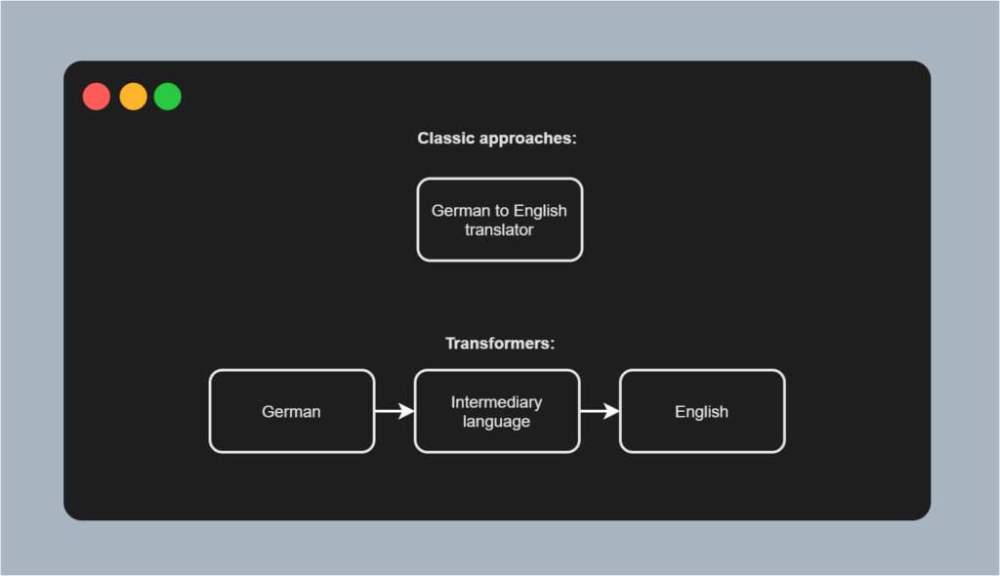

* * *

## The encoder segment

The encoder segment of a Transformer is responsible for converting inputs into some intermediary, high-dimensional representation. Visually, it looks as follows. The encoder segment is composed of a couple of individual components:

- **Input Embeddings**, which convert tokenized inputs into vector format so that they can be used. The original work by Vaswani et al. (2017) utilizes [learned embeddings](https://www.machinecurve.com/index.php/2020/03/03/classifying-imdb-sentiment-with-keras-and-embeddings-dropout-conv1d/), meaning that the token-to-vector conversion process is learned along with the main Machine Learning task (i.e. learning the sequence-to-sequence model).
- **Positional Encodings**, which slightly change the vector outputs of the embedding layer, adding positional information to these vectors.
- **The actual encoder segment**, which learns to output an attended representation of the input vectors, and is composed of the following sub segments:
    - The **multi-head attention segment**, which performs multi-head self-attention, adds the residual connection and then performs layer normalization.
    - The **feed forward segment**, which generates the encoder output for each token.
    - The encoder segment can be repeated \[latex\]N\[/latex\] times; Vaswani et al. (2017) chose \[latex\]N = 6\[/latex\].

Let's now take a look at each of the encoder's individual components in more detail.

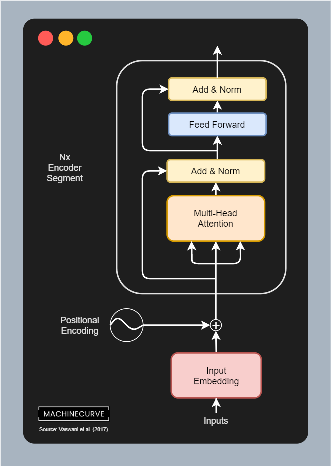

### From textual inputs to Input Embedding

You'll train a Transformer with a textual dataset. As you would imagine, such a dataset consists of phrases (and often of pairs of phrases that correspond to each other). For example, for English, the phrase `I go to the store` would equal `Je vais au magasin` in French.

#### Tokenization

However, we cannot feed text to Machine Learning models - TensorFlow, for example, is a _numbers processing_ library, and optimization techniques also work with numbers.

We hence have to find a way to express text in numbers. We can do this by means of **tokenization**, which allows us to express text as a list of integers. The `tf.keras` [Tokenizer](https://github.com/keras-team/keras-preprocessing/blob/master/keras_preprocessing/text.py), for example, allows us to perform two things (Nuric, 2018):

- _Generating a vocabulary based on text._ We start with an empty Python dictionary, `{}`, and slowly but surely fill it with each distinct word, so that e.g. `dictionary["I"] = 1`, `dictionary["go"] = 2`, and so on.
- _Converting words into integers using the vocabulary._ Based on the vocabulary, which is obviously filled with a whole lot of words, we can convert phrases into integer based sequences. For example, `I go to the store`, through `["I", "go", "to", "the", "store"]`, may become `[1, 2, 39, 49, 128]`. Obviously, the integers here are decided by how the vocabulary is generated.

#### One-hot encoding words is not practical

Suppose that we have generated a word index with a Tokenizer on 45.000 distinct words. We then have a Python dictionary with 45.000 keys, so `len(keys) = 45000`. The next step would be to tokenize each phrase from the dataset, so that for example `["I", "go", "to", "the", "store"]` becomes `[1, 2, 39, 49, 128]`, and `["I", "will", "go", "now"]` becomes `[1, 589, 2, 37588]`. The numbers here are arbitrary of course and determined by the Tokenizer.

Because these variables are categorical, we must express them in a different way - e.g. by means of [one-hot encoding](https://www.machinecurve.com/index.php/2020/11/24/one-hot-encoding-for-machine-learning-with-tensorflow-and-keras/) (KDNuggets, n.d). However, with very large word vocabularies, this is highly inefficient. For example, in our dictionary above, each token would be a 45.000-dimensional vector! Hence, for small vocabularies, one-hot encoding can be a good way for expressing text. For larger vocabularies, we need a different approach.

#### Word embeddings

However, we have a solution.

We can use **word embeddings** in that case:

> Word embedding is any of a set of language modeling and feature learning techniques in natural language processing (NLP) where words or phrases from the vocabulary are mapped to vectors of real numbers. Conceptually it involves a mathematical embedding from a space with many dimensions per word to a continuous vector space with a much lower dimension.
> 
> Wikipedia (2014)

In other words, if we can learn to map our tokens to vectors, we can possibly find a unique vector for each word in a much-lower dimensional space. We can see this in the visualization above. For 10.000 words, it becomes possible to visualize them in a three-dimensional space (with only small information loss by virtue of the application of [PCA](https://www.machinecurve.com/index.php/2020/12/07/introducing-pca-with-python-and-scikit-learn-for-machine-learning/)), whereas we would have used 10.000-dimensional vectors if we applied one-hot encoding.

A plot from the Word2Vec 10K dataset, with three [principal components](https://www.machinecurve.com/index.php/2020/12/07/introducing-pca-with-python-and-scikit-learn-for-machine-learning/) plotted in a three-dimensional space, using the [Embedding projector](http://projector.tensorflow.org/). The word 'routine' is highlighted.

#### Vanilla Transformers use learned input embeddings

Vanilla Transformers use a [learned input embedding layer](https://www.machinecurve.com/index.php/2020/03/03/classifying-imdb-sentiment-with-keras-and-embeddings-dropout-conv1d/) (Vaswani et al., 2017). This means that the embedding is learned on the fly [rather than using a pretrained embedding](https://wikipedia2vec.github.io/wikipedia2vec/pretrained/), such as a pretrained Word2Vec embedding, which can also be an option. Learning the embedding on the fly ensures that each word can be mapped to a vector properly, improving effectiveness (not missing out any word).

The learned embedding produces vectors of dimension \[latex\]d\_{\\text{model}}\[/latex\], where Vaswani et al. (2017) set \[latex\]d\_{\\text{model}} = 512\[/latex\]. \[latex\]d\_{\\text{model}}\[/latex\] is also the output of all the sub layers in the model.

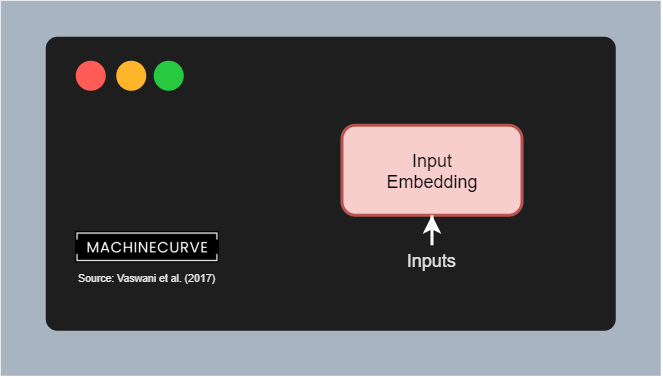

According to Vaswani et al. (2017), the weight matrix between the input embedding and output embedding layers is shared, as well as the pre-softmax linear transformation. Weights are also multiplied by \[latex\]\\sqrt{d\_{\\text{model}}}\[/latex\] for stability. Sharing weights is a design decision, which is not strictly necessary and _can_ be counter to performance, as illustrated by this answer:

> **The source and target embeddings can be shared or not**. This is a design decision. They are normally shared if the token vocabulary is shared, and this normally happens when you have languages with the same script (i.e. the Latin alphabet). If your source and target languages are e.g. English and Chinese, which have different writing systems, your token vocabularies would probably not be shared, and then the embeddings wouldn't be shared either.
> 
> Ncasas (2020)

### Positional Encoding

Classic approaches to building models for language understanding or generation have benefited from the sequential order of processing. Because words had to be processed sequentially, models became aware of common orderings (such as `I am`) because the hidden state including `I` was always passed prior to processing `am`.

With Transformers, this is no longer the case, as we know that such models have no recurrent aspects, but use attention only. When an entire phrase is fed to a Transformer model, it is not necessarily processed in order, and hence the model is not aware of any positional order within a phrase within the sequence.

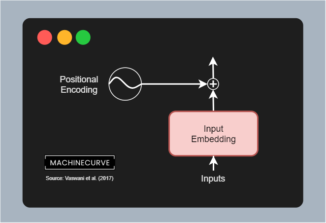

Using **positional encodings**, we add a vector indicating the relative position of a word to the word vectors generated by the embedding layer. This is a simple vector multiplication: \[latex\]\\textbf{v}\_{encoded} = \\textbf{v}\_{embedding} + \\textbf{v}\_{encoding}\[/latex\]. You can imagine this as a restructuring operation where common vectors are positioned more closely together.

Vaswani et al. (2017) use a maths based (more specifically a sine and cosine based) approach to positional encoding. By letting the position and dimension flow through a sine or cosine function depending on its oddity or evenness, we can generate positional encodings that we can use to position-encode the embeddings output. The outcome of this step is a vector which has much of the information of the embedding retained, but then with some information about relative positions (i.e. how words are related) added.

### N times the encoder segment

Generating the input embedding and applying positional encoding were the preparatory steps, allowing us to use textual data in our Transformer model. It's now time to look at the _actual_ encoder segment.

We must note first that whatever we'll discuss here can be repeated \[latex\]N\[/latex\] times; stacked, if you will. When stacking encoders, the output of each encoder is used as input for the next encoder, generating an ever-more abstract encoding. While stacking encoders can definitely improve model performance through generalization, it is also computationally intensive. Vaswani et al. (2017) chose to set \[latex\]N = 6\[/latex\] and hence use 6 encoders stacked on top of each other.

Each encoder segment is built from the following components:

- A **multi-head attention block**. This block allows us to perform self-attention over each sequence (i.e., for each phrase that we feed the model, determine on a per-token (per-word) basis which other tokens (words) from the phrase are relevant to that token; thus where to attend to when reading that token/word).
- A **feed-forward block**. After generating attention for each token (word), we must generate a \[latex\]d\_{\\text{model}} \\text{-dimensional}\[/latex\] and thus 512-dimensional vector that encodes the token. The feed forward block is responsible for performing this.
- **Residual** **connections**. A residual connection is a connection that does not flow through a complex block. We can see two residual connections here: one flowing from the input to the first Add & Norm block; another one from there to the second block. Residual connections allow the models to optimize more efficiently, because technically speaking gradients can flow freely from the end of the model to the start.
- **Add & Norm blocks**. In these blocks, the output from either the Multi-head attention block or the Feed-forward block is merged with the residual (by means of addition), the result of which is subsequently layer normalized.

While the inputs to an encoder segment are therefore either embedded and position-normalized tokens or the output from a previous encoder segment, an encoder therefore learns to generate a context-aware intermediate representation for the input tokens (the encoding). Through this context-awareness, achieved by the self-attention performed, Transformers can do their trick.

#### Multi-Head attention

Let's now zoom into the individual components of the encoder segment in more detail. The first block that the input will flow through is the **multi-head attention block**. It is composed of multiple so-called **scaled dot-product attention** **blocks**, which we'll now take a closer look at.

Visually, such a scaled block looks as follows (Vaswani et al., 2017):

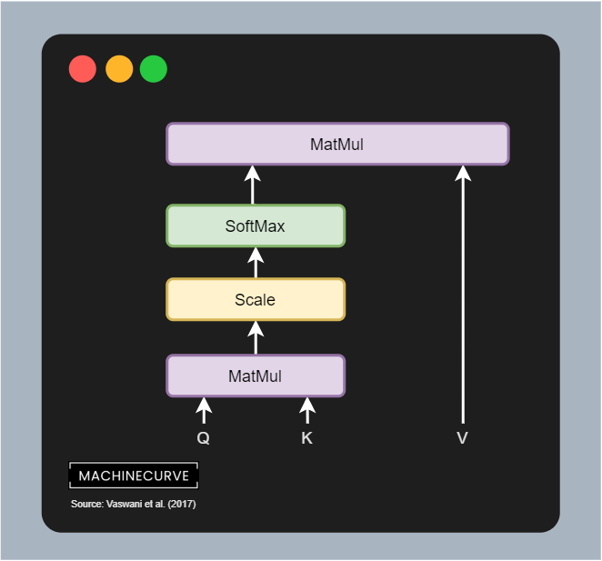

Scaled Dot-Product Attention

You can see that it has _three inputs_ - **queries** (Q), **keys** (K) and **values** (V). This means that the position-encoded input vectors are first split into three separate streams and hence matrices; we shall see that this happens by means of 3 different Linear layers.

In Vaswani et al. (2017), these Q, K and V values are described as follows:

> An attention function can be described as mapping a query and a set of key-value pairs to an output, where the query, keys, values, and output are all vectors. The output is computed as a weighted sum of the values, where the weight assigned to each value is computed by a compatibility function of the query with the corresponding key.
> 
> Vaswani et al. (2017)

However, a more intuitive description is provided by Dontloo (2019):

> The key/value/query concepts come from retrieval systems. For example, when you type a query to search for some video on Youtube, the search engine will map your **query** against a set of **keys** (video title, description etc.) associated with candidate videos in the database, then present you the best matched videos (**values**).
> 
> Dontloo (2019)

I hope this allows you to understand better what the role of queries, keys and values in Transformers is.

Important note: above, I write _vector_s and _matrices_, because all tokens are processed in parallel! This means that all the position-encoded input vectors are passed through the 3 Linear layers and hence form a matrix. It is important to understand here that they are processed jointly, to understand how self-attention through the score matrix works next.

However, if we actually want to present the best matched videos, we need to identify the attention points - which videos are most relevant given some inputs? That's why in the image above, you see a `MatMul` operation between the queries and keys. It is a matrix multiplication where the query output is multiplied by the keys matrix to generate a **scores matrix.**

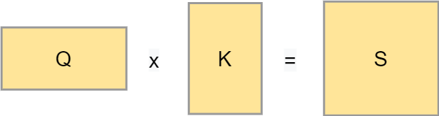

A score matrix can look as follows:

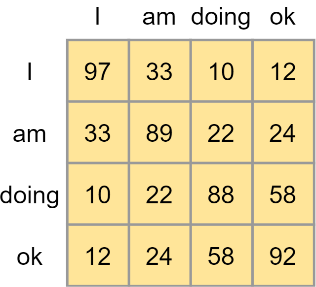

It illustrates the importance of certain words in a phrase given one word in a phrase in an absolute sense. However, they are not yet comparable. Traditionally, a [Softmax function](https://www.machinecurve.com/index.php/2020/01/08/how-does-the-softmax-activation-function-work/) can be used to generate (pseudo-)probabilities and hence make the values comparable.

However, if you take a look at the flow image above, you can see that prior to applying Softmax we first apply a scaling function. We apply this scaling because of the possible sensitivity of Softmax to vanishing gradients, which is what we don't want. We scale by dividing all values by \[latex\]\\sqrt{d\_k}\[/latex\], where \[latex\]d\_k\[/latex\] is the dimensionality of the queries and keys.

We then compute the Softmax outputs, which immediately shows for a word which other words from the phrase are important in the context of that word.

- [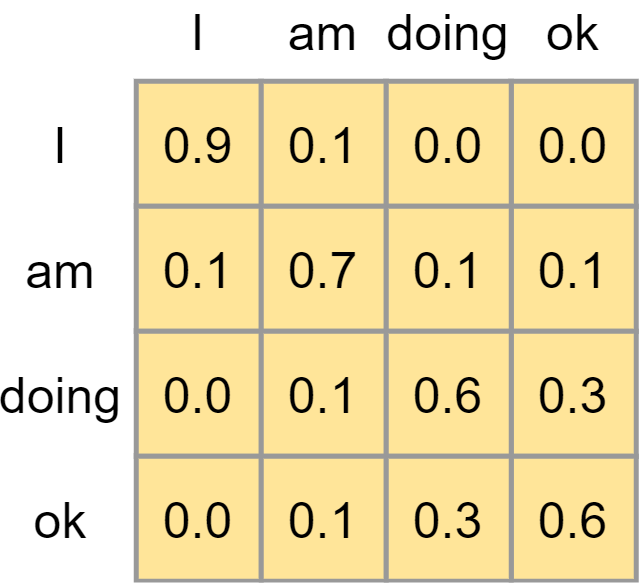](https://www.machinecurve.com/wp-content/uploads/2020/12/Diagram-11.png)
    
- [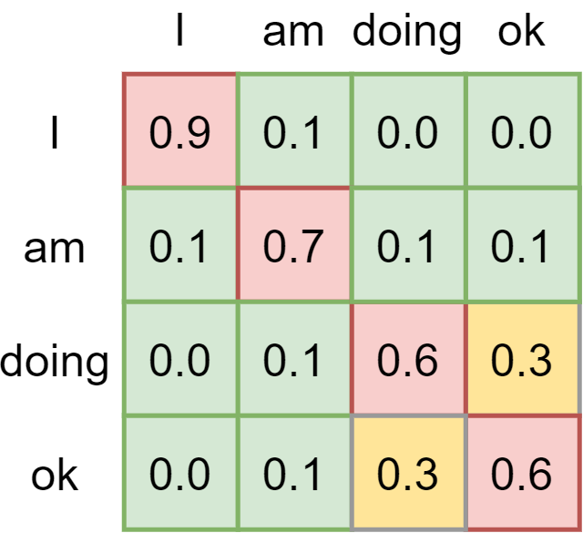](https://www.machinecurve.com/wp-content/uploads/2020/12/Diagram-12.png)
    

The remaining step is matrix multiplying the scores matrix containing the attention weights with the _values_, effectively keeping the values for which the model has learned that they are most important.

And this is how **self-attention** works, but then scaled - which is why Vaswani et al. (2017) call it **scaled dot-product self-attention**.

##### Multiple heads

However, the encoder block is called multi-head attention. What is this thing called multiple heads? Here you go, visually:

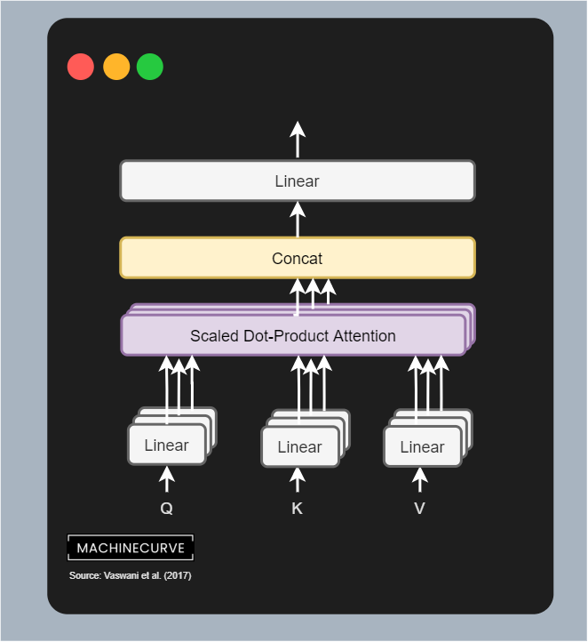

Multi-Head Attention

By **copying the linear layers** that generate the queries, keys and values matrices, letting them have different weights, we can learn multiple representations of these queries, keys and values.

In human language, you can visualize this as if you are looking at the same problem from different angles, rather than just one angle (i.e. the self-attention we just covered). By learning multiple representations, the Transformer becomes more and more context-aware. As you can see, the outputs of the linear layers are sent to separate scaled dot-product attention blocks, which output the importance of the values; these are concatenated and passed through a Linear layer again.

Each individual combination of building blocks is called an **attention head**. Since multiple attention heads are present in one encoder segment, this block is called a **multi-head attention block**. It performs scaled dot-product attention for every block, then concatenates all the outputs and lets it flow through a Linear layer, which once again produces a 512-dimensional output value.

Note that the dimensionality of every attention head is \[latex\]d\_\\text{model}/h\[/latex\] where \[latex\]h\[/latex\] is the number of attention heads. Vaswani et al. (2017) used a model dimensionality of 512, and used 8 parallel heads, so head dimensionality in their case was \[latex\]512/8 = 64\[/latex\].

#### Adding residual and Layer Normalization

The output of the multi-head attention block is first added with the residual connection, which recall is the position-encoded input embedding for all the vectors. This is a simple addition operation. After adding, a [layer normalization](https://arxiv.org/abs/1607.06450) operation is performed on the outcome, before it is passed to the Feed-forward segment. Applying layer normalization stabilizes the training process, and adding the residual connection does the same.

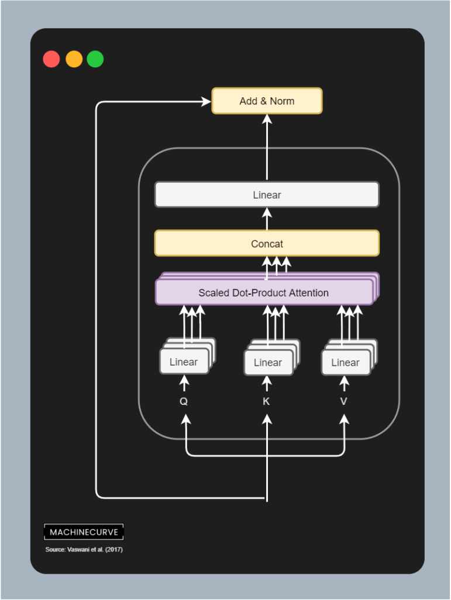

#### Feed Forward layer

After the layer normalization has been completed, the inputs are passed to a set of Feed Forward layers. Each position (i.e. token) is passed through this network individually, according to Vaswani et al. (2017): it "is applied to each position separately and identically". Each Feed Forward network contains two Linear layers with one [ReLU activation function](https://www.machinecurve.com/index.php/2019/09/09/implementing-relu-sigmoid-and-tanh-in-keras/) in between.

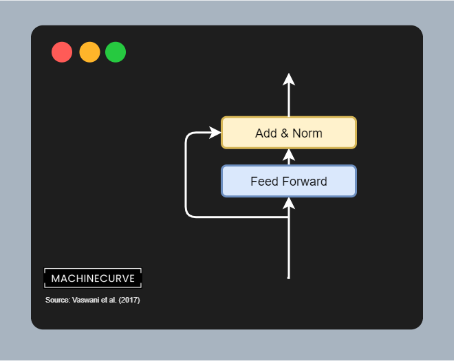

#### Adding residual and Layer Normalization

In the case of the Feed Forward network, too, a residual is first branched off the input, for the sake of flowing gradients. It is added to the outputs of the Feed Forward network which are subsequently Layer Normalized.

It is the final operation before the _encoded input_ leaves the encoder segment. It can now be used further (like in BERT, which we will cover in another article) or serve as the (partial) input for the decoder segment of the original Transformer, which we will cover now.

* * *

## The decoder segment

Okay, so far we understand how the encoder segment works - i.e. how inputs are converted into an intermediate representation. Let's now take a look at the **decoder segment**. This segment of a Transformer is responsible for converting the intermediary, high-dimensional representation into predictions for output tokens. Visually, it looks as follows. The decoder segment is composed of a couple of individual components:

- **Output Embeddings**, which convert tokenized outputs into vector format - just like the embeddings used for the inputs. The only difference here is that outputs are shifted right by one position. This, together with the masked multi-head attention segment, ensures that predictions for any position can only depend on the known outputs at positions less than that input (Vaswasni et al., 2017). In other words, it is ensured that predictions depend on the past only, not on the future.
- **Positional Encodings**, which like the input positional encodings slightly change the vector outputs of the embedding layer, adding positional information to these vectors.
- The **actual decoder segment**, which is composed of the following sub segments:
    - The **masked multi-head attention segment**, which performs multi-head self-attention on the outputs, but does so in a masked way, so that positions depend on the past only.
    - The **multi-head attention segment**, which performs multi-head self-attention on a combination of the (_encoded_) inputs and the outputs, so that the model learns to correlate encoded inputs with desired outputs.
    - The **feed forward segment**, which processes each token individually.
- Finally, there is a **linear** layer which generates [logits](https://www.machinecurve.com/index.php/2020/01/08/how-does-the-softmax-activation-function-work/#logits-layer-and-logits) and a **Softmax** layer which generates [pseudoprobabilities](https://www.machinecurve.com/index.php/2020/01/08/how-does-the-softmax-activation-function-work/#logits-layer-and-logits). By taking the argmax value of this prediction, we know which token should be taken and added to the tokens already predicted.

Let's now take a look at each of the decoder's individual components in more detail.

### Output Embedding

Like the _encoder_, the inputs to the decoder segment are also **embedded** first. Of course, this happens with the _outputs_, which are the target phrases from the sentence pairs with which vanilla Transformers are trained. Here, too, learned embeddings are used, and Vaswani et al. (2017) share the weight matrix of both embedding layers, and the pre-Softmax linear layer visualized above.

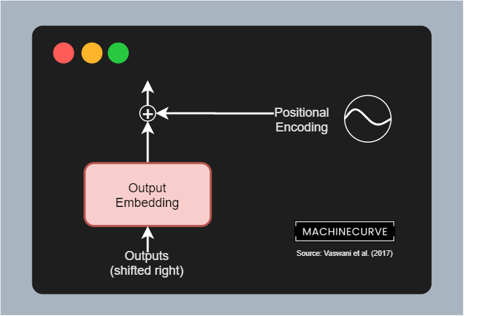

### Positional Encoding

Exactly the same sine- and cosine-based [positional encoding](#positional-encoding) is performed in the decoder segment like the encoder segment.

### N times the decoder segment

The first two elements of the decoder segment were equal in functionality to the first two elements of the encoder segment. Now is where we'll take a look at (a few) differences, because we're going to look at the **decoder segment** - which is also replicated \[latex\]N\[/latex\] times (with \[latex\]N = 6\[/latex\] in Vaswani et al.'s work).

The decoder segment is composed of three sub segments:

- A **masked multi-head attention** **segment**, where self-attention is applied to (masked) outputs, so that the model learns to which _previous_ tokens it must attend given some token.
- A **multi-head attention segment**, where self-attention is applied to the encoded inputs (serving as queries and keys) and the combination of masked multi-head attention outputs / input residual, being the gateway where encoded inputs and target outputs are merged.
- A **feedforward segment**, which is applied position-wise to each token passed along.

Finally, there is a small additional appendix - a **linear layer** and a **Softmax activation function**. These will take the output of the decoder segment and transform it into a logits output (i.e. a value based output for each of the tokens in the vocabulary) and a [pseudoprobability output](https://www.machinecurve.com/index.php/2020/01/08/how-does-the-softmax-activation-function-work/) which assigns probabilities to each of the possible token outputs given the logit values. By simply taking the \[latex\]\\text{argmax}\[/latex\] value from these outputs, we can identify the word that is the most likely prediction here.

We'll take a look at all these aspects in more detail now.

#### Masked Multi-Head Attention

The first sub segment to which the position-encoded embedded input is fed is called the **masked multi-head attention segment**. It is quite an irregular but regular attention segment:

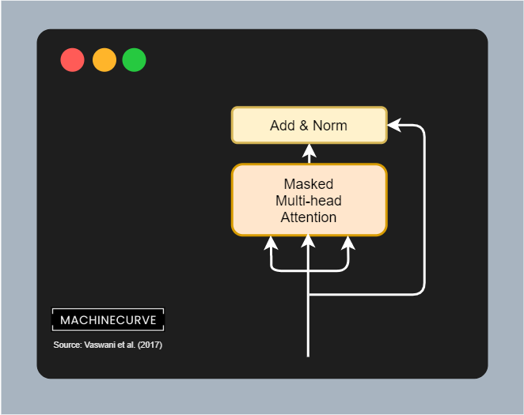

It is regular in the sense that here too, we have queries, keys and values. The queries and keys are matrix multiplied yielding a score matrix, which is then combined with the values matrix in order to apply self-attention to the target values i.e. determine which of the output values are most important.

In other words, the flow is really similar to the flow of the multi-head attention segment in the encoder:

Except for one key difference, which is that this segment is part of the _decoder_, which is responsible for predicting which target must be output next.

And if I'm constructing a phrase, as a human being, for producing the next word I cannot rely on all future words for doing so. Rather, I can only rely on the words that I have produced before. This is why the _classic_ multi-head attention block does not work in the decoder segment, because the same thing applies here as well: the when predicting a token, the decoder should not be able to be aware of future outputs (and especially their attention values) for the simple reason that it would otherwise be able to glimpse into the future when predicting for the present.

The flow above will therefore not work and must be adapted. Vaswani et al. (2017) do so by adding a mask into the flow of the multi-head attention layer, making it a **masked** multi-head attention layer.

But what is this _mask_ about?

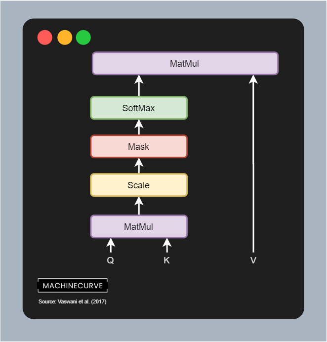

Recall that the matrix multiplication (_MatMul_) between queries and keys yields a score matrix, which is scaled and then put through a SoftMax layer. When this happens, we get (conditional) pseudoprobabilities for each token/word that tell us something about the word importance _given another word_ (or token). But as you can see, this is problematic if we don't want to look into the future: if we are predicting the next token after `<I>`, which should be `<am>`, we don't want to know that `<doing>` comes after it; humans simply don't know this when they are producing words on the fly.

- 
    
- 
    

That's why a **mask** is applied to the scaled score matrix prior to generating pseudoprobabilities with Softmax. That is, if this is our score matrix...

...we apply what is known as a **look-ahead mask**. It is a simple matrix addition: we add another matrix to the scores matrix, where values are either zero or minus infinity. As you can see, all values that can be visible for a token (i.e. all previous values) are set to zero, so they remain the same. The others (Vaswani et al. (2017) call them _illegal connections_) are combined with minus infinity and hence yield minus infinity as the value.

If we then apply Softmax, we can see that the importance for all values that _lie in the future_ is set to zero. They're no longer important. When masked, the model learns to attend to values from the past only when predicting for the present. This is a very important characteristic that allows Transformers to generalize to unseen data better.

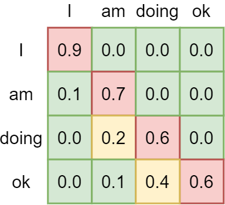

#### Adding residual and Layer Normalization

As is common in the Transformer architecture, the masked multi-head attention segment also makes use of **residuals** and **layer normalization**. In other words, a residual connecting the input embedding to the addition layer is added, combining the output of the masked multi-head attention segment with the original position-encoded output embedding. This allows gradients to flow more freely, benefiting the training process. Layer normalization stabilizes the training process further, yielding better results.

#### Regular Multi-Head Attention with Encoder Output

The second sub-segment in the decoder segment is the **multi-head attention segment**. This is a regular multi-head attention segment which computes a non-masked score matrix between queries and keys and then applies it to the values, yielding an attention-based outcome.

Contrary to the encoder segment, which computes self-attention over the inputs, this segment performs it slightly differently. The queries and keys and hence the score matrix is based on the output of the _encoder segment_. In other words, the scores for putting attention to certain words in a phrase are determined by the _inputs_ that have been encoded before.

And this makes a lot of sense, because as we shall see vanilla Transformers are trained on datasets with pairs in different languages (Vaswani et al, 2017). For example, if the goal is to translate `I am doing okay` into German, attention between languages is somewhat similar, and hence attention generated from the encoded input can be used for generating a decoder prediction, actually spawning sequence-to-sequence abilities for a Transformer model.

That this actually happens can also be seen in the figure below, because the queries and keys that together form the scorse matrix, are matrix multiplied with the values matrix, which are generated by the masked multi-attention segment and the residual combined previously. In other words, this segment combines encoder output with target output, and hence generates the ability to make the 'spillover' from source language into target language (or more general, source text into target text).

- [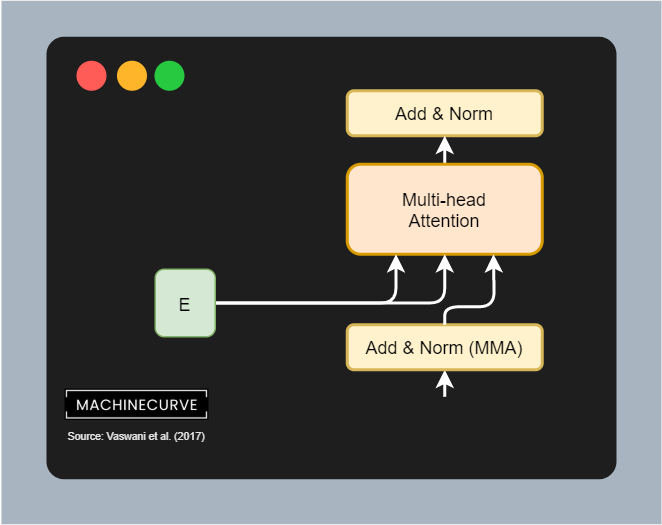](https://www.machinecurve.com/wp-content/uploads/2020/12/Diagram-22.png)
    
- 
    

#### Adding residual and Layer Normalization

Here, too, we add the residual and perform Layer Normalization before we move forward.

#### Feed Forward layer

Like the encoder, a Feed Forward network composed of two linear layers and a [ReLu activation function](https://www.machinecurve.com/index.php/2019/09/04/relu-sigmoid-and-tanh-todays-most-used-activation-functions/) is applied position-wise.

#### Adding residual and Layer Normalization

The results of this network are added with another residual and subsequently a final Layer Normalization operation is performed.

#### Generating a token prediction

After the residual was added and the layer was normalized (visible in the figure as **Add & Norm**), we can start working towards the actual prediction of a token (i.e., a word). This is achieved by means of a linear layer and a Softmax activation function. In this linaer layer, which shares the weight matrix with the embedding layers, logits are generated - i.e. the importance of each token given the encoded inputs and the decoded outputs. With a [Softmax function](https://www.machinecurve.com/index.php/2020/01/08/how-does-the-softmax-activation-function-work/), we can generate output (pseudo)probabilities for all the tokens in our vocabulary.

Selecting the token prediction is then really simple. By taking the maximum argument (\[latex\]\\text{argmax}\[/latex\]) value, we can select the token that should be predicted next given the inputs and outputs sent into the model.

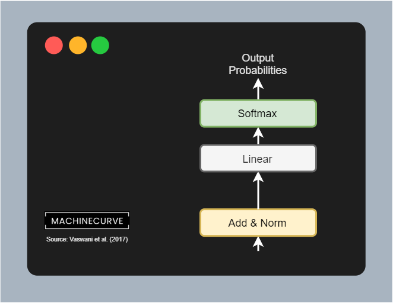

Et voila, that's the architecture of a vanilla Transformer!

* * *

## Training a Transformer

Vanilla Transformers are so-called **sequence-to-sequence** **models**, [converting input sequences into target sequences](https://www.machinecurve.com/index.php/2020/12/21/from-vanilla-rnns-to-transformers-a-history-of-seq2seq-learning/). This means that they should be trained on bilingual datasets if the task is machine translation.

For example, Vaswani et al. (2017) have trained the vanilla Transformer on the WMT 2014 English-to-German translation dataset, i.e. training for a translation task.

The training set of this dataset has 4.5 million pairs of phrases (Stanford, n.d.):

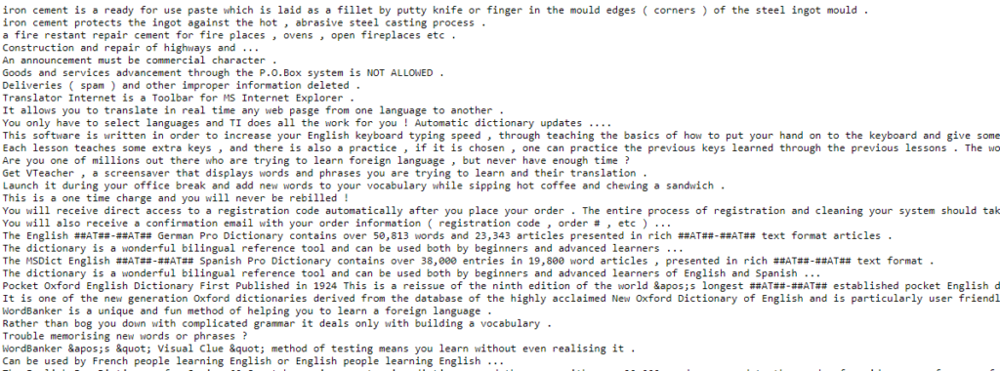

All phrases have corresponding ones in German or at least German-like text:

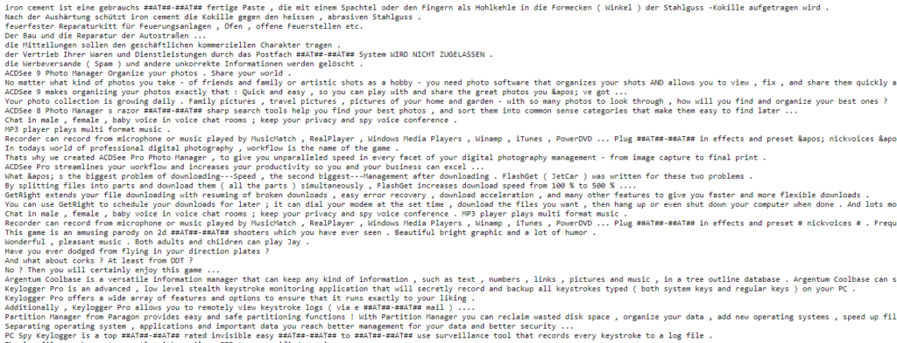

* * *

## Summary

Transformers are taking the world of Natural Language Processing by storm. But their architectures are relatively complex and it takes quite some time to understand them sufficiently. That's why in this article we have looked at the architecture of vanilla Transformers, as proposed by Vaswani et al. in a 2017 paper.

This architecture, which lies at the basis of all Transformer related activities today, has solved one of the final problems in sequence-to-sequence models: that of sequential processing. No recurrent segments are necessary anymore, meaning that networks can benefit from parallelism, significantly boosting the training process. In fact, today's Transformers are trained with millions of sequences, if not more.

To provide the necessary context, we first looked at what Transformers are and why they are necessary. We then moved forward looking at the encoder and decoder segments.

We saw that in the encoder segment, inputs are first passed through a (learned) input embedding, which converts integer based tokens into vectors having lower dimensionality. These are then position encoded by means of sine and cosine functions, to add information about the relative position of tokens into the embedding - information naturally available in traditional models due to the sequential nature of processing, but now lost given the parallelism. After these preparation steps, the inputs are fed to the encoder segment, which learns to apply self attention. In other words, the model learns itself what parts of a phrase are important when a particular word is looked at. This is achieved by multi-head attention and a feedforward network.

The decoder segment works in a similar way, albeit a bit differently. First of all, the outputs are embedded and position encoded, after which they are also passed through a multi-head attention block. This block however applies a look-ahead mask when generating the scores matrix, to ensure that the model cannot look at words down the line when predicting a word in the present. In other words, it can only use past words in doing so. Subsequently, another multi-head attention block is added, combining the encoded inputs as queries and keys with the attended output values as values. This combination is passed to a feedforward segment, which finally allows us to generate a token prediction by means of an additional Linear layer and a Softmax activation function.

Vanilla Transformers are trained on bilingual datasets if they are used for translation tasks. An example of such datasets is the WMT 2014 English-to-German dataset, which contains English and German phrases; it was used by Vaswani et al. (2014) for training their Transformer.

[Ask a question](https://www.machinecurve.com/index.php/add-machine-learning-question/)

Transformers have become prominent architectures since 2017 and are continuously being researched today. I hope that this article has helped you gain a better understanding of why they improve traditional approaches and, more importantly, how they work. If you have any questions, please feel free to ask them in the comments section below 💬 You can also click the **Ask Questions** button on the right. Please feel free to drop a message as well if you have comments or wish to put forward suggestions for improvement. I'm looking forward to hearing from you! 😎

Thank you for reading MachineCurve today and happy engineering!

* * *

## References

Wikipedia. (2005, April 7). _Recurrent neural network_. Wikipedia, the free encyclopedia. Retrieved December 23, 2020, from [https://en.wikipedia.org/wiki/Recurrent\_neural\_network](https://en.wikipedia.org/wiki/Recurrent_neural_network)

Vaswani, A., Shazeer, N., Parmar, N., Uszkoreit, J., Jones, L., Gomez, A. N., … & Polosukhin, I. (2017). [Attention is all you need](https://arxiv.org/abs/1706.03762). _Advances in neural information processing systems_, _30_, 5998-6008.

Nuric. (2018). _What does Keras Tokenizer method exactly do?_ Stack Overflow. [https://stackoverflow.com/a/51956230](https://stackoverflow.com/a/51956230)

KDNuggets. (n.d.). _Data representation for natural language processing tasks_. KDnuggets. [https://www.kdnuggets.com/2018/11/data-representation-natural-language-processing.html](https://www.kdnuggets.com/2018/11/data-representation-natural-language-processing.html)

Wikipedia. (2014, August 14). _Word embedding_. Wikipedia, the free encyclopedia. Retrieved December 24, 2020, from [https://en.wikipedia.org/wiki/Word\_embedding](https://en.wikipedia.org/wiki/Word_embedding)

Ncasas. (2020). _Weights shared by different parts of a transformer model_. Data Science Stack Exchange. [https://datascience.stackexchange.com/a/86363](https://datascience.stackexchange.com/a/86363)

Dontloo. (2019). _What exactly are keys, queries, and values in attention mechanisms?_ Cross Validated. [https://stats.stackexchange.com/a/424127](https://stats.stackexchange.com/a/424127)

Wikipedia. (2002, October 22). _Matrix multiplication_. Wikipedia, the free encyclopedia. Retrieved December 24, 2020, from [https://en.wikipedia.org/wiki/Matrix\_multiplication](https://en.wikipedia.org/wiki/Matrix_multiplication)

Stanford. (n.d.). _The Stanford natural language processing group_. The Stanford Natural Language Processing Group. [https://nlp.stanford.edu/projects/nmt/](https://nlp.stanford.edu/projects/nmt/)
