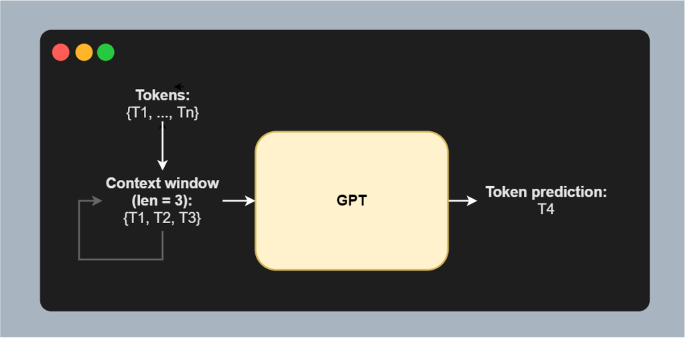
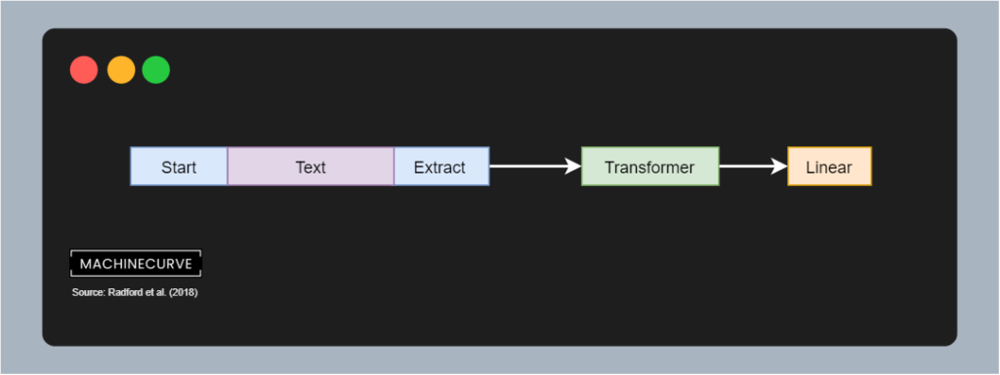
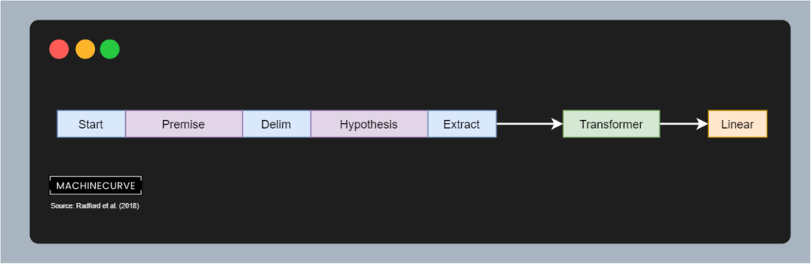
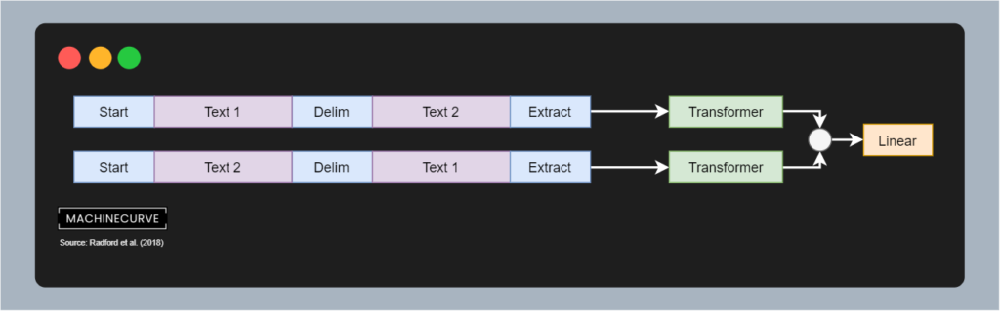
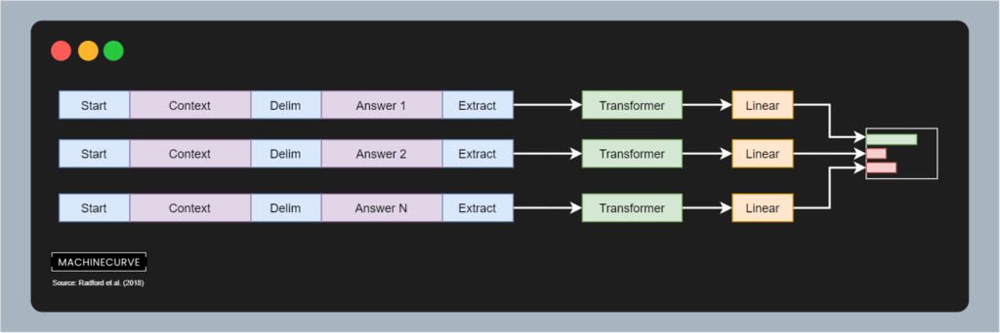

Natural Language Processing is one of the fields where Machine Learning has really boosted progress in the past few years. One of the reasons why there was such progress is of course the [Transformer architecture](https://www.machinecurve.com/index.php/2020/12/28/introduction-to-transformers-in-machine-learning/) introduced in 2017. However, in addition to that, it's unlikely that you haven't heard about the **GPT** **class** of language models. This class, which includes the GPT-2 and GPT-3 architectures, has been attracting global attention since they can produce text which resembles text written by humans.

In fact, Microsoft has acquired an [exclusive license to the GPT-3 language model](https://blogs.microsoft.com/blog/2020/09/22/microsoft-teams-up-with-openai-to-exclusively-license-gpt-3-language-model/), which will likely give it a prominent role in its cloud environment. In addition to that, many other cloud services using GPT-like models are seeing the light of day. Language models like these can possibly change the world of text in unprecedented ways.

But how does the GPT class of models work? In this article, we'll cover the first model from that range: the **OpenAI GPT** (i.e. GPT-1) model. It was proposed in a 2018 paper by Radford et al. and produced state-of-the-art at the time. This article will explain the GPT model as intuitively as possible.

It is structured as follows. Firstly, we'll take a look at performing semi-supervised learning in NLP models - i.e., pretraining on large unlabeled corpora (the unsupervised part) and subsequent fine-tuning on relatively small, labeled corporate (the supervised part). Using this approach, it becomes possible to use the large, pretrained model for building a very task-specific model.

Following this is the actual introduction as GPT. We're going to find out how it utilizes the decoder segment [of the original Transformer](https://www.machinecurve.com/index.php/2020/12/28/introduction-to-transformers-in-machine-learning/) as its base architecture. We will also cover the hyperparameters used for training the decoder segment in pre-training and in fine-tuning. This way, you'll understand how GPT works in detail - without a lot of heavy maths. Looking at fine-tuning, we will also cover the variety of tasks that the GPT model was fine-tuned on, and see how it performs.

Finally, we are going to look at a few extra takeaways of the GPT paper. We'll find out what the effect is of 'locking' certain layers of the pretrained model in terms of performance deterioriation. We'll also see that the pretrained model shows zero-shot behavior, meaning that _some_ performance is achieved when it has not had _any_ fine-tuning. This suggests that the unsupervised language model also learns to recognize linguistic patterns within the text. Finally, we'll compare the performance of Transformer based architectures for semi-supervised learning to that of [LSTMs](https://www.machinecurve.com/index.php/2020/12/29/a-gentle-introduction-to-long-short-term-memory-networks-lstm/).

* * *

\[toc\]

* * *

## How GPT is trained: Semi-supervised learning for NLP

Before we can take a look at how GPT works (and how it is trained precisely), we must take a look at the general approach that it utilizes. According to Radford et al. (2018), GPTs fall under the category of semi-supervised learning.

> Our work broadly falls under the category of semi-supervised learning for natural language. This paradigm has attracted significant interest, with applications to tasks like sequence labeling or text classification.
> 
> Radford et al. (2018)

Semi-supervised learning is composed of an _unsupervised_ component and a _supervised_ component (hence the name _semi-_supervised). They are the following:

1. **Pretraining**, which is _unsupervised_, utilizes an unlabeled corpus of (tokenized) text. Here, the goal is not to find a model that works well for a specific task, but rather to find a good _initialization point_ from which to start when learning for a specific task (Radford et al., 2018).
2. **Fine-tuning**, which is _supervised_, utilizes a labeled corpus of (tokenized) text specifically tailored to a specific language task, such as summarization, text classification or sentiment analysis.

The approach has attracted significant interest because it demonstrates to improve the performance of language models significantly (Radford et al., 2018). One of the key reasons for this observation is that there is a scarcity of labeled datasets; they are often also labeled for one particular domain. Unlabeled text, however, _does_ contain all the patterns, but has no labels. It is also much more abundant compared to labeled text. If we can extract certain linguistic patterns from the unlabeled text, we might find a better starting point from which to specialize further. For this latter job, we can use the labeled but often much smaller dataset.

Semi-supervised learning for natural language has been visualized in the figure below. In green, we can see three tasks: a pretraining task and two finetuning tasks. The pretraining task utilizes a large corpus of unlabeled text to pretrain the model. Using the pretrained model, we can then use different corpora that are task-oriented for finetuning. The outcome is a model that is finetuned to a specific task, but which benefits from pretraining significantly (Radford et al., 2018).

* * *

## How GPT works: an introduction

Now that we know what semi-supervised learning for natural language involves, we can actually take a look at GPT and how it works. We'll do this in three parts. Firstly, we're going to take a look at the _architecture_ - because we'll need to understand the model that is trained first. The next thing we'll cover is the _pre-training task_, which is formulated as a language modeling task. Finally, we're going to cover _fine-tuning_ and give you a wide range of example tasks that the pre-trained GPT model can specialize to, as well as the corresponding datasets (Radford et al., 2018).

### Using the Transformer decoder segment

From the original article about the [Transformer architecture](https://www.machinecurve.com/index.php/2020/12/28/introduction-to-transformers-in-machine-learning/), we know that the version proposed by Vaswani et al. (2017) is composed of an **encoder segment** and a **decoder segment**.

The encoder segment converts the original sequence into a hidden and intermediary representation, whereas the decoder segment converts this back into a target sequence. Being a classic [Seq2Seq model](https://www.machinecurve.com/index.php/2020/12/29/differences-between-autoregressive-autoencoding-and-sequence-to-sequence-models-in-machine-learning/), the classic Transformer allows us to perform e.g. translation using neural networks.

The GPT based Transformer extends this work by simply taking the decoder segment and stacking it 12 times, like visualized here:

As you can see, it has both the masked multi-head attention segment, the feed forward segment, the residuals and their corresponding addition & layer normalization steps.

This, in other words, means that:

1. First, the (learned) [embedding](https://www.machinecurve.com/index.php/2020/12/28/introduction-to-transformers-in-machine-learning/#output-embedding) is [position embedded](https://www.machinecurve.com/index.php/2020/12/28/introduction-to-transformers-in-machine-learning/#positional-encoding_1) (which contrary to the classic Transformer is also performed using a learned embedding).
2. The input is then served to a [masked multi-head attention segment](https://www.machinecurve.com/index.php/2020/12/28/introduction-to-transformers-in-machine-learning/#masked-multi-head-attention), which computes self-attention in a [unidirectional way](https://www.machinecurve.com/index.php/question/what-are-unidirectional-language-models/). Here, the residual is added and the result is layer normalized.
3. The result is then passed through a position-wise feedforward network, meaning that every token is passed individually and that the result is merged back together. Once again, the residual is added and the result is layer normalized.
4. The outcome either passes to the next decoder segment or is the output of the model as a whole.

### Pre-training task

Pretraining of the GPT Transformer is performed with the [BooksCorpus dataset](https://www.machinecurve.com/index.php/question/what-does-the-bookscorpus-dataset-look-like/). This dataset, which is unfortunately not wholly distributed anymore but can be reconstructed (see the link for more information), contains more than 7.000 unpublished books (Radford et al., 2018). It includes many genres and hence texts from many domains, such as adventure, fantasy and romance.

An excerpt from the corpus, [found here](https://twitter.com/theshawwn/status/1301852133319294976), is as follows:

> _April Johnson had been crammed inside an apartment in San Francisco for two years, as the owners of the building refurbished it, where they took a large three story prewar home and turned it into units small enough where she felt a dog’s kennel felt larger than where she was living and it would be a step up. And with the walls so thin, all she could do was listen to the latest developments of her new neighbors. Their latest and only developments were the sex they appeared to be having late at night on the sofa, on the kitchen table, on the floor, and in the shower. But tonight the recent development occurred in the bed. If she had her way she would have preferred that they didn’t use the bed for sex because for some reason it was next to the paper thin wall which separated her apartment from theirs._

Once more: pretraining happens in an unsupervised way, meaning that there are no labels whatsoever in order to help us steer the training process into the right direction. What we can do with our large corpus of tokens \[latex\]\\{T\_1, ..., T\_n\\}\[/latex\] however is applying a (sliding) **context window** of length \[latex\]k\[/latex\]. In other words, we can structure our text into the following windows: \[latex\]\\{T\_1, T\_2, T\_3\\}\[/latex\], \[latex\]\\{T\_2, T\_3, T\_4\\}\[/latex\], and so on, here with \[latex\]k = 3\[/latex\].

If we then feed a context window to the GPT model, we can predict the next token - e.g. \[latex\]T\_4\[/latex\] in the case of the \[latex\]\\{T\_1, T\_2, T\_3\\}\[/latex\] window:

The goal is then to maximize the following loss function. Here is what optimization of GPT looks like:

Source: Radford et al. (2018)

This function is a really complex way of writing down the following:

- For each token \[latex\]T\_i\[/latex\] (in the formula also called \[latex\]u\_i\[/latex\]) in the corpus \[latex\]U\[/latex\], [we compute log loss](https://www.machinecurve.com/index.php/2019/10/22/how-to-use-binary-categorical-crossentropy-with-keras/) of the probability that it occurs given the context window \[latex\]u\_{i-k} \\rightarrow u\_{1-1}\[/latex\], i.e. the \[latex\]k\[/latex\] tokens prior to token \[latex\]i\[/latex\].
- In plain English, this means: we let the model output the probability that token \[latex\]u\_i\[/latex\] is the next token given the context window of length \[latex\]k\[/latex\], and compute log loss for this probability, indicating how off the prediction is.
    - In the image on the right, you can see that when the prediction is 100% correct, loss is 0; when it gets worse, loss increases exponentially.
- If we sum this together for all tokens \[latex\]i \\in U\[/latex\], we get the loss as a whole and we can perform backpropagation based error computation and subsequent optimization. In fact, GPT is optimized with [Adam](https://www.machinecurve.com/index.php/2019/11/03/extensions-to-gradient-descent-from-momentum-to-adabound/#adam) with a learning rate schedule with a maximum rate of 2.5e-4.

Radford et al. (2018) ran the training process for 100 epochs with a [minibatch](https://www.machinecurve.com/index.php/2019/10/24/gradient-descent-and-its-variants/) approach using 64 randomly sampled batches of 512 tokens per batch.

> Our approach requires an expensive pre-training step - 1 month on 8 GPUs. (...) The model does fine-tune to new tasks very quickly which helps mitigate the additional resource requirements.
> 
> OpenAI (2020)

Environmentally, pretraining the GPT model is not efficient. As you can see above, the whole pretraining operation - the full 100 epochs - cost 1 month and required the full utilization of 8 GPUs. Fortunately, OpenAI released the model weights for the pretrained model jointly with their paper. This means that we can use the pretrained GPT model for fine-tuning to more specific tasks. This, according to OpenAI, can be performed really quickly. That's some better news!

Let's now take a look at how we can use the pretrained model for fine-tuning.

### Fine-tuning task

Once the GPT model has been pretrained, it can be finetuned. This involves a labeled dataset, which Radford et al. (2018) call \[latex\]C\[/latex\]. Each instance contains a sequence of tokens \[latex\]\\{x^2, x^2, ..., x^m\\}\[/latex\], as well as a label \[latex\]y\[/latex\]. The sequence is passed through the pretrained Transformer architecture, which then is passed through a linear layer with weights \[latex\]W\_y\[/latex\] and [Softmax activation](https://www.machinecurve.com/index.php/2020/01/08/how-does-the-softmax-activation-function-work/) for [multiclass prediction](https://www.machinecurve.com/index.php/2020/10/19/3-variants-of-classification-problems-in-machine-learning/).

In other words, we predict pseudoprobabilities over all the classes (which are task-specific). For example, these are possible tasks and corresponding classes:

- **Classification problem (e.g. sentiment analysis):** two or more classes (e.g. positive, neutral and negative in the case of sentiment analysis).
- **Textual entailment:** two classes (is next, is not next).
- **Similarity:** one class outcome from two options.
- **Multiple choice:** one class outcome from multiple options.

By taking the `argmax` of the outcome, we cna find the class that is most likely.

#### Textual representation during finetuning

We saw above that during fine-tuning text is fed to the Transformer as a sequence of tokens. Obviously, there are many finetuning tasks, four of which have been defined above; they were retrieved from Radford et al.'s work.

As these tasks are all different, we must also represent texts differently when inputting them to the model.

Take **classification**, with sentiment analysis as an example. When we perform classification, we simply tokenize the text, add a <Start> and <Extract> token, and feed it to the Transformer. By sticking a Linear layer on top of it, e.g. with a [binary or multiclass loss function](https://www.machinecurve.com/index.php/2019/10/22/how-to-use-binary-categorical-crossentropy-with-keras/) with Softmax for activation, we can create a model that classifies text.

If the task is related to **textual entailment**, i.e. showing directionality in text, we structure text slightly differently. First of all, the <Start> and <Extract> tokens are present again, but we now also have got a <Delim> token. This token separates a _premise_ sequence from a _hypothesis_ sequence. Here, the premise can be "If you're sick, you cannot go to school." whereas the hypothesis can be "It is legal to not go to school if you're not feeling well".

Another use case for GPT is **similarity detection**. Here, we also see the <Start>, <Delim> and <Extract> tokens again, but the application as a whole is structured a bit differently. As you can see, we cannot assume that text 1 is always preceding text i.e. assume any directionality between texts. For this reason, Radford et al. (2018) fine-tune GPT for simliarity detection by feeding the sequences in opposite order through the Transformer, simply adding together the Transformer outcomes, before feeding them to a linear classifier for similarity detection (i.e. similar / not similar and possibly with what score).

Finally, there's **question answering** and **common sense reasoning**. In the case of question answering, a context and answer with corresponding <Start>, <Delim> and <Extract> tokens is passed through the GPT Transformer and fed to a Linear model. In the case of **common sence reasoning** (i.e. multiple choice based reasoning about common sense), we do this for each answer, then perform a Softmax based operation on the outcomes of all the Linear layers. Jointly trained, the model then learns to perform common sense reasoning.

As you can see, the GPT Transformer can be fine-tuned on a wide variety of tasks given the pretrained model. This requires structuring the text a bit differently given the use case and possibly the dataset, but the same architecture and pretrained model can be used over and over again. This is one of the reasons why GPT is used quite widely these days and why it is present in e.g. the [HuggingFace Transformers library](https://www.machinecurve.com/index.php/getting-started-with-huggingface-transformers/).

* * *

## Extra takeaways

Let's now take a look at three extra takeaways from the Radford et al. (2018) papers, which they achieved through ablation studies:

1. **Whether fine-tuning more layers of the model yields better performance**.
2. **Whether zero-shot learning provides some accuracy.** In other words, whether _not_ performing any epochs and measuring the performance of the fine-tuning task yields some performance to begin with. If so, this suggests that the pretrained model itself is capable of understanding some language.
3. **What the performance differences are between [LSTM networks](https://www.machinecurve.com/index.php/2020/12/29/a-gentle-introduction-to-long-short-term-memory-networks-lstm/) and (GPT based) Transformer ones**.

### More layers used in finetuning means better performance

First of all, the number of Transformer layers that was fine-tuned. Recall that in any form of transfer learning, it is not necessary that the _whole_ model is transferred. In fact, we can 'lock' certain layers to keep them untouched during fine-tuning. Radford et al. (2018) find that the more layers remain unlocked, the better the fine-tuned model performs. This was not entirely unexpected.

### Zero-shot learning provides (some) accuracy

What's more and perhaps more surprising is that zero-shot learning provides some accuracy on a variety of language tasks. Zero-shot learning here means that the model is used for performing the downstream tasks _without_ being finetuned first, i.e. by using the pretrained model.

Surprisingly, this zero-shot approach indicates that the pretrained model performs relatively poorly on the downstream tasks, but does show _some_ performance. This suggests that pretraining supports the learning of a wide variety of task relevant functionality (Radford et al., 2018). In other words, it explains why pretraining does significantly improve language models.

### Transformers vs LSTMs

In finding the effectiveness of the GPT Transformer based model, Radford et al. (2018) have also trained a 2048 unit single layer [LSTM network](https://www.machinecurve.com/index.php/2020/12/29/a-gentle-introduction-to-long-short-term-memory-networks-lstm/). On average, across many of the tasks, the performance of the network dropped significantly when doing so. This clearly demonstrates that Transformer based models in general and GPT in particular _does_ improve performance compared to previous approaches.

* * *

## Summary

In this article, we have introduced the OpenAI GPT model architecture used for language modeling. It is a Transformer-based approach and one of the many articles that will follow about Transformers and the specific architectures. In doing so, we first saw that GPT based models are trained in a semi-supervised approach, with a general pretraining step followed by task-specific fine-tuning.

We then proceeded by looking at how GPT works: we saw that it uses the decoder segment from the original Transformer, which is pretrained on the BooksCorpus dataset in an autoregressive way. Once pretrained, which takes a significant amount of time (one month!), we can use it to perform specific fine-tuning. There is a wide variety of datasets (including your own) that can be used for this purpose. We did see however that texts must be structured in a particular way when fine-tuning is to be performed. More specifically, we also looked at represent text in the case of classification tasks, textual entailment tasks, question answering tasks and similarity detection tasks.

To finalize, we also appreciated three extra takeaways from the Radford et al. (2018) paper that may be present across many Transformed based approaches. Firstly, we saw that fine-tuning more layers yields better performing models compared to when only one or a few layers (i.e. Transformer segments) are fine-tuned. Secondly, we saw that zero-shot learning (i.e. performing the fine-tuned task with the pretrained model, so without extra finetuning epochs) already provides some performance. This suggests that pretraining _really_ provides the performance boost that we suspected it to provide. Thirdly, and finally, the GPT architecture also demonstrates that the Transformer based architecture performs much better than previous LSTM-based approaches, as was experimentally identified during an ablation study.

[Ask a question](https://www.machinecurve.com/index.php/add-machine-learning-question/)

I hope that you have learned something from this article. If you did, please feel free to leave a message in the comments section 💬 Please do the same if you have any questions, or use the **Ask Questions** button on the right. I'd love to hear from you :)

Thank you for reading MachineCurve today and happy engineering! 😎

* * *

## References

Radford, A., Narasimhan, K., Salimans, T., & Sutskever, I. (2018). [Improving language understanding by generative pre-training](https://www.cs.ubc.ca/~amuham01/LING530/papers/radford2018improving.pdf).

OpenAI. (2020, March 2). _Improving language understanding with unsupervised learning_. [https://openai.com/blog/language-unsupervised/](https://openai.com/blog/language-unsupervised/)
